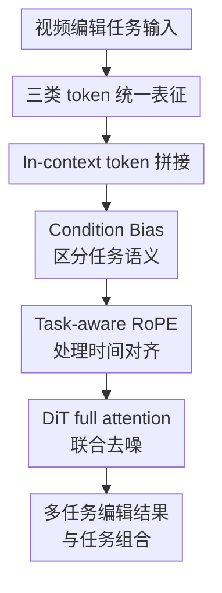

# Unified In-Context Video Editing

**会议**: ICLR2026  
**OpenReview**: [https://openreview.net/forum?id=Vb4nE3WWf5](https://openreview.net/forum?id=Vb4nE3WWf5)  
**论文**: [OpenReview](https://openreview.net/forum?id=Vb4nE3WWf5)  
**代码**: 项目页 https://zixuan-ye.github.io/UNIC  
**领域**: 视频生成 / 视频编辑 / 扩散模型  
**关键词**: in-context video editing, 视频编辑, 多任务统一, DiT, 条件控制  

## 一句话总结
UNIC 把源视频、多模态编辑条件和目标视频噪声 latent 都表示成同一条 token 序列，让视频 DiT 直接用原生全注意力在 context 里完成 ID 插入/替换/删除、风格化、首帧传播和重相机控制，并通过 Task-aware RoPE 与 Condition Bias 缓解多任务混淆。

## 研究背景与动机

**领域现状**：视频生成模型已经从单纯 text-to-video 逐渐走向可控编辑。真实编辑需求往往不是一句 prompt 就能表达，而是要同时参考原视频的运动和场景、某张目标物体图、某张风格图、第一帧编辑结果，甚至每一帧的相机轨迹。因此，视频编辑任务自然呈现出多模态、多任务、强时序约束的形态。

**现有痛点**：已有方法大致有两条路。一类方法先对参考视频做 DDIM inversion，把反演得到的噪声或中间特征带入生成过程，用来保留结构和运动；这类方法通常推理慢，而且额外反演阶段会把编辑流程拆成两段。另一类方法给不同条件加专门 adapter 或 ControlNet，例如参考视频一个模块、ID 图一个模块、风格图一个模块、相机控制又一个模块；这种设计在单任务上有效，但每扩展一种条件都要改网络或加模块，参数和工程复杂度都会堆起来。

**核心矛盾**：视频编辑真正想要的是“同一个模型根据当前给出的 context 判断该做什么”，但不同任务的条件形态差别很大。相机 pose 与视频逐帧对齐，风格图却影响整段视频；同样是一张图，它可能表示待插入物体 ID，也可能表示艺术风格。如果只是把所有条件粗暴拼起来，模型会遇到两个具体问题：时间位置索引会碰撞，任务语义也会混淆。

**本文目标**：作者想把多种典型视频编辑任务收进一个统一框架，而不是为每个任务训练独立结构。这个目标可以拆成三件事：先把不同任务的输入归约到统一 token 表达；再让 DiT 在不增加任务专属控制模块的情况下直接建模这些 token 的关系；最后解决多任务统一时的位置编码和任务辨识问题。

**切入角度**：论文借鉴了统一图像生成/编辑模型的 in-context 思路：既然 DiT 本身就是 transformer，那么条件不一定要通过外部 adapter 注入，也可以作为输入序列的一部分参与 attention。对于视频编辑来说，关键不是“有没有条件模块”，而是“条件 token、源视频 token 和待生成视频 token 是否能在同一注意力空间里正确对齐”。

**核心 idea**：UNIC 用一条连续 token 序列统一表示“目标噪声 latent + 源视频 + 多模态条件”，再用任务感知 RoPE 和可学习 Condition Bias 告诉模型哪些 token 按帧对齐、哪些 token 是任务槽位，从而把多种视频编辑变成同一个 DiT 的 in-context 条件生成问题。

## 方法详解

### 整体框架
UNIC 面向的是给定参考视频 $V_{ref}$ 和若干条件 $\{C_i\}$，生成满足条件且保留必要内容的目标视频 $V_{tar}$。它不做 DDIM inversion，也不给每种条件加专门控制模块，而是把所有输入都 token 化后沿帧维拼成一个模型输入：目标视频的 noisy tokens、参考视频 tokens、多模态条件 tokens。

在生成时，目标视频 latent $z_{tar}$ 从噪声开始；参考视频通过 3D VAE 得到 $z_{ref}$；图像条件同样可经 3D VAE 编码，文本由 T5 tokenizer 处理，相机 pose 则由 MLP 投到与视频 token 对齐的维度。最终输入写成 $z=[z_{tar};z_{ref};z_{cond}]$，DiT 的 3D full attention 直接在这条序列上让源视频、条件和目标视频交互。

这个框架的重点是把“任务类型”从网络结构转移到 context 本身。ID 插入、ID 替换、ID 删除、风格化、首帧传播和重相机控制使用同一个模型，只是给进去的条件 token 不同；如果把 ID 图和风格图同时放进 context，模型还能表现出一定的任务组合能力。

### 关键设计

**1. 三类 token 统一表征：把视频编辑任务改写成同一种条件生成格式**

UNIC 先把看似不同的编辑任务归纳为三类输入。第一类是 noisy tokens，也就是目标视频 latent 在扩散/flow matching 过程中的当前状态，它承载“要被生成的东西”。第二类是 reference video tokens，由参考视频经 3D VAE 编码得到，提供原视频的运动、场景和需要保留的内容。第三类是 multi-modal condition tokens，包含文本、ID 图、风格图、第一帧、相机 pose 等任务特定条件。

这种划分解决的是“任务接口不统一”的问题。以 ID 插入为例，参考视频给出背景和运动，ID 图给出待插入对象，文本描述目标语义；以重相机控制为例，参考视频更像软内容指导，相机 pose 则给出逐帧视角变化。它们在外观上是不同任务，但在 UNIC 里都变成“目标 noisy tokens 读取参考视频和条件 token 中的信息”。因此模型不需要知道自己正在调用哪个 adapter，只需要从当前 context 中学习该怎么编辑。

**2. In-context token 拼接：用 DiT 原生注意力替代任务专属控制模块**

传统 adapter 路线通常把条件先编码成特征，再通过额外模块注入到扩散模型里。UNIC 反过来利用 transformer 的本性：只要把条件变成 token，就让它们直接进入同一条序列。论文把多模态条件写成 $z_{cond}=[z_1;\ldots;z_N]$，再与目标 noisy token 和参考视频 token 拼接为 $z=[z_{tar};z_{ref};z_{cond}]$。后续的 3D self-attention 既能看空间，也能跨时间、跨条件交互。

这个设计的优势在于参数和任务扩展都更轻。新增一个条件类型时，主要需要一个把该条件变成合适 token 的 tokenizer，例如相机 pose 用 MLP，图像继续用 VAE；核心 DiT 不需要为每个条件新接一套控制分支。它也让任务组合更自然，因为组合任务只是 context 里同时出现多个条件，而不是推理时强行叠多个 LoRA 或 adapter，减少不同控制模块互相冲突的机会。

**3. Condition Bias：让同模态条件带上任务身份，避免风格图和 ID 图混淆**

直接拼接 token 会带来任务歧义。最典型的情况是图像条件：一张图在 ID 插入里表示“请把这个物体放进视频”，在风格化里表示“请把整段视频变成这种风格”。如果模型只看到图像 token，而没有额外任务身份，同一模态的条件就可能被误读。

UNIC 的做法是在每个条件 token 上加一个可学习的任务 bias。对条件集合里的 $z_i\in\{z_{ref},z_1,\ldots,z_N\}$，模型注入 $b_i\in\mathbb{R}^d$ 得到 $\tilde{z_i}=z_i+b_i$。这个 bias 不改变 token 维度，也不引入复杂模块；它像一个轻量任务标签，让 attention 在表示空间里感知“这批 token 是 ID、风格、相机还是参考视频”。论文还强调这些 bias 零初始化，因此开始训练时不会破坏原 token 语义，之后再逐渐学出任务区分。

**4. Task-aware RoPE：按任务关系分配时间位置，解决长度变化和对齐冲突**

视频编辑的另一个难点是位置编码。标准 3D RoPE 会沿帧维顺序给 token 编号，如果目标视频、参考视频和相机 pose 依次占据 $0\ldots N-1$、$N\ldots2N-1$、$2N\ldots3N-1$，那参考视频第 $t$ 帧和目标第 $t$ 帧反而位置不同；视频长度 $N$ 变化时，条件边界也会跟着漂移。对于逐帧对齐的条件，这会直接损伤时序对应关系。

Task-aware RoPE 根据条件类型分两类处理。对参考视频、相机 pose、音频这类与视频帧有直接对应关系的条件，复用目标 noisy latent 的帧索引 $0\ldots N-1$，让第 $t$ 帧条件和第 $t$ 帧目标处在一致时间坐标。对 ID 图、风格图这类不逐帧对应的条件，则从基准偏移 $m=N$ 后再加任务专属偏移 $O_t$ 和槽位长度 $L_t$，即 $Index(t)=(m+O_t)+[0,\ldots,L_t-1]$。例如 ID 图可占用 $N+100$ 起的若干槽位，风格图占用 $N+200$ 的槽位。这样既避免不同条件撞到同一位置，也让非逐帧条件拥有稳定的任务槽位。

### 一个完整示例
假设用户要做“ID 插入 + 风格化”的组合编辑：源视频是一段人在街上行走的视频，ID 参考图是一件要插入的特殊外套，风格参考图是一张像素艺术图。UNIC 不需要切换模型，也不需要加载两个 adapter。它先把源视频编码成 $z_{ref}$，把外套图编码到 ID 条件槽位，把风格图编码到风格条件槽位，再把目标视频噪声 $z_{tar}$ 放在序列开头。

进入 DiT 后，Condition Bias 让模型知道外套图对应局部对象身份，风格图对应全局外观转换；Task-aware RoPE 让源视频中每一帧的动作和目标视频帧保持时间联系，而 ID/风格图则待在各自非逐帧条件槽位里。去噪过程中，目标视频 token 一边从参考视频 token 读取运动和背景，一边从 ID token 读取要插入的对象外观，同时从风格 token 读取整体艺术风格。最终输出就不是两个任务后处理的串联，而是一次联合条件生成得到的编辑视频。

### 损失函数 / 训练策略
论文继承基于 flow matching 的视频扩散 transformer。训练时从真实视频样本 $x_1\sim p(x_1)$ 和高斯噪声 $x_0\sim\mathcal{N}(0,1)$ 构造 $x_t=tx_1+(1-t)x_0$，模型预测从噪声到数据的速度场，目标为：

$$
L_{FM}(\theta)=\mathbb{E}_{t,x_0,x_1}\|v_\theta(x_t,t)-(x_1-x_0)\|_2^2.
$$

采样时对应的 ODE 为 $\frac{dx_t}{dt}=v_\theta(x_t,t)$，从随机噪声逐步得到视频。模型本体包含多个标准 DiT block，每个 block 有 2D self-attention、3D self-attention、cross-attention 和 FFN；训练时冻结 3D VAE 与 T5 tokenizer，只微调 transformer 模块以及新引入的 tokenizer，例如相机 pose 的 MLP。

多任务训练不是简单从头混在一起。作者观察到不同任务收敛难度差异很大：重相机控制需要约 600k iterations 才能充分收敛，而 ID swap 这类任务约 80k iterations 就有较好效果。若从易任务开始或直接联合训练，简单任务的 loss 下降更快，容易占用模型容量，困难任务学不充分。因此 UNIC 采用 hard-to-easy 的顺序训练，先训练重相机控制，再逐步加入 ID、风格化和传播等任务。论文实际 finetuning 从内部 1B 预训练模型出发，在 32 张 H800 上训练 16k iterations，batch size 为 64。

## 实验关键数据

### 主实验
论文构建了一个统一视频编辑 benchmark，覆盖六类任务：ID Insert、ID Swap、ID Delete、Re-Camera Control、Stylization 和 Propagation。训练数据方面，ID 相关和风格化使用自建数据，传播任务复用 ID/风格化成对数据的首帧，重相机控制使用 ReCamMaster 的 Multi-Cam Video Dataset。评估同时看任务指标和视频质量，例如 ID 任务看 CLIP-I/DINO-I，风格化看 CSD-score/ArtFID，重相机控制看 RotErr/TransErr，视频整体质量看 smoothness、dynamic、aesthetic 等。

| 任务 | 代表指标 | 强基线 | UNIC | 结论 |
|------|----------|--------|------|------|
| ID Insert | CLIP-I / DINO-I / Aesthetic | Pika: 0.689 / 0.387 / 5.393 | 0.598 / 0.245 / 5.627 | 身份相似度不总是最高，但美学分更高，且同一模型支持多任务 |
| ID Swap | CLIP-I / DINO-I / CLIP-score | VACE: 0.712 / 0.423 / 0.230 | 0.725 / 0.429 / 0.242 | 在身份和文本对齐上超过统一基线与传播式变体 |
| ID Delete | PSNR / RefVideo-CLIP / CLIP-score | VideoPainter: 22.987 / 0.920 / 0.212 | 19.171 / 0.900 / 0.217 | 专用 inpainting 在重建上更强，UNIC 在语义对齐和部分质量指标上更好 |
| Propagation | RefVideo-CLIP / Smoothness / Aesthetic | AnyV2V: 0.812 / 0.935 / 5.136 | 0.840 / 0.966 / 5.565 | 首帧传播的帧对齐和视频质量更稳定 |
| Stylization | CSD-score / ArtFID / Aesthetic | StyleMaster: 0.306 / 38.213 / 5.121 | 0.259 / 37.619 / 5.276 | 风格相似度略低于专用模型，但内容/质量指标有竞争力 |
| Re-Camera | RotErr / TransErr / Smoothness | ReCamMaster-Wan: 1.454 / 5.695 / 0.917 | 1.275 / 5.667 / 0.933 | 相机控制误差更低，说明统一框架没有牺牲困难任务 |

与 LoRA 和 adapter 的比较集中在 ID Insert/Swap。UNIC 在不新增任务专属控制模块的情况下取得更高指标，尤其说明“把条件放进 context + full attention”不是单纯参数更省，而是能更好利用条件之间的交互。

| 方法 | 任务 | FLOPs / Params | CLIP-I | DINO-I | CLIP-Score | 说明 |
|------|------|----------------|--------|--------|------------|------|
| Adapter-based | ID Insert | 51.73T / 1.65B | 0.505 | 0.190 | 0.158 | 额外控制模块参数更多，但条件融合较弱 |
| LoRA | ID Insert | 69.29T / 1.20B | 0.537 | 0.222 | 0.193 | 适合单任务微调，不擅长任务组合 |
| Full Finetuning | ID Insert | 69.29T / 1.20B | 0.528 | 0.242 | 0.203 | 直接微调仍低于 in-context 方案 |
| UNIC | ID Insert | 69.29T / 1.20B | 0.568 | 0.254 | 0.227 | 指标最好，结构仍保持统一 |
| UNIC + step cache | ID Insert | 39.28T / 1.20B | 0.558 | 0.249 | 0.232 | 计算量下降，语义对齐仍保持竞争力 |
| Adapter-based | ID Swap | - | 0.694 | 0.417 | 0.221 | 单独 adapter 不如统一 token 交互 |
| LoRA | ID Swap | - | 0.713 | 0.433 | 0.230 | DINO-I 高，但 CLIP-I/CLIP-score 低于 UNIC |
| UNIC | ID Swap | - | 0.732 | 0.449 | 0.238 | 三项指标均最高 |

### 消融实验

| 配置 | 关键指标 | 说明 |
|------|---------|------|
| hard-to-easy 训练 | ReCam RotErr 1.275，TransErr 5.667，ID CLIP-I 0.725 | 从困难任务到简单任务的顺序整体最稳，尤其保住重相机控制 |
| easy-to-hard 训练 | ReCam RotErr 1.398，TransErr 5.681，ID CLIP-I 0.726 | 简单任务表现接近，但困难任务略弱 |
| 从头联合训练 | ReCam RotErr 2.287，TransErr 9.694，ID CLIP-I 0.713 | 容易学会简单任务，却明显学不好重相机控制 |
| 任务专用模型 | ID DINO-I 0.449，Style CSD 0.234，ReCam RotErr 1.472 | 单任务模型在部分指标强，但不能自然组合任务 |
| 统一模型 | ID DINO-I 0.429，Style CSD 0.259，ReCam RotErr 1.275 | 多任务统一没有明显拖垮单任务，风格和相机指标反而更好 |
| 无 Condition Bias + 无 Task-aware RoPE | ReCam TransErr 8.972，CamMC 13.119 | 简单任务尚可，但复杂时序控制明显失败 |
| 仅 Condition Bias | ID CLIP-I 0.723，ReCam TransErr 6.039 | 任务辨识改善，尤其同模态条件更不易混淆 |
| 仅 Task-aware RoPE | ReCam RotErr 1.304，CamMC 6.498 | 时间对齐改善明显，但任务语义区分不足 |
| Condition Bias + Task-aware RoPE | ReCam RotErr 1.275，TransErr 5.667，CamMC 6.154 | 两者互补，是完整模型表现最稳的配置 |

### 关键发现
- 统一训练并不必然牺牲单任务效果。论文的 B4 统一模型在 re-camera 的 RotErr/TransErr/CamMC 上都优于 camera-only 模型，在 stylization 的 CSD-score 上也更高；代价是风格化的内容保留指标 CFSD 略差，说明共享训练会改变“保留内容”和“迁移风格”的平衡。
- Condition Bias 和 Task-aware RoPE 解决的是两个不同问题。前者偏语义，让同样是图像的条件不被误读；后者偏几何和时序，让逐帧条件与目标视频帧保持同一时间坐标。单独用任何一个都不如组合完整。
- 任务难度不均衡是多任务视频编辑的核心训练问题。直接 joint training 对简单任务还可以，但对重相机控制损伤很大；hard-to-easy 训练说明统一模型需要课程式调度，而不是把数据混起来就结束。
- 论文附录显示统一框架还有迁移收益：基于 ID swap 知识微调 propagation，只需 0.4k steps 就达到 RefVideo-CLIP 0.820，而 propagation-only 训练 2k steps 是 0.792，说明任务之间确实共享了可复用的表示。

## 亮点与洞察
- **把控制接口变成 token 接口**：UNIC 最有价值的地方不是提出一个新 adapter，而是把视频编辑任务的工程接口统一为 token 序列。这样新增任务时，核心问题从“设计什么控制分支”变成“如何把条件 token 化并分配合适位置”。
- **位置编码是视频 in-context 编辑的关键细节**：图像统一生成里直接拼 token 往往就能工作，但视频多了逐帧对应关系。Task-aware RoPE 把“哪些条件应该与第 $t$ 帧对齐”显式写进位置索引，是这篇论文比简单 token 拼接更扎实的部分。
- **任务身份不一定要靠文字 prompt 表达**：附录里 text indication 的实验很有意思。给 caption 加任务类型文本能提高部分条件相似度，但会伤害视频一致性和相机控制；相比之下，Condition Bias + Task-aware RoPE 更像低层结构提示，不会让语言指令过度干扰视觉保真。
- **任务组合来自同一 attention 空间**：如果 ID、风格、相机这些条件都在同一个序列里，组合任务就不再是多个后处理步骤相乘，而是一次生成过程中的联合约束。这对更复杂的创作型视频编辑很有启发，例如“换主体 + 改镜头 + 加特效 + 保持原运动”。
- **统一模型需要训练课程**：多任务统一不是把六个 dataset concat 起来就行。困难任务收敛慢、简单任务收敛快，如果没有训练顺序或采样策略，模型会优先学会短路径任务。这个经验对其它多任务生成模型也适用。

## 局限与展望
- 当前统一范围仍然有限，只覆盖六类代表性任务。音频驱动 lip-sync、视觉特效、多镜头剪辑、多主体交互等更复杂编辑还没有纳入，无法证明该 token 化接口在更开放任务集合上仍能稳定扩展。
- 计算开销是明显瓶颈。所有条件都进入 full attention，token 数会随着参考视频、条件长度和分辨率增长；附录中单次推理仍需要约 22G 到 24G 显存，重相机控制每步约 3.66 秒。未来需要更高效的 in-context attention 或条件缓存机制。
- 统一模型在某些专用指标上仍不压倒 task specialist。例如 ID Insert 的 CLIP-I/DINO-I 低于 Pika，ID Delete 的 PSNR 低于 VideoPainter，Stylization 的 CSD-score 低于 StyleMaster。它的优势是统一性和组合能力，不是每个单项都必然最好。
- Task-aware RoPE 里的任务 offset 和 slot 长度仍带有人为设计色彩。若任务数量继续增加，如何自动分配位置槽、如何处理未知条件类型、如何避免 slot 规划变成新的工程负担，都是后续问题。
- 论文主要展示 benchmark 和定量指标，用户交互层面的评估不足。真实视频编辑往往需要多轮修改、局部 mask 控制和可解释失败反馈，这些并不是一次性条件生成 benchmark 能完全覆盖的。

## 相关工作与启发
- **vs DDIM inversion 类方法**: Video-P2P、FLATTEN、AnyV2V 等通过反演保留源视频结构，优点是能强绑定参考视频，缺点是推理多一个阶段且难统一多种条件。UNIC 不做反演，而是让参考视频 token 直接进 context，速度和接口更简洁，但在极端精确重建任务上可能不如专门反演/修复方法。
- **vs adapter / ControlNet 类方法**: VideoComposer、VideoAnyDoor、StyleMaster、VACE 等通常为不同条件设计额外模块。UNIC 的差别是把条件直接交给 DiT full attention，不再让结构随任务增长；它牺牲了一些任务专属结构的精细归纳偏置，换来更好的参数效率和组合灵活性。
- **vs VACE**: VACE 也是 all-in-one 视频创作/编辑方向，但仍依赖较重的 control block，并且条件类别更偏视觉帧/掩码。UNIC 更强调 in-context token 统一，可以容纳图像、文本、相机 pose 等多模态条件，且不为每个任务额外改主干结构。
- **vs OmniGen / OminiControl 等统一图像生成**: 这些方法证明了“把条件作为 token 直接输入 transformer”在图像生成中可行。UNIC 的启发是把这条路线扩展到视频编辑，并补上视频特有的时间位置编码问题；因此它更像是统一图像编辑思想在视频 DiT 上的一次任务化落地。
- **对后续工作的启发**: 可以把 UNIC 看作一个视频编辑任务 DSL 的雏形：不同任务由 context 中的 token 类型、位置槽和 bias 共同定义。未来如果能让 slot 分配、任务 bias 和条件 tokenizer 更自动化，就可能形成真正可扩展的多模态视频编辑基础模型。

## 评分
- 新颖性: ⭐⭐⭐⭐☆ 把 in-context token 统一用于多类视频编辑并配套 Task-aware RoPE，思路清楚且针对视频时序问题有实质设计。
- 实验充分度: ⭐⭐⭐⭐☆ 六任务 benchmark、SOTA 对比、LoRA/adapter 对比和多组消融都比较完整，但用户研究和更开放任务还不足。
- 写作质量: ⭐⭐⭐⭐☆ 动机、方法和实验逻辑顺畅，附录细节丰富；个别实验表格较密，部分指标解释需要读者自行串联。
- 价值: ⭐⭐⭐⭐⭐ 对统一视频编辑模型很有参考价值，尤其是条件 token 化、任务位置编码和 hard-to-easy 多任务训练策略都可迁移到后续工作。

<!-- RELATED:START -->

## 相关论文

- [\[ICLR 2026\] EditVerse: Unifying Image and Video Editing and Generation with In-Context Learning](editverse_unifying_image_and_video_editing_and_generation_with_in-context_learni.md)
- [\[ICLR 2026\] UniVideo: Unified Understanding, Generation, and Editing for Videos](univideo_unified_understanding_generation_and_editing_for_videos.md)
- [\[ICML 2026\] Lightning Unified Video Editing via In-Context Sparse Attention](../../ICML2026/video_generation/lightning_unified_video_editing_via_in-context_sparse_attention.md)
- [\[ICLR 2026\] Pixel-Perfect Puppetry: Precision-Guided Enhancement for Face Image and Video Editing](pixel-perfect_puppetry_precision-guided_enhancement_for_face_image_and_video_edi.md)
- [\[ICLR 2026\] Controllable First-Frame-Guided Video Editing via Mask-Aware LoRA Fine-Tuning](controllable_first-frame-guided_video_editing_via_mask-aware_lora_fine-tuning.md)

<!-- RELATED:END -->
