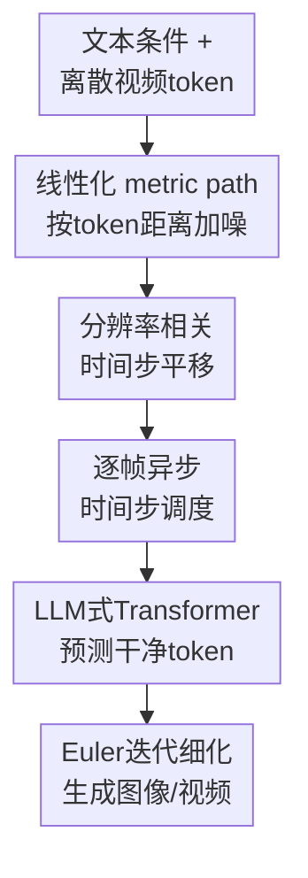

# Uniform Discrete Diffusion with Metric Path for Video Generation

**会议**: ICLR 2026  
**OpenReview**: [https://openreview.net/forum?id=GFU5yCbILk](https://openreview.net/forum?id=GFU5yCbILk)  
**论文**: OpenReview  
**代码**: https://github.com/baaivision/URSA  
**领域**: 视频生成 / 扩散模型  
**关键词**: 离散扩散, 视频生成, metric path, 长视频, 异步时间步调度

## 一句话总结
URSA 把图像和视频生成重新表述为离散视觉 token 上的全局迭代细化过程，用基于 token 嵌入距离的线性化 metric path、分辨率相关时间步平移和逐帧异步噪声调度，让离散扩散在文本到视频、图生视频和高分辨率图像生成上接近甚至追平一批连续扩散模型。

## 研究背景与动机
**领域现状**：当前高质量视觉生成基本由连续空间扩散或 flow matching 主导。图像、视频先被编码到连续 latent，再通过逐步去噪恢复内容，这类方法在画质、语义对齐和时序一致性上已经形成事实标准。与此同时，语言模型的成功说明离散 token 序列建模非常有扩展潜力，视觉生成里也出现了自回归视觉 token 模型和 masked token 生成模型。

**现有痛点**：离散视觉生成的问题不在于框架不优雅，而在于一进入高分辨率图像和长视频就容易暴露误差累积。自回归模型一旦前面 token 出错，后续会在错误上下文上继续生成；masked diffusion / MaskGIT 类方法虽然可以并行预测被 mask 的 token，但已经生成或置信度高的 token 往往缺少连续扩散那种反复修正的机会。视频场景更难，因为同一主体、背景和运动要跨很多帧保持一致，局部不可修正的生成范式很容易产生闪烁、动作不自然或长上下文漂移。

**核心矛盾**：离散 token 有利于统一文本和视觉序列，也适合复用 LLM 架构；但传统离散生成路径对视觉结构的扰动控制太粗，要么逐 token 固化，要么以 mask 比例近似噪声强度，缺少像连续扩散中 SNR / timestep 那样可解释、可调节的全局细化轨迹。长序列还带来另一个矛盾：同一个时间步对低分辨率短序列和高分辨率长视频的实际破坏程度并不等价。

**本文目标**：作者想解决三个具体问题：第一，让离散视觉生成也能像连续扩散一样从随机噪声出发、反复全局修正；第二，为不同分辨率和不同长度的视频提供可控的扰动路径；第三，用一个模型覆盖文本到视频、图生视频、插帧、外推和更长视频生成，而不是为每个任务单独设计条件形式。

**切入角度**：URSA 的观察是，视觉 tokenizer 的 codebook 并不是完全无结构的类别集合，token embedding 之间的距离携带了视觉相似性。如果把从噪声 token 到真实 token 的路径建立在这种 embedding 距离上，而不是只依赖 mask / unmask 或类别均匀混合，就可以在离散空间里获得更接近连续扩散的“距离逐步缩短”过程。

**核心 idea**：用 metric-guided probability path 在离散视觉 token 上做全局迭代细化，并通过时间步平移和逐帧异步调度把这个过程扩展到高分辨率图像、短视频和长视频多任务生成。

## 方法详解

### 整体框架
URSA 的输入是文本 token 和由视频 tokenizer 得到的离散时空视觉 token，输出是同一离散词表上的干净图像或视频 token。训练时，它先把真实视频 $x_1$ 按帧编码成 token，然后按 metric path 采样带噪 token $x_t$；模型看到文本条件 $e$ 和 $x_t$ 后预测原始干净 token。采样时则从均匀类别噪声 $x_0 \sim \mathrm{Unif}([K])^D$ 出发，用模型反复估计目标 token，再通过离散 flow matching 的速度场逐步更新整段视频。

这个框架和自回归模型最大的区别是，URSA 每一步都会面向整段离散 token 做全局更新，而不是从左到右固定已经生成的 token。它和普通 masked diffusion 的区别也很直接：URSA 的噪声状态不是“某些位置被 mask，某些位置已经确定”，而是每个 token 都沿着嵌入距离定义的概率路径逐渐靠近目标 token，因此中间状态始终可以被重新修正。

### 关键设计
**1. 线性化 metric path：把离散类别噪声变成可控的视觉距离轨迹**

离散 token 词表如果只被看成 $K$ 个无序类别，那么“从噪声到目标”的路径很难描述视觉上到底被破坏了多少。URSA 直接利用 tokenizer codebook 的 embedding 距离，定义 token $x$ 与目标 token $x_1$ 的距离 $d(x, x_1)$，并用这个距离构造条件概率路径：

$$
p_t(x \mid x_1)=\mathrm{softmax}(-\beta_t d(x,x_1)).
$$

当 $t=0$ 时，$\beta_0=0$，所有 token 概率相同，相当于均匀类别噪声；当 $t \rightarrow 1$ 时，$\beta_t \rightarrow \infty$，概率集中到距离目标最近、也就是目标 token 自身。中间时间步的 token 则按照 embedding 距离逐渐偏向真实 token。作者进一步把调度器写成 $\beta_t=c(\frac{t}{1-t})^\alpha$，通过 $c$ 和 $\alpha$ 控制 $t$ 与平均扰动距离 $d(x_t,x_1)$ 之间的关系。

这个设计的关键不是“换一个 softmax 公式”，而是让离散扩散获得类似连续扩散里噪声强度的连续刻度。论文发现，当 $t$ 和 noisy token 到 clean token 的 embedding 距离近似线性相关时，模型更容易学习从粗语义到细节的层级恢复；如果路径太弯或太集中，训练时间的大量区间会对应过强或过弱的扰动，模型看到的难度分布就会失衡。

**2. 分辨率相关时间步平移：让同一个 timestep 对不同长度序列含义一致**

长视频和高分辨率图像包含更多视觉 token，同样的 $t$ 在短序列和长序列上不会造成同样程度的破坏。URSA 用一个平移参数 $\lambda$ 把原时间步 $t$ 映射为 $\tilde t$：

$$
\tilde t=\frac{t}{t+\lambda(1-t)}.
$$

直观上，$\lambda>1$ 会把路径推向更强扰动的区域，适合高分辨率或更长序列；$\lambda<1$ 则让扰动更温和，适合低分辨率场景。因为前面的 metric path 已经把 $t$ 和 token 距离校准成接近线性关系，时间步平移不只是调一个经验噪声比例，而是在一条可解释的距离轨迹上重新分配训练难度。

这对视频生成很重要：模型既要在早期看到足够混乱的全局布局扰动，学会从语义条件组织场景；又不能让所有训练样本都处在过难的高噪声状态，导致局部纹理和运动细节学不稳。实验中的 timestep shifting 消融显示，合适的 shift 能提升 VBench overall 和 imaging quality，说明路径校准与分辨率匹配确实影响最终视频质量。

**3. 逐帧异步时间步调度：用一个模型覆盖生成、插帧和长视频外推**

常规视频扩散通常给一整段视频施加同一个噪声等级，也就是所有帧共享同一个 $t$。这适合纯文本到视频，但不自然地限制了图生视频、插帧和外推：这些任务里有些帧应该保持干净作为条件，有些帧应该被生成，还有些帧可能处在中间噪声等级。URSA 借鉴 diffusion forcing，为每一帧独立采样时间步 $t_i \sim U(0,1)$，形成 $T=\{t_1,t_2,\ldots,t_n\}$，每帧按自己的 $t_i$ 沿 metric path 扰动。

这样训练出来的模型会习惯“同一视频里不同帧处于不同噪声状态”。如果第一帧接近 $t=1$ 而后续帧从噪声开始，模型就自然表现为图生视频；如果首尾帧较干净、中间帧更 noisy，就对应插帧或 start-end frame control；如果用滑动上下文持续把已有片段作为较干净条件、未来帧作为待生成 token，就可以做更长的视频外推。作者强调这不是额外训练一个任务头，而是通过时间步日程把多种视频任务统一到同一个离散扩散模型里。

**4. LLM 架构承载离散视觉扩散：复用序列建模能力但避免自回归固化**

URSA 的 backbone 采用 Qwen3 LLM 架构，并把文本 token 与 noisy visual token 拼接输入，输出对视觉 codebook 的 logits。视觉侧使用 Cosmos tokenizer 做视频 tokenization，具备 $4\times$ 时间压缩和 $8\times8$ 空间压缩；高分辨率图像实验还训练了 IBQ tokenizer 以获得 $16\times16$ 空间压缩。位置编码上，作者使用增强的 3D M-RoPE，把时间、高度、宽度维度的频率交错分配，同时让文本位置保持与 1D-RoPE 等价。

这个选择把离散视觉生成拉回“统一 token 序列建模”的路线，但采样范式不是 next-token prediction。模型每次都预测整段干净 token 分布，随后由离散 flow matching 的速度场更新当前样本。因此它保留了 LLM 式大模型架构和离散词表的统一性，又绕开了视频自回归生成里最容易出现的前缀错误累积。

### 一个完整示例
假设要从文本“a robot arm pours coffee on a wooden table”生成一段 $49\times512\times320$ 视频。训练时，真实视频先被 Cosmos tokenizer 压缩成时空 token，形成 $49$ 帧的离散序列。URSA 为每一帧采样一个时间步：前几帧可能取 $t=0.25$，中间帧取 $t=0.62$，后几帧取 $t=0.88$。每个 token 再根据它到目标 token 的 embedding 距离，从 $p_t(x\mid x_1)$ 中采样 noisy token。

模型看到的是文本条件和一段“噪声程度不均匀”的视频 token。低 $t$ 的帧几乎是随机 codebook token，只能提供很弱的局部线索；高 $t$ 的帧已经接近真实帧，可以作为视觉条件；中间帧则要求模型把动作和外观连起来。采样时，如果用户只给第一帧图像，系统可以把第一帧设为较干净、后续帧从均匀噪声开始，然后用 50 步 Euler 更新逐渐补出机械臂倒咖啡的运动。这个过程就是同一个训练目标在图生视频任务上的自然重用。

### 损失函数 / 训练策略
训练目标是预测干净视觉 token 的交叉熵。给定文本条件 $e$、真实 token $x_1$ 和按 metric path 得到的 $x_t$，模型优化：

$$
L=\mathbb{E}_{t\sim U[0,1],x_1,x_t}\left[-\log p_{1\mid t}(x_1\mid x_t,e)\right].
$$

采样时先从完整视觉词表均匀采样 $x_0$，模型预测 $\hat{x}_1$，再根据 $x_t$ 和 $\hat{x}_1$ 计算 velocity field $u_t$，用 Euler solver 迭代更新。默认图像生成用 25 步，视频生成用 50 步。训练数据上，文本到图像使用 16M 真实图文对加 14M FLUX.1 生成图像；文本到视频使用 Koala-36M 中高质量 12M 视频文本对加 12M 内部视频文本对。模型先做 text-to-image 预训练，再初始化 text-to-video 模型，并在视频阶段引入逐帧异步噪声日程。

## 实验关键数据

### 主实验
| 任务 / Benchmark | 指标 | URSA | 代表性对比 | 结论 |
|--------|------|------|----------|------|
| Text-to-Video / VBench | Total Score | 82.4 | Emu3 81.0, Lumos-1 78.3, OpenSora 2.0 83.6, Wan2.1 83.7 | 明显超过已有离散视频模型，接近强连续视频模型 |
| Text-to-Video / VBench | Dynamic Degree | 81.4 | Emu3 79.3, OpenSora 2.0 56.4, HunyuanVideo 70.8 | 在运动程度上很强，说明离散全局细化没有把视频变成静态图序列 |
| Image-to-Video / VBench++ | Total Score | 86.2 | Lumos-1 84.7, CogVideoX 86.7, Wan2.1 86.9 | 零样式统一建模下接近专门 I2V 模型 |
| Image-to-Video / VBench++ | Dynamic Degree | 65.3 | CogVideoX 33.2, HunyuanVideo 22.2, Wan2.1 51.4 | 图生视频中运动更积极，但总分仍略低于最强商业级/大模型 |
| Text-to-Image / DPG-Bench | Overall | 86.0 at $1024\times1024$ | FUDOKI 83.6, Janus-Pro 84.2, Show-o2 86.1 | 高分辨率图像语义对齐达到离散方法前列 |
| Text-to-Image / GenEval | Overall | 0.68 / 0.80 with rewritten prompts | FUDOKI 0.77, Janus-Pro 0.80, Mogao 0.89 | 原始 GenEval 不占优，改写 prompt 后接近部分统一模型 |

### 消融实验
| 配置 / 变量 | 关键指标 | 说明 |
|------|---------|------|
| Masked diffusion | VBench overall 约 68-70 区间 | 视频长序列下采样误差更难修正，低步数质量明显受限 |
| Uniform diffusion w/ mixture path | VBench overall 高于 masked diffusion，但低于 metric path | 说明仅做均匀离散扩散还不够，路径形状很关键 |
| Uniform diffusion w/ metric path | VBench overall 可到约 80，imaging quality 约 55 | metric path 在相同步数下更稳定地提升视频质量 |
| $\lambda$ shift1 | VBench overall 80.8, semantic 76.6, imaging quality 54.1 | 平移不足时，高分辨率视频扰动控制不够理想 |
| $\lambda$ shift3 | VBench overall 81.2, semantic 77.2, imaging quality 56.7 | 论文消融中较均衡的 timestep shifting 设置 |
| $\lambda$ shift4 | VBench overall 81.0, semantic 77.1, imaging quality 57.1 | 画质继续略升，但 overall 不再增加 |
| 0.6B / 1.7B / 4B model | T2V overall 约 80.2 / 80.3 / 80.5 | 模型变大主要提升 semantic，quality 提升有限，瓶颈可能转向 tokenizer |

### 关键发现
- 最核心的实验信号是：离散视频生成真正需要“可反复修正的全局细化”。在视频这种冗余高、上下文长的任务上，masked diffusion 和普通 mixture path 随着采样步数变化更容易出现质量上限，而 metric path 的 uniform diffusion 更稳定。
- 线性化路径不是一个只为理论好看的调度器。作者测量 noisy embedding 与 clean embedding 的平均欧氏距离，并用 Pearson 相关系数评估它和 $t$ 的线性关系；合适的 $c,\alpha$ 能让路径接近 SD3 类连续模型的距离变化形态，训练收敛和生成效果都更好。
- timestep shifting 对视频比对图像更敏感。高分辨率视频 token 数更多，如果不改变时间步含义，模型看到的噪声难度会和真实生成场景错位；shift3 左右的设置在 VBench overall 和 semantic 上比较稳。
- 扩大模型参数主要改善语义理解而不是视觉保真。论文认为这可能受到离散视觉 tokenizer 表示能力限制：如果 tokenizer 重建质量或压缩粒度不够，backbone 再大也很难把 imaging quality 拉到连续 latent 模型同等水平。
- URSA 的 I2V 能力来自异步时间步调度的零样式泛化，而不是为 VBench++ 单独微调一个图生视频模型；这让它的统一性更强，但在 I2V subject/background consistency 上仍落后于少数强连续模型。

## 亮点与洞察
- 把“离散视觉 token 的 embedding 距离”变成扩散路径，是这篇论文最有价值的设计。它让离散空间不再只是无序类别集合，而是可以承载连续式噪声强度和全局细化过程。
- URSA 的统一性来自时间步日程，而不是额外任务分支。图生视频、插帧、外推这些看似不同的任务，都能解释为不同帧处于不同噪声等级，这个抽象很干净。
- 论文对离散生成的定位很清楚：不是要证明 AR 或 masked diffusion 都错了，而是指出“生成后不可修正”是长视频里的关键短板。URSA 用全局迭代 refinement 对准了这个短板。
- 消融结果暗示 tokenizer 可能是下一阶段离散视频生成的主要瓶颈。URSA 已经把离散扩散路径做得接近连续扩散，但 imaging quality 仍有差距，说明更强的视频 tokenizer 可能比单纯堆 backbone 更关键。
- 这个思路可以迁移到离散多模态生成。只要 codebook embedding 的距离有语义意义，metric path 就可能用于 3D token、音频 token 或统一 multimodal token 的生成，而不是局限在视频。

## 局限与展望
- URSA 的效果仍强依赖视觉 tokenizer。Cosmos tokenizer 和 IBQ tokenizer 决定了离散 token 能保留多少细节；如果 tokenizer 重建模糊、运动细节压缩不足，后续扩散模型很难凭空恢复。
- 论文虽然展示了长视频和多任务能力，但主表仍以标准 benchmark 短视频评估为主。分钟级长视频的定量一致性、长程主体保持和镜头切换控制还需要更系统的评估。
- metric path 的 $c,\alpha$ 需要 grid search 和视觉检查，说明路径参数仍带有经验性。未来可以考虑自动根据 tokenizer 统计、序列长度和目标分辨率学习或估计路径参数。
- 异步时间步调度统一了多任务，但也可能带来训练分布更复杂的问题。例如不同帧噪声级别差异很大时，模型是否会过度依赖干净条件帧、或者在纯 T2V 场景下牺牲一部分一致性，论文没有完全展开。
- 训练成本不低：128 张 A100 训练、数千万图文/视频样本和内部数据，使得方法复现门槛较高。开源代码和模型能缓解使用门槛，但完整训练配方仍偏大规模工业路线。

## 相关工作与启发
- **vs 自回归视频 token 模型（如 Emu3 / VideoPoet / Loong）**: 自回归方法按顺序生成，优势是和 LLM 范式高度一致，缺点是 token 一旦生成就难以全局修正。URSA 仍使用离散 token 和 LLM 架构，但采样时反复更新整段 token，更适合处理视频的长程一致性。
- **vs MaskGIT / masked diffusion**: masked diffusion 通过并行预测 masked token 提高效率，但中间状态常常是“已确定 token + 未确定 mask”的组合。URSA 用 metric path 让所有 token 都在概率意义上逐步靠近目标，细化过程更接近连续扩散。
- **vs 连续视频扩散模型（如 OpenSora、HunyuanVideo、Wan）**: 连续扩散在视觉质量上仍很强，URSA 的意义是证明离散空间也可以靠合适路径追上相当一部分指标，同时保留离散 token 对统一建模的吸引力。
- **vs Discrete Flow Matching / kinetic optimal path**: URSA 不是从零发明离散 flow matching，而是把相关理论落到高分辨率图像和长视频任务上，并补上 metric path、resolution-dependent shift 和 frame-wise asynchronous schedule 这些视觉长序列所需的工程与建模设计。
- **对后续工作的启发**: 如果想做统一视频基础模型，可以把“条件形式”更多地交给时间步/噪声日程表达，而不是为每种任务加专门结构；如果想提升离散生成质量，则应同时优化 tokenizer 几何结构和扩散路径，而不是只扩大 transformer。

## 评分
- 新颖性: ⭐⭐⭐⭐⭐ 用 metric path 重塑离散视频扩散路径，并把异步时间步调度用于统一视频多任务，思路清晰且针对性强。
- 实验充分度: ⭐⭐⭐⭐ 覆盖 T2V、I2V、T2I 和多组消融，主指标扎实；但长视频能力和真实复杂编辑任务的定量评估还可以更充分。
- 写作质量: ⭐⭐⭐⭐ 论文主线清楚，方法公式和消融对应较好；部分路径参数选择仍依赖经验说明，复现细节可进一步展开。
- 价值: ⭐⭐⭐⭐⭐ 对离散视觉生成很有参考价值，尤其说明了“全局可修正 + 路径几何 + 异步日程”可能是离散视频模型追赶连续扩散的关键组合。

<!-- RELATED:START -->

## 相关论文

- [\[ICLR 2026\] Lumos-1: On Autoregressive Video Generation with Discrete Diffusion from a Unified Model Perspective](lumos-1_on_autoregressive_video_generation_with_discrete_diffusion_from_a_unifie.md)
- [\[NeurIPS 2025\] LeMiCa: Lexicographic Minimax Path Caching for Efficient Diffusion-Based Video Generation](../../NeurIPS2025/video_generation/lemica_lexicographic_minimax_path_caching_for_efficient_diffusion-based_video_ge.md)
- [\[ICLR 2026\] Neodragon: Mobile Video Generation Using Diffusion Transformer](neodragon_mobile_video_generation_using_diffusion_transformer.md)
- [\[ICLR 2026\] SANA-Video: Efficient Video Generation with Block Linear Diffusion Transformer](sana-video_efficient_video_generation_with_block_linear_diffusion_transformer.md)
- [\[ICLR 2026\] SIGMark: Scalable In-Generation Watermark with Blind Extraction for Video Diffusion](sigmark_scalable_in-generation_watermark_with_blind_extraction_for_video_diffusi.md)

<!-- RELATED:END -->
