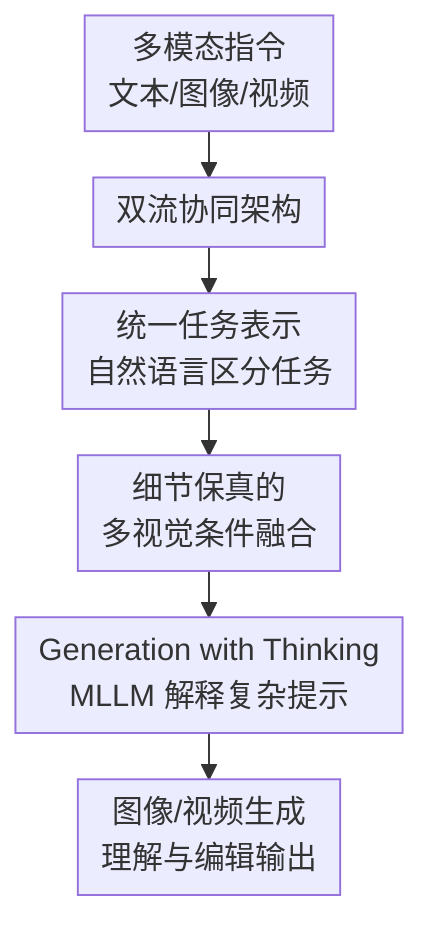

# UniVideo: Unified Understanding, Generation, and Editing for Videos

**会议**: ICLR2026  
**OpenReview**: [https://openreview.net/forum?id=EDCJTaR9bk](https://openreview.net/forum?id=EDCJTaR9bk)  
**代码**: https://github.com/KlingTeam/UniVideo  
**领域**: 视频生成 / 视频编辑 / 多模态理解生成统一模型  
**关键词**: 统一视频模型, 视频生成, 视频编辑, 多模态指令, in-context generation

## 一句话总结
UniVideo 用冻结的 MLLM 负责多模态理解与指令解析，用 MMDiT 负责高保真图像/视频生成，把视频理解、文生视频、图生视频、in-context 视频生成和无 mask 视频编辑统一到同一套自然语言指令框架中，并在多项视频生成与编辑任务上达到接近或优于专用模型的效果。

## 研究背景与动机
**领域现状**：统一多模态模型在图像领域已经形成清晰趋势：同一个系统既能看图、理解文本，也能生成或编辑图像。Janus、OmniGen2、BAGEL、Show-o 系列等工作说明，理解模型和生成模型不一定要分成两个彼此割裂的工具；如果训练和接口设计得当，模型可以在同一个对话或指令范式下完成多种视觉任务。

**现有痛点**：视频领域还没有真正达到这种统一程度。主流视频生成模型大多围绕 text-to-video 训练，输入侧通常只依赖文本编码器，面对带参考图、参考视频、手绘标注、复杂人物替换关系的多模态指令时，很难先理解“用户到底想改哪里、保留谁、替换谁”，再稳定地产生视频。视频编辑方法则常常依赖 mask、任务专用 adapter、condition bias 或多阶段流水线，一个任务一套模块，扩展到新编辑类型或组合任务时会变得笨重。

**核心矛盾**：视频统一模型需要同时满足两类要求：一方面，它要像 MLLM 一样读懂复杂多模态上下文，保留文本生成和视觉问答能力；另一方面，它又要像强视频 diffusion/DiT 生成器一样保留细节、身份一致性和时间连续性。只把视频压成少量语义 token 会损失细节；只用 VAE latent 喂给生成器又缺少高层语义推理。UniVideo 的问题意识正是在这两端之间搭桥。

**本文目标**：作者希望构建一个单一视频系统，能在同一套输入格式下区分并执行多种任务，包括视频理解、T2I、T2V、I2V、多参考 in-context 视频生成、基于参考图的视频编辑、图像编辑，以及更复杂的视觉提示生成。这个系统不应要求用户为不同任务切换模型，也不应依赖显式 mask 才能完成编辑。

**切入角度**：论文的观察是，MLLM 和视频 DiT 各有所长，不必强行把二者揉成一个从零训练的 native 模型。冻结 MLLM 可以保留已有理解和语言能力；保留强 MMDiT 生成器可以继承视频生成质量；中间只需要设计足够有效的连接器和条件输入方式，让语义理解与低层视觉细节同时进入生成过程。

**核心 idea**：UniVideo 用双流架构把“理解”和“生成”解耦协同：MLLM 提供多模态语义与推理，VAE/MMDiT 提供细节与视频合成，再通过统一指令和多任务训练把多种视频生成、编辑、理解能力收进一个模型。

## 方法详解

### 整体框架
UniVideo 的整体架构可以理解为两条信息流共同控制一个视频生成器。第一条是语义流：文本、图像和视频输入进入 MLLM，模型输出最后一层 hidden states，经 MLP connector 对齐到 MMDiT 的条件空间，用来告诉生成器“这条指令语义上要做什么”。第二条是视觉细节流：参考图、参考视频、条件视频等视觉输入经 VAE 编码成 latent，和待去噪的 noisy latent 一起进入 MMDiT 的生成流，用来保留主体外观、姿态、局部纹理和时间结构。

在任务层面，UniVideo 不给每个任务单独加 adapter 或 bias，而是把 T2V、I2V、in-context generation、in-context editing、image editing 等都写成自然语言多模态指令。模型通过 MLLM 理解任务意图，通过 MMDiT 在同一个 self-attention 生成框架里融合语义 token、条件 latent 与 noisy video latent。

### 关键设计
**1. 双流协同架构：让 MLLM 管语义，让 MMDiT 管生成**

UniVideo 最关键的选择不是把所有东西压进一个单流 Transformer，而是明确区分“读懂指令”和“生成视频”这两件事。MLLM 分支接收文本、图像和视频，输出包含多模态语义的 hidden states；这些 hidden states 通过一个可训练 MLP connector 映射到 MMDiT 的输入空间。与此同时，视觉条件不只走语义编码器，还会经过 VAE 变成 latent 直接进入 MMDiT 的生成分支。

这种设计解决了统一视频模型里很常见的瓶颈：如果只依赖 semantic encoder，参考视频里的细粒度身份、服饰、物体纹理和局部运动容易被压掉；如果只依赖 VAE latent，生成器又难以理解“把参考图里的帽子加到视频中的女人头上”这类组合指令。双流结构把高层语义和低层视觉条件同时保留下来，所以论文在 in-context generation 和 mask-free editing 上能比许多专用系统更稳。

**2. 统一任务表示：用自然语言指令替代任务专用模块**

UniVideo 把不同任务统一成“多模态输入 + 自然语言指令 + 待生成 latent”的形式。T2V 时，文本进入 MLLM，MMDiT 对 noisy video latent 去噪；I2V 时，图像和文本同时进入 MLLM，图像 latent 也作为条件进入 MMDiT；in-context generation 和 in-context editing 时，多个参考图、参考视频、源视频和编辑目标都通过同一套指令组织起来。

这和许多视频编辑方法的区别在于，UniVideo 不要求为 swap、delete、insert、stylization 分别设计 condition bias 或独立 pipeline。任务差异主要由指令和输入内容表达，模型在 Stage 3 多任务训练中学习如何区分任务。这个设计也解释了它为什么能做任务组合：例如同时删除一个身份并加入另一个身份，或者把 in-context editing 和风格迁移合在一句话里，模型并不需要新增一个“组合任务模块”。

**3. 细节保真的多视觉条件融合：让参考图和参考视频不被语义瓶颈吃掉**

视频 in-context 任务的难点在于视觉条件数量多、模态混杂、时空尺寸不同。UniVideo 对每个视觉信号先用 VAE 编码，再 padding 到统一形状，并沿时间维拼接，让 MMDiT 可以在 self-attention 中同时看到参考图、参考视频和 noisy video latent。为了让模型区分“这是条件 latent”还是“这是要生成的视频 latent”，作者使用 3D positional embeddings：空间坐标在不同视觉输入之间保持一致，只沿时间维递增。

这个位置编码细节很重要。论文指出，类似 Qwen2-VL 的 MRoPE 会在新增视觉输入时偏移所有轴，可能破坏不同参考之间的空间对应关系；UniVideo 保留空间 index，只增加 temporal index，更适合视频生成里“多个参考共享空间语义、但属于不同时间/条件片段”的结构。消融里，去掉给 MMDiT 的视觉输入、只让视觉条件走 MLLM，会让身份一致性从平均 $0.78$ 掉到 $0.18$，说明细节流不是装饰，而是 in-context 视频生成与编辑能成立的基础。

**4. Generation with Thinking：用冻结 MLLM 先解释复杂视觉提示**

UniVideo 还保留了 MLLM 的自回归理解和语言生成能力，因此可以处理普通 DiT 文本编码器很难直接理解的“视觉提示”。例如用户在画布上放几张参考图、画箭头、写简短注释，或者直接在输入图上画出运动方向和新事件，MLLM 可以先把这些手工视觉提示解释成结构化计划或 dense prompt tokens，再把这些语义嵌入送入 MMDiT 指导生成。

这一点让 UniVideo 不只是一个视频 diffusion backbone 的多条件版本，而更像一个能把用户意图翻译给生成器的系统。它没有走多 agent 调多个下游生成器的路线，而是在同一个模型内部完成“理解提示 → 形成生成条件 → 合成视频”。论文的定性结果主要展示 zero-shot visual prompting，说明这项能力还有训练数据扩展空间，但方向本身很清楚：复杂提示不再必须被用户手写成完整长 prompt。

### 损失函数 / 训练策略
UniVideo 采用三阶段训练，核心是尽量保留两个预训练 backbone 的能力，只训练必要的连接与生成部分。Stage 1 是 connector alignment：冻结 MLLM 和 MMDiT，只训练 MLP connector，数据包括 T2I、T2V 预训练样本，以及一个图像重建任务，让 MMDiT 学会利用来自 MLLM 的视觉语义特征。这个阶段训练 $15K$ steps，学习率为 $1 \times 10^{-4}$。

Stage 2 是 T2I/T2V fine-tuning：继续冻结 MLLM，训练 connector 和 MMDiT，用小规模高质量 T2I/T2V 数据恢复或接近原 HunyuanVideo backbone 的生成能力。Stage 3 是多任务训练：仍冻结 MLLM，训练 connector 和 MMDiT，把 in-context generation、in-context video editing、image editing、I2V 与之前的 T2I/T2V 合并训练。Stage 2 和 Stage 3 都使用 $2.0 \times 10^{-5}$ 学习率，各训练 $5K$ 和 $15K$ steps，并使用 EMA $0.9999$。

实现上，论文采用 Qwen2.5-VL-7B 作为 MLLM，HunyuanVideo-T2V-13B 作为 MMDiT。原 HunyuanVideo 的两个文本编码器被移除，改由 Qwen2.5-VL 作为统一多模态 embedder；MLP connector 使用 $4\times$ expansion 对齐特征维度。由于 MLLM 冻结，UniVideo 更准确地说是一个后训练的统一多模态生成系统，而不是从零训练的 native any-to-any 视频模型。

## 实验关键数据

### 主实验
论文的实验覆盖理解、普通视频生成、in-context 视频生成、in-context 视频编辑、zero-shot 泛化、generation with thinking 和多项消融。整体结论是：UniVideo 在理解能力上接近冻结 MLLM，在生成能力上接近视频生成 backbone，同时在多参考生成和无 mask 编辑上展现出统一模型的额外优势。

| 任务 | 指标 | UniVideo | 代表性对比 | 结论 |
|------|------|----------|------------|------|
| 视觉理解 | MMBench | 83.5 | BAGEL 85.0 / OmniGen2 79.1 | 保留强 MLLM 理解能力 |
| 视觉理解 | MMMU | 58.6 | BAGEL 55.3 / OmniGen2 53.1 | 在统一模型里表现靠前 |
| 视觉理解 | MM-Vet | 66.6 | BAGEL 67.2 / OmniGen2 61.8 | 接近最强统一图像模型 |
| 文生视频 | VBench T2V | 83.48 | Wan2.1 84.70 / HunyuanVideo 83.24 | 接近专用视频生成 backbone |

| In-context 视频生成 | 设置 | UniVideo | 最强/代表性对比 | 主要优势 |
|----------------------|------|----------|------------------|----------|
| Subject Consistency | 单参考 | 0.88 | Kling1.6 0.68 / Pika2.2 0.45 | 主体保持明显更好 |
| Prompt Following | 单参考 | 0.93 | Kling1.6 0.95 | 接近商业模型 |
| Video Quality | 单参考 | 0.95 | Kling1.6 0.88 | 人评视频质量最高 |
| Subject Consistency | 多参考 | 0.81 | Kling1.6 0.73 / Pika2.2 0.71 | 多身份条件更稳 |
| Prompt Following | 多参考 | 0.75 | VACE 0.53 / Kling1.6 0.45 | 多 ID 指令跟随优势明显 |
| Aesthetic | 多参考 | 6.128 | Kling1.6 6.034 | 美学分最高 |

| Mask-free in-context 视频编辑 | 指标 | UniVideo | 对比方法 | 结论 |
|-----------------------------|------|----------|----------|------|
| Insert | CLIP-I | 0.693 | Pika2.2 0.692 / Kling1.6 0.632 | 无 mask 仍达到最高身份对齐 |
| Insert | Aesthetic | 6.031 | Kling1.6 5.798 / UNIC 5.627 | 插入质量更好 |
| Swap | CLIP-I | 0.728 | UNIC 0.725 / Kling1.6 0.707 | 身份替换略优于专用模型 |
| Swap | Smoothness | 0.973 | Kling1.6 0.995 / UNIC 0.971 | 时序平滑接近强基线 |
| Delete | PSNR | 17.980 | VideoPainter 22.987 | 删除重建不占优 |
| Stylization | Aesthetic | 6.281 | StyleMaster 5.121 / UNIC 5.045 | 风格化视频质量明显更高 |

### 消融实验
| 配置 | 平均 PF | 平均 SC | 平均 VQ | 说明 |
|------|--------|--------|--------|------|
| Single-task | 0.64 | 0.67 | 0.79 | 每个任务单独训练，不能充分共享图像编辑和视频编辑经验 |
| UniVideo | 0.80 | 0.78 | 0.85 | 多任务统一训练后，指令跟随、主体一致性和视频质量都提升 |
| UniVideo w/o Visual for MMDiT | 0.66 | 0.18 | 0.71 | 视觉条件只进 MLLM，不进 MMDiT，身份保持几乎崩掉 |

### 关键发现
- 多任务训练带来的收益不是平均摊平，而是在编辑任务上尤其明显。比如 in-context swap 的 PF 从 single-task 的 $0.53$ 提升到 $0.91$，delete 的 PF 从 $0.32$ 提升到 $0.52$，说明图像编辑、身份任务和视频生成之间确实存在可迁移能力。
- 视觉条件进入 MMDiT 是 identity-preserving 的关键。只让视觉输入经过 MLLM 的语义流，平均 SC 只有 $0.18$，说明 reference image/video 的细节不能被少量语义表示替代。
- UniVideo 没有用 general free-form video editing 数据训练，却能 zero-shot 修改材质、天气、环境和人物服装颜色，说明统一训练让 image editing 能力部分迁移到了视频域；但论文也承认这类自由编辑成功率仍低于图像编辑。
- 在普通 T2V 上，UniVideo 不是全面超过专用模型。VBench 总分 $83.48$ 低于 Wan2.1 的 $84.70$，更像是在“保留强生成能力的同时换来统一能力”，而不是单项 T2V 榜单模型。

## 亮点与洞察
- 双流架构的判断很务实：视频统一模型现在还不必执着于从零训练 native any-to-any。冻结强 MLLM + 保留强 MMDiT，再用 connector 和多任务训练对齐，成本更可控，也能避免生成训练破坏已有理解能力。
- 论文把“统一”落到了实际任务接口，而不是只做一个宽泛口号。T2V、I2V、多参考生成、插入、替换、删除、风格化都通过自然语言指令组织，这让任务组合能力有了机制基础。
- 3D positional embedding 的选择很有启发：多参考视频生成不是简单拼 token，位置编码会决定模型能不能把多个视觉条件当成不同时间/条件片段处理。保留空间索引、只推进时间维，是一个小但很具体的工程设计。
- Generation with Thinking 展示了一个值得继续追的方向：未来视频生成的 prompt 不一定是长文本，也可能是草图、箭头、分镜图、参考图拼贴和少量文字。让 MLLM 先读懂这些视觉提示，再指导 DiT 生成，比要求用户写电影脚本式 prompt 更自然。
- 这篇论文也提醒我们，统一模型的价值不只在平均分，而在“少切模型、少写工具胶水、少做任务定制”。对于真实创作工作流，能把理解、生成、局部编辑和组合编辑放在同一个上下文里，往往比单个 benchmark 小幅领先更重要。

## 局限与展望
- UniVideo 有时不能严格遵循编辑指令，会过度修改无关区域。对于视频编辑来说，局部约束和非目标区域保持仍是硬问题，尤其在无 mask 设置下更难。
- 模型受限于 HunyuanVideo backbone，原视频运动保持能力仍不够强。删除或替换对象时，背景重建和运动轨迹延续可能不如专用 mask-based 方法，例如 delete 任务的 PSNR 明显低于 VideoPainter。
- free-form video editing 主要来自 image editing 能力迁移，成功率低于图像编辑。后续如果有更大规模、高质量、指令丰富的视频编辑数据，应该能显著改善复杂材质、天气、局部属性修改。
- 当前系统仍是“组装式”统一模型：冻结 MLLM，连接到预训练 MMDiT。它实用但不完全 native，未来可以探索端到端训练的统一视频模型，让文本、图像、视频理解与生成在同一建模目标下共同成长。
- 评测里仍有较多定性展示，尤其是 generation with thinking 和 zero-shot visual prompting。若要证明这类能力可稳定复现，还需要更系统的视觉提示 benchmark 和失败案例分析。

## 相关工作与启发
- **vs OmniGen2 / BAGEL / Janus 系列**: 这些工作主要推动图像域的统一理解与生成，UniVideo 把类似思路扩展到视频域，并重点处理多参考视频生成、视频编辑和任务组合。它的优势是视频任务覆盖更广，代价是图像生成细粒度指标不一定领先最强图像模型。
- **vs HunyuanVideo / Wan2.1 / Kling 等视频生成模型**: 后者是强视频生成器，但通常不具备完整多模态指令理解与编辑统一接口。UniVideo 在 T2V 上不是绝对最强，但能用同一个模型做理解、生成和编辑。
- **vs VACE / UNIC / AnyV2V / VideoPainter**: 这些方法更偏视频编辑专用系统，常依赖 mask、adapter、condition bias 或任务流水线。UniVideo 的不同点是无 mask、自然语言指令驱动，并且通过统一训练获得任务组合与 zero-shot 自由编辑能力；不过在特定删除/重建指标上仍可能输给专用方法。
- **对后续研究的启发**: 如果要做下一代视频创作助手，值得把“多模态理解作为生成控制器”当成核心设计，而不是只把文本编码器换成更大的文本模型。参考视频细节流、任务统一接口、视觉 prompt 解释能力三者都要一起考虑。

## 评分
- 新颖性: ⭐⭐⭐⭐☆ 双流 MLLM+MMDiT 不是全新思想，但系统性扩展到统一视频理解、生成、编辑，并展示任务组合泛化，贡献很扎实。
- 实验充分度: ⭐⭐⭐⭐☆ 覆盖理解、生成、编辑、in-context、消融和 zero-shot，范围很广；但 visual prompting 和 free-form editing 仍偏定性。
- 写作质量: ⭐⭐⭐⭐☆ 结构清楚，实验表格信息密集，能看出各设计选择的作用；部分任务设置和数据构造细节需要读 appendix 才完整。
- 价值: ⭐⭐⭐⭐⭐ 对视频创作模型很有参考价值，尤其是“理解分支 + 细节生成分支 + 统一指令训练”的路线，适合作为后续统一视频助手的基础框架。

<!-- RELATED:START -->

## 相关论文

- [\[ICLR 2026\] Unified In-Context Video Editing](unified_in-context_video_editing.md)
- [\[ICLR 2026\] EditVerse: Unifying Image and Video Editing and Generation with In-Context Learning](editverse_unifying_image_and_video_editing_and_generation_with_in-context_learni.md)
- [\[CVPR 2025\] VEU-Bench: Towards Comprehensive Understanding of Video Editing](../../CVPR2025/video_generation/veu-bench_towards_comprehensive_understanding_of_video_editing.md)
- [\[ICML 2026\] Lightning Unified Video Editing via In-Context Sparse Attention](../../ICML2026/video_generation/lightning_unified_video_editing_via_in-context_sparse_attention.md)
- [\[ICLR 2026\] Pixel-Perfect Puppetry: Precision-Guided Enhancement for Face Image and Video Editing](pixel-perfect_puppetry_precision-guided_enhancement_for_face_image_and_video_edi.md)

<!-- RELATED:END -->
