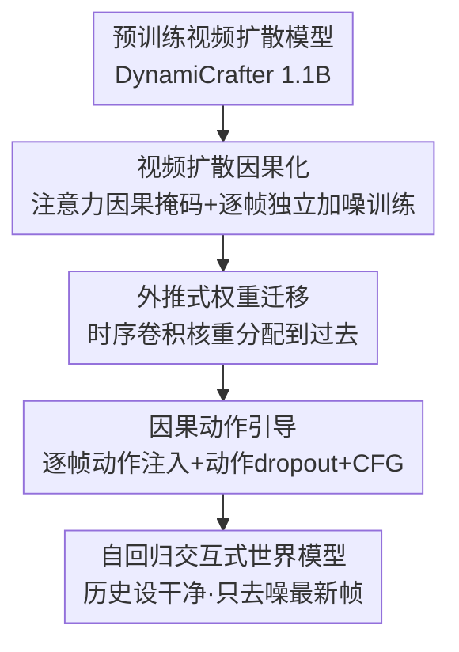

# Vid2World: Crafting Video Diffusion Models to Interactive World Models

**会议**: ICLR 2026  
**OpenReview**: [https://openreview.net/forum?id=pFyzqbUiF9](https://openreview.net/forum?id=pFyzqbUiF9)  
**代码**: https://knightnemo.github.io/vid2world/ (有)  
**领域**: 视频理解 / 扩散模型 / 世界模型  
**关键词**: 世界模型, 视频扩散, 因果化, 自回归生成, 动作条件

## 一句话总结
本文提出 Vid2World，把一个在互联网规模视频上预训练的全序列、非因果视频扩散模型，通过"因果化改造 + 因果动作引导"两步系统性手术，转成可自回归滚动、可逐帧动作控制的交互式世界模型，在机器人操作、3D 游戏模拟、开放世界导航三个领域都超过了现有迁移方法和专用世界模型。

## 研究背景与动机
**领域现状**：世界模型（world model）用来从历史观测和动作预测未来状态 $p_\theta(o_{t+1}\mid o_{\le t}, a_{\le t})$，是序贯决策的核心部件，已在游戏模拟、自动驾驶、机器人等领域取得进展。但主流世界模型几乎都只用领域内、带动作标注的数据训练。

**现有痛点**：带动作标注的数据采集昂贵又费力，而且这样训出来的模型预测往往粗糙、物理真实感差，在复杂环境里用不起来。近期工作想用更广的跨域动作标注数据做预训练来缓解，但动作标注数据本身的高成本问题依旧存在，生成保真度也没本质提升——单纯扩大动作标注数据的规模并不能解决根本问题。

**核心矛盾**：世界模型最缺的恰恰是它最该利用、却被忽视的那块数据——互联网规模的"无动作"视频。这类数据海量、易采集、富含真实世界先验，但它没有动作标签、也不是因果生成的（标准视频扩散模型双向去噪，未来帧能影响过去帧），没法直接拿来当交互式世界模型用。

**本文目标**：不再在数据层面做文章，而是转向模型层面迁移——把已经在互联网视频上学到物理先验和生成能力的**视频扩散模型**，直接改造成交互式世界模型。需要跨过两道坎：(1) 让模型支持因果生成（当前帧不能依赖未来）；(2) 让模型支持细粒度、逐帧的动作条件。

**核心 idea**：对预训练视频扩散模型做"因果化 + 动作引导"两级手术——既改架构（注意力加因果掩码、时序卷积核做因果权重迁移）又改训练目标（逐帧独立加噪 + 动作 dropout），从而把被动的全序列视频生成器，转成主动的、可逐帧动作控制的自回归世界模型，最大限度保住预训练学到的能力。

## 方法详解

### 整体框架
Vid2World 以一个预训练好的视频扩散模型（实验用 1.1B 参数的 DynamiCrafter U-Net）为底座，目标是把它从"一次性去噪整段视频、双向上下文"的被动生成器，转成"逐帧自回归滚动、当前帧只看历史"的交互式世界模型。整条管线分两步：先做**视频扩散因果化**，把架构和训练目标都改成因果版本，让模型能自回归生成；再做**因果动作引导**，把逐帧动作信号注入模型，并用无分类器引导强化动作的可控性。因果化里最棘手的是时序卷积层——它的对称卷积核同时聚合过去和未来帧，本文专门设计了**外推式权重迁移**来把作用于未来的权重平滑地搬回过去。

训练时对每一帧独立采样噪声等级（Diffusion Forcing），并以固定概率随机丢弃每一帧的动作；推理滚动时把历史帧设为干净、只去噪最新一帧，并对当前动作施加引导。

### 关键设计

**1. 视频扩散因果化：把双向去噪的架构和目标都改成因果**

底座视频扩散模型默认用双向时序上下文做全序列去噪，未来帧会影响过去帧，这和"当前观测不能依赖未来观测/动作"的自回归世界模型根本冲突。本文从架构和训练目标两侧同时下手。架构上，时序**注意力层**因为本质是 query-key 点积、天然适配变长序列，只要加一个因果掩码、把感受野限制成不看未来帧即可，不改变 token 间关系的底层计算、**无需改参数**。训练目标上，采用 Diffusion Forcing（Chen et al. 2024）的逐帧独立加噪：训练时对每帧独立采样噪声等级 $k_t\sim U([0,K])$，而不是给所有帧一个统一噪声等级。这样模型见过各种"帧间噪声等级组合"，自然解锁了"历史帧干净、当前帧带噪"这种自回归滚动所需的推理模式——滚动时把已生成的历史帧设为干净（噪声等级 0）、只对最新一帧迭代去噪。

**2. 外推式权重迁移：让因果卷积核最大限度复用预训练权重**

时序**卷积层**的因果化比注意力难得多：它用对称卷积核 $\{w_t\}_{t=-m}^{m}$ 同时聚合过去和未来帧，简单粗暴地改会浪费预训练权重。本文系统比较了三种权重迁移方案。**Shift（平移）**：把整个核往过去平移 $m$ 步得到 $\{w'_t\}_{t=-2m}^{0}$，保住了全部权重但引入时序错位——第 $i$ 个核位置现在聚合的是时刻 $i-m$ 的特征，不保证产生相似表示。**Masked（掩码）**：只保留过去与当前的权重 $\{w_t\}_{t=-m}^{0}$、其余置零，相当于初始化时就硬加一个因果掩码，强制了因果性但丢掉了未来权重里可能有用的信息。本文提出的 **Extrapolative（外推式）**则更有原则：它假设未来帧特征可由过去 $p$ 帧线性外推近似 $z_{t+k}\approx\sum_{j=0}^{p-1}\gamma_{k,j}\,z_{t-j}+\beta_k$，进而要求新因果卷积的输出尽量逼近原始非因果卷积的输出 $\sum_{i=-m}^{m} w_i z_{t+i}=\sum_{j=-2m}^{0} w'_j z_{t+j}$。据此把原本作用于未来帧的权重 $\{w_i\}_{i>0}$，按线性特征关系**重新分配回核的过去部分**：$w'_j = \mathbb{1}_{[j\ge -m]}\cdot w_j + \mathbb{1}_{[-p+1\le j\le 0]}\cdot\sum_{i=1}^{m}\gamma_{i,-j}w_i$。这样既严格因果，又最大限度保住了原卷积的输出表示，消融里它的迁移效果优于 Shift 和 Masked。

**3. 因果动作引导：逐帧注入动作 + 动作 dropout 实现无分类器引导**

因果化只解决了"能自回归滚动"，但模型还不会反事实推理——预测不同动作如何改变未来。视频扩散模型默认只在视频级别接受粗粒度条件（如文本），既缺逐帧动作条件、也不兼容动作在线逐步到达的交互场景。本文先做**因果动作注入**：预测 $o_t$ 时，把前一动作 $a_{t-1}$ 经一个轻量 MLP 编码后，加到模型在时序位置 $t$ 的隐表示上，让每帧在时序对齐的意义下直接被它的前序动作所条件化。再做**因果动作引导**：借鉴无分类器引导（CFG），让模型同时学条件分数 $\epsilon_{\text{cond}}$ 和把最近动作屏蔽掉的无条件分数 $\epsilon_{\text{ucond}}$。训练目标里加入**动作 dropout**——每帧动作以固定概率 $p$ 被替换成 $\varnothing$，迫使模型学到对动作序列所有子集都成立的分数函数。推理时按 $\epsilon_{\text{guided}}=(1+\lambda)\,\epsilon_{\text{cond}}-\lambda\,\epsilon_{\text{ucond}}$ 放大引导，$\lambda$ 越大越强调动作对齐。论文用 Theorem 4.1 证明这一分数空间的线性组合等价于从一个被"动作对齐"项 $\big(p(x_t\mid a_{t-1},H_t)/p(x_t\mid H_t)\big)^{\omega}$（$\omega\propto 1+\lambda$）加权后的后验分布采样，即引导项相当于一个隐式分类器，把生成推向与用户最近动作一致的区域；$\lambda$ 给了测试时调节"对动作变化响应强度"的灵活旋钮。

### 损失函数 / 训练策略
统一训练目标在 Diffusion Forcing 的逐帧加噪基础上叠加动作 dropout：

$$\mathcal{L}(\theta)=\mathbb{E}_{[k_\tau],\epsilon,[x^0_\tau],[\tilde a_\tau]}\Big[\textstyle\sum_{t=0}^{T}\big\|\epsilon_t-\epsilon_\theta([x^{k_\tau}_\tau]_{\le t},[\tilde a_\tau]_{<t},[k_\tau]_{\le t})\big\|^2\Big],\quad \tilde a_t=\begin{cases}\varnothing,& \text{概率 } p\\ a_t,& \text{否则}\end{cases}$$

底座为 1.1B U-Net 的 DynamiCrafter；RT-1 上以外推式权重迁移后训练 100k 步（4×A100 约 7 天）。推理两种变体：Vid2World-NAR（所有帧统一噪声、一次性非自回归去噪，对齐传统视频扩散）与 Vid2World（逐帧自回归去噪 + 动作引导）。

## 实验关键数据

### 主实验
跨三个领域评测世界建模质量（FVD/FID/SSIM/LPIPS/PSNR/DreamSim），下表取每个领域的代表性对比：

| 领域/数据集 | 模型 | FVD ↓ | FID ↓ | SSIM ↑ | LPIPS ↓ |
|------|------|------|------|------|------|
| 机器人操作 RT-1 | 预训练底座 | 237.6 | 5.432 | 0.712 | 0.228 |
| 机器人操作 RT-1 | Action-Conditioned（最强基线） | 24.2 | 2.965 | 0.852 | 0.134 |
| 机器人操作 RT-1 | Vid2World-NAR（非自回归） | 18.7 | 5.871 | 0.856 | 0.140 |
| 机器人操作 RT-1 | **Vid2World（自回归）** | **18.5** | 5.806 | 0.842 | 0.152 |
| 3D 游戏 CS:GO | DIAMOND-HQ | 368.5 | 87.2 | 0.447 | 0.510 |
| 3D 游戏 CS:GO | **Vid2World** | **106.6** | **17.5** | **0.481** | **0.404** |
| 开放世界导航 RECON | NWM (1B, 单步) | 31.2 | 34.1 | 0.389 | 0.295 |
| 开放世界导航 RECON | **Vid2World（自回归）** | 59.4 | 42.9 | **0.481** | 0.324 |

- RT-1 上即便在其他基线都做不到的**自回归**设定下，Vid2World 仍在 FVD/FID 上领先；CS:GO 上相对最强基线取得 **FID 相对提升 79.9%、FVD 相对提升 71.1%**。
- RECON 上 Vid2World 虽是自回归滚动（有误差累积），却与单步预测的 SOTA 模型 NWM 持平、并在 4/6 指标上超过用 Ego4D 共训的 NWM 变体；它历史 4 帧 + 预测 16 帧的总上下文长度 20 还超过了 16 帧的训练 horizon，显示出时序泛化能力。
- Real2Sim 策略评测：用 Vid2World 当模拟器自回归滚动，能可靠区分 RT-1 在不同训练阶段（Begin/15%/Converged）三个策略的成功率高低，趋势贴合真实世界。

### 消融实验
Table 2（受算力限制统一训 30k 步）验证权重迁移（WT）与动作引导（AG）两个组件：

| 配置 | 权重迁移 | 动作引导 | FVD ↓ | FID ↓ | SSIM ↑ | PSNR ↑ |
|------|------|------|------|------|------|------|
| Vid2World | Shift | ✗ | 29.9 | 7.85 | 0.799 | 21.5 |
| Vid2World | Masked | ✗ | 29.4 | 7.07 | 0.824 | 22.9 |
| Vid2World | Extrapolative | ✗ | 28.6 | 7.52 | 0.832 | 23.4 |
| Vid2World | Masked | ✓ | 25.8 | 6.84 | 0.840 | 23.9 |
| Vid2World | **Extrapolative** | **✓** | **22.4** | **6.16** | 0.839 | 23.9 |

### 关键发现
- **动作引导贡献明显**：无论 Masked 还是 Extrapolative 权重迁移，加上动作引导（训练用动作 dropout）都比没有引导的对照版更好（如 Extrapolative 的 FVD 从 28.6 降到 22.4）。
- **权重迁移方案排序**：Masked 与 Extrapolative 都优于 Shift，且 Extrapolative 略优于 Masked——印证了"把未来权重按线性外推搬回过去"比简单平移/硬截断更能保住预训练表示。
- **引导尺度 $\lambda$ 非越大越好**（Fig. 8，CS:GO）：增大 $\lambda$ 初期因强化动作对齐而提升指标，但过大会因过度锐化伪影导致质量回落，存在最佳区间。

## 亮点与洞察
- 把"无动作的互联网视频"重新定位成世界模型数据金字塔里最该利用的底座，路线从"数据层利用"转向"模型层迁移"——避免了在海量视频上从头训的天价成本，论点干净。
- 外推式权重迁移是很可复用的 trick：任何需要把"对称/双向卷积核"改成"因果核"又不想丢预训练权重的场景（音频、时序信号、流式视频），都能借用"按局部线性外推把未来权重重分配回过去"的思路。
- 用 Diffusion Forcing 的逐帧独立加噪天然支持"历史干净 + 当前带噪"的自回归滚动，把"全序列去噪器"和"自回归世界模型"这两种看似不兼容的范式优雅地缝在一起。
- 把无分类器引导从"视频级文本条件"推广到"逐帧动作条件"，并用 Theorem 4.1 给出"分数线性组合 ↔ 后验概率被动作对齐项加权"的等价性，让动作可控性有了理论依据而非纯工程拼接。

## 局限与展望
- 底座规模仅 1.1B、训练算力有限（消融只训 30k 步），更大底座/更长训练下结论是否保持、收益是否进一步放大尚待验证。
- 自回归滚动天然有误差累积，RECON 上 Vid2World 的 FVD/FID 仍逊于单步预测的 NWM——长 horizon 滚动的稳定性还有提升空间。
- 外推式权重迁移依赖"未来特征可由过去线性外推"的假设，在运动剧烈、强非线性动态的场景下这一近似可能不准（论文未深入分析失效边界）。
- 评测主要是视频预测保真度指标 + 一个 Real2Sim 策略评测，作为"世界模型"在真正的规划/控制闭环里的端到端收益还需更多下游决策实验支撑。

## 相关工作与启发
- **vs 条件图像生成式世界模型（DIAMOND 等）**：它们把世界建模当成"以固定长度历史窗口为条件的逐帧生成"，虽是自回归但上下文受限、难做长程时序推理；Vid2World 继承视频扩散的强时序先验，CS:GO 上大幅超过 DIAMOND。
- **vs 全序列视频生成式世界模型**：这类方法时序连贯但只能整段生成、无法自回归滚动，不适合交互；Vid2World 的因果化正是补上"能逐步交互"这一环。
- **vs NWM（Navigation World Model）**：NWM 显式以预测时间步 $t$ 为条件、可单步预测远期帧从而绕开误差累积，且训练算力大得多；Vid2World 在受误差累积约束的自回归设定下仍与其持平，体现了从无动作视频迁移先验的高效性。
- **vs 给生成底座加动作模块/适配器的迁移工作（如 AVID）**：它们常忽视交互性与时序因果性；Vid2World 把因果化和动作引导都做成系统性、有理论支撑的改造，迁移效果在 RT-1 上全面领先这些基线。

## 评分
- 新颖性: ⭐⭐⭐⭐⭐ 首个系统研究"把全序列非因果视频扩散模型迁移成自回归交互世界模型"的工作，外推式权重迁移与因果动作引导都有原创性。
- 实验充分度: ⭐⭐⭐⭐ 覆盖机器人/游戏/导航三领域 + Real2Sim + 完整消融，但底座规模与算力受限、下游决策闭环实验偏少。
- 写作质量: ⭐⭐⭐⭐⭐ 问题拆解清晰（两道坎）、方法分层利落、理论与消融互相印证。
- 价值: ⭐⭐⭐⭐⭐ 给"用互联网视频先验造世界模型"指出一条可扩展、低数据成本的实用路径，trick 可迁移性强。

<!-- RELATED:START -->

## 相关论文

- [\[ICLR 2026\] Target-Aware Video Diffusion Models](target-aware_video_diffusion_models.md)
- [\[ICLR 2026\] Geometry Forcing: Marrying Video Diffusion and 3D Representation for Consistent World Modeling](geometry_forcing_marrying_video_diffusion_and_3d_representation_for_consistent_w.md)
- [\[ICLR 2026\] DrivingGen: A Comprehensive Benchmark for Generative Video World Models in Autonomous Driving](drivinggen_a_comprehensive_benchmark_for_generative_video_world_models_in_autono.md)
- [\[ICLR 2026\] LikePhys: Evaluating Intuitive Physics Understanding in Video Diffusion Models via Likelihood Preference](likephys_evaluating_intuitive_physics_understanding_in_video_diffusion_models_vi.md)
- [\[CVPR 2025\] Navigation World Models](../../CVPR2025/video_generation/navigation_world_models.md)

<!-- RELATED:END -->
