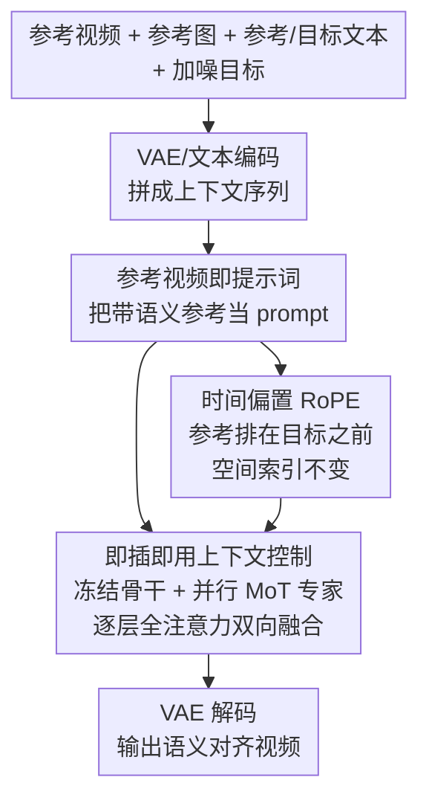

# Video-As-Prompt: Unified Semantic Control for Video Generation

**会议**: ICLR 2026  
**OpenReview**: [https://openreview.net/forum?id=8FihPljvWf](https://openreview.net/forum?id=8FihPljvWf)  
**代码**: https://bytedance.github.io/Video-As-Prompt/ (项目页)  
**领域**: 视频生成 / 扩散模型  
**关键词**: 语义可控视频生成, 上下文生成, Mixture-of-Transformers, 参考视频提示, 零样本泛化

## 一句话总结
本文把"语义可控视频生成"重新表述成**上下文生成（in-context generation）**：直接拿一段带目标语义的参考视频当作"视频提示词"，通过一个即插即用、与冻结骨干并行的 Mixture-of-Transformers 专家来引导生成，配合带时间偏置的 RoPE 消除虚假的像素对齐先验，让**单一模型**统一处理概念/风格/运动/镜头四类语义控制，并对未见语义做零样本迁移，开源方法中拿到 38.7% 的人类偏好率、逼近商用闭源模型。

## 研究背景与动机
**领域现状**：可控视频生成大体分两类。一类是**结构可控**——条件（深度图、姿态、光流、mask）与目标视频逐像素对齐，主流做法是加一条 adapter 分支、用残差相加把条件注入 DiT，充分利用这种像素映射先验，这条路已经研究得比较成熟。另一类是**语义可控**——条件与目标共享语义但**没有像素对应**（如概念变换、Ghibli 风格、某种运动、希区柯克推拉镜头），这一类至今碎片化，缺一个统一且可泛化的框架。

**现有痛点**：把结构可控的方法直接搬到语义控制上会出问题。VACE 这类方法假设条件与输出逐像素对齐，残差相加注入一段"语义相同但像素错位"的参考视频时，会强行复制参考的外观/布局，产生 copy-and-paste 伪影（青蛙站得像狗、自由女神模仿绵羊）。现有语义控制方法则落入两个坑：(1) **Condition-Specific Overfit**——为每个语义条件单独微调骨干或训一个 LoRA（如专门的 Ghibli 风格、专门的镜头推拉），成本高、每个条件一个模型；(2) **Task-Specific Design**——为某一类条件（风格/运动/镜头）定制专用模块或推理策略，把同语义视频编码到特制空间再引导生成。两者都只能拟合窄分布，无法统一，更没有零样本泛化能力。

**核心矛盾**：语义控制天然**没有像素映射先验**可用，但已有范式要么硬塞一个不存在的像素先验（结构可控法），要么用"每条件/每任务专门训练"绕开统一性（过拟合法、专用设计法）——前者引入伪影，后者牺牲泛化。

**本文目标**：用一个统一模型处理异构语义条件，并能零样本迁移到训练中未见的语义。

**切入角度**：近期图像生成和结构可控视频生成都表明 DiT 本身支持很强的**上下文控制**能力。那么能否把"语义控制"直接表述成上下文生成——把带目标语义的参考视频当成 prompt 喂进去，让模型自己去检索并迁移其中的语义？这个视角天然不假设像素对齐，也不需要每条件/每任务单独建模。

**核心 idea**：**用"参考视频即提示词"代替"像素先验注入 / 每条件微调"来实现统一语义控制**——冻结骨干 DiT，挂一个并行可训练的 MoT 专家解读参考视频，并用时间偏置 RoPE 摆正参考与目标的时序关系、去掉虚假空间映射。

## 方法详解

### 整体框架
VAP 要解决的是：在没有像素对齐先验的前提下，让一个 DiT 把"参考视频里的语义"迁移到由参考首帧+文本描述决定的新主体上。整体流程是把参考侧和目标侧拼成一条上下文 token 序列 $[\text{Ref}_{text}, \text{Ref}_{video}, \text{Tar}_{text}, \text{Tar}_{video}]$，参考侧交给一个**可训练的专家 Transformer**、目标侧交给**冻结的预训练 DiT 骨干**，两者在每一层通过全注意力双向交换信息；同时给参考侧的 RoPE 加一个固定时间偏置，让它在时间轴上排在目标之前、空间索引保持不变。

输入有四样：参考视频（提供语义）、参考图像（即参考视频首帧，提供初始外观和主体，继承 I2V 骨干能力）、参考/目标的文本描述（帮助定位要迁移的语义信号）、以及目标侧的噪声（推理）或加噪目标视频（训练）。参考视频和目标视频先各自经 VAE 编码成 latent，与文本 token 拼接后分别流入专家分支和冻结骨干，经 MoT 块逐层融合，最后由 VAE 解码出目标视频。

### 关键设计

**1. 参考视频即任务无关提示词：用一种表示统一异构语义条件**

痛点是语义控制条件五花八门（概念/风格/运动/镜头），过去要么逐像素对齐（结构法）、要么每条件训一个模型（过拟合法）、要么每任务做一套专用设计，没法统一。VAP 的做法是把"带目标语义的参考视频"本身当成 prompt——它和目标视频共享语义、与具体任务类别无关，于是异构条件被收进同一种输入形式。形式化地，设条件类型 $C=\bigcup_{i=1}^{n} C_i$，共 $m$ 个具体条件；过去方法往往要训 $n$ 个（每任务）甚至 $m$ 个（每条件）模型，而 VAP 只训一个统一模型 $u_\Theta$ 去联合学习 $p(x \mid c)$ 对任意 $c \in C$。文本描述 $(P_{ref}, P_{tar})$ 也一并输入，帮模型定位并迁移那个被共同提及的语义信号（如"覆盖液态金属"）。这样模型学的是 $p(x \mid C_{co}, C_s, C_m, C_{ca}, P_{ref}, P_{tar})$。正因为参考视频是统一载体而非特制编码，模型在推理时见到训练分布外的新语义参考，也能直接当 prompt 用，从而零样本泛化。

**2. 即插即用上下文控制：用并行 MoT 专家防止灾难性遗忘**

如果按最朴素的 in-context 做法——把序列 $[\text{Ref}_{text}, \text{Ref}_{video}, \text{Tar}_{text}, \text{Tar}_{video}]$ 直接拼起来全量微调 DiT——在数据有限时会**灾难性遗忘**：因为 DiT 只预训练过"生成"、没训练过"上下文条件化"，而且参考/目标对缺乏像素对齐先验，语义上下文生成本就更难，全量微调会把骨干原有的生成能力冲垮（Fig.5(b)、Tab.2 验证）。VAP 改用 **Mixture-of-Transformers**：冻结原始 Video DiT，旁挂一个从骨干权重初始化的**并行可训练专家**。专家只处理参考侧 $[t_{\hat c}, \hat c]$，冻结骨干只处理目标侧 $[t_x, x]$；两条路各自保留独立的 Q/K/V 投影、FFN 和 LayerNorm，但在每一层把 Q/K/V 拼接后跑**全注意力**做双向信息融合。这样参考被"塑造"成依赖当前生成状态的 prompt，引导被路由进冻结骨干，而骨干生成能力原封不动。结果就是：保住骨干、训练更稳、且这套控制与具体 DiT 架构无关（CogVideoX-5B 和 Wan2.1-14B 上都能挂），真正做到即插即用。

**3. 时间偏置 RoPE：摆正参考与目标的位置关系，去掉虚假像素映射先验**

如果参考和目标共享同一套 RoPE 位置编码，会强加一个**不存在的逐像素时空映射先验**——模型误以为参考和目标之间存在像素级对应，于是生成出现伪影（Fig.5(c)）。VAP 把参考 prompt 的时间索引整体平移一个固定偏置 $\Delta$，使其排在所有目标噪声 token 之前，而**空间索引保持不变**。这一步同时做到三件事：去掉那个虚假的像素映射先验；让时序顺序符合上下文生成的预期（参考在前、目标在后）；保留空间一致性，从而模型可以利用参考视频在空间上的语义变化。消融还表明，若再像 in-context 图像生成那样额外加一个宽度偏置（把参考放在目标左侧），反而增加空间引用难度、性能下降——说明只动时间轴、不动空间轴是关键。

### 损失函数 / 训练策略
基于 Flow Matching 训练。噪声样本 $x_0 \sim \mathcal{N}(0,1)$ 沿路径 $x_t = t x_1 + (1-(1-\sigma_{min})t)x_0$ 去噪（$\sigma_{min}=10^{-5}$），模型 $u$ 预测速度 $V_t = x_1 - (1-\sigma_{min})x_0$，损失为真值速度与预测的均方误差：

$$L = \mathbb{E}_{t,x_0,x_1,C}\,\lVert u_\Theta(x_t, t, C) - (x_1 - (1-\sigma_{min})x_0)\rVert$$

在 CogVideoX-I2V-5B 和 Wan2.1-I2V-14B 上训练以验证跨架构有效性，为公平对齐参数量：CogVideoX 上专家是骨干的完整副本，Wan2.1 上专家是分布在 1/4 层的副本，两者都约 5B 参数。视频统一缩放到 480×720(832)、49 帧 @16fps，AdamW 学习率 $1\times10^{-5}$，48 张 A100 训约 20k 步。

## 实验关键数据

### 主实验
评测从 4 类（概念/风格/运动/镜头）中均匀抽 24 个语义条件、每个 2 样本。指标含文本对齐（CLIP Score）、视频质量（运动平滑度/动态程度/美学质量）、语义对齐（用 Gemini-2.5-pro 对参考-生成视频对自动打分）、以及人类偏好率。

| 模型 | CLIP↑ | 运动平滑↑ | 动态程度↑ | 美学↑ | 语义对齐↑ | 偏好率(%)↑ |
|------|------|----------|----------|------|----------|-----------|
| VACE (原始视频) | 5.88 | 97.60 | 68.75 | 53.90 | 35.38 | 0.6 |
| VACE (光流) | 22.65 | 97.56 | 79.17 | 57.34 | 46.71 | 1.8 |
| CogVideoX-I2V | 22.82 | 98.48 | 72.92 | 56.75 | 26.04 | 6.9 |
| CogVideoX-I2V (LoRA, 每条件) | 23.59 | 98.34 | 70.83 | 54.23 | 68.60 | 13.1 |
| Kling / Vidu (商用闭源, 专用) | 24.05 | 98.12 | 79.17 | **59.16** | **74.02** | **38.2** |
| **VAP (本文, 统一)** | **24.13** | **98.59** | 77.08 | 57.71 | 70.44 | 38.7 |

VACE 直接搬来表现最差：它假设条件与输出逐像素对齐，语义控制下这一假设崩溃，会复制参考的外观/布局；从原始视频→深度→光流逐步去掉外观细节，指标反而变好，反证了像素先验不适合语义控制。CogVideoX 单靠文本提示语义对齐很弱（很多语义难用粗文本表达）。每条件 LoRA 语义对齐强但损害基础质量、且每条件一个模型、对未见参考不泛化。VAP 作为**单一统一模型**在多数指标超过开源基线、逼近商用模型，并首次给出语义可控视频生成的统一解。

### 消融实验

| 配置 | CLIP↑ | 语义对齐↑ | 说明 |
|------|------|----------|------|
| 单分支全量微调 | — | 灾难性遗忘 | 骨干被冲垮 |
| 单分支 LoRA | 23.12 | 69.08 | 保住骨干但容量有限，复杂上下文吃力 |
| 单向 cross-attn | 22.96 | 67.16 | 缺双向同步，对齐变差 |
| 单向残差相加 | 22.37 | 55.99 | 仍靠刚性像素映射，最不匹配语义控制 |
| 同一 RoPE | 23.17 | 68.98 | 强加虚假像素对齐，掉点 |
| 时间+宽度偏置 | 23.45 | 69.05 | 多加宽度偏置反增空间引用难度 |
| **VAP (MoT+时间偏置 RoPE)** | **24.13** | **70.44** | 完整模型 |

### 关键发现
- **MoT 双向融合是性能关键**：相比单向 cross-attn（语义对齐 67.16）和单向残差相加（55.99），MoT 的逐层双向交换让参考表示随目标同步适应，语义对齐升到 70.44；残差相加即使重训也因刚性像素映射严重不匹配语义控制。
- **位置编码只动时间、不动空间**：同一 RoPE 会强加不存在的像素对齐先验；额外加宽度偏置又增加空间引用难度，两者都不如只加时间偏置。
- **强可扩展性**：训练对从 1K→10K→50K→100K，几乎所有指标单调提升（运动平滑 92.12→98.59，语义对齐 63.91→70.44），得益于"参考即 prompt"无需任务专用改造 + MoT 保留骨干生成力。
- **跨骨干可迁移**：换到更强的 Wan2.1-14B 骨干，动态程度（79.17）和美学（58.09）更好，但因专家只插在 1/4 层、上下文交互更少，参考对齐略低于 CogVideoX 版。
- **零样本泛化**：给训练集外的新语义参考（如 Crumble/Dissolve/Levitate/Melt），VAP 仍能把抽象语义模式零样本迁移到参考图像上。

## 亮点与洞察
- **范式转换最巧**：把"语义控制"从"注入条件 / 每条件微调"重述成"参考视频当 prompt 的上下文生成"，一举绕开了语义控制本就不存在的像素先验，又天然支持零样本——这是全文最"啊哈"的地方。
- **MoT 的冻结+并行结构可复用**：用一个从骨干初始化、独立 FFN/Norm、仅靠逐层全注意力融合的并行专家来加新能力又不毁原能力，这套"即插即用、与架构解耦"的思路可迁移到其它需要给冻结大模型挂条件分支的场景。
- **RoPE 偏置只动时间轴**：当两路 token 语义相关但无空间对应时，把参考在时间轴上前置、空间轴不动，是个简单却有效去除虚假映射先验的 trick，对其它 in-context 多模态拼接同样有借鉴意义。
- **数据集即贡献**：VAP-Data 用商用 I2V 特效模板 + 社区 LoRA 把 2K 参考图配成 100K+ 配对视频、覆盖 100 个语义条件，是该任务目前最大的配对数据。

## 局限与展望
- **数据偏合成**：VAP-Data 的语义条件相对有限、且是从其它生成模型（商用模板/社区 LoRA）合成而来，会继承源模板的风格偏置、伪影和概念局限；作者把"更大规模、真实"的语义控制视频数据留作未来工作。
- **依赖描述质量**：为贴近原 DiT 分布，作者用标准视频描述当 caption，但语义描述不准或主体差异过大会降质；作者认为指令式 caption（如"请遵循参考视频里的 Ghibli 风格"）可能更有效。
- **Wan2.1 版本的折中**：为对齐参数量只把专家插在 1/4 层，导致上下文交互变少、参考对齐略降——说明专家容量/插入密度与对齐质量存在 trade-off，值得进一步探究。

## 相关工作与启发
- **vs VACE（结构可控统一法）**: VACE 把深度/光流/mask 当统一像素对齐条件、残差相加注入；语义控制下像素先验崩溃导致外观复制伪影。VAP 改用参考视频当 prompt + 上下文控制，去掉像素先验，优势是语义对齐和零样本，劣势是失去了结构任务里像素对齐能带来的精确空间控制。
- **vs Condition-Specific LoRA / Overfit**: LoRA 每条件训一个、语义对齐高但伤基础质量且不泛化；VAP 单模型统一所有条件并零样本迁移。
- **vs Task-Specific Design（风格/运动/镜头专用模块）**: 专用设计把同语义编码到特制空间，效果好但绑死任务类别、阻碍统一；VAP 不做任务专用设计，靠 in-context 统一。
- **vs 并发的 LoRA-MoE 统一法（Mao et al., 2025）**: 该法用 LoRA 专家混合做多条件统一，但仍靠过拟合参数子集学每个条件、无法泛化到未见语义；VAP 的"参考即 prompt"天生支持未见语义。

## 评分
- 新颖性: ⭐⭐⭐⭐⭐ 把语义控制重述成参考视频上下文生成，是干净且有效的范式转换。
- 实验充分度: ⭐⭐⭐⭐⭐ 四类语义、跨两种骨干、结构/位置编码/可扩展性多维消融 + 人类研究。
- 写作质量: ⭐⭐⭐⭐ 动机与设计逻辑清晰，部分实现细节（专家层分布、评测规则）放附录。
- 价值: ⭐⭐⭐⭐⭐ 统一模型 + 最大配对数据集 + 零样本，开源逼近商用，实用价值高。

<!-- RELATED:START -->

## 相关论文

- [\[ICLR 2026\] EchoMotion: Unified Human Video and Motion Generation via Dual-Modality Diffusion Transformer](echomotion_unified_human_video_and_motion_generation_via_dual-modality_diffusion.md)
- [\[ICLR 2026\] JavisDiT++: Unified Modeling and Optimization for Joint Audio-Video Generation](javisdit_unified_modeling_and_optimization_for_joint_audio-video_generation.md)
- [\[ICLR 2026\] Lumos-1: On Autoregressive Video Generation with Discrete Diffusion from a Unified Model Perspective](lumos-1_on_autoregressive_video_generation_with_discrete_diffusion_from_a_unifie.md)
- [\[ICLR 2026\] Learning Video Generation for Robotic Manipulation with Collaborative Trajectory Control](learning_video_generation_for_robotic_manipulation_with_collaborative_trajectory.md)
- [\[ICCV 2025\] Prompt-A-Video: Prompt Your Video Diffusion Model via Preference-Aligned LLM](../../ICCV2025/video_generation/prompt-a-video_prompt_your_video_diffusion_model_via_preference-aligned_llm.md)

<!-- RELATED:END -->
