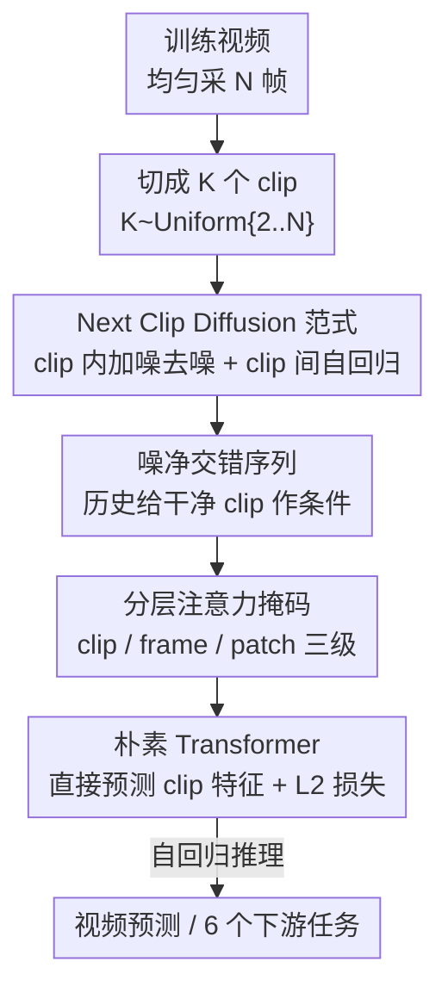

# Video-GPT via Next Clip Diffusion

**会议**: ICLR 2026  
**OpenReview**: [https://openreview.net/forum?id=E0ZAcqy9TB](https://openreview.net/forum?id=E0ZAcqy9TB)  
**代码**: 论文承诺开源（暂未给出仓库链接）  
**领域**: 视频生成 / 扩散模型 / 世界模型  
**关键词**: 视频生成式预训练, next clip diffusion, 自回归扩散混合, 世界模型, 视频预测

## 一句话总结
把"视频里的一个片段（clip）"类比为"语言里的一个词"，提出 next clip diffusion 预训练范式——片段内部用扩散并行去噪、片段之间用自回归条件，从而让一个朴素 Transformer 在 7000 万条无标注视频上自监督预训练，在 Physics-IQ 物理世界建模基准上以 34.97 大幅超过 Kling（23.64）、Wan（20.89），并能迁移到 6 个下游视频生成与理解任务。

## 研究背景与动机

**领域现状**：GPT 用 next token prediction 在 web 级文本上自监督预训练，拿到了惊人的泛化能力。但语言擅长表达高层抽象，却描述不清视觉世界里丰富的时空细节——一句"怎么打一个结"用文字根本说不明白，视频却天然记录了不同时空分辨率下的动态知识。于是一个自然的问题是：能不能把"视频当作新的语言"来做视觉世界建模？

**现有痛点**：当前两条路线各有短板。纯视频扩散（加噪—逐步去噪）画质强，但难以做长程未来预测，而长程预测恰恰是世界模型的关键；纯自回归视频建模（把视频离散成 token 做 next token prediction）能处理长上下文，但生成质量明显落后于最先进的扩散模型。已有一些工作想把扩散和自回归统一进一个 Transformer，但大多停留在图像域，且没有在"语言↔视频"之间做出有洞见的类比。

**核心矛盾**：扩散的"高画质并行去噪"和自回归的"长程时序外推"是一对 trade-off，强行在帧级别（next frame）或图像级别融合，要么丢长程、要么丢画质，也没有回答"视频里到底什么单位对应语言里的词"这个根本问题。

**本文目标**：设计一个既能短程高质量生成、又能长程预测的简洁视频基础模型，并像 GPT 那样只靠视频本身（无需文本标注）做自监督预训练。

**切入角度**：作者发现"clip（多帧片段）"和"word"扮演相似角色——都描述各自序列里的局部时序信息。于是把融合的基本单位放到 clip 级别：clip 内部用扩散（并行、双向、画质好），clip 之间用自回归（保持时间因果、能外推）。

**核心 idea**：用 next clip diffusion 取代 next token prediction——自回归地"根据历史中干净的 clip，去噪出下一个带噪 clip"，让模型同时继承 GPT 的自监督长程能力和扩散的短程合成质量。

## 方法详解

### 整体框架

Video-GPT 的训练把一段视频拆成若干 clip，对每个 clip 加噪得到"带噪 clip"，再把"带噪 clip"和"干净 clip"按时间顺序交错排成一条序列喂给一个朴素 Transformer；模型通过一套分层注意力掩码，让每个带噪 clip 只能看到历史中的干净 clip，从而把它去噪还原，用 L2 损失监督。推理时反过来：把模型自己之前去噪出来的 clip 当作干净历史，自回归地去噪下一个 clip，实现长视频预测。整条管线不引入文本标注，纯靠视频自监督。

### 关键设计

**1. Next clip diffusion：把 clip 当词，扩散管内部、自回归管之间**

这一设计直接回应"扩散与自回归该怎么融合、融合在什么粒度"的核心矛盾。作者把视频均匀采 $N$ 帧后随机切成 $K$ 个 clip（$K \sim \text{Uniform}\{2,3,\dots,N\}$），每个 clip 就是一个"视觉词"。对第 $k$ 个 clip，先用连续 VAE（取自 SDXL）压缩每帧并 patch 化得到 latent $\Phi(k,i)$，再用 flow matching 做前向加噪：

$$\Psi(k,i,\alpha_k) = \alpha_k\,\Phi(k,i) + (1-\alpha_k)\,\varepsilon_{k,i}$$

其中权重 $\alpha_k \sim \text{Uniform}[0,1]$，噪声 $\varepsilon_{k,i}\sim\mathcal{N}(0,I)$；关键是同一个 clip 内所有帧共用同一个 $\alpha_k$，这样去噪时该 clip 的多帧可以并行、双向地一起算（扩散的优势）。而 clip 与 clip 之间保持严格时间因果（自回归的优势）。这样融合的好处是：单位从"帧/图像"提到了"多帧 clip"，既保留了扩散在 clip 内的高画质并行合成，又让自回归在 clip 间负责长程外推，两者不再互相牺牲。

**2. 噪净交错序列：用历史"干净" clip 而非"带噪" clip 作条件**

要做自回归去噪，得先把输入排成一条序列、并告诉模型"拿什么当历史条件"。作者的做法是把每个 clip 同时以两种形态放进序列：干净 clip 用边界 token 包裹 $CL(k,i)=[\langle\text{img}\rangle,\ \Phi(k,i),\ \langle/\text{img}\rangle]$，带噪 clip 则加去噪提示 token 和时间步 $NS(k,i)=[\langle\text{diff}\rangle,\ \alpha_k,\ \Psi(k,i,\alpha_k)]$（$\langle\text{diff}\rangle$ 标记"这是带噪的"，$\alpha_k$ 提供 flow matching 的 timestep）。然后把成对的"噪—净"clip 按时间顺序交错排列：

$$\text{Input}=[NS(1,:),\,CL(1,:),\,\dots,\,NS(k,:),\,CL(k,:),\,\dots,\,NS(K,:)]$$

与一些前作"用历史中的带噪 clip 作条件"不同，本文坚持让第 $k$ 个带噪 clip 依赖历史中前 $(k-1)$ 个**干净**clip。原因很直接：干净 clip 提供的是正确、无噪的时序上下文，去噪结果才不会被历史里的噪声误导——这正是 next clip diffusion 能稳定外推的核心。

**3. 三级分层注意力掩码：用一张掩码同时表达 clip 因果、帧依赖、patch 空间关系**

序列里既有 clip 之间的时序因果，又有 clip 内帧之间、帧内 patch 之间的依赖，单靠普通因果 mask 表达不了，所以作者设计了 clip / frame / patch 三级嵌套掩码。**Clip 级**：干净 clip 依赖自己和之前的干净 clip；带噪 clip 依赖自己以及历史前 $(k-1)$ 个干净 clip（而非历史带噪 clip）。**Frame 级**：干净帧在 clip 内是因果的（第 $i$ 帧看前 $i$ 帧 + 历史干净 clip 全部帧）；带噪帧则在同一 clip 内**双向**互看（再加历史干净帧），因为迭代去噪最终会把带噪 clip 变成干净历史，带噪帧的 mask 不影响后续推理，双向注意力反而提升生成质量。**Patch 级**：提示 token（$\langle\text{img}\rangle/\langle\text{diff}\rangle$ 等）之间走因果，而同一帧内描述空间关系的 patch token 之间是全连接。这套分层掩码让一个朴素 Transformer 在一条序列里同时学会"时间该因果、空间该全看"。

**4. 直接预测 clip + 渐进式训练：把训练目标和算力都做到最简**

为了让预训练设置尽量简单、便于迁移到各种下游任务，作者不预测噪声也不预测 velocity，而是让 Video-GPT 直接预测干净 clip 特征，对去噪 clip 与真值 clip 算 L2 损失。由于注意力随帧数二次增长，长视频算力吃不消，作者用渐进式训练（Tab. 1）：从 16 帧、每 clip 仅 1 帧的 next-frame 起步，逐步把帧数（16→48→80）和每 clip 帧数一起拉大，先学短时再学长程。此外推理时干净历史 $CL$ 与模型去噪输出 $DNS$ 之间存在分布偏差，训练时给干净帧注入轻微噪声 $\Phi(k,i)=(\beta+\gamma_{k,i})\Phi(k,i)+(1-\beta-\gamma_{k,i})\epsilon_{k,i}$（$\beta=0.9$）来弥合，消融显示这一招能提分。

### 一个完整示例

以推理阶段预测第 3 个 clip 为例：初始给定第 1 个干净 clip $DNS(1,:)$ 作为起点 → 模型对带噪的 $NS(2,:)$ 迭代去噪 $T$ 步，得到 $DNS(2,:)$ → 把 $DNS(1,:)$ 和 $DNS(2,:)$ 当作干净历史条件，去噪 $NS(3,:)$ 得到 $DNS(3,:)$，公式为 $DNS(k{+}1,:)=\text{Video-GPT}\big(DNS(1,:),\dots,DNS(k,:),NS(k{+}1,:)\big)$。每个 clip 的帧数在推理时还可以变化；当要生成的视频超过预训练上下文窗口时，用标准滑动窗口续接，从而支持任意长视频外推。

## 实验关键数据

### 主实验

预训练数据为无标注的 Panda-70M，VAE 用 SDXL，主干继承 Phi-3-mini 架构，320 张 H20 GPU 渐进式预训练。

| 数据集 | 指标 | Video-GPT | 之前最好 | 说明 |
|--------|------|-----------|----------|------|
| Physics-IQ | Phys-IQ Score↑ | **34.97** | VideoPoet 29.50 / Kling1.6 23.64 / Wan2.1 20.89 | 确定性物理预测，超第二名 5+ 分 |
| Physics-IQ | Spatial-Temporal↑ | **0.240** | Seine 0.208 | 时空一致性最佳 |
| Physics-IQ | Weighted MSE↓ | **0.007** | VideoPoet 0.010 | 误差最低 |
| Kinetics-600 | FVD(5000)↓ | **89.44** | Seine 91.08 | 不确定性人体动作预测，朴素 Transformer 即最优 |
| UCF-101（class→video, finetune） | FVD↓ | **53** | LARP/FAR 57 | 高分辨率下 SOTA，且只用 2D VAE |

Video-GPT 在"确定性物理"（Physics-IQ）和"高不确定性人体动作"（Kinetics-600）两类预测上同时领先，且 Kinetics-600 用的是朴素 Transformer 而非主流 U-Net / DiT，直接说明 next clip diffusion 预训练本身有效。

### 消融实验

| 配置 | Phys-IQ Score | 说明 |
|------|---------------|------|
| Next Token Prediction | 21.59 | 换回 next token 范式 |
| **Next Clip Diffusion** | **34.94** | 本文范式，提升 13+ 分 |
| 推理每 clip 1 帧 | 0.00 | clip 内并行帧太少几乎不可用 |
| 推理每 clip 16 帧 | 32.86 | 并行帧增多画质显著上升 |
| 推理每 clip 32 帧 | **34.94** | 验证 clip 级生成优势 |
| 预训练 16 帧 | 22.06 | 时间窗口短 |
| 预训练 80 帧 | **34.94** | 窗口越长世界建模越好 |
| 不给干净 clip 加噪 | 33.09 | — |
| 给干净 clip 加噪（$\beta{=}0.9$） | **34.94** | 弥合训练/推理偏差 |
| 数据 1M（OpenVid） | 23.16 | 小数据 |
| 数据 70M（Panda） | **33.09** | 数据规模红利明显 |

### 关键发现
- **范式本身是最大增量**：把 next token prediction 换成 next clip diffusion，Physics-IQ 从 21.59 跳到 34.94，远超其他任何超参/数据带来的提升，证明"clip 当词 + clip 内扩散"是核心。
- **clip 内并行帧数越多越好**：推理时每 clip 仅 1 帧得分为 0、16 帧 32.86、32 帧 34.94——这正是扩散在 clip 内并行双向去噪的价值，也是相对帧级自回归的优势来源。
- **可无限扩数据**：和 GPT 一样无需标注，1M→70M 即从 23.16 升到 33.09，作者强调几乎可吃下全网视频，仍有很大上升空间。
- **下游全面可迁移**：6 个任务（class/text→video、image animation、视频分类/检索/分割）微调即用，如 UCF-101 线性探针 58.9% 超 VideoMAEv2（56.4%），MSR-VTT 零样本检索 R@1 22.8 超 VideoCLIP（10.4）；image animation 仅用 <100 条视频微调 2K 步就能泛化到训练集外样本。

## 亮点与洞察
- **"clip = word"是真正的洞见**：很多混合工作纠结在帧级或图像级，本文把融合粒度精准放到"多帧 clip"，让扩散与自回归各司其职而非互相妥协，这是范式消融能涨 13 分的根因。
- **用历史"干净" clip 而非"带噪" clip 作条件**：一个看似细节、实则决定稳定性的选择——它保证自回归外推不被历史噪声污染，是 next clip diffusion 能长程预测的关键。
- **三级分层掩码的"时间因果、空间全看"**：把"clip 间因果 / 带噪帧双向 / patch 空间全连接"压进一张掩码，让一个朴素 Transformer 不需要特殊架构就能表达视频的复杂依赖，迁移性强。
- **直接预测 clip 而非噪声/velocity**：训练目标越简单，越容易把同一个预训练模型适配到生成与理解两类下游任务，这是它一套模型打通 6 个任务的工程前提。

## 局限与展望
- 作者承认目前只在视频单模态上预训练，未来要做多模态预训练与强化驱动的世界交互。
- 模型规模/算力门槛高（3.8B 参数、320 张 H20），且依赖 SDXL 的 2D VAE，缺少更强的 3D VAE，长视频画质与时序压缩仍有上限。
- image animation 没有公认基准，作者自采 3 组各 <100 条视频评测，结论偏定性，泛化能力的量化证据相对薄弱。
- 不同基准的分数不可直接横比（Physics-IQ 测确定性、Kinetics-600 测不确定性），看待"全面领先"需结合各自任务设定。

## 相关工作与启发
- **vs 纯视频扩散（Wan / HunyuanVideo / Sora 等）**：它们 clip 内画质强但缺自监督长程预测，Physics-IQ 普遍 20+ 分；本文在 clip 间引入自回归条件，长程世界建模显著更好（34.97）。
- **vs 纯自回归视频模型（LVM / VideoWorld / LWM）**：它们做 next token prediction，生成质量落后于先进扩散；本文在 clip 内换成扩散，既保留自回归长上下文又补回画质。
- **vs 帧级混合（Self-Forcing / APT2）**：它们在"帧"级别融合（帧内扩散、帧间自回归），本文把单位提到"clip"，允许 clip 内多帧并行双向处理，更高效灵活，且坚持 GPT 式无标注自监督预训练。

## 评分
- 新颖性: ⭐⭐⭐⭐⭐ "clip 当词 + next clip diffusion"的类比简洁有力，范式消融证明其有效。
- 实验充分度: ⭐⭐⭐⭐⭐ 两类预测基准 + 6 个下游任务 + 充分消融（范式/帧数/数据规模/加噪）。
- 写作质量: ⭐⭐⭐⭐ 类比叙事清晰，但三级掩码与符号较密，初读门槛偏高。
- 价值: ⭐⭐⭐⭐⭐ 给"视频作为新语言"的世界模型路线提供了一个可扩展、可迁移的自监督预训练范式。

<!-- RELATED:START -->

## 相关论文

- [\[CVPR 2026\] Video-as-Answer: Predict and Generate Next Video Event with Joint-GRPO](../../CVPR2026/video_generation/video-as-answer_predict_and_generate_next_video_event_with_joint-grpo.md)
- [\[CVPR 2026\] TempoMaster: Efficient Long Video Generation via Next-Frame-Rate Prediction](../../CVPR2026/video_generation/tempomaster_efficient_long_video_generation_via_next-frame-rate_prediction.md)
- [\[CVPR 2025\] Motion Modes: What Could Happen Next?](../../CVPR2025/video_generation/motion_modes_what_could_happen_next.md)
- [\[ICLR 2026\] Vid2World: Crafting Video Diffusion Models to Interactive World Models](vid2world_crafting_video_diffusion_models_to_interactive_world_models.md)
- [\[ICLR 2026\] Geometry Forcing: Marrying Video Diffusion and 3D Representation for Consistent World Modeling](geometry_forcing_marrying_video_diffusion_and_3d_representation_for_consistent_w.md)

<!-- RELATED:END -->
