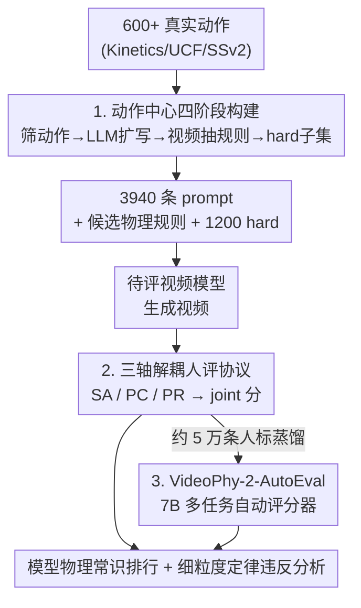

# VideoPhy-2: A Challenging Action-Centric Physical Commonsense Evaluation in Video Generation

**会议**: ICLR 2026  
**OpenReview**: [https://openreview.net/forum?id=HA8KSQW7SO](https://openreview.net/forum?id=HA8KSQW7SO)  
**代码**: https://videophy2.github.io/  
**领域**: 视频生成 / 评测基准  
**关键词**: 物理常识、视频生成评测、动作中心、自动评估器、人类标注

## 一句话总结
VideoPhy-2 用 197 个真实世界动作派生出 3940 条多事件 prompt，让现代文生视频模型生成视频后由人类沿「语义遵从 / 物理常识 / 物理规则」三轴打分，揭示即便最强的 Wan2.2-27B-A14B 在 hard 子集上 joint 分也只有 47.7%，并训练了一个 7B 的 VideoPhy-2-AutoEval 自动评估器把人评成本压下来。

## 研究背景与动机

**领域现状**：大规模视频生成模型被寄望成为「通用物理世界模拟器」，能服务于具身策略学习、自动驾驶、游戏等下游任务。但这要求生成的视频真正遵守物理常识——网球被击打后应沿抛物线飞出、铁锤不该在挥动后变形。如何系统地衡量这种「物理可信度」是个开放问题。

**现有痛点**：已有评测各有硬伤。基于真值物理仿真对比（如 Physics-IQ）依赖给定真实视频的前几帧做续写比对，既不清楚是否与人类判断一致，也难以扩展到多事件复杂场景；PhyGenBench 只有 160 条手工 prompt，规模小且不可扩展。更关键的是，这类工作往往人为把一条 prompt 严格绑定到单一物理定律（如「石头放在水面」对应浮力），可现实里视频模型语义遵从本就不完美——模型可能没拍出「放在水面」却拍成了「石头从高处落入水中」，此时重力才是关键定律，一对一绑定就失效了。

**核心矛盾**：语义遵从（视频是否贴合文本）和物理常识（视频是否符合物理规律）是两个互相纠缠却又必须解耦的维度。把它们混在一起评（如原版 VideoPhy 让标注者同时看 prompt 评物理），标注者会因为看到 prompt 而引入偏置；而把物理定律硬绑死到 prompt 上，又会因模型语义不达标而错判。

**本文目标**：构建一个规模大、动作多样、带细粒度物理规则标注、且区分难度的评测集，既能精确暴露视频模型的物理短板，又能自动化评估以降低成本。

**切入角度**：作者主张以「真实世界动作」（如打网球、后空翻、把物体掰断）为中心组织数据，因为这些动作天然蕴含丰富物理交互，且人类无需正规物理训练、仅凭日常经验就能判断其物理可信度。同时把物理规则建立在「生成视频本身的字幕」上，而非凭空从 prompt 推导，从而保证规则与视频内容对齐。

**核心 idea**：以动作为种子，用 LLM 批量扩写多事件 prompt、用 VLM 在回路里抽取候选物理规则，配合解耦的三轴人评协议，得到一个 challenging 的物理常识基准，并蒸馏出多任务自动评估器。

## 方法详解

### 整体框架

VideoPhy-2 不是一个生成方法，而是一套「数据集构建 + 评估协议 + 自动评估器」的评测体系。它的输入是一批真实世界动作，输出是对任意文生视频模型的物理常识量化评分。整条管线分三大块：① 四阶段数据集构建——从 600+ 动作筛到 197 个，每个动作让 LLM 扩写 20 条多事件 prompt（共 3940 条），生成视频后由 VLM 字幕抽出候选物理规则，再用参考模型筛出 1200 条 hard prompt；② 三轴解耦人评——让人类沿语义遵从（SA）、物理常识（PC）、物理规则（PR）三个维度独立打分，合成 joint 指标；③ 把约 5 万条人标蒸馏进一个 7B 视频语言模型 VideoPhy-2-AutoEval，实现快速自动评分。

### 关键设计

**1. 动作中心的四阶段数据集构建：让基准既多样又可扩展，还能定位物理规则**

针对「现有基准规模小、不可扩展、且把 prompt 硬绑单一物理定律」的痛点，本文设计了四个串行阶段。**Stage 1 种子动作**：从 Kinetics、UCF-101、SSv2 等汇集 600+ 动作，由两组 STEM 背景的学生独立标注「是否适合物理常识评估」，过滤掉打字、抹面霜这类几乎不含显著运动的动作，只保留两组都认可的，再用 Gemini-2.0-Flash-Exp 去语义重复，最终得到 197 个动作（143 个物体交互 + 54 个体育/身体活动）。**Stage 2 LLM 扩写 prompt**：对每个动作让 LLM 独立生成 20 条 prompt，刻意鼓励「多事件」描述以加大难度（如「弓箭手拉满弓→放箭→箭直飞→命中靶心」而非「弓箭手放箭」），共 3940 条；再用 Mistral-NeMo-12B 的 prompt upsampler 生成稠密字幕（平均从 16 token 扩到 138 token）补充视觉细节而不改语义。**Stage 3 候选物理规则**：作者不直接从 prompt 推规则（因为模型语义遵从不完美），而是先用模型按 prompt 生成视频、再用 Gemini-2.0-Flash-Exp 给视频写字幕，最后据字幕生成 3 条应被遵守的物理规则——这样规则才扎根于视频内容本身；人类标注时还可补写额外被违反的规则。**Stage 4 hard 子集**：用强开源模型 CogVideoX-5B 在全集上生成视频，挑出它 joint 分为 0 的 60 个动作（共 1200 条 prompt）作为困难子集，这些动作集中在动量传递、状态变化、平衡、复杂运动等物理密集场景。最终 VideoPhy-2 含 3940 条字幕（是 VideoPhy 的 5.72 倍）和约 11 万条人类标注。

**2. 三轴解耦的人评协议与 joint 指标：把语义和物理拆开评，避免偏置和刷分**

针对「语义遵从和物理常识纠缠、混评引入偏置」的矛盾，本文把评估拆成三个独立维度。**语义遵从（SA）** 用 1–5 的 Likert 量表评视频是否忠实呈现 prompt 里的实体、动作、关系；**物理常识（PC）** 同样 1–5 量表，但关键在于标注者**只看视频、不看 prompt**——因为物理常识本就与生成它的文本无关，遮蔽 prompt 可避免标注者被文本诱导（这正是原版 VideoPhy 单任务混评的缺陷）；**物理规则（PR）** 则逐条判定候选规则在视频中是「违反(0)/遵守(1)/无法判定(CBD,2)」，CBD 类别用于兜住那些 LLM 生成、但实际并未在视频里落地的规则。主指标是 **joint performance**：同时满足 $SA \geq 4$ 且 $PC \geq 4$ 的视频占比。作者特意不用后验分 $P(PC \geq 4 \mid SA \geq 4)$，因为一个差模型若只对 1/1000 的 prompt 语义达标、而那条恰好物理也合理，后验分就会虚高到 100%，严重误导。每条视频由 3 名标注者评分取均值四舍五入，规则判定取多数票，inter-annotator agreement 达 80%。

**3. VideoPhy-2-AutoEval：把人评蒸馏进 7B 模型，让评测快速可复现**

人评是金标准但昂贵难扩展，而现成视频语言模型（Gemini、VideoScore 等）和人类一致性很差——根源是它们对物理常识和规则理解有限、又难消化复杂 prompt。为此作者以 VideoCon-Physics 为骨干微调出 7B 的 VideoPhy-2-AutoEval，用约 5 万条人类标注（花费 3515 美元采集）做**多任务**蒸馏：同一骨干同时学语义遵从打分(1–5)、物理常识打分(1–5)、物理规则分类(0–2)，让三任务间知识互相迁移。训练 prompt 为 3350 条（197 动作 × 17 字幕），测试 590 条（197 × 3），训练视频从 HunyuanVideo-13B、Cosmos-Diff-7B、CogVideoX-5B 三个模型采样，其余模型留作泛化测试。评估时用预测分与真值分的 Pearson 相关来衡量自动评估器质量。

## 实验关键数据

### 主实验

人评 joint performance（SA≥4 且 PC≥4 的视频占比，%）：

| 模型 | 类型 | All | Hard | 物理活动(PA) | 物体交互(OI) |
|------|------|------|------|------|------|
| Wan2.2-27B-A14B | 开源 | **55.4** | **47.7** | 54.5 | 58.6 |
| Wan2.1-14B | 开源 | 32.6 | 21.9 | 31.5 | 36.2 |
| CogVideoX-5B | 开源 | 25.0 | 0.0 | 24.6 | 26.1 |
| Cosmos-Diff-7B | 开源 | 24.1 | 10.9 | 22.6 | 27.4 |
| Hunyuan-13B | 开源 | 17.2 | 6.2 | 17.6 | 15.9 |
| VideoCrafter-2 | 开源 | 10.5 | 2.9 | 10.1 | 13.1 |
| SVD-I2V | 开源 | 6.0 | 3.3 | 5.2 | 8.7 |
| Sora | 闭源 | 23.3 | 5.3 | 22.2 | 26.7 |
| Ray2 | 闭源 | 20.3 | 8.3 | 21.0 | 18.5 |

即便最强的 Wan2.2-27B-A14B（MoE，27B 总参 / 14B 激活），全集也只有 55.4%，hard 子集掉到 47.7%；Wan2.1-14B 从 32.6% 掉到 21.9%（相对降 33%），凸显 hard 子集的区分度。值得注意的是闭源模型（Sora、Ray2）并不优于开源的 Wan2.2、CogVideoX，说明闭源未必更懂物理常识。

自动评估器 vs 现成模型（与真值分的 Pearson 相关 ×100，未见过的 prompt）：

| 评估器 | Avg | SA | PC |
|------|------|------|------|
| VideoCon-Physics | 28.5 | 32.0 | 25.0 |
| VideoLLaVA | 16.0 | 30.0 | 2.0 |
| VideoScore | 13.5 | 17.0 | 10.0 |
| Gemini-2.0-Flash-Exp | 18.5 | 26.0 | 11.0 |
| Gemini-2.5-Flash-Exp | 20.5 | 31.0 | 10.0 |
| **VideoPhy-2-AutoEval** | **42.0** | **47.0** | **37.0** |

VideoPhy-2-AutoEval 相对 Gemini-2.0 在 SA、PC 上分别相对提升约 81%、236%，在未见视频模型上也保持 41.0 的平均相关，证明蒸馏的多任务评估器显著优于通用大模型。

### 消融 / 分析

| 分析维度 | 关键发现 | 说明 |
|------|---------|------|
| 物理定律违反分布 | 质量守恒、动量守恒违反率最高（约 40%） | 模型最不擅长守恒律 |
| 反射 / 浮力 | 违反率 <20% | 相对掌握较好 |
| PA vs OI | 物理活动(体育)普遍低于物体交互 | 体育类动作更难，需补高质量体育视频数据 |
| SA/PC 与美学/运动相关性 | 相关系数极低（PC vs 美学 0.09、vs 运动 0.002） | 物理常识无法靠优化画质/运动量刷出来 |

### 关键发现
- **守恒律是最大短板**：质量与动量守恒违反率约 40%，远高于反射、浮力，说明视频模型对「碰撞后动量传递、物体质量不凭空出现/消失」这类约束最弱——定性例子里出现铁锤挥动后变形、标枪落地前喷出沙子、木板凭空断裂。
- **hard 子集真的更 hard**：CogVideoX-5B 在 hard 子集上 joint 分直接归零，所有模型都大幅掉点，证明基于参考模型筛 hard instance 的策略有效。
- **物理常识与画质解耦**：PC 和美学、运动量几乎零相关，意味着不能靠把视频拍得更漂亮、运动更剧烈来蒙混过关，必须专门把物理常识注入生成过程。

## 亮点与洞察
- **把物理规则扎根在「视频字幕」而非「prompt」上**：先生成视频再写字幕再抽规则的两步法，巧妙绕开了「模型语义遵从不完美导致 prompt-定律绑定失效」的难题，规则与实际画面对齐，可迁移到任何需要细粒度可验证标注的生成评测。
- **遮蔽 prompt 评物理常识**：让标注者评 PC 时看不到 prompt，是个简单但关键的去偏设计——把「视频像不像描述」和「视频物理上可不可能」彻底解耦，值得所有多维生成评测借鉴。
- **拒绝后验分、坚持 joint 分**：作者明确指出后验分 $P(PC\geq4\mid SA\geq4)$ 会被差模型刷爆，这种对指标可被 game 的警觉性，是设计生成基准时常被忽略的陷阱。
- **用参考模型自动挖 hard subset**：借 CogVideoX-5B joint=0 自动框出困难动作，和 Humanity's Last Exam、ZeroBench 的思路一致，是构建有区分度基准的可复用范式。

## 局限与展望
- **视频限定在 6 秒以内短视频**：作者为便于评估选择短视频，长时序、多阶段物理过程（如完整体操套路）的物理一致性未被覆盖。
- **闭源模型评估不完整**：Sora 仅手动评了 60 条、Ray2 因 API 预算只评 394 条，且 Veo2、Kling 因无 API 直接缺席，闭源横向比较的样本不对等。
- **自动评估器相关性仍有限**：VideoPhy-2-AutoEval 在 PC 上 Pearson 也只有 37，离金标准人评尚远，物理常识自动判定依然是开放难题。
- **物理规则由 LLM 生成**：候选规则质量依赖 Gemini，虽有 CBD 类别和人工补写兜底，但规则覆盖的完备性难以保证。

## 相关工作与启发
- **vs VideoPhy**: 同一团队前作把语义遵从和物理常识当单任务一起评、规模仅 688 条；本文把两者解耦评估、规模扩到 3940 条（5.72×），新增物理规则/定律标注、real-world action-centric 组织、hard 子集，是全面升级版。
- **vs PhyGenBench**: 后者只有 160 条手工 prompt 且把 prompt 一对一绑死单一物理定律；本文 LLM 批量扩写、规则扎根视频字幕、且不做硬绑定，更可扩展也更贴近真实失败模式。
- **vs Physics-IQ**: 后者靠真实视频前几帧做续写比对、难扩展到多事件场景且与人判一致性存疑；本文以人评为金标准、覆盖多事件复杂动作。

## 评分
- 新颖性: ⭐⭐⭐⭐ 动作中心 + 视频字幕抽规则 + 三轴解耦评估的组合在物理常识评测里是清晰的增量创新。
- 实验充分度: ⭐⭐⭐⭐⭐ 9 个开/闭源模型 × 全集/hard/PA/OI、细粒度定律分析、自动评估器多基线对比，覆盖很全。
- 写作质量: ⭐⭐⭐⭐ 动机推导清晰、指标设计动机讲得透，pipeline 各阶段交代完整。
- 价值: ⭐⭐⭐⭐⭐ 暴露了视频生成模型在守恒律上的系统性缺陷，是物理可信视频生成的重要标尺。

<!-- RELATED:START -->

## 相关论文

- [\[ICLR 2026\] NarrLV: Towards a Comprehensive Narrative-Centric Evaluation for Long Video Generation](narrlv_towards_a_comprehensive_narrative-centric_evaluation_for_long_video_gener.md)
- [\[CVPR 2026\] HandWorld: Hand-Centric Unified Video Action Generation](../../CVPR2026/video_generation/handworld_hand-centric_unified_video_action_generation.md)
- [\[CVPR 2026\] VideoRealBench: A Chain-of-Thought Realism Evaluation Benchmark for Generated Human-Centric Videos](../../CVPR2026/video_generation/videorealbench_a_chain-of-thought_realism_evaluation_benchmark_for_generated_hum.md)
- [\[ICLR 2026\] MoAlign: Motion-Centric Representation Alignment for Video Diffusion Models](moalign_motion-centric_representation_alignment_for_video_diffusion_models.md)
- [\[CVPR 2026\] Physical Simulator In-the-Loop Video Generation](../../CVPR2026/video_generation/physical_simulator_in-the-loop_video_generation.md)

<!-- RELATED:END -->
