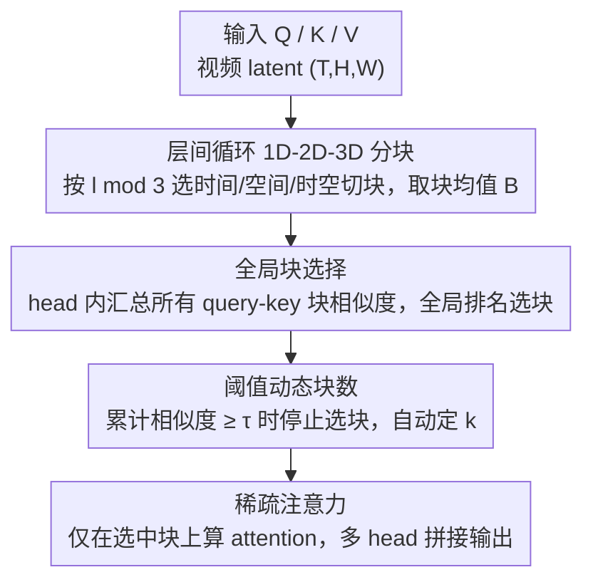

# VMoBA: Mixture-of-Block Attention for Video Diffusion Models

**会议**: ICLR 2026  
**OpenReview**: [https://openreview.net/forum?id=oQaRElUdmh](https://openreview.net/forum?id=oQaRElUdmh)  
**代码**: https://github.com/KwaiVGI/VMoBA  
**领域**: 视频生成 / 扩散模型 / 稀疏注意力  
**关键词**: 视频扩散模型, 稀疏注意力, 块注意力, 时空局部性, 训练加速

## 一句话总结
针对视频扩散模型（VDM）全注意力的二次复杂度瓶颈，VMoBA 把面向文本的 MoBA 块注意力改造成贴合视频时空特性的稀疏注意力——用「层间循环 1D-2D-3D 分块 + 全局块选择 + 阈值动态块数」三招，在 93×576×1024 长序列训练上做到 2.92× FLOPs、1.48× 训练加速，同时生成质量与全注意力相当甚至更好。

## 研究背景与动机

**领域现状**：视频扩散模型要生成长时长、高分辨率视频，主干普遍依赖全注意力（full attention）。但全注意力的计算量随 token 数二次增长，一段 720p 视频的 latent 就能超过 7.6 万 token，注意力成为训练和推理的主要瓶颈。为缓解这一点，业界提出了大量稀疏注意力，让每个 query 只和一部分 key-value 交互。

**现有痛点**：现有针对视频的稀疏注意力（DiTFastAttn、SparseVideoGen、SpargeAttn 等）几乎都是**免训练推理加速器**——不重新训练就直接套在预训练模型上，效果普遍打折扣；而真正能加速**训练**的稀疏注意力还很少被探索。一个自然的想法是把 LLM 上验证过的 MoBA（Mixture of Block Attention）搬到 VDM 训练，但作者实测直接搬运效果很差：VBench Score 从全注意力的 68.25 暴跌到 56.88。

**核心矛盾**：MoBA 是为**文本**设计的——它把 latent 拍平成一维序列再均匀切块，假设局部性只发生在 1D 上。可视频的局部性是**3D 时空**的：把三维 latent 强行拍平切块，会把空间上相邻的 token 分到不同块里，使得「块均值」失去代表性，从根上破坏了时空局部性。此外 MoBA 给每个 query 选固定数量的块、用固定 Top-K，忽视了视频注意力里 query 重要性不均、不同 head 集中度差异巨大这两个事实。

**切入角度**：作者先对预训练视频 DiT（Wan 2.1 1.3B）的注意力图做了一次任务专属分析，得到三条关键观察——① 全注意力图呈现 1D/2D/3D 三类时空局部模式，且不同层各有偏好（如第 27 层偏时间轴、第 3 层偏帧内空间、第 20 层偏 3D 时空邻域）；② 不同 query 的重要性差异很大，top 相似度分数高低悬殊；③ 不同 head 的相似度集中度不同，有的几个块就吃掉大半相似度、有的很弥散。这三条观察直接对应了 MoBA 的三个失配点。

**核心 idea**：用「贴合视频时空结构的分块 + 自适应的块选择」取代 MoBA 面向文本的固定分块与固定 Top-K，做出**第一个专为 VDM 训练设计**的混合块稀疏注意力 VMoBA。

## 方法详解

### 整体框架

VMoBA 是对一层注意力内部的改造，核心流程三步走：**先把 key 分块取均值 → 再为每个 head 选出最显著的 key 块 → 最后只在被选中的块上算稀疏注意力**。它整体替换全注意力，输入仍是 Q/K/V，输出是与全注意力维度一致的注意力结果（实现上用 FlashAttention 保证等价高效）。

三步分别对应三个关键设计：第一步的分块方式不是固定的，而是**随层循环切换 1D/2D/3D**（对应观察 1）；第二步选块时不再每个 query 各自独立选，而是把当前 head 内所有 query-key 块相似度汇成一个**全局池**统一排名（对应观察 2）；选多少个块也不再是固定 Top-K，而是按累计相似度**超过阈值 τ 自动决定**（对应观察 3）。

### 关键设计

**1. 层间循环 1D-2D-3D 分块：让块结构贴合视频的时空局部性**

这一招直接针对 MoBA「拍平成 1D 切块破坏时空局部性」的痛点。VMoBA 定义三种 key 分块方式：**时间（1D）分块**沿时间轴把相邻帧的 token 聚成块；**空间（2D）分块**沿高宽聚合所有帧上同一空间位置的 token；**时空（3D）分块**则在时空 latent 里切局部 3D patch。关键在于这三种分块**不是同时用，而是随层循环切换**——第 $l$ 层按 $l \bmod 3$ 决定用哪种：$l\bmod 3=0$ 用 1D，$=1$ 用 2D，$=2$ 用 3D。形式化地，分块是对 $K\in(T\,H\,W)$ 做 rearrange 后取均值得到块张量 $B=\mathrm{mean}(K')$，三种模式对应不同的 reshape 维度。

之所以这样有效：观察 1 表明不同层本就偏好不同的时空邻域，循环分块让模型在训练中**自动学到**每层该用什么样的时空注意模式，而不用像 SparseVideoGen 那样每层先跑一个小 pilot 注意力去在线判断 head 是空间还是时间——后者开销大到序列一长甚至比全注意力还慢。同时，相比所有层都用 3D 均匀分块，循环方案显著减少了总块数（VMoBA 的速度对总块数很敏感），而且结构化分块让语义相关的 token 更可能落进同一块，块均值更有代表性。

**2. 全局块选择：按整体交互强度分配稀疏度，而非每个 query 平摊**

针对观察 2——不同 query 重要性差异巨大（如「宇航员」「地面」区域的 top 相似度远高于「球」「天空」）。MoBA 给每个 query 独立选固定数量的块，会给强 query 分配不足、给弱 query 浪费配额。VMoBA 改成：对每个 head，先算出**所有** query 和**所有** key 块的相似度矩阵，再从这个跨全部 query-key 块乘积汇成的**全局池**里挑 top 块。形式上 $M_i=\mathrm{TopkMask}(q_i b_i^{T}, k)$，其中 $q_i\in\mathbb{R}^{s\times d}$ 是 head $i$ 的全部 query，$b_i\in\mathbb{R}^{N_b\times d}$ 是该 head 的全部 key 块，$M_i$ 是选出的 query-key 块对掩码。

这样做的好处是稀疏度按「交互的集体信号强度」来分配——重要 query 对应的块会被全局排名顶上去、拿到更多块，弱 query 则不会硬塞配额。它把「选哪些块」从局部、逐 query 的视角提升到 head 全局视角，更贴合视频里注意力高度不均的实际分布。

**3. 阈值动态块数：按 head 集中度自适应决定选多少块**

观察 3 指出不同 head 的相似度集中度差异极大——有的 head（如 head 4）几个块就吃掉大半相似度，有的（如 head 1）要很多块才够，二者达到 50% 累计相似度所需的 query-block 对数能差近 2.5 万。MoBA 用固定 Top-K 对所有 head 一视同仁：对弥散 head 选太少会丢信息，对集中 head 选太多低相似度块则纯浪费算力。VMoBA 改用阈值：把全局相似度降序排序后，**从最高开始累加归一化相似度，直到累计和超过阈值 $\tau$ 才停**，由此动态确定块数 $k$：

$$k=\min\Big\{k' \mid \sum_{j=1}^{k'}\mathrm{Sorted}(\hat S_j)\ge \tau\Big\},\quad \hat S=q_i b_i^{T}$$

本质上 $\tau$ 控制的是「保留多少比例的相似度质量」，而非保留多少个块。这让 VMoBA 对每个 head 都按其信息含量做自适应压缩：集中 head 自动少选块、弥散 head 自动多选块，从而更贴合地逼近全注意力。实现上 token 稀疏度总会小于 $\tau$（默认 $\tau=0.25$）。

### 损失函数 / 训练策略
VMoBA 不引入额外训练目标，沿用视频扩散的原生训练损失，只替换注意力机制本身。关键超参：阈值 $\tau=0.25$；时空块数主设为 72（“8-48-72”对应 1D/2D/3D 块数）；遵循以往工作保留**前 25% 去噪步用全注意力**；训练实验跑 2000 步，基座为 Wan 2.1 1.3B。

## 实验关键数据

### 主实验

训练加速（Table 2，VBench 五项 + 效率，基座 Wan 2.1，训练时间单位 GPU 小时）：

| 视频尺寸 | 方法 | 稀疏度 | Dynamic↑ | ImageQual↑ | SubConsist↑ | FLOPs↓ | 训练时间↓ |
|----------|------|--------|----------|-----------|-------------|--------|-----------|
| 93×576×1024 (55K) | FullAttn | - | 61.58% | 69.49% | 90.86% | 705.02T (1.00×) | 276h (1.00×) |
| 93×576×1024 (55K) | MoBA | 0.25 | 5.80% | 63.73% | 94.30% | 282.69T (2.49×) | 226h (1.22×) |
| 93×576×1024 (55K) | **VMoBA** | **0.19** | 56.91% | 67.45% | 96.76% | **248.68T (2.83×)** | **187h (1.48×)** |
| 141×480×832 (56K) | FullAttn | - | 43.01% | 64.36% | 92.58% | 724.97T (1.00×) | 262h (1.00×) |
| 141×480×832 (56K) | MoBA | 0.25 | 11.97% | 65.07% | 93.40% | 289.16T (2.51×) | 209h (1.25×) |
| 141×480×832 (56K) | **VMoBA** | **0.18** | 31.36% | **67.66%** | 93.78% | **248.39T (2.92×)** | **182h (1.44×)** |

空间扩展分辨率上 VMoBA 的 VBench 均分 68.34，略超全注意力的 68.25，且训练只用 187 GPU 小时（全注意力 276 小时，1.48× 加速）。时间扩展上图像质量比全注意力高 3.3%。对照之下 MoBA 在 Dynamic Degree 上只有 5.80%/11.97%——几乎是静态画面，印证其 1D 分块抓不住时空运动。

免训练推理（Table 1，直接套在预训练模型上）：

| 视频尺寸 | 方法 | 稀疏度 | PSNR↑ | FLOPs↓ | Latency↓ |
|----------|------|--------|-------|--------|----------|
| 81×720×1280 (76K) | FullAttn | - | - | 1246.78T | 406s |
| 81×720×1280 (76K) | MoBA | 0.25 | 20.46 | 457.20T (2.73×) | 360s (1.13×) |
| 81×720×1280 (76K) | **VMoBA** | 0.31 | 18.80 | 519.75T (2.40×) | **300s (1.35×)** |

长序列下 VMoBA 推理 1.35× 加速，比 MoBA 的 1.13× 高 19%——因为 MoBA 的 1D 分块会产生过多块拖慢速度。

### 消融实验

| 配置 | Dynamic↑ | ImageQual↑ | SubConsis↑ | 训练时间↓ | 说明 |
|------|----------|-----------|------------|-----------|------|
| 1-2-3D（完整） | 56.91% | 67.45% | 94.72% | 187h | 默认分块 |
| 1-3D（去 2D） | 28.57% | 66.71% | 91.34% | 187h | 去掉空间分块，Dynamic 崩到 28.57% |
| 1-2D（去 3D） | 55.49% | 58.51% | 86.12% | 176h | 去掉时空分块，ImageQual/SubConsis 掉最多 |
| 2-3D（去 1D） | 57.01% | 66.02% | 94.75% | 202h | 质量略高但训练时间涨到 202h，1D 贡献效率 |
| threshold + global（完整） | 56.91% | 67.45% | 94.72% | - | 全选块策略最优 |
| topk + global | 55.29% | 64.58% | 92.86% | - | 换回固定 Top-K，全面下降 |
| threshold + local | 55.19% | 65.31% | 92.43% | - | 去掉全局池，逐 query 选，下降 |
| topk + local（≈MoBA 选块） | 54.87% | 65.59% | 91.64% | - | 两者都去掉，最差 |

### 关键发现
- **三种分块缺一不可且分工明确**：去掉 1D 分块质量略升但训练时间从 187h 涨到 202h，说明 1D 主要贡献**效率**；去掉 3D 分块时 ImageQual（58.51%）、SubConsis（86.12%）掉得最狠，说明 3D 时空块对画质和一致性最关键。
- **全局 + 阈值双管缺一就退化**：「threshold + global」在所有指标上最优，单独去掉任一个都下降，退回「topk + local」（即 MoBA 选块策略）时最差，验证了两条改进各自独立有效。
- **阈值 τ 是质量-成本旋钮**：τ 从 0.15→0.50，质量稳步上升但训练时间从 162h 飙到 378h；τ=0.25 在质量与成本间取得最好平衡（稀疏度 0.19）。
- **MoBA 直接搬运会生成近乎静态的视频**（Dynamic 仅 5.80%），是「面向文本的 1D 分块」放到视频上最直观的失效证据。

## 亮点与洞察
- **「先分析再设计」的范式很扎实**：三个创新不是拍脑袋，而是一一对应预训练视频 DiT 注意力图里实测到的三条观察（1-2-3D 局部模式、query 重要性不均、head 集中度差异），动机具体可验证。
- **阈值选块比 Top-K 更本质**：把「选 k 个块」换成「保留 τ 比例的相似度质量」，让稀疏度随 head 信息分布自适应——这个思路可迁移到任何 Top-K 稀疏注意力（包括 LLM 的长上下文场景）。
- **层间循环分块用「时间换结构」**：不在线判断每层该空间还是时间，而靠训练让模型在循环 1D-2D-3D 中自己学，规避了 SparseVideoGen 那种 pilot 注意力的巨大在线开销。
- **稀疏注意力可能反超全注意力**：VMoBA 在 prompt 对齐（TextConsis 28.06% vs 27.99%）和图像质量上偶尔优于全注意力，提示稀疏化在长序列上某种意义上起到了正则/去噪作用。

## 局限与展望
- 免训练推理设置下 PSNR 偏低（长序列 76K token 时 18.80，不及 DiTFastAttn/SVG），说明 VMoBA 生成的视频与全注意力输出的**逐像素相似度**不高——它更偏向「质量高但不复刻全注意力」，在需要严格对齐参考输出的场景可能不利。
- 实验只在单一基座 Wan 2.1 1.3B 上验证，更大规模模型、其它 VDM 架构上的可迁移性尚未充分检验。
- 分块循环周期固定为 1-2-3D，每层用哪种分块由 $l\bmod 3$ 硬编码，并未真正按每层注意力模式自适应选择分块类型；阈值 τ 和块数仍是手调超参，跨分辨率需要重设。
- 前 25% 去噪步保留全注意力是延续以往工作的经验设定，这部分的加速空间未被利用。

## 相关工作与启发
- **vs MoBA**：MoBA 为 LLM 文本设计，1D 拍平均匀分块 + 逐 query 固定 Top-K；VMoBA 针对视频改成循环 1D-2D-3D 分块 + 全局阈值选块。直接搬 MoBA 到 VDM 训练会让 Dynamic 崩到 5.80%，VMoBA 是对它的视频专属适配。
- **vs SparseVideoGen (SVG)**：SVG 把 head 分类成空间/时间，但每层要跑 pilot 注意力在线判断，序列一长开销甚至超过全注意力；VMoBA 靠训练把时空模式学进循环分块，无在线分类开销，且能加速训练（SVG 是免训练推理加速器）。
- **vs DiTFastAttn**：DiTFastAttn 同为免训练推理加速，PSNR 相似度更高但不提供训练加速；VMoBA 兼顾训练与推理加速，且训练后质量可达到甚至超过全注意力。
- **vs 线性注意力 / SSM（Mamba 等）**：线性注意力靠重构运算达到线性复杂度，但难以与全注意力无缝互换、部分任务上落后；块稀疏注意力（MoBA/NSA/VMoBA）可在全注意力与稀疏模式间平滑切换，兼容性更好。

## 评分
- 新颖性: ⭐⭐⭐⭐ 首个面向 VDM 训练的混合块稀疏注意力，三个设计都由实测观察驱动，但整体是 MoBA 的视频适配而非全新框架。
- 实验充分度: ⭐⭐⭐⭐ 覆盖训练/免训练、空间/时间扩展两类长序列，消融完整（分块、选块、τ、块数全有）；但仅单一基座、缺更大模型验证。
- 写作质量: ⭐⭐⭐⭐⭐ 观察→创新一一对应，逻辑清晰，图表说明问题。
- 价值: ⭐⭐⭐⭐ 长视频生成训练成本是真实痛点，2.92× FLOPs、1.48× 训练加速且质量不降，工程价值高，已开源。

<!-- RELATED:START -->

## 相关论文

- [\[ICLR 2026\] MoGA: Mixture-of-Groups Attention for End-to-End Long Video Generation](moga_mixture-of-groups_attention_for_end-to-end_long_video_generation.md)
- [\[ICLR 2026\] Mixture of Contexts for Long Video Generation](mixture_of_contexts_for_long_video_generation.md)
- [\[ICLR 2026\] SANA-Video: Efficient Video Generation with Block Linear Diffusion Transformer](sana-video_efficient_video_generation_with_block_linear_diffusion_transformer.md)
- [\[ICLR 2026\] BWCache: Accelerating Video Diffusion Transformers through Block-Wise Caching](bwcache_accelerating_video_diffusion_transformers_through_block-wise_caching.md)
- [\[ICLR 2026\] BLADE: Block-Sparse Attention Meets Step Distillation for Efficient Video Generation](blade_block-sparse_attention_meets_step_distillation_for_efficient_video_generat.md)

<!-- RELATED:END -->
