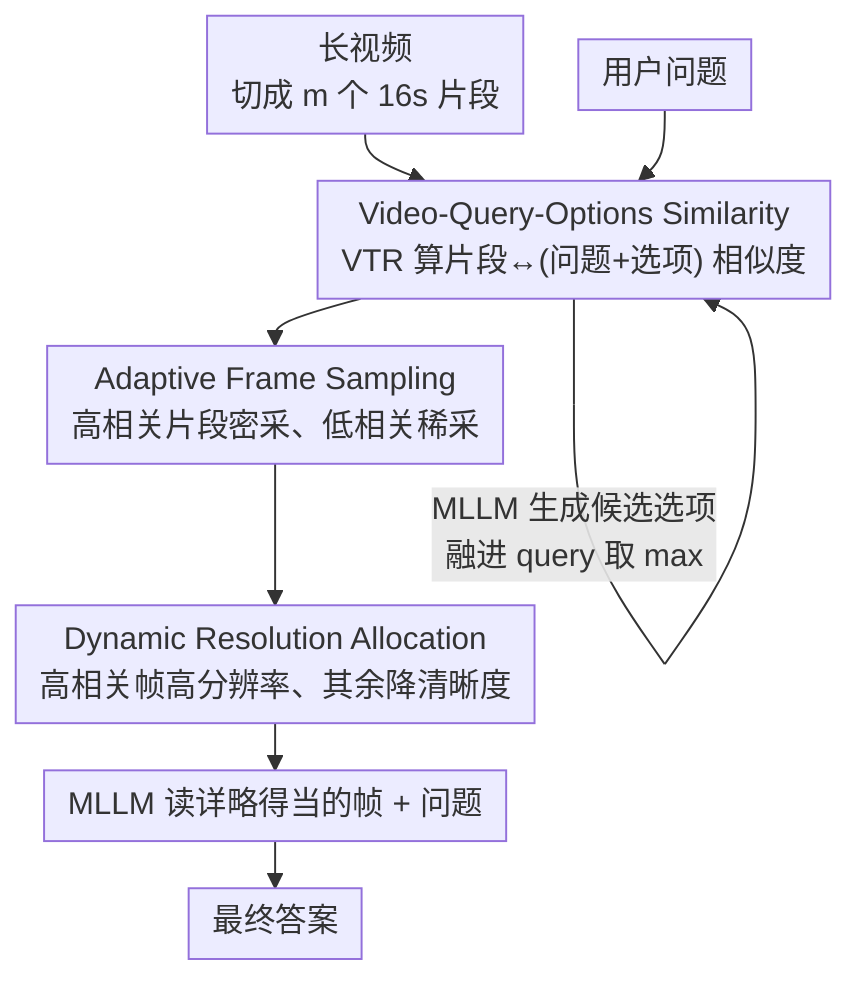

# A Training-Free Framework for Long Video Understanding via Video-Query-Options Similarity

**会议**: ICLR2026  
**OpenReview**: [https://openreview.net/forum?id=hfMfYMoRLk](https://openreview.net/forum?id=hfMfYMoRLk)  
**代码**: https://github.com/wuzhirong520/VTR-VLM  
**领域**: 视频理解  
**关键词**: 长视频理解, 无训练, 关键帧检索, 自适应采样, 多模态大模型

## 一句话总结
针对小时级长视频塞不进多模态大模型上下文的问题，本文提出一套**无需训练**的输入侧框架：用视频-文本检索模型给每个视频片段打相关性分，再据此**自适应加密采样**（AFS）、**动态分配分辨率**（DRA），并让 MLLM 自己生成候选答案融进检索 query（VQOS）来精修相关性估计，在 5 个长视频基准上把 LLaVA-Video 和 Qwen2.5-VL 平均提了 3~5 个点。

## 研究背景与动机
**领域现状**：多模态大模型（MLLM）在图像和短视频上已经很强，但面对小时级长视频时普遍掉链子。根本瓶颈是**有限的上下文窗口装不下海量时空内容**——一段 67 分钟的视频按 1fps 采也有几千帧，远超 token 预算。现有解法分两路：一路是**上下文扩展**（如 LongVILA 用多阶段训练 + 并行技术撑大序列长度），一路是**token 压缩**（如 InternVideo2.5 的层级压缩、VideoXL-2 的任务感知 KV 稀疏化），都试图在固定预算里多塞信息。

**现有痛点**：这两路都要**昂贵的训练**，而 MLLM 架构迭代飞快，今天为某个 backbone 训好的压缩器，明天换 backbone 就得重训，适配成本极高。于是无训练（training-free）路线兴起，其中**检索式**方法最对口——借助 CLIP/SigLIP 这类视觉语言模型的图文检索能力，挑出和问题语义相关的关键帧喂给 MLLM。但现有检索式方法有两个硬伤：（1）大多只做**静态图文检索**，忽略了视频里的动作、因果、时序动态（图 1(b) 举例：问"红衣男上台后 Dominique 做了什么"，靠单帧根本判断不出"拥抱"还是"扇耳光"）；（2）会**挑帧但不会精修**——选出关键帧后，对这些帧里的信息既没深挖也没优化利用。

**核心矛盾**：固定 token 预算下，**帧数 ↔ 单帧分辨率**存在直接 trade-off——想多看几帧就得把每帧缩小，关键帧的空间细节就丢了；想看清就只能少看几帧，时序覆盖又不够。现有方法对所有片段一视同仁地采样和缩放，没有把宝贵的预算倾斜给真正相关的内容。

**切入角度**：作者模仿人类看长视频答题的认知流程——**先提若干假设（hypothesis generation）→ 有选择地回看视频去验证（focused verification）→ 自然过滤无关内容（irrelevance filtering）**。这给了三个抓手：用更强的视频-文本检索模型算相关性、把相关性高的片段密采样且高分辨率、让模型自己生成假设来强化检索。

**核心 idea**：以视频-文本检索的相关性分数为"指挥棒"，在**输入侧**做自适应的帧采样 + 分辨率分配，并用 MLLM 生成的候选答案选项来精修这个相关性分数——全程不动模型权重。

## 方法详解

### 整体框架
输入是一段长视频和一个用户问题，输出是答案。整条流水线发生在把帧喂进 MLLM **之前**，不碰 MLLM 内部权重，所以天然 plug-and-play。

流程是：先把长视频均匀切成 $m$ 个等长片段（实现里是 16 秒一段）；用预训练的视频-文本检索（VTR）模型 PE-G/14 对每个片段和 query 算余弦相似度，得到初始分数 $S^0$；为了让相关性估得更准，让原始 MLLM 看一眼视频粗采样后**生成若干候选答案选项**，把问题分别和每个选项拼成多条文本去检索，取最大相似度作为精修后的分数 $S$（这就是 VQOS）；拿这个分数当指挥棒，**自适应帧采样（AFS）** 给高相关片段分更多帧、**动态分辨率分配（DRA）** 给高相关帧分更高分辨率；最后把这批精挑细选、详略得当的帧连同问题一起送进 MLLM 出答案。AFS 和 DRA 共享同一套相似度分数，是"用多少帧"和"每帧多清晰"两个正交维度上的预算分配。

### 关键设计

**1. Video-Query-Options Similarity（VQOS）：让模型先猜答案，再用答案去检索**

这是全文最核心的创新，针对的是"静态图文检索答不了动作/时序问题"和"相关性估得不准"两个痛点。给定片段 $V_i$ 和查询 $Q$，先用 VTR 模型抽出视频特征 $f_{v_i}$ 和文本特征 $f_q$，算初始余弦相似度 $S^0_i = \frac{f_{v_i}\cdot f_q}{\|f_{v_i}\|\cdot\|f_q\|}$。但只用问题做 query 信息量有限——问题往往是开放式的，和具体视频片段的语义对齐很弱。于是作者让 MLLM 基于粗看的视频**生成 $z$ 个候选答案选项**，把问题分别和每个选项拼成 $z$ 条陈述句 $T=\{T_1,\dots,T_z\}$（比如把"红衣男上台后她做什么"补成"……她拥抱他""……她扇他耳光"），各自编码进特征集合 $F$，最终分数取**所有文本特征里的最大相似度**：

$$S_i = \max_{f\in F}\frac{f_{v_i}\cdot f}{\|f_{v_i}\|\cdot\|f\|}.$$

为什么有效：一条完整的"问题+假设答案"陈述句比孤零零的问题语义更具体、更容易和某个视频片段对上号——这正是人类"先提假设再回看验证"的过程。取 max 相当于"只要有一个假设命中了某片段，就认为该片段高相关"。选项可以分轮生成（把视频切几部分分别生成）以增加多样性；对于选择题，数据集已给选项，可直接跳过生成（对应实验里的 Ours-PO，作为参考上界）。

**2. Adaptive Frame Sampling（AFS）：把帧预算按相关性倾斜**

针对"对所有片段一视同仁采样"的浪费。要从视频里采 $N$ 帧，先按相似度选 top-$k$ 片段，目标是给每段分配帧数 $p_i$ 满足 $\sum_{i=1}^k p_i = N$ 且 $S_i \le S_j \Rightarrow p_i \le p_j$（相似度越高分到的帧越多）。直接解这个带序约束的分配麻烦，作者用了分层近似：把 top-$k$ 片段按相似度降序排，划成 $L_1$ 个采样层级，第 $l$ 层含 $m_l$ 个片段、每段采 $c_l$ 帧，满足 $\sum_l m_l = k$、$\sum_l m_l c_l = N$ 且 $c_1>c_2>\dots>c_{L_1}$。预设每层采样帧数 $\{c_l\}$（如 $\{2,4,8\}$ 或 $\{8,16,32\}$），用线性规划工具 PuLP 解出各层片段数 $\{m_l\}$。这样高相关片段进高采样层、密集采帧，低相关片段稀疏采，在固定 $N$ 下最大化语义覆盖。

**3. Dynamic Resolution Allocation（DRA）：把分辨率预算也按相关性倾斜**

针对"帧数 ↔ 分辨率"的核心 trade-off。AFS 解决了"看哪些片段、看几帧"，DRA 进一步解决"每帧看多清楚"。在固定总 token 预算 $P$ 下，给关键帧高分辨率、非关键帧低分辨率。定义 $L_2$ 个分辨率层级，缩放因子 $\alpha_1>\dots>\alpha_{L_2}\in(0,1]$ 保持长宽比：$H_i=\lfloor\frac{\alpha_i H}{I}\rfloor\cdot I$，$W_i$ 同理，其中 $I=28$ 是视觉编码器 patch 尺寸带来的步长约束，且每个分辨率受限于有效范围 $C_{min}\le H_i,W_i\le C_{max}$。分配 $\{n_1,\dots,n_L\}$ 要满足 $\sum_i n_i = N$（所有帧都分到某层）和 $\sum_i n_i H_i W_i = P$（总 token 数等于预算）；相似度最高的 $n_1$ 帧分到最高分辨率 $(H_1,W_1)$。为简化计算，假设每个分辨率层级**均分总 token 预算**，则第 $i$ 层帧数近似为 $\hat n_i=\lfloor\frac{P}{L\cdot H_i W_i}\rfloor$。注意 DRA 只对支持可变分辨率输入的 backbone（如 Qwen2.5-VL）启用；LLaVA-Video 固定吃 $384\times384$，就不用 DRA。

**4. 多轮选项生成 + 候选池收缩的完整调度（伪代码 Algorithm 1）：把上面三件事串成可并行的流水线**

前三个设计是组件，这里是把它们组织起来的完整算法，也解释了 $S^0$ 和 $S$ 的分工。先用 VTR 编码问题和所有片段，算初始 $S^0$，取 top-$R\cdot N$ 个最相关片段组成精化候选池 $V'$（先粗筛掉绝大多数无关片段，省后续开销）。然后做 $R$ 轮选项生成：每轮从 $V'$ 采 $N$ 段、用 $S^0$ 指导的 AFS+DRA 处理后喂 MLLM 生成候选选项，累积所有选项。接着对每个选项把"问题+选项"重编码、和所有片段算相似度并取 max，得到精修分数 $S$（即 VQOS）。最后用 $S$ 选 top-$N$ 片段、再过一遍 AFS+DRA，连同问题送 MLLM 出最终答案。关键工程点：$R$ 轮选项生成彼此**时序无关、可并行**加速。所以 $S^0$ 负责"初筛候选池"、$S$ 负责"终选答题帧"，两者走同一套 AFS/DRA 管线。

### 损失函数 / 训练策略
无训练目标——整个方法不涉及任何参数更新或微调，是纯推理期的输入侧框架。关键超参（实现细节）：片段长 16 秒、VTR 用 PE-G/14、fps=1；LLaVA-Video 限 64 帧、top-16 段、采样层级 $\{2,4,8\}$、不用 DRA；Qwen2.5-VL 限 768 帧、top-48 段、采样层级 $\{8,16,32\}$、分辨率预算 $20480\times28\times28$、分辨率范围 84~644；选项生成轮数 LLaVA-Video 取 3、Qwen2.5-VL 取 1。

## 实验关键数据

### 主实验
在 5 个长视频基准（LVBench 67min、MLVU 13min、LongVideoBench 8min、VideoMME 17min、VideoEval-Pro 38min）上，把方法集成进 LLaVA-Video 和 Qwen2.5-VL 的 7B/72B 两个规模。Ours-GO 表示选项由 MLLM 自己生成（通用、公平对比），Ours-PO 表示用数据集提供的选择题选项（仅供参考）。

| 模型 (7B) | LVBench | MLVU | LongVB | VideoMME | VEP-Avg | 平均 |
|--------|------|------|------|------|------|------|
| LLaVA-Video | 42.0 | 69.3 | 57.4 | 63.2 | — | 50.6 |
| + AKS | 47.0 | 69.1 | 62.9 | 65.3 | — | 54.1 |
| + AdaReTake | 49.6 | 70.6 | 59.6 | 64.0 | — | 54.2 |
| **+ Ours-GO** | **51.3** | 70.3 | 61.0 | 64.8 | — | **55.9** |
| Qwen2.5-VL | 45.5 | 69.4 | 61.0 | 66.4 | — | 52.8 |
| + AdaReTake | 51.0 | 72.9 | 61.9 | 67.4 | — | 56.3 |
| **+ Ours-GO** | **52.7** | 72.3 | 63.4 | 66.7 | — | **57.8** |
| + Ours-GO + AdaReTake | **55.5** | 74.3 | 63.0 | 69.3 | — | **59.1** |

7B 规模上 Ours-GO 把 LLaVA-Video / Qwen2.5-VL 分别平均提 **5.3% / 5.0%**，72B 规模提 **3.6% / 3.2%**。在最长的两个基准（LVBench 67min、VideoEval-Pro 38min）优势尤其明显，7B 模型平均超基线 **8.5% / 8.3%**——证明视频越长、相关性引导的预算分配越值钱。由于 AdaReTake 是 token 级压缩、与本文输入级方法正交，二者叠加（Ours-GO + AdaReTake）还能再涨约 1%。整体在无训练前提下达到非闭源模型的 SOTA。

### 消融实验
按组件逐个叠加（LLaVA-Video-7B / Qwen2.5-VL-7B，∆avg 为相对上一行的平均增量）：

| 配置 | ∆avg (LLaVA) | ∆avg (Qwen) | 说明 |
|------|------|------|------|
| top-N 帧检索 | +4.3 | +2.0 | 图文检索挑帧的基础收益 |
| + top-k 段均匀采样 | +0.2 | +0.0 | 段级检索 ≈ 帧级检索，单独无增量 |
| + AFS（自适应帧采样） | +0.7 | +0.8 | 相关性引导的密采有效 |
| + DRA（动态分辨率） | — | +2.1 | Qwen 上贡献最大的单项 |
| + 生成选项（VQOS-GO） | +0.7 | +0.4 | MLLM 自生成假设精修检索 |
| + 提供选项（VQOS-PO） | +1.5 | +1.2 | 有正确选项时的上界参考 |

另外两组分析：（1）**VTR 模型消融**（表 3，LVBench）——模型越大、分辨率越高、有视频专门预训练，准确率越高（PE-G/14 达 54.2 但每分钟视频耗时 15.5s，CLIP-B/32 仅 0.6s 但 49.8），算力受限时小模型仍可用；作者还给出复用 LLaVA 自带视觉编码器的"SigLIP-LLaVA"零额外 VTR 方案。（2）**片段长度与 fps**（表 4）——16 秒片段总体最优，过长（64s）会因片段内信息混杂而掉点。

### 关键发现
- **DRA 在 Qwen2.5-VL 上是单项贡献最大的组件（+2.1%）**，但在固定分辨率的 LLaVA-Video 上用不了——说明分辨率维度的预算分配价值取决于 backbone 是否支持可变分辨率。
- **段级均匀采样相比帧级检索几乎无增量（+0.2%/+0.0%）**，真正的增量来自 AFS 的"按相关性密采"和 VQOS 的"假设增强检索"，证明核心不在"检索"本身而在"相关性怎么估、预算怎么分"。
- **视频越长收益越大**（LVBench/VideoEval-Pro 上 +8.5%），印证了方法的设计动机——长视频里冗余越多，相关性引导的倾斜分配越关键。

## 亮点与洞察
- **把"生成假设答案"变成检索 query 的一部分（VQOS）**很巧妙：开放式问题本身和视频片段语义对齐弱，补上一个具体的假设答案后陈述句信息量陡增，取 max 相似度等价于"任一假设命中即高相关"，这是认知科学"假设-验证"循环的直接工程化。
- **AFS 和 DRA 把固定 token 预算拆成"帧数"和"单帧分辨率"两个正交维度分别按相关性倾斜**，比传统"一刀切均匀采样+统一缩放"细腻得多，且用线性规划（PuLP）求解分配，简单可控。
- **纯输入侧、零训练**，所以和 token 级压缩方法（AdaReTake）正交可叠加，也能无痛迁移到任何新 backbone——这正好回应了"MLLM 架构迭代飞快，训练式方法适配成本高"的痛点，可迁移性极强。

## 局限与展望
- **依赖一个强 VTR 模型**：PE-G/14 准确率高但每分钟视频要 15.5s 推理，是非平凡开销；作者辩称流式场景下可与视频摄入延迟重叠隐藏，但离线批处理时这笔开销仍在。
- **Ours-PO 依赖数据集提供选项**，只适用于选择题，开放式问答下用不了，因此论文也明确它"仅供参考"；通用场景靠 Ours-GO，而自生成选项的质量受限于 MLLM 对粗采样视频的初步理解。
- **超参偏经验性**：片段长 16s、采样层级 $\{2,4,8\}$/$\{8,16,32\}$、选项轮数等都是手调的固定值，跨数据集/视频类型的鲁棒性和自动化选取仍有空间。
- DRA 假设"每个分辨率层级均分 token 预算"，这是为求解简便做的近似，未必是最优的预算分配。

## 相关工作与启发
- **vs 上下文扩展类（LongVILA / InternVideo2.5 / VideoXL-2）**：它们靠多阶段训练或 KV 稀疏化撑大可处理序列，需要昂贵训练且绑定特定 backbone；本文无训练、纯输入侧，可即插即用到任意新 MLLM。
- **vs Agent 式无训练方法（Deep Video Discovery 等）**：它们把视频切片后让 LLM agent 生成字幕再答题，依赖视频描述（计算重、细粒度视觉细节丢失），且常用 GPT-4o 当 agent 导致对比不公平；本文直接在像素/帧层面工作，不经过"视频→文本"的有损抽象。
- **vs 检索式无训练方法（AKS / AdaReTake）**：AKS 用 CLIP 图文相似度选帧，只看静态图、答不了动作/时序问题；AdaReTake 是 token 级 KV 压缩。本文用专门的**视频-文本**检索模型 + 选项增强（VQOS）做更精的相关性估计，并把分数同时用于帧采样和分辨率分配；与 AdaReTake 正交可叠加。

## 评分
- 新颖性: ⭐⭐⭐⭐ VQOS"先生成假设答案再检索"的认知化设计，配合帧数/分辨率双维度自适应分配，组合新颖且贴合长视频痛点
- 实验充分度: ⭐⭐⭐⭐⭐ 2 个 backbone × 2 规模 × 5 基准 + 逐组件消融 + VTR/片段长/fps 多维分析，扎实
- 写作质量: ⭐⭐⭐⭐ 动机和方法叙述清晰，公式与伪代码完整；个别拼写笔误（如 simiarity）
- 价值: ⭐⭐⭐⭐ 无训练、可迁移、与压缩方法正交，长视频场景实用性强

<!-- RELATED:START -->

## 相关论文

- [\[CVPR 2026\] DIvide, then Ground: Adapting Frame Selection to Query Types for Long-Form Video Understanding](../../CVPR2026/video_understanding/divide_then_ground_adapting_frame_selection_to_query_types_for_long-form_video_u.md)
- [\[NeurIPS 2025\] Unleashing Hour-Scale Video Training for Long Video-Language Understanding](../../NeurIPS2025/video_understanding/unleashing_hour-scale_video_training_for_long_video-language_understanding.md)
- [\[ICLR 2026\] FLoC: Facility Location-Based Efficient Visual Token Compression for Long Video Understanding](floc_facility_location-based_efficient_visual_token_compression_for_long_video_u.md)
- [\[ICML 2026\] Video-MTR: Reinforced Multi-Turn Reasoning for Long Video Understanding](../../ICML2026/video_understanding/video-mtr_reinforced_multi-turn_reasoning_for_long_video_understanding.md)
- [\[ICLR 2026\] FlashVID: Efficient Video Large Language Models via Training-free Tree-Based Spatiotemporal Token Merging](flashvid_efficient_video_large_language_models_via_training-free_tree-based_spat.md)

<!-- RELATED:END -->
