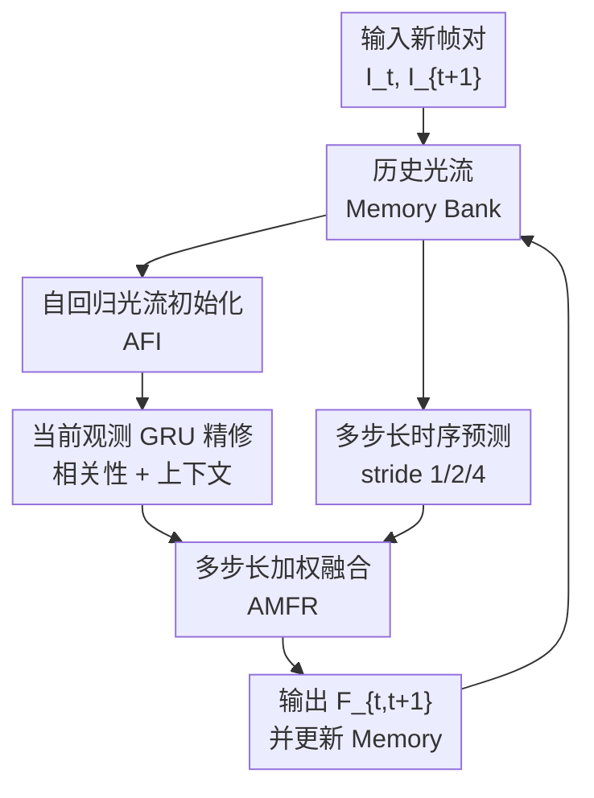

# ARFlow: Auto-regressive Optical Flow Estimation for Arbitrary-Length Videos via Progressive Next-Frame Forecasting

**会议**: ICLR 2026  
**OpenReview**: [https://openreview.net/forum?id=iJ7cyttpVj](https://openreview.net/forum?id=iJ7cyttpVj)  
**代码**: 暂未确认  
**领域**: 视频理解 / 光流估计  
**关键词**: 自回归光流, 多帧光流, 长视频建模, 时序 Transformer, 运动预测  

## 一句话总结
ARFlow 把多帧光流从“固定长度 clip 内一次性估计”改成“逐帧自回归预测下一帧光流”，用历史光流初始化当前估计、再用多步长时序预测融合短期与长期运动线索，在几乎恒定显存下提升了 Sintel、KITTI 和 Spring 等基准的光流精度。

## 研究背景与动机
**领域现状**：光流估计要预测相邻两帧之间每个像素的二维位移，是视频补全、动态场景重建、自动驾驶感知和视频生成等任务里的基础模块。近几年主流方法从 CNN、金字塔匹配、RAFT 式循环更新，发展到 Transformer 或扩散式建模，但很多强方法本质上仍是 pairwise：输入两帧，输出一张光流图。

**现有痛点**：pairwise 方法天然看不到更长时间范围内的运动连续性，尤其在遮挡、出界、细小快速物体和运动边界处，当前两帧的信息往往不足。多帧光流方法试图补上这个缺口，但多数做法把视频切成固定长度的小组，例如 3 帧、4 帧或 5 帧，再在组内估计光流。这样虽然引入了局部时间上下文，却把长视频切断了。

**核心矛盾**：长时间上下文对光流有用，但直接把很多帧一起送进网络会让特征提取、相关性构造和中间状态的显存快速增长；如果只用短 clip，又失去了跨组的信息交换。也就是说，现有多帧方法在“看得足够长”和“算得足够省”之间卡住了。

**本文目标**：作者希望设计一种能处理任意长度视频的多帧光流框架。它需要在新帧到来时只保留有限历史状态，不重复处理早期帧；同时还要让历史运动真正参与当前光流估计，而不是只作为浅层 warm-start。

**切入角度**：论文把视频中的连续光流看成一个可自回归预测的序列。历史光流本身已经编码了物体运动趋势、遮挡变化和局部边界的动态信息，因此可以像视频生成里的 next-frame forecasting 一样，用过去若干步的光流去预测下一步光流。

**核心 idea**：用固定长度 memory bank 保存历史低分辨率光流，通过自回归 Transformer 预测当前帧对的初始光流，再结合当前两帧观测和多步长历史预测做精修，从而把多帧光流扩展到任意长度视频。

## 方法详解

### 整体框架
ARFlow 的输入是视频序列 $I_1, I_2, \ldots, I_L$，输出是相邻帧之间的光流 $F_{1,2}, F_{2,3}, \ldots, F_{L-1,L}$。和一次性处理固定 clip 的方法不同，ARFlow 每次只接收一个新帧 $I_{t+1}$，基于历史光流 memory bank 预测当前帧对 $(I_t, I_{t+1})$ 的光流，然后把新的结果写回 memory bank，进入下一步。

整个流程由两个核心模块组成：Auto-regressive Flow Initialization（AFI）先从历史光流序列中预测一个初始光流 $f_{t,t+1}$，让后续优化从更接近真实运动的位置出发；Auto-regressive Multi-stride Flow Refinement（AMFR）再结合当前图像匹配特征、GRU 更新和 stride 1/2/4 的历史预测，得到最终光流 $F_{t,t+1}$。由于 memory bank 长度固定、历史光流以 $1/16$ 分辨率存储，视频变长时显存不会随帧数线性增长。

### 关键设计
**1. 自回归光流初始化：把历史运动趋势变成当前帧的起点**

传统 RAFT 类方法通常从零光流或一个简单 warm-start 开始迭代，这对相邻两帧变化不大时够用，但在遮挡、快速运动或长视频累积变化时，初始化离真实值太远会让后续迭代承担过多修正压力。ARFlow 的 AFI 不直接从图像猜当前光流，而是先读最近 $T$ 个历史光流 $\{F_{i,i+1}\}_{i=t-T}^{t-1}$，让时序 Transformer 在这些运动场之间建模，再用最后一个 token 预测当前的初始光流 $f_{t,t+1}$。

这个设计的关键不是“多存几帧”，而是把历史估计当成可预测的运动序列。动态物体的运动、相机运动、遮挡边界在连续帧中往往有惯性，过去的 flow field 已经包含了这些趋势。AFI 用 $\mathrm{Trans}^{(1)}$ 聚合历史序列，再通过轻量卷积投影 $\phi(\cdot)$ 得到 $f_{t,t+1}$，相当于在当前图像匹配开始前先给模型一个时序先验。消融里去掉 AFI 后，Sintel Final 从 2.07 变差到 2.15，KITTI EPE 从 2.86 变差到 3.05，说明这个起点确实减少了后续 refinement 的负担。

**2. 固定长度低分辨率记忆：让长视频上下文不变成显存灾难**

ARFlow 能处理任意长度视频，靠的是“递推状态”而不是“缓存所有帧特征”。memory bank 只保存最近 $T$ 个已经预测出的光流，并且这些光流位于原图 $1/16$ 分辨率；新光流产生后写入 bank，最老的一个被滑窗丢弃。这样每一步计算只依赖固定数量的历史 flow token，复杂度和显存主要由 $T$、特征分辨率和当前帧对决定，而不是由整段视频长度决定。

这和之前 group-wise 多帧方法的差异很大。MemFlow、StreamFlow 等方法在每个固定 clip 内做多帧估计，clip 之间的信息交换有限，而且视频长度或输入帧数增加时，特征抽取和中间状态会重复占用显存。ARFlow 的递推机制更像在线处理：历史被压缩为光流 memory，而不是保留整段视频的图像特征。因此论文报告在任意长度输入下推理显存约为 2.1GB，Spring 1080p 上用 8 帧上下文也只需 2.10GB，与 MEMFOF 的 2.09GB 接近，但远低于 StreamFlow 的 18.97GB。

**3. 多步长时序精修：同时利用短期细节和长期运动变化**

仅用 stride 1 的历史光流预测容易偏向相邻帧的短期平滑，能捕捉细微变化，却不一定能理解更慢、更长范围的运动模式；只看更大 stride 又可能错过局部边界和瞬时加速度。AMFR 的做法是在 GRU 精修之后，再构建 stride 1、stride 2、stride 4 三种时间粒度的预测分支。具体地，模型先用 stride 1 的 Transformer 得到 $\mathrm{Feat}^{(1)}$，再在间隔采样的 token 上级联 $\mathrm{Trans}^{(2)}$ 和 $\mathrm{Trans}^{(4)}$，预测 $f^{(2)}_{t,t+1}$、$f^{(4)}_{t,t+1}$ 以及融合特征。

最终输出不是简单平均这些预测，而是学习一个权重 $w_{t,t+1}$，在 GRU 输出 $f^K_{t,t+1}$ 和多步长融合预测 $f_{\mathrm{fuse}}$ 之间做加权：$F_{t,t+1}=w_{t,t+1}f^K_{t,t+1}+(1-w_{t,t+1})f_{\mathrm{fuse}}$。这让模型可以根据当前场景选择更相信图像匹配后的细节，还是更相信长短期历史运动先验。消融显示单独用 stride 1/2/4 都不如三者组合，说明不同时间尺度并非冗余，而是在遮挡、边界和速度变化上互补。

**4. 当前观测 GRU 与历史预测分工：先给方向，再用图像证据校正**

ARFlow 不是完全依赖历史 flow 外推。对于当前帧对，模型仍然提取 ResNet-FPN 图像特征，构造相关性体 $V(u,v)=\langle E_t(u), E_{t+1}(v)\rangle$，并用 RAFT/GMA 风格的 GRU update block 迭代更新光流。差别在于：如果已有历史 memory，GRU 的初始输入不是零或普通 flow head 的输出，而是 AFI 预测的 $f_{t,t+1}$；每次迭代再根据当前相关性查表、motion encoder 和 context feature 产生残差 $\Delta f^k_{t,t+1}$。

这种分工很清楚：历史预测负责告诉模型“当前运动大概会往哪里走”，当前图像匹配负责纠正外推误差并恢复像素级细节。公式上，每轮更新是 $f^k_{t,t+1}=f^{k-1}_{t,t+1}+\Delta f^k_{t,t+1}$。由于初始值更靠谱，论文可以在 $1/16$ 分辨率上用较少的 GRU 迭代得到高质量结果，最后再像 RAFT 一样做 convex upsampling 到输入分辨率。

### 一个完整示例
假设一段自动驾驶视频中车辆从左向右穿过画面，ARFlow 在估计 $F_{t,t+1}$ 时，memory bank 里已经存有 $F_{t-6,t-5}$ 到 $F_{t-1,t}$ 这 6 个低分辨率光流。AFI 首先读取这些历史 flow，发现同一运动边界在过去几帧持续右移，于是预测一个初始 $f_{t,t+1}$，让车辆区域从一开始就有接近真实方向和幅度的位移。

接着，当前帧对 $I_t,I_{t+1}$ 的特征相关性会检查这个预测是否被图像证据支持。如果车辆边缘因为遮挡出现局部错配，GRU 迭代会通过相关性查表和上下文特征逐步修正边界。与此同时，AMFR 的 stride 1 分支关注最近连续帧的微小变化，stride 2/4 分支关注更长时间范围内车辆整体速度和遮挡趋势，最后用学习到的 $w_{t,t+1}$ 决定当前像素更应相信 GRU 的局部匹配还是多步长历史外推。输出的 $F_{t,t+1}$ 被写回 memory bank，下一帧继续复用。

### 损失函数 / 训练策略
训练目标沿用 SEA-RAFT 的 mixture-of-Laplace（MoL）损失，并对 RAFT 风格的多轮 refinement 做 deep supervision。给定 $T$ 个时间步和 $K$ 次 refinement，总损失写作 $L=\frac{1}{T}\sum_{t=1}^{T}\sum_{k=0}^{K}\gamma^{K-k}L^{t,k}_{\mathrm{MoL}}$，其中 $\gamma=0.85$，更强调后期 refinement 的结果。

除了每轮 GRU 输出 $f^k_{t,t+1}$，论文还对 AFI 初始预测 $f_{t,t+1}$、stride 2/4 预测 $f^{(2)}_{t,t+1}$、$f^{(4)}_{t,t+1}$、融合预测 $f_{\mathrm{fuse}}$ 和最终输出 $F_{t,t+1}$ 施加同类监督。这一点很重要：多步长分支不是只在最后被动参与加权，而是在训练过程中被明确要求学会合理预测下一帧 flow。

训练流程分为预训练和 benchmark-specific fine-tuning。论文先在 TartanAir 上训练 225k steps，再在 FlyingThings3D 上训练 120k steps，随后在 FlyingThings、Sintel、KITTI、HD1K 的组合数据上训练 225k steps；提交各基准时再分别对 Sintel、KITTI-15 和 Spring 做轻量微调。默认 memory 长度 $T=6$，GRU refinement 迭代 $K=6$。

## 实验关键数据

### 主实验
ARFlow 在 Sintel、KITTI-15 和 Spring 上都对强多帧方法形成了小但稳定的优势。尤其在 KITTI-15 与 Spring 上，论文强调其同时具备高精度和低显存，而不是通过大输入 clip 或重型后处理换取榜单结果。

| 数据集 | 指标 | ARFlow | 之前强基线 | 提升 |
|--------|------|--------|------------|------|
| Sintel Final test | All EPE ↓ | 1.78 | StreamFlow 1.87 / MEMFOF 1.91 | 相比 StreamFlow 降低 0.09 |
| Sintel Clean test | All EPE ↓ | 0.96 | MEMFOF 0.96 | 并列最好 |
| KITTI-15 test | All ↓ | 2.85 | MEMFOF 2.94 | 降低 0.09 |
| KITTI-15 test | Non-Occ ↓ | 1.91 | MEMFOF 1.97 | 降低 0.06 |
| Spring test fine-tune | EPE ↓ | 0.353 | MEMFOF 0.355 / DPFlow 0.340 | 多帧低显存方法中更优 |
| Spring test fine-tune | Fl ↓ | 1.212 | MEMFOF 1.238 | 降低 0.026 |

在 Spring 1080p 推理设置下，ARFlow 的效率数据也很关键：它使用 8 帧上下文，显存 2.10GB、运行时间 403ms；MEMFOF 为 3 帧、2.09GB、472ms；StreamFlow 为 4 帧、18.97GB、929ms。换句话说，ARFlow 并不是靠堆更多显存处理长序列，而是用自回归状态把历史信息压缩进低分辨率 flow memory。

| 方法 | #Frames | Spring 显存 GB ↓ | Runtime ms ↓ | Spring EPE ↓ | Spring WAUC ↑ |
|------|---------|------------------|--------------|--------------|---------------|
| MemFlow | 3 | 8.08 | 885 | 0.471 | 93.855 |
| StreamFlow | 4 | 18.97 | 929 | 0.467 | 94.404 |
| DPFlow | 2 | 10.39 | 990 | 0.340 | 94.663 |
| MEMFOF | 3 | 2.09 | 472 | 0.355 | 95.186 |
| ARFlow | 8 | 2.10 | 403 | 0.353 | 95.283 |

### 消融实验
组件消融表明，AFI 和 AMFR 都不是装饰模块。去掉 AFI 后，初始化退化，Sintel Final 与 KITTI EPE 都明显上升；去掉 AMFR 后，模型还保留了历史初始化和当前 GRU，但缺少多步长历史融合，结果也稳定变差。

| 配置 | Sintel Clean ↓ | Sintel Final ↓ | KITTI EPE ↓ | KITTI F1-all ↓ | 说明 |
|------|----------------|----------------|-------------|----------------|------|
| w/o AFI | 0.95 | 2.15 | 3.05 | 10.11 | 没有历史光流初始化 |
| w/o AMFR | 0.91 | 2.13 | 3.00 | 9.73 | 没有多步长时序精修 |
| Full ARFlow | 0.88 | 2.07 | 2.86 | 9.21 | 两个模块同时使用 |

AMFR 的 stride 设计也支持论文的核心判断：短期和长期运动都重要。只用 stride 1、2 或 4 任一种都不如 stride 1+2+4 的组合；memory 长度从 4 增到 6 时收益明显，继续加到 7 或 8 后收益趋于饱和，说明固定长度 history 已经能覆盖主要时序线索。

| 设置 | Sintel Clean ↓ | Sintel Final ↓ | KITTI EPE ↓ | KITTI F1-all ↓ | 观察 |
|------|----------------|----------------|-------------|----------------|------|
| Single stride 1 | 0.89 | 2.10 | 2.89 | 9.52 | 更偏短期变化 |
| Single stride 2 | 0.90 | 2.12 | 2.93 | 9.55 | 中等间隔不足以单独覆盖全部运动 |
| Single stride 4 | 0.91 | 2.12 | 3.00 | 9.68 | 长期线索有用但细节较弱 |
| Stride 1+2+4 | 0.88 | 2.07 | 2.86 | 9.21 | 多粒度组合最好 |
| T=4 | 0.91 | 2.11 | 2.96 | 9.43 | 历史窗口偏短 |
| T=6 | 0.88 | 2.07 | 2.86 | 9.21 | 默认设置，精度/效率较均衡 |
| T=8 | 0.89 | 2.06 | 2.86 | 9.17 | 略有变化，收益趋于饱和 |

### 关键发现
- AFI 的贡献体现在“更好的起点”：它不是简单后处理，而是直接降低当前帧对 refinement 的难度，尤其有助于遮挡和运动边界处的稳定估计。
- AMFR 的贡献体现在“不同时间尺度互补”：stride 1 捕捉近邻帧的细节，stride 2/4 提供更长范围的运动趋势，融合后优于任一单 stride。
- 长视频可扩展性是本文最重要的工程价值：ARFlow 用固定 memory bank 逐帧递推，使 8 帧上下文下仍保持 2.10GB 推理显存，而不是像部分 group-wise 方法那样随帧数显著增长。
- 兼容性实验显示，ARFlow 思路能接到 SEA-RAFT、DPFlow、FlowSeek、WAFT 等不同 baseline 上，并带来约 5% 到 11.6% 的相对收益，说明它更像一个通用时序建模插件，而不是只服务于某个 backbone 的技巧。
- 定性结果里，论文强调 ARFlow 在 Sintel 的运动边界更锐利，在 KITTI 的遮挡区域更能区分前后景；这和长短期历史 flow 辅助遮挡判断的设计相吻合。

## 亮点与洞察
- 最巧妙的地方是把“历史光流”当成自回归序列，而不是把“历史图像特征”无限堆进模型。这样既保留了运动趋势，又把长视频成本压到固定窗口内。
- AFI 与 AMFR 的分工很清楚：AFI 解决初始值问题，AMFR 解决单一时间尺度不足的问题，当前图像 GRU 则负责像素级校正。三个部分合起来比单纯加 memory 更有结构感。
- 这篇论文对在线视频感知很友好。自动驾驶、机器人和实时视频理解场景往往无法等待整段视频，也无法承受长 clip 的显存开销；ARFlow 的逐帧递推形式更接近实际部署。
- 多步长 temporal modeling 的想法可以迁移到其它 dense prediction 任务。例如未来帧分割、深度估计、scene flow 或动态 3D 重建，都可能把历史 dense map 作为低分辨率 memory，再用 stride 1/2/4 的时序模块预测下一步。
- 论文没有把自回归做成生成式噱头，而是落在光流估计里一个很具体的问题上：下一帧 motion prior 怎么给、怎么精修、怎么保持显存恒定。这让方法更容易复现和接入现有 RAFT/GMA 系列框架。

## 局限与展望
- 自回归方法会面对误差传播风险。虽然每一步都有当前图像匹配和 GRU 校正，但如果连续多帧中的 flow 估计出现系统性偏差，memory bank 仍可能把错误趋势带到后续帧。
- memory 长度 $T$ 是固定窗口，能让显存稳定，但也意味着极长周期的运动模式最终会被滑窗丢弃。论文的消融显示 $T=6$ 已较均衡，但更长场景中的周期性运动、反复遮挡仍值得进一步分析。
- 方法依赖高质量历史光流作为时序 token，在纹理极弱、快速形变、极端 motion blur 等场景中，历史 flow 本身可能不可靠。未来可以考虑显式估计 memory 置信度，或在低置信区域减少历史外推权重。
- AMFR 当前使用 stride 1/2/4 的固定多尺度设计。更自适应的时间采样，例如按运动速度、遮挡程度或不确定性动态选择历史帧，可能进一步提升长视频泛化能力。
- 论文主要围绕标准光流 benchmark 展开，对真实在线系统中的延迟、丢帧、可变帧率和跨镜头切换讨论较少。若用于机器人或自动驾驶，还需要更细的鲁棒性评估。

## 相关工作与启发
- **vs RAFT**: RAFT 通过相关性体和循环更新强力优化两帧光流，但主要是 pairwise 范式；ARFlow 继承这类 GRU refinement 的优点，同时把初始值和最终融合都接入历史时序预测。
- **vs MemFlow / MEMFOF**: 这些方法引入 memory 机制来改进多帧光流，但通常仍受固定短序列或局部上下文限制；ARFlow 更强调自回归地预测下一帧 flow，并用固定低分辨率 memory 支撑任意长度视频。
- **vs StreamFlow**: StreamFlow 用 in-batch 方式同时估计多帧连续光流，能利用局部序列信息，但显存随输入帧数上升明显；ARFlow 则逐帧处理，只保存历史 flow memory，因此更适合长视频。
- **vs VideoFlow / SplatFlow**: 这些方法通过三帧或多帧运动传播增强估计，优势在于显式利用邻近帧，但时间感受野仍偏短；ARFlow 的 stride 2/4 分支让历史信息覆盖更长间隔。
- **启发**：对很多视频任务来说，“保存完整帧特征”不是唯一使用历史的方式。把历史输出压缩成可预测状态，再让当前观测校正它，可能是兼顾长期上下文和在线效率的一条通用路线。

## 评分
- 新颖性: ⭐⭐⭐⭐⭐ 自回归 next-frame forecasting 用在多帧光流上很自然但少见，且 AFI + AMFR 的结构比较完整。
- 实验充分度: ⭐⭐⭐⭐⭐ 覆盖 Sintel、KITTI、Spring、zero-shot、兼容性、组件消融和效率对比，证据链较扎实。
- 写作质量: ⭐⭐⭐⭐☆ 方法图和主线清楚，但 MoL 细节和部分实现参数依赖补充材料，正文略偏工程压缩。
- 价值: ⭐⭐⭐⭐⭐ 同时提升精度、效率和长视频可扩展性，对视频理解、自动驾驶和机器人场景都有直接参考价值。

<!-- RELATED:START -->

## 相关论文

- [\[CVPR 2026\] FlowFM: Advancing Dark Optical Flow Estimation with Flow Matching](../../CVPR2026/video_understanding/flowfm_advancing_dark_optical_flow_estimation_with_flow_matching.md)
- [\[CVPR 2026\] U2Flow: Uncertainty-Aware Unsupervised Optical Flow Estimation](../../CVPR2026/video_understanding/u2flow_uncertainty_aware_unsupervised_optical_flow_estimation.md)
- [\[ICLR 2026\] What Happens Next? Anticipating Future Motion by Generating Point Trajectories](what_happens_next_anticipating_future_motion_by_generating_point_trajectories.md)
- [\[ICCV 2025\] MEMFOF: High-Resolution Training for Memory-Efficient Multi-Frame Optical Flow Estimation](../../ICCV2025/video_understanding/memfof_high-resolution_training_for_memory-efficient_multi-frame_optical_flow_es.md)
- [\[CVPR 2026\] From Contrast to Consistency: Rethinking Event-based Continuous-Time Optical Flow Estimation](../../CVPR2026/video_understanding/from_contrast_to_consistency_rethinking_event-based_continuous-time_optical_flow.md)

<!-- RELATED:END -->
