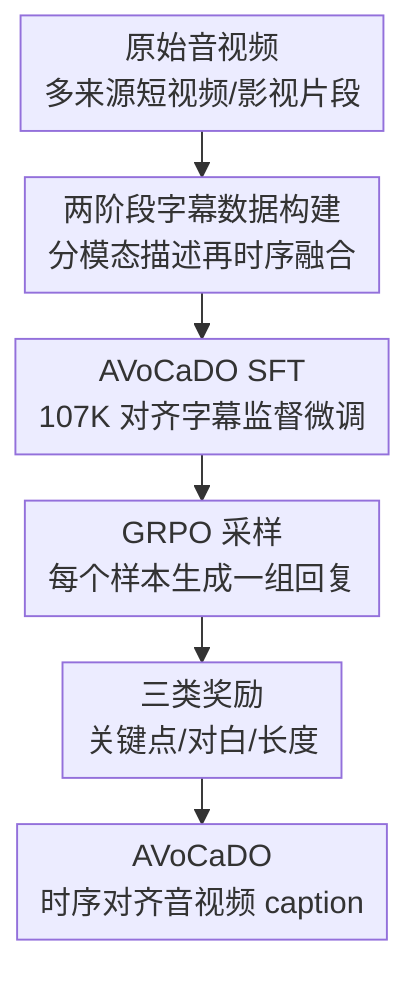

# AVoCaDO: An Audiovisual Video Captioner Driven by Temporal Orchestration

**会议**: ICLR 2026  
**OpenReview**: [https://openreview.net/forum?id=vjEl1PuIDE](https://openreview.net/forum?id=vjEl1PuIDE)  
**论文**: [Project Page](https://avocado-captioner.github.io/)  
**代码**: 有望开源，论文中说明将 release model/code  
**领域**: 视频理解 / 音视频字幕生成  
**关键词**: 音视频字幕生成, 时序对齐, 多模态大模型, GRPO, 对话转写

## 一句话总结
AVoCaDO 基于 Qwen2.5-Omni，通过 107K 高质量时序对齐音视频字幕数据做 SFT，再用面向关键事件、对话和长度的 GRPO 奖励微调，让 7B 音视频字幕模型在多个 audiovisual captioning benchmark 上超过现有开源模型，部分指标还追上或超过 Gemini-2.5 系列。

## 研究背景与动机
**领域现状**：视频字幕生成已经从早期的短句描述走向细粒度、多事件、长文本叙事，VideoLLM 也越来越多地把高质量 caption 当成视频理解和视频生成的语义中间层。Tarsier、OwlCap、AuroraCap 等方法主要围绕视觉帧、动作、镜头和静态细节来构建训练数据或奖励，目标是让模型更完整地描述画面。

**现有痛点**：真实视频并不是纯视觉信号。短视频、访谈、影视片段、广告、教学视频里，语音对白、旁白、音乐、音效经常直接解释画面正在发生什么。如果只看视觉，模型可能知道“一个人坐在旗帜前说话”，却不知道他说了哪句话；如果把独立音频 caption 和独立视觉 caption 简单拼接，又会丢掉“这句话发生在画面出现哪一个人物、哪一个字幕、哪一个镜头”这类时序关系。

**核心矛盾**：音频和视觉并不是两个可以事后相加的描述源，而是共同组成一个随时间推进的叙事。视觉事件给出人物、动作和场景，音频事件给出对白、语气、音乐和环境声；下游问题往往要求回答“某个画面时刻对应哪段声音”或“某段对白由谁在什么状态下说出”。现有 vision-centric captioner 和 separate-then-concat 的 workaround 都缺少这种细粒度跨模态时序编排。

**本文目标**：作者希望训练一个专门面向 audiovisual video captioning 的 captioner，使它生成的长 caption 同时满足三点：覆盖视觉细节，准确描述音频尤其是 dialogue，并且按视频时间线把二者对齐起来。这个目标不是单纯提高 caption 长度，而是让文本 caption 能作为可靠的多模态代理，支持后续 QA、理解和生成任务。

**切入角度**：论文的关键观察来自 Daily-Omni pilot experiment：同样用 Gemini-2.5-Pro 生成 caption，先分别处理音频/视觉再拼接，与联合生成时序对齐 caption 相比，后者在基于 caption 的 QA 上平均高 15.8%，在 AV Event Alignment 类别高 27.8%。这说明“把声音和画面按时间编排到同一叙事里”本身就是性能瓶颈。

**核心 idea**：用“高质量时序对齐数据构造 + 面向音视频关键事件的 GRPO 奖励”来后训练一个 omni-modal 基座模型，使它不只是听得见、看得见，而是能把声音和画面按时间线讲成一段完整叙事。

## 方法详解
### 整体框架
AVoCaDO 选择 Qwen2.5-Omni-7B 作为基座，因为它已经能用 interleaved token sequence 对齐视频帧和音频信号；本文主要贡献不是重新造 encoder，而是设计一套专门服务于音视频字幕生成的 post-training pipeline。整体训练分两步：先用 107K 条高质量音视频 caption 做监督微调，让模型学会按时间线融合音频和视觉；再从 SFT 数据中抽 2K 条做 GRPO，用三个奖励继续推高关键事件覆盖、对白准确性和生成稳定性。

数据构造阶段先让 Gemini-2.5-Pro 分别生成 video frame caption 和 audio caption，再把这两份描述连同原视频一起输入 Gemini-2.5-Pro，要求它保留两边信息并按视频时间顺序融合成一个 coherent audiovisual caption。最后，质量检查器先过滤长度异常、重复崩溃、关键点遗漏等低质量样本，再让 GPT-4.1 对合成完整度打 1 到 5 分，只保留 4 分及以上样本。

GRPO 阶段则把“好的音视频 caption”拆成三个可优化维度：caption 是否覆盖了五类细粒度关键点，dialogue 是否转写正确且说话人对得上，输出长度是否适中且没有 repetition collapse。最终奖励为 $R = R_C + R_D + R_L$，用它引导模型在长 caption 中兼顾完整性、准确性和可用性。

### 关键设计
**1. 两阶段字幕数据构建：先保住单模态信息，再做时序融合**

直接让强模型一次性生成联合音视频 caption，看似简单，但作者发现它容易漏掉某一模态的信息：有时对白和声音被概括掉，有时视觉动作和镜头细节被压缩。AVoCaDO 的数据构建先把任务拆开，分别生成视觉帧描述和音频描述；视觉 caption 关注人物、服装、动作、背景、屏幕文字和镜头运动，音频 caption 关注对白转写、说话语气、音乐和音效。这样做的好处是，在融合前先把两条信息流尽量“摊开”，减少后续合成时无从恢复的信息缺失。

第二步不是简单拼接，而是把 visual caption、audio caption 和原视频一起交给 Gemini-2.5-Pro，要求它按视频事件顺序重排并融合句子，使视觉动作与对应声音/对白同时出现。这个设计解决的是 separate AV caption 的核心缺陷：拼接文本有内容但没有同步关系，而融合 caption 必须回答“这段声音发生在这个镜头前后还是同时”。Fig. 1 的例子里，只有 joint AV caption 能指出 LCpl Browning 画面出现时对应的发言内容，从而让 QA judge 选出正确答案。

**2. Checklist-based reward：把长 caption 完整性变成可判定的关键点覆盖**

视频 caption 的难点在于输出很长，不能用一个粗粒度分数判断它是否漏了重要事件。作者先用 GPT-4o 把 ground-truth caption 分解成结构化 keypoints $K = \{k_1, k_2, \ldots, k_n\}$，并把这些关键点组织到五个维度：跨模态叙事逻辑、动态动作与互动、听觉元素、时空与镜头语言、静态实体描述。这样一来，caption 的“完整”不再只是主观印象，而是能逐项检查。

对于生成 caption $S_{gen}$，checklist reward 定义为

$$
R_C(S_{gen} \mid K) = \frac{1}{|K|}\sum_{i=1}^{|K|} Judge(S_{gen}, k_i),
$$

其中 $Judge(S_{gen}, k_i) \in \{0, 1\}$ 表示 judge model 是否认为生成文本正确提到了关键点 $k_i$。这个奖励特别适合 audiovisual captioning，因为它显式纳入了 auditory elements 和 cross-modal narrative logic，不会只奖励“画面写得详细”。从消融结果看，加入 $R_C$ 后 video-SALMONN-2 testset 的 Total error 从 41.3 降到 37.3，说明它确实减少了关键音视频事件遗漏。

**3. Dialogue-based reward：用内容匹配和说话人一致性同时约束对白质量**

对音视频字幕来说，dialogue 不是普通细节，而是很多视频中最关键的语义载体。AVoCaDO 不只要求模型“提到了有人说话”，而是把 dialogue 抽成序列 $D = [(s_1,c_1), (s_2,c_2), \ldots]$，其中 $s_i$ 是说话人描述，$c_i$ 是对白内容。生成序列 $D_{gen}$ 和参考序列 $D_{gt}$ 之间先按内容相似度匹配，内容相似度用编辑距离归一化：

$$
Sim(c_i^{gen}, c_j^{gt}) = 1 - \frac{edit\ distance(c_i^{gen}, c_j^{gt})}{\max(len(c_i^{gen}), len(c_j^{gt}))}.
$$

匹配不是贪心逐句对齐，而是类似 LCS 的动态规划：只允许内容相似度超过阈值 $\gamma=0.6$ 的 dialogue unit 参与对齐，并寻找总内容相似度最高的有序子序列。这样可以处理模型漏掉一句、插入一句或局部转写错误的情况。匹配后，再用 Gemini-2.5-Pro 基于视频判断成对的 speaker description 是否指向同一主体，得到 speaker similarity $S_{speaker}$；内容相似度和说话人相似度合成 $S_{combined}$，再转成 precision、recall 和 F1，即 $R_D$。

这个奖励把“听清楚说了什么”和“知道是谁在说”绑在一起优化。论文里的错误案例很典型：baseline 可能把 Andy Bright 识别成 Andy，或者把女声误成男声；这类错误对通用 caption score 不一定敏感，但对基于 caption 的 QA 和真实视频理解非常致命。消融中，只加入 $R_D$ 就让 Daily-Omni 的 dialogue F1 从 73.6/74.8 量级提升到 76.1，并把整体 QA 分数从 48.1 提到 49.5。

**4. Length-regularized reward：避免为了完整而滑向重复和过长**

长 caption 越详细越可能覆盖更多关键点，但 VideoLLM 也容易出现 repetition collapse，或者为了追求 checklist 覆盖而生成过长文本，影响推理效率和稳定性。AVoCaDO 用一个分段长度奖励 $R_L$ 给出软约束：当生成长度低于 $\tau_1=2048$ 时奖励为 1；在 $2048$ 到 $4096$ 之间线性下降；超过 $\tau_2=4096$ 后奖励为 0。公式为

$$
R_L =
\begin{cases}
1.0, & len(S_{gen}) < \tau_1 \\
1 - \frac{len(S_{gen}) - \tau_1}{\tau_2 - \tau_1}, & \tau_1 \le len(S_{gen}) < \tau_2 \\
0.0, & otherwise
\end{cases}.
$$

这两个阈值不是随手设的。Qwen2.5-Omni 的上下文窗口为 32K token，音频按每秒 25 token 编码，视频帧在高分辨率采样下也很占上下文；作者把训练视频限制在 100 秒以内，并观察到 Gemini-2.5-Pro 生成的 100 秒以内 caption 最大长度很少超过 3982 token，因此把上限设为 4096。下限 2048 则高于平均 caption 长度 1437，给正常详细文本足够空间。最终加入 $R_L$ 后，repetition collapse 在 video-SALMONN-2 testset 从 3.9% 降到 0.4%，Daily-Omni 从 4.9% 降到 1.0%。

### 一个完整示例
可以把 AVoCaDO 的流程想成一个 60 秒访谈短视频。画面里先出现麦克风，然后切到一位身穿军装的女声乐兵，屏幕下方出现她的姓名和军衔，背景是 Naval School of Music 旗帜；音频里她先自我介绍，随后解释 Marine Corps vocalist 的职责，之后镜头转到演唱片段并响起 country-rock 歌曲。

如果用 separate caption，视觉文本可能说清楚“有人坐在旗帜前，屏幕文字显示 LCpl Megan Browning”，音频文本也可能单独写出“她说 As a Marine Corps vocalist...”，但拼接后读者仍然不一定知道这句话对应哪个画面节点。AVoCaDO 希望生成的 caption 会按时间写成：先描述麦克风和开场音乐；再写女声说出姓名；当画面出现下三分之一字幕和 Naval School of Music 旗帜时，同步写出她关于 engaging an audience and representing Marine Corps 的发言；最后再描述演唱片段和歌词。这样的 caption 不只是更长，而是把声音、人物、字幕和镜头顺序绑在了一起。

在 GRPO 中，这个样本会被拆成若干关键点：人物身份、屏幕文字、旗帜背景、对白内容、说话人、音乐风格、演唱镜头、音视频同步关系等。若模型漏掉 dialogue，$R_D$ 会低；若模型写了对白但错配说话人，speaker consistency 会扣分；若模型把镜头和对白顺序写乱，cross-modal narrative keypoint 难以通过；若为了补全信息重复同一句话，$R_L$ 会压低奖励。

### 损失函数 / 训练策略
SFT 阶段训练 2 个 epoch，batch size 为 128，学习率 $2 \times 10^{-5}$。GRPO 阶段在 SFT 数据里随机选 2K 条样本训练 1 个 epoch，batch size 为 64，学习率 $1 \times 10^{-5}$，每个 query 采样 8 个 response，temperature 为 1.0，KL regularization 系数 $\beta=0.04$。训练期间视频和音频 encoder 冻结，只更新 adapter 和 LLM backbone。

GRPO 的优势函数按同一问题下 $G$ 个 response 的相对奖励计算：

$$
A_i = \frac{r_i - mean(\{r_1, r_2, \ldots, r_G\})}{std(\{r_1, r_2, \ldots, r_G\})}.
$$

优化目标包含 clipped policy ratio 和相对 reference policy 的 KL 惩罚。直观理解是：同一视频下生成多个候选 caption，让模型学习“同组里哪些 caption 更好”，而不是依赖额外 critic。这个设定既节省训练显存和时间，也适合本文这种需要用 LLM/judge 评估长文本质量的 captioning 场景。

## 实验关键数据

### 主实验

| Benchmark | 指标 | AVoCaDO | 最强开源/同类 baseline | Gemini-2.5-Pro | 结论 |
|--------|------|------|----------|------|------|
| video-SALMONN-2 testset | Total error ↓ | 37.3 | 38.8, video-SALMONN-2 | 31.3 | 开源模型中最佳，但商业 Gemini 仍更低错误 |
| UGC-VideoCap | Avg. ↑ | 73.2 | 72.5, Qwen3-Omni-Captioner | 72.6 | 超过 Gemini-2.5-Pro 和所有开源模型 |
| Daily-Omni by caption | Accuracy ↑ | 50.1 | 29.9, video-SALMONN-2 | 60.2 | 比最强开源高 20.2 点 |
| WorldSense by caption | Accuracy ↑ | 25.7 | 18.2, video-SALMONN-2 | 33.8 | 比最强开源高 7.5 点 |
| VDC Detailed | Acc ↑ | 47.4 | 46.1, video-SALMONN-2 | 未列 | 视觉-only 场景也保持竞争力 |
| DREAM-1K | F1 ↑ | 35.9 | 34.4, video-SALMONN-2 | 未列 | 没有因为音视频优化损伤视觉字幕能力 |

| Model | Size | Modality | video-SALMONN-2 Total ↓ | UGC-VideoCap Avg. ↑ | Daily-Omni ↑ | WorldSense ↑ |
|------|------|----------|--------------------------|-----------------|--------------|--------------|
| Qwen2.5-Omni | 7B | A + V | 57.1 | 57.7 | 13.4 | 8.6 |
| UGC-VideoCaptioner | 3B | A + V | 48.6 | 59.1 | 17.0 | 11.2 |
| video-SALMONN-2 | 7B | A + V | 38.8 | 67.2 | 29.9 | 18.2 |
| Qwen3-Omni-Captioner | 30B-A3B | A + V | 47.6 | 72.5 | 27.2 | 14.1 |
| AVoCaDO | 7B | A + V | 37.3 | 73.2 | 50.1 | 25.7 |

### 消融实验
| 配置 | video-SALMONN-2 Total ↓ | video-SALMONN-2 Dlg. F1 ↑ | RepCol ↓ | Daily-Omni Avg. ↑ | Daily-Omni Dlg. F1 ↑ | 说明 |
|------|---------|---------|---------|---------|---------|------|
| Qwen2.5-Omni | 57.1 | 7.1 | 7.1% | 13.4 | 16.9 | 原始基座，未专门做 caption 后训练 |
| AVoCaDO-SFT | 41.4 | 74.4 | 3.5% | 48.1 | 73.6 | 107K 对齐 caption 数据带来最大基础提升 |
| AVoCaDO-SFT-2K | 43.0 | 74.1 | 2.9% | 48.5 | 74.8 | 只在 2K GRPO 数据上继续 SFT，收益不明显 |
| + $R_D$ | 41.3 | 76.5 | 2.4% | 49.5 | 76.1 | 对白奖励主要提升 dialogue 质量和 QA 可答性 |
| + $R_D + R_C$ | 37.3 | 75.9 | 3.9% | 49.5 | 75.2 | checklist 奖励显著降低关键事件缺失 |
| + $R_D + R_C + R_L$ | 37.3 | 76.9 | 0.4% | 50.1 | 76.2 | 长度奖励大幅降低重复崩溃，同时保持性能 |

### 关键发现
- SFT 数据构造是性能跃迁的第一来源：Qwen2.5-Omni 的 video-SALMONN-2 Total error 为 57.1，经过 AVoCaDO-SFT 后降到 41.4；Daily-Omni 从 13.4 升到 48.1，说明高质量时序对齐 caption 数据比单纯模型基座更关键。
- GRPO 的收益来自奖励设计，而不是多看 2K 样本。AVoCaDO-SFT-2K 用同样 2K 样本继续 SFT 并没有显著收益，video-SALMONN-2 甚至从 41.4 变差到 43.0；加入定制奖励后才把 Total error 推到 37.3。
- 三个奖励分工清楚：$R_D$ 修 dialogue，$R_C$ 修关键事件覆盖，$R_L$ 修长度和重复崩溃。完整模型在 Daily-Omni 上达到 50.1，并把 repetition collapse 压到 1.0%，比只做内容奖励更稳。
- 音频能力不是只体现在 speech 场景。附录的 AVQA/MUSIC-AVQA/MUSIC-AVQA-v2.0 表明，AVoCaDO 在音乐和 general sound QA 中也明显强于 Qwen2.5-Omni，例如 MUSIC-AVQA-v2.0 从 29.2 提到 45.8。

## 亮点与洞察
- 这篇论文把“caption 是视频理解的中间表示”这件事做得很具体。它不是只优化某个传统 caption metric，而是用基于 caption 的 QA 来证明，时序对齐文本能承载原视频里的跨模态证据。
- 两阶段数据构造很实用：先分别抽取视觉和音频细节，再让强模型做融合，避免直接生成时遗漏任一模态。这种策略可迁移到 medical video、egocentric video、robot demonstration 等任何需要保留多传感器细节的场景。
- Dialogue reward 的设计比“用 ASR 文本对一下”更细，因为它同时考虑内容相似度、顺序、precision/recall 和 speaker consistency。对访谈、教学、会议、影视片段等 dialogue-heavy 视频，这个设计比普通事件覆盖奖励更贴近真实错误。
- Length reward 看似简单，但它补上了 checklist reward 的副作用。没有长度约束，模型很容易为了覆盖更多点而变长、重复或拖沓；加入 $R_L$ 后，系统更像一个可部署 captioner，而不只是 benchmark 上的长文本生成器。
- 论文证明音视频 captioner 也能在视觉-only VDC/DREAM-1K 上保持竞争力，这说明方法没有把模型训练成“只会写声音”的偏科系统，而是增强了整体视频叙事能力。

## 局限与展望
- 数据构造高度依赖 Gemini-2.5-Pro、GPT-4.1、GPT-4o 等强闭源模型，数据质量强，但复现成本和可控性都受外部模型影响。若 judge 或 caption generator 有系统偏差，AVoCaDO 也会继承这些偏差。
- 训练集虽然覆盖 107K 样本，但来源仍以短视频、影视片段、YouTube/Common 等为主。对长时长会议、专业医疗视频、复杂工业场景或多语种强口音视频，泛化能力还需要额外验证。
- Dialogue reward 依赖 LLM 抽取 dialogue 和判断 speaker consistency，在 reward 计算成本、稳定性和跨语言适配上都有潜在问题。尤其当多人重叠说话、画外音与画面主体不同步时，说话人一致性判断可能不可靠。
- 论文主要优化离线 caption 质量，没有真正解决实时场景的 latency。作者在未来工作中提到可结合 token compression，但当前系统在高分辨率、2 fps、音频全量输入下仍较重。
- 评估大量依赖 LLM judge，包括用 Gemini-2.5-Pro 基于 caption 回答 QA。这个设定合理地模拟“caption 是否足以支持理解”，但也会引入 judge 偏好；未来可以加入更多人工评估或任务型下游验证。

## 相关工作与启发
- **vs video-SALMONN-2**: video-SALMONN-2 也是并行探索的 audiovisual captioning 方法，但训练过程包含多轮 DPO，且样本选择更偏 atomic event metric。AVoCaDO 的路线更强调整体音视频叙事、dialogue 准确性和长度稳定性，用相对轻量的 SFT + GRPO 达到更好的开源结果。
- **vs UGC-VideoCaptioner**: UGC-VideoCaptioner 针对 UGC 短视频构建 captioner 和 benchmark，但应用范围更偏短视频。AVoCaDO 的数据来源更混合，并且在 QA-based caption evaluation 中明显更强，说明它生成的 caption 更能承载跨模态推理证据。
- **vs Tarsier / OwlCap / AuroraCap**: 这些方法把 detailed video captioning 往视觉细节、动作和镜头描述方向推进，但多数仍是 vision-centric。AVoCaDO 的启发是：下一代 captioner 不能只问“画面里有什么”，还要问“声音什么时候出现、由谁发出、如何改变画面叙事”。
- **vs VideoChat-R1 / VideoCap-R1 / VersaVid-R1**: 这些工作把 RL 引入视频 caption 或视频推理，但 reward 主要围绕视觉事件、结构化思考或通用 caption quality。AVoCaDO 的差异在于把 reward 设计成 audiovisual-specific，尤其是将 dialogue F1 和跨模态 keypoint 覆盖显式放进训练目标。
- **启发**: 对多模态生成任务，好的训练目标往往不是“更像参考文本”，而是把下游真正需要的证据结构拆出来。AVoCaDO 的 checklist/dialogue/length 三奖励可以看作一种通用模板：先定义输出文本必须承载哪些可验证信息，再把这些信息变成可优化的 reward。

## 评分
- 新颖性: ⭐⭐⭐⭐☆ 论文没有改底层 omni encoder，但把音视频 caption 的时序对齐问题、数据构造和 GRPO 奖励系统化组合得很完整。
- 实验充分度: ⭐⭐⭐⭐⭐ 覆盖直接 caption benchmark、QA-based caption benchmark、visual-only caption benchmark、消融、音乐/声音场景和定性分析，证据链比较扎实。
- 写作质量: ⭐⭐⭐⭐☆ 主线清楚，图例和消融很有说服力；不足是部分评估细节高度依赖 LLM judge，读者需要自己判断 judge 可靠性。
- 价值: ⭐⭐⭐⭐⭐ 对视频理解、视频生成数据标注、短视频语义索引和多模态 QA 都有直接价值，尤其适合作为高质量音视频文本中间层。

<!-- RELATED:START -->

## 相关论文

- [\[ICML 2026\] Foresee-to-Ground: From Predictive Temporal Perception to Evidence-Driven Reasoning](../../ICML2026/video_understanding/foresee-to-ground_from_predictive_temporal_perception_to_evidence-driven_reasoni.md)
- [\[ICLR 2026\] Invert4TVG: A Temporal Video Grounding Framework with Inversion Tasks Preserving Action Understanding Ability](invert4tvg_a_temporal_video_grounding_framework_with_inversion_tasks_preserving_.md)
- [\[ICLR 2026\] HiTeA: Hierarchical Temporal Alignment for Training-Free Long-Video Temporal Grounding](hitea_hierarchical_temporal_alignment_for_training-free_long-video_temporal_grou.md)
- [\[CVPR 2026\] SpikeTrack: A Spike-driven Framework for Efficient Visual Tracking](../../CVPR2026/video_understanding/spiketrack_a_spike-driven_framework_for_efficient_visual_tracking.md)
- [\[CVPR 2025\] SeriesBench: A Benchmark for Narrative-Driven Drama Series Understanding](../../CVPR2025/video_understanding/seriesbench_a_benchmark_for_narrative-driven_drama_series_understanding.md)

<!-- RELATED:END -->
