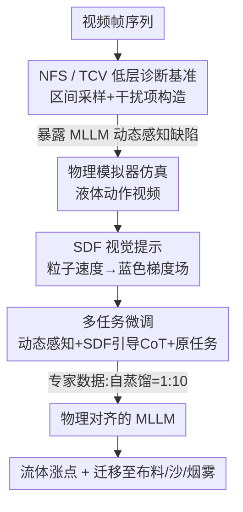

# Beyond Static Vision: Scene Dynamic Field Unlocks Intuitive Physics Understanding in Multi-modal Large Language Models

**会议**: ICLR2026  
**OpenReview**: [https://openreview.net/forum?id=Ax02eR2c3d](https://openreview.net/forum?id=Ax02eR2c3d)  
**代码**: https://github.com/andylinx/Scene-Dynamic-Field  
**领域**: 视频理解 / 多模态VLM  
**关键词**: 直觉物理, 多模态大模型, 物理模拟器, 视觉提示, 多任务微调

## 一句话总结
这篇论文先用 Next Frame Selection（下一帧选择）和 Temporal Coherence Verification（时序一致性判别）两个"低层"诊断任务，揭示当前 MLLM 连流体这类连续介质的直觉物理动态都看不懂；再提出 Scene Dynamic Field（SDF）——把物理模拟器算出的粒子速度映射成蓝色梯度图当视觉提示，配合多任务微调，让 Qwen2-VL / GLM-4.1V 在流体任务上最高涨 20.7%，并能迁移到布料、沙、烟雾等未见物理域。

## 研究背景与动机
**领域现状**：多模态大模型（MLLM）在图像/视频理解上已经很强，最近越来越多工作想测它们"懂不懂物理世界"。但现有物理基准（ContPhy、PhysBench）走的都是"高层物理推理"路线——通过问答、反事实预测、空间关系分析等复杂任务来考模型。

**现有痛点**：这些基准把多种能力**纠缠**在一起：一道题既考视觉、又考语言、又考常识、逻辑、还考物理。结果是 SOTA MLLM 在这些基准上普遍接近随机猜测，但你根本说不清它到底是"物理没学会"还是"别的认知能力拖了后腿"。同时主流训练方式（把视频当成一串帧丢给图像编码器端到端训）本身就抓不住理解物理所必需的低层动态；而视频编码器又大多在以人类动作为中心的数据集上无监督训练，缺少液体、布料这类连续介质（continuum object）的动态。

**核心矛盾**：物理推理的"地基"是**直觉物理感知**（能不能准确感知运动随时间的变化），可现有基准全在考"楼上"的高层推理，从没单独把这块地基拎出来量过。地基没探明，上层的推理缺陷就无从对症下药。

**本文目标**：拆成两个子问题——(1) 怎么把直觉物理感知从其它认知能力里**解耦**出来、单独评测？(2) 怎么进一步**增强**这个底层能力？

**切入角度**：借鉴课程学习（curriculum learning）思想，对 MLLM 也应该做"课程式评测"——先评最基础的那一步。作者选流体动力学作主战场，因为它日常无处不在、动态连续丰富，是理想的连续介质测试床。

**核心 idea**：用两个低层任务（NFS / TCV）把直觉物理感知单独量出来暴露缺陷；再用物理模拟器生成"速度→颜色"的中间表示 SDF 当视觉提示，通过多任务微调把模拟器里的物理知识"蒸馏"进 MLLM，绕开昂贵的架构改造。

## 方法详解

### 整体框架
整篇工作分两半：**先建基准诊断、再提方法增强**。诊断侧用一套统一的"区间采样 + 干扰项构造"流程，把一段视频切成若干区间，为每个区间造出真后继帧和一堆似是而非的干扰帧，组成 NFS（4 选 1 选下一帧）和 TCV（判断序列里有没有被插入不连贯帧）两个任务，零样本拷打各家 MLLM，证明它们确实不懂动态。增强侧的核心是 **SDF**：用 Blender + Flip Fluids 物理引擎仿真各种液体动作，把每个粒子的速度投影到相机方向、再换算成蓝色通道强度，得到一张"速度越大越深蓝"的动态场图像；这张图作为视觉提示，喂进一个**多任务微调框架**（动态感知任务 + SDF 引导的思维链任务 + 原始 NFS/TCV 任务），并用强模型与自蒸馏数据按 1:10 混合来训练。最终模型在流体上大涨，并能零迁移到布料、沙、烟雾。

### 关键设计

**1. NFS + TCV：把直觉物理从"认知大杂烩"里单独拎出来考**

针对"现有基准纠缠多种能力、说不清模型为什么失败"这个痛点，作者设计两个互补的低层任务，并配一套统一的干扰项构造流程保证题目质量。给定 $T$ 帧序列 $F=\{f_t\}_{t=1}^T$，先按时间步长 $s$ 切成不重叠区间 $\{I_i\}$；对每个区间，先排除时间上太近（缓冲带 $\delta$ 之内）的帧得到候选集 $D_i$，再用 SigLIP 嵌入算余弦相似度、过滤掉和真值帧 $f_{gt}$ 过于相似的候选：$D_i'=\{f_t\in D_i \mid \mathrm{sim}(f_t,f_{gt})<\tau\}$，确保留下的干扰项"语义上有区分但又似是而非"。**NFS** 是 4 选 1：从 $D_i'$ 采 3 个干扰项，看模型给真后继帧的打分是否高于所有干扰项，$\mathrm{Acc}_{NFS}=\frac1N\sum_i \mathbb{I}\big(p_{model}(f_{gt}|I_i)>\max_j p_{model}(d_j|I_i)\big)$。**TCV** 是是非题：往序列里随机插一帧破坏时序连贯，让模型判断"有没有不自然的帧"。这套设计的妙处在于：两个任务都只问"动态对不对"，几乎不涉及语言/常识/逻辑，因此一旦模型做不好，就能确定是物理感知本身出了问题。实验也验证了缺陷之严重——最强开源模型 Qwen2.5-VL 在 NFS 上只有 32.73%（4 选 1 随机基线 25%）。

**2. SDF 视觉提示：把模拟器的速度场画成一张"越快越蓝"的图**

针对"纯语言推理抓不住时空物理关系"的痛点，作者不去改模型架构，而是造一个表示层的桥梁：把物理引擎里的粒子速度直接可视化成一张图当视觉提示。对相机位置 $c$，每个粒子速度 $v_i$ 沿视线方向的投影幅值为 $v_{proj,i}=\|v_i\|\cos\theta_i=(v_i\cdot\hat r_i)$，其中 $\hat r_i=\frac{c-p_i}{\|c-p_i\|}$ 是粒子指向相机的单位向量。蓝色通道密度建模为一条沿可观测域 $\Omega$ 的线积分：
$$D_B(c)=\kappa\int_\Omega \frac{\|v_i\|}{1+\alpha\|c-p_i\|^2}\,d\Omega$$
其中 $\kappa$ 把速度缩放为颜色强度、$\alpha$ 控制空间衰减。速度越大的粒子因 $\|v_i\|$ 项对蓝色贡献越大，于是动态被映射成"深浅不一的蓝色梯度"，速度快的地方深蓝、慢的地方浅。这样做有效是因为：模拟器虽然在细粒度细节上不准，但它**捕捉到的动态趋势和真实物理是一致的**，而把这种趋势抽象成一张直观的颜色图，正好契合 MLLM 已有的视觉理解能力——模型不需要从头学物理方程，只要"看图识速度"。

**3. 多任务微调：让模型既会"认动态场"、又会"用动态场推理"**

针对"标准视频预训练补不上直觉物理这块"，作者设计三类任务联合微调。**Task 1 动态感知**：给 RGB 视频和 $N$ 张候选图，其中一张是真值 SDF、其余是干扰，让模型选出"最后一帧对应的 SDF 是哪张"，逼它建立"RGB 动态 ↔ 速度场颜色"的对应。**Task 2 SDF 引导的思维链**：把 SDF 帧插到输入序列的关键位置 $F_{CoT}=[f_1^{RGB},\dots,f_t^{RGB},f_t^{SDF}]$，再用三步 CoT——先分析帧里的流体动态、再结合给定的最后一帧 SDF、最后据此选下一帧，把"看动态场"显式编进推理链。**原始 NFS/TCV 任务**也一并放进训练。三类任务一起训，让模型既学会感知 SDF、又学会拿 SDF 当推理线索，而不是只把它当个无意义的彩色输入。

**4. 专家数据 + 自蒸馏按 1:10 混合：稳住训练分布**

CoT 的推理过程数据从哪来？一种是请更强的模型（如 Gemini-2.5-Pro）生成示范，另一种是模型自蒸馏自己的思考。作者观察到：专家模型的推理未必最优，而自蒸馏的好处是训练时分布漂移更小、更稳。于是把两者按 **专家:自蒸馏 = 1:10** 混合——以自蒸馏为主保证分布稳定，少量专家数据注入"如何正确利用 SDF 视觉提示"的引导。这个比例是论文消融过的选择，本质是在"借强模型的高质量示范"和"避免分布偏移损害训练"之间找平衡点。

### 损失函数 / 训练策略
Finetune 和 SDF-Ours 都用 SWIFT 框架做**全参数监督微调**，学习率 $1\times10^{-5}$、训练 3 个 epoch，在 4 张 A100 40G 上跑、5 次独立运行报置信区间。为公平对比，纯 Finetune 基线用和 SDF 方法**相同数量**的训练样本。为测 sim-to-real，最终在含真实世界视频的 NFS/TCV 数据集上评测。

## 实验关键数据

### 主实验
零样本诊断（Table 1）显示主流 MLLM 在直觉物理上普遍很差，NFS 多数低于随机基线附近：

| 模型 | 参数 | NFS Acc (stride4) | TCV Acc (stride4) |
|------|------|------|------|
| InternVL2.5 | 8B | 20.19 | 52.31 |
| Qwen2.5-VL | 7B | 30.00 | 56.63 |
| GPT-4o | — | 39.79 | 69.91 |
| Gemini-2.5-Flash | — | 31.37 | 70.06 |
| 随机基线 | — | 25.0 | 50.0 |

SDF 增强后（Figure 4A，流体基准 NFS Score），相对零样本大幅提升，且优于同样本量的纯 Finetune 和纯 CoT：

| 设置 | Qwen2-VL NFS | GLM-4.1V NFS |
|------|------|------|
| Zero-Shot | 26.8 | 25.4 |
| CoT（仅推理） | 29.8 | 29.2 |
| Finetune | 30.2 | 32.0 |
| **SDF-Ours** | **41.2 (+14.4)** | **46.1 (+20.7)** |

TCV 任务上 SDF 也把分数从 70.1 提到 80.2。

### 消融实验

| 配置 | 关键现象 | 说明 |
|------|---------|------|
| 模型缩放（InternVL2.5 2B→26B） | NFS 25.33 → 20.60，不升反降 | 单纯堆参数解决不了物理动态理解 |
| 模型缩放（Qwen2-VL 3B→72B） | NFS 24.40 → 28.13，仅微增 | 缩放收益增量、不够 |
| + CoT / Thinking | GLM-4.1V thinking +11.77(NFS)/+25.06(TCV) | 语言推理有帮助但远不够 |
| 迁移：纯 Finetune（布料, Qwen2-VL） | 23.64 vs 零样本 22.42 | 几乎没提升，是域内记忆 |
| 迁移：SDF-Ours | 在布料/沙/烟雾上仍持续涨点 | 学到的是真物理动态 |

### 关键发现
- **靠堆参数没用**：InternVL2.5 从 2B 到 26B，NFS 反而从 25.33% 掉到 20.60%，说明直觉物理缺陷不是规模能补的，得靠针对性训练方法。
- **语言推理有上限**：CoT/thinking 能涨（GLM-4.1V thinking 在 TCV 上 +25.06），但仍远未满意，印证"纯语言推理抓不住时空物理"，这正是作者改走"视觉提示"路线的动机。
- **SDF 学的是真物理而非记忆**：最有说服力的证据是迁移实验——纯 Finetune 一旦迁到布料/沙/烟雾就退回零样本水平，而 SDF 在所有迁移域都保持提升，证明它教会了模型泛化的物理动态感知。

## 亮点与洞察
- **"课程式评测"的诊断思路很妙**：与其在纠缠多能力的难基准上得到"全军覆没说不清原因"的结论，不如先把最底层的直觉物理感知单独量出来，NFS/TCV 这种极简任务反而更能定位问题根源。
- **把物理模拟器当"廉价老师"而非"精确真值"**：作者坦承模拟器细节不准，但只取它"动态趋势对"的部分，把速度抽象成颜色梯度这个表示层级，恰好是 MLLM 吃得下的——这种"在合适抽象层级蒸馏知识"的取舍很值得借鉴。
- **速度→颜色映射是可迁移 trick**：把任何带运动场的物理量编码成感知友好的可视化提示，再让 VLM 看图学习，这个思路可推广到光流、力场、温度场等其它连续物理量的注入。
- **自蒸馏:专家 = 10:1 的反直觉配比**：以自蒸馏为主、少量专家数据点睛，提示在推理数据蒸馏里"分布稳定性"可能比"示范质量"更重要。

## 局限与展望
- **强依赖物理模拟器的覆盖面**：SDF 数据全靠 Blender/Flip Fluids 仿真特定液体动作生成，对模拟器难仿真或参数空间未覆盖的现象（复杂多相耦合、刚柔混合）可能力不从心。
- **只验证了连续介质/流体为主**：虽展示了向布料、沙、烟雾的迁移，但都属粒子化连续介质；对刚体碰撞、铰接物体等离散状态变化的物理是否有效未充分检验。
- **SDF 是 2D 投影表示**：速度沿相机方向投影成蓝色通道，丢失了深度/三维速度信息，多视角或剧烈遮挡场景下这种单通道编码可能不够。
- **评测仍偏合成数据**：基准虽补了 web 挖掘的真实视频并人工筛过，但训练侧 SDF 全来自仿真，sim-to-real 的鲁棒性还有更大验证空间。

## 相关工作与启发
- **vs ContPhy / PhysBench**：它们做高层物理推理基准、把视觉/语言/常识/逻辑/物理纠缠在一起考；本文反其道而行，做解耦的低层 NFS/TCV 诊断任务，专门隔离物理感知，从而能把失败归因到物理本身。
- **vs V-JEPA（Garrido et al. 2025）**：该路线靠自监督视频预训练让直觉物理"涌现"，被指出比 MLLM 更有希望；本文不重训表示，而是用模拟器生成的显式视觉提示去补 MLLM 的感知短板，成本更低、与现有 MLLM 兼容。
- **vs GNN / 符号物理引擎类方法**：那些方法从状态向量预测粒子动力学、或用符号引擎做显式推理，多为多步逻辑演绎设计；本文针对的是"基础感知能力"缺失，直接给基础模型注入视觉动态线索，而非外挂计算模块。

## 评分
- 新颖性: ⭐⭐⭐⭐ 用"速度→蓝色梯度"的可视化提示把模拟器物理蒸馏进 MLLM，诊断任务的解耦视角也清新
- 实验充分度: ⭐⭐⭐⭐ 零样本诊断 + 缩放/CoT 分析 + SDF 增强 + 跨域迁移俱全，5 次运行报置信区间
- 写作质量: ⭐⭐⭐⭐ 问题动机讲得透彻，方法与公式清晰；部分关键数字散落在图中略不便查
- 价值: ⭐⭐⭐⭐ 指出 MLLM 直觉物理这一关键缺口，并给出可扩展、低成本的增强路径

<!-- RELATED:START -->

## 相关论文

- [\[ICLR 2026\] LLaVAction: Evaluating and Training Multi-modal Large Language Models for Action Understanding](llavaction_evaluating_and_training_multi-modal_large_language_models_for_action_.md)
- [\[CVPR 2026\] Beyond Static Frames: Temporal Aggregate-and-Restore Vision Transformer for Human Pose Estimation](../../CVPR2026/video_understanding/beyond_static_frames_temporal_aggregate-and-restore_vision_transformer_for_human.md)
- [\[ICCV 2025\] 4D-Bench: Benchmarking Multi-modal Large Language Models for 4D Object Understanding](../../ICCV2025/video_understanding/4d_bench_benchmarking_multimodal_llms_for_4d_object_understanding.md)
- [\[NeurIPS 2025\] FastVID: Dynamic Density Pruning for Fast Video Large Language Models](../../NeurIPS2025/video_understanding/fastvid_dynamic_density_pruning_for_fast_video_large_languag.md)
- [\[CVPR 2025\] VoCo-LLaMA: Towards Vision Compression with Large Language Models](../../CVPR2025/video_understanding/voco-llama_towards_vision_compression_with_large_language_models.md)

<!-- RELATED:END -->
