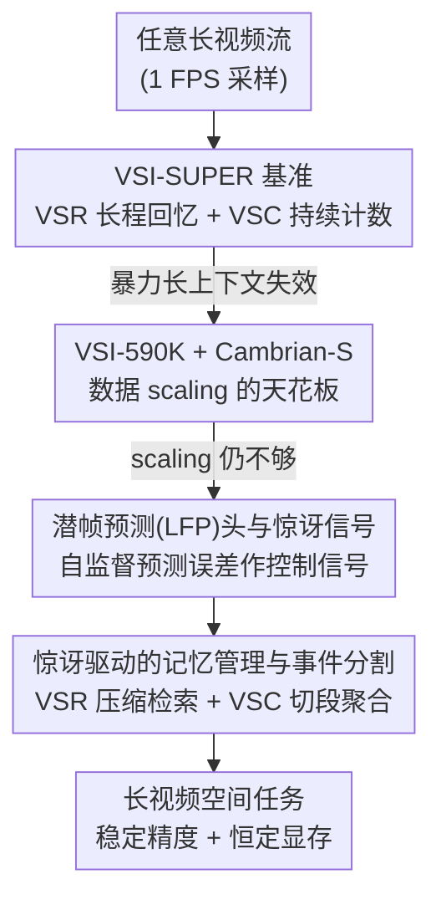

# Cambrian-S: Towards Spatial Supersensing in Video

**会议**: ICLR2026  
**OpenReview**: [https://openreview.net/forum?id=rBFDvZu6pb](https://openreview.net/forum?id=rBFDvZu6pb)  
**代码**: 待确认  
**领域**: 视频理解 / 多模态VLM  
**关键词**: 空间超感知, 视频MLLM, 预测式感知, 惊讶信号, 流式记忆

## 一句话总结
本文提出"空间超感知（spatial supersensing）"这一从被动任务驱动转向主动世界建模的范式：先用 VSI-SUPER 基准证明暴力扩长上下文（包括 Gemini-2.5 和自训的 Cambrian-S）在任意长视频上的空间回忆与计数任务上彻底失效，再用一个自监督的"潜帧预测"头把预测误差（"惊讶"）当作控制信号去驱动记忆管理与事件分割，从而在长视频空间任务上大幅超过强商业基线。

## 研究背景与动机
**领域现状**：当前多模态大模型（MLLM）靠"强图像编码器 + 语言模型"快速进步，把视频当成稀疏采样的若干帧来处理，主要测的是"看图说话"式的语义感知和语言理解。

**现有痛点**：作者先做了一组诊断实验，发现主流视频 benchmark（VideoMME、EgoSchema、LongVideoBench、VideoMMMU、Perception Test 等）大量依赖语言先验——一个没有做过任何视频后训练的图像 MLLM，仅用单帧甚至纯文字 caption，就能在很多 benchmark 上超过随机基线 10–30%。这说明它们考的是"能从文字摘要推出来的能力"，而非真正的视觉空间感知。

**核心矛盾**：视频本质是"一个隐藏的、不断演化的 3D 世界投影到像素上的连续高带宽信号"，但现有范式把它当成可以无限堆叠的 token 序列。流式视频是"无限输入、无限输出"，任何固定上下文窗口都会被撑爆；而人类靠的是**选择性地保留极小一部分感官输入**（每只眼睛的视锥细胞每秒可传约 1.6 Gbits，大脑却只用约 10 bits/s 来指导行为），靠预测和惊讶来组织注意力与记忆。

**本文目标**：(1) 定义一个超越"纯语言理解"的能力层级，并造一个能逼出现有范式短板的基准；(2) 验证"空间感知是不是单纯的数据问题"；(3) 给出一条不靠 scaling 的新路径。

**切入角度**：把多模态智能分成五级——0 纯语言理解、1 语义感知、2 流式事件认知、3 隐式 3D 空间认知、4 预测式世界建模。现有模型卡在 1–2 级，benchmark 也只测前两级，最关键的"预测式世界建模"完全没被考。

**核心 idea**：与其继续堆数据/参数/上下文，不如让模型学会"预测自己将看到什么"，并用预测出错时的"惊讶"信号来主动筛选、组织和记忆经验——即用预测式感知（predictive sensing）替代被动的上下文累积。

## 方法详解

### 整体框架
全文不是单一模型，而是一条"提出问题 → 试错现有范式 → 给出新范式"的三段式论证。第一段（§2）建立度量：审计现有 benchmark 后，提出 VSI-SUPER 这个对暴力长上下文免疫的双任务基准，并证明连 Gemini-2.5-Flash 也会在两小时视频上撞上上下文墙。第二段（§3）把"空间感知是否只是数据问题"做到极致：构建 VSI-590K 数据集，四阶段训练出 Cambrian-S，在 VSI-Bench 上拿到 SOTA（+30% 绝对提升），但在 VSI-SUPER 上依旧崩溃，从而证明 scaling 不够。第三段（§4）给出新范式：一个自监督的潜帧预测（LFP）头，用预测误差当"惊讶"信号，驱动两个下游能力——惊讶驱动的记忆管理（解 VSR）和惊讶驱动的事件分割（解 VSC）。

### 关键设计

**1. VSI-SUPER 基准：用编辑式 needle 和跨场景计数把"暴力长上下文"逼到墙角**

诊断完现有 benchmark 偏语言先验后，作者需要一个真正考"持续空间感知"、且不能靠扩上下文蒙混过关的任务。VSI-SUPER 由两部分组成。VSR（长程视觉空间回忆）借鉴语言领域的"大海捞针"（NIAH）：用图像编辑模型（Gemini）把一个突兀物体（如泰迪熊）原地嵌入室内漫游视频的四个不同帧与空间位置，再把这段视频和其他房间漫游视频拼接成任意长的连续流，要求模型按出现先后顺序回忆这些物体的位置——是个多跳推理任务，且关键在于"针"是 in-frame 编辑而非插入无关帧，保留了真实感。VSC（持续视觉计数）把多个房间漫游片段拼起来，要求模型在视角切换、重复看到、场景转换的情况下累计数出目标物体总数，并在多个时间戳上流式提问（正确答案随时间动态变化），用平均相对精度（MRA）评测。两个任务都提供 10/30/60/120/240 分钟多档时长。关键性质是：它们被刻意构造成超出任何固定上下文窗口，逼出"逐帧 token 化处理在算力上不可持续"这一根本矛盾。

**2. VSI-590K 与 Cambrian-S：把空间认知当数据问题做到 SOTA，反向证明 scaling 的上限**

为验证"空间感知是不是只缺数据"，作者先把 Cambrian-1 升级为更强的图像基座（视觉编码器换 SigLIP2-SO400m、语言模型换 Qwen2.5、连接器用两层 MLP），再构建 VSI-590K——一个面向视觉空间理解的指令微调语料，定义 12 种问题类型，数据来源横跨"标注真实视频、模拟数据、伪标注图像"。一个有意思的消融结论是数据有效性排序为**标注真实视频 > 模拟数据 > 伪标注图像**，说明视频的时间连续性和多视角多样性对学到鲁棒空间表征是关键。Cambrian-S 用四阶段训练：阶段 1-2 沿用 Cambrian-1 建立图像理解，阶段 3 在 Cambrian-S-3M（300 万样本）上做通用视频指令微调，阶段 4 在 VSI-590K 混合一部分通用视频数据上做空间感知微调（混通用数据是为了防止纯 in-domain SFT 带来的泛化退化）。结果 Cambrian-S-7B 在 VSI-Bench 上达 67.5%，比 Gemini-2.5-Pro 高 16+ 个点；但在 VSI-SUPER 上，VSR 精度从 10 分钟的 38.3% 一路掉到 60 分钟以上的 0.0%，VSC 几乎全崩——以此坐实"再多数据也救不了暴力范式"。

**3. 潜帧预测（LFP）头与"惊讶"信号：自监督预测误差当控制信号**

这是新范式的核心机件。作者在语言头旁并联一个轻量的两层 MLP——潜帧预测（Latent Frame Prediction, LFP）头，让它在指令微调的同时，预测下一视频帧的潜表征。训练时用两个辅助损失衡量"预测潜特征"与"下一帧真值特征"的差距：均方误差（MSE）和余弦距离，并用一个权重系数把 LFP 损失与主任务的 next-token 预测目标平衡。LFP 用的数据是 VSI-590K 里专门挑出的 290K 视频子集，按 1 FPS 均匀采样以保证时间间隔一致。阶段 4 微调时，连接器、语言模型、语言头和 LFP 头端到端联合训练，SigLIP 视觉编码器冻结。推理时，模型对每个进来的帧持续预测下一帧潜特征，再测预测值与真值特征之间的余弦距离，这个距离就是"惊讶"（surprise / Violation-of-Expectation）——值越大说明越偏离模型已学到的预期（如出现新物体、房间切换）。这个自监督信号无需额外标注，直接成为下游任务的控制开关。

**4. 惊讶驱动的记忆管理与事件分割：用一个信号同时解 VSR 和 VSC**

惊讶信号被用在两个 case study 上。对 VSR（Case Study I），构建一个惊讶驱动的记忆系统：进来的帧先用固定窗口的滑动窗口注意力编码，LFP 给每帧的 KV cache 打上"惊讶等级"；惊讶低于阈值的帧做 2× 压缩后推入长期记忆；为保持显存恒定，长期记忆被一个同样基于惊讶的"巩固函数"约束在固定大小（按惊讶分数丢弃或合并帧）；收到用户查询时，计算 query 与存储帧特征的余弦相似度，检索 top-K 最相关帧。效果是 Cambrian-S（带记忆）在所有时长上超过 Gemini-1.5-Flash 和自己的无记忆版本，且显存随视频长度基本恒定（无记忆版会 OOM）。对 VSC（Case Study II），用惊讶做事件分割：模型把帧特征持续累积进事件缓冲区，一旦检测到高惊讶帧（即场景切换，类似心理学的"门道效应"——穿过门会形成天然记忆边界），就把缓冲内容总结成一个段级答案并清空缓冲，开启新段；视频结束后聚合所有段答案得最终输出。两个 case study 里，作者都做了消融——用"预测误差作惊讶"始终优于"相邻帧 SigLIP2 特征差作惊讶"，说明预测式建模比静态相似度更能刻画时空动态。

### 损失函数 / 训练策略
主目标是指令微调的 next-token 预测损失；LFP 头额外加 MSE + 余弦距离两个辅助损失，用权重系数与主损失平衡。阶段 4 端到端联合训练连接器 / 语言模型 / 语言头 / LFP 头，冻结 SigLIP 视觉编码器；LFP 数据为 290K 视频子集、1 FPS 采样。

## 实验关键数据

### 主实验

| 任务 / 模型 | 时长 | 指标 | Cambrian-S | 对比基线 |
|------|------|------|------|----------|
| VSI-Bench | — | Acc | **67.5**（7B） | Gemini-2.5-Pro 51.5 |
| VSI-Bench-Debiased | — | Acc | 59.9（7B） | 仍超商业模型 |
| VSR（带记忆） | 10–240 min | Acc | 各时长均超 Gemini-1.5-Flash | Gemini-2.5-Flash >60min 失败 |
| VSC（惊讶分割） | 10–120 min | MRA | 稳定领先 | Gemini-1.5-Flash 近 0 |
| VSC 流式 | 10 / 120 min | MRA | 38% / ~28% | Gemini-Live、GPT-Realtime <15% → 近 0 |

裸 Cambrian-S（无新范式）在 VSI-SUPER 上的崩溃证明 scaling 不够：

| 设置 | VSR 10min | VSR 60min | VSR 120min | VSC 30min+ |
|------|-----------|-----------|------------|-----------|
| 1 FPS 流式 | 38.3 | 6.0 | 0.0 | 0.0 |
| 均匀 128 帧 | 26.7 | 23.3 | 30.0 | 0.0 |

### 消融实验

| 配置 | 关键发现 | 说明 |
|------|---------|------|
| VSI-590K 数据源 | 真实视频 > 模拟 > 伪标注图像 | Full Mix 最优，视频比静态图更利于空间表征 |
| 纯 VSI-590K vs 混通用视频 | 纯 in-domain 掉通用能力 | 混通用数据缓解泛化退化 |
| 惊讶度量：预测误差 vs 相邻帧特征差 | 预测误差全程更优更稳 | VSR 和 VSC 上均成立 |
| GT 分割 vs 惊讶分割（VSC） | GT 略高，为近似上界 | 惊讶分割接近理想分段 |

### 关键发现
- **暴力上下文有硬墙**：Gemini-2.5-Flash 即使有 ~104.8 万 token 上下文，处理两小时视频也会 Out of Ctx；即使 60 分钟视频落在窗口内，VSR/VSC 也只有 41.5 / 10.9。
- **计数不随物体数 scale**：商业模型预测的物体数会饱和在一个小常数，说明依赖训练分布先验而非真正的空间认知。
- **预测误差比相邻帧差更鲁棒**：作为"惊讶"信号，自监督预测误差比静态特征相似度更能定位真正的新物体/场景切换。

## 亮点与洞察
- **把"惊讶"做成可计算、可复用的控制信号**：同一个 LFP 预测误差，既能驱动记忆压缩/巩固（VSR），又能做事件切段（VSC），一个自监督信号撬动两个下游任务，非常优雅。
- **基准设计本身是贡献**：VSI-SUPER 用 in-frame 编辑保留真实感、用跨场景计数考持续累积，刻意做到"对暴力扩上下文免疫"，这种"先把现有范式逼到墙角再提新路"的论证结构很有说服力。
- **诚实地承认是 proof-of-concept**：作者明确说预测式感知只是原型、不是终极方案，但用消融和强基线对比给出了"这条路值得走"的证据，避免过度宣称。
- **可迁移性**：把"预测下一潜帧的误差"当惊讶来分配记忆/划分事件，这一思路可迁移到具身智能、长程视频问答、流式 agent 等任何"无限输入"场景。

## 局限与展望
- **预测式感知仍是原型**：作者承认这只是 proof-of-concept，记忆系统的压缩/巩固/检索都依赖人工设的阈值与窗口，尚未端到端学出来。
- **VSI-SUPER 是合成基准**：虽反映真实挑战，但用编辑插入和视频拼接构造，与真实连续感官流仍有 gap。
- **惊讶阈值需调参**：VSC 的消融里两种惊讶度量都"调超参后取最优"，说明阈值敏感、缺乏自适应机制。
- **改进方向**：把记忆巩固与事件分割从启发式规则升级为可学习模块；把 LFP 从"预测下一潜帧"扩展到更长程的世界状态预测，真正逼近第 4 级"预测式世界建模"。

## 相关工作与启发
- **vs 长上下文/暴力扩 token（Gemini 等）**：他们靠把整段视频塞进超长上下文，本文证明这条路在"无限输入"下必然撞墙；本文用选择性记忆 + 惊讶筛选替代无差别累积，显存恒定且精度稳定。
- **vs 流式视频记忆系统（MovieChat、Flash-VStream 等）**：前人也设计过长视频记忆架构，但本文的核心区别是用**预测误差（惊讶）**作为统一的控制信号去指导压缩/巩固/分割，而非基于帧间相似度或固定规则。
- **vs VSI-Bench**：VSI-Bench 迈出了考空间认知的第一步，但视频短、单场景，且不评测预测式建模；VSI-SUPER 把它扩展到任意长、多场景、流式，并显式逼近第 4 级能力。
- **思想源流**：与 JEPA / V-JEPA、世界模型、自由能/主动推理（Friston）一脉相承——"用预测和惊讶组织感知与记忆"正是把认知科学里的预测编码思想落到视频 MLLM 上。

## 评分
- 新颖性: ⭐⭐⭐⭐⭐ 提出空间超感知层级 + 把惊讶做成统一控制信号，范式层面有原创性
- 实验充分度: ⭐⭐⭐⭐ 基准/数据/模型/两个 case study 闭环，但新范式部分仍是原型、规模有限
- 写作质量: ⭐⭐⭐⭐⭐ "逼到墙角再给新路"的论证结构清晰，诚实标注 proof-of-concept
- 价值: ⭐⭐⭐⭐⭐ 为长视频/流式多模态指出从被动累积转向主动预测的方向，VSI-SUPER 基准也有长期价值

<!-- RELATED:START -->

## 相关论文

- [\[CVPR 2026\] T2SGrid: Temporal-to-Spatial Gridification for Video Temporal Grounding](../../CVPR2026/video_understanding/t2sgrid_temporal-to-spatial_gridification_for_video_temporal_grounding.md)
- [\[CVPR 2025\] STOP: Integrated Spatial-Temporal Dynamic Prompting for Video Understanding](../../CVPR2025/video_understanding/stop_integrated_spatial-temporal_dynamic_prompting_for_video_understanding.md)
- [\[CVPR 2025\] VideoRefer Suite: Advancing Spatial-Temporal Object Understanding with Video LLM](../../CVPR2025/video_understanding/videorefer_suite_advancing_spatial-temporal_object_understanding_with_video_llm.md)
- [\[CVPR 2026\] LaDy: Lagrangian-Dynamic Informed Network for Skeleton-based Action Segmentation via Spatial-Temporal Modulation](../../CVPR2026/video_understanding/lady_lagrangian-dynamic_informed_network_for_skeleton-based_action_segmentation_.md)
- [\[ICLR 2026\] A Training-Free Framework for Long Video Understanding via Video-Query-Options Similarity](a_training-free_framework_for_long_video_understanding_via_video-query-options_s.md)

<!-- RELATED:END -->
