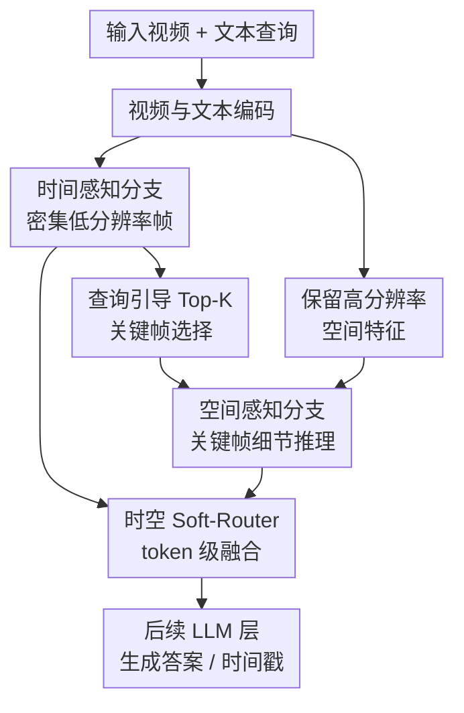

# Divid: Disentangled Spatial-Temporal Modeling within LLMs for Temporally Grounded Video Understanding

**会议**: ICLR 2026  
**OpenReview**: [https://openreview.net/forum?id=mrViXFfrsU](https://openreview.net/forum?id=mrViXFfrsU)  
**代码**: 暂未公开  
**领域**: 视频理解 / 时序定位视频理解  
**关键词**: 时间定位视频理解, Video LLM, 时空解耦, 关键帧选择, Grounded VideoQA  

## 一句话总结
Divid 在 Video LLM 的 decoder 内部显式拆开时间分支与空间分支，用时间注意力为查询选择高分辨率关键帧，再通过 token 级 soft-router 融合两路信息，并配合 559K 时间戳监督数据 TempGCap，在时间定位和带证据 VideoQA 上同时提升精度与计算效率。

## 研究背景与动机
**领域现状**：长视频理解里的 Video LLM 通常先用视觉编码器把多帧视频变成视觉 token，再把这些 token 和文本问题一起送进 LLM。对短视频或粗粒度问答来说，这种“展平后拼接”的范式已经很有效；但 temporally grounded video understanding 要求模型不仅回答问题，还要给出对应的起止时间，模型必须在几十秒到数十分钟的视频里找到和语言指令真正对齐的片段。

**现有痛点**：长视频的核心矛盾是时间覆盖和空间细节很难同时保住。若密集采样并保留高分辨率特征，视觉 token 会急剧膨胀，带来上下文长度和计算成本问题；若为了省 token 做压缩或稀疏采样，又容易丢掉关键动作、物体交互和细节证据。Slow-Fast 类方法把 dense low-resolution temporal token 与 sparse high-resolution spatial token 分开提取，但进入 LLM 后通常仍然简单拼接，在同一个 attention 空间里混着处理。

**核心矛盾**：论文认为，问题不只是“送进 LLM 的 token 太多”，而是空间和时间在 LLM 内部没有真正分工。时间定位需要先判断哪一段视频和问题相关，空间理解则需要在相关片段里看清物体、动作和关系；如果两类信息始终被扁平拼在一起，模型很容易用局部外观线索替代时间推理，或者把问题中的 cue 片段误当成答案证据。

**本文目标**：作者希望构建一个既能密集覆盖长视频时间轴、又能保留关键帧空间细节的 Video LLM。具体来说，它要解决三件事：第一，用较低成本捕捉长程时间动态；第二，让高分辨率空间帧的选择受语言查询驱动，而不是固定均匀采样；第三，在生成答案或时间戳时，让每个文本 token 自己决定更依赖时间线索还是空间线索。

**切入角度**：Divid 的观察很直观：人看长视频回答“某个事件发生在什么时候”时，通常先快速扫过整体动作变化，再回到少数关键时刻看细节。论文把这个过程放进 LLM decoder 内部，而不是只在视觉 encoder 侧做 Slow-Fast 分流，让 temporal branch 的注意力直接指导 spatial branch 选择关键帧。

**核心 idea**：用“LLM 内部时空双分支 + 查询条件化关键帧选择 + token 级软路由”替代传统的扁平视觉 token 拼接，使长视频模型先定位时间、再补空间细节，并在每一层动态融合两类证据。

## 方法详解
### 整体框架
Divid 的输入是一段视频和一个文本查询，输出可以是时间边界、带证据的问答答案，或指定时间片段的描述。它先用视觉编码器抽取每帧高分辨率特征，同时通过空间池化得到低分辨率 temporal tokens；在 LLM decoder 中，temporal branch 处理密集时间序列并产生 text-to-video attention，spatial branch 根据这些注意力挑选 Top-K 高分辨率关键帧，最后由 soft-router 在每个文本 token 上融合时间和空间两路表示。

形式化地，给定 $T$ 帧视频，视觉编码器和 MLP 得到高分辨率特征 $X \in \mathbb{R}^{T \times H \times W \times d}$。再对每帧做空间池化得到低分辨率特征 $X' \in \mathbb{R}^{T \times H' \times W' \times d}$，默认可以看成每帧一个 temporal token。文本查询被编码成 $X_{text} \in \mathbb{R}^{L \times d}$。随后每个 decoder layer 内部都包含 temporal perception attention、spatial perception attention 和 spatio-temporal soft-router。

### 关键设计
**1. LLM 内部的时空解耦：把“找时间段”和“看空间细节”拆成两条注意力分支**

传统 Slow-Fast Video LLM 的问题在于，虽然视觉侧已经分出快慢两类 token，但进入 LLM 后仍然拼成一个序列，模型的 self-attention 没有明确知道哪些 token 应该负责全局时间、哪些 token 应该负责局部细节。Divid 把解耦位置后移到 decoder layer 内部：temporal branch 接收密集采样、低空间分辨率的视频 token 与文本 token，用较小 token 预算覆盖长时间轴；spatial branch 只看少量高分辨率关键帧，专注于细粒度视觉证据。

这种拆法的关键收益是避免把长视频的所有空间细节都压进同一个 attention 空间。时间分支先学习“问题中的语言 token 应该看哪些时刻”，空间分支再在这些时刻上看清动作、物体和场景关系。对 temporally grounded tasks 来说，这比一开始就把所有帧细节扔给 LLM 更贴近任务结构：先有时间定位，再有视觉判别。

**2. 时间注意力引导的 Top-K 关键帧选择：让空间帧选择跟查询绑定**

空间分支不能随便均匀采样，因为问题可能只关心视频里很短的一段。例如问题问“男人搭帐篷是什么时候”，均匀采样可能抓到很多无关行走、等待或镜头切换帧。Divid 从 temporal branch 的 attention 矩阵里取出 text-to-video cross-modal attention $A^{T2V}_{temp} \in \mathbb{R}^{L \times T}$，再对所有文本 token 的注意力做平均，得到每一帧的重要性分数 $s_{t2v} \in \mathbb{R}^{T}$。

随后模型直接选择分数最高的 $k$ 帧：$I_{key}=TopK(s_{t2v}, k)$，并从原始高分辨率特征 $X$ 中取出这些帧形成 $X_{key} \in \mathbb{R}^{k \times H \times W \times d}$。这一步把 temporal branch 的语言相关定位能力变成 spatial branch 的输入过滤器，避免空间分支把计算浪费在和查询无关的高分辨率帧上。消融也说明 Top-K 比 Uniform、Weighted、Segment 和概率 Importance sampling 都更稳，因为它保留的是当前查询下最显著的帧，而不是先验固定位置或随机采样结果。

**3. Token 级时空 Soft-Router：不同词用不同的信息配比**

仅仅有两条分支还不够，模型还需要知道“什么时候相信时间分支，什么时候相信空间分支”。Divid 设计了 spatio-temporal soft-router：对每个文本 token，用进入跨模态 attention 前的原始文本表示 $X_{text}$ 计算一个二分类 softmax gate，得到 temporal 与 spatial 两个权重：$G=Softmax(X_{text}W_g+b_g) \in \mathbb{R}^{L \times 2}$。然后对第 $i$ 个 token，把两条分支输出的文本侧表示融合为 $Z_i^{text}=g_i^{(1)}H_i^{temp}+g_i^{(2)}H_i^{spat}$。

这个设计比简单相加或全局可学习权重更细。像 “when”“then”“start” 这类词天然更依赖时间顺序，应该更多使用 temporal features；像 “dog”“lady”“holding” 这类词需要辨认对象和动作细节，应该更多使用 spatial features。附录里的路由权重可视化表明，soft-router 的确学出了这种语义相关的分配模式，而不是对所有 token 使用固定比例。

**4. TempGCap 数据：用时间戳引导 caption 训练补足 temporal supervision**

Divid 直接让 LLM 生成时间戳，因此训练数据必须给出足够精确的时间边界监督。作者构建了 TempGCap，一个 559K timestamp-guided captioning 数据集，任务形式是给定视频中的一段起止时间，让模型描述该片段内容。这样训练模型不仅要会看视频，还要把语言描述和具体时间窗口对齐。

TempGCap 来自三类来源：Sub1 使用已有人工时间边界或动作检测数据，并用 Tarsier 为缺少描述的动作片段生成细粒度 caption；Sub2 从短视频 caption 反推原始 untrimmed 视频上下文，并用视觉相似度细化边界；Sub3 在没有 untrimmed 视频时拼接多个短片段合成伪长视频，让目标 clip 周围有干扰内容。这个数据设计和 Divid 的架构目标一致：模型必须在更长上下文里区分目标片段和邻近无关片段，而不是只对裁剪后短视频做描述。

### 一个完整示例
假设输入视频长约 80 秒，问题是“男人开始搭帐篷的时间段是什么？”传统扁平 Video LLM 可能把 128 帧全部变成一长串视觉 token，然后在同一个 attention 空间里寻找答案；如果很多帧都出现男人、帐篷或户外背景，模型容易把准备阶段、搭建阶段和收尾阶段混在一起。

Divid 会先在 temporal branch 中用低分辨率密集帧覆盖整个 80 秒视频。文本 token “setting up the tent” 对视频帧的 attention 会在真正搭建动作附近变高，模型据此选出 32 个高分辨率关键帧。spatial branch 只在这些关键帧上看细节，例如是否展开帐篷布、插杆、固定支架。最后 soft-router 对 “timestamp”“when” 这类 token 偏向 temporal branch，对 “tent”“setting up” 这类词更多结合 spatial branch。这样生成的回答更可能是“31.0 秒到 54.6 秒”，而不是只返回出现帐篷的整段视频。

### 损失函数 / 训练策略
Divid 没有引入额外的边界回归头，也不使用单独的 box loss 或 timestamp regression loss。所有任务都统一成条件文本生成：给定视频和提示，模型自回归地产生答案 token 与时间戳 token。训练目标是标准 next-token negative log-likelihood：

$$
\mathcal{L}=-\frac{1}{N}\sum_{n=1}^{N}\frac{1}{|\mathcal{T}^{(n)}|}\sum_{t\in\mathcal{T}^{(n)}}\log p_{\theta}(y_t^{(n)}\mid y_{<t}^{(n)},x^{(n)}).
$$

实现上，视觉编码器使用 EVA-CLIP 的 ViT-g/14，LLM 使用 Qwen2-7B。训练分两阶段：第一阶段用 LLaVA-558K 与 WebVid 做预训练，主要更新 multimodal projector 和空间 token 的 LLM layer projector，学习率 $1\times10^{-3}$、batch size 256；第二阶段做 instruction tuning，混合 TempGCap 559K、DideMo 和 ActivityNet Captions 的 77K timestamp-grounded 样本，以及 LLaVA-Video-178K、DeVE-QA 等 VideoQA 数据，学习率 $2\times10^{-5}$、batch size 128。默认配置中 temporal branch 使用 $T=128$ 帧和 $4\times4$ 低分辨率空间特征，spatial branch 选 $k=32$ 个关键帧并保留 $8\times8$ 高分辨率特征。

## 实验关键数据

### 主实验
论文主要评估两类任务：temporal grounding 和 grounded VideoQA。Temporal grounding 用 Charades-STA，指标包括 R@0.5、R@0.7 和 mIoU；Grounded VideoQA 用 CG-Bench、NExT-GQA、ReXTime，既看答案正确性，也看预测时间段与证据片段的重合程度。

| 数据集 / 任务 | 指标 | Divid 7B | 强基线 | 提升 / 对比 |
|--------|------|------|----------|------|
| Charades-STA / Temporal Grounding | R@0.5 / R@0.7 / mIoU | 59.5 / 31.3 / 51.3 | VideoMind 7B: 59.1 / 31.2 / 50.2 | mIoU +1.1 |
| Charades-STA / Temporal Grounding | mIoU | 51.3 | Qwen2.5-VL 72B: 50.9 | 参数约小一个数量级，mIoU +0.4 |
| CG-Bench / Grounded VideoQA | mIoU / R@IoU / A@IoU | 5.74 / 8.36 / 4.11 | GPT-4o: 5.62 / 8.30 / 4.38 | 定位指标略高，答案定位联合指标略低 |
| NExT-GQA / Grounded VideoQA | Acc@GQA / mIoU / mIoP | 34.5 / 40.8 / 29.2 | VideoMind 7B: 31.4 / 39.0 / 28.2 | Acc@GQA +3.1，mIoU +1.8 |
| ReXTime / Grounded VideoQA | R@0.5 / mIoU / Acc@IoU | 31.05 / 35.78 / 22.26 | VideoMind 7B: 25.52 / 27.61 / 20.20 | mIoU +8.17 |

Divid 1.5B 的表现也很有说服力。在 Charades-STA 上，它达到 51.4 R@0.5 和 47.3 mIoU，超过 Momentor、HawkEye、TimeChat、ChatVTG 等多个 7B 模型；在 ReXTime 上，1.5B 模型也达到 29.71 mIoU 和 18.57 Acc@IoU，高于 VideoMind 1.5B 的 24.83 mIoU。这说明论文的收益不是单纯来自模型变大，而是来自架构和数据的共同作用。

### 消融实验
| 配置 | 关键指标 | 说明 |
|------|---------|------|
| Full | Charades-STA mIoU 47.76，ReXTime mIoU 30.16，28.2 TFLOPs | 全量高分辨率帧进入 LLM，精度最高但计算最重 |
| Slow-Fast | Charades-STA mIoU 46.71，ReXTime mIoU 29.49，16.2 TFLOPs | 视觉侧分慢快 token，但 LLM 内部仍拼接处理 |
| Divid | Charades-STA mIoU 47.33，ReXTime mIoU 29.71，10.5 TFLOPs | 接近 Full 的精度，计算量比 Full 低约 63% |
| Uniform keyframe | Charades-STA mIoU 46.27，ReXTime mIoU 27.61 | 均匀选帧，不看查询相关性 |
| Top-K keyframe | Charades-STA mIoU 47.33，ReXTime mIoU 29.71 | 基于 temporal attention 选帧，效果最好 |
| Add fusion | Charades-STA mIoU 46.81，ReXTime mIoU 29.11 | 直接相加两路特征，缺少 token 级适配 |
| Soft-Router | Charades-STA mIoU 47.33，ReXTime mIoU 29.71 | 每个 token 动态决定时间/空间权重 |
| Momentor | Charades-STA mIoU 46.42，ReXTime mIoU 28.75 | 大规模但时间对齐质量较弱 |
| TempGCap | Charades-STA mIoU 47.33，ReXTime mIoU 29.71 | 更高质量时间戳监督带来稳定提升 |

### 关键发现
- Divid 的主要价值不是追求超过 Full model 的极限精度，而是在大幅降低 FLOPs 的同时保住甚至超过 Slow-Fast 的定位性能。与 Slow-Fast 相比，它用 10.5 TFLOPs 达到更高的 Charades-STA 和 ReXTime mIoU。
- Top-K 关键帧选择是非常关键的组件。Uniform 到 Top-K 在 ReXTime 上从 27.61 mIoU 提升到 29.71，说明 grounded VideoQA 对“选对证据片段”非常敏感。
- Soft-Router 的增益不大但稳定，说明两路分支的融合方式会影响细粒度定位。尤其在复杂问题中，不同文本 token 对时间顺序和空间外观的依赖确实不同。
- TempGCap 的质量比单纯规模更重要。Momentor-10M 样本更多，但 TempGCap 只有 559K 仍表现更好，说明时间边界精度、视频来源多样性和任务格式匹配度比无差别堆数据更有效。
- 失败案例显示，模型仍会在“before/after”这类跨片段推理中犯错：它有时会覆盖问题 cue 和答案片段，但边界仍不够准。这类问题需要训练数据中更多非重叠问题片段与答案片段的监督。

## 亮点与洞察
- Divid 把 Slow-Fast 的思想从视觉 token 构造阶段推进到 LLM decoder 内部，这是本文最有意思的地方。它不是只问“哪些 token 送进去”，而是问“LLM 在每层应该如何分别处理时间和空间”。
- 时间注意力引导关键帧选择很自然，也很实用。相比预先做 frame sampling，这种方法让语言查询真正参与选择高分辨率空间证据，适合开放式问题而不是固定动作分类。
- Soft-Router 的可解释性不错。附录中时间词偏 temporal、对象和动作词偏 spatial 的现象说明，路由器学到的不只是一个工程 trick，而是和语言语义角色相关的融合策略。
- TempGCap 的构造展示了一个重要经验：temporally grounded Video LLM 不能只靠普通 video caption 或 VideoQA 数据。让模型反复练习“给定时间段描述内容”可以强化时间边界和语言描述之间的对齐。
- 这套方法可以迁移到其他长上下文多模态任务。比如长音频-视频事件理解、机器人第一视角视频检索、电影级剧情问答，都可能受益于“先用低成本全局分支定位，再用高分辨率分支看细节”的结构。

## 局限与展望
- Divid 依赖 temporal branch 的 attention 来选关键帧，如果 LLM 预训练或指令数据让 attention 对某些语言 cue 有偏置，空间分支会被错误引导。论文也承认未来需要研究 temporal attention 的 debiasing。
- Top-K 选择虽然有效，但本身是硬选择。若真实答案需要多个分散片段，或者问题要求比较两个远距离事件，固定 $k=32$ 的关键帧可能仍然覆盖不足。
- 实际延迟没有 FLOPs 降得那么多。论文报告 Divid 从理论上比 Slow-Fast 少约 35.2% FLOPs，但优化后 latency 仍为 1397ms，高于 Slow-Fast 的 1311ms，说明关键帧选择和双分支调度还需要工程优化。
- 训练数据仍可能偏向“问题和答案在同一时间区域”的情况。ReXTime 失败案例表明，before/after 这种非重叠证据推理仍是薄弱点，后续可以专门构造跨片段因果和时间顺序监督。
- 论文主要强调 grounded tasks，在通用 VideoQA 上只是竞争性表现，并不总是显著领先。对于短视频外观识别或静态属性问答，时空解耦的优势没有那么直接。

## 相关工作与启发
- **vs LITA / SlowFast-VideoLLM**: 这些方法也借鉴 Slow-Fast，用不同采样率或分辨率表示视频，但通常在 LLM 输入端拼接 token。Divid 的区别是把时间和空间注意力分支放进 decoder layer 内部，并用 temporal attention 指导 spatial branch。
- **vs VideoExpert**: VideoExpert 用 MoE 思路区分时间和空间能力，并可能通过专门头回归边界；Divid 不加额外回归头，而是让 LLM 统一生成时间戳，并通过 soft-router 做 token 级融合。
- **vs MASH-VLM**: MASH-VLM 通过 mask 解耦注意力来缓解动作-场景幻觉，但对位置编码和高效 attention 的兼容性有限。Divid 用双分支加共享 attention 参数，更像是在 decoder 内形成可融合的两条信息流。
- **vs Momentor / VTimeLLM-Stage2**: 这些工作强调 timestamp-aware instruction tuning。Divid 继承了这种方向，但认为数据质量和任务构造同样重要，因此构建 TempGCap 来平衡规模、边界精度和视频多样性。
- **启发**: 长视频不是简单的“大图像序列”，而是同时要求粗粒度扫描和细粒度证据确认。未来的 Video LLM 可以继续沿着“层内结构化推理”发展，而不是只在输入 token 压缩上做文章。

## 评分
- 新颖性: ⭐⭐⭐⭐☆ 把时空解耦放到 LLM decoder 内部，并用 temporal attention 驱动 spatial keyframe selection，思路清晰且比普通 Slow-Fast 拼接更进一步。
- 实验充分度: ⭐⭐⭐⭐⭐ 覆盖 Charades-STA、CG-Bench、NExT-GQA、ReXTime 和通用 VideoQA，并有架构、采样、路由、数据、分辨率、视觉编码器等多组消融。
- 写作质量: ⭐⭐⭐⭐☆ 主文逻辑清楚，方法和实验对得上；但部分表格抽取信息较密，读者需要结合附录才能完整理解数据构造和工程代价。
- 价值: ⭐⭐⭐⭐⭐ 对长视频时间定位和 grounded VideoQA 很有参考价值，尤其适合启发后续 Video LLM 在 LLM 内部做结构化时空推理。

<!-- RELATED:START -->

## 相关论文

- [\[ICLR 2026\] Measure Twice, Cut Once: A Semantic-Oriented Approach to Video Temporal Localization with Video LLMs](measure_twice_cut_once_a_semantic-oriented_approach_to_video_temporal_localizati.md)
- [\[ICCV 2025\] Factorized Learning for Temporally Grounded Video-Language Models](../../ICCV2025/video_understanding/factorized_learning_for_temporally_grounded_video-language_models.md)
- [\[CVPR 2026\] T2SGrid: Temporal-to-Spatial Gridification for Video Temporal Grounding](../../CVPR2026/video_understanding/t2sgrid_temporal-to-spatial_gridification_for_video_temporal_grounding.md)
- [\[ICLR 2026\] Cambrian-S: Towards Spatial Supersensing in Video](cambrian-s_towards_spatial_supersensing_in_video.md)
- [\[ICCV 2025\] TOGA: Temporally Grounded Open-Ended Video QA with Weak Supervision](../../ICCV2025/video_understanding/toga_temporally_grounded_open-ended_video_qa_with_weak_supervision.md)

<!-- RELATED:END -->
