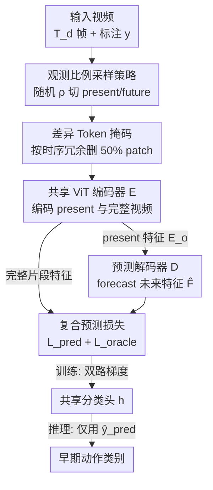

# EAST: Early Action Prediction Sampling Strategy with Token Masking

**会议**: ICLR2026  
**OpenReview**: [https://openreview.net/forum?id=3Genv8DQgf](https://openreview.net/forum?id=3Genv8DQgf)  
**代码**: https://github.com/ivasovic/east  
**领域**: 视频理解 / 早期动作预测  
**关键词**: 早期动作预测, 观测比例采样, Token 掩码, ViT 视频编码器, 预测解码器

## 一句话总结
EAST 用一个随机采样观测比例 $\rho$ 的训练策略，让**单个模型**就能在所有观测比例下做早期动作预测，再配上「present + future 双重分类的复合损失」和「按时序冗余度删一半 token 的差异掩码」，在 NTU60 / SSv2 / UCF101 上分别比此前最好方法高 10.1、7.7、3.9 个百分点，同时训练显存和时间砍半。

## 研究背景与动机
**领域现状**：早期动作预测（early action prediction）要求模型只看到视频的前一小段（观测比例 $\rho$，如只看前 10%、30% 帧）就预判出动作类别，用于监控预警、人机交互、自动驾驶等需要硬实时反应的场景。主流做法借助辅助任务来"脑补"未来：运动预测、未来残差预测、用图建模未来状态等。

**现有痛点**：有两个长期顽疾。其一，这些辅助目标（如运动/光流预测、特征相似度对齐）并不总能真正帮到分类，绕了一大圈优化的不是预测精度本身。其二，更要命的是——**最新方法要为每一个观测比例单独训一个模型**。标准评测要在 $\rho$ 从 0.1 到 0.9（步长 0.1）共 9 个比例上测，于是就要训 9 个模型，训练成本爆炸、部署时还得先知道当前观测比例去选对应模型。

**核心矛盾**：根子在于现成的动作识别模型严重依赖**完整时序上下文**，一旦只给前一小段就崩。而"为每个比例定制一个模型"虽然能缓解，却把"泛化到任意观测长度"这件本该由一个模型解决的事，硬拆成了 9 件事。

**本文目标**：(1) 让单个模型无缝覆盖所有观测比例；(2) 直接优化预测精度而非绕道辅助任务；(3) 把训练显存/时间压下来，让方法能在便宜的 GPU 上跑。

**切入角度**：作者观察到，与其精心设计"如何预测未来"，不如在训练时就让模型**见过各种长度的观测片段**——把观测比例本身当成一个随机采样的数据增强维度。

**核心 idea**：训练时随机采样切分"已观测/未观测"的时间点，用同一个模型同时对"部分观测的预测特征"和"完整视频的 oracle 特征"做分类，再用差异 token 掩码省一半算力。

## 方法详解

### 整体框架
EAST 要解决的是"只看前 $\rho$ 段视频就分类动作"，整体思路是：把一段视频按随机采样的比例切成 present（已观测）和 future（未观测）两半，**共享参数的 ViT 编码器 $E$** 既编码 present 帧、也编码完整视频；present 特征过**预测解码器 $D$** 去 forecast 未来特征 $\hat{F}$；一个**共享分类头 $h$** 同时对"预测特征"和"完整视频的 oracle 特征"打分，两路损失相加端到端训练。推理时只用 present 那一路（$\hat{y}_{\text{pred}}$），对测试观测比例完全无感知。再叠加一个**差异 token 掩码**，按时序冗余删掉一半 patch，把训练显存和时间砍半。

形式化：视频共 $T_d$ 帧，观测比例 $\rho \in (0,1)$ 控制可见的前 $\rho \cdot T_d$ 帧。训练时模型能看到全部 $T_d$ 帧和标注 $y$；推理时只看前 $\rho \cdot T_d$ 帧，且一个统一模型应付全部 9 个 $\rho$。

### 关键设计

**1. 观测比例采样策略：让一个模型吃遍所有 $\rho$**

这是全文最核心的设计，直接打掉"每个观测比例训一个模型"的痛点。训练时不固定观测长度，而是从 $\{0.1, 0.2, \dots, 0.9\}$ 里**随机采样** $\rho$，据此取 $T$ 帧已观测片段 $V_o \in \mathbb{R}^{T\times H\times W\times C}$ 和 $T$ 帧未观测片段 $V_u$，使 $V_o$ 在时间上位于 $\rho \cdot T_d$ 之前、$V_u$ 之后，拼成 $V = V_o \Vert V_u$ 共 $2T$ 帧均匀采样。一个关键细节：作者保证 $V_o$ 的末帧与 $V_u$ 的首帧在原视频里是**相邻帧**，避免拼接处的时序断裂污染训练样本。

为什么有效：随机化 $\rho$ 让模型在训练中见过各种长度的上下文，从而自适应"可变时序上下文长度"。作者的预实验表明，固定观测比例训练出的模型在其他 $\rho$ 上表现明显次优，而现成动作识别模型因依赖完整上下文在早期预测上直接失败。这一招还顺带把训练加速 $9\times$（9 个观测比例只训一次），推理也无需提供观测比例。

**2. MAE 特征上的预测解码器：从已观测特征 forecast 未来**

编码器 $E$ 是带时空位置编码的 ViT，由 tokenizer $\mathcal{T}$（把片段切成 $d\times p\times p$ 的 tubelet，$p=16, d=2$）和 transformer 编码器 $\mathcal{V}$ 组成：$E(V_o) = \mathcal{V}\circ\mathcal{T}(V_o) = E_o$。解码器 $D$ 接收 present 特征 $E_o$（先经空间平均池化 $P_s$ 得到每个时间步一个 token），forecast 未来特征：$D(E_o) = \mathcal{F}\circ P_s(E_o) = \hat{F}$。

作者比较了三种解码器形态：把 $\mathcal{F}$ 设为恒等映射（decoder-free，作为强 baseline）、自回归 transformer、以及把 $E_o$ 与额外 $[\text{MASK}]$ token 拼接后做单次全注意力前向的**直接 transformer**。验证显示直接解码比自回归平均高 0.6 pp，于是 EAST 采用 4 层直接 transformer。值得注意的是，编码器和解码器都用 VideoMAE 预训练初始化——这让后面的 token 掩码不会引入分布偏移（因为 MAE 预训练本就在掩码下进行）。

**3. 复合预测损失：present 与 oracle 双路监督**

光优化预测特征还不够——作者希望编码特征既有判别力、又包含未来线索。做法是对完整采样片段额外做一次前向，得到 oracle 编码特征 $E = P_s\circ E(V)$，让**同一个分类头 $h$** 产出两组 logits：来自 present 预测的 $\hat{y}_{\text{pred}} = h\circ P_t(\hat{F})$ 和来自完整视频的 $\hat{y}_{\text{oracle}} = h\circ P_t(E)$。总损失是两路负对数似然之和：

$$\mathcal{L} = \mathcal{L}_{\text{pred}} + \mathcal{L}_{\text{oracle}} = \mathcal{L}_{\text{NLL}}(\hat{y}_{\text{pred}}, y) + \mathcal{L}_{\text{NLL}}(\hat{y}_{\text{oracle}}, y).$$

从梯度角度看很直观：$\mathcal{L}_{\text{pred}}$ 的梯度直接优化早期预测、逼编码器和解码器都学出判别性特征；$\mathcal{L}_{\text{oracle}}$ 的梯度则在"看到完整视频"时给出判别性特征。两者结合给出最好的早期预测效果，且这正是让 **encoder-only 模型也能出色**的关键（消融里证明）。作者特意没用 present↔oracle 之间的 L2 特征对齐损失——实验发现 L2 损失在训练初期就最小化了，强对齐反而忽略了重要的时序模式。

**4. 差异 Token 掩码：删掉时序上"最不变"的 patch**

为压缩 attention 层的算力，作者删掉时间上重复的 token，灵感来自 Moravec 角点检测。对每个 tubelet $p_{t,i,j}$，按它与下一个 tubelet 对应 patch 的 L1 像素距离排序：

$$r_{t,i,j}(V) = \Vert p_{t,i,j}[0] - p_{t+1,i,j}[d-1]\Vert_1,$$

然后在每个空间位置 $(i,j)$ 保留排名最高的那部分 tubelet（取 $k$ 分位以上）。作者设 $k=50\%$，即每个空间位置删掉一半 token，称为**差异掩码**（difference masking）。一个防泄漏细节：训练时对 $V_o$ 和 $V_u$ **独立**施加掩码，防止未观测信息泄漏到已观测侧。直觉是：时间上变化最大的 patch 信息量最高，保留它们、删掉静止冗余的，因此 50% 掉点几乎可忽略，却把训练显存和总 GPU 时间各降 $2\times$，让 EAST 只用 2 张 20GB GPU 就能训。

### 损失函数 / 训练策略
总目标即上文的复合损失 $\mathcal{L} = \mathcal{L}_{\text{pred}} + \mathcal{L}_{\text{oracle}}$。骨干用 K400 上 VideoMAE 预训练的 ViT-B/16，解码器同样用 VideoMAE 初始化。每路采样 $T=8$ 帧，224×224 随机裁剪 + MixUp 增强；AdamW，基础学习率 $1\times10^{-3}$、权重衰减 0.05、cosine 衰减；batch size 在 SSv2/NTU60/EK-100 上为 96，SSsub21/UCF101 上为 128。配合 FlashAttention 与 $M^d_{k=0.5}$ 掩码，训练显存再砍半。

## 实验关键数据

### 主实验
EAST 在四个标准早期动作预测数据集上全面刷新 SOTA，且**只用一个模型覆盖全部 9 个观测比例**。

| 数据集 | 指标 | EAST | 之前 SOTA | 平均提升 |
|--------|------|------|----------|------|
| NTU60 | top-1 acc（仅 RGB） | $\rho{=}0.5$: 86.2 | TemPr 70.1 | +6.8 pp（$\rho{=}0.3$ 处最高 +19.2） |
| SSv2 | top-1 acc | $\rho{=}0.5$: 49.0 | TemPr | +28.3 pp |
| SSsub21 | top-1 acc | $\rho{=}0.5$: 66.4 | Early-ViT 52.4 | +22.7 pp |
| UCF101（MoViNet 骨干） | top-1 acc | $\rho{=}0.5$: 95.5 | TemPr 95.4 | +3.9 pp（vs ERA +1.3） |

NTU60 上仅用 RGB 就超过了用骨架/深度多模态的方法；UCF101 上换 MoViNet 骨干仍是 SOTA，说明增益来自训练策略而非骨干。EK-100 上 EAST 在低观测比例显著超 TemPr（$\rho{=}0.1$ All Action 20.4 vs 7.4），高比例受 ViT 编码器上限制约。

### 消融实验

| 配置 | SSv2 平均 top-1 | 说明 |
|------|---------|------|
| VideoMAE（整段训练） | — | $\rho{=}0.1$ 仅 9.9%，依赖完整上下文 |
| EAST$_E$（仅采样策略，encoder-only，仅 $\mathcal{L}_{\text{pred}}$） | 44.8 | $\rho{=}0.1$ 飙到 23.9%，已超此前 SOTA |
| + $\mathcal{L}_{\text{oracle}}$（encoder-only） | 46.3 | 复合损失 +1.5 pp |
| Full EAST（encoder-decoder + 复合损失） | 46.9 | 再 +0.6 pp |

token 掩码消融（NTU60 平均 acc）：差异掩码 $M^d$ 全面胜过随机掩码 $M^{\text{rand}}$ 和 MAR 的 Running Cell 掩码 $M^{\text{MAR}}$——$k{=}0.5$ 时 $M^d$ 达 74.3%，比 $M^{\text{rand}}$ 高 3.0 pp，几乎追平不掩码的 75.1%，但峰值显存从 36.7GB 降到 19.2GB、TFLOP 从 1.1 降到 0.5。

### 关键发现
- **采样策略贡献最大**：仅靠它，encoder-only 的 EAST$_E$ 在 $\rho{=}0.1$ 就从 VideoMAE 的 9.9% 跳到 23.9%，证明早期预测的瓶颈不在"预测未来的花式模块"，而在"训练时有没有见过短观测片段"。
- **oracle 损失让 encoder-only 也能打**：不依赖解码器，光加完整视频的分类监督就能涨 1.5 pp，说明双路监督是性价比极高的一招。
- **差异掩码优于随机/运动掩码**：保留"时序上变化最大"的 patch 比随机删或按运动删更稳，掉点几乎为零却省一半资源。
- **横向比较的 caveat**：不同数据集的提升幅度（NTU60 +6.8 vs SSv2 +28.3 pp）不可直接比大小，SSv2 上 TemPr 基线本就弱、且每个比例单模型，比较口径与 EAST 单模型不同。

## 亮点与洞察
- **把"观测比例"当数据增强维度**：最让人"啊哈"的地方是——业界一直在为每个观测比例造专用模型，而 EAST 只是把 $\rho$ 随机化进训练循环，就同时解决了"泛化到任意长度"和"9 倍训练开销"两个问题。这种"用采样代替专门化"的思路可迁移到任何"测试时有连续可变条件"的任务（如可变分辨率、可变序列长度）。
- **oracle 监督是廉价的免费午餐**：对完整视频多做一次前向、共享分类头打第二路损失，不引入新模块就让 encoder-only 模型反超此前 SOTA。这个 trick 可直接用在其他"训练时有特权信息、推理时没有"的设置里。
- **差异掩码的物理直觉**：用 L1 像素距离衡量 token 的时序信息量，本质是"角点检测"思想搬到视频 token 剪枝上——静止背景删掉、运动主体保留，简单且无需学习。

## 局限与展望
- **受编码器上限制约**：EK-100 高观测比例下，EAST 被 VideoMAE ViT-B 的识别天花板卡住（33.7% all-action vs TemPr SlowFast 38.5%），说明方法增益主要体现在"信息不足"的低观测区，上下文充足时退化为普通动作识别、拼骨干。
- **单次运行、固定种子**：作者报告的是单次训练结果（固定随机种子），未给方差，强提升幅度的稳健性有待多次实验确认。
- **掩码比例硬定 50%**：$k{=}0.5$ 是效率/精度折中的人工选择（$k{=}0.25$ 精度更高但更费），缺少按内容自适应的掩码比例机制——静态视频本可删更多、剧烈运动视频或应保留更多。
- **改进思路**：可探索自适应观测比例采样（按难度加权）、用更强骨干打破 EK-100 高比例瓶颈、以及内容自适应的掩码比例。

## 相关工作与启发
- **vs TemPr（Stergiou & Damen, 2023）**：TemPr 用多塔 transformer 共识处理时序特征级联，但**为每个观测比例训专用模型**、推理时需指定比例；EAST 单模型无感知观测比例，端到端训练全参数，在相近 TFLOP 下大幅领先。
- **vs Early-ViT（Camporese et al., 2023）**：Early-ViT 学动作原型来正则化部分视频表示；EAST 不学原型，纯用判别损失 + 采样策略，SSsub21 上平均高出一大截。
- **vs AA-GAN / DBDNet（用完整视频引导未来表示的一类）**：它们靠对抗训练或 Bi-LSTM 重建未来运动/光流来"脑补"未来；EAST 完全用判别损失表达"部分预测 + 完整观测"，不优化任何特征相似度度量，避免了辅助目标与分类目标错位。
- **vs VideoMAE / DynamicViT / EVEREST 等 token 剪枝**：它们多服务于自监督预训练或在线剪枝；EAST 的差异掩码专为"保留早期预测精度的同时省训练资源"设计，按时序外观变化而非随机/运动来选 token。

## 评分
- 新颖性: ⭐⭐⭐⭐ 把观测比例随机采样化、用一个模型替掉 9 个专用模型，思路简洁但切中要害；单项组件（token 掩码、复合损失）相对常规。
- 实验充分度: ⭐⭐⭐⭐ 四数据集 + 充分消融，掩码/解码器/损失逐项验证；但单次运行无方差、EK-100 受骨干限制。
- 写作质量: ⭐⭐⭐⭐ 动机清晰、方法层次分明，公式与图示到位。
- 价值: ⭐⭐⭐⭐ 显著降低早期动作预测的训练成本与部署复杂度，SOTA 提升明显，代码开源，实用性强。

<!-- RELATED:START -->

## 相关论文

- [\[CVPR 2026\] EarlyTom: Early Token Compression Completes Fast Video Understanding](../../CVPR2026/video_understanding/earlytom_early_token_compression_completes_fast_video_understanding.md)
- [\[CVPR 2026\] ProgTrack: A Multi-Object Tracking Algorithm with Progressive Matching Strategy](../../CVPR2026/video_understanding/progtrack_a_multi-object_tracking_algorithm_with_progressive_matching_strategy.md)
- [\[CVPR 2026\] Cluster-Wise Spatio-Temporal Masking for Efficient Video-Language Pretraining](../../CVPR2026/video_understanding/cluster-wise_spatio-temporal_masking_for_efficient_video-language_pretraining.md)
- [\[ICLR 2026\] Video-KTR: Reinforcing Video Reasoning via Key Token Attribution](video-ktr_reinforcing_video_reasoning_via_key_token_attribution.md)
- [\[CVPR 2026\] Self-Paced and Self-Corrective Masked Prediction for Movie Trailer Generation](../../CVPR2026/video_understanding/self-paced_and_self-corrective_masked_prediction_for_movie_trailer_generation.md)

<!-- RELATED:END -->
