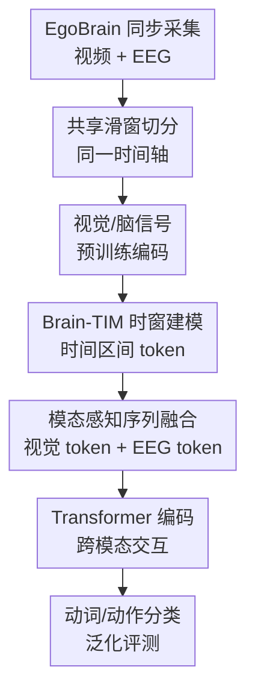

# EgoBrain: Synergizing Minds and Eyes For Human Action Understanding

**会议**: ICLR2026  
**OpenReview**: [https://openreview.net/forum?id=DGcoJINQ7P](https://openreview.net/forum?id=DGcoJINQ7P)  
**代码**: https://github.com/ut-vision/EgoBrain  
**领域**: 视频理解 / 第一视角动作理解 / 脑视觉多模态  
**关键词**: 第一视角视频, EEG, 动作识别, 多模态融合, Brain-TIM  

## 一句话总结
EgoBrain 构建了首个大规模同步第一视角视频与 32 通道 EEG 的日常动作数据集，并提出 Brain-TIM 用时间感知 Transformer 融合视觉和脑信号，在跨主体跨场景 29 类动作识别上把视觉基线从 63.40% 提升到 66.70%。

## 研究背景与动机
**领域现状**：第一视角视频理解已经有 EPIC-KITCHENS、Ego4D、HoloAssist、Assembly 系列等数据集，能很好地记录人看到什么、手在做什么、物体如何被操作。另一条线是 EEG 与 BCI 研究，它擅长捕捉注意、运动意图、决策准备等内部神经活动，但常见设置仍偏向实验室屏幕刺激、静态图像或受控的运动想象任务。

**现有痛点**：这两条研究线长期是断开的。第一视角视频数据集只看外部行为结果，不知道被试当时的认知状态；传统 EEG 数据集能看见神经反应，却很少让人真的在真实环境中与物体互动。于是模型要么只学习“眼睛看到的世界”，要么只学习“脑信号里的反应”，很难研究外部感知和内部意图如何共同决定动作。

**核心矛盾**：日常动作理解里的很多错误恰好来自视觉不可见或视觉歧义。例如写字和画画在第一视角里可能都是手拿笔在纸上移动，喝饮料和吃零食在遮挡时可能只剩桌面上下文。视觉强在空间细节和物体线索，EEG 强在时间分辨率和隐含认知线索，两者互补，但前提是要有严格同步的数据和能处理共享时间轴的融合模型。

**本文目标**：作者想同时解决两个问题。第一，建立一个真实日常活动场景下的同步脑-视觉数据集，让研究者可以在同一时间轴上观察第一视角视频和 EEG。第二，给出一个可复现的基线模型，验证 EEG 是否真的能为第一视角动作识别提供增益，尤其是在跨主体、跨环境这种更接近真实部署的设置下。

**切入角度**：论文没有把 EEG 当作替代视觉的单独信号，而是把它当作补足视觉盲区的内部状态通道。这个角度很合理：第一视角视频提供场景、物体和手部运动，EEG 则可能携带注意、动作准备、吞咽或视觉空间规划等信号。只要二者在时间上对齐，模型就有机会在视觉模糊时借助脑信号做判别。

**核心 idea**：用同步采集的 EgoBrain 数据集把“眼睛看到的动作”和“大脑参与动作时的信号”放到同一时间轴上，再用 Brain-TIM 显式建模时间区间、模态身份和跨模态交互，从而提升第一视角动作理解。

## 方法详解
### 整体框架
论文的整体贡献由数据集和模型两部分组成。数据侧，EgoBrain 用头戴 GoPro 记录 1080P/30Hz 第一视角视频，同时用 32 通道无线 EEG 头显以 256Hz 采集脑电，让 40 名被试完成 29 类日常活动。模型侧，Brain-TIM 把视频和 EEG 切成共享时间窗，分别用预训练编码器抽特征，再把时间感知、模态感知 token 送入 Transformer 做动词和动作分类。

从数据流看，原始视频流 $V^{raw}$ 和 EEG 序列 $B^{raw}$ 共享同一个时间区间 $[0,T]$。模型把整个序列均匀划成 $Q$ 个查询区间，每个查询要预测对应时间段内的动词类别或细粒度动作类别。这里的关键不是简单把两个特征拼起来，而是让模型知道每个 token 覆盖哪个时间区间、来自哪种模态、对应哪个查询。

### 关键设计
**1. EgoBrain 同步采集：把第一视角行为和脑信号放到同一时间轴**

这篇论文最重要的基础设施贡献是数据集本身。作者让被试戴着头戴 GoPro 和 32 通道 Emotiv FLEX 2 EEG 头显，在受控但接近日常的工作台环境中完成动作。视频记录人眼视角下的物体、手部和屏幕，EEG 记录同一时间的脑电活动。由于两者同步采集，后续模型不需要猜“脑信号对应哪一帧”，而是可以直接在同一时间轴上切窗。

动作设计也服务于这个目标。29 个细粒度动作被组织在 Work、Play、Learn、Consume 四个高层活动下，并进一步把 Play 分成屏幕游戏、物体游戏和手机游戏等子类型。这样做不是为了让标签层级变复杂，而是为了让动作之间既有视觉相似性，也有认知和运动负荷差异。例如写笔记、描图、画画都可能出现纸笔运动，但内部任务意图不同；吃零食、喝水、喝苦瓜汁都涉及口面部动作，却有不同对象和情境。

**2. Brain-TIM 时窗建模：用重叠窗口对齐视频和 EEG 的动态过程**

视频是 30Hz，EEG 是 256Hz，两者采样率不同，直接逐点对齐没有意义。Brain-TIM 采用长度为 $\Delta t$、步长为 $\delta t$ 的滑动窗口，把视频和 EEG 都切成 $N=\lfloor (T-\Delta t)/\delta t \rfloor+1$ 个对齐片段。每个视频窗口包含 $N_v=f_v\cdot\Delta t$ 帧，每个 EEG 窗口包含 $N_b=f_b\cdot\Delta t$ 个采样点。

这个设计同时解决两个问题。第一，它把不同采样率的原始信号变成数量一致的窗口级特征序列，方便 Transformer 处理。第二，论文强调 $\delta t$ 小于潜在的亚秒级时间偏差，相邻窗口高度重叠，所以轻微时间戳误差不会让某个关键动作瞬间完全丢失；同一时刻会被多个窗口覆盖，形成自然的时间冗余。

**3. 时间与模态感知 token：让 Transformer 同时知道“何时发生”和“来自哪里”**

Brain-TIM 没有只把 VideoMAE 特征和 LaBraM 特征粗暴拼接。视觉片段先由 VideoMAE 编码成窗口级特征 $E_v$，EEG 片段经过滤波、下采样、LaBraM 编码和通道平均池化得到 $E_b$。随后两种特征分别经过可学习嵌入层 $g_v$ 和 $g_b$ 投到同一个 $D$ 维空间，得到视觉 token 和 EEG token。

时间信息由 Time-Interval MLP 产生。对第 $i$ 个特征窗口，TIM 接收 $[t_i,t_i+\Delta t)$ 的起止时间并输出时间嵌入 $e_i^f$；对第 $j$ 个查询，TIM 接收 $[(j-1)T/Q,jT/Q]$ 并输出查询时间嵌入 $e_j^q$。模态身份则由两个可学习向量 $m_v$ 和 $m_b$ 表示，分别加到视觉和 EEG 相关 token 上。最终序列包含视觉特征块、脑信号特征块、视觉 CLS token 块和 EEG CLS token 块，长度为 $2N+2Q$，每个元素带有内容、时间和模态三类信息。

**4. 跨主体与跨场景评测：把脑视觉协同放到真实泛化压力下检验**

论文没有只在随机划分上证明模型有效，而是设计了两个更有诊断意义的设置。Cross-subject-only 要求模型在同一物理环境下泛化到未见过的被试；Cross-subject & Cross-scene 进一步把测试集换到新环境、新背景和不同物体配置中，考察模型是否依赖固定桌面和固定视觉上下文。

这个评测设计对本文结论很关键。如果 EEG 只是记住某些被试或某些固定场景里的噪声，它在跨主体、跨场景下不会稳定增益。实验显示多模态模型在更难的跨场景设置下反而带来更大的动作识别绝对提升，说明 EEG 更像是对视觉域偏移和遮挡的一种补偿信号，而不是简单增加参数量造成的偶然收益。

### 一个完整示例
以“画图”和“写笔记”的混淆为例，第一视角视频里两者都可能表现为手拿笔在纸上运动，局部视觉轨迹和桌面背景高度相似。视觉模型看到笔尖、纸张和手部运动，可能更容易把它归到 Write。

在 Brain-TIM 中，同一段时间会先被切成多个重叠窗口。视频窗口提供纸面、笔迹和手部移动，EEG 窗口则提供同步的脑电特征。TIM 给每个窗口补上它在动作区间中的时间位置，模态嵌入告诉 Transformer 哪些 token 来自视觉、哪些来自脑信号。最后，查询 CLS token 聚合对应时间段的信息。如果 EEG 中存在与视觉空间构图、图像想象或绘制意图相关的差异，模型就可能把视觉上相似的“写”纠正成“画”。论文的案例分析中，视觉模型把 Draw Pictures 误判成 Write Notes，而视觉+EEG 模型能恢复正确类别。

### 损失函数 / 训练策略
Brain-TIM 的预训练编码器在特征提取阶段冻结：视频使用在 EPIC-KITCHENS-100 上预训练的 VideoMAE，输出 1024 维片段特征；EEG 使用在 2500 小时 EEG 数据上预训练的 LaBraM，输出通道级脑电特征，再通过池化得到窗口级表示。

Transformer 输出后，模型取出视觉和 EEG 分支的查询 CLS token，分别送入分类头。补充材料给出的训练目标是视觉分支交叉熵 $L_v$ 与 EEG 分支交叉熵 $L_b$ 的加权和：$L=L_v+\lambda\cdot L_b$。高层语义类别 Work、Play、Learn、Consume 只用于组织数据集，不作为训练监督；真正参与训练的是 verb 分类和 29 类 action 分类。

## 实验关键数据

### 主实验
论文主实验比较了 Brain only、Visual only 和 Visual + Brain 三种输入，在两个泛化协议下报告 5 个随机种子的 Top-1 accuracy。视觉单模态已经很强，但加入 EEG 后两个协议都提升，尤其是跨主体跨场景下 29 类动作识别从 63.40% 到 66.70%。

| 协议 | 模态 | Verb Acc. | Action Acc. | 关键信息 |
|--------|------|------|----------|------|
| Cross-subject only | Brain only | 21.53 ± 0.99 | 8.44 ± 2.25 | 高于随机但远弱于视觉 |
| Cross-subject only | Visual only | 88.95 ± 0.80 | 78.44 ± 0.71 | 第一视角视觉已能捕捉大多数外部动作 |
| Cross-subject only | Visual + Brain | 90.11 ± 1.10 | 80.16 ± 1.67 | Action 绝对提升 1.72 个百分点 |
| Cross-subject & Cross-scene | Brain only | 19.41 ± 1.57 | 9.36 ± 0.52 | 场景变化下仍高于多数类随机基线 |
| Cross-subject & Cross-scene | Visual only | 81.67 ± 1.89 | 63.40 ± 0.95 | 视觉受新环境和物体配置影响明显 |
| Cross-subject & Cross-scene | Visual + Brain | 83.43 ± 0.41 | 66.70 ± 0.83 | Action 绝对提升 3.30 个百分点 |

一个值得注意的点是参数量并不能解释全部提升。LaBraM 分支只有 5.8M 参数，而 VideoMAE 视觉骨干约 305.0M 参数；Visual + Brain 总参数约 310.8M。也就是说，多模态增益主要来自 EEG 提供的额外信息，而不是把模型规模显著放大。

### 消融实验
消融实验考察嵌入层、Time Interval MLP 和模态嵌入的贡献。结果显示，在脑信号单模态和视觉+脑信号多模态设置下，这些组件总体是正向的；但在视觉单模态中，额外结构反而可能带来不必要复杂度。

| 配置 | Action Acc. | 说明 |
|------|---------|------|
| Brain only，无 embedding / TIM | 7.44 ± 0.39 | 仅靠原始脑特征时接近多数类随机水平 |
| Brain only，embedding + TIM | 9.36 ± 0.52 | 时间区间建模和投影层明显改善 EEG 解码 |
| Visual only，无 embedding / TIM | 64.94 ± 3.64 | 视觉单模态本身已经很强 |
| Visual only，embedding + TIM | 63.40 ± 0.95 | 额外模块对纯视觉不是必需，甚至略降 |
| Visual & Brain，无三组件 | 65.71 ± 0.43 | 简单多模态已有一定收益 |
| Visual & Brain，embedding + TIM + modality embedding | 66.70 ± 0.83 | 完整 Brain-TIM 表现最好 |

论文还比较了 temporal fusion 和 spatial fusion。二者在动词分类上很接近，但在更难的 29 类动作识别上，Brain-TIM 的 temporal fusion 达到 66.70 ± 0.83，而 spatial fusion 为 64.81 ± 1.04。这说明简单把特征沿维度拼起来可以帮助粗粒度语义，但细粒度动作需要保留模态身份和时间结构。

### 关键发现
- EEG 的增益不是均匀发生的，而是更容易出现在视觉歧义、遮挡或任务意图不同但外观相似的类别上。例如 Play(I) 的 verb 识别从 0.46 提升到 0.64，Drink 从 0.87 提升到 0.94。
- EEG 也会带来噪声。论文案例中，操作 PowerPoint 被多模态模型误判成 Draw Pictures，可能是因为创建矩形等操作激活了类似绘图的视觉运动策略，导致脑信号层面的语义边界变模糊。
- 跨场景设置下视觉模型从 78.44% 降到 63.40%，说明第一视角动作识别仍有明显域偏移；多模态模型在该设置下提升 3.30 个百分点，比同场景跨主体设置的 1.72 个百分点更大。
- Brain only 模型在跨主体跨场景 action accuracy 为 9.36%，高于多数类随机基线 7.02%，但离实用识别仍很远；EEG 在当前阶段更适合作为互补信号，而不是替代视觉。

## 亮点与洞察
- **把脑信号引入第一视角动作理解的数据层**：这不是单纯换一个 backbone，而是补上了以往 egocentric video 数据集中缺失的内部认知通道。它让研究问题从“看到什么动作”扩展到“视觉线索和神经线索如何共同解释动作”。
- **评测设置比普通随机划分更有价值**：Cross-subject & Cross-scene 把主体差异和环境域偏移同时放进测试集，更能暴露模型是否只记住固定桌面背景。多模态在这里提升更大，支撑了 EEG 作为补偿信号的论点。
- **Brain-TIM 的设计很克制**：作者没有发明复杂的脑视觉大模型，而是在预训练编码器之上加入时间区间 MLP、模态嵌入和 Transformer 序列融合。这个基线足够清晰，也便于后续研究者替换 EEG 编码器、视觉编码器或融合模块。
- **案例分析给出了可解释的失败和成功边界**：喝苦瓜汁在手和杯子被遮挡时受益于 EEG，画图和写字也能借助内部任务意图区分；但当认知策略本身重叠时，EEG 会把模型带偏。这种诚实分析比只报平均提升更有启发。

## 局限与展望
- 数据采集仍是受控环境下的坐姿桌面活动。虽然比屏幕刺激更接近日常，但还不是完全自由移动的真实生活场景；下肢运动、走动、户外环境和社交互动中的 EEG 噪声会更复杂。
- 参与者数量为 40，数据总时长 61 小时，对 EEG 个体差异而言仍偏小。未来如果要训练更强的脑信号表征，可能需要更多被试、更长时间和跨设备采集。
- EEG 使用消费级或便携式头显时信噪比有限，Brain only 表现仍低。当前结论更适合理解为“EEG 能补视觉”，还不能说明 EEG 可以单独承担复杂日常动作识别。
- 标签层级较粗，高层类别没有用于训练。后续可以研究层级监督、动作阶段标注、意图标注，甚至把 EEG 中的注意/负荷状态作为辅助任务。
- 融合方式仍主要是监督式分类。未来可以尝试自监督脑-视觉对齐、跨模态检索、脑信号辅助视频表征学习，或者在视觉缺失/遮挡场景中做鲁棒性专项评测。

## 相关工作与启发
- **vs EPIC-KITCHENS / Ego4D**: 这些数据集提供大规模第一视角视频和丰富任务标注，适合研究人如何与物体和环境互动；EgoBrain 的区别在于同步采集 EEG，因此能研究动作发生时的内部神经状态。代价是规模远小于 Ego4D，动作和场景也更受控。
- **vs EEG2Video / EEG-image decoding**: 这类工作通常关注从 EEG 解码视觉刺激，刺激多来自屏幕或受控视觉输入；EgoBrain 不追求重建图像，而是把 EEG 用作真实动作理解的补充模态，任务更偏行为识别和人机交互。
- **vs ToMCAT**: ToMCAT 也包含多种任务和认知相关信号，但主要围绕屏幕任务和虚拟交互。EgoBrain 强调第一视角真实物体交互，并把视频和 EEG 对齐到动作识别 benchmark。
- **vs TIM**: TIM 原本用于音视频动作识别中的时间区间建模，Brain-TIM 把这一思想迁移到脑-视觉融合场景。启发在于：当多模态共享时间轴但采样率不同，显式时间区间嵌入比单纯位置编码更自然。

## 评分
- 新颖性: ⭐⭐⭐⭐⭐ 首个面向第一视角动作理解的大规模同步 EEG-视频数据集，问题定义本身很有开创性。
- 实验充分度: ⭐⭐⭐⭐ 主实验、消融、融合方式和案例分析都比较完整，但数据规模和场景多样性仍有限。
- 写作质量: ⭐⭐⭐⭐ 论文结构清楚，方法和数据集描述完整；部分 EEG 机制解释仍偏假设，需要更多神经科学验证支撑。
- 价值: ⭐⭐⭐⭐⭐ 数据集和基线都很适合作为后续脑-视觉多模态研究的起点，尤其能推动第一视角理解从外部行为走向内部状态建模。

<!-- RELATED:START -->

## 相关论文

- [\[CVPR 2026\] MoVie: Broaden Your Views with Human Motion for Action Detection](../../CVPR2026/video_understanding/movie_broaden_your_views_with_human_motion_for_action_detection.md)
- [\[ICLR 2026\] Go Beyond Earth: Understanding Human Actions and Scenes in Microgravity Environments](go_beyond_earth_understanding_human_actions_and_scenes_in_microgravity_environme.md)
- [\[ICLR 2026\] V2P-Bench: Evaluating Video-Language Understanding with Visual Prompts for Better Human-Model Interaction](v2p-bench_evaluating_video-language_understanding_with_visual_prompts_for_better.md)
- [\[CVPR 2025\] H-MoRe: Learning Human-centric Motion Representation for Action Analysis](../../CVPR2025/video_understanding/h-more_learning_human-centric_motion_representation_for_action_analysis.md)
- [\[CVPR 2026\] DarkShake-DVS: Event-based Human Action Recognition under Low-light and Shaking Camera Conditions](../../CVPR2026/video_understanding/darkshake-dvs_event-based_human_action_recognition_under_low-light_and_shaking_c.md)

<!-- RELATED:END -->
