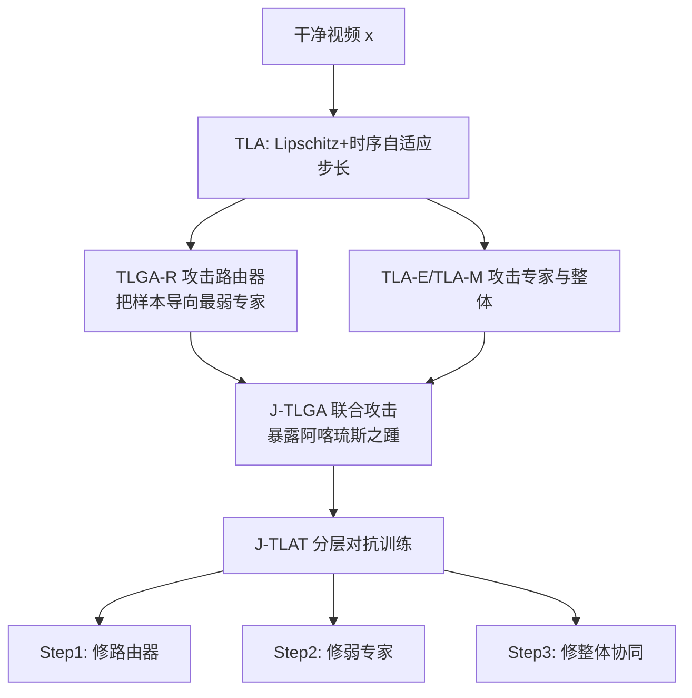

# Exposing and Defending the Achilles' Heel of Video Mixture-of-Experts

**会议**: ICLR 2026  
**OpenReview**: [https://openreview.net/forum?id=8voly42rKo](https://openreview.net/forum?id=8voly42rKo)  
**代码**: [https://github.com/DeepSota/J-TLAT](https://github.com/DeepSota/J-TLAT)  
**领域**: 视频理解 / MoE 对抗鲁棒性  
**关键词**: Video MoE, 对抗攻击, 对抗训练, Lipschitz 约束, 路由器攻击, 组件级鲁棒性  

## 一句话总结
本文首次系统拆解视频 MoE 的组件级对抗弱点，提出"先把路由器引向最弱专家、再联合扰动路由器与专家"的 J-TLGA 攻击暴露其"阿喀琉斯之踵"，并配套分层对抗训练 J-TLAT 把弱点逐层修补，在保持 60%+ 推理省算量的同时大幅提升鲁棒性。

## 研究背景与动机
**领域现状**：Mixture-of-Experts（MoE）通过路由器稀疏激活少量专家子网络，用近乎恒定的推理成本换取超大模型容量，在动作识别、视频-语言建模等视频理解任务上表现优异——视频天然具有复杂时空结构和长程依赖，MoE 按帧级语义动态选专家恰好契合这一需求。

**现有痛点**：视频 MoE 的安全性几乎无人问津。现有对抗攻击与对抗训练（AT）都把 MoE 当成一个**整体黑盒**来打，忽略了它内部"路由器 + 专家"的模块化结构。这种"整体攻击"既无法暴露路由器的独立弱点，也发现不了组件之间协同失效的弱点；用于图像 MoE 的少数工作又迁不到视频域（视频多了时间轴，特征更复杂）。

**核心矛盾**：MoE 的强大恰恰来自"分而治之"的组件协同，但**协同是一把双刃剑**——攻击者一旦能操纵路由决策、把样本导向最脆弱的专家，再叠加对专家本身的扰动，破坏力会被成倍放大，而传统整体式攻防对此完全无感。

**本文目标**：回答两个问题——(Q.A) 对抗攻击能在视频 MoE 中暴露哪些弱点？(Q.B) 据此如何设计有效的对抗训练去防御？

**核心 idea**：**组件级 + 联合 + 分层**。先用 Lipschitz 引导的时序攻击分别打路由器和专家，再联合攻击暴露"阿喀琉斯之踵"，最后用三步分层对抗训练把暴露出的弱点逐层修补。

## 方法详解

### 整体框架
视频 MoE 把输入 $x\in\mathbb{R}^{C\times T\times H\times W}$ 交给路由器 $R(\cdot)$ 产生各专家权重 $R(x)=(w_1,\dots,w_M)$，最终预测为专家输出加权和 $F(x)=\sum_i w_i(x)E_i(x)$。本文先提出一族 **Temporal Lipschitz-Guided Attack（TLGA）** 分别攻击路由器/专家/整体，发现弱点后再用联合攻击 J-TLGA 暴露协同弱点，最后用三步分层对抗训练 J-TLAT 防御。攻防共享同一把"钥匙"：Lipschitz 常数——攻击侧最大化它来放大敏感度，防御侧最小化它来平滑决策边界。

### 关键设计

**1. Temporal Lipschitz Attack（TLA）：用 Lipschitz 常数加时序自适应步长锐化攻击。** Lipschitz 常数衡量函数对输入微扰的敏感度，模型越脆弱该常数越大。作者把它写成可微的有限差分形式 $\mathcal{L}_{\text{Lip}}=\frac{\ell_{\text{MSE}}(g(x),g(x+\delta))}{\ell_{\text{MSE}}(x,x+\delta)}$，其中 $g$ 可是整体 $F$、路由器 $R$ 或某专家 $E_i$，**最大化它就是在输入空间里搜索让输出变化最剧烈的方向**。针对视频多出的时间维，传统方法对每帧用相同步长，忽略了帧间差异；TLA 改用时序动量 $V_{t+1}=\beta V_t+\|\nabla_x\ell(t)\|_2$ 把历史梯度范数累积起来，再据此给每帧分配自适应步长 $\alpha^*=\frac{\alpha\cdot\epsilon}{1+\log(1+\sqrt{V^*})}$，把扰动预算智能地倾斜到更敏感的帧上，整体攻击损失为 $\ell_{\text{MoE}}=\ell_{\text{CE}}(F(x+\delta),y)+\lambda\cdot\mathcal{L}_{\text{Lip}}$。

**2. TLGA-R：把路由器"忽悠"到最弱专家。** 作者观察到——对同一样本，路由器高置信分配的专家往往更强，低置信分配的更脆弱。于是在路由器攻击损失里加一项把样本**主动推向最低置信专家** $\hat{y}_R$ 的引导项：$\ell^*_{\text{Router}}=\ell_{\text{Router}}-\gamma_1\cdot\ell_{\text{CE}}(R(x+\delta_R),\hat{y}_R)$。这样攻击不只让路由决策"崩塌"，还精准把样本路由到最容易被攻破的专家上。实验显示仅打路由器，TLGA-R 就比常规 PGD-R 高出近 24%，把经 AT 训练的 MoE 鲁棒精度从 42% 直接打到 16%（**Insight 1：只打路由器就能严重威胁传统 AT 训练的 MoE**）。

**3. J-TLGA：路由器攻击 × 整体攻击的协同放大。** 既然组件协同提升了性能，攻击是否也能协同？J-TLGA 把"用 TLGA-R 把样本导向弱专家"和"用 TLA 破坏整体输出"两者联合：$\ell^\star_{\text{MoE}}=\ell_{\text{MoE}}+\gamma_2\cdot\ell^*_{\text{Router}}$。一边逼路由器选最脆弱的专家，一边同时扰动这些专家，弱点的累积效应让破坏力暴涨——在 $\epsilon=14/255$ 下把鲁棒 MoE 精度打到仅 2.54%，远超任何常规攻击，正式暴露 MoE 的"阿喀琉斯之踵"（**Insight 2：组件弱点有累积效应，联合攻击破坏力最强**）。

**4. J-TLAT：三步分层对抗训练，逐层修补弱点。** 端到端的传统 AT 难以精修组件级弱点。J-TLAT 在每个 epoch 内分层做对抗训练：**Step1** 先训练路由器 $\min_{\theta_R}\max_{x_{adv}}\ell_{\text{Router}}$，让它在不同扰动下保持路由一致；**Step2** 用 TLGA-R 找出弱专家集合 $\mathcal{I}=\text{Top-2}(\text{Router}(x_{adv}))$，按权重对它们做对抗训练 $\ell_{\text{Expert}}=\sum_{i\in\mathcal{I}}w_i[\ell_{\text{CE}}(E_i(x+\delta),y)+\lambda\cdot\mathcal{L}_{\text{Lip}}]$；**Step3** 再对整个 MoE 做对抗训练强化协同鲁棒。三步从组件级到整体级逐层加固，对应攻击逐层暴露的弱点（**Insight 3：分层对抗训练能逐级修复组件级攻击发现的弱点**）。最小化 $\mathcal{L}_{\text{Lip}}$ 还在理论上压低了 MoE 的全局 Lipschitz 上界（附录给出推导）。

## 实验关键数据

### 主实验表格（UCF-101，3D ResNet 专家，部分 ϵ）

| 方法 | CLEAN | PGD@8 | J-TLGA 视角下的鲁棒性 | GFLOPs↓ | Lips-R↓ |
|------|-------|-------|----------------------|---------|---------|
| AT-D（稠密） | 54.51 | 24.84 | — | 4.790 | — |
| AT-M（MoE+AT） | 49.23 | 19.23 | 弱 | 1.831 | 261.8 |
| OUD-M | 51.67 | 15.16 | J-TLGA 下仅 2.64% | 19.94 | 1389 |
| AAT-M | 49.67 | 23.08 | J-TLGA 下崩溃到 0% | 1.831 | 953.3 |
| TLAT | 51.65 | 30.22 | 较强 | 1.831 | 3.500 |
| **J-TLAT** | **54.29** | **36.37** | **最强** | **1.831** | **0.823** |

J-TLAT 在最强联合攻击 J-TLGA 下比 AAT-M 高出近 34%，且 GFLOPs 仅 1.831（相比稠密 AT-D 的 4.790 省算 60%+），Lipschitz 常数低至 0.823。

### 攻击强度表格（UCF-101，鲁棒精度 % 越低攻击越强）

| ϵ | PGD-R | TLA-R | TLGA-R | PGD | TLA-M | J-TLA | J-TLGA |
|---|-------|-------|--------|-----|-------|-------|--------|
| 8/255 | 42.20 | 23.52 | 18.13 | 22.09 | 15.05 | 7.03 | **4.95** |
| 14/255 | 39.34 | 21.65 | 15.82 | 14.84 | 11.10 | 4.73 | **2.54** |

### 关键发现
- **路由器是最薄弱环节**：仅 TLGA-R 一项就把 AT-M 鲁棒精度从 42% 压到 16%，比 PGD-R 强约 24%。
- **联合攻击成倍放大**：J-TLGA 把所有基线（除 J-TLAT）打到个位数甚至 0%，证明协同弱点真实存在且可被利用。
- **防御侧零额外推理成本**：J-TLAT 防御提升不以推理算量为代价，GFLOPs 与轻量 MoE 持平，并保住了 54.29% 的干净精度。

## 亮点与洞察
- **视角创新**：第一次把视频 MoE 的对抗鲁棒性拆成"路由器独立弱点 + 路由器×专家协同弱点"，给出"先误导路由、再打弱专家"的攻击范式，比"整体黑盒"攻击深刻得多。
- **攻防同源**：同一个 Lipschitz 可微损失，攻击侧最大化、防御侧最小化，逻辑自洽且有理论 Lipschitz 上界支撑。
- **时序自适应步长**：用帧间梯度差异分配扰动预算，是视频对抗攻击相对图像域的关键增量。
- **工程友好**：plug-and-play、省算 60%+、干净精度不掉，对安全攻坚的实际部署有吸引力。

## 局限与展望
- 全程**白盒**设定（已知架构/参数/梯度），虽然作者论证白盒防御可外推到灰/黑盒，但缺乏黑盒迁移攻击的直接实证。
- 实验集中在 UCF-101 / HMDB-51 两个经典动作识别数据集与 Top-1/4 专家的小规模 MoE，是否能扩展到大规模视频-语言 MoE、Top-k 更大的设置仍待验证。
- "低置信专家即弱专家"是一个经验假设，在某些路由分布下未必成立，可能影响 TLGA-R 的引导精度。
- J-TLAT 三步分层训练每 epoch 跑三遍优化，训练开销相对端到端 AT 更高，论文未给出训练时间成本对比。

## 相关工作与启发
- **视频对抗攻击**：3D 稀疏扰动、关键帧选择、AstFocus 时空冗余压缩等，但均未针对 MoE 架构设计——本文填补这一空白。
- **MoE 鲁棒性**：已有工作把 MoE 鲁棒性分解为路由器与专家的鲁棒性，或局限于 CNN / 图像域；本文是首个面向视频 MoE 的系统攻防框架。
- **启发**：对任何"动态路由 + 模块化"的架构（不止视频 MoE，也包括大模型 MoE、动态网络），"先操纵路由再打弱模块"的组件级联合攻击思路都值得警惕；防御侧"按攻击暴露的弱点分层加固"是比端到端 AT 更细粒度的范式。

## 评分
- **新颖性**: ⭐⭐⭐⭐ 首次系统化视频 MoE 的组件级 + 协同对抗攻防，"误导路由→打弱专家→分层修补"的范式清晰且有理论支撑。
- **实验充分度**: ⭐⭐⭐ 覆盖两数据集、多骨干、多攻击与多防御基线，主表+攻击强度+消融较完整，但局限于小规模 MoE 和白盒设定，缺黑盒迁移与训练成本对比。
- **写作质量**: ⭐⭐⭐⭐ 三个递进问题（Q1/Q2/Q3）+ 三条 Insight 串起攻防逻辑，公式与框架图清晰，叙事流畅。
- **价值**: ⭐⭐⭐⭐ 揭示了 MoE"协同即弱点"这一被忽视的安全隐患，plug-and-play 且省算 60%+，对安全攻坚的视频应用有实际意义。

<!-- RELATED:START -->

## 相关论文

- [\[CVPR 2026\] VidPrism: Heterogeneous Mixture of Experts for Image-to-Video Transfer](../../CVPR2026/video_understanding/vidprism_heterogeneous_mixture_of_experts_for_image-to-video_transfer.md)
- [\[ICML 2026\] Unified Multimodal Visual Tracking with Dual Mixture-of-Experts](../../ICML2026/video_understanding/unified_multimodal_visual_tracking_with_dual_mixture-of-experts.md)
- [\[CVPR 2026\] Joint Learning of General and Diverse Patterns with Mixture of Memory Experts for Weakly-Supervised Video Anomaly Detection](../../CVPR2026/video_understanding/joint_learning_of_general_and_diverse_patterns_with_mixture_of_memory_experts_fo.md)
- [\[ECCV 2024\] Occluded Gait Recognition with Mixture of Experts: An Action Detection Perspective](../../ECCV2024/video_understanding/occluded_gait_recognition_with_mixture_of_experts_an_action_detection_perspectiv.md)
- [\[CVPR 2026\] M4-SAM: Multi-Modal Mixture-of-Experts with Memory-Augmented SAM for RGB-D Video Salient Object Detection](../../CVPR2026/video_understanding/m4-sam_multi-modal_mixture-of-experts_with_memory-augmented_sam_for_rgb-d_video_.md)

<!-- RELATED:END -->
