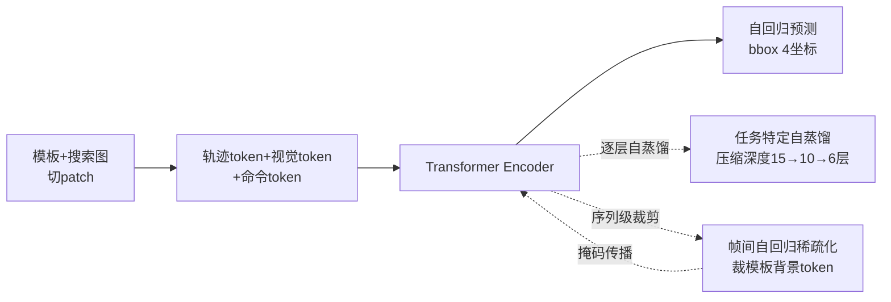

# FARTrack: Fast Autoregressive Visual Tracking with High Performance

**会议**: ICLR 2026  
**OpenReview**: [https://openreview.net/forum?id=lq7Zfr8kAS](https://openreview.net/forum?id=lq7Zfr8kAS)  
**代码**: [https://github.com/MIV-XJTU/FARTrack](https://github.com/MIV-XJTU/FARTrack)  
**领域**: 视觉目标跟踪 / 高效模型  
**关键词**: 视觉跟踪, 自回归, 自蒸馏, Token稀疏化, 实时跟踪, ViT  

## 一句话总结
FARTrack 把 ARTrack 系列的自回归生成式跟踪框架做"瘦身"，用**任务特定自蒸馏**逐层压缩模型深度、用**帧间自回归稀疏化**裁掉模板里的背景冗余 token，在 GOT-10k 上 70.6% AO 的同时把速度拉到 GPU 343 FPS / CPU 121 FPS，兼顾了高性能与实时性。

## 研究背景与动机
**领域现状**：视觉目标跟踪（VOT）追求在视频序列里连续定位任意目标，速度和精度是两个核心指标。ARTrack 系列把目标轨迹建模成离散 token 序列、用 Transformer Encoder 自回归地预测坐标，因为强调了轨迹的时序性而精度很高，但它"层深参数多、对带宽不友好"，在边缘设备上跑不快。

**现有痛点**：业界平衡速度-精度的两条主流路线都有硬伤。其一是**跨层蒸馏**（cross-layer distillation），让浅层 student 模仿深层 teacher 的视觉特征——但它依赖**手工指定的师生层对应关系**，没有先验时这种人为配对会破坏特征提取的层级结构，而且蒸馏目标盯着当前帧的视觉特征、丢掉了轨迹序列的时序信息。其二是**运行时 token 稀疏化**（runtime sparsification），推理时逐步丢弃不重要的 token——但"判断丢哪些 token"本身要额外算力，反而拖慢速度，且只优化当前帧、得不到时序全局最优解。

**核心矛盾**：既想保住自回归框架对时序信息的刻画能力，又要把深而重的模型压薄、把模板冗余裁掉，还不能引入额外运行时开销。

**本文目标**：提出一个快且强的多模板自回归跟踪框架，让同一个模型在 GPU/CPU/NPU 上都能高效执行。

**核心idea**：**自蒸馏取代跨层蒸馏 + 序列级稀疏取代运行时稀疏**——蒸馏只对"任务特定 token（轨迹序列）"做逐层自蒸馏，让相邻层互为师生从而绕开手工配对并保留时序；稀疏化把模板裁剪做成自回归传播的序列级后处理，一次决策传给后续所有帧，零额外运行时成本。

## 方法详解

### 整体框架
FARTrack 沿用 ARTrack 的生成式底座：把所有模板和搜索图切 patch、投影成 token，并用共享词表把跨帧目标位置映射到统一坐标系形成**轨迹 token**，再拼上视觉 token 和四个**命令 token**（代表待预测的 bbox 四个坐标）一起喂进 Transformer Encoder，由前序轨迹 token 自回归地驱动后续坐标的生成。为提升精度采用**多模板**设计配合线性更新策略，并强制更新后的模板集合始终包含第一帧和前一帧，防止遮挡/消失时丢时序。在这个底座上叠两个正交模块：任务特定自蒸馏负责"压层降深"，帧间自回归稀疏化负责"裁模板背景"。

### 关键设计

**1. 任务特定自蒸馏（Task-Specific Self-Distillation）：相邻层互为师生，让轨迹时序"逆向回灌"压薄模型。** 跨层蒸馏要人工指定哪个 student 层对哪个 teacher 层，配错就破坏层级结构。FARTrack 干脆让**第 n-1 层当 student、第 n 层当 teacher**，建立逐层（layer-by-layer）的自蒸馏链条，天然回避手工配对。蒸馏对象不是整张视觉特征，而是只挑代表轨迹序列的**任务特定 token**：student 层通过最小化 KL 散度去拟合 teacher 层的轨迹序列特征。这样轨迹的时序信息沿层级反向传播，模型可以一路蒸馏到很浅（15 层→10 层→6 层）而精度几乎不掉。消融里和 MixFormerV2 的 deep-to-shallow 手工删层（10 层删 [0,3,6,9,12]）对比，layer-by-layer 在 10 层下 AO 69.9% vs 67.8%，验证了"自配对"避免语义错配的价值。

**2. 帧间自回归稀疏化（Inter-frame Autoregressive Sparsification）：把模板裁剪做成序列级一次决策、自回归传播。** 模板图里除了目标还混着持续的背景和噪声。FARTrack 在注意力层算完之后，取**模板 token 对搜索 token 和四个命令 token 的注意力权重**——前者反映模板与搜索区的相关性、后者反映与预测坐标的相关性——把这两组权重直接相加，按预设的 token 保留率保留权重最大的部分，得到模板 token 掩码（论文默认保留率 75%）。关键在于：当前帧算出的稀疏化结果会被**保存并以自回归方式传播给后续帧**，从而学到一个"时序全局最优"的稀疏策略，而不是每帧重新判断。这就把运行时稀疏的额外开销彻底省掉，速度更快、性能反而更稳。一个细节是训练时被 mask 的 token 要排除在 LayerNorm 统计外（只对有效 token 归一化），避免统计偏移污染缩放/平移；推理时模板已稀疏完成，LayerNorm 照常对全部 token 施加。

**3. 三阶段训练 + 复合损失：先帧级预训练，再蒸馏压层，最后稀疏加速。** 训练分三步走——先在 COCO2017 做帧级预训练，再做任务特定自蒸馏训练把模型压薄，最后做帧间自回归稀疏化训练进一步提速；同时延续 ARTrack 的帧级+序列级训练范式。总损失为 $\mathcal{L} = \mathcal{L}_{CE} + \lambda_1 \mathcal{L}_{SIoU} + \lambda_2 \mathcal{L}_{KL}$，其中 $\mathcal{L}_{CE}$ 是坐标 token 的交叉熵、$\mathcal{L}_{SIoU}$ 用 SIoU loss 更好地刻画预测框与真值框的空间相关性、$\mathcal{L}_{KL}$ 是自蒸馏的 KL 散度。消融显示轨迹序列损失（$\mathcal{L}_{traj}=\mathcal{L}_{CE}+\mathcal{L}_{SIoU}$）和 KL 损失缺一不可：去掉前者深层特征退化，去掉后者浅层特征"崩塌"导致跟踪能力灾难性下降。

## 实验关键数据

### 主实验表格
GOT-10k / TrackingNet / LaSOT 上与 SOTA 高效跟踪器对比（FPS 越高越快，AO/AUC 越高越准）：

| 方法 | GPU FPS | CPU FPS | GOT-10k AO(%) | TrackingNet AUC(%) | LaSOT AUC(%) |
|------|---------|---------|---------------|--------------------|--------------|
| HiT-Base | 116 | 30 | 64.0 | 80.0 | 64.6 |
| MixformerV2 | 133 | 31 | 61.9 | 75.8 | 60.6 |
| PromptVT | 104 | 30 | 68.2 | 78.0 | 63.7 |
| AsymTrack-T | 145 | 55 | 62.3 | 76.2 | 60.8 |
| AsymTrack-B | 135 | 32 | 67.7 | 80.0 | 64.7 |
| **FARTrackpico** | **343** | **121** | 62.8 | 75.6 | 58.6 |
| **FARTracknano** | 210 | 77 | 69.9 | 79.1 | 61.3 |
| **FARTracktiny** | 135 | 53 | **70.6** | **80.7** | 63.2 |

- FARTracktiny（15 层）AO 70.6% 超 AsymTrack-B 2.9%，GPU 速度持平、CPU 53 FPS；
- FARTrackpico（蒸到 6 层）AO 62.8% 超 MixFormerV2-S 0.9%，但 GPU 速度近 3 倍、CPU 近 4 倍。

模型变体（ViT-Tiny backbone，输入 [112,224]，5 模板）：

| 变体 | 层数 | MACs(G) | Params(M) |
|------|------|---------|-----------|
| FARTracktiny | 15 | 2.65 | 6.82 |
| FARTracknano | 10 | 1.78 | 4.59 |
| FARTrackpico | 6 | 1.08 | 2.81 |

### 消融实验表格
蒸馏方式 & 稀疏方式（GOT-10k）：

| 实验 | 配置 | AO(%) | 备注 |
|------|------|-------|------|
| 蒸馏对比 | layer-by-layer (10层) | **69.9** | 本文 |
| 蒸馏对比 | deep-to-shallow (10层) | 67.8 | MixFormerV2 式手工删层 |
| 稀疏对比 | 序列级 (本文) | **70.6** | 2.65G MACs / GPU 135 |
| 稀疏对比 | 运行时 | 69.5 | 3.14G MACs / GPU 114（更慢更差） |

Token 保留率敏感性（GOT-10k）：

| 保留率 | MACs(G) | CPU FPS | GPU FPS | AO(%) |
|--------|---------|---------|---------|-------|
| 100% | 2.99 | 49 | 128 | 70.0 |
| **75%** | 2.65 | 53 | 135 | **70.6** |
| 50% | 2.35 | 56 | 139 | 68.3 |
| 25% | 2.01 | 58 | 140 | 67.3 |
| 10% | 1.82 | 63 | 141 | 62.3 |

### 关键发现
- **75% 是甜点**：裁掉 25% 模板 token 不仅没掉点，AO 反而从 100% 的 70.0% 升到 70.6%，说明裁的确实是背景噪声；继续往下到 50% 才开始明显掉点。
- **序列级稀疏全面优于运行时稀疏**：MACs 更低（2.65G vs 3.14G）、GPU 更快（135 vs 114）、AO 更高（70.6 vs 69.5），印证"省掉运行时判断开销 + 时序全局最优"双重收益。
- **蒸馏只能蒸轨迹**：消融显示直接蒸搜索/模板或联合蒸视觉特征会破坏层级结构、全层掉点，唯有蒸轨迹序列因其自回归特性能把知识从深层顺畅传到浅层。
- **跨设备一致快**：pico 在 NPU（Ascend 310B）也有 101 FPS，证明压层+稀疏带来的加速不挑硬件。

## 亮点与洞察
- **把"压缩"和"裁剪"都对齐到自回归的时序本质**：自蒸馏只动轨迹 token、稀疏化结果沿帧自回归传播，两个模块都服务于"保住时序信息"这条主线，而不是各自为政的工程 trick。
- **自蒸馏的"自配对"巧思**：让相邻层互为师生，一举绕开跨层蒸馏最头疼的手工层对齐问题，思路简单但消除了语义错配这个性能杀手。
- **稀疏化变成零成本后处理**：传统稀疏在推理时反复算"丢谁"，FARTrack 把它前置成训练阶段学好、推理时直接复用的固定掩码，从根上消除了"为省算力先花算力"的悖论。
- **一套框架三档变体**：靠蒸馏层数（15/10/6）就能从高精度档滑到极速档，部署时按设备算力自由取舍，工程实用性强。

## 局限与展望
- **精度-速度仍有取舍**：pico 极速档（343 FPS）的 AO 62.8% 明显低于 tiny 的 70.6%，在 LaSOT 长时跟踪上 pico AUC 仅 58.6%，极端压缩下长时鲁棒性下降。
- **保留率是固定超参**：75% 是在 GOT-10k 上调出的全局值，面对目标占比差异极大的场景（小目标/大目标）可能不是最优，自适应保留率值得探索。
- **依赖 ARTrack 底座**：方法本质是对 ARTrack/ARTrackV2 的高效化改造，框架创新性受限于原生成式范式；VastTrack 上 tiny 仅与 MixFormerV2-B 持平，超大类别泛化仍有空间。
- **蒸馏与稀疏分阶段训练**：三阶段串行训练流程较长，端到端联合优化能否进一步提升尚待验证。

## 相关工作与启发
- **ARTrack / ARTrackV2**（自回归生成式跟踪的直接前身）：把轨迹建模成离散 token 序列、用共享词表自回归预测坐标，FARTrack 继承其时序刻画能力并解决其"深重慢"的部署痛点。
- **MixFormerV2 / AVTrack**（跨层蒸馏跟踪器）：代表了手工层配对的 deep-to-shallow 蒸馏路线，FARTrack 用自蒸馏证明了"自配对"更优。
- **DynamicViT / OSTrack**（token 稀疏化）：前者用轻量预测器逐步剪 token、后者早期剔除背景区域，都属运行时稀疏；FARTrack 把它升级为序列级后处理。
- **启发**：对任何"自回归/时序敏感"的高效化任务，与其在视觉特征层面做压缩，不如把压缩/裁剪决策对齐到任务的时序本质上——让时序信息沿模型结构或帧序列传播，往往能在掉点更少的前提下拿到更大加速。

## 评分
- **新颖性**: ⭐⭐⭐⭐ —— 自蒸馏"相邻层自配对"和稀疏化"序列级自回归传播"两个改造都直击现有路线的结构性缺陷，思路清晰且自洽，虽建立在 ARTrack 底座上但组合方式有原创性。
- **实验充分度**: ⭐⭐⭐⭐ —— 7 个 benchmark + 三档变体 + GPU/CPU/NPU 三设备，蒸馏对象/损失/保留率/稀疏方式消融完整，速度-精度对比详实。
- **写作质量**: ⭐⭐⭐⭐ —— 动机-方法-实验逻辑顺畅，图示（蒸馏对比、框架图、精度曲线）到位，两个模块的设计动机讲得很透。
- **价值**: ⭐⭐⭐⭐ —— 边缘设备实时跟踪是强需求，343 FPS GPU / 121 FPS CPU 且开源，落地价值高；对自回归模型高效化也有方法论启发。

<!-- RELATED:START -->

## 相关论文

- [\[CVPR 2026\] Adaptive Capacity Autoregressive Visual Tracking](../../CVPR2026/video_understanding/adaptive_capacity_autoregressive_visual_tracking.md)
- [\[CVPR 2026\] SpikeTrack: High-performance and Energy-efficient Event-Based Object Tracking with Spiking Neural Network](../../CVPR2026/video_understanding/spiketrack_high-performance_and_energy-efficient_event-based_object_tracking_wit.md)
- [\[CVPR 2026\] Drift-Resilient Temporal Priors for Visual Tracking](../../CVPR2026/video_understanding/drift-resilient_temporal_priors_for_visual_tracking.md)
- [\[ICML 2026\] Unified Multimodal Visual Tracking with Dual Mixture-of-Experts](../../ICML2026/video_understanding/unified_multimodal_visual_tracking_with_dual_mixture-of-experts.md)
- [\[ICML 2026\] RELO: Reinforcement Learning to Localize for Visual Object Tracking](../../ICML2026/video_understanding/relo_reinforcement_learning_to_localize_for_visual_object_tracking.md)

<!-- RELATED:END -->
