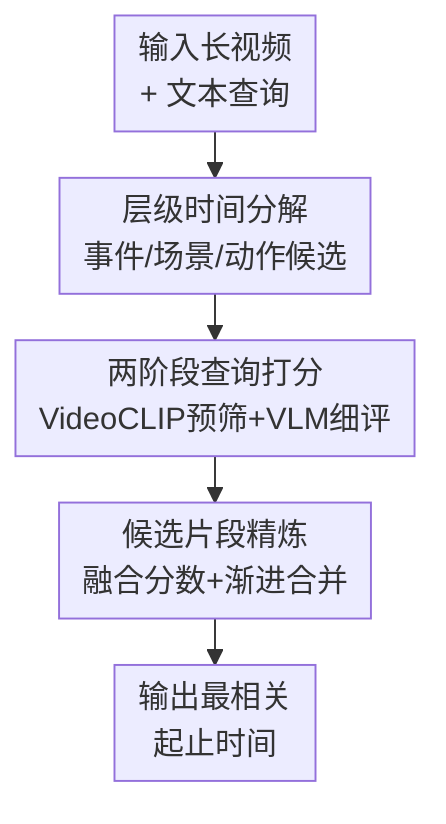

# HiTeA: Hierarchical Temporal Alignment for Training-Free Long-Video Temporal Grounding

**会议**: ICLR 2026  
**OpenReview**: [https://openreview.net/forum?id=vIecIscDJf](https://openreview.net/forum?id=vIecIscDJf)  
**代码**: https://github.com/camellia517/HiTea  
**领域**: 视频理解  
**关键词**: 长视频时序定位, 训练-free, 层级时间分解, 视频语言模型, 候选片段精炼  

## 一句话总结
HiTeA 用事件-场景-动作的层级时间分解为长视频生成多粒度候选片段，再用冻结的 VideoCLIP 与 Qwen2.5-VL 做查询条件匹配和候选精炼，在不做任何任务训练的前提下显著提升长视频 temporal grounding。

## 研究背景与动机
**领域现状**：视频时序定位（Video Temporal Grounding, VTG）要根据一句自然语言查询，在未裁剪视频里找出对应片段的起止时间。近年来强性能方法大多采用全监督训练，需要密集时间边界标注；另一类弱监督、无监督或零样本方法虽然减少标注，但往往仍要在目标任务或伪标签上训练模型。

**现有痛点**：长视频场景里，问题比短视频更难。真实视频通常包含大量冗余片段、重复动作、跨分钟的事件结构，以及只持续几秒的关键动作。如果用均匀采样或固定窗口扫描，长片段会稀释关键内容，短片段又缺上下文；如果把所有候选都交给 VLM 打分，计算成本会迅速失控。

**核心矛盾**：冻结 VLM 擅长判断片段里“发生了什么”，但并不天然知道“什么时候发生”。长视频 grounding 的关键不只是语义匹配，还要先把视频切成适合搜索的时间结构。没有显式时间脚手架时，VLM 的强语义能力会被候选质量和候选数量拖住。

**本文目标**：作者希望构建一个完全训练-free 的长视频 temporal grounding 框架：不依赖任务标注、不微调模型，同时能处理长视频里的粗粒度事件、镜头/场景变化和细粒度动作边界，并把候选数量压到 VLM 可以高效评估的范围内。

**切入角度**：HiTeA 的观察是，人类在长视频中找某个事件时不会从每一帧暴力扫描，而是先粗略定位相关事件，再缩小到场景和动作。论文把这种粗到细的搜索过程显式写进候选生成阶段，让冻结 VLM 只负责它更擅长的语义判别。

**核心 idea**：用多层级时间分解给长视频建立事件-场景-动作候选结构，再用冻结视频语言模型进行查询条件打分与候选合并，从而把训练-free VLM 从“盲扫长视频”变成“在结构化候选里精确检索”。

## 方法详解
### 整体框架
HiTeA 输入一段未裁剪视频和一条文本查询，输出与查询最匹配的时间区间。它先用冻结特征提取器构造三条时间信号：CLIP/ViT 特征刻画事件级语义变化，DINOv2 特征刻画场景或布局变化，RAFT 光流刻画动作级运动变化；随后 Hierarchical Temporal Decomposition（HTD）把这些信号转成事件、场景、动作三个粒度的候选边界。

得到候选后，HiTeA 不直接把所有片段交给大 VLM。它先用 VideoCLIP 做轻量预筛，每个层级保留少量高相关候选；再用 Qwen2.5-VL 对这些候选进行细粒度语义打分；最后 Candidate Refinement（CR）融合 VLM 分数与 VideoCLIP 分数，并跨层级渐进合并相邻或重叠片段，输出排名最高的时间区间。

### 关键设计
**1. 层级时间分解：把长视频先切成适合 VLM 检索的多粒度候选**

长视频的难点在于目标片段可能是一个粗事件，也可能只是一个瞬时动作。HiTeA 因此不使用单一尺度切分，而是从三类冻结视觉特征里构造互补的相似度曲线。给定帧 $f_t$，论文分别提取 $v_t^{vit}=\phi_{ViT}(f_t)$、$v_t^{dino}=\phi_{DINO}(f_t)$ 和 $v_t^{flow}=\phi_{RAFT}(f_t,f_{t+1})$。ViT/CLIP 特征和自然语言语义更接近，适合看长程事件变化；DINOv2 对画面结构和视角变化敏感，适合检测场景切换；RAFT 光流直接反映短时运动，适合定位动作边界。

三条时间信号分别写成 $s_t^{event}$、$s_t^{scene}$、$s_t^{action}$。其中事件级相似度不是简单比较相邻帧，而是比较当前帧 ViT 特征与当前段历史平均特征 $\bar v_{t-1}^{vit}$：$s_t^{event}=\frac{v_t^{vit}\cdot \bar v_{t-1}^{vit}}{\|v_t^{vit}\|\|\bar v_{t-1}^{vit}\|}$，这样能避免逐帧特征抖动导致的伪边界。场景级相似度用相邻 DINO 特征余弦相似度，动作级相似度用负光流强度 $s_t^{action}=-\|v_t^{flow}\|_2$，运动突变处会产生更低的相似度。三条曲线平滑后，事件层用局部低谷找边界，场景和动作层用 PELT 变点检测找非线性变化。

层级关系不是事后口头解释，而是在边界集合里被显式维护。对长视频，HiTeA 用合并函数 $M(\cdot)$ 把高层边界注入低层边界：若某个事件边界附近 $\alpha$ 秒内已有低层边界，就用高层边界替换最近点；否则插入新边界。这个过程先把事件边界合进场景边界，再把场景边界合进行动边界，使细粒度动作候选仍然对齐到更大的事件结构。对短视频，论文会关闭这种 Hierarchical Merging，因为短视频本身层级不深，强行套层级反而会损失候选多样性。

**2. 两阶段查询打分：让重 VLM 只评估少量高价值片段**

训练-free 方法最大的工程瓶颈是 VLM 推理次数。HTD 会生成多粒度候选，但如果每个候选都用 Qwen2.5-VL 打分，长视频仍然很贵。HiTeA 因此先用 VideoCLIP 做粗筛：对每个候选片段 $(t_s,t_e)$ 与查询 $Q$ 计算 $s_{clip}$，相邻片段若分数差 $|s_{clip}^i-s_{clip}^j|<\beta$ 就合并，以减少碎片化；然后每个层级只保留 top-$k$ 候选，默认三个层级各取 3 个，最多把 9 个候选交给 VLM。

第二阶段才调用冻结 Qwen2.5-VL 得到 $s_{vlm}\in[0,1]$。这里 VideoCLIP 和 VLM 的角色分工很清楚：VideoCLIP 便宜、连续、适合粗排和去掉明显无关片段；Qwen2.5-VL 更强、能理解复杂查询，但只被用于少量候选。这样设计的实际意义很大：Ego4D-NLQ 的平均候选数从 146.68 个降到 9 个，TACoS 从 38.19 个降到 8.92 个，训练-free grounding 才能在长视频上变得可运行。

**3. 候选片段精炼：用查询相关性跨层级修正边界，而不是简单 NMS**

HTD 生成的候选是视频结构导向的，VLM 打分则是查询导向的，两者之间仍可能错位。例如一个查询描述的语义事件可能横跨一个高分动作片段和相邻场景片段；也可能短动作本身分数高，但缺少上下文导致 VLM 对边界不稳定。HiTeA 因此没有直接选最高分候选，也没有用通用 NMS，而是设计了 Candidate Refinement 模块。

CR 先做分数融合：$s_{final}=\lambda s_{vlm}+(1-\lambda)s_{clip}$。论文把 $\lambda$ 设为 0.99，让 VLM 的语义判断主导排序；同时保留 1% 的 VideoCLIP 分数作为 tie-breaker，因为 VLM 经常给多个候选相同或近似离散的置信分数。这个细节很实用：它不改变语义主序，但能在多个候选都被 VLM 打成 0.8 或 0.9 时提供连续区分。

随后 CR 做渐进合并。若两个候选来自相同或相邻层级、时间上接近或重叠，并且 $s_{final}$ 差异小于阈值 $\theta$，就把它们合成新片段；新边界按分数加权平均，高分片段对边界影响更大，新分数也由组成片段加权得到。这个过程类似查询条件下的凝聚式聚类：HTD 提供结构合理的片段积木，CR 根据当前查询把语义上应当连在一起的积木重新拼成最终答案。

### 一个完整示例
以论文附录里的 TACoS 查询 “A large plate is removed for the mango.” 为例，目标片段非常短，真值是 $[238,248]$ 秒。如果只看长视频整体，这个动作很容易被前后烹饪流程淹没。HTD 首先产生多个层级候选，例如事件级的长片段 $[57,165]$、$[238,321]$，以及动作级的短片段 $[238,248]$、$[248,309]$ 等。

VideoCLIP 先给这些片段做粗筛，保留与“拿走大盘子”语义相关的一组候选。Qwen2.5-VL 进一步评估后，短片段 $[238,248]$ 得到明显更高的语义分数，而附近的长片段 $[248,309]$ 虽然也有一定相关性，但包含更多无关动作。CR 融合分数并重新排序后，把 $[238,248]$ 作为最高置信候选输出。这个例子体现了 HiTeA 的关键优势：粗层级帮助不漏掉相关区域，细层级帮助精确边界，VLM 负责确认哪一个候选真正匹配查询。

### 损失函数 / 训练策略
HiTeA 没有任务训练，也没有可学习损失函数。所有视觉编码器、VideoCLIP 和 Qwen2.5-VL 都保持冻结，算法只在推理阶段执行特征提取、变点检测、候选筛选、VLM 打分和候选精炼。

关键超参包括：长视频启用 Hierarchical Merging，短视频关闭；层级合并容忍度 $\alpha=5$ 秒；同层边界最小间隔约 2 秒；每个层级保留 top-$k=3$ 候选；VideoCLIP 相邻片段合并阈值 $\beta$ 在敏感性实验中较稳定，主设置使用 0.1；最终融合权重 $\lambda=0.99$；CR 中候选边界接近阈值约 1 秒，分数差阈值约 0.14。

## 实验关键数据

### 主实验
长视频结果最能体现 HiTeA 的定位。TACoS 和 Ego4D-NLQ 都是长视频 temporal grounding 场景，其中 Ego4D-NLQ 更接近第一视角长视频，TACoS 是长烹饪视频。HiTeA 在训练-free 设置下明显超过已有零样本/训练-free 方法，并且在 Ego4D-NLQ 的 mIoU 上甚至超过表中全监督基线。

| 数据集 | 指标 | 本文 HiTeA | 之前最强零样本/训练-free 对比 | 提升 |
|--------|------|------------|-------------------------------|------|
| Ego4D-NLQ | R@0.3 | 10.39 | UniTime-Zero 14.67? / 训练-free首个完整报告需谨慎比较 | 指标口径下 HiTeA 提供完整训练-free长视频结果 |
| Ego4D-NLQ | mIoU | 8.12 | UniTime-Zero 10.18（需训练）/ 全监督 UniVTG 4.91 | 相比全监督 UniVTG +3.21 |
| TACoS | R@0.1 | 44.94 | Luo et al. 27.49 | +17.45 |
| TACoS | R@0.3 | 29.08 | Mr.BLIP 24.59（需训练）/ Luo et al. 11.20 | 相比 Luo et al. +17.88 |
| TACoS | R@0.5 | 16.10 | Luo et al. 5.57 | +10.53 |
| TACoS | mIoU | 19.79 | Mr.BLIP 17.94（需训练） | +1.85 |

短视频上，HiTeA 不是只靠长视频结构“特化取胜”。在 Charades-STA、ActivityNet-Captions 和 QVHighlights 中，它仍然保持强泛化，尤其在 Charades-STA 的 R@0.3 和 mIoU、QVHighlights 的 mAP 指标上超过多数零样本方法。

| 数据集 | 指标 | 本文 HiTeA | 强零样本基线 | 提升 |
|--------|------|------------|--------------|------|
| Charades-STA | R@0.3 | 69.62 | TFVTG 67.04 | +2.58 |
| Charades-STA | mIoU | 46.29 | TFVTG 44.51 | +1.78 |
| ActivityNet-Captions | R@0.3 | 54.46 | TFVTG 49.34 | +5.12 |
| ActivityNet-Captions | mIoU | 37.93 | TFVTG 34.10 | +3.83 |
| QVHighlights Test | R1@0.5 | 62.3 | Moment-GPT 58.3 | +4.0 |
| QVHighlights Test | mAP@avg | 37.0 | Moment-GPT 35.0 | +2.0 |

### 消融实验
模块消融显示，HTD 和 CR 是互补关系：HTD 提供更好的候选结构，CR 则用查询语义修正边界。只用均匀分割时，TACoS mIoU 只有 14.87；加入完整三层 HTD 后提升到 16.99；再加入 CR 后达到 19.79。

| 配置 | TACoS mIoU | Charades-STA mIoU | 说明 |
|------|------------|-------------------|------|
| Uniform segmentation, w/o CR | 14.87 | 35.07 | 均匀切分，候选质量最低 |
| Event only, w/o CR | 15.64 | 41.28 | 粗事件有较好覆盖，但边界不够细 |
| Scene only, w/o CR | 13.01 | 40.35 | 对烹饪/室内活动这类少场景切换数据帮助有限 |
| Action only, w/o CR | 13.73 | 39.83 | 对细边界有帮助，但容易缺少上下文 |
| Event + Scene + Action, w/o CR | 16.99 | 41.61 | 多粒度候选互补，长视频收益更明显 |
| Uniform segmentation, w/ CR | 16.67 | 43.93 | CR 可修正边界，但受限于初始候选 |
| Event + Scene + Action, w/ CR | 19.79 | 46.29 | 完整 HiTeA，候选结构和查询精炼共同起作用 |

VideoCLIP 预筛的效率实验也很关键。它把大部分候选挡在 VLM 之前，尤其长视频收益最明显。

| 数据集 | 过滤前候选数 | 过滤后候选数 | 减少比例 |
|--------|--------------|--------------|----------|
| Charades-STA | 9.75 | 8.17 | 16.2% |
| ActivityNet-Captions | 22.26 | 4.59 | 79.4% |
| TACoS | 38.19 | 8.92 | 76.6% |
| Ego4D-NLQ | 146.68 | 9.0 | 93.9% |

### 关键发现
- HTD 的收益随视频长度和结构复杂度上升。TACoS 上三层 HTD 明显优于单层候选，而短视频上完整 HTD 的增益较小，说明长视频更需要显式层级结构。
- CR 是全局稳定增益来源。即便初始候选来自均匀分割，CR 也能提升 mIoU；当它与三层 HTD 结合时，TACoS 和 Charades-STA 都达到最好结果。
- Hierarchical Merging 需要按视频长度自适应。短视频实验中关闭 HM 更好：Charades-STA mIoU 从 45.09 提到 46.29，ActivityNet-Captions 从 37.30 提到 37.93；这说明短视频里保持多源边界多样性比强制层级一致更重要。
- 参数敏感性相对温和。$\beta$ 在 0.2 到 0.6 间表现稳定，$\lambda=0.99$ 最好，说明最终排序主要依赖 VLM 语义判断，但 VideoCLIP 的连续分数对打破 VLM 离散置信度并非可有可无。

## 亮点与洞察
- HiTeA 最有价值的地方，是把“训练-free”从简单调用大模型推进到结构化推理。论文没有让 VLM 直接面对长视频的海量时间窗口，而是先用视频自身的事件、场景、动作变化建立搜索空间。
- 事件、场景、动作三种信号的选择很朴素但有效。CLIP/ViT 管语义，DINO 管布局，RAFT 管运动，每个特征都对应一种时间边界来源，避免了用单一 embedding 解释所有粒度变化。
- Candidate Refinement 比普通后处理更贴合任务。它不是简单删除重叠候选，而是承认查询语义可能跨越多个结构片段，再根据分数相近和时间接近来重新拼接边界。
- 论文的部署思路也很清晰：重特征提取可以离线缓存，在线阶段只运行 VideoCLIP 和少量 VLM 调用。对真实长视频检索系统来说，这比端到端微调一个大模型更容易落地。
- 这个思路可以迁移到其他视频任务。比如 dense video captioning 可以先用类似 HTD 找结构单元，再让 VLM 为少量关键单元生成描述；视频摘要也可以用层级候选和查询相关性选择片段。

## 局限与展望
- HiTeA 的三层层级是人工指定的。事件-场景-动作对许多视频有效，但并不保证适合所有领域，例如体育战术、监控异常、教学视频可能需要不同的时间层级。
- 方法依赖多个冻结模型，系统复杂度不低。虽然在线推理被压缩到少量 VLM 调用，但离线阶段仍要跑 ViT、DINO、RAFT 等特征，RAFT 光流在运行时间里尤其重。
- VLM 分数仍然受 prompt 和候选长度影响。论文用 CR 缓解长短片段打分不稳，但没有从根本上解决 VLM 对时间边界不敏感的问题。
- 对短视频，强层级结构的必要性有限。作者已经通过关闭 HM 做自适应，但未来可以进一步学习或自动选择分解深度，而不是按数据集长短手动开关。
- 实验主要验证 temporal grounding，尚未证明 HTD 是否能直接服务更复杂的视频推理任务。后续可探索把层级候选作为通用视频索引结构，用于长视频问答、事件检索和多查询交互式搜索。

## 相关工作与启发
- **vs TFVTG**: TFVTG 同样是 training-free temporal grounding，但更依赖预训练模型和查询分解/匹配策略，对长视频显式时间层级建模不足。HiTeA 的优势在于先把视频切成有层次的候选，再让 VLM 在少量候选里判断。
- **vs Luo et al. 2024**: 这类 frozen VLM 方法用边界感知或候选策略做零样本 moment retrieval，但长视频 TACoS 上 R@0.1 明显低于 HiTeA。差别主要来自 HiTeA 的 HTD 和 CR：前者减少漏检与冗余，后者根据查询重新合并跨层级片段。
- **vs UniTime-Zero**: UniTime-Zero 在部分长视频指标上很强，但属于需要训练的零样本方法。HiTeA 完全不训练，强调用冻结模型和结构化推理获得可迁移性能。
- **vs 全监督 VTG 方法**: 2D-TAN、Moment-DETR、UniVTG 等方法依赖时间边界标注，适合数据充分的闭集任务；HiTeA 牺牲了端到端学习的拟合能力，换来无需标注、无需重训和跨数据集部署的灵活性。

## 评分
- 新颖性: ⭐⭐⭐⭐☆ 把层级时间分解、轻量预筛和 VLM 精评组合成训练-free 长视频 grounding 框架，思路清楚且针对长视频痛点。
- 实验充分度: ⭐⭐⭐⭐☆ 覆盖长短视频多个基准、模块消融、预筛效率、参数敏感性和运行时间分析，但部分零样本/训练-free基线的监督口径需要读者仔细区分。
- 写作质量: ⭐⭐⭐⭐☆ 方法图和消融逻辑比较完整，附录解释了两种 merging 的差异；个别表格里的对比方法命名略不完整，阅读时需要回查引用。
- 价值: ⭐⭐⭐⭐⭐ 对长视频检索和训练-free 视频理解很有实践价值，尤其适合标注昂贵、视频可离线预处理、查询在线变化的应用场景。

<!-- RELATED:START -->

## 相关论文

- [\[CVPR 2026\] HieraMamba: Video Temporal Grounding via Hierarchical Anchor-Mamba Pooling](../../CVPR2026/video_understanding/hieramamba_video_temporal_grounding_via_hierarchical_anchor-mamba_pooling.md)
- [\[ICLR 2026\] OmniSTVG: Toward Spatio-Temporal Omni-Object Video Grounding](omnistvg_toward_spatio-temporal_omni-object_video_grounding.md)
- [\[ICLR 2026\] A Training-Free Framework for Long Video Understanding via Video-Query-Options Similarity](a_training-free_framework_for_long_video_understanding_via_video-query-options_s.md)
- [\[CVPR 2026\] CVA: Context-aware Video-text Alignment for Video Temporal Grounding](../../CVPR2026/video_understanding/cva_context-aware_video-text_alignment_for_video_temporal_grounding.md)
- [\[CVPR 2025\] Temporal Alignment-Free Video Matching for Few-Shot Action Recognition](../../CVPR2025/video_understanding/temporal_alignment-free_video_matching_for_few-shot_action_recognition.md)

<!-- RELATED:END -->
