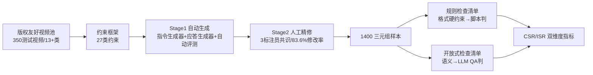

# IF-VidCap: Can Video Caption Models Follow Instructions?

**会议**: ICLR 2026  
**OpenReview**: [https://openreview.net/forum?id=lBXJexaC8a](https://openreview.net/forum?id=lBXJexaC8a)  
**代码**: [https://if-vidcap.github.io/](https://if-vidcap.github.io/)  
**领域**: 视频理解 / 视频描述 / 指令遵循评测  
**关键词**: 可控视频描述, 指令遵循, MLLM 评测, Benchmark, 约束满足率  

## 一句话总结
本文提出 IF-VidCap——首个面向"可控视频描述"的指令遵循评测基准，含 1,400 条平均带 6 个约束的复合指令，用"格式正确性 + 内容正确性"双维度自动评测协议系统性测了 26 个 MLLM，发现专门做密集描述的模型在指令约束下反而打不过通用 MLLM。

## 研究背景与动机
**领域现状**：MLLM 在视频描述上已经很强，但下游应用（视频生成的结构化字幕、视频编辑的定向描述、内容创作的风格化文案）真正需要的是"按用户指令产出受控描述"，而不是一股脑生成穷举式的全量描述。

**现有痛点**：现有多模态评测要么是 QA、要么是传统视频描述基准，后者只盯着描述的准确性和全面性打分，几乎不考核输出格式、长度、特定内容要求/禁止这类实用约束。语言领域成熟的指令遵循评测范式（IFEval、CFBench、ComplexBench 等）一直局限在纯文本任务里，没迁到视频这个基础任务上。

**核心矛盾**：模型"强感知能力"与"对复杂用户指令的弱遵循度"之间存在鸿沟——可控视频描述不只要看懂画面，还要把推理和"受约束生成"耦合起来，而这正是现有基准测不出来的盲区。

**本文目标**：建立一个能同时考核指令保真度与语义质量的视频描述基准，量出主流 MLLM 在复合约束下的真实差距。

**核心 idea**：**[Video-Instruction-Checklist 三元组]** 把每条样本组织成"视频 + 复合指令 + 可执行检查清单"，并据此设计**[规则 + LLM 混合评测]**——格式硬约束交给规则脚本判，语义内容交给 LLM 用 QA 形式判，从而把"格式正确性"和"内容正确性"拆成两个可独立统计的维度。

## 方法详解

### 整体框架
IF-VidCap 由三块拼成：先从 27 类约束类型的框架出发设计指令，再用"自动生成 + 人工精修"两阶段流水线把每条样本做成 Video-Instruction-Checklist 三元组，最后用复合评测协议（规则脚本 + LLM-QA）算出 CSR/ISR 指标。整套设计的目标是让"约束是否被满足"可被原子化、确定性地核验。

### 关键设计

**1. 27 类约束框架：把"可控描述"拆成可枚举的需求空间。** 作者先反向分析视频编辑、内容创作等下游应用到底需要哪些控制能力，蒸馏出一套覆盖 Format（结构、风格、Markdown、长度、大小写、语言）和 Content（实体、属性、事件、动作、电影语言、对比、抽象层级）的 27 类约束类型，作为整个基准的蓝图。每条指令平均挂 6 个约束，复杂样本可达 10 个以上，且约束之间存在链式、嵌套、选择等依赖关系，使得"约束数量"成为复杂度的可靠代理变量，专门用来探测组合推理能力。

**2. Video-Instruction-Checklist 三元组与双类检查清单：让评测原子化。** 每条样本的检查清单被拆成两类。规则类条目（rule-based）对应格式/结构这类硬约束，例如"无序列表以 `-` 开头""恰好两件主要服饰"，这些项由 LLM 先做内容抽取、再交给规则脚本做确定性核验，既吃到 LLM 处理复杂文本的适应性，又保住规则执行的确定性。开放式条目（open-ended）对应语义保真，设计成基于检索的 QA：用 true/false 题让 LLM 直接判断描述的语义对错，用多选题让 LLM 从描述里选出可推断的事实，所有答案都对齐人工标注的 ground truth。一个约束可挂多个 QA 以控制核验粒度。数据由两阶段流水线产出，人工精修阶段修改率高达 83.6%，三名标注员需达成共识才录用样本，保证清单质量。

**3. CSR/ISR 双指标与规则/开放式拆分：把格式能力与内容能力分开量。** 评测用两个核心指标：约束满足率 CSR 在约束粒度上平均，指令满足率 ISR 要求一条指令的所有约束全部满足才算分，公式为

$$\text{CSR}=\frac{1}{m}\sum_{i=1}^{m}\frac{1}{n_i}\sum_{j=1}^{n_i}s_i^{j},\qquad \text{ISR}=\frac{1}{m}\sum_{i=1}^{m}s_i$$

其中 $s_i^j=1$ 表示第 $i$ 条指令的第 $j$ 个约束被满足，$s_i=1$ 表示第 $i$ 条指令所有约束都被满足，$m$ 为指令总数，$n_i$ 为第 $i$ 条指令的约束数。在此之上再按约束类别细分出 Rule-Based CSR/ISR（只看格式约束，反映格式控制力）和 Open-Ended CSR/ISR（只看内容约束，反映多模态理解力），从而把"会排版"和"看得懂"这两种能力解耦开来分别诊断。

**4. 配套训练集与 IF-Captioner-Qwen：证明能力可迁移。** 为说明指令遵循能力可被注入，作者另建了一套与测试集生成方式刻意不同的训练集：从 Vript、ShareGPT4Video 等收 11K 高质量视频-描述对，用"response-to-instruction"思路，把已有 caption 当作视频内容的文本代理，让 DeepSeek-V3.1 据约束框架反向合成多样指令，最终扩成 46K 视频-指令-应答三元组，用来微调 Qwen2.5-VL-7B-Instruct，得到 IF-Captioner-Qwen。

## 实验关键数据

### 主实验表格（节选，Overall / Rule-based / Open-ended 的 ISR/CSR，%）

| 模型 | 参数 | Overall ISR | Overall CSR | Rule ISR | Open ISR |
|---|---|---|---|---|---|
| Human | — | 31.89 | 75.57 | 78.25 | 33.93 |
| Gemini-2.5-Pro | — | 27.83 | 74.53 | 74.35 | 35.22 |
| GPT-4o | — | 22.90 | 70.74 | 69.20 | 30.94 |
| Qwen3-VL-Instruct | 235B | 26.41 | 71.65 | 67.16 | 36.39 |
| InternVL-3.5 | 241B | 24.20 | 71.17 | 65.58 | 34.64 |
| Qwen2.5-VL-Instruct | 7B | 10.92 | 58.12 | 52.51 | 18.75 |
| Tarsier2（密集描述特化） | 7B | 1.40 | 26.05 | 9.30 | 9.91 |
| ARC-Hunyuan-Video（特化） | 7B | 2.32 | 27.78 | 12.23 | 9.11 |
| **IF-Captioner-Qwen (Ours)** | 7B | **14.63** | **62.82** | **59.13** | **21.27** |

### 消融实验表格（关键分析）

| 分析维度 | 设置 | 现象 |
|---|---|---|
| 约束数量 | 2-3 → 8-9 | CSR/ISR 随约束增多单调下降，复杂指令显著拖垮遵循能力 |
| 指令长度 | 0-19 → 60-79 词 | 同样随长度增加而下降 |
| 视频帧数 | 8/16/32/64/128 帧 | ISR/CSR 随帧数升高，64 帧峰值，128 帧反降（长序列容量受限） |
| 视频分辨率 | 168² → 784² | 固定 32 帧时，分辨率越高两指标越好 |
| 评测一致性 | GPT-5-mini/DeepSeek-V3.1/Qwen3-32B 当裁判 | 与人工标注一致性强，先进裁判模型尤甚 |

### 关键发现
- **专才打不过通才**：Tarsier2、ARC-Hunyuan-Video 这类专门做密集描述的模型，在指令约束下 ISR 跌到 1-2，远低于通用 MLLM，说明"描述丰富"与"指令保真"是两种能力。
- **闭源仍领先但差距在缩小**：顶级开源（Qwen3-VL-235B、InternVL-3.5-241B）已逼近 Gemini-2.5-Pro/GPT-4o。
- **格式比内容好控**：所有模型 Rule-based 分都明显高于 Open-ended，因为内容需要多模态推理而格式多是纯文本操作；人类靠检查与自我反思在格式控制上碾压所有模型，"Thinking"模型的 CoT 末尾常带格式自检也印证了这点。
- **微调有效**：IF-Captioner-Qwen 在 ISR/CSR 上大幅超过基座 Qwen2.5-VL-7B（ISR 10.92→14.63，CSR 58.12→62.82）。

## 亮点与洞察
- 把语言领域成熟的"指令遵循评测"范式系统性地搬到视频描述这一基础任务，填补了多模态评测里"只考全面性、不考可控性"的空白。
- "规则脚本 + LLM-QA"的混合核验既保住格式判定的确定性，又用 QA 把语义保真做成可原子化统计的检查项，比单纯 LLM-as-Judge 更可控、可复现。
- 把"格式能力"与"内容能力"解耦成两套指标，直接暴露了"会排版≠看得懂"，对诊断模型短板非常有信息量。
- 顺手用反向合成数据微调出 IF-Captioner-Qwen，把基准从"只测不练"推进到"测练闭环"。

## 局限与展望
- 人类基线由 10 名未经训练的本科生独立结果合并而成，开放式内容描述上略逊顶级模型，人类参考的强度有限。
- 评测重度依赖 LLM 裁判，虽测了三个裁判模型的一致性，但仍可能继承裁判模型自身的偏置。
- 训练集用"caption 当视频文本代理"反向合成指令，未真正消费视频信号，可能限制注入能力的上限；IF-Captioner-Qwen 绝对分仍不高。
- 作者指出未来方向应"描述丰富度"与"指令保真度"两手抓，如何在一个模型里融合二者仍是开放问题。

## 相关工作与启发
- **文本指令遵循基准**：IFEval、CELLO、InfoBench、FollowBench、SysBench、CFBench、ComplexBench——IF-VidCap 引入视频模态，并在规模（1,400）、复杂度（平均 6 约束）、内容多样性上做了扩展。
- **视频描述基准**：CapsBench、Dream-1K、CaReBench、VidCapBench——多以固定质量标准（准确/细节）评测，IF-VidCap 首次把视频描述从"密集描述"转向"细粒度指令遵循"，且视频更长（20.5s）。
- **启发**：可控生成评测正从"评质量"走向"评可控性"；混合"规则确定性 + LLM 适应性"是处理复合约束的务实路线，可迁移到图像、音频等其他模态的可控生成评测。

## 评分
- **新颖性**: ⭐⭐⭐⭐ 首个视频描述指令遵循基准，把文本 IF 范式系统性迁到视频并解耦双维度指标，定位清晰。
- **实验充分度**: ⭐⭐⭐⭐ 覆盖 26 个模型 + 人类基线，约束数/长度/帧数/分辨率/裁判一致性多维分析，并验证微调有效。
- **写作质量**: ⭐⭐⭐⭐ 动机—框架—指标—实验逻辑顺畅，图表（约束分类、统计分布、对比表）信息密度高。
- **价值**: ⭐⭐⭐⭐ 暴露"密集描述特化模型在指令约束下崩盘"这一反直觉现象，对视频描述模型的训练目标有明确指导意义。

<!-- RELATED:START -->

## 相关论文

- [\[CVPR 2026\] Time Blindness: Why Video-Language Models Can't See What Humans Can?](../../CVPR2026/video_understanding/time_blindness_why_video-language_models_cant_see_what_humans_can.md)
- [\[ICLR 2026\] Point Prompting: Counterfactual Tracking with Video Diffusion Models](point_prompting_counterfactual_tracking_with_video_diffusion_models.md)
- [\[ICLR 2026\] Video-LevelGauge: Investigating Contextual Positional Bias in Video Language Models](video-levelgauge_investigating_contextual_positional_bias_in_video_language_mode.md)
- [\[CVPR 2026\] SAIL: Similarity-Aware Guidance and Inter-Caption Augmentation-based Learning for Weakly-Supervised Dense Video Captioning](../../CVPR2026/video_understanding/sail_similarity-aware_guidance_and_inter-caption_augmentation-based_learning_for.md)
- [\[ICLR 2026\] ScaleLong: A Multi-Timescale Benchmark for Long Video Understanding](scalelong_a_multi-timescale_benchmark_for_long_video_understanding.md)

<!-- RELATED:END -->
