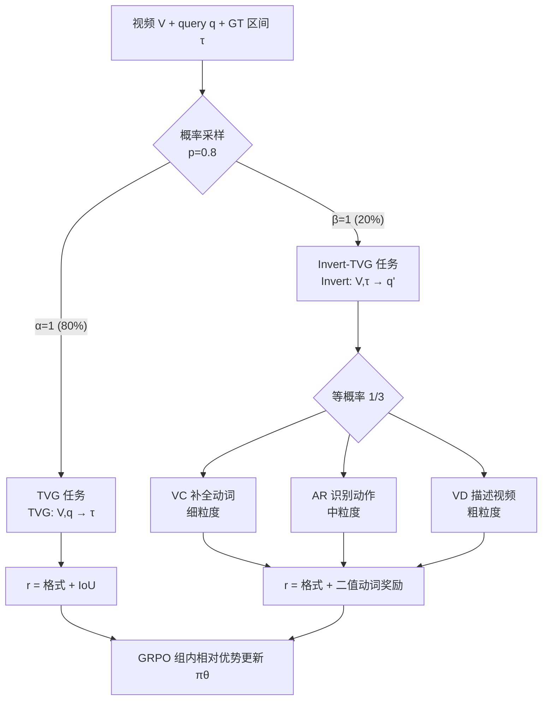

# Invert4TVG: A Temporal Video Grounding Framework with Inversion Tasks Preserving Action Understanding Ability

**会议**: ICLR 2026  
**OpenReview**: [https://openreview.net/forum?id=QQCrZXWG9s](https://openreview.net/forum?id=QQCrZXWG9s)  
**代码**: 随补充材料附带（待确认开源）  
**领域**: video_understanding  
**关键词**: 时序视频定位, 强化学习, GRPO, 动作理解, 自监督辅助任务  

## 一句话总结
针对时序视频定位（TVG）模型只优化 IoU 导致"动作理解能力退化"的问题，本文把 TVG 任务的输入输出反转，构造三个共享同一份标注的 Invert-TVG 辅助任务（补全动词 / 识别动作 / 描述视频），在 GRPO 强化学习里以低概率交替训练，从而在保住动作语义理解的同时把定位精度推到 SOTA。

## 研究背景与动机
**领域现状**：时序视频定位要求给定一段长视频和一句自然语言 query（通常描述某个人类动作），模型输出 query 对应的时间区间 $[t_s, t_e]$。近期主流路线已从特征工程、DETR 类网络转向大视觉语言模型（LVLM），尤其是以 Time-R1、VideoChat-R1 为代表的"RL 微调 LVLM"——用 GRPO 之类的强化学习，配合格式奖励引导思维链、IoU 奖励对齐时间边界，在 Charades-STA 等基准上拿下 SOTA。

**现有痛点**：作者观察到这些 SOTA 方法仍然频繁出现错误定位，而错误的根源大多是"动作理解错了"。论文开篇举了个例子：视频里一个人先解扣子、脱衣、换衣、再系扣子，query 是"一个人穿衣并系扣子"，需要定位"穿"和"系"两个动作；但 VideoChat-R1 和 Time-R1 只看到手在碰扣子，就把片段定位成"系扣子"而非"解扣子"，说明它们只盯着"扣子"这个物体，分不清系还是解。

**核心矛盾**：作者把这归因于"只优化 IoU"。统计实验（图 1 右）显示，Time-R1 相比基线 Qwen2.5-VL-3B 在 R1@0.3/0.5/0.7 上确实涨了，但在三个动作理解任务（VC/VD/AR）上反而退化——**IoU 涨上去是以牺牲动作理解能力为代价的，而动作理解恰恰反过来制约了定位上限**。

**本文目标**：在训 TVG 的同时保住甚至增强模型的动作理解能力，且这种理解要"专门为定位服务"，而不是套用通用的动作识别/分类任务（后者的理解未必和精确时序对齐）。

**核心idea**：**反转 TVG 任务造辅助任务**——把"给 query 求时间区间"反过来变成"给 ground-truth 时间区间求 query 里的动作信息"。这样得到的 Invert-TVG 任务与原 TVG 共享同一份训练数据，在同一对视频-query 上既学定位又学理解，让动作理解直接与定位目标对齐、相互增益，再通过 GRPO 以非对称概率交替优化两类任务。

## 方法详解

### 整体框架
Invert4TVG 是一个基于 GRPO 的强化学习框架，骨干是 Qwen2.5-VL。原 TVG 任务 $\text{TVG}(V,q)\to\tau$ 给视频和 query 预测时间区间；反转后得到 $\text{Invert-TVG}(V,\tau)\to q'$，给视频片段反推 query 相关动作内容。训练时每一步以高概率（默认 80%）跑 TVG（IoU + 格式奖励），以低概率跑 Invert-TVG（动作奖励 + 格式奖励），三个反转任务被选中时等概率挑一个。下图是整体调度逻辑。

### 关键设计

**1. 三个多粒度 Invert-TVG 任务：把定位标注白嫖成动作理解监督**
这是全文的核心创意。三个任务都拿 ground-truth 视频片段当输入，去重建 query 里的动作，但粒度从细到粗依次递进，互为补充。**Verb Completion（VC，细粒度）**把 query 里的动词挖空（"Person closed the door"→"Person [ ] the door"），让模型看片段补出动词；**Action Recognition（AR，中粒度）**直接让模型用一个动词概括片段动作；**Video Description（VD，粗粒度）**让模型生成包含 query 动作的整段描述。它们最大的优势是和 TVG 共享同一份标注、零额外数据成本，且学到的理解天然服务于定位。

**2. 基于 SpaCy 词根的二值动词奖励：稳定可控的语义信号**
三个反转任务的奖励都不做语义相似度的连续打分，而是用 SpaCy 把动词归一到词根（root form）后做严格的"命中/未命中"二值判断。VC 要求预测动词词根等于 ground-truth 动词词根：
$$r_{VC}(o)=\begin{cases}0 & \text{SpaCy}(v_{pred})\neq\text{SpaCy}(v_{gt})\\ 1 & \text{SpaCy}(v_{pred})=\text{SpaCy}(v_{gt})\end{cases}$$
AR 判断预测动词是否落在 query 动词集合 $S_{gt}$ 里（$r_{AR}=1$ iff $\text{SpaCy}(v_{pred})\in S_{gt}$）；VD 反过来判断 ground-truth 动词是否出现在生成描述的动词集合 $S_{pred}$ 里（$r_{VD}=1$ iff $\text{SpaCy}(v_{gt})\in S_{pred}$）。用时态归一化让"close/closed/closes"等价，既宽容了生成随机性又只考核"动作懂没懂"。消融显示这种二值奖励显著优于余弦相似度奖励——后者会给"run"和"eat"打出 0.2 的虚高相似度，引入方差和优化不稳定。

**3. 非对称概率交替优化：化解 TVG 与 Invert-TVG 的天然冲突**
作者指出"把所有任务同时联合训"有四个坑：多任务计算图爆显存、梯度互相干扰、收敛速率不一致难平衡、模型偏向易任务。更本质的是 **TVG 和 Invert-TVG 在数据上直接打架**——TVG 要预测的 GT 片段正是 Invert-TVG 的输入，Invert-TVG 要问的 query 正是 TVG 的输入。于是作者改成交替执行：用系数 $\alpha,\beta\in\{0,1\}$ 且 $\alpha+\beta=1$ 控制每步只跑一类任务，
$$r(o)=\alpha\, r_{TVG}(o)+\beta\, r_{Invert\text{-}TVG}(o)$$
其联合分布为 $P(\alpha,\beta)=p$ 当 $(\alpha,\beta)=(1,0)$、$1-p$ 当 $(0,1)$。因为定位是主目标、理解是辅目标，所以给 TVG 高概率 $p=0.8$、给 Invert-TVG 低概率 0.2，让辅助任务定期"提醒"语义却不喧宾夺主。所有任务都在 GRPO 框架下用组内相对优势 $r(o_i)$ 减去组均值再除以标准差来更新策略 $\pi_\theta$，并带 KL 约束 $\beta D_{KL}(\pi_\theta\|\pi_{ref})$。

## 实验关键数据

### 主实验表格
Charades-STA 微调设置下（R1@m 越高越好）：

| Type | Method | Size | R1@0.3 | R1@0.5 | R1@0.7 |
|------|--------|------|--------|--------|--------|
| VLP | 2D-TAN* | - | 57.3 | 45.8 | 27.9 |
| VLP | SnAG* | - | - | 64.6 | 46.2 |
| SFT | TimeSuite* | 7B | 79.4 | 67.1 | 43.0 |
| RL | Time-R1*(3B) | 3B | 78.7 | 64.1 | 36.9 |
| RL | **Invert4TVG (ours 3B)** | 3B | **80.8** | **69.0** | **44.0** |
| RL | Time-R1*(7B) | 7B | 82.8 | 72.2 | 50.1 |
| RL | **Invert4TVG (ours 7B)** | 7B | **83.0** | **72.5** | **51.4** |

3B 版相对 Time-R1*(3B) 在 R1@0.7 上从 36.9 涨到 44.0，提升 7.1 个点；7B 版在 R1@0.7 上 51.4 超过 Time-R1*(7B) 的 50.1。ActivityNet 与 QvHighlight 的**零样本**测试中，Invert4TVG 3B/7B 也全面超过 Time-R1，且在动作场景更复杂的 QvHighlight 上优势更明显。

### 消融实验表格
Charades-STA 上对三个反转任务的组合做消融（Invert4TVG-3B）：

| Method | R1@0.3 | R1@0.5 | R1@0.7 |
|--------|--------|--------|--------|
| Only-TVG (Time-R1) | 78.7 | 64.1 | 36.9 |
| Only-VD | 79.1 | 64.3 | 39.4 |
| Only-AR | 78.2 | 65.2 | 43.8 |
| Only-VC | 78.8 | 68.0 | 42.0 |
| AR+VD | 79.6 | 67.9 | 43.6 |
| VC+AR | 78.8 | 68.1 | 43.8 |
| VC+VD | 80.0 | 68.5 | 42.1 |
| **Invert4TVG (全部)** | **80.8** | **69.0** | **44.0** |

奖励形式对比（Table 3）：二值 0/1 奖励（80.8/69.0/44.0）全面碾压余弦相似度奖励（76.2/62.2/39.8）。

### 关键发现
- **多任务协同最大化**：单任务各有所长（VD 偏上下文擅长 R1@0.3、AR 偏即时动作擅长 R1@0.7、VC 居中擅长 R1@0.5），但三者联合在所有指标上都超过任意单任务和两两组合。
- **概率甜点在 20% Invert-TVG**：把 Invert-TVG 概率从 0 调到 20%，R1@0.7 从 36.9 升到 44.0；继续加大到 60%-80% 时定位反而跌破纯 TVG 基线；100%（只做反转任务）最差，验证了 $p=0.8$ 的选择。
- **二值奖励更稳**：连续相似度奖励引入方差和优化不稳定，二值奖励的可控性带来一致增益。

## 亮点与洞察
- **问题诊断很扎实**：用 VC/VD/AR 三个量化指标把"只优化 IoU 会损害动作理解"这件事从直觉变成可统计的现象，立论清晰。
- **"反转任务"是低成本高杠杆的设计**：不引入任何新数据、新标注，仅靠反转输入输出就把定位标注复用成动作理解监督，且天然与定位目标对齐，比拼接通用动作识别任务更优雅。
- **多粒度互补**：VC/AR/VD 从词、动作、整句三个粒度覆盖动作语义，消融证明它们确实互补而非冗余。
- **工程上务实**：交替优化既解决显存又化解 TVG↔Invert 的输入输出冲突；二值奖励规避了语义相似度的噪声。

## 局限与展望
- **只针对动词/动作**：三个反转任务都围绕"动词"设计，对名词实体、空间关系、属性等非动作语义的 query 帮助有限。
- **依赖 SpaCy 抽词与时态归一**：奖励信号的质量受限于 NLP 工具的动词抽取准确度，对多动词、复杂句式或非英语场景的鲁棒性未充分讨论。
- **超参 $p=0.8$ 经验确定**：最优概率靠扫描得到，换数据集/骨干是否仍是 0.8 缺乏理论指引。
- **训练成本高**：每个 epoch 约 80 小时，反转任务虽不加数据但确实增加了训练负担。
- **展望**：把"反转任务"的思路推广到其他时序/对齐任务（如视频检索、moment retrieval 多段定位），或扩展到非动作语义维度，是自然的下一步。

## 相关工作与启发
- **时序视频定位**：从特征派（2D-TAN、SnAG 等靠预训练编码器 + 多模态融合）到帧级 LVLM 派（NumPro 的帧编号、TimeSuite 的 grounded tuning），再到 RL 微调的 Time-R1，本文站在 RL-LVLM 这条线上补语义短板。
- **LVLM 中的强化学习**：RLHF（对齐人类偏好）与 RLVR（可验证奖励，如视觉 grounding）已较成熟，但长视频任务因时序复杂、语义难验证而欠探索；TimeZero/Time-R1/VideoChat-R1 都把 RL 用于 TVG 却忽视了 IoU 导向带来的语义退化，本文正是补这一块。
- **启发**：当一个任务的监督信号（这里是时间区间）只覆盖目标的"一半"时，把任务输入输出反转、复用同一份标注造自监督辅助任务，是一种通用且廉价的"补语义"范式，值得迁移到其他只有单向监督的对齐任务。

## 评分
- **新颖性**: ⭐⭐⭐⭐ —— "反转 TVG 任务造共享标注的动作理解辅助任务"是一个简洁而原创的视角，把被忽视的语义退化问题转化为可操作的自监督设计。
- **实验充分度**: ⭐⭐⭐⭐ —— 三数据集（含两个零样本）、3B/7B 两规模、任务组合/概率/奖励形式多维消融，证据链完整；但缺与更多 7B RL 方法的横向对比和非英语场景验证。
- **写作质量**: ⭐⭐⭐⭐ —— 问题动机用具体案例 + 量化统计双重佐证，方法叙述清晰，公式与奖励定义规范。
- **价值**: ⭐⭐⭐⭐ —— 在 Charades-STA R1@0.7 上 3B 提升 7.1 个点达到 SOTA，且方法范式（反转造辅助任务 + 非对称交替 RL）可迁移性强，对 RL-LVLM 视频理解社区有实用价值。

<!-- RELATED:START -->

## 相关论文

- [\[CVPR 2026\] SARL-STG: A Spatially Aware Reinforcement Learning Framework for Refining MLLMs in Spatio-Temporal Video Grounding](../../CVPR2026/video_understanding/sarl-stg_a_spatially_aware_reinforcement_learning_framework_for_refining_mllms_i.md)
- [\[ICLR 2026\] OmniSTVG: Toward Spatio-Temporal Omni-Object Video Grounding](omnistvg_toward_spatio-temporal_omni-object_video_grounding.md)
- [\[AAAI 2026\] StegaVAR: Privacy-Preserving Video Action Recognition via Steganographic Domain Analysis](../../AAAI2026/video_understanding/stegavar_privacy-preserving_video_action_recognition_via_steganographic_domain_a.md)
- [\[CVPR 2026\] VideoITG: Multimodal Video Understanding with Instructed Temporal Grounding](../../CVPR2026/video_understanding/videoitg_multimodal_video_understanding_with_instructed_temporal_grounding.md)
- [\[ICML 2026\] VideoTemp-o3: Harmonizing Temporal Grounding and Video Understanding in Agentic Thinking](../../ICML2026/video_understanding/videotemp-o3_harmonizing_temporal_grounding_and_video_understanding_in_agentic_t.md)

<!-- RELATED:END -->
