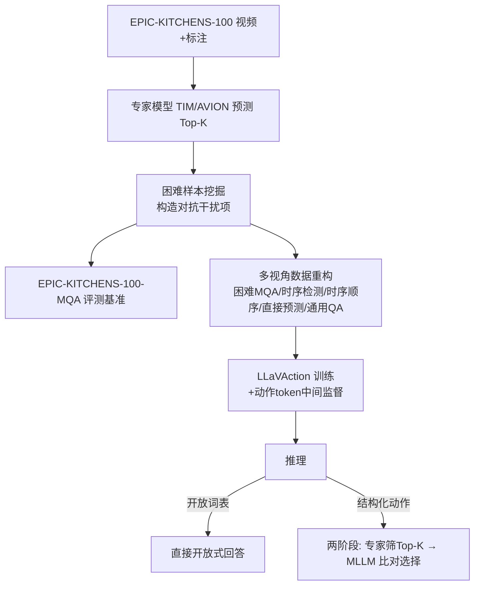

# LLaVAction: Evaluating and Training Multi-modal Large Language Models for Action Understanding

**会议**: ICLR 2026  
**OpenReview**: [https://openreview.net/forum?id=pPKqLyWiNr](https://openreview.net/forum?id=pPKqLyWiNr)  
**代码**: [https://github.com/AdaptiveMotorControlLab/LLaVAction](https://github.com/AdaptiveMotorControlLab/LLaVAction)  
**领域**: 视频理解 / 多模态大模型 / 细粒度动作识别  
**关键词**: MLLM, 动作理解, EPIC-KITCHENS-100, 困难样本挖掘, 动作 token, 第一人称视频  

## 一句话总结
本文用"专家动作识别模型挑困难干扰项"把 EPIC-KITCHENS-100 重构成一个真正考验细粒度动作辨别的 MLLM 基准（EPIC-KITCHENS-100-MQA），并提出 LLaVAction——通过动作 token 强化视觉信息利用 + 两阶段结构化输出，让通用视频 MLLM 在第一人称动作识别上反超 GPT-4o 21 个点并刷新多个动作识别 SOTA。

## 研究背景与动机
**领域现状**：动作理解长期被专用视觉模型（AVION、TIM 等）主导，它们靠数据集专属的分类头取得高精度，但语言理解弱、泛化差、输出不灵活。新兴的视频 MLLM 直接以文本输入输出，自带语言先验，被寄望成为更通用的替代方案。

**现有痛点**：把动作数据集转成 MLLM 训练/评测格式时，通常是"直接说出动作名"或"从几个随机候选里选"。问题有二：一是**随机候选太容易**——MLLM 只需排除明显荒谬选项即可蒙对，根本没在比对细粒度动作差异；二是**自由文本输出无法和专用模型公平对齐**，因为像 EPIC-KITCHENS-100 这种有约 4000 种动作类别的数据集，不可能把所有候选塞进提示词让模型选。

**核心矛盾**：现有评测把"看起来很强"的 MLLM 捧得很高（GPT-4o 在随机候选下 87.6%），但这种高分掩盖了它们**细粒度动作辨别能力的真实短板**——一旦干扰项在时序、物体、场景上高度相似，分数断崖式下跌。评测失真又导致训练目标失焦。

**本文目标**：构造一个高效、不依赖人工标注、不受闭源模型上限限制的硬基准，并据此训练出真正擅长细粒度动作理解的 MLLM。

**核心 idea**：**【借专家模型造困难，再借困难练强模型】**——用 SOTA 动作识别模型（TIM/AVION）的 Top-K 预测当干扰项，既能挖出时序、相似物体等天然挑战，又能反过来作为"对抗式"训练信号；再配合动作 token 和两阶段结构化输出，把通用 MLLM 锻造成动作专家。

## 方法详解

### 整体框架
LLaVAction 建立在 LLaVA 系列之上，包含三个相互咬合的部件：(1) **困难样本挖掘**把 EPIC-KITCHENS-100 重构成 MQA 基准与对抗式训练数据；(2) **多视角动作数据重构**把同一份视频标注扩展成困难动作识别、时序检测、时序顺序、直接预测、通用 QA 等多种任务；(3) **LLaVAction 模型设计**用动作 token 强化视觉信息利用、用两阶段管线输出结构化动作以便和专用模型公平对比。

### 关键设计

**1. 困难样本挖掘构造硬基准：让"伪强"无处遁形。** 给定视频片段 $v_i$，MQA 任务被形式化为 $f:(v_i, Q, O_i)\mapsto[p_1,\dots,p_K]$，其中 $K$ 个选项 $O_i=\{n_i, D_i\}$ 由正确叙述 $n_i$ 和 $K-1$ 个干扰项组成。朴素做法是随机采样 $D_i^r=\text{Uniform}(\{n_j\mid c_j\in C\setminus\{a_i\}\})$，但这往往采到一眼假的选项。本文改用动作识别模型 $g:V\to(0,1)^{|C|}$ 取除真值外置信度最高的 $K-1$ 类 $C_i=\text{TopK}_{-1}(g(v_i)\setminus\{a_i\})$ 来采样 $D_i^m$，并固定 $K=5$、用动作叙述而非动作标签构造选项以避免拗口文本。对比实验显示 TIM 生成的干扰项最难——所有 MLLM 从随机设定到 TIM 设定都暴跌（GPT-4o 87.6%→52.2%），证明它们此前的高分只是被简单候选喂出来的假象。

**2. 多视角动作数据重构：把一份标注榨成多种能力。** 仅靠"困难 MQA"还不足以覆盖动作理解全貌，本文围绕同一批视频派生多个任务联合训练。其中**对抗干扰项**刻意用 AVION（而非评测所用的 TIM）来构造训练干扰项，从而对 EPIC-KITCHENS-100-MQA 形成 OOD 评测，避免模型靠记住 TIM 的错误分布"刷分"；**时序检测**给动作片段加 $\delta=3$ 秒随机 padding——令 $\alpha\sim\text{Uniform}(0,1)$ 分配到起点，得 $\hat{s}_i=s_i-\alpha\delta,\ \hat{e}_i=e_i+(1-\alpha)\delta$，让模型从加噪片段里把动作起止时间当字符串预测出来，学到动作边界；**时序顺序学习**利用动作的自然连续性，优化 $\theta^*=\arg\max_\theta\sum_t\log P_\theta(a_t\mid a_{t-1},\dots,a_{t-n})$（取 $n=2$），训练时 30% 的 MQA 附带前序动作信息，推理时可用模型自己的前序预测做序列动作预测（SAP）。此外还有**直接预测**动作描述和基于 GPT-4o 重构的**通用视频理解**任务以保住泛化——但作者强调单靠 GPT-4o 重构反而会损害细粒度动作表现，因为 GPT-4o 自己就栽在这些硬干扰项上。

**3. 动作 token：给视觉信息一道中间监督。** MLLM 仅靠下一 token 的语言预测训练，会让视觉 token 在深层的重要性衰减。本文在输入序列里插入一个可学习的**动作 token**，位置安排为"系统文本 → 视觉 token → 动作 token → 指令文本"，借因果注意力让该 token 先聚合视觉信息再服务后续语言任务，类似 ViT 的 CLS token。设末层隐状态为 $\langle H_1^q,\dots,H_{l_v}^v, h_a, H_{k+1}^q,\dots\rangle$，在动作 token 隐状态 $h_a$ 上接三个分类头分别预测名词、动词、动作，用交叉熵训练。它只作为额外学习目标引导视觉信息抽取，**不参与最终预测**；推理或无明确动作标签时（如视频描述）退化为纯文本生成损失。消融显示该 token 单独带来 3.9 个点提升，是仅次于对抗干扰项的第二大贡献。

**4. 两阶段结构化动作输出：让自由文本与专用模型公平对齐。** MLLM 输出自由文本，难以和 4000 类动作标签精确匹配，把全部类别塞进提示词又不现实。LLaVAction 因此设计推理期两阶段管线：第一阶段用动作识别模型取 Top-K 置信动作（注意此处**不强行注入真值**），第二阶段让 MLLM 在这 K 个候选里比对选择。$K$ 控制"性能上界 vs 待辨别动作数"的权衡——实验发现 $K$ 从 5 扩到 20 效果更好，故最终用 TIM Top-20。该管线只在需要结构化动作的数据集/应用上、且只在推理阶段启用；开放词表任务仍可直接开放式回答。

## 实验关键数据

### 主实验：EPIC-KITCHENS-100-MQA（8 帧 / 16 帧，准确率 %）

| 方法 | 8 帧 | 16 帧 |
|---|---|---|
| zero-shot GPT-4o | 52.2 | N/A |
| zero-shot GPT-4o-mini | 37.4 | N/A |
| zero-shot LLaVA-Video-7B | 35.7 | 34.8 |
| zero-shot LLaVA-OV-7B | 28.9 | 30.5 |
| **LLaVAction: LLaVA-Video-7B** | **71.7** | **73.4** |
| **LLaVAction: LLaVA-OV-7B** | 71.3 | 72.3 |
| LLaVAction: LLaVA-OV-0.5B | 64.8 | 65.4 |

LLaVAction-7B 相对 GPT-4o（8 帧 52.2）领先约 21 个点，连 0.5B 小模型都大幅超越 GPT-4o。

### 干扰项难度对比（8 帧，准确率 %）

| 模型 | 随机5(易) | AVION-Top5(中) | TIM-Top5(难) |
|---|---|---|---|
| GPT-4o | 87.6 | 56.7 | 52.2 |
| GPT-4o-mini | 72.0 | 44.2 | 37.4 |
| LLaVA-Video-7B | 65.0 | 40.0 | 35.7 |

所有模型在硬干扰项下断崖下跌，印证现有 MLLM 细粒度动作辨别能力被高估。

### 消融实验：逐项叠加（LLaVA-Video-7B ⇒ LLaVAction-7B，准确率 %）

| 配置 | 准确率 |
|---|---|
| Zero-shot | 34.8 |
| + GPT-4o-based 重构 | 21.9（↓ 灾难性遗忘） |
| + 随机干扰项 | 55.0 |
| + 对抗干扰项 (AVION) | 64.4（+9.4，最大单项增益） |
| + 时序检测 | 65.2 |
| + 动作 token | 69.1（+3.9，第二大增益） |
| + GPT-4o 重构 | 71.5 |
| + 直接预测 | 73.6 |
| + 时序顺序 (w/ SAP) | 74.1 |
| IID: + 对抗干扰项 (TIM) w/ SAP | 77.0 |

### 动作识别 SOTA（EPIC-KITCHENS-100 验证集 Top-1）

| 方法 | Acc. |
|---|---|
| AVION | 54.4 |
| TIM | 56.4 |
| **LLaVAction-7B w/ action label** | 58.3 |
| **LLaVAction-7B w/ action narration** | **63.2** |

### 关键发现
- 单纯用 GPT-4o 重构微调会让 MQA 能力**灾难性遗忘**（35.7→21.9）；真正的增益来自对抗困难样本。
- 对抗干扰项是性能引擎（+9.4），动作 token 是结构创新（+3.9），二者正交叠加。
- 在 EPFL-Smart-Kitchen-30、MECCANO、Animal Kingdom 上零样本泛化也明显超过 AVION 与基线 LLaVA-Video，证明方法不是只过拟合 EPIC-KITCHENS。

## 亮点与洞察
- **"用专家造题、再用题练专家"的闭环很巧妙**：困难样本挖掘既是诊断工具（揭穿伪强），又是训练燃料（对抗信号），一套机制服务评测与训练两端。
- **OOD 设计严谨**：训练用 AVION 干扰、评测用 TIM 干扰，主动切断"靠记住评测器错误分布刷分"的捷径，让 21 点提升更可信。
- **动作 token 给视觉 token 加中间监督**这一点切中 MLLM"深层视觉信息衰减"的痛处，且即插即用、不污染最终生成。
- **两阶段管线**优雅化解了"自由文本 vs 4000 类标签"的对齐难题，让 MLLM 首次能和动作识别专用模型摆在同一张表上比，并真的赢了。

## 局限与展望
- **两阶段管线依赖外部专家模型**：结构化输出仍需 TIM/AVION 先筛 Top-K，性能上界被专家召回率封顶（真值不在 Top-K 就无解），并非纯端到端 MLLM 方案。
- **领域偏厨房第一人称**：核心基准与训练全建立在 EPIC-KITCHENS-100 上，虽在 MECCANO/Animal Kingdom 验证了泛化，但对开放世界、第三人称、多人交互等场景的普适性仍待检验。
- **困难样本质量受限于专家模型**：干扰项的"难度"本质由动作识别模型的错误模式决定，可能引入专家自身的偏置，未必等同于人类认为的语义近邻。
- **训练成本不低**：530K 重标注样本、32×GH200、需混入 LLaVA-Video-178K 做数据回放防过拟合，复现门槛较高。

## 相关工作与启发
- **vs 专用动作识别（AVION、TIM）**：本文不抛弃专用模型，而是把它们当"出题人"和"召回器"，与 MLLM 的语言能力互补。
- **vs 现有 MQA 基准**：以往干扰项靠人工或闭源 MLLM 构造，受人力/上限限制；本文用开源识别模型高效自动生成更难且不封顶的干扰项。
- **vs 其他动作 MLLM（InsTALL、HAIC、MotionLLM）**：它们各自聚焦流程规划、细节描述、人体运动，本文独家强调**细粒度动作对比性**。
- **启发**：困难样本挖掘 + 中间监督 token 的组合可迁移到其他需要细粒度辨别的多模态任务（如细粒度检索、属性识别）；"专家模型当干扰项生成器"是低成本造硬基准的通用配方。

## 评分
- **新颖性**: ⭐⭐⭐⭐ — "困难样本挖掘"用于评测与对抗训练双闭环、动作 token 中间监督、两阶段结构化对齐，三者组合在动作 MLLM 方向上有清晰创新，虽然各单点都借鉴了已有思想。
- **实验充分度**: ⭐⭐⭐⭐⭐ — MQA 主表、干扰难度对比、逐项叠加消融、四个动作识别数据集泛化、十个视频 MLLM 基准，覆盖全面且 OOD/IID 设定严谨。
- **写作质量**: ⭐⭐⭐⭐ — 动机层层递进，方法与公式表述清晰，图表支撑到位；多任务重构部分信息密度高，初读略繁。
- **价值**: ⭐⭐⭐⭐⭐ — 既揭示了现有 MLLM 细粒度动作能力被高估的真问题，又给出能反超 GPT-4o、刷新专用 SOTA 的可复现方案，并开源代码/数据/模型，对动作理解与行为分析社区实用价值大。

<!-- RELATED:START -->

## 相关论文

- [\[ICLR 2026\] Beyond Static Vision: Scene Dynamic Field Unlocks Intuitive Physics Understanding in Multi-modal Large Language Models](beyond_static_vision_scene_dynamic_field_unlocks_intuitive_physics_understanding.md)
- [\[ICLR 2026\] FlashVID: Efficient Video Large Language Models via Training-free Tree-Based Spatiotemporal Token Merging](flashvid_efficient_video_large_language_models_via_training-free_tree-based_spat.md)
- [\[ICCV 2025\] 4D-Bench: Benchmarking Multi-modal Large Language Models for 4D Object Understanding](../../ICCV2025/video_understanding/4dbench_benchmarking_multimodal_large_language_models_for_4d.md)
- [\[ICML 2026\] OmniSIFT: Modality-Asymmetric Token Compression for Efficient Omni-modal Large Language Models](../../ICML2026/video_understanding/omnisift_modality-asymmetric_token_compression_for_efficient_omni-modal_large_la.md)
- [\[ICLR 2026\] Invert4TVG: A Temporal Video Grounding Framework with Inversion Tasks Preserving Action Understanding Ability](invert4tvg_a_temporal_video_grounding_framework_with_inversion_tasks_preserving_.md)

<!-- RELATED:END -->
