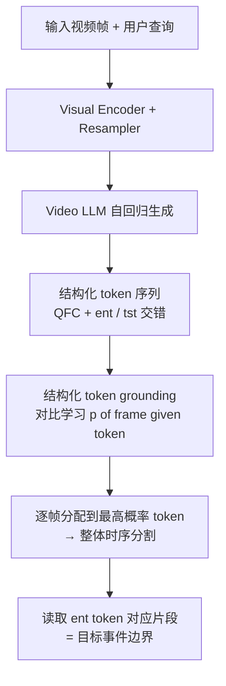

# Measure Twice, Cut Once: A Semantic-Oriented Approach to Video Temporal Localization with Video LLMs

**会议**: ICLR 2026  
**OpenReview**: [https://openreview.net/forum?id=d6vMek58Zv](https://openreview.net/forum?id=d6vMek58Zv)  
**代码**: [https://github.com/pangzss/MeCo](https://github.com/pangzss/MeCo)  
**领域**: 视频理解 / 视频时序定位 / Video LLM  
**关键词**: 时序定位, Video LLM, 结构化 token, 对比学习, query-focused captioning  

## 一句话总结
MeCo 抛弃"让 Video LLM 直接吐出边界时间戳"的主流范式，改用结构化 token + query-focused 字幕 + 对比式 grounding 三个任务，把视频时序定位重新表述成"先理解语义结构、再切割片段"的语义驱动问题，在 9 个任务上稳定超过时间戳生成方法。

## 研究背景与动机
- **领域现状**：视频时序定位（moment retrieval、动作定位、视频摘要、dense captioning 等）正从专用模型转向用 Video LLM 统一处理。当前主流做法是把预训练 Video LLM 微调成"边界时间戳生成器"——直接输出事件起止秒数，并围绕"如何设计对 LLM 友好的时间戳表示"做文章（learnable digit token、专用时间戳编解码器、boundary matching token 等）。
- **现有痛点**：时间戳输出本质上是**毫无语义信息的数字串**。LLM 在预训练阶段学到的是"视觉输入→具有具体语义含义的文本输出"的映射能力，而且已被多项工作证明在处理高度无信息量的输出（纯数字、大量新增 token）时表现挣扎。让 LLM 内部默默完成语义理解、却只暴露光秃秃的时间戳，等于浪费了它最强的预训练能力。
- **核心矛盾**：定位事件边界本来就**需要语义判断**——既要判断片段与查询的相关性，又要把目标事件和相邻事件区分开。但现有范式把这套语义推理压进黑箱，只留时间戳这个"贫瘠"接口，导致 LLM 的语义优势用不上。
- **本文目标**：构建一个**完全无时间戳**的语义导向框架，让 Video LLM 用它擅长的"生成 + 检索语义"能力来做定位，而不是去拟合数字。
- **核心 idea**：**先量两次、再切一次（Measure Twice, Cut Once）**——先用生成任务把视频拆成"事件段 / 过渡段"的结构化 token 序列并对每个事件段写细粒度字幕（measure twice：整体结构 + 局部细节），再用对比学习把这些 token grounding 回对应帧来一次性切出所有目标片段（cut once）。

## 方法详解

### 整体框架
MeCo 在一个 Video LLM（基于 E.T.Chat / QWen2VL）上联合训练三个任务：**结构化 token 生成**（把视频自回归地写成 `<ent>`/`<tst>` 序列）、**query-focused captioning**（在每个事件 token 前先写一段聚焦查询的字幕）、**结构化 token grounding**（用对比学习把每个 token 的隐状态对齐到它对应的视频帧）。前两个是生成式任务，复用 LLM 的自回归能力把片段语义压进 token 的隐状态；第三个是判别式任务，把隐状态映射回时间轴，从而读出事件片段的边界。推理时无需生成任何时间戳。

### 关键设计

**1. 结构化 token 生成：把"时间戳回归"改写成"序列分类生成"。** MeCo 给 LLM 词表新增两个特殊 token——事件 token `<ent>` 和过渡 token `<tst>`，要求模型根据查询把视频自回归地写成一串按时间排序的结构化 token 序列 $\{ST(i)\}_{i=1}^{M+K}$，其中属于查询事件的段输出 `<ent>`，背景过渡段输出 `<tst>`。监督数据从已有定位数据的 GT 边界 $\{(t^s_i, t^e_i)\}_{i=1}^{M}$ 出发，补上相邻过渡段构造出 $M+K$ 个段。关键巧思在于：`<tst>` 并不总是机械地夹在 `<ent>` 两侧——事件可能出现在视频开头/结尾、也可能连续出现而无中间过渡，这些"非平凡排布"恰好逼着模型真正去感知视频里到底有没有过渡段，而不是套模板。每个 token 在自回归生成时必须 attend 到它对应的片段，从而把该段的语义压进自己的隐状态，为后续 grounding 打基础。

**2. Query-focused captioning：给事件 token 配一段"看两遍"的细节字幕。** 就像人会回看片段确认细节，MeCo 在每个 `<ent>` token 前面插入一段针对查询的细粒度字幕 $[QFC]_i$，让整个输出变成字幕与结构 token 交错的序列 $X=\{CAP(i), ST(i)\}_{i=1}^{M+K}$（过渡段不配字幕）。借助因果注意力，紧跟其后的 `<ent>` token 能 attend 到这段字幕，相当于把 Chain-of-Thought 那套"先写中间推理、再给最终答案"的思路搬到定位上，但用更易获取的字幕替代推理链。所有 captioning / QA 任务的文本回答都被统一并入 QFC，从而把各类定位任务的输出格式统一起来。生成式部分的两个任务合并成一个语言建模损失：

$$\mathcal{L}_{LM} = -\frac{1}{N}\sum_{n=1}^{N} \log p(X_n \mid \{F_t\}_{t=1}^{T}, \{q_l\}_{l=1}^{L}, X_{<n})$$

由于 QFC 是全新任务没有现成数据，作者用 E.T.Instruct 的 GT 时间戳切出事件 clip，再喂给一个视频字幕模型自动生成细节字幕。

**3. 结构化 token grounding：用"非对称"对比学习把 token 钉回时间轴。** 光生成 token 序列还不够，要落到具体帧上才能定位。MeCo 对帧隐状态 $\{H_t\}$ 和结构 token 隐状态 $\{s_i\}$ 各接一个 MLP projector，用对比损失把每个 token 拉近它对应的片段帧：

$$\mathcal{L}_{ST} = -\frac{1}{M+K}\sum_{i=1}^{M+K} \sum_{t=t^s_i}^{t^e_i} \frac{\log p(h_t \mid s_i)}{t^e_i - t^s_i}, \quad p(h_t \mid s_i)=\frac{\exp(s_i\cdot h_t/\tau)}{\sum_{t'=1}^{T}\exp(s_i\cdot h_{t'}/\tau)}$$

这里 softmax 是**在所有帧上**归一化（给定 token 看哪些帧最像它）。作者特意指出**不要加对称项** $p(s_i\mid h_t)$：因为帧数（约 100）远多于 token 数（约 3 个），在 token 上做 softmax 的分母项太少、负样本严重不足，反而拖累对比学习——消融里加了对称项或换成段级特征都明显掉点。最终总损失 $\mathcal{L}=\mathcal{L}_{LM}+\mathcal{L}_{ST}$。推理时先自回归生成结构 token 序列，再对每帧计算 $p(h_t\mid s_i)$ 并分配给概率最高的 token，得到整段视频的"整体时序分割"，`<ent>` token 覆盖的帧区间直接就是目标事件边界——全程无需吐时间戳。

## 实验关键数据

### 主实验（E.T. Bench 零样本，节选）
在相同 E.T.Instruct 微调设定下与边界中心方法对比（F1 / 相似度 / Recall，越高越好）：

| 模型 | TVG(F1) | TAL(F1) | VHD(F1) | DVC(F1) | TEM(Rec) | GVQ(Rec) |
|------|---------|---------|---------|---------|----------|----------|
| TimeChat 7B | 24.3 | 17.7 | 43.0 | 39.4 | 19.1 | 0.8 |
| TRACE 7B | 18.5 | 22.3 | 38.2 | 39.0 | 12.5 | 1.4 |
| E.T.Chat 3.8B | 38.6 | 30.8 | 62.5 | 38.4 | 16.5 | 3.7 |
| **MeCo (ETChat 3.8B)** | 59.1 | 32.6 | 66.9 | 43.4 | 23.6 | 9.6 |
| **MeCo (ETChat 7B)** | **62.5** | **35.1** | 66.3 | 43.4 | 19.1 | 9.9 |
| **MeCo (QWen2VL 7B)** | 59.0 | 34.2 | **67.9** | 41.5 | 15.4 | **15.1** |

MeCo 即便用更小的 3.8B 基座、更少训练步数，也在几乎所有任务上大幅超过用更大模型、更多数据训练的时间戳方法（TVG 从 38.6→59.1，GVQ 从 3.7→9.6）。

### Charades-STA / QVHighlights
零样本（E.T.Instruct 微调）下 MeCo (QWen2VL 7B) 在 Charades-STA 取 R@0.3=71.1 / R@0.5=50.1；QVHighlights 高亮检测 mAP=37.2、HIT@1=57.9，远超 TRACE（mAP 16.4）等数字 token 方法。做数据集级微调后，MeCo 在 QVHighlights 上 mAP 45.3 / HIT@1 75.1，甚至超过 CG-DETR、UniVTG 等专用模型，是唯一在"时序定位"与"高亮检测"间取得良好平衡的方法。

### 消融实验

| 配置 | F1_gnd | F1_cap | Sim_cap | Rec_com |
|------|--------|--------|---------|---------|
| 仅 `<ent>` | 26.7 | 15.0 | 14.2 | 9.4 |
| `<ent>` + `<tst>` | 38.1 | 33.8 | 20.5 | 14.5 |
| `<ent>` + QFC | 40.4 | 32.0 | 19.9 | 14.9 |
| `<ent>` + Query Copying | 26.6 | 15.2 | 14.3 | 9.5 |
| **`<ent>` + `<tst>` + QFC** | **40.6** | **35.4** | 20.3 | **16.6** |

grounding 损失变体对比中，仅 $p(h_t\mid s_i)$（40.6）明显优于加对称项 $p(s_i\mid h_t)$（39.9）或换段级特征 $p(h^{seg}_i\mid s_i)$（23.2），印证"负样本充足"才是对比学习有效的关键。

### 关键发现
- **语义法天然更强**：纯对比视觉语言模型（CLIP/SIGLIP）不经训练就在 grounding 上有竞争力，Video LLM 进一步把这种语义优势放大。
- **整体结构 + 局部细节缺一不可**：`<tst>`（整体结构）与 QFC（局部细节）单独都有限，组合才最好；把 QFC 换成无信息的"查询复制"任务，性能立刻退回只用 `<ent>` 的水平。
- **QFC 只配语义法**：边界中心策略（positional embedding、interleaving、boundary matching）接上 QFC 后性能反而下降，只有结构化 token 能真正吃下细粒度语义线索。

## 亮点与洞察
- **范式重述**：把"时序定位 = 时间戳回归"重写成"时序定位 = 语义结构分割"，让 LLM 用自己擅长的生成 + 检索能力做事，思路上比"再设计一种时间戳 token"更根本。
- **CoT 思想迁移**：query-focused captioning 把 CoT"先推理再答"搬到定位，但用更易获取的字幕替代推理链，工程上更可落地。
- **对比学习的非对称洞察**：明确点出"帧多 token 少导致非对称 softmax"，并用负样本数量解释为何对称损失掉点，是有说服力的工程经验。
- **高亮检测顺手起飞**：grounding 用的连续相似度天然就是高亮分数，无需额外设计就在 QVHighlights 上碾压数字 token 方法。

## 局限与展望
- **细粒度边界偏弱**：MeCo 在高 IoU 指标（如 R@0.7）提升有限，因为它优先捕捉"查询相关 vs 背景"的语义差异，而非精细建模 phase-in/phase-out 边界模式——这是语义法泛化强与边界法精定位准之间的固有 trade-off。
- **不主张取代边界法**：作者明确表示边界中心方法与 LLM 生成式建模天然兼容、能直接拟合边界模式，未来方向是**融合两者**而非二选一。
- **组件非唯一解**：三个任务只是语义导向路线的一种实现，作者认为还有别的设计空间。
- **依赖字幕模型**：QFC 训练数据由外部字幕模型自动生成，其质量上限会影响细节语义的丰富度。

## 相关工作与启发
- **时间戳生成路线**：TimeChat、VTG-LLM（learnable digit token）、TRACE（专用时间戳编解码器）、VideoChat-T（时序自适应位置编码）、E.T.Chat（boundary matching token）——MeCo 正是对这条主线的反叛。
- **对比视觉语言模型**：CLIP、SIGLIP、EVA 等是 grounding 模块对比学习的思想来源，也是"语义相似度本身就能定位"的证据。
- **启发**：当一个任务被习惯性地表述成"回归数字"时，不妨问问"这个数字能不能由更语义化的中间表示读出来"——MeCo 用"结构 token + grounding"替代"直接回数字"的思路，可迁移到其他需要精确数值输出但底座是语言模型的任务（如计数、坐标定位、时间推理）。

## 评分
- **新颖性**: ⭐⭐⭐⭐ 在时间戳生成几乎一统天下的赛道上提出"完全无时间戳的语义导向"反范式，结构 token + QFC + 非对称对比 grounding 的组合设计较为独到。
- **实验充分度**: ⭐⭐⭐⭐ 覆盖 9 个任务 / 3 个 benchmark、多基座（3.8B/7B、ETChat/QWen2VL）、零样本与数据集级微调双设定，消融把每个组件和损失变体都拆开验证，较为扎实。
- **写作质量**: ⭐⭐⭐⭐ "Measure Twice, Cut Once"主线清晰，动机—方法—消融逻辑连贯，图示到位；个别公式排版略密。
- **价值**: ⭐⭐⭐⭐ 提供了一条可被后续工作融合/扩展的新路线，对"如何更好用 LLM 语义能力做结构化预测"有方法论启发；细粒度边界偏弱限制了即插即用的上限。

<!-- RELATED:START -->

## 相关论文

- [\[ICLR 2026\] SPIKE-RL: Video-LLMs Meet Bayesian Surprise](spike-rl_video-llms_meet_bayesian_surprise.md)
- [\[NeurIPS 2025\] Enhancing Temporal Understanding in Video-LLMs through Stacked Temporal Attention in Vision Encoders](../../NeurIPS2025/video_understanding/enhancing_temporal_understanding_in_videollms_through_stacke.md)
- [\[NeurIPS 2025\] TempSamp-R1: Effective Temporal Sampling with Reinforcement Fine-Tuning for Video LLMs](../../NeurIPS2025/video_understanding/tempsampr1_effective_temporal_sampling_with_reinforcement_fi.md)
- [\[ICLR 2026\] Steering and Rectifying Latent Representation Manifolds in Frozen Multi-Modal LLMs for Video Anomaly Detection](steering_and_rectifying_latent_representation_manifolds_in_frozen_multi-modal_ll.md)
- [\[ECCV 2024\] Online Temporal Action Localization with Memory-Augmented Transformer](../../ECCV2024/video_understanding/online_temporal_action_localization_with_memory-augmented_transformer.md)

<!-- RELATED:END -->
