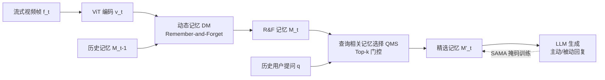

# Memento: Toward an All-Day Proactive Assistant for Ultra-Long Streaming Video

**会议**: ICLR 2026  
**OpenReview**: [https://openreview.net/forum?id=FtdbdoGbk3](https://openreview.net/forum?id=FtdbdoGbk3)  
**代码**: 待确认  
**领域**: 视频理解 / 在线流式视频 / 多模态大模型  
**关键词**: 流式视频, 主动交互, 动态记忆, 长时记忆, 视觉语言模型  

## 一句话总结
Memento 用"动态记忆 + 查询相关记忆选择 + 步感知记忆注意力"把在线视频 LLM 从"token 越积越多、几十分钟就 OOM"的困境里解放出来，做到了在长达 7 小时的超长视频流上有界显存、主动提醒用户的全天候助手能力。

## 研究背景与动机
**领域现状**：多模态大模型在离线视频理解上已经很强，近期的在线视频 LLM（如 VideoLLM-online）引入了"主动交互"——模型可以在不被显式提问时自己决定该不该开口。这是从"被动应答"走向"主动助手"的关键一步。

**现有痛点**：现有在线模型几乎都是 **token-based** 架构——每来一帧就把视觉 token 拼进上下文。后果是显存随时间线性膨胀，VideoLLM-online 在约 25 分钟时就撞上 80.5 GB 显存上限直接 OOM，之后完全失忆。即便后续工作用 MoE token 路由（VideoLLM-MoD、LION-FS）或 patch 丢弃（TimeChat-online）把时长撑到几十分钟，本质上帧 token 仍在累积。固定长度记忆库（MovieChat、MA-LMM）虽然显存有界，但记忆容量写死、无法主动交互，也不适合全天候场景。

**核心矛盾**：要做"全天候主动助手"，必须同时满足两件互相拉扯的事——既要**主动交互**（在线、不等提问就响应），又要**超长时记忆**（记住几小时前发生过什么）。token-based 路线满足前者却扛不住时长，固定记忆库满足显存约束却记不住长程关键信息且不主动。两条已有路线各占一半，没人两头都占。

**本文目标**：构建首个面向超长视频流的主动视觉语言框架，让模型能像电影《Memento》里需要外部记忆的主角那样——记住"用户几小时前是否已经打过一针胰岛素"这类需要长程行为监控的事，并在恰当时刻主动提醒。

**核心 idea**：**[抛弃 token 累积，改用动态记忆表示]** 不再把每帧特征拼成 token 序列喂给 LLM，而是维护一组随时间演化、容量随内容增长而非随时间增长的记忆槽，配合查询相关的稀疏检索和专门设计的训练注意力掩码，实现"有界显存 + 长程主动理解"。

## 方法详解

### 整体框架
给定流式视频 $V=\{f_1,\dots,f_T\}$，Memento 先用 ViT 编码每帧得到含 [CLS] 与空间 token 的特征 $v_t$。关键改动是：不直接把 $v_t$ 投影进语言空间，而是先送入**动态记忆（DM）**，按"记住-遗忘"策略把 $v_t$ 与历史记忆 $M_{t-1}$ 融合成 $M_t$；再用**查询相关记忆选择（QMS）**根据历史用户提问筛出最相关的子集 $M'_t$ 喂给 LLM 生成回复；训练时用**步感知记忆注意力（SAMA）**把注意力限制在每个时间步真正可见的记忆上，从而让 token-based 时代的监督目标可以直接复用。

### 关键设计

**1. 动态记忆（Dynamic Memory）：用相似度门控决定记住还是融合。** 这是整个框架摆脱 token 累积的根基。对每个新帧，DM 同时算两个相关性分数：一个**短期分数** $\delta$，是当前帧 $v_t$ 与最后一个记忆槽 $m_{t-1}$ 的余弦相似度，用来抓"相邻帧几乎没变"的短时冗余；一个**长期分数** $\sigma$，由 $v_t$ 对所有历史记忆做交叉注意力后求和过 sigmoid 得到 $\sigma=\psi\big((\mathrm{Attn}(v_t,M_{t-1})\cdot(M_{t-1}W_v))W_o\big)$，用来抓"几小时前出现过的重复场景/动作"这类长时冗余。一个固定阈值 $\epsilon$ 把帧分成三种命运：若 $\delta>\epsilon$，判为局部冗余，按 $\tilde m_{t-1}=m_{t-1}\cdot(1-\mathrm{sum}(w))+w^\top v_t$ 软融合进最后一个记忆槽；若 $\delta\le\epsilon$ 但 $\sigma>\epsilon$，判为与长程记忆语义对齐，把 $M_{t-1}$ 当 query、$v_t$ 当 key/value 做同样的软更新铺到所有相关槽上；若两者都 $\le\epsilon$，判为全新内容，直接 $M_t=\mathrm{Concat}(M_{t-1},v_t)$ 追加一个新槽。这样记忆只在"出现新东西"时才增长，对冗余则原地融合——既避免了 token 路线的无界膨胀，又比固定记忆库能为新内容动态扩容。

**2. 查询相关记忆选择（QMS）：只把和当下提问相关的记忆喂进 LLM。** DM 控制了记忆"存多少"，QMS 控制每次生成"用多少"。把 $M_t$ 展平后，以历史用户 token $Q$ 作为 key/value 做交叉注意力，给每个记忆帧打一个相关性分 $R\in\mathbb R^{N_t}$，再用 top-k 门控选出 $k=r_{qms}\cdot N_t$ 个最相关的记忆 $M'_t=\mathrm{TopK}(M_t,R,k)$ 送进 LLM。好处是生成时只对"与当前问题相关"的稀疏记忆做全注意力，把超长序列上的全记忆注意力开销砍下来，时长越长收益越大。实验里 $r_{qms}=50\%$ 在召回与显存间取得最佳折中。

**3. 步感知记忆注意力（SAMA）：给"没有逐帧对齐"的记忆补上时序监督。** 这是把 DM 训起来的关键，也是论文最 subtle 的贡献。token-based 模型天然按帧累积，可以用因果注意力逐位置监督；但 Memento 的记忆是动态融合的，没有"第几帧对应第几个 token"的对齐关系，直接套因果注意力会让某个 token 注意到当时根本还不该可见的"过期记忆"，导致输入错位、训练无效。SAMA 用一个二值掩码 $A\in\{0,1\}^{L\times L}$ 把可见性钉死：token $x_i$ 只能注意到在它被加入序列那一步 $s=\mathrm{step}(x_i)$ 时确实有效的记忆/提问/历史文本（且 $i\ge j$、$x_j\ne$[EOS]），[EOS] 只注意自己。同时重排各 token 的 position id，让同一帧内的 token 共享基准偏移，使位置编码与掩码定义的可见性一致。靠这层对齐，VideoLLM-online 的训练目标可以原样搬过来：
$$L=\frac1N\sum_{j=1}^N\Big(\underbrace{-\log l_{j+1}P^{[\mathrm{Txt}_{j+1}]}_j}_{\text{LM Loss}}\underbrace{-\log f_j P^{[\mathrm{EOS}]}_j}_{\text{Streaming Loss}}\Big)$$
其中 LM Loss 监督语言回复 token，Streaming Loss 通过 $f_j$（判断是否该在此处保持沉默/触发响应）教会模型"何时该开口"。推理时沿用同一掩码结构，只把对话 token 存进 KV cache，实现高效流式解码。

## 实验关键数据

实现上用 SigLIP-ViT-L/384（2 FPS、$h_p=w_p=3$）+ LLaMA-3.1-8B-Instruct，LoRA 微调，4×A100(80G) 训 1 epoch；默认 $\epsilon=0.7$、$u=0.2$、$r_{qms}=50\%$。

### 主实验
在自建 MementoBench 上对比 VideoLLM-online（VideoLLM-online* 为用 Memento-54k 同等训练后的版本）：

| 方法 | Sp. Recall↑ | Temp. Recall↑ | Long(>25min)↑ | Avg. Recall↑ | Score↑ | Redund.↓ |
|------|------|------|------|------|------|------|
| VideoLLM-online | 6.1% | 11.8% | 0.1% | 8.1% | 1.40 | 56.4% |
| VideoLLM-online* | 7.9% | 11.6% | 0.3% | 8.9% | 5.32 | 21.3% |
| **Memento*** | **45.9%** | **51.3%** | **35.2%** | **47.5%** | 4.22 | 64.5% |

显存方面（Figure 5）：VideoLLM-online 约 25 分钟即 OOM（峰值 80.5 GB），Memento 在整个 4 小时流上稳定 ≤45.3 GB。VideoLLM-online* 看似 Redundancy 低（21.3%）、Score 高（5.32），实则因为它几乎不开口、该响应时一直沉默，导致召回趋零，并不实用。

### 消融实验
**记忆机制**（Table 4，固定库 vs 动态记忆）：

| 方案 | Avg. Recall↑ | Temp. Recall↑ | Redund.↓ |
|------|------|------|------|
| Fixed Len=8 | 16.9% | 22.1% | 55.5% |
| Fixed Len=128 | 29.0% | 31.2% | 52.7% |
| Dynamic ϵ=0.7 | 40.4% | 46.7% | 56.2% |
| Dynamic ϵ=0.8 | 44.7% | 46.6% | 61.4% |

动态记忆在需长程记忆的 Temporal 任务上从固定库的 31.2% 提到 46.7%；$\epsilon=0.8$ 比 0.7 显存大近 10× 而指标提升微弱，故选默认 $\epsilon=0.7$。

**帧 token 配置**（Table 5）：$1+3\times3$ 取得最高召回 68.9%（Score 3.78），优于 $1+2\times2$ 的 40.4% 和 $1+4\times4$ 的 60.9%（后者只增冗余不增召回）。

**QMS top-k 比例**（Table 6）：$r_{qms}=50\%$ 召回 56.1%、显存 45.19 GB，是召回与显存的最佳折中；100% 反而召回掉到 40.4%、显存升到 55.44 GB。

### 关键发现
- 动态记忆相比固定记忆库不仅显存有界，还能随视频时长**自然扩容**（Figure 6），是长程召回大幅领先的根源。
- Memento 的高 Redundancy（64.5%）是其"宁可多提醒也不漏"策略的代价；作者认为在超长在线场景下，确保及时一致响应比压低冗余更重要。

## 亮点与洞察
- **范式转换而非缝补**：直面在线视频 LLM 的根本病灶（token 随时间无界累积），用动态记忆从架构层根除，而不是像 MoE 路由/patch 丢弃那样治标延寿。
- **SAMA 抓住了真问题**：动态记忆没有逐帧 token 对齐，是它能省显存的代价，也是它训不动的根因。SAMA 用掩码 + position id 重排把可见性对齐回来，让成熟的流式监督目标得以直接复用，是"让新架构能训"的精巧一笔。
- **数据-基准配套**：Memento-54K（基于 Ego4D，5 分钟–7 小时，9 类时空任务）和 MementoBench（TimeRecall/Score/Redundancy 三指标，支持自由文本输出、真正考察"是否在对的时间主动说对的话"）填补了长程主动交互的训练与评测空白。

## 局限与展望
- **冗余偏高**：64.5% 的 Redundancy 意味着大量响应落在时间窗外，作为"全天候助手"会比较聒噪，实际部署需要更好的"何时沉默"控制。
- **评测规模有限**：测试集仅 40 段视频（虽含 13k+ 响应），且数据全部来自 Ego4D 第一视角，跨域（监控、车载、桌面等）泛化未验证。
- **打分依赖闭源模型**：Score 用 GPT-3.5-turbo 评、QA 用 GPT-4o 生成，评测一致性与可复现性受外部 API 影响。
- **仅与 VideoLLM-online 主对比**：因其是唯一开源在线推理代码的基线，主表对比面偏窄，与固定记忆库类方法只在消融里间接比。

## 相关工作与启发
- **长视频理解**：固定 token 路线（LLaMA-VID 两 token/帧）与固定记忆库路线（MovieChat、MA-LMM 聚合冗余帧）——前者推理开销随帧增，后者记忆写死且不主动。
- **在线视频 LLM**：VideoLLM-online 首提 Streaming-EOS 决定何时响应；VideoLLM-MoD/LION-FS 用动态 token 路由、TimeChat-online 用 patch 丢弃延长时长，但都没摆脱帧 token 累积。Memento 把"主动交互"与"长程记忆"两条此前各占一半的路线第一次合到一起。
- **启发**：当一个新的高效表示（动态记忆）破坏了原有的"逐位置对齐"假设时，与其放弃成熟的训练目标，不如设计一层对齐掩码把旧目标"嫁接"回来——这种"换表示但保监督"的思路对其它压缩/记忆型架构（KV cache 压缩、状态空间模型流式训练）有迁移价值。

## 评分
- **新颖性**: ⭐⭐⭐⭐ 首个超长流式视频主动框架，动态记忆 + SAMA 的组合是真正的架构级创新，而非增量缝补。
- **实验充分度**: ⭐⭐⭐ 消融完整（记忆机制/帧 token/QMS 比例三轴），但主对比基线偏少、测试视频仅 40 段、域单一（Ego4D）。
- **写作质量**: ⭐⭐⭐⭐ 动机讲得清楚（电影《Memento》类比贴切），三个模块各自解决一个明确问题，逻辑链完整。
- **价值**: ⭐⭐⭐⭐ 指向"全天候主动 AI 助手"这一有现实意义的方向，配套数据集+基准对社区推动力强。

<!-- RELATED:START -->

## 相关论文

- [\[NeurIPS 2025\] LiveStar: Live Streaming Assistant for Real-World Online Video Understanding](../../NeurIPS2025/video_understanding/livestar_live_streaming_assistant_for_real-world_online_video_understanding.md)
- [\[ICCV 2025\] VideoLLaMB: Long Streaming Video Understanding with Recurrent Memory Bridges](../../ICCV2025/video_understanding/videollamb_long_streaming_video_understanding_with_recurrent_memory_bridges.md)
- [\[CVPR 2026\] StreamReady: Learning What to Answer and When in Long Streaming Videos](../../CVPR2026/video_understanding/streamready_learning_what_to_answer_and_when_in_long_streaming_videos.md)
- [\[CVPR 2026\] MuKV: Multi-Grained KV Cache Compression for Long Streaming Video Question-Answering](../../CVPR2026/video_understanding/mukv_multi-grained_kv_cache_compression_for_long_streaming_video_question-answer.md)
- [\[ICLR 2026\] FOCUS: Efficient Keyframe Selection for Long Video Understanding](focus_efficient_keyframe_selection_for_long_video_understanding.md)

<!-- RELATED:END -->
