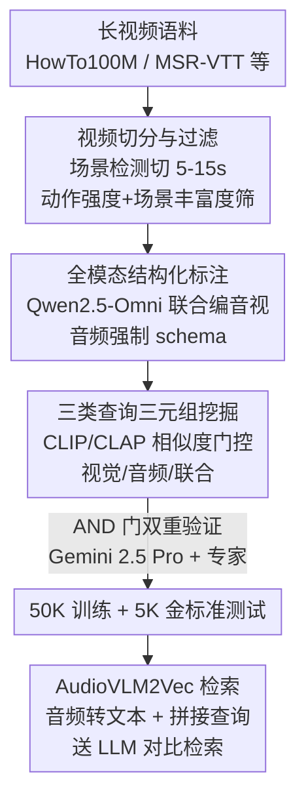

# OmniCVR: A Benchmark for Omni-Composed Video Retrieval with Vision, Audio, and Text

**会议**: ICLR 2026  
**OpenReview**: [https://openreview.net/forum?id=KxxR7emO5K](https://openreview.net/forum?id=KxxR7emO5K)  
**数据**: https://huggingface.co/datasets/Jun-Yang/OmniCVR  
**领域**: 视频理解 / 多模态检索 / Benchmark  
**关键词**: 组合视频检索, 音视频多模态, 基准构建, 音频语义, 对比检索

## 一句话总结
针对现有"组合视频检索"基准只管视觉、丢掉音频的问题，本文构建了 OmniCVR——首个把视觉、音频、文本都当作一等模态的大规模组合视频检索基准（50K 三元组 / 5K 金标准测试集），并提出 AudioVLM2Vec，把音频转成文字描述喂进 VLM 嵌入模型，在音频中心查询上把 R@1 从 12.4 拉到 77.2。

## 研究背景与动机

**领域现状**：视频检索已经从早期低层视觉特征发展到大规模视觉-语言模型（CLIP 一类）驱动的文到视频检索；MSR-VTT、VATEX、YouCook2 等基准把大批视频和自然语言描述配对，推动了视频-语言对齐。近年又出现了"组合视频检索（CoVR）"这一更难的范式：给一段源视频 + 一条文本修改指令，要求模型检索出"按指令改造后"的目标视频（例如"同样的做菜场景，但换一种食材"），逼模型做细粒度的组合推理而不只是相似度匹配。

**现有痛点**：CoVR 的所有主流基准（WebVid-CoVR、Dense-WebVid-CoVR、EgoCVR）都把视频当成"纯视觉+文本"的媒介，**完全忽略音频流**。但音频往往携带不亚于视觉的语义——语音传达意图、背景音乐定调、环境声界定场景。"体育场里观众欢呼"这种场景，光看画面是描述不全的。更关键的是，没有任何现有框架支持"同时修改视觉和音频"的检索任务。

**核心矛盾**：真实视频是视觉、音频、文本交织的整体，而评测基准却把它压成单一视觉通道，导致大家训出来的"全模态"检索模型在涉及声音的转换上根本没被考过、也学不会。一旦检索的判别依据落在非视觉信息（换音乐、改对白）上，现有 SOTA 就会崩。

**本文目标**：(1) 造一个把音频也当一等公民、且支持视觉/音频/视觉+音频联合修改三类查询的大规模组合检索基准；(2) 验证现有模型在音频维度上到底差多少；(3) 给出一个能补上音频短板的检索模型。

**切入角度**：作者观察到当前 VLM 嵌入模型本身有很强的文本理解能力，缺的不是推理能力而是"听到的内容进不了语义空间"。那与其去训一个原生音频塔，不如**先把音频翻译成密集的自然语言描述**，让强大的语言主干顺手把声学语义一起编码。

**核心 idea**：用"Audio-as-Text（音频转文本）"代替"原生音频 token"，把声学语义显式注入嵌入流水线，从而让组合检索查询同时锚定在视觉和音频两个模态上。

## 方法详解

本文有两条主线：一条是**怎么把基准造出来**（可扩展的三阶段自动化数据流水线 + 双门验证），另一条是**配套提出的检索模型 AudioVLM2Vec**。下面先讲数据是怎么从海量长视频里"切→标→配→验"流出来的，再讲模型怎么把音频塞进嵌入空间。

### 整体框架

OmniCVR 把每个样本表示成三元组 `(源视频, 修改文本, 目标视频)`，修改文本描述把源映射到目标所需的转换。整条数据流水线分三步：先从公开数据集（HowTo100M、MSR-VTT、VATEX 等）收集数分钟到数小时的长视频，用场景检测切成 5–15 秒（平均 11.8 秒）的语义连贯短片，并按动作强度、场景丰富度过滤；再用 Qwen2.5-Omni 联合编码视频+音频做"全模态结构化标注"，对音频强制采用涵盖副语言特征、词汇内容、环境层级、时间动态的 schema；最后按三种策略（视觉中心 / 音频中心 / 联合）挖配对、生成修改文本，并经 Gemini 2.5 Pro + 人工专家"AND 门"双重验证产出 5K 金标准测试集。检索侧的 AudioVLM2Vec 则在 VLM2Vec 基础上，把音频先转成文字描述、和查询拼接后一起送进 LLM 主干做对比检索。

### 关键设计

**1. 三类查询任务：把音频提升为可检索、可修改的一等模态**

这是整个基准区别于过往 CoVR 的根本设计，直接回应"现有基准忽略音频"的痛点。OmniCVR 把查询明确分成三类：**视觉中心**（修改动作/物体/场景，音频保持不变以隔离视觉推理）、**音频中心**（改音乐/音效/语音但保持高视觉相似度）、**联合**（视觉与音频同时改）。其中联合查询故意占多数（视觉:音频:联合 = 22.82% : 20.00% : 57.18%），因为真实世界里修改极少孤立发生。也正因为要在一条指令里同时无歧义地指定视觉和听觉两个域的转换，OmniCVR 的平均查询长度达到 52.6 词，明显高于纯视觉 CoVR 基准——这是刻意为之而非冗余。音频中心查询最稀少，是因为它的配对约束最苛刻（既要视觉极像、又要声音差异大），下个设计点会讲怎么挖。

**2. 三阶段数据生成流水线：用相似度门控把"只改某一模态"的难样本筛出来**

要让"视觉中心"样本真的只考视觉、"音频中心"样本真的只考音频，靠人标不可扩展，关键在于**用两个跨模态相似度做硬约束**。视觉中心三元组取自同一长视频的不同片段或同源不同片段，并**保留音频**以隔离视觉差异；音频中心则先用视频 CLIP 余弦相似度 $>0.9$ 卡出"画面几乎一样"的候选，再在其中挑音频嵌入（CLAP 模型）余弦相似度 $<0.3$ 的对，保证"画面不变、声音大改"；联合查询则要求 CLIP（视觉）和 CLAP（音频）相似度都低。三元组的修改文本由 LLM 读源/目标的结构化标注后生成，显式编码两者差异。前置的切分阶段用 PySceneDetect 按帧间 HSV 差异（$\tau=36$）定段，再用动作强度（光流幅值）和场景丰富度（视觉特征方差）双指标过滤，保证每个短片都有足够语义密度。

**3. AND 门双重验证：用"LLM 和人都点头才收"换金标准质量**

基准好不好用，测试集的语义保真度是命门。本文对 5K 金标准测试集采用**并发双门协议**：每个候选三元组，Gemini 2.5 Pro 和人工专家各自独立判断配对视频与修改文本是否一致，**只有两者都通过才录用**（AND 门）。这种"且"逻辑比单一审核严得多，能同时挡住模型幻觉和人为疏漏，且保留了自然的查询分布（联合 > 视觉 > 音频），形成贴近真实的评测分布。标注阶段同样有"自动一致性检查（Gemini 2.5 Pro）+ 人工复核"的两段验证兜底。

**4. AudioVLM2Vec 与 Audio-as-Text：把听到的内容翻译成文字再进语义空间**

这是配套模型的核心，针对"现有 VLM 嵌入模型听不见"的痛点。AudioVLM2Vec 在 VLM2Vec 之上做扩展：视觉内容由预训练图像编码器 + 轻量投影层编码；音轨则交给 Qwen2-Audio-7B-Instruct **生成细粒度的声学场景自然语言描述**；这段音频文本与用户修改查询拼接后，连同视觉 token 一起送进 LLM 主干。这样做的妙处在于，它把音频和视觉都落到 LLM 的同一高维语义空间，靠多头自注意力**联合处理两个模态**，从而学到"文字'嘴唇在动'对齐到对应视觉 token"这类协同/因果关系。最终多模态嵌入从 LLM 取出，用对比学习优化检索。和直接喂"原生音频 token"的方案相比，把音频显式转成密集文字描述反而更能抓住音乐流派、音色、节奏、复杂环境事件这些非词汇属性——论文用一个控制变量消融证明了这一点（见实验）。

### 一个例子：一条音频中心查询怎么被造出来又被检索

以图 1 的 Hip-Hop 涂鸦场景为例：源片段是"涂鸦艺术家在墙上作画 + Hip-Hop 配乐"。流水线先从某长视频切出这段 11 秒短片并通过动作/丰富度过滤；标注阶段记录下场景（墙绘）、动作（喷涂）、音频（Hip-Hop 风格）。挖配对时，系统找到一段画面 CLIP 相似度 >0.9（同一面墙、同样作画动作）但音频按设计差异较大的目标片段，于是写出修改文本："保持涂鸦艺术家、墙面与 Hip-Hop 音轨风格，把墙画从早期偏白的轮廓推进到接近完成、带红黑填充的精细成品。"该三元组经 Gemini 与专家双门通过后进测试集。检索时，AudioVLM2Vec 对每段候选视频先把音轨转成"Hip-Hop 节拍、含人声"之类文字、与该修改文本拼接送进 LLM 得到嵌入，再按与查询嵌入的相似度排序——画面几乎相同时，正是音频文字描述帮模型把正确目标顶到前列。

### 损失函数 / 训练策略

检索模型沿用对比学习目标：对 `(查询, 目标视频)` 正样本拉近、与池内负样本推远，最终从 LLM 取多模态嵌入做排序。评测时对每个查询计算查询嵌入与候选视频嵌入的相似度排序，并把候选池**洗牌 5 次取平均**以抑制候选集组成带来的方差；音频中心任务还会刻意在候选池里放"视觉相似但声学不同"的干扰项（反之亦然）来控制模态失衡。训练三元组 45K+，唯一视频片段 160K+，金标准测试 5K。

## 实验关键数据

### 主实验

整体检索（所有查询）与音频中心检索两张表最能说明问题。AudioVLM2Vec 在所有类别和所有 K 上都排第一。

| 设置 | 模型 | Backbone | R@1 | R@10 |
|------|------|----------|-----|------|
| 整体 | CLIP | CLIP | 27.54 | 62.62 |
| 整体 | OmniEmbed-v0.1 | Qwen2.5-Omni | 31.90 | 64.00 |
| 整体 | VLM2Vec | Qwen2-VL | 38.44 | 66.60 |
| 整体 | **AudioVLM2Vec** | Qwen2-Audio+Qwen2-VL | **66.98** | **84.40** |
| 音频中心 | OmniEmbed-v0.1 | Qwen2.5-Omni | 13.6 | 47.0 |
| 音频中心 | VLM2Vec | Qwen2-VL | 12.4 | 42.3 |
| 音频中心 | **AudioVLM2Vec** | Qwen2-Audio+Qwen2-VL | **77.2** | **94.2** |

整体 R@1 比 VLM2Vec 高 +28.5 个点；在音频中心设置上更是从 12.4 飙到 77.2（+64.8 绝对点）。VLM2Vec 从整体 38.44 跌到音频中心 12.4，暴露了现有强基线在音频组合性上的灾难性失败。

### 消融实验

| 消融 | 关键结果 | 说明 |
|------|---------|------|
| Audio-as-Text vs 原生音频 token | OmniEmbed R@1 13.6 → 32.7 (+19.1, 2.4×) | 同 backbone/同数据，仅把音频塔换成转文本 |
| 去掉源视频（Blind 检索） | 音频中心 R@1 77.2 → 28.1 (−49.1) | 修改文本是相对指令，不能脱离源视频 |
| 按音频类别拆分（vs VLM2Vec） | 语音 +85.23 / 音乐 +70.36 / 环境声 +49.56 | 转文本对结构化语音/音乐增益最大 |
| 推理延迟 | 1.72s → 4.77s（约 1.77× 开销），RTF≈0.5 | 音频转写带来开销，仍快于实时播放 |

### 关键发现
- **音频是现有模型的盲区**：把检索判据落到声音上时，VLM2Vec 一类强基线直接崩（R@1 12.4），说明"全模态"系统其实没在认真听语音和环境声。
- **Audio-as-Text 是增益主因，而非 backbone**：在同一 OmniEmbed 上只把原生音频塔换成转写文字，R@1 就从 13.6 涨到 32.7（2.4×），证明"显式转文本"本身比"潜在音频 token"更能表达声学语义。
- **源视频不可或缺**：抹掉源视频帧后音频中心 R@1 暴跌 49.1 点，说明 OmniCVR 真的在考"相对修改 + 上下文过滤"的组合推理，而不是退化成文到视频检索。
- **非语音声更难描述**：环境声（Sound）的增益（+49.56）明显低于语音（+85.23）和音乐（+70.36），反映非结构化声学事件转文字时信息损失更大。

## 亮点与洞察
- **用相似度门控自动造"控制变量"样本**：CLIP>0.9 保画面一致、CLAP<0.3 保声音大改，一行阈值就把"只考音频"的难样本可扩展地筛出来——这种"双相似度反向卡"的思路可迁移到任何需要隔离某一模态的基准构建。
- **AND 门双重验证**：让 LLM 和人都点头才收，是个朴素但高性价比的质量护栏，比单审更能同时挡住模型幻觉与人为疏漏。
- **Audio-as-Text 反直觉地打赢原生音频塔**：把信号翻译成密集文字、复用语言主干的强语义能力，胜过端到端的潜在音频 token——提示在 LLM 时代"文本作为通用接口"对小众模态可能是更省事的捷径。
- **联合查询占多数 + 平均 52.6 词**：刻意拉高任务难度和描述密度来逼近真实视频编辑场景，而不是堆简单样本充数。

## 局限与展望
- 作者承认的主要局限是**推理延迟**：中间的音频转文字一步让单条延迟从 1.72s 涨到 4.77s，比潜在嵌入法重，未来想用轻量适配器 / 蒸馏加速。
- 自己看，Audio-as-Text 把声音"瓶颈"成一段文字描述，**信息有损**——环境声类别增益最低已经说明非词汇、连续声学事件容易被文字描述抹平；遇到需要精细时序/音色判别的检索可能吃亏。
- 评测仍是 5–15 秒短片，长视频（电影/剧集级）下更大候选池、更强干扰项的挑战未覆盖（作者也把"长视频密集裁剪"列为未来工作）。
- 数据源虽多样，但标注主力是 Qwen2.5-Omni + Qwen2-Audio，**标注模型的偏好/盲区可能被固化进基准**，用同源模型评测时需警惕系统性偏差。

## 相关工作与启发
- **vs WebVid-CoVR / Dense-WebVid-CoVR**：它们用 LLM / GPT-4o 合成大规模视觉组合检索三元组，但纯视觉、无音频；OmniCVR 首次把音频做成可检索、可修改的维度，并支持视觉+音频联合查询。
- **vs EgoCVR**：EgoCVR 聚焦第一人称、时序/动作级的细微修改但仍只在视觉域；OmniCVR 覆盖更广的内容域并把声学转换纳入评测。
- **vs 音视频学习（AV-SUPERB、MLVU 等）**：这些工作做的是分类或定位，没有"按跨模态自然语言指令检索"的组合任务；OmniCVR 把音视频融合从感知任务推到组合检索任务。
- **vs OmniEmbed / VLM2Vec**：同为大模态嵌入模型，但本文用 Audio-as-Text 在同 backbone 上就刷出 2.4× 音频中心增益，指出"原生音频塔"未必是注入声学语义的最佳路径。

## 评分
- 新颖性: ⭐⭐⭐⭐⭐ 首个把音频做成一等模态的组合视频检索基准，并给出反直觉有效的 Audio-as-Text 方案
- 实验充分度: ⭐⭐⭐⭐ 7 个基线 + 多角度消融（控制变量、Blind、类别拆分、效率），但模型贡献相对基准偏轻
- 写作质量: ⭐⭐⭐⭐ 动机与流水线清晰，图表自洽
- 价值: ⭐⭐⭐⭐⭐ 暴露了"全模态"检索的音频盲区，提供可扩展数据管线与即用基准，影响面大

<!-- RELATED:START -->

## 相关论文

- [\[CVPR 2025\] Learning Audio-Guided Video Representation with Gated Attention for Video-Text Retrieval](../../CVPR2025/video_understanding/learning_audio-guided_video_representation_with_gated_attention_for_video-text_r.md)
- [\[ICLR 2026\] CaReBench: A Fine-grained Benchmark for Video Captioning and Retrieval](carebench_a_fine-grained_benchmark_for_video_captioning_and_retrieval.md)
- [\[ICLR 2026\] OmniSTVG: Toward Spatio-Temporal Omni-Object Video Grounding](omnistvg_toward_spatio-temporal_omni-object_video_grounding.md)
- [\[CVPR 2026\] Hear What Matters! Text-conditioned Selective Video-to-Audio Generation](../../CVPR2026/video_understanding/hear_what_matters_text-conditioned_selective_video-to-audio_generation.md)
- [\[ICLR 2026\] ScaleLong: A Multi-Timescale Benchmark for Long Video Understanding](scalelong_a_multi-timescale_benchmark_for_long_video_understanding.md)

<!-- RELATED:END -->
