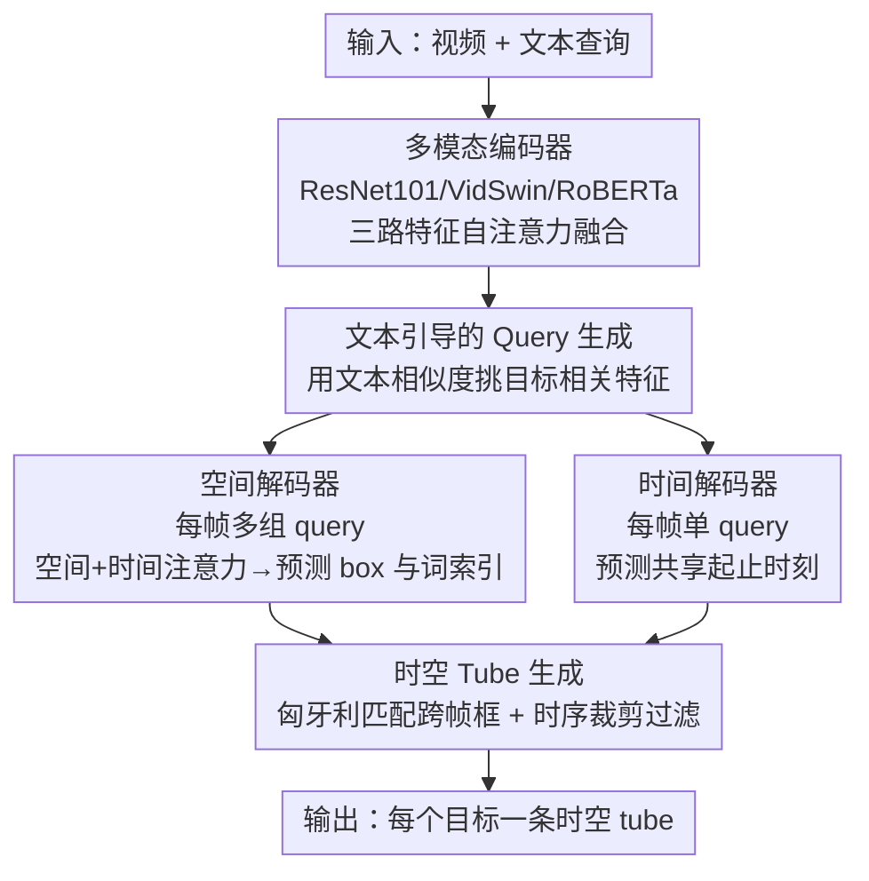

# OmniSTVG: Toward Spatio-Temporal Omni-Object Video Grounding

**会议**: ICLR 2026  
**OpenReview**: [https://openreview.net/forum?id=azcQJtcYTE](https://openreview.net/forum?id=azcQJtcYTE)  
**代码**: https://jellyyao3000.github.io/OmniSTVG/ (项目页)  
**领域**: 视频理解 / 多模态视频定位  
**关键词**: 时空视频定位, 多目标定位, BOSTVG, OmniTube, Transformer

## 一句话总结
本文把经典「时空视频定位（STVG）只定位单个目标」的任务扩展成 OmniSTVG——定位文本查询里提到的**所有**目标（含交互对象），配套提出首个万级基准 BOSTVG（10,018 视频、287 类、目标数 1~10）和一个基于 DETR 思路的方法 OmniTube，在所有指标上超过被改造适配的现有 STVG 方法。

## 研究背景与动机
**领域现状**：时空视频定位（Spatio-Temporal Video Grounding, STVG）给定一句自由形式的文本查询，要在视频里把「目标」在空间（每帧 bounding box）和时间（起止时刻）上都定位出来，输出是一条时空管道（tube）。近年主流方法借鉴 DETR，走单阶段 Transformer 路线，端到端直接预测一条 tube，效果优于早期「先检测候选框再匹配」的两阶段做法。

**现有痛点**：现有 STVG 一次只定位查询里的**单个**目标。但现实里一句查询往往涉及多个目标——例如「大象踩上跷跷板时，拿着篮球的男人跳起来」里有大象和男人两个对象。两个问题随之而来：其一，只能定位单目标，多目标场景下要把模型反复跑多次，计算量翻倍、缺乏可扩展性；其二，目标往往不是孤立存在，而是与其他对象交互，现有方法忽略这些「交互对象」，丢掉了理解事件所需的上下文。

**核心矛盾**：STVG 的输出结构被「单目标 tube」这个先验框死了——它假设一句查询只对应一个被定位对象。而真正的视频理解需要把查询里**每一个**被提及的对象（无论数量、无论类别、含交互方）都同时定位出来。

**本文目标**：定义并解决一个新任务——把查询里提到的**所有**目标在时空上全部定位，每个对象输出一条独立的时空 tube，对象数量可任意（1 到多个），类别可不同。

**切入角度**：作者类比 Segment Anything（SA）——SA 是「分割图像里任意区域」，本文是「定位未剪辑视频里查询提到的任意对象」，把「全覆盖」这种思路迁移到视频时空定位。

**核心 idea**：在 DETR 式解码器里为每帧学习**多组对象 query**（而非单组），让模型一次性 ground 出所有目标；并用文本去引导从视频里挑出目标相关特征来生成 query，最后用简单的匹配+过滤策略把跨帧检测结果串成每个目标的时空 tube。

## 方法详解

### 整体框架
OmniSTVG 要解决的是「一句查询、多个目标、各自一条时空 tube」。本文方法 OmniTube 沿用 DETR 的 encoder-decoder 思路，把整条流水线拆成三块：先用**多模态编码器**把视频的 2D 外观、3D 运动和文本三路特征融成统一的多模态特征 $\tilde{\mathcal{F}}$；再用**时空解码器**（空间分支 + 时间分支）分别学每个对象的空间位置（每帧 box）和共享的时间起止；最后用**时空 tube 生成模块**把跨帧的框匹配、过滤，串成每个目标的 tube。和现有单目标 STVG 最大的不同在于：空间解码器为每帧学**多组 query**（每帧 $N_q$ 组），从而能同时定位任意数量的对象。

### 关键设计

**1. OmniSTVG 任务与 BOSTVG 基准：把「单目标」放开成「全目标」**

本文最根本的贡献是重定义任务本身。经典 STVG 一次只 ground 一个对象，本文提出 OmniSTVG：定位查询里提到的所有目标（含交互对象），每个对象输出一条独立时空 tube，对象数量任意、类别可不同。为支撑这个新任务，作者建了 BOSTVG——首个也是当时最大的 OmniSTVG 基准：10,018 个视频、1,020 万帧、287 个类别（取自 ImageNet 与 V3Det 并组织成由粗到细的层级），每段视频配一句自由文本查询，目标数从 1 到 10、平均 2.4。视频从 YouTube 采集（CC 许可），先用关键词搜 15K+ 再人工筛掉不适合的，保留每段一个 clip；标注分两类——时间上标起止时刻、空间上为每个对象逐帧标 box tube，并用「标注→三专家验收→不一致退回重标」的多轮策略保证质量（随机抽 100 段独立复标，IoU 达 0.90）。测试集还按目标密度切成 Low（1-3 目标）/ Medium（4-6）/ High（≥7）三档便于分析。和并行工作 DVD-ST 相比，BOSTVG 在「ground 所有对象（而非部分）」「支持不同类别（而非同类）」「规模 10K vs 2.75K」三方面都更进一步。

**2. 文本引导的 Query 生成：让 query 从一开始就带目标线索**

传统 DETR 式定位的 object query 是随机初始化的、与具体目标无关，在多目标场景下更难收敛到正确对象。本文改成用文本去「挑」视频里与目标相关的特征来初始化 query。具体地，先把融合特征反拼回三路 $[\tilde{\mathcal{F}}_a, \tilde{\mathcal{F}}_m, \tilde{\mathcal{F}}_t]$，对文本特征做平均池化得 $\bar{\mathcal{F}}_t$；空间分支用外观特征算相似度、取 Top-$M$ 最相似的特征再平均池化生成每帧的初始空间 query：

$$q^0_{i,j} = \text{AvgPooling}(\text{Top}M(\text{Sim}(\tilde{\mathcal{F}}_a, \bar{\mathcal{F}}_t)))$$

每帧生成 $N_q$ 组 query（这是支持多目标的关键）。时间分支同理，但用运动特征 $\tilde{\mathcal{F}}_m$ 生成初始时间 query $p^0_i$；由于 OmniSTVG 里所有目标共享同一组起止时刻，时间分支每帧只需一组 query。这样得到的 query 自带目标相关信息，比随机 query 更易与多模态特征交互、定位更准（消融里 TG-SQG 单独加上即可提分）。

**3. 时空解码器：先理帧内/帧间关系，再与多模态特征交互**

为了同时建模「同一帧里多个对象的空间关系」和「同一对象跨帧的时间一致性」，空间解码器在每层先后做两个注意力块：空间注意力块 SAB 在同一帧的 $N_q$ 组 query 间做 self-attention（$\{\hat{q}^{k-1}_{i,j}\}=\text{SABlock}(\{q^{k-1}_{i,j}\})$），时间注意力块 TAB 在同一对象跨帧的 query 间做 self-attention，之后再用 cross-attention 让 query 与外观+文本特征交互：$Q_k = \text{CrossAttBlock}(\tilde{Q}_{k-1}, [\tilde{\mathcal{F}}_a, \tilde{\mathcal{F}}_t])$，堆叠 $K=6$ 层。最后空间头（MLP）预测每帧每组 query 的 box $B\in\mathbb{R}^{N_v\times N_q\times 4}$；借鉴 MDETR 还预测一个「词索引」$G$——把每个 box 对应到查询里某个词的位置，用来判定这个框属于哪个对象/类别。时间解码器结构类似但只用 TAB + cross-attention（与运动+文本特征交互），最后时间头预测每帧的起止概率 $H_s, H_e$。消融显示时间分支里 TAB 至关重要：去掉它 m tIoU 从 35.83 暴跌到 26.0 左右，说明时间建模是准确时序定位的核心。

**4. 时空 Tube 生成：把跨帧的框匹配、裁剪、过滤成每个目标一条 tube**

空间分支每帧给出 $N_q$ 个框，需要把它们跨帧串成属于同一对象的 tube。本文用两步简单策略：(i) **Tubelet 匹配**——用框的空间位置和预测类别做匈牙利匹配，跨帧关联成 $N_q$ 条初始 tubelet；(ii) **Tubelet 过滤**——先用时间分支预测的起止时刻裁剪每条 tubelet 的时间边界，再把一条 tubelet 内所有框的类别概率平均来定它的类别，最后**剔除那些类别没在查询文本里出现的 tubelet**。这一步把「冗余/无关对象」滤掉，只保留查询真正提到的目标，从而输出干净的多目标 tube 集合。设计上刻意保持简单，目的是给新任务提供一个可复现的参考基线而非追求复杂度。

### 损失函数 / 训练策略
模型同时预测空间 box 和时间起止时刻并联合优化（具体 loss 公式在补充材料，正文未给）。训练上：2D 与文本 backbone、多模态编码器用预训练 MDETR 初始化，3D backbone（VidSwin）冻结、其余端到端训练；Adam 优化器，backbone 学习率 1e-5、其余模块 1e-4；帧率 FPS=2 采样、文本长度 $N_t=30$、通道维 $D_a/D_m/D_t/D=2048/768/768/256$，损失权重 $\lambda_h=2, \lambda_k=1$。

## 实验关键数据

### 主实验
由于没有专门为 OmniSTVG 设计的现成方法，作者把 TubeDETR、STCAT、CG-STVG 三个单目标 STVG 框架改造适配后在 BOSTVG 上对比，全部用 BOSTVGTra 训练以保证公平。

| 测试子集 | 指标 | OmniTube | STCAT† | CG-STVG† | TubeDETR† |
|---|---|---|---|---|---|
| Full | m tIoU | **35.83** | 33.31 | 32.09 | 31.05 |
| Full | m vIoU | **9.47** | 8.03 | 7.66 | 7.52 |
| Full | vIoU@0.3 | **6.17** | 3.35 | 3.56 | 3.14 |
| Low (1-3 目标) | m vIoU | **10.11** | 8.52 | 8.29 | 7.99 |
| Medium (4-6) | m vIoU | **7.24** | 6.20 | 5.30 | 5.81 |
| High (≥7) | m vIoU | **4.42** | 4.36 | 3.22 | 3.91 |

OmniTube 在所有密度档、所有指标上都领先；vIoU@0.3 这种更严格的指标上优势尤其明显（6.17 vs 次优 3.56）。同时也能看到：随着目标数增多（Low→High），所有方法的 m vIoU 都明显下滑，说明多目标定位本身极具挑战。

### 消融实验

空间解码器（Tab. 4）：

| 配置 | m tIoU | m vIoU | 说明 |
|---|---|---|---|
| 全去掉 | 34.33 | 8.25 | 无 TG-SQG/SAB/TAB |
| +SAB+TAB | 34.13 | 9.00 | 加帧内/帧间注意力 |
| +TG-SQG+TAB | 34.98 | 8.89 | 文本引导 query |
| +TG-SQG+SAB | 35.42 | 9.15 | |
| Full | **35.83** | **9.47** | 三者齐全 |

时间解码器（Tab. 5）：

| 配置 | m tIoU | m vIoU | 说明 |
|---|---|---|---|
| 全去掉 | 26.06 | 6.66 | 无 TG-TQG/TAB |
| +TAB | 35.00 | 8.98 | 仅时间注意力 |
| +TG-TQG | 26.00 | 6.82 | 仅文本引导 query |
| Full | **35.83** | **9.47** | 两者齐全 |

### 关键发现
- **时间分支的 TAB 是时序定位的命脉**：单独加 TAB 就把 m tIoU 从 26.06 拉到 35.00；而只加 TG-TQG（无 TAB）几乎不动（26.00），说明文本引导的 query 必须配上时间建模才能发挥作用，二者互补。
- **文本引导 query（TG-SQG）提供判别性目标线索**：在空间解码器里，把 TG-SQG 与 SAB 或 TAB 任一组合都能提分，说明它让 query 带上了目标特异信息，更容易与多模态特征交互。
- **多目标越密越难**：Low→Medium→High 三档上所有方法 m vIoU 单调下降，BOSTVG 平均每视频 516.2 个框，是难度的直接来源。

## 亮点与洞察
- **任务重定义本身就是最大贡献**：把 STVG 从「单目标」放开到「查询里所有目标（含交互方）」，这个 framing 简单却打开一个新方向——类比 SA 的「全覆盖」思路迁移到视频时空定位，很有启发性。
- **「每帧多组 query + 共享时间 query」的非对称设计很巧**：空间上对象各异所以每帧 $N_q$ 组 query，时间上所有目标共享同一起止所以每帧只需 1 组——这个对任务结构的观察直接简化了时间分支。
- **用「词索引」把框对应到查询里的词**：借鉴 MDETR 预测 box 对应的词位置来定类别，这一招让「过滤掉查询没提到的对象」变得自然可行，是多目标场景里把无关 tube 剔除的关键。
- **可迁移**：「文本相似度 Top-M 选特征做 query 初始化」这种用语言锚定视觉 query 的做法，可迁移到其他开放词表/多目标的视频定位、检测任务。

## 局限与展望
- 方法刻意保持简单（作者自称 simple yet effective），tube 生成靠匈牙利匹配 + 启发式过滤，缺乏端到端的 tube 级建模，在高密度（≥7 目标）场景绝对性能仍很低（vIoU@0.5 接近 0）。
- 假设所有目标共享同一组起止时刻，这对「同一查询里不同对象出现时段不同」的场景是过强的假设。
- 损失函数细节、SAEncoder/注意力块结构、指标具体公式都放在补充材料，正文不完整（⚠️ 以原文补充材料为准）。
- BOSTVG 只考虑「目标确实出现在视频里」的情形，不含「查询提到但视频里没有」的负样本，离真实开放场景仍有距离。

## 相关工作与启发
- **vs 经典 STVG（TubeDETR / STCAT / CG-STVG）**：它们一次只定位单目标，本文把它们改造适配到多目标设置作为基线；OmniTube 在每帧学多组 query + 文本引导生成，全面超过这些被适配的方法。
- **vs DVD-ST（并行工作）**：DVD-ST 也支持多目标，但只定位**同类**目标、且忽略交互对象、数据仅 2,750 段；本文 OmniSTVG ground **所有**对象（跨类别、含交互方），BOSTVG 规模 10,018 段更大。
- **vs Segment Anything（概念灵感）**：SA 分割图像任意区域，OmniSTVG 定位视频里查询提到的任意对象——把「anything/all」的全覆盖范式迁移到时空视频定位。

## 评分
- 新颖性: ⭐⭐⭐⭐⭐ 重定义任务 + 首个大规模基准，开辟新方向
- 实验充分度: ⭐⭐⭐⭐ 三基线对比 + 分密度子集 + 双解码器消融，但绝对指标偏低、缺端到端 tube 建模
- 写作质量: ⭐⭐⭐⭐ 动机清晰、图表完整；部分关键细节（loss/指标公式）外放补充材料
- 价值: ⭐⭐⭐⭐⭐ 数据集+任务+基线方法三件套，对后续 OmniSTVG 研究有奠基意义

<!-- RELATED:START -->

## 相关论文

- [\[CVPR 2026\] OmniGround: A Comprehensive Spatio-Temporal Grounding Benchmark for Real-World Complex Scenarios](../../CVPR2026/video_understanding/omniground_a_comprehensive_spatio-temporal_grounding_benchmark_for_real-world_co.md)
- [\[CVPR 2026\] SARL-STG: A Spatially Aware Reinforcement Learning Framework for Refining MLLMs in Spatio-Temporal Video Grounding](../../CVPR2026/video_understanding/sarl-stg_a_spatially_aware_reinforcement_learning_framework_for_refining_mllms_i.md)
- [\[ICLR 2026\] OmniCVR: A Benchmark for Omni-Composed Video Retrieval with Vision, Audio, and Text](omnicvr_a_benchmark_for_omni-composed_video_retrieval_with_vision_audio_and_text.md)
- [\[ICLR 2026\] Invert4TVG: A Temporal Video Grounding Framework with Inversion Tasks Preserving Action Understanding Ability](invert4tvg_a_temporal_video_grounding_framework_with_inversion_tasks_preserving_.md)
- [\[CVPR 2026\] T2SGrid: Temporal-to-Spatial Gridification for Video Temporal Grounding](../../CVPR2026/video_understanding/t2sgrid_temporal-to-spatial_gridification_for_video_temporal_grounding.md)

<!-- RELATED:END -->
