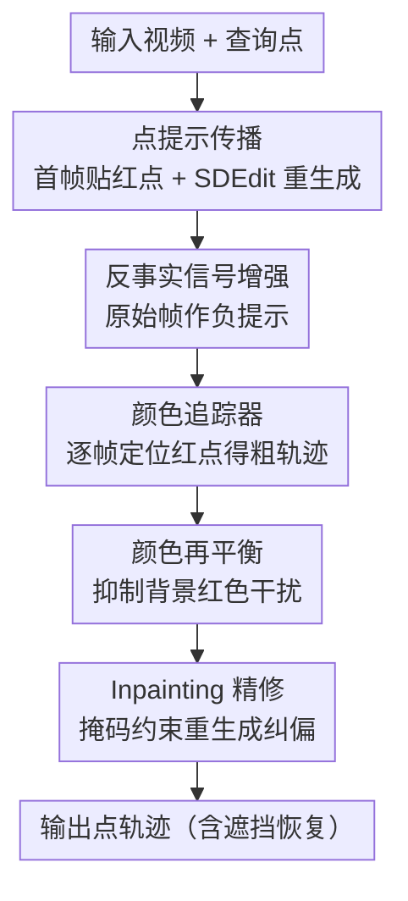

# Point Prompting: Counterfactual Tracking with Video Diffusion Models

**会议**: ICLR 2026  
**OpenReview**: [https://openreview.net/forum?id=6FFQ007qLX](https://openreview.net/forum?id=6FFQ007qLX)  
**项目页**: https://point-prompting.github.io  
**代码**: 待确认  
**领域**: 视频理解 / 点追踪 / 视频扩散模型  
**关键词**: 点追踪, 视频扩散模型, 反事实建模, 零样本, SDEdit

## 一句话总结
本文发现预训练的图像条件视频扩散模型自带"零样本点追踪"能力——只要在首帧目标点上画一个醒目的红点，再用 SDEdit 重新生成后续帧，红点会被传播到每一帧描出轨迹，配合"用原始帧作负提示"的反事实增强，在 TAP-Vid 上超过所有零样本基线、逼近自监督方法，并能穿越遮挡。

## 研究背景与动机
**领域现状**：追踪器和视频生成器解决的是一对镜像问题——前者分析运动、后者合成运动。已有大量工作利用二者的联系（用追踪器监督/控制视频生成、用"可追踪性"评估生成质量），但方向几乎都是"用追踪帮生成"。

**现有痛点**：反过来"用生成帮追踪"的零样本路线一直不好走。和物体识别这类能用文字 caption 描述的高层任务不同，追踪很难用文本 prompt 诱导出来。现有零样本对应方法（DIFT、SD-DINO）把预训练扩散模型当成表征提取器，抠出内部特征再做帧间匹配，本质仍是逐对帧匹配，无法处理遮挡。另一条反事实世界模型路线（CWM、Opt-CWM）则要专门训练 masked autoencoder 和辅助光流模块，并非"开箱即用"。

**核心矛盾**：视频生成器明明具备物体恒存性（objects persist through occlusion）这种追踪最需要的能力，但这种能力被"锁"在生成网络里，没有一个不训练、不抠特征就能把它读出来的接口。

**本文目标**：不做任何训练、不依赖特定架构，直接从现成的图像条件视频扩散模型里"问"出高质量长程点轨迹，并且能扛遮挡。

**切入角度**：作者借鉴反事实建模（counterfactual modeling）——精心扰动输入，再观察生成结果如何响应。这里的扰动就是"在查询点上画个点"，响应就是"这个点被生成模型传播到后续帧的位置"。

**核心 idea**：用一个视觉提示（首帧画红点）+ SDEdit 重生成，把点追踪问题转化为"让生成模型替我把标记画到每一帧"，再用最朴素的颜色检测读出轨迹。

## 方法详解

### 整体框架
方法把"追踪一个点"重写成"生成一段带标记的视频"：输入是一段真实视频 + 一个查询点像素坐标，输出是该点在每帧的位置。流程是——在首帧查询点处贴一个纯红色圆点（可被解读为物体表面的一部分），对视频加中间程度的噪声后用 SDEdit 重新去噪生成，让扩散模型把红点"传播"到后续帧；为防止模型的强先验把这个不自然的红点忽略掉，用未编辑的原始首帧作为负提示来增强反事实信号；生成完后用一个基于颜色的极简追踪器逐帧定位红点得到粗轨迹；最后用 inpainting 做由粗到精的精修，并对视频做颜色再平衡以避免背景红色干扰。

### 关键设计

**1. 点提示 + SDEdit 传播：把追踪变成"让生成器替我画标记"**

针对"追踪无法用文本 prompt 诱导"这个痛点，作者改用视觉提示：在首帧查询点处画一个纯红色圆点，作为条件首帧喂给模型，再用 SDEdit 对视频加中间噪声 $x_t = \sqrt{\bar\alpha_t}x_0 + \sqrt{1-\bar\alpha_t}\epsilon$（取 $1<t<T$）后跑反向去噪。由于扩散模型生成的视频会保留原视频的粗结构、只改变细粒度细节，红点会被当作物体表面的一部分随物体一起运动，从而被"传播"到后续每一帧。这一步让物体恒存性这种生成模型的内在能力直接服务于追踪——红点能穿越遮挡再出现，而这是逐对帧匹配方法做不到的。

**2. 反事实信号增强：用原始首帧当负提示，逼模型别忽略红点**

生成模型的强先验常常觉得"红点不自然"，几帧之内就把它抹掉，导致传播失败。作者用一个负提示来压低"生成结果像原视频"的概率：在每个去噪步同时用两种首帧条件估两次噪声——一次条件是加了红点的编辑帧 $\phi(c_I)$，一次是未编辑的原始帧 $c_I$，然后做加权相减
$$\tilde\epsilon_\theta(x_t, c_I) = (\lambda+1)\cdot\epsilon_\theta(x_t, \phi(c_I)) - \lambda\cdot\epsilon_\theta(x_t, c_I).$$
按去噪与 score 的对应关系，这等价于在 classifier-free guidance 框架下把采样 score 偏离"未编辑条件"的方向，从而把生成结果推向"包含红点"的样本。和 CWM 系列直接相减两张生成图（$\mathbb{E}_{p(x|\phi(c_I))}[x]-\mathbb{E}_{p(x|c_I)}[x]$）不同，本文把这个对比约束放进采样器里当 guidance；作者发现直接相减生成图会因为不同采样间物体位置的微小漂移引入大量伪影，难以使用，而 guidance 方式更稳。消融显示去掉这一项 AJ 从 48.60 暴跌到 22.03，是整条 pipeline 中最关键的组件。

**3. 颜色追踪器 + 颜色再平衡：把"读出轨迹"做到极简又抗干扰**

生成视频里有了随物体运动的红点后，定位它无需复杂模型。追踪器在 HSV 空间于上一帧位置 $(u_{k-1}, v_{k-1})$ 的半径 $r$ 窗口内搜红色像素，取最近的并对邻近红点取平均得到稳定中心；若窗口内找不到红点就判定遮挡、沿用上一已知位置并逐步扩大 $r$，等红点重现后再复位 $r$，这套自适应策略让它能从临时遮挡和大位移中恢复。但追踪器靠颜色就怕背景本身有红色物体干扰，于是配套做颜色再平衡：在生成前降低视频中红色区域的饱和度，把自然红色压下去、只让红色标记是唯一的追踪线索，尤其在遮挡时显著减少误检（去掉它 AJ 从 48.60 掉到 34.86）。

**4. 由粗到精的 inpainting 精修：纠正重生成带来的像素错位**

精确追踪要求生成视频与原视频逐像素对齐，但 SDEdit 重生成后画面常有微小漂移，使粗轨迹有偏。作者借用扩散模型也能做 inpainting 的能力：拿到粗轨迹后，构造一个时空二值掩码 $m$，每帧只在追踪点周围半径 $r$ 内置 1，再按 inpainting 公式
$$x_{t-1} = m\odot\tilde x_{t-1} + (1-m)\odot x_{t-1}^{\text{original}}$$
重跑生成，只允许追踪点附近的区域变化、其余画面保持原样，从而在保住背景的前提下把红点位置修准（去掉精修 AJ 从 48.60 降到 42.70）。

### 损失函数 / 训练策略
方法本体完全零样本、无训练。所有视频模型统一用 50 步去噪、噪声强度 0.5、空文本 prompt。查询点半径最优为 2 像素。额外的"蒸馏"分支：用本文方法在 1000 段无标注 Kinetics 视频上跑出伪标签轨迹，作为监督从零训练一个 CoTracker，得到一个推理快几个数量级、性能接近教师的前馈追踪器。

## 实验关键数据

### 主实验
在 TAP-Vid 上评测，指标为位置精度 $<\delta^x_{\text{avg}}$、遮挡精度 OA、平均 Jaccard AJ。

| 方法 | 监督类型 | DAVIS AJ↑ | DAVIS OA↑ | Kinetics AJ↑ |
|------|---------|-----------|-----------|--------------|
| CoTracker3 | 监督 | 64.45 | 90.90 | 54.35 |
| Opt-CWM | 自监督 | 47.53 | 80.87 | 44.85 |
| GMRW | 自监督 | 36.47 | 76.36 | 25.70 |
| DINOv2+NN | 零样本 | 15.19 | 61.81 | 12.69 |
| DIFT | 零样本 | 21.51 | 69.71 | 15.10 |
| SD-DINO | 零样本 | 29.68 | 69.71 | 16.47 |
| **本文 (Wan2.1-14B)** | 零样本 | **42.21** | **82.90** | 27.36 |

本文在 DAVIS 上 AJ 42.21 超过所有零样本基线，甚至超过自监督的 GMRW；遮挡精度 82.90 同时高于零样本与自监督方法、逼近监督水平，凸显生成模型的物体恒存性。用原始高分辨率 DAVIS 帧时 AJ 可达 48.60，反超自监督的 Opt-CWM。

### 消融实验

| 配置 | DAVIS AJ↑ | 说明 |
|------|-----------|------|
| 完整模型 | 48.60 | 全部组件 |
| w/o 精修 | 42.70 | 去掉 inpainting 精修，位置精度下降 |
| w/o 反事实增强 | 22.03 | 去掉负提示，5-6 帧后追踪丢失 |
| w/o 颜色再平衡 | 34.86 | 背景红色误检增多 |
| tracker only | 11.26 | 不做点传播、直接追原始像素颜色 |

视频模型消融：Wan2.1-14B (48.60) > Wan2.1-1.3B (44.58) > CogVideoX (24.15)，更强的生成模型直接带来更好的追踪。

### 关键发现
- 反事实增强是命门：去掉它 AJ 直接腰斩到 22.03，没有负提示红点几帧内就被模型抹掉。
- 性能主要来自"点传播"而非追踪器本身：tracker-only 基线只有 11.26，说明红点能被生成模型可靠地随物体搬运才是关键。
- 生成质量 ∝ 追踪质量：模型越大、分辨率越高（接近训练分布），追踪越准。
- 超参敏感性：噪声强度 0.5、查询半径 2 像素为最优。

## 亮点与洞察
- 把"追踪"重新表述为"让生成器替我画标记"，绕开了"追踪无法用文本 prompt 诱导"的根本困难——这是一个很漂亮的问题转化。
- 用未编辑首帧当负提示来对抗生成先验"忽略不自然扰动"，是反事实建模落到强生成模型上的关键工程洞察，且把对比放进采样器 guidance 比直接相减生成图更稳。
- 整条 pipeline 架构无关、零训练，对任意图像条件视频扩散模型即插即用，可随生成模型变强而自动受益。
- 蒸馏分支证明生成模型的时序推理能力可被迁移进轻量前馈追踪器，为"慢生成器→快追踪器"提供了可复用范式。

## 局限与展望
- 作者承认：每追踪一个点就要生成一整段视频，开销巨大（Wan2.1-14B 单点约 30 分钟），效率是最大短板，可通过蒸馏、一步采样或一次追多点缓解。
- 生成模型有时不把红点理解为"附着在物体表面"，尤其对计算机生成的（疑似分布外）视频会传播失败。
- 还存在静止点（红点像镜头上的灰尘停在画面边界）、对称误传（画在右脚的点传到左脚）等失败模式。
- 在合成的 TAP-Vid Kubric 上性能偏低，因为视频模型主要在真实视频上训练。

## 相关工作与启发
- **vs DIFT / SD-DINO（零样本特征匹配）**：它们把预训练扩散模型当表征提取器、抠内部特征做逐对帧匹配，无法处理遮挡；本文是"提示"模型让它视觉地画出轨迹，架构无关且靠物体恒存性扛遮挡。
- **vs Opt-CWM / CWM（反事实世界模型）**：它们要专门训练 masked autoencoder 做未来帧预测、外加辅助光流模块；本文完全冻结、只靠提示现成视频扩散模型，不需任何训练。
- **vs Nam et al.（并发的视频特征提取）**：对方要做复杂的、依赖架构的逐层分析挑特征且不处理遮挡；本文架构无关并显式处理遮挡。

## 评分
- 新颖性: ⭐⭐⭐⭐⭐ 首次把图像提示用于视频扩散模型做点追踪，问题转化巧妙
- 实验充分度: ⭐⭐⭐⭐ 多模型多分辨率消融充分，但只在 TAP-Vid 上评测、效率分析偏弱
- 写作质量: ⭐⭐⭐⭐⭐ 动机、方法、反事实推导讲得清晰自洽
- 价值: ⭐⭐⭐⭐ 揭示生成模型的隐藏追踪能力 + 可蒸馏，方向启发性强但当前实用性受效率限制

<!-- RELATED:START -->

## 相关论文

- [\[CVPR 2026\] MotionEnhancer: Leveraging Video Diffusion for Motion-Enhanced Vision-Language Models](../../CVPR2026/video_understanding/motionenhancer_leveraging_video_diffusion_for_motion-enhanced_vision-language_mo.md)
- [\[CVPR 2026\] Generative Point Tracking and Forecasting](../../CVPR2026/video_understanding/generative_point_tracking_and_forecasting.md)
- [\[ECCV 2024\] DINO-Tracker: Taming DINO for Self-Supervised Point Tracking in a Single Video](../../ECCV2024/video_understanding/dino-tracker_taming_dino_for_self-supervised_point_tracking_in_a_single_video.md)
- [\[CVPR 2026\] MV-TAP: Tracking Any Point in Multi-View Videos](../../CVPR2026/video_understanding/mv-tap_tracking_any_point_in_multi-view_videos.md)
- [\[CVPR 2026\] Real-World Point Tracking with Verifier-Guided Pseudo-Labeling](../../CVPR2026/video_understanding/realworld_point_tracking_with_verifierguided_pseud.md)

<!-- RELATED:END -->
