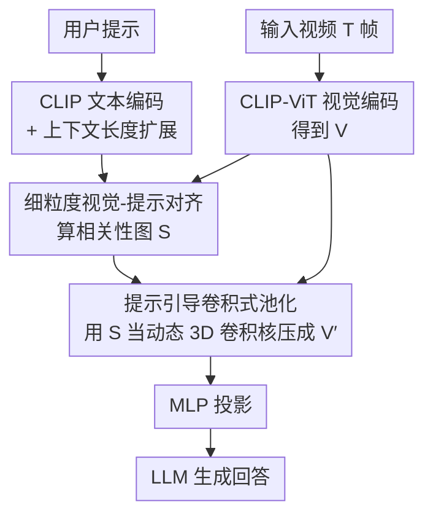

# PPLLaVA: Varied Video Sequence Understanding With Prompt Guidance

**会议**: ICLR 2026  
**OpenReview**: [https://openreview.net/forum?id=LOLhTA51tr](https://openreview.net/forum?id=LOLhTA51tr)  
**代码**: 待确认  
**领域**: 视频理解 / 多模态VLM  
**关键词**: Video LLM, 视觉 token 压缩, 提示引导池化, CLIP, 长视频理解

## 一句话总结
针对 Video LLM 因视觉 token 太多而低效的问题，PPLLaVA 用「CLIP 算出的提示-视频相关性图」作为动态 3D 卷积核去压缩 token，把视觉序列最多压到原来的 1/18，还能把和用户指令相关的关键画面保留下来，在 7 个视频理解 benchmark 上既提速又涨点。

## 研究背景与动机

**领域现状**：近一年的 Video LLM（LLaVA-Video、Qwen2.5-VL、InternVL3 等）处理视频的主流做法是把每帧的视觉 token 全部塞进 LLM，靠 LLM 超长上下文（动辄 16k+）来建模时序，从而支持长视频理解。

**现有痛点**：这种「全 token 塞进去」的做法计算开销巨大——视觉 token 数量庞大，推理慢、显存吃紧，难以在实时或资源受限场景部署。为了缓解，已有方法做 token 压缩：早期用时序平均池化（丢失时序动态）；长视频方向引入视觉记忆或关键帧选择（对短视频不灵活、且逐帧搜索很慢）；条件式 token 池化更通用，但**池化必然带来掉点**，所以现有模型只敢保守地压 4 倍，在效率和性能间将就。

**核心矛盾**：能不能压得更狠却不掉点？作者认为关键在于**视频本身的冗余**——关键信息往往集中在少数几帧，而且用户指令通常只关心视频的一小部分（图 1(a)：同一段视频，不同问题对应的关键片段完全不同），大量内容其实与当前问题无关。如果能在压缩时**只保留与指令相关的视觉特征**，就可能既省 token 又不掉点甚至涨点。

**切入角度**：Q-Former 能做到「token 压缩 + 指令交互」，但现代 MLLM 已经抛弃 Q-Former 转向更简单的线性投影 / MLP（更好训、推理更快）。作者由此提出核心问题：能不能设计一种池化策略，**既有 Q-Former 的 token 效率与指令对齐能力，又保留当前主流模型的简洁与可扩展性**？

**核心 idea**：用 CLIP 算出的「提示-视频 token 相关性权重」当作一个**动态 3D 卷积核**去做加权池化，把视觉 token 压成任意目标尺寸的同时，把权重高（与指令相关）的画面信息浓缩保留下来。

## 方法详解

### 整体框架

PPLLaVA 和大多数 Video LLM 一样由「视觉编码器 + 映射层 + LLM」组成，但额外配了一个与视觉编码器配对的**文本编码器**（CLIP-text）。给定 $T$ 帧视频，先过 CLIP-ViT 视觉编码器得到视觉特征 $V \in \mathbb{R}^{T \times W \times H \times D}$；同时把用户问题送进 CLIP 文本编码器得到文本特征 $c$。接着进入核心的**提示引导池化（Prompt-guided Pooling）**模块：先算出每个视频 token 相对文本的相关性分数 $S$，再用 $S$ 当卷积核权重把 $V$ 压成 $V' \in \mathbb{R}^{T' \times W' \times H' \times D}$（压缩超过 90%），$V'$ 经 MLP 投影后作为最终视觉输入喂给 LLM 生成回答。$V'$ 不仅 token 远少于 $V$，而且浓缩的是与用户指令更相关的信息。

整个流程是「视觉/文本双路编码 → 对齐算权重 → 提示引导池化压缩 → 投影 → LLM」的清晰串行管线：

### 关键设计

**1. 细粒度视觉-提示对齐：用 CLIP 双塔算出每个视频 token 与指令的相关性**

要「只保留指令相关的画面」，先得知道哪些视频 token 与文本相关。作者直接复用原始 CLIP 的双编码器：把用户问题送进 CLIP 文本编码器，按 CLIP 训练惯例只取文本的 CLS token 得到 $c \in \mathbb{R}^D$；再对每个位置 $(t,w,h)$ 的视频 token 计算它与文本的注意力分数，用 softmax 在全部时空位置上归一化：

$$s_{(t,w,h)} = \frac{\exp(\tau\, c \cdot f_{clipv}(v_{(t,w,h)}))}{\sum_{t}\sum_{w}\sum_{h} \exp(\tau\, c \cdot f_{clipv}(v_{(t,w,h)}))}$$

其中 $\tau$ 是 CLIP 温度系数，$f_{clipv}$ 是 CLIP 的视觉投影（多模态 LLM 平时不用它）。这里有个细节：$v_{(t,w,h)}$ 用的是 CLIP 倒数第二层的 patch token（而非训练时用的最后一层 CLS token），但因为 CLIP 末几层的空间表示相近，套上 $f_{clipv}$ 仍能把 patch token 映射进与文本交互的空间。这样得到的相关性图 $S=\{s_{(t,w,h)}\}$ 就是后续池化的「权重蓝图」，相比逐帧搜索关键帧的方法，它一次前向就能算出全部 token 的细粒度权重，几乎不增加额外参数。

**2. 提示引导卷积式池化：把相关性图当作动态 3D 卷积核做加权压缩**

拿到 token 级权重后怎么压？传统对比学习只要 1D 特征，但这里要**保留 3 维时空结构**让 LLM 还能做时序建模，所以作者用类似 3D 卷积的方式做池化。定义时空卷积核与步长分别为 $(k_t, k_w, k_h)$ 和 $(d_t, d_w, d_h)$，输出尺寸为：

$$T' = \frac{T-k_t}{d_t}+1,\quad W' = \frac{W-k_w}{d_w}+1,\quad H' = \frac{H-k_h}{d_h}+1$$

关键区别在于：这个卷积核的参数**不是学出来的固定权重，而是来自相关性图 $S$**，而且是**动态**的——核滑到 $V$ 的不同位置时，权重取自 $S$ 对应位置。输出位置 $(t,w,h)$ 的特征是核窗口内视频特征按 $S$ 加权求和：

$$v'_{(t,w,h)} = \sum_{i=0}^{k_t-1}\sum_{j=0}^{k_w-1}\sum_{k=0}^{k_h-1} v_{(t\cdot d_t+i,\, w\cdot d_w+j,\, h\cdot d_h+k)} \cdot s_{(t\cdot d_t+i,\, w\cdot d_w+j,\, h\cdot d_h+k)}$$

由于核大小与步长可自由调，输出维度可控，既能适配不同长度的视频，也方便和图像联合训练（图像设 $(1,3,3)$、视频设 $(2,3,3)$ 即可）。消融（表 5）显示这种「保留时空结构的加权平均」明显优于时空分离池化（结构被破坏，掉到 44.1）、max 池化（少数显著特征不足以代表整段视频）以及 TOME 式 token 合并（压缩比更低、效果还更差），印证了「维持 3D 结构 + 提示加权」是有效的组合。

**3. CLIP 上下文长度扩展：用非对称位置编码插值适配长提示**

CLIP-text 是唯一新增的参数，但它有个硬伤：上下文长度太短（CLIP 仅 77、SigLIP 仅 64），对单个物体或短描述够用，但对多模态 LLM 里的长提示、多轮对话就不够了。作者用**非对称位置编码扩展**来加长。常规做法要么末尾随机初始化新位置编码，要么按比率 $r$ 对原位置编码做线性插值：

$$P'_i = P_{\lfloor j \rfloor} + (j-\lfloor j \rfloor)\cdot(P_{\lfloor j \rfloor+1}-P_{\lfloor j \rfloor}),\quad j = i\cdot r$$

但作者发现**线性插值反而不如末尾随机初始化**——因为 CLIP 的位置编码已训练得很好，全局均匀插值会破坏预训练信息；又因为 CLIP 训练数据以短句为主，靠前的位置编码训得更充分。于是采用**非对称插值**：在新位置编码的前段用较大的 $r$（缩短插值距离、尽量保留训得好的前部信息），后段用较小的 $r$（拉长插值距离去扩展）。实现中 $i<20$ 时 $r=1$、$i\geq 20$ 时 $r=0.25$。这样在加长上下文的同时最大程度保住了 CLIP 的预训练知识，消融（表 3）显示加上它后长视频理解明显提升。

### 损失函数 / 训练策略

PPLLaVA 支持从图像域 LLM 或图文统一 MLLM **即插即用迁移**：因为是从训好的 MLLM 初始化，可以跳过昂贵的对比 / 对齐预训练，直接做指令微调。该阶段全量微调 LLM、投影 MLP 和 CLIP 文本编码器。训练数据混合多轮 / 单轮对话、图像 / 视频 / 多图等多种视觉输入，并采用**交错训练**——同一个 batch 内混合不同数据类型（而非一个 batch 只放一种），让模型同时适应多帧长视频和单帧图像，增强对不同长度视觉序列的适应力。视频统一采样 32 帧，池化核与步长 $(2,3,3)$，把视频 token 压 18 倍（远比 Qwen-VL / LLaVA-Video 的 4 倍激进）。全量训练在 16 张 A100 / 32 张 910B NPU 上约 36 小时。InternVL3 版本因其 InternViT-300M 经过大量后训练，作者用 LAION + Wukong 采样的 1000 万图文对重新做了一次对比预训练来对齐视觉-文本编码器。

## 实验关键数据

### 主实验

在 7 个视频理解 benchmark 上，PPLLaVA 接到三种不同底座（图像域 LLaVA-Next、视频域 LLaVA-Video、通用 InternVL3）后都能进一步涨点，验证了跨视觉编码器（CLIP / SigLIP / InternViT）的泛化性。

| 模型 | NextQA | EgoSchema | A-Net | VCG-Bench | MVBench | L-V-Bench | VideoMME(Overall) |
|------|--------|-----------|-------|-----------|---------|-----------|-------------------|
| LLaVA-OneVision | 79.4 | 60.1 | 56.6 | 3.49 | 56.7 | 56.4 | 58.2 |
| LLaVA-Video | 82.2 | 57.3 | 56.5 | 3.52 | 58.4 | 58.2 | 63.2 |
| InternVL3 | - | - | - | - | 75.4 | 58.8 | 66.2 |
| **PPLLaVA (LLaVA-Video)** | 84.1 | 61.6 | 59.7 | 3.66 | 58.8 | 60.4 | 64.5 |
| **PPLLaVA (InternVL3)** | 86.8 | 63.9 | 60.3 | 3.61 | 75.6 | 60.3 | 67.1 |

相比 LLaVA-OneVision，PPLLaVA-LLaVA-Video 在 NextQA / EgoSchema / ActivityNet / LongVideoBench / VideoMME 上分别提升 4.7% / 1.5% / 3.1% / 4% / 6.3%。在 30 分钟以上的长视频上，相近采帧但 token 少得多的情况下，仍比 LLaVA-Video / LLaVA-OneVision 高 3.7% / 7.6%，凸显其从高冗余长视频里高效抽取关键信息的能力。即便在以摘要 / 字幕类问题为主、用户问题信息量低的 VCG-Bench 上也领先，说明提升不只来自 CLIP 的语义对齐，模型确实学会了自适应抽取关键视觉特征。

### 消融实验

组件消融（表 3，VideoMME w/ subs，TP = 秒/视频）：

| 配置 | 上下文长度 | VCG-Bench Avg | VideoMME Overall | TP |
|------|-----------|---------------|------------------|----|
| LLaVA-Next（平均池化） | 576 | 3.09 | 43.4 | 2.9 |
| LLaVA-Next（不池化，全 token） | 4608 | 3.20 | 47.4 | 15.0 |
| + 提示引导池化 | 1024 | 3.21 | 48.9 | 4.6 |
| + CLIP 上下文扩展 | 1024 | 3.32 | 50.0 | 4.6 |

平均池化最快但性能最差；全 token 塞进去效果不错但吞吐极低（15.0 秒/视频）；提示引导池化把 token 压到 1024 后，吞吐回到 4.6，VideoMME 反超全 token 版（48.9 vs 47.4）；再加 CLIP 上下文扩展进一步涨到 50.0，长视频段提升尤其明显。

### 关键发现
- **提示引导池化是核心增益来源**：它同时改善效率和性能，把 token 压到 1024 还能反超「全 token」基线，说明大量视觉 token 确实是冗余甚至有害的。
- **保留 3D 时空结构很关键**：池化方式消融（表 5）里时空分离池化掉到 44.1（最差），加权平均（53.6）> max 池化（52.0）> token 合并（51.9），印证维持时空结构 + 提示加权的组合最优。
- **时空池化不对称**：空间维度增大核 / 步长时效率显著提升而性能几乎不掉（图 3）；时序维度则效率收益小、掉点更明显（图 4），故视频最终选 $(2,3,3)$ 折中。
- **图像任务也受益**：在 MMMU / MathVista / MMB 等图像 benchmark 上，PPLLaVA 把视觉 token 压到 1/9 仍优于 LLaVA-Next，说明它保住了预训练知识，对轻量化多模态 LLM 有潜力。

## 亮点与洞察
- **把「相关性图」直接当卷积核用**是最巧的一步：相关性分数不再只是过滤 / 选帧的标量，而是变成动态 3D 卷积权重，让「算相关性」和「做压缩」在一个算子里完成，结构极简、几乎不加参数。
- **量化了视频冗余**：借鉴 EgoSchema 的 certificate length（能回答问题的最短子片段长度），用 CLIP 自动算每帧与问答的相似度来度量冗余，并构造 Video-MME-redund 子集证明「人工选关键帧能普涨」，为「该压」提供了实证动机。
- **即插即用、免重训**：相比 Q-Former 要三阶段预训练，PPLLaVA 只在指令微调阶段引入，可从最先进 MLLM 无缝迁移，且支持灵活输出尺寸（图像 / 视频用不同核），工程上很友好。
- 「用户指令决定哪部分视频重要」这个观察可迁移到其他多模态压缩 / 检索场景：凡是输入冗余且查询稀疏的任务，都可以用查询引导的加权聚合替代盲目下采样。

## 局限与展望
- 池化依赖 CLIP 文本编码器算相关性，当**用户问题信息量很低**（如纯摘要 / 字幕类任务）时，相关性图退化为接近均匀，提示引导的优势会减弱——论文虽称仍领先，但收益主要来自训练而非对齐本身。
- 时序池化掉点比空间池化明显，说明**时序信息更脆弱**，激进压缩时序维度仍会损失动态细节，对强时序推理任务可能是瓶颈。
- CLIP-text 上下文扩展用的是经验性的非对称插值（$i<20$ 用 $r=1$、$i\geq20$ 用 $r=0.25$），分界点和比率偏 ad-hoc，缺乏更系统的设计。
- InternVL3 版本需要额外用 1000 万图文对重做对比预训练才能对齐，这部分并非完全「免预训练」，迁移成本在不同底座间不一致。

## 相关工作与启发
- **vs Q-Former（BLIP/InstructBLIP）**: 两者都做「token 压缩 + 指令交互」，但 Q-Former 参数和算力开销大（PPLLaVA 不到其 1/10）、要三阶段预训练、query 数固定（图像 / 视频要分别训）；PPLLaVA 只在指令微调引入、输出尺寸灵活、可从主流 MLLM 直接迁移。
- **vs 平均池化 / PLLaVA（AdaptiveAvgPool）**: 前者非参数地压 token 但丢失指令相关信息、只能保守压 4 倍；PPLLaVA 用提示加权能激进压到 18 倍还保住关键画面。
- **vs 关键帧选择类（VideoAgent / VideoTree / LVNet）**: 它们逐帧搜索关键帧、运行时开销大、本质是帧筛选策略；PPLLaVA 是完整模型框架，一次前向算出细粒度权重，反而显著提升 Video LLM 效率，且在 NextQA / EgoSchema 等上领先。

## 评分
- 新颖性: ⭐⭐⭐⭐ 「相关性图当动态 3D 卷积核」的视角新颖、简洁有效，但底层仍是提示加权池化的延伸。
- 实验充分度: ⭐⭐⭐⭐⭐ 7 个视频 benchmark + 三种底座 + 图像任务 + 池化方式 / 池化尺寸多维消融，覆盖充分。
- 写作质量: ⭐⭐⭐⭐ 动机—方法—实验逻辑清晰，公式与冗余度分析到位，少数实现细节（非对称插值分界）偏经验。
- 价值: ⭐⭐⭐⭐⭐ 18× token 压缩兼顾性能与效率，对长视频理解和轻量化部署有直接实用价值。

<!-- RELATED:START -->

## 相关论文

- [\[CVPR 2026\] FlashMotion: Few-Step Controllable Video Generation with Trajectory Guidance](../../CVPR2026/video_understanding/flashmotion_fewstep_controllable_video_generation.md)
- [\[CVPR 2026\] Learning from Synthetic Data via Provenance-Based Input Gradient Guidance](../../CVPR2026/video_understanding/learning_from_synthetic_data_via_provenance-based_input_gradient_guidance.md)
- [\[CVPR 2026\] SAM2Text: Towards Prompt-Free and Multi-Resolution Video Scene Text Segmentation](../../CVPR2026/video_understanding/sam2text_towards_prompt-free_and_multi-resolution_video_scene_text_segmentation.md)
- [\[ICLR 2026\] ScaleLong: A Multi-Timescale Benchmark for Long Video Understanding](scalelong_a_multi-timescale_benchmark_for_long_video_understanding.md)
- [\[ICLR 2026\] FOCUS: Efficient Keyframe Selection for Long Video Understanding](focus_efficient_keyframe_selection_for_long_video_understanding.md)

<!-- RELATED:END -->
