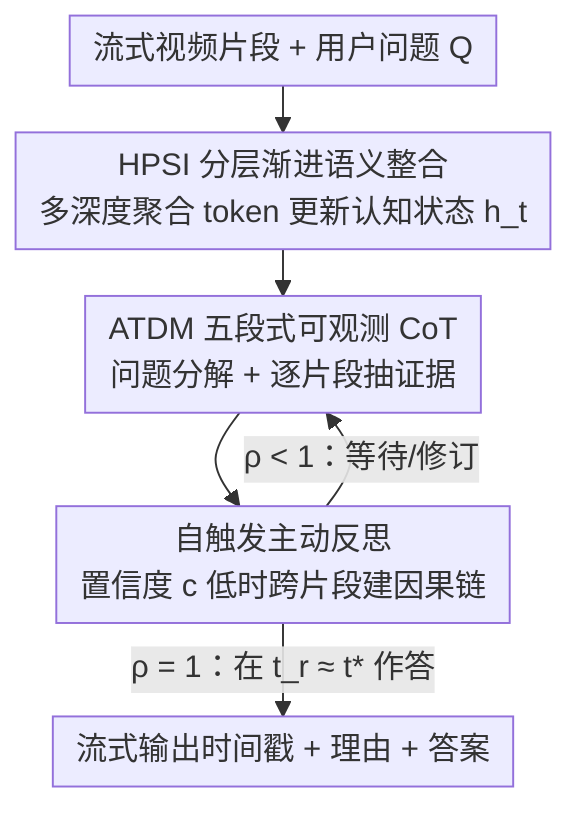

# Progressive Online Video Understanding with Evidence-Aligned Timing and Transparent Decisions

**会议**: ICLR 2026  
**OpenReview**: [https://openreview.net/forum?id=oKB0CacHaM](https://openreview.net/forum?id=oKB0CacHaM)  
**领域**: 视频理解 / 多模态VLM  
**关键词**: 在线视频理解, 流式推理, 证据对齐时机, 决策透明, 分层记忆

## 一句话总结
针对"在线流式视频里到底该在哪一帧作答"这个被离线评测忽视的问题，本文提出 Thinking-QwenVL 框架，用一个把进度 $\rho$ 和置信度 $c$ 外显出来的透明决策控制器（ATDM）让回答时机对齐到"证据首次充分"的时刻 $t^\star$，并用一套跨片段传播的可学习聚合 token（HPSI）在 token 预算内维护全局因果状态，把 StreamingBench 的 SOTA 从 67.63% 提到 71.60%。

## 研究背景与动机
**领域现状**：主流视频大模型（VideoLLaMA3、InternVL3、Qwen2-VL 等）几乎都在"离线"理想设定下评测——整段视频预先加载好，帧可以反复检索和重编码，模型先全局推理再生成答案。这套做法擅长压缩海量视觉 token、在长视频上做问答。

**现有痛点**：真实场景里用户在时刻 $t_q$ 提问，但能支撑回答的"首次充分证据"往往要到 $t^\star$ 才出现。离线流水线绕开了交互场景最关键的需求——证据对齐的回答时机。已有的流式方法又分两类，都不令人满意：固定时机一类（StreamBridge、Flash-VStream、VideoLLM-Online 等）直接令 $t_r = t_q$，提问即作答，根本不判断证据够不够；时机判定一类（Dispider 用二值"可答/不可答"头、Timechat-Online 把可答性绑定到场景切换）则把时机决策塌缩成一个黑箱开关，用户看不到时间戳、中间结论和进度，且没有合理的停止准则，容易长时间卡在"不可答"状态，看起来像死机。

**核心矛盾**：在线设定下三件事同时变得致命——决策透明性（黑箱 0/1 门毁掉可控性和信任）、回答时机对齐（要最小化 $\delta = |t_r - t^\star|$ 又不能牺牲正确性）、紧预算下的全局因果更新（新片段到来时要全局修订假设、传播时空约束，而不是只做近视的片段局部更新把故事线和因果一致性搞断）。这三者背后是同一个根因：把"推理控制"和"记忆整合"耦合在一个不可观测的过程里。

**本文目标**：把在线视频理解拆成两个可独立解决的子问题——(1) 让回答时机对齐证据、且整个决策过程对用户可见可审计；(2) 在 token/延迟预算内维护一个随流不断精炼、保留跨片段关系的紧凑认知状态。

**切入角度**：作者的关键观察是——透明性不应是事后解释，而应是一等目标；把一个不透明的门替换成多阶段、可观测的决策过程，外显出证据对齐的时间戳、阶段进度 $\rho$、简短理由和预估回答时刻 $t_r$，置信度 $c$ 低时还能自触发跨片段反思。

**核心 idea**：解耦"推理控制"与"记忆整合"——用一个外显 $(\rho, c)$ 的透明思考控制器（ATDM）决定何时作答，用一套跨片段传播的分层聚合 token（HPSI）维护全局因果状态，二者协同实现"证据一出现就立刻、且讲清为什么"的在线作答。

## 方法详解

### 整体框架
Thinking-QwenVL 把在线视频理解形式化为：给定可见片段集合 $V_t = \{v_1, \dots, v_t\}$ 和一个紧凑认知状态 $h_t$，每来一个新片段 $v_{t+1}$，先由 HPSI 更新状态 $h_{t+1} = U(h_t, v_{t+1})$；然后 ATDM 在 $h_{t+1}$ 之上把"证据对齐的回答时机决策"分解成一串子目标 $S$，维护带时间索引的三元组 $(a_s(t), c_s(t), \rho_s(t))$（子答案、置信度、进度），决定是现在作答（输出 $t_r$）还是继续等待/反思。当所有子目标都被自信地解决（$\rho(t_i)=1$）时，模型在 $t_r = t_i \approx t^\star$ 给出最终答案，整个过程中时间戳和中间结论实时流式输出给用户。

整条 pipeline 是"记忆侧（HPSI）+ 控制侧（ATDM）"双路解耦、逐片段推进的，结构清晰，因此用一张框架图图文对照：

### 关键设计

**1. HPSI：用分层聚合 token 在固定预算内维护可传播的全局因果状态**

这一设计针对"紧预算下的全局因果更新"痛点。朴素做法要么把整段视频的视觉 token 全塞进上下文（爆预算），要么像 LongVA 那样单层平均池化压缩（丢层次、丢时序关系）。HPSI 的做法是把"压缩"分散到 transformer 的不同深度上去做：在原始输入 $I = \text{concat}(w, v, w)$ 的每个片段视觉 token 后面，按三个聚合层级 $j \in \{1,2,3\}$、分别在深度 $\ell_j \in \{0, L/3, 2L/3\}$ 处插入可学习聚合 token $p^{(j)}_{\text{clip}_i}$，目标 token 比例为 $3\times : 2\times : 1\times$，逐级把稠密视觉流压成更少、语义更浓的 token。每个聚合 token 由对其片段视觉 token 的自适应平均池化初始化：$p^{(j)}_{\text{clip}_i} = \text{AdapterPool}(p^{(j-1)}_{\text{clip}_i}, (4-j)N_{vc})$。

关键在于一套结构化稀疏注意力掩码强制"分层可见性"：第 $j$ 级聚合 token 只能看前一级 token，保证语义单向收敛；文本 token 在每层只因果地注意到最高级聚合 token；同时保留每个片段首帧 token 的可见性作为锚点线索。这样浅层 $[0, L/3]$ 整合原始视觉证据、中层 $[L/3, 2L/3]$ 整合上一级 token、深层 $[2L/3, L]$ 精炼高层语义，等于把"transformer 深度"当成"聚合分工"而非单次池化。训练上还有一项渐进整合目标约束聚合 token 既贴近片段证据池化、又在层级间平滑精炼：$\min T_{\text{integration}} = \sum_l \sum_j (\|p^{(j)(l)}_{\text{clip}_i} - \text{Pool}(v_{\text{clip}_i})\|^2 + \|p^{(j)(l)}_{\text{clip}_i} - p^{(j-1)(l)}_{\text{clip}_i}\|^2)$。由于这些 $p$ token 被跨片段前向携带，作为 $h_t$ 的一部分随新片段不断精炼，于是实现了因果、保关系的全局更新，且不撑爆 token 预算。

**2. ATDM：把在线作答变成外显遥测的五段式可观测思维链**

这一设计直击"决策透明性 + 时机对齐"两个痛点。它不再用一个不透明的 0/1 门，而是把回答时机决策 $t_r = \min\{t \mid F(h_t, Q) = A\}$ 因子化成一条携带显式遥测的紧凑思维链，整体是五段（仅 Part-3、Part-4 需要跨片段迭代，其余不必对每个片段都顺序跑全五段）：

$$\text{Part-1 问题引导的字幕指令} \to \text{Part-2 问题分解} \to \text{Part-3 片段字幕} \to \text{Part-4 子答案填充} \to \text{Part-5 主动思考}$$

Part-1 先让模型分析问题、自己生成一份"观察要求清单"$CI_q$，把字幕聚焦到与问题相关的元素上（避免通用字幕模型那种"有人在杂乱厨房做饭"的泛泛描述）；Part-2 把原问题分解成一组具体可验证的子问题 $\{S_q\}$（聚焦物体/人物/动作/空间关系等可观测维度），用以量化决策进度；Part-3 在 $CI_q$ 指导下对当前片段生成字幕 $\{C_q\}$；Part-4 用 $\{S_q\}$ 和当前字幕逐个回答子问题，给出 $(value, c)$ 和进度 $\rho$，并把最近的子答案状态回喂给模型以跨帧追踪历史。这样进度 $\rho \in [0,1]$ 和置信度 $c \in [0,1]^K$ 被显式外露，用户能看到"现在进展到哪、为什么现在答/为什么等"，当所有子答案都被自信解决时模型才宣布就绪并在 $t_r \approx t^\star$ 作答。一个模块化的调度器还会把相邻片段（$\text{clip}_i, \text{clip}_{i+1}, \dots$）的证据抽取与子答案更新并行起来，减少空闲、保持响应性。

**3. 自触发主动反思：用 $(\rho, c)$ 把记忆无关的二值决策升级成历史感知的控制过程**

这一设计解决"近视更新破坏故事线/因果一致性"的问题，对应框架图里的反馈回环。刚性的逐步推理容易陷入隧道视野，错过全局连贯信息和持续变化信息间的关系。ATDM 因此监控每个子答案的置信度：当分数骤降或长期偏低（如 $\le 0.50$）、或流出现重大语义切换时，自触发"主动思考"——回看此前字幕 $\{C_q\}$、检测时序漂移、跨片段构建显式有序的因果链（说明每个新片段的证据是支持、矛盾还是精炼当前假设），做一致性检查后更新属性列表与 $(\rho, c)$。本质上，连续的 $(\rho, c)$ 对比单个 0/1 门携带高得多的信息量：它把整段中间判断的历史压进一个紧凑的量化状态里，让"当前证据是否充分"不再是一连串孤立的、记忆无关的 yes/no，而是能够基于自身过往决策与分数被修订的、真正历史感知的控制。

### 一个完整示例
以论文给的可视化例子走一遍：问题在 0:02:06 提出——"街道右侧现在能看到什么文字？"（选项含 Excavator / CRANE / WEST NEW YORK / Loader）。Part-1 先定出观察要求：右侧文字内容及位置、各候选物体的识别、指示"WEST NEW YORK"的语境标志。Part-2 分解出三个子问题：右侧是否有文字 / 是什么文字 / 是否有其他物体，三者初始 value 都是"?"、confidence 0.0、进度 0。Part-3 对 0:01:04–0:02:08 这段片段生成聚焦字幕（描述雨天纽约街景、右侧施工护栏与橙色围挡、可见"WEST NEW YORK"标牌、护栏后露出挖掘机和装载机）。Part-4 据此填充子答案：前两个子问题答"WEST NEW YORK"（c=0.95）、第三个答"excavator, crane, loader"（c=0.85），进度推到 100。期间在 0:01:36 触发过一次 Part-5 主动思考（因果链判定"无相关证据则保持属性状态不变"）。当 $\rho$ 达到 1，模型即在该时刻作答，回答时机对齐到证据首次充分的 $t^\star$。

### 损失函数 / 训练策略
HPSI 的核心训练目标是上文的渐进整合损失 $T_{\text{integration}}$（式 5），鼓励聚合 token 既忠实整合片段证据、又在层级间平滑精炼；层间插入用指示函数 $\mathbb{I}_{l \in L_j}$ 控制（触发插入的层用新序列、其余层沿用上一层输出，见式 3、式 4）。整体在 Qwen-VL 类视觉-语言解码器上实例化，采用单遍、单轮的流式范式（与传统流式方法对齐，而非 StreamBridge 的多轮处理）。

## 实验关键数据

### 主实验
在多个为在线视频理解设计的 benchmark 上评测，Thinking-QwenVL 全面取得强结果，同时保持有竞争力的长视频性能。

| 数据集 | 指标 | 本文 | 之前SOTA | 说明 |
|--------|------|------|----------|------|
| StreamingBench | Acc | **71.60%** | 67.63% | 实时视觉理解任务，+3.97 |
| OVOBench | Acc | 46.9% | — | 在线视频理解 |
| OVBench | Acc | 35.6% | — | 在线视频理解 |
| RTVBench | Acc | 35.9% | — | 实时视频 |
| VideoMME | Acc | 67.7% | — | 长视频，保持竞争力 |
| MLVU | Acc | 68.3% | — | 长视频，保持竞争力 |

StreamingBench 上还显著超过 Gemini 1.5 Pro（75.69，注：该列为不同设定的专有模型参考）、GPT-4o（73.28）等之外的开源离线长视频模型（如 LongVA、Video-CCAM 多在 50–54 区间），体现在线流式设定下的优势。

### 消融实验

| 配置 | 关键能力 | 说明 |
|------|---------|------|
| Full（ATDM + HPSI） | 透明决策 + 全局因果记忆 | 完整模型，证据对齐时机最佳 |
| w/o ATDM | 失去透明 $(\rho,c)$ 与时机对齐 | 退化为固定/黑箱时机，$\delta$ 增大 |
| w/o HPSI | 失去跨片段因果状态 | 长视频与跨片段关系保持能力下降 |

### 关键发现
- 两个模块互补：ATDM 主要拉动证据对齐时机与流式可解释性（StreamingBench 等在线指标），HPSI 主要支撑分段注意力感知和跨片段因果关系保持，因此即便在 VideoMME/MLVU 这类长视频上也能保持竞争力。
- 透明的 $(\rho, c)$ 不只是 UI 友好——它把历史判断压进上下文，作为高信息量状态反过来改善决策质量（相比单个 0/1 门）。
- 自触发反思对置信度长期偏低/语义骤变的场景尤其有用，能纠正近视更新带来的故事线断裂。

## 亮点与洞察
- **把"透明性"提到一等目标**：多数工作把可解释当事后产物，本文直接让决策过程外显时间戳、进度、理由，既服务可控交互又反哺决策质量——这是把 UX 需求转成建模目标的巧妙一步。
- **用 transformer 深度做"聚合分工"**：HPSI 把浅/中/深层分别分配给"保细粒度局部证据/整合中程模式/强语义浓缩"，比单层池化更尊重信息的层次结构，且天然在预算内逐级压缩。
- **$(\rho, c)$ 作为可迁移的控制信号**：把"何时停止"从孤立二值判断升级为携带历史的连续量，这个思路可迁移到任何需要"在线决定何时输出"的流式 agent（语音、传感器流、机器人感知）。
- **证据对齐时机的形式化 $(t_q, t_r, t^\star, \delta)$**：给"该在哪一帧作答"提供了清晰可优化的目标，是该子领域有价值的问题定义。

## 局限与展望
- 评测主要在 StreamingBench/OVOBench 等基准上，$t^\star$ 的标注本身带主观性，"证据首次充分"在很多复杂查询里难以精确界定。
- 五段式 CoT 引入额外的 token 与推理开销，虽有并行调度缓解，但在极低延迟/算力受限的边缘设备上是否仍划算，文中未充分讨论。
- 置信度 $c$ 由模型自评，可能存在过自信/欠自信导致时机偏移；自触发反思的阈值（如 $\le 0.50$）是否对不同任务鲁棒、是否需要自适应，值得进一步研究。
- 仅在 Qwen-VL 系实例化，方法对其他骨干（更强多模态模型、纯音视频流）的可移植性有待验证。

## 相关工作与启发
- **vs 固定时机流式方法（StreamBridge / Flash-VStream / VideoLLM-Online）**：它们令 $t_r = t_q$、提问即答，只优化流式读出/对齐/记忆，不做时机决策；本文显式对齐 $t_r$ 到 $t^\star$，避免"证据真空"等待。
- **vs 时机判定方法 Dispider**：Dispider 压缩入流片段后用二值头判可答性，决策不透明、缺乏停止准则、易长时间卡在不可答态；本文用可观测的 $(\rho, c)$ 多阶段决策取代黑箱门。
- **vs Timechat-Online**：它把可答性绑定到场景切换，但场景变化不等于证据充分，对阈值脆弱敏感；本文以"子问题是否被自信解决"为准则，更贴合证据语义。
- **vs 离线长视频整合（LongVA 单层池化 / VideoRAG 检索）**：它们假设全视频可见、主攻 token 削减；HPSI 在流式约束下做分层渐进整合，兼顾压缩与跨片段因果关系保持。

## 评分
- 新颖性: ⭐⭐⭐⭐⭐ 把证据对齐时机与决策透明形式化为一等目标，并解耦推理控制与记忆整合，问题定义和方法都新。
- 实验充分度: ⭐⭐⭐⭐ 覆盖 4 个在线 benchmark + 2 个长视频，SOTA 明显；但 $t^\star$ 标注主观性、时机指标 $\delta$ 的细粒度分析可更充分。
- 写作质量: ⭐⭐⭐⭐ 动机层层递进、符号体系清晰；HPSI 的注意力掩码与层级插入细节略密集。
- 价值: ⭐⭐⭐⭐⭐ 面向真实交互的在线视频 agent 是刚需方向，透明决策 + 证据对齐的范式有较强可迁移性。

<!-- RELATED:START -->

## 相关论文

- [\[CVPR 2026\] PyraTok: Language-Aligned Pyramidal Tokenizer for Video Understanding and Generation](../../CVPR2026/video_understanding/pyratok_language-aligned_pyramidal_tokenizer_for_video_understanding_and_generat.md)
- [\[AAAI 2026\] FineVAU: A Novel Human-Aligned Benchmark for Fine-Grained Video Anomaly Understanding](../../AAAI2026/video_understanding/finevau_a_novel_human-aligned_benchmark_for_fine-grained_video_anomaly_understan.md)
- [\[ICML 2026\] VideoSEAL: Mitigating Evidence Misalignment in Agentic Long Video Understanding by Decoupling Answer Authority](../../ICML2026/video_understanding/videoseal_mitigating_evidence_misalignment_in_agentic_long_video_understanding_b.md)
- [\[CVPR 2025\] ViTED: Video Temporal Evidence Distillation](../../CVPR2025/video_understanding/vited_video_temporal_evidence_distillation.md)
- [\[CVPR 2026\] HERBench: A Benchmark for Multi-Evidence Integration in Video Question Answering](../../CVPR2026/video_understanding/herbench_a_benchmark_for_multi-evidence_integration_in_video_question_answering.md)

<!-- RELATED:END -->
