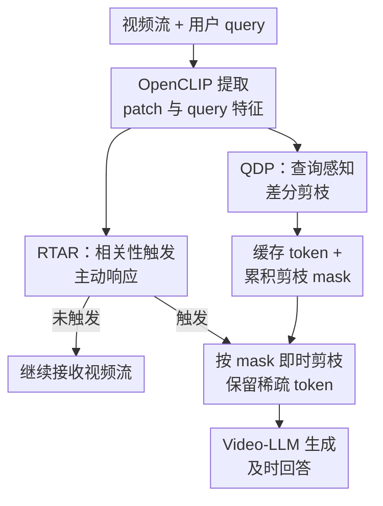

# QueryStream: Advancing Streaming Video Understanding with Query-Aware Pruning and Proactive Response

**会议**: ICLR2026  
**OpenReview**: [https://openreview.net/forum?id=738HjJEbml](https://openreview.net/forum?id=738HjJEbml)  
**代码**: https://github.com/Zhangkr2003/QueryStream  
**领域**: 视频理解 / 流式视频理解  
**关键词**: 流式视频理解, 查询感知剪枝, 主动响应, 视频大模型, 视觉 token 压缩

## 一句话总结
QueryStream 把用户 query 直接接入流式视频的 token 剪枝和响应调度，用查询感知差分剪枝 QDP 过滤无关且重复的视觉 token，再用 RTAR 在“相关且有新信息”的时刻主动触发 Video-LLM，从而在保留约 30%-57% token 的情况下达到或超过强 online baseline。

## 研究背景与动机
**领域现状**：视频理解正在从离线问答走向在线交互。自动驾驶、具身智能、直播监控、实时剪辑等场景里，模型不能等完整视频结束后再统一分析，而要一边接收无界视频流，一边判断哪些内容值得保留、什么时候该回答用户。当前 Video-LLM 已经很强，但多数仍按离线批处理思路处理视频，把一段视频当成有限帧集合送入模型。

**现有痛点**：流式视频的主要困难不是“模型看不懂一帧”，而是信息量持续增长且高度冗余。每一秒都把完整视觉 token 塞给 Video-LLM，计算和延迟都会爆炸；但如果只用普通变化检测，又容易把镜头切换、黑屏、背景运动等视觉变化误当成重要事件。TimeChat-Online 这类方法的“change-is-important”假设很自然，却把视觉动态性和用户真正关心的语义相关性混在了一起。

**核心矛盾**：在线视频理解需要同时解决两个问题：一是“该看什么”，即在连续 token 流中保留和 query 有关的新信息；二是“何时开口”，即不要在无关变化发生时抢答，也不要错过短暂但关键的相关事件。只看视觉变化会误触发，只看 query 相关性又可能对静态但相关的画面重复响应。

**本文目标**：作者希望构建一个轻量、无需额外训练、可插入现有 Video-LLM 的流式视频理解模块。它要在 token 层减少无用上下文，在交互层主动选择响应时机，并且不能依赖重训练的专用调度器。

**切入角度**：论文的关键观察是：视频流里的冗余并不是绝对的，而是相对于用户意图而言的。一个剧烈变化的画面如果和问题无关，就应该被剪掉；一个缓慢变化的动作如果正是 query 所问，就应该被保留并可能触发回答。

**核心 idea**：用 query-aware 的语义相关性和动态历史下的时间新颖性共同决定 token 保留，再用相关性门控和信息密度门控共同决定主动响应时机。

## 方法详解

### 整体框架
QueryStream 是放在原始视频流和主干 Video-LLM 之间的智能网关。它不改造 Qwen2.5-VL 或 TimeChat-Online 这类主干模型，而是用轻量的 OpenCLIP 编码器持续观察视频帧与用户 query，把视觉 token 缓存在内存里，同时为每一帧生成剪枝 mask 和响应触发信号。

整体流程可以理解为两条并行路径：QDP 负责生成每一帧“哪些 patch token 值得保留”的 mask；RTAR 负责判断“当前是不是该让 Video-LLM 生成回答”。只有 RTAR 触发时，系统才把此前缓存的原始视觉 token 按 QDP mask 做 just-in-time 剪枝，再连同 query 输入 Video-LLM。

这个设计的一个重要细节是：QDP 先决定 mask，但不立刻把原始 token 全部送进 Video-LLM；RTAR 只有在合适时刻才真正激活主干模型。这样可以把“持续低成本观察”和“少量高成本推理”分开，符合流式场景对低延迟和低计算的要求。

### 关键设计
**1. QDP 双条件剪枝：只保留既相关又新鲜的视觉 token**

传统差分剪枝主要看前后帧是否变化，默认变化越大越重要。QueryStream 的 QDP 则把每个 patch token 放进两个筛子：先看它和 query 是否语义相关，再看它相对动态历史是否足够新。对第 $t$ 帧第 $i$ 个 patch，OpenCLIP 提取 patch 特征 $v_t^i$，同时提取 query embedding $q$。语义 mask 用当前帧内的平均相似度作为自适应阈值：

$$
M_{sem}(t,i)=I\left( sim(q,v_t^i)>\frac{1}{N}\sum_{j=1}^{N}sim(q,v_t^j)\right)
$$

这个阈值不是固定常数，而是随每一帧的整体相似度变化。复杂场景里它会自动要求 patch 在本帧内部更突出，简单场景里又不会因为绝对相似度偏低而全部丢弃。

时间新颖性则不直接和上一帧比较，而是和每个 patch 位置的动态平滑历史 $\bar v_{dsh,t-1}^i$ 比较：

$$
M_{temp}(t,i)=I\left(sim(v_t^i,\bar v_{dsh,t-1}^i)<\tau_{temp}\right)
$$

最终剪枝 mask 是两个条件的交集：

$$
M_{QDP}(t,i)=M_{sem}(t,i)\land M_{temp}(t,i)
$$

这意味着一个 token 只有在“和问题有关”且“相对历史真的带来新信息”时才会进入下游。镜头切换、黑屏、背景运动即使视觉变化很大，如果和 query 无关，也不会触发大量 token 保留；而缓慢但 query 相关的动作，因为会持续偏离历史状态，仍可能被识别为有用信息。

**2. 动态平滑历史 DSH：用中期记忆替代脆弱的相邻帧差分**

相邻帧差分在流式视频里很脆弱。快速噪声、黑屏、抖动会让差分突然变大；缓慢动作又可能每一帧变化都很小，导致真正事件被忽略。QueryStream 为每个 patch 位置维护动态平滑历史 DSH，并用指数平滑更新：

$$
\bar v_{dsh,t}^i=\alpha\cdot v_t^i+(1-\alpha)\cdot \bar v_{dsh,t-1}^i
$$

论文默认使用 $\alpha=0.1$，它让历史表示既不完全停留在很久以前，也不会被单帧噪声立刻带偏。附录的敏感性实验显示，$\alpha=1.0$ 退化成近似相邻帧比较，会因为对噪声过敏而效果较差；过小的 $\alpha$ 又会让历史记忆过长，适应太慢。这个中期历史正好适合流式视频：它把“短暂视觉冲击”和“持续语义变化”区分开。

QDP 在保留 patch 时还会保留对应的 M-ROPE 位置信息，丢弃 token 时也丢弃其位置嵌入。这样稀疏 token 进入 Video-LLM 后仍保持原始的时间、高度、宽度坐标，不会因为剪枝破坏时空结构。

**3. RTAR 双门控响应：相关性决定能不能说，信息密度决定值不值得说**

QDP 解决的是“看什么”，RTAR 解决的是“什么时候开口”。QueryStream 不用额外训练的 EOS 预测器，也不只看 token 变化幅度，而是用两个逻辑门共同触发响应。第一道门是相关性条件 $R_t$：把当前帧的平均视觉特征 $\bar v_t$ 和 query embedding $q$ 比较，只有相似度超过阈值 $\tau_{rel}$ 才认为当前画面主题和问题有关：

$$
R_t=I(sim(q,\bar v_t)>\tau_{rel})
$$

第二道门是信息密度条件 $D_t$：它直接复用 QDP 的 token keep rate，衡量当前帧中有多少 token 同时通过了“相关 + 新鲜”的筛选。若 keep rate 超过 $\tau_{den}$，说明此刻有足够多的新 query-relevant 信息涌入：

$$
D_t=I\left(\frac{1}{N}\sum_{i=1}^{N}M_{QDP}(t,i)>\tau_{den}\right)
$$

最终触发信号为 $T_t=R_t\land D_t$。这个双门控避免了两个常见失败：只看密度会被无关视觉变化误触发；只看相关性会在静态但相关的画面上反复回答。论文在 OVO-Bench 的 Forward Active Responding 消融中也验证了这一点：Relevance-Only 的准确率略高，但时机得分低；Full RTAR 的及时性得分明显更好。

**4. 即插即用的训练自由模块：把高成本推理推迟到必要时刻**

QueryStream 的工程取向很明确：它不是再训练一个新的 Video-LLM，而是用 OpenCLIP-ViT-L/14 这类轻量 VLM 编码器做前端判断，主干则可以接 Qwen2.5-VL-7B 或 TimeChat-Online-7B。QDP mask 先在流式处理过程中积累，原始 token 暂存在 buffer 中，只有 RTAR 触发后才应用 mask 并调用主干解码。

这种方式的优势是可迁移性强。实验里 QDP 还能直接插到离线 Qwen2.5-VL-7B 上，作为长视频上下文去噪模块使用，并且在 VideoMME 上用约一半 token 反而超过 full-token baseline。这说明 QueryStream 的价值不只是省计算，而是减少了与 query 无关的视觉噪声，让模型面对更干净的上下文。

### 一个完整示例
假设用户的问题是“当画面中有人拿起红色杯子时提醒我”。视频开始时人物在房间里走动，背景有灯光变化，甚至中间出现一次黑屏切换。传统 change-based 方法可能会因为黑屏或镜头切换保留大量 token，并过早触发回答；QueryStream 会先用语义相关性筛掉和“红色杯子”无关的 patch，再用 DSH 判断这些 patch 是否相对历史有真实新变化。

当人物只是走过桌子但没有接触杯子时，$R_t$ 可能还不够高，或者 QDP keep rate 很低，RTAR 保持沉默。等手部接近并拿起红杯时，与 query 相关的 patch 同时变得语义相关且相对历史新颖，QDP keep rate 上升，$R_t$ 与 $D_t$ 同时满足，系统才把缓存中的有效 token 剪出来交给 Video-LLM 生成回答。这个例子体现了本文的核心：不是看到“画面变了”就说话，而是看到“用户关心的东西发生了新变化”才说话。

### 损失函数 / 训练策略
QueryStream 本身没有训练损失，是 training-free 的逻辑模块。实验中用 OpenCLIP-ViT-L/14 提供 patch-level 和 query-level 特征，DSH 的平滑因子设为 $\alpha=0.1$。阈值 $\tau_{temp}$、$\tau_{rel}$、$\tau_{den}$ 在 OVO-Bench 的一个小验证集上选择，并固定用于所有主要实验。

附录给出的阈值选择比较清楚：$\tau_{temp}=0.90$ 在验证集上达到最佳整体分数，保留率为 52.9%；RTAR 中 $\tau_{rel}=0.60$、$\tau_{den}=0.15$ 在 Forward Active Responding 的时机得分最高。作者强调所有结果均为 zero-shot plug-and-play，不对主干 Video-LLM 额外微调。

## 实验关键数据

### 主实验
论文同时评估在线流式视频理解和离线长视频理解。在线部分使用 StreamingBench 与 OVO-Bench，离线部分使用 VideoMME 和 LongVideoBench；主要指标是准确率或 benchmark 平均分，效率指标是 Token Keep Rate。

| 数据集 | 设置 | 本文 QueryStream | 主要对比方法 | 提升 / 结论 |
|--------|------|------------------|--------------|-------------|
| StreamingBench | 1 fps, keep 57.2% | 75.32 | TimeChat-Online keep 55.8%: 74.32 | 同等 token 预算下 +1.00，接近 full-token TimeChat-Online 75.36 |
| StreamingBench | 1 fps, keep 29.6% | 74.04 | TimeChat-Online keep 33.0%: 72.96 | 更少 token 下仍 +1.08 |
| OVO-Bench | 1 fps, keep 52.9% | 49.4 | TimeChat-Online full-token: 46.7 | 在线模型中达到新 SOTA，且超过 full-token baseline +2.7 |
| OVO-Bench | 1 fps, keep 20.0% | 47.5 | TimeChat-Online keep 15.2%: 45.6 | 激进剪枝下仍保持明显领先 |
| VideoMME | QueryStream keep 52.4% | 63.8 | TimeChat-Online keep 53.7%: 63.3 | 离线长视频上 +0.5 |
| LongVideoBench | QueryStream keep 16.6% | 58.0 | TimeChat-Online keep 15.0%: 57.7 | 长视频高冗余场景中激进 query-aware 过滤反而更好 |

在 StreamingBench 上，QueryStream 的优势主要来自 query-aware 的上下文去噪。论文特别提到在 Causal Reasoning 和 Text-Rich Understanding 等推理较重的子任务上，57.2% keep rate 的 QueryStream 分别比对应 TimeChat-Online 配置高 0.79 和 0.94 分。

在 OVO-Bench 上，提升更明显，因为该 benchmark 包含 Real-Time Visual Perception、Backward Tracing、Forward Active Responding 三类任务。QueryStream 在 Backward Tracing 和 Forward Active Responding 上改善较大，说明它不仅压 token，还改善了复杂时序推理所依赖的上下文质量。

### 消融实验
| 配置 | Keep Rate / 指标 | 结果 | 说明 |
|------|------------------|------|------|
| No Pruning baseline | 100.0% keep | StreamingBench 75.36 | full-token TimeChat-Online 参考上限 |
| Visual Pruning Only | 63.4% keep | 74.76 | 只看视觉变化会剪掉部分有用语义 |
| Semantic Pruning Only | 61.7% keep | 74.52 | 只看 query 相关性不够区分新旧信息 |
| Full QDP | 57.2% keep | 75.32 | 两个筛子取交集，在更低 token 下接近 full-token |
| Density-Only trigger | OVO FAR Acc 36.8 / Score 29.5 | 最低 | 容易被无关动态事件触发 |
| Relevance-Only trigger | Acc 40.3 / Score 30.2 | 准确率高但时机差 | 静态相关画面也会重复触发 |
| Full RTAR | Acc 40.2 / Score 34.6 | 时机得分最高 | 相关性与信息密度同时满足才回答 |

### 关键发现
- QDP 的两个条件是互补的。只用语义过滤或只用视觉变化过滤都会降分，而取交集后既减少 token 又恢复接近 full-token 的表现，说明“相关但旧”和“新但无关”都是应该剪掉的噪声。
- DSH 的平滑因子很关键。$\alpha=1.0$ 太像逐帧差分，容易被噪声触发；$\alpha$ 过小又太迟钝。论文选择 $\alpha=0.1$，在 OVO-Bench 上达到较好的性能和剪枝平衡。
- RTAR 的优势主要体现在及时性。Relevance-Only 的 Acc. 为 40.3，Full RTAR 为 40.2，二者几乎相同；但 Full RTAR 的时机得分是 34.6，比 Relevance-Only 的 30.2 高很多，说明密度门控不是为了答得更准，而是为了在更合适的时刻回答。
- 离线实验说明 QueryStream 不只是 online scheduler。QDP 插入 Qwen2.5-VL-7B 后，在 VideoMME 上用 52.4% token 得到 63.6，超过 full-token 的 63.2，长视频子集也从 50.4 提升到 52.6，支持“剪枝即去噪”的解释。

## 亮点与洞察
- QueryStream 最有价值的地方是把“重要性”重新定义为 query-relative，而不是 video-intrinsic。视频里最显眼的变化未必重要，用户问到的细微变化才可能是关键事件。
- QDP 和 RTAR 共享同一套信号，设计很干净。QDP 的 keep rate 不只是效率指标，还被 RTAR 当作信息密度信号，避免额外训练一个复杂响应调度器。
- DSH 是一个简单但有效的折中。它没有引入重型记忆模块，却解决了相邻帧差分对噪声过敏、对慢变化迟钝的问题。
- 离线长视频实验很有启发：面向 query 的 token 剪枝可以被看作上下文净化，而不是单纯压缩。这对长视频问答、长上下文多模态检索、机器人历史记忆都可能有迁移价值。
- 论文强调训练自由和 plug-and-play，这让方法更容易落地到已有 Video-LLM 系统中。相比重新训练 online assistant，QueryStream 更像一个可替换的视频流前端。

## 局限与展望
- QueryStream 依赖 OpenCLIP 特征判断 patch 与 query 的相似度。如果 query 涉及细粒度动作、隐含因果关系或抽象状态，OpenCLIP 的表征能力可能不足，导致关键 token 被误剪。
- 当前方法假设用户 query 是单轮、静态的。真实交互里用户意图可能随对话改变，系统需要维护动态 query state 或对话历史，而论文暂未处理这个场景。
- RTAR 使用固定阈值 $\tau_{temp}$、$\tau_{rel}$、$\tau_{den}$。这些阈值在验证集上有效，但不同视频域、不同摄像头运动、不同用户问题可能需要自适应阈值。
- 论文的主动响应评估部分包含模拟协议。由于当时 OVO-Bench 官方在线评估代码和 TimeChat-Online 实时推理代码不可用，作者离线识别触发点再截断推理，虽然设计公平，但和真实部署仍有差距。
- QDP 的 patch 位置历史默认按空间位置维护。如果视频存在大幅摄像机运动、目标快速位移或画面重排，固定 patch 位置的历史对齐可能变得不稳定，未来可以结合跟踪或运动补偿。

## 相关工作与启发
- **vs TimeChat-Online**: TimeChat-Online 用 query-agnostic 的差分 token drop，把视觉变化当作重要性信号。QueryStream 保留差分剪枝的轻量优势，但加入 query 相关性和 DSH，避免被无关视觉变化误导。
- **vs VideoLLM-online / StreamBridge 等主动响应方法**: 这些方法通常依赖训练过的响应调度模块或特殊 token 预测。QueryStream 用逻辑门控替代重训练调度器，牺牲一定表达灵活性，换来更强的可插拔性和低成本部署。
- **vs 离线 query-aware 视频剪枝方法**: MovieChat+、Q-Frame 等方法也会考虑问题相关性，但多为离线场景，需要对整段视频或历史重新选择。QueryStream 的不同点是增量处理流式帧，不反复重算完整历史。
- **启发**: 对在线多模态系统来说，压缩策略不应只优化平均 token 数，而应围绕用户意图定义“信息密度”。这类思想可以迁移到流式机器人感知、长视频事件告警、实时多模态 agent 记忆管理中。

## 评分
- 新颖性: ⭐⭐⭐⭐☆ 从 query-aware 角度重做流式剪枝和主动响应，机制不复杂但问题切入准确。
- 实验充分度: ⭐⭐⭐⭐☆ 覆盖在线、离线、消融和阈值分析，主动响应评估有模拟协议 caveat。
- 写作质量: ⭐⭐⭐⭐☆ 方法逻辑清楚，QDP/RTAR 关系讲得顺，但部分表格较大、细节阅读成本偏高。
- 价值: ⭐⭐⭐⭐⭐ 训练自由、可插拔、能显著降 token 并改善响应时机，对实时视频助手和长视频理解都很实用。

<!-- RELATED:START -->

## 相关论文

- [\[ICLR 2026\] Memento: Toward an All-Day Proactive Assistant for Ultra-Long Streaming Video](memento_toward_an_all-day_proactive_assistant_for_ultra-long_streaming_video.md)
- [\[ICLR 2026\] A Training-Free Framework for Long Video Understanding via Video-Query-Options Similarity](a_training-free_framework_for_long_video_understanding_via_video-query-options_s.md)
- [\[CVPR 2026\] FluxMem: Adaptive Hierarchical Memory for Streaming Video Understanding](../../CVPR2026/video_understanding/fluxmem_adaptive_hierarchical_memory_for_streaming_video_understanding.md)
- [\[ICML 2026\] ProAct-VL: A Proactive VideoLLM for Real-Time AI Companions](../../ICML2026/video_understanding/proact-vl_a_proactive_videollm_for_real-time_ai_companions.md)
- [\[ICCV 2025\] Q-Frame: Query-aware Frame Selection and Multi-Resolution Adaptation for Video-LLMs](../../ICCV2025/video_understanding/q-frame_query-aware_frame_selection_and_multi-resolution_adaptation_for_video-ll.md)

<!-- RELATED:END -->
