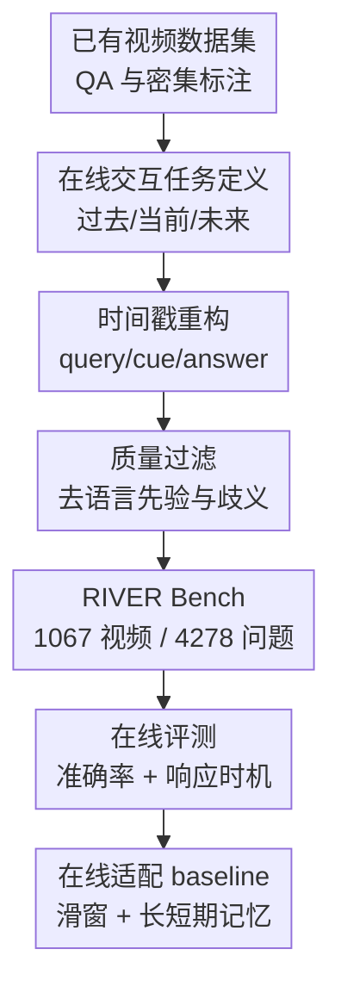

# RIVER: A Real-Time Interaction Benchmark for Video LLMs

**会议**: ICLR2026  
**OpenReview**: [https://openreview.net/forum?id=xmtvHH62Ic](https://openreview.net/forum?id=xmtvHH62Ic)  
**代码**: https://github.com/OpenGVLab/RIVER  
**领域**: 视频理解  
**关键词**: 实时视频理解, Video LLM, 在线交互, 长短期记忆, 主动响应

## 一句话总结
RIVER Bench 将视频大模型的在线交互能力拆成回忆过去、理解当前、等待未来事件后主动响应三类任务，并用带时间戳的问答与响应时机指标证明：传统离线 Video LLM 即使离线问答不错，在真实流式交互中仍明显缺记忆、缺时机判断，而长短期记忆与专门的 proactive 训练可以带来可观提升。

## 研究背景与动机
**领域现状**：视频多模态大模型已经能在离线设置下回答长视频问题，典型做法是先把整段视频采样成若干帧或片段，再一次性输入模型，最后生成答案。这个范式适合“看完整段视频后做理解”，也催生了 MVBench、Video-MME、LongVideoBench 等离线评测。

**现有痛点**：真实交互场景并不是这样工作的。AR 导航、机器人监督、第一视角助手或实时陪伴系统需要模型一边接收视频流，一边记住之前发生过什么，回答当前画面里的问题，并在未来某个条件出现时及时提醒用户。已有 online/streaming benchmark 虽然开始引入时间戳或在线问答，但往往仍停留在“在某个时间点提问”的变体，缺少对回答时机、记忆随时间衰减、未来事件等待与触发的细粒度刻画。

**核心矛盾**：离线视频理解追求的是尽可能利用完整上下文，在线交互追求的却是“只能看到当前之前的信息，并且必须在合适时间回应”。这带来两个矛盾：一是模型不能无限缓存全部视频 token，否则长时间运行会爆显存；二是模型不能只回答得对，还要回答得早晚合适，尤其 proactive response 中过早提醒是误报，过晚提醒则失去交互价值。

**本文目标**：作者希望建立一个能真正区分这些能力的评测：既要测模型能不能记住过去不同时间跨度的事件，也要测它能不能理解当前短窗口，还要测它能不能持续观察视频流、等到目标事件出现时再响应。同时，论文还给出一个通用在线适配思路，观察现有 Video LLM 在加入长短期记忆与交互训练后能提升多少。

**切入角度**：论文不是把在线视频理解简化成普通 QA，而是从“线索发生时间、问题提出时间、答案输出时间”三者的关系出发定义任务。只要这三个时间点被标清，模型的记忆能力、实时感知能力和未来等待能力就可以被拆开分析，而不是混在一个总体准确率里。

**核心 idea**：用带精确时间语义的 RIVER Bench 重新定义 Video LLM 的在线交互评测，并用长短期记忆加流式响应训练展示现有模型走向实时视频助手的主要瓶颈和可改进方向。

## 方法详解
RIVER 主要包含两部分：第一部分是 benchmark 本身，定义在线交互任务、构造带时间戳的数据、设计评价指标；第二部分是一个把离线 Video LLM 改造成在线推理模型的通用 baseline，用来检验 benchmark 揭示的问题是否可以被针对性缓解。

### 整体框架
RIVER 的核心输入不是完整视频后的单次问题，而是一个随时间推进的视频流、用户在某个时刻提出的查询，以及模型在后续不同时间点可能生成的响应。论文先根据被问事件相对于当前时间的位置，把任务拆成 Retro-Memory、Live-Perception 和 Pro-Response，再从多个已有视频数据集抽取或重构带 query time、cue time、answer time 的样本，最后用准确率与时机指标评价模型。

形式化上，论文把在线交互写成 window-based video-text-to-text 任务：模型在时间 $t$ 生成响应 $r_t$，可见的视频只到当前窗口 $V_{t':t}$，同时还依赖历史建模 $h_{<t'}$、用户查询 $q$ 以及此前响应 $r_{<t}$。训练目标写作 $L=-\log P_\theta(r_t|V_{t':t},q,h_{<t'},r_{<t})$。这里最关键的是：响应序列可以包含多个 EOS，用来模拟实时对话中的沉默、暂停或等待，而不是每一帧都强迫模型说话。

### 关键设计
**1. 三类在线交互任务：用时间关系拆开记忆、感知与等待**

RIVER 最重要的设计是把在线视频交互按事件线索时间 $t_V$ 与当前可见窗口 $[t',t]$ 的关系拆开。Retro-Memory 关心过去事件，此时 $t_V<t'$，用户问“我刚才把包放哪了”这类问题，模型必须依赖历史记忆而不是当前画面。Live-Perception 关心当前或短期窗口内的信息，此时 $t'\le t_V\le t$，它更接近实时视觉问答，但要求模型在有限窗口里立即理解动态变化、物体属性和场景语义。Pro-Response 关心未来事件，此时 $t_V>t$，用户提出条件后，模型需要继续观察，等线索真正出现再回答或提醒。

这个划分比“过去/现在/未来”标签更细，因为它直接约束了模型在某个时间点能看到什么、该不该回答、何时回答。尤其是 Pro-Response，论文又分成 instant 与 streaming 两种：instant 是条件满足时给出一次回答，streaming 是持续描述或引导，类似实时 dense captioning。这样一来，benchmark 不只评估模型是否知道答案，还评估它是否懂得等待和把握触发时机。

**2. 带 query/cue/answer 时间戳的数据重构：把离线标注改造成交互剧本**

RIVER 没有从零采集所有视频，而是复用 Vript-RR、LVBench、LongVideoBench、Ego4D 和 QVHighlights 等已有数据源，再把原始 QA 或密集动作标注重构成在线交互格式。每条样本至少要明确：问题在什么时候被问、答案依赖的视觉线索发生在什么时候、模型应当在什么时候响应。对于 Retro-Memory，论文按 15-30 秒、30-60 秒、300-900 秒、1800-3600 秒划分 short、medium、long、very long，用来观察记忆距离变长后的性能曲线。对于 Pro-Response instant，论文从密集事件标注中选择有辨识度的关键事件，再生成“当你看到 X 时提醒我 / 下一步该做什么”这类问题与干扰选项。

质量控制也围绕“这题是否真的需要看视频、是否真的考在线能力”展开。作者用规则过滤掉包含特殊人名、覆盖整段视频、过于泛泛的问题；再用开源 LLM 检查哪些问题不用视觉输入也能猜对，避免模型靠语言先验刷分。对密集动作标注，论文会去掉站起、走动、环顾四周这类普通而重复的事件，并用句向量相似度挑出更独特的事件作为锚点。这个流程的意义在于让 benchmark 的难点来自时间和视觉本身，而不是来自含糊题目或可猜答案。

**3. 时间敏感指标：早答、晚答和答对被分开惩罚**

Retro-Memory 与 Live-Perception 仍以问答准确率为核心，但论文同时报告多选抽取准确率和开放式一致性评估。多选题先用正则抽取选项；抽取失败或非多选答案则使用 Qwen2.5-72B 判断模型回答与参考答案是否一致。这种双口径有助于区分模型“选项格式没跟上”和“语义真的错了”。

Pro-Response 的指标更有针对性。论文围绕真实触发时间 $t_g$ 定义一个容忍窗口 $w$，窗口内响应给满分；过早响应直接记 0，因为这在提醒型系统中等价于误报；过晚响应则随延迟线性衰减到 0，因为迟到的提醒虽然可能语义正确，但交互价值不断下降。这个 Response Accuracy Metric 把“该不该说”和“什么时候说”纳入同一个评分，让在线模型不能只靠提前乱报或事后补答取得高分。

**4. 长短期记忆在线适配：让离线模型在有限上下文里持续运行**

为了让普通离线 Video LLM 能参与在线评测，论文提出一个通用适配框架：用滑动窗口按 1fps 处理视频流，当前窗口的视觉 token 作为 short-term memory，窗口之前的信息压缩成固定槽位的 long-term memory。长时记忆不是简单无限累积，而是维护 $M$ 个 memory slots；当槽位过多时，计算相邻片段的相似度，把最相近的片段合并平均。这个 nearest-neighbor averaging 模拟人类把相邻事件抽象成更高层语义的过程，同时把显存成本控制在常数级。

用户提问时，模型会同时看到短期窗口和长期记忆，并在 prompt 中显式加入时间范围，例如“long memory from 0.0 to x seconds”和“short clip from y to z seconds”。这件事看似工程化，但对在线交互很关键：模型不仅需要视觉内容，还需要知道这些内容处在时间线的什么位置。论文还在 VideoLLM-Online 架构上构造 proactive 训练数据，通过随机 query timestamp 与流式损失训练模型学会等待未来事件，而不是默认从 0 秒开始看完整段视频。

### 损失函数 / 训练策略
在线适配的训练目标延续 VideoLLM-Online 的思路，把标准语言建模损失与 streaming-specific loss 结合起来，目标是既生成正确文本，又学会何时沉默、何时响应。作者使用 SigLIP-Large-Patch16 作为视觉编码器，两层 MLP 投影到 LLaMA3-8B 的语言空间，并对所有线性层加入 LoRA。视频按 4fps 编码，每帧包含一个全局 CLS token 和 $3\times3$ 空间池化 patch token。

训练配置上，论文使用单 epoch、学习率 $3\times10^{-5}$、DeepSpeed ZeRO-2，并强调 proactive 训练样本中的用户查询时间是随机采样的，而不是固定在 0 秒。这个细节直接服务于泛化：真实用户可能在任何时间提出“等看到 X 提醒我”，模型必须从任意时间点进入等待状态，而不是只适配从视频开头开始的固定脚本。

## 实验关键数据

### 主实验
RIVER 评测了四类模型：闭源商业模型、原生在线模型、普通开源视频多模态模型，以及经过本文在线适配的开源模型。一个核心结论是：离线模型在 Retro-Memory 和 Live-Perception 上还有一定能力，但在 Pro-Response 上基本没有完整能力；加上滑窗和长短期记忆后，普通模型能获得一定 proactive 分数，但仍远未解决实时交互。

| 模型 / 设置 | 帧输入 | Retro-Memory MC | Live-Perception MC | Pro-Response Instant | Streaming OE | Loc |
|--------|------|-----------------|--------------------|----------------------|--------------|-----|
| GPT-4o | 50 frames | 59.56 | 61.05 | 不支持 | 不支持 | 1.63 |
| Gemini-1.5-pro | 50 frames | 36.35 | 52.19 | 不支持 | 不支持 | 1.51 |
| LLaVA-Video 离线 | 16 frames | 46.00 | 41.00 | 不支持 | 不支持 | 4.25 |
| LLaVA-Video + 在线适配 | 1fps | 42.71 | 51.38 | 19.50 | 27.55 | 6.21 |
| VideoChat-Flash 离线 | 16 frames | 41.51 | 41.44 | 不支持 | 不支持 | 3.68 |
| VideoChat-Flash + 在线适配 | 1fps | 45.75 | 56.35 | 20.24 | 35.90 | 6.21 |
| Flash-VStream | 1fps | 27.28 | 29.28 | 未报告 | 未报告 | 1.31 |

对 proactive 训练最直接的证据来自 VideoLLM-Online：原始模型在 2fps 下 Instant 为 23.88、Streaming OE 为 6.67、Loc 为 4.41；加入 RIVER 训练后，2fps 变成 33.28 / 9.84 / 5.03，4fps 进一步达到 35.16 / 10.53 / 5.47。论文称相对 baseline 有 11.28% 的 accuracy improvement，这说明专门构造的未来交互数据确实能教会模型更好地等待和响应。

### 消融实验
论文的分析实验主要围绕记忆距离、视觉线索类型和在线记忆模块展开。Retro-Memory 的时距分组清楚显示，大多数模型从 short 到 very long 都会下降；而加入 memory 的在线改造模型在中长时距问题上更稳。另一方面，因果线索比细粒度视觉和背景线索更难，说明模型不仅缺记忆，也缺事件归因和动作因果理解。

| 分析维度 | 代表模型 / 设置 | Short MC | Medium MC | Long MC | Very Long MC | 观察 |
|------|----------------|----------|-----------|---------|--------------|------|
| 离线 LLaVA-Video | 16 frames | 49.17 | 48.07 | 44.20 | 42.54 | 随时间距离变长逐步下降 |
| 在线 LLaVA-Video | 1fps + memory | 44.20 | 43.65 | 37.02 | 37.29 | 实时约束下总体下降，但可持续处理长视频 |
| 离线 VideoChat-Flash | 16 frames | 44.20 | 43.92 | 40.06 | 37.85 | 长视频压缩设计带来一定稳定性 |
| 在线 VideoChat-Flash | 1fps + memory | 43.92 | 48.90 | 41.44 | 38.12 | 中长记忆相比离线不再明显恶化 |
| Flash-VStream | 1fps | 28.73 | 25.97 | 27.90 | 26.52 | 总体低，但不同距离较平 |

| 线索类型 | 说明 | 最好的一组结果 | 论文中的含义 |
|------|------|----------------|--------------|
| Fine-grained Cues | 物体属性、局部外观、细节动作 | LLaVA-Video 离线 53.16，VideoChat-Flash 在线 50.39 | 细节感知仍依赖强视觉编码与采样质量 |
| Causal Cues | 事件因果、动作前后关系、意图关联 | VideoChat-Flash 在线 40.92 | 所有模型都明显更弱，是在线助手的关键短板 |
| Background Cues | 场景、环境、静态上下文 | VideoChat-Flash 在线 54.10 | 背景类问题相对容易，memory 对上下文保持有帮助 |

### 关键发现
- 离线强模型并不自动等价于在线强模型。GPT-4o 在 Retro-Memory 和 Live-Perception 上最强，但论文设置下并没有完整 proactive streaming 能力，说明“理解完整视频”与“边看边交互”是不同能力。
- 普通开源 Video LLM 加上滑窗和长短期记忆后，可以从不支持 Pro-Response 变成有一定 proactive 分数，但 Instant 仍只有二十个百分点左右，实时提醒距离可用仍很远。
- 记忆曲线显示，加入 memory module 可以把性能衰减斜率降低约 12%，说明在线视频系统需要显式记忆结构，而不能只依赖更长上下文窗口。
- 因果线索最难，意味着未来工作不能只堆帧率或扩大记忆槽，还需要建模事件关系、动作意图和时间因果。
- Flash-VStream 的总体准确率不高但随时间距离较平，提示不同记忆机制会带来不同的错误形态：有的模型短期强但忘得快，有的模型弱但稳定。

## 亮点与洞察
- RIVER 的任务定义很清楚地抓住了在线交互的本质：不是“视频问答加时间戳”，而是问题、线索、响应三者在时间轴上的约束关系。这个视角能直接迁移到机器人、AR 助手和可穿戴设备中的评测设计。
- Pro-Response 指标对早答给 0 分很有现实感。很多离线模型如果被迫回答未来问题，可能会猜一个答案；但真实提醒系统中，提前乱报比晚一点更糟，因为它会打断用户并制造错误信任。
- 数据构造没有盲目追求规模，而是强调去语言先验、去普通事件、保留清晰时间锚点。对于 benchmark 论文来说，这比多堆几千条样本更重要，因为在线评测最怕题目本身的时间语义不干净。
- 长短期记忆 baseline 是一个朴素但有解释力的参照。它没有声称解决在线理解，却把显存、滑窗、时间提示、记忆压缩这些系统问题摆到台面上，为后续模型提供了可复用的最小框架。
- 论文把 memory curve 引入 Video LLM 分析很有启发性。相比只报告一个平均准确率，按回忆距离画曲线更能看出模型到底是短期感知强、长期保持弱，还是整体能力不足但衰减平缓。

## 局限与展望
- 数据暂时不包含音频。实时交互中声音往往比画面更早、更密集地提供事件线索，例如敲门、报警、锅中沸腾或用户语音指令；缺少音频会限制 benchmark 对真实助手的覆盖。
- Benchmark 仍主要基于已有数据集重构，虽然质量控制严格，但视频来源和场景分布受原数据影响。未来可以加入更多真实在线采集场景，比如机器人第一视角任务、AR 导航和多轮用户纠错。
- Pro-Response 的评分窗口需要与应用场景绑定。不同任务对早晚的容忍不同，例如安全提醒要求极低误报和低延迟，视频解说则可以更宽松；统一窗口可能无法覆盖所有部署需求。
- 开放式答案评估依赖 Qwen2.5-72B，可能引入评判模型偏差。尤其是实时描述类任务，参考答案可能不是唯一表达，后续可以结合人工评估或更细粒度语义事件匹配。
- 本文的在线适配 baseline 仍是相对工程化的滑窗与记忆压缩，没有真正解决事件级世界模型、因果预测和持续多轮交互中的状态更新问题。RIVER 更像把问题量出来，而不是把模型完全做出来。

## 相关工作与启发
- **vs OV-Bench**: OV-Bench 将在线视频理解分成 current、past、future 三类，已经意识到时间关系的重要性；RIVER 进一步细化 query、cue、answer 的时间约束，并引入 response timing 的评分，因此更适合分析交互过程本身。
- **vs OVO-Bench**: OVO-Bench 覆盖 Backward Tracing、Real-Time Visual Perception 和 Forward Active Responding，是最接近 RIVER 的工作；RIVER 的差异在于更强调不同时间间隔下的记忆/预期曲线，以及 response/cue interval 的细粒度标注。
- **vs StreamingBench**: StreamingBench 关注 streaming video understanding 的能力缺口，包含多源信息与上下文理解；RIVER 更专注于在线互动形式，尤其是“何时问、何时看到线索、何时回答”的严格定义。
- **vs VideoLLM-Online / MMDuet**: 这些工作尝试让模型学会在视频流中说话或等待；RIVER 可以作为更系统的外部评测，检查这类模型是否只是会生成流式文本，还是确实在正确时机给出正确答案。
- **vs LongVideoBench / LVBench**: 这些长视频 benchmark 主要评估离线长上下文理解；RIVER 借用其数据，但把问题改造成实时交互形式，提醒我们长视频理解和在线视频交互需要不同的评估协议。

## 评分
- 新颖性: ⭐⭐⭐⭐☆ 把在线交互拆成时间关系明确的三类任务并引入响应时机评分，问题定义很到位，但部分任务思想承接了 OV/OVO 系列工作。
- 实验充分度: ⭐⭐⭐⭐☆ 覆盖闭源、开源、原生在线和在线适配模型，并有记忆距离与线索类型分析；若加入更多真实多轮交互和音频会更完整。
- 写作质量: ⭐⭐⭐⭐☆ 任务定义、数据流程和实验结论清晰，表格信息充足；少数地方对 proactive 指标公式和训练损失细节仍可写得更严格。
- 价值: ⭐⭐⭐⭐⭐ 对实时 Video LLM 研究很有用，尤其适合作为后续在线视频助手、机器人视觉交互和 AR 场景模型的标准诊断集。

<!-- RELATED:START -->

## 相关论文

- [\[ICML 2026\] ProAct-VL: A Proactive VideoLLM for Real-Time AI Companions](../../ICML2026/video_understanding/proact-vl_a_proactive_videollm_for_real-time_ai_companions.md)
- [\[CVPR 2026\] StreamRAG: Enhancing Real-Time Video Understanding with Retrieval Augmentation](../../CVPR2026/video_understanding/streamrag_enhancing_real-time_video_understanding_with_retrieval_augmentation.md)
- [\[ICLR 2026\] V2P-Bench: Evaluating Video-Language Understanding with Visual Prompts for Better Human-Model Interaction](v2p-bench_evaluating_video-language_understanding_with_visual_prompts_for_better.md)
- [\[CVPR 2026\] OmniGround: A Comprehensive Spatio-Temporal Grounding Benchmark for Real-World Complex Scenarios](../../CVPR2026/video_understanding/omniground_a_comprehensive_spatio-temporal_grounding_benchmark_for_real-world_co.md)
- [\[ICLR 2026\] CaReBench: A Fine-grained Benchmark for Video Captioning and Retrieval](carebench_a_fine-grained_benchmark_for_video_captioning_and_retrieval.md)

<!-- RELATED:END -->
