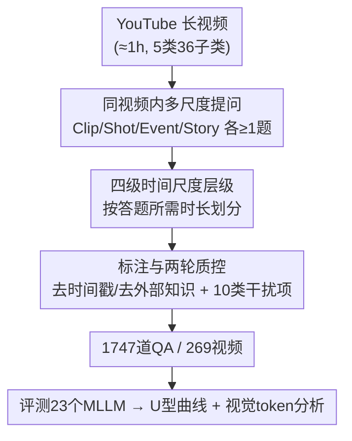

# ScaleLong: A Multi-Timescale Benchmark for Long Video Understanding

**会议**: ICLR 2026  
**OpenReview**: [https://openreview.net/forum?id=95sD6KKq51](https://openreview.net/forum?id=95sD6KKq51)  
**代码**: https://github.com/multimodal-art-projection/ScaleLong  
**领域**: 视频理解  
**关键词**: 长视频理解, 多时间尺度, MLLM 评测, 同视频内问答, U 型曲线

## 一句话总结
ScaleLong 提出首个把 Clip / Shot / Event / Story 四个时间尺度的问题**全部嵌入同一段长视频**的评测基准，从而在内容固定的前提下直接对比 MLLM 在不同时间粒度上的能力，并在 23 个模型上揭示出一条稳定的 U 型性能曲线（两端高、中间塌）。

## 研究背景与动机
**领域现状**：随着 MLLM 在图文、短视频任务上的进步，社区涌现了大量视频理解 benchmark（MVBench、Video-MME、MLVU、LongVideoBench 等）。真正理解一段长视频，需要像人一样在多个时间尺度上无缝整合信息——从识别一个瞬间动作，到把握整条叙事主线。

**现有痛点**：现有长视频 benchmark 评估"多时间尺度能力"的方式存在结构性缺陷。它们要么只用孤立的短片段（无法考察长程时序），要么把不同时间尺度的问题**散落到完全不同的视频上**——想测 Clip 能力用 A 视频、想测 Story 能力用 B 视频。

**核心矛盾**：当时间粒度和视频内容这两个变量被绑在一起时，就**无法把"模型在某个时间尺度上的真实能力"从"模型对特定内容的适应性"中剥离出来**。一个模型在 Story 问题上分数高，到底是它擅长长程推理，还是恰好那批长程问题用的视频更简单？现有 benchmark 答不了这个问题。

**本文目标**：设计一个能在**控制内容变量**的条件下，逐尺度、细粒度地诊断 MLLM 时序能力的评测基准。

**切入角度**：作者的关键观察是——既然内容变化是混杂因子，那就干脆把四个时间尺度的问题**钉在同一段视频内容上**（within-content / intra-video）。同一段叙事下问 Clip 也问 Story，模型在不同尺度间的分差就只能归因于时间粒度本身。

**核心 idea**：用"同视频内嵌入四级时间尺度问答"代替"跨视频分散提问"，把时间粒度从内容中解耦，实现对 MLLM 多时间尺度能力的纯净测量。

## 方法详解

### 整体框架
ScaleLong 是一个**纯人工标注**的诊断型 benchmark（强调 quality over quantity，不是训练语料）。它包含 269 段平均 86 分钟的 YouTube 长视频，覆盖 5 大类、36 子类，共 1747 个高质量 QA。核心机制分三层：① 给每段视频定义 **Clip / Shot / Event / Story 四个层级递进的时间尺度**，并保证每个尺度至少一道题；② 每段视频配 4–8 道题（标注时按"每尺度两题"设计 8 题），横跨 5 种任务类型（因果推理、物体识别、动作理解、信息总结、计数）；③ 用"视频筛选 → 问题/答案/干扰项设计 → 两轮质控"的标注流水线，把对绝对时间戳和外部知识的依赖系统性清除，逼模型只能靠视频内容作答。最终用它评测 23 个 MLLM，观察跨尺度的性能形态。

### 关键设计

**1. 同视频内多时间尺度提问（within-content / intra-video）：把时间粒度从内容里解耦**

这是 ScaleLong 区别于所有现有 benchmark 的根本设计，直接针对"时间粒度与内容变量绑死"的核心矛盾。做法是：对**每一段**长视频，都同时设计指向四个不同时间尺度的问题，让同一段叙事下既有秒级 Clip 题、也有全片级 Story 题。这样当我们比较一个模型在 Clip 与 Event 上的得分差时，由于背后是同一批视频内容，分差就被干净地归因于"模型处理不同时间跨度的能力差异"，而不是"不同视频内容难度不同"。表 1 中作者用 IV-MTS（Intra-Video Multi-Timescale）这一列标记此属性，ScaleLong 是唯一打勾的——即便 Video-MME / MLVU 已支持多尺度（MTS），它们仍是跨视频提问，无法做同内容的逐尺度对比。

**2. 四级时间尺度层级：用"答题所需时长 + 信息分布"定义粒度**

为了让"时间尺度"可操作、可标注，作者按**回答一道题所需的视频时长以及关键信息在帧间的分布**，把问题划成四个递进层级，而非凭直觉打标签：

- **Clip**：分析几帧连续画面即可作答，跨度仅几秒（≤3s），针对瞬时动作、即时视觉细节、简单物体；
- **Shot**：需在单个连续镜头内整合多帧，约 4–15s，考察短时动态、简单动作、人物互动；
- **Event**：跨越多个连续镜头的显著事件，16s 至 10 分钟，需整合多场景、理解事件序列与因果链；
- **Story**：覆盖整段或大部分视频（通常 >10 分钟），需对整体叙事逻辑、人物发展、主题做全局理解与长程依赖推理。

这套定义保证了四个尺度在时间跨度上严格递进，使"U 型曲线"这类跨尺度结论有明确的语义支撑——中间塌陷对应的正是 Shot/Event 这两个"中等时长"区间。

**3. 严格的标注与双轮质控：逼出纯粹的内容理解，配 10 类干扰项**

benchmark 的可信度取决于标注质量，作者用一条多阶段流水线守住这条线。视频侧先定义 5 大类 36 子类，再人工从 YouTube 采集约 1 小时长的视频，逐条检查清晰度、信息密度与时长，筛出 269 段。问题侧由标注员**先完整看完整段视频**，再为四个尺度各设计两题（共 8 题）并平衡任务类型；每题配 1 个正确答案 + 3 个干扰项，干扰项按**预定义的 10 种类型**构造（如 missing information、spatial replacement、temporal replacement 等），既增加挑战性又便于后续做错误归因分析。质控分两轮、目标不同：第一轮保证正确性/清晰度/一致性，关键是**把绝对时间定位替换成描述性线索**，强制基于内容推理而非看时间戳，并防止问题过度集中在视频某个片段；第二轮专门消除混杂因子——凡是靠常识或外部先验就能答、而非依赖视频特有细节的题，一律改写或剔除，存在持续歧义的题直接丢弃。正是这套"去时间戳 + 去外部知识"的设计，确保了人类基线在各尺度上接近一致（约 91%），从而把后续观察到的模型尺度间波动坐实为模型缺陷而非题目难度不均。

## 实验关键数据

### 主实验
评测 23 个 MLLM（4 个闭源 + 19 个开源，7B–78B），固定 240p 分辨率、各模型用其测过的最高帧数。核心发现是一条**跨尺度 U 型曲线**：两端（Clip、Story）高，中间（Shot、Event）塌。

| 模型 | Clip | Shot | Event | Story | Overall |
|------|------|------|-------|-------|---------|
| Human | 92.8 | 91.3 | 88.9 | 91.0 | 91.0 |
| Gemini 2.5 Pro | 71.5 | 62.8 | 68.0 | 69.0 | **67.9** |
| Doubao 1.5-VL Pro | 66.4 | 52.8 | 55.2 | 60.2 | 58.7 |
| InternVL2.5-78B | 65.2 | 54.3 | 53.4 | 61.5 | 58.6 |
| GPT-4o | 61.8 | 50.7 | 51.0 | 58.0 | 55.4 |
| Gemini 2.0 Flash | 65.7 | 52.4 | 48.4 | 53.4 | 55.0 |
| LLaVA-Mini（最弱） | 29.7 | 25.3 | 28.8 | 25.2 | 27.3 |

- **U 型普遍存在**：Gemini 2.5 Pro 在 Clip 71.5% / Story 69.0%，却在 Shot 跌到 62.8%。说明 MLLM 擅长捕捉瞬时细节和整体叙事，却在中等时长片段的时序连贯上吃力。
- **人类近乎平直**（92.8 / 91.3 / 88.9 / 91.0），证明四个尺度的题目难度是一致的，模型的波动来自其内在能力缺陷而非题目设计。
- **闭源 > 开源，但都远低于人类**：最强的 Gemini 2.5 Pro（67.9%）比人类（91.0%）低 23.1 个百分点，差距最大处在 Shot（人类 91.3% vs GPT-4o 50.7%，差 40.6 点）。
- **任务类型分化**：物体识别（OR）普遍最高，计数（CP）普遍最低——Doubao 1.5-VL Pro 的 OR 与 CP 相差 23.7 点，GPT-4o 相差 26.6 点，暴露 MLLM 在精确数值定位上的硬伤。

### 消融实验
作者从"视觉 token 总量"及其"帧数 vs 分辨率分配"两个角度做消融。

| 配置 | 关键观察 | 说明 |
|------|---------|------|
| 固定分辨率、增帧 | 全尺度普遍提升，Clip 增益最大 | Event 在 64 帧达峰，再多帧引入冗余；Story 增益有限 |
| 固定帧数、提分辨率 | 增益温和、弱于增帧，且非单调 | Clip 在 480p 反而略降，过高空间细节引入噪声 |
| 固定 token 预算、调分配 | 最优分配依赖目标尺度 | Clip 偏好"多低清帧"，Story 偏好均衡配置，无单一通配最优解 |

### 关键发现
- **增加视觉 token 总量在所有尺度上都稳定提升性能**，是缓解（但非根治）U 型缺陷的一条可行路径；其中增帧比提分辨率更有效。
- **token 分配没有万能解**：短跨度 Clip 靠高时间密度（多低清帧），长跨度 Story 在均衡配置达峰、对过多帧呈现边际递减，Shot/Event 也需时空平衡。
- **错误模式集中在两类干扰项**：missing information 与 spatial replacement 失败率最高（Gemini 2.5 Pro 分别误接受 53% 和 46.6%），说明模型对"证据完整性"不敏感、对复杂视频中的空间关系推理偏弱；相反对 frequency / quantitative 类干扰抵抗力强（误判仅 13–29%）。

## 亮点与洞察
- **"同内容控制变量"是这篇最妙的实验设计哲学**：把四个时间尺度钉在同一段视频上，等于做了一次受控实验——内容固定、只变时间粒度，于是 U 型曲线才能被坐实为模型缺陷而非题目噪声。这个思路可迁移到任何"想剥离混杂因子"的评测场景。
- **U 型曲线是一个反直觉且可复现的诊断信号**：人们容易以为"越长越难"，但模型其实在中等时长（Shot/Event）最弱，两端反而强——这指向当前架构"擅长局部特征提取 + 全局摘要、缺中程时序连贯机制"的系统性短板。
- **用人类基线的平直性反证题目均衡**：先证明人类在各尺度近乎一致，再把模型的尺度间波动归因于模型本身，这套论证链条让结论更可信，是 benchmark 论文值得复用的范式。
- **10 类干扰项 + 错误归因**：把答错拆解到具体干扰类型上，直接定位出"证据完整性"和"空间关系"两个最薄弱环节，比单一准确率更有指导性。

## 局限与展望
- **规模偏小**：269 视频、1747 QA，作者主动选择"质量优先于数量"（对标 GPQA），但小样本可能限制统计细分（如某些子类样本过少）和对长尾能力的覆盖。
- **数据来源单一**：视频均来自 YouTube 约 1 小时片段，题材虽广（36 子类）但分布与真实长视频生态（如监控、第一视角、超长影视）仍有差距。
- **只诊断不开方**：论文揭示了 U 型缺陷和计数短板，但"如何设计能处理中程连贯的架构"留给未来工作；视觉 token 扩容只是缓解而非根治。
- **评测设置的可比性 caveat**：不同模型用各自最高帧数、固定 240p，跨模型横比时帧预算并不完全对齐，绝对分数高低需带着这一前提解读。

## 相关工作与启发
- **vs Video-MME / MLVU（支持多尺度 MTS 但跨视频）**：它们也标注了多时间尺度，但把不同尺度的问题分散到不同视频上，无法在同内容下逐尺度对比；ScaleLong 的 IV-MTS（同视频内多尺度）是表 1 中唯一打勾的，正是为解耦内容变量而生。
- **vs ALLVB（大规模模型合成 benchmark）**：ALLVB 等靠模型合成做到 25 万级 QA，但易引入偏差与质量波动；ScaleLong 反其道而行，用纯人工标注 + 双轮质控守质量，走"小而精的诊断工具"路线。
- **vs LVBench / HourVideo（小时级长视频）**：它们在视频时长上已做到小时级，但仍未把"时间尺度"作为独立可控的评测轴；ScaleLong 把时间粒度显式分成四级并钉在同内容上，提供的是一把"按尺度切片"的诊断尺，而非单纯堆长时长。

## 评分
- 新颖性: ⭐⭐⭐⭐⭐ 首个把四级时间尺度嵌入同一视频、解耦内容变量的 within-content 设计
- 实验充分度: ⭐⭐⭐⭐ 23 个模型 + 人类基线 + 帧数/分辨率/token 分配消融 + 干扰项错误归因，覆盖全面但规模偏小
- 写作质量: ⭐⭐⭐⭐ 动机与论证链条清晰，U 型结论有人类基线反证支撑
- 价值: ⭐⭐⭐⭐⭐ 提供可复现的多尺度诊断工具，U 型缺陷与计数短板为后续架构设计指明方向

<!-- RELATED:START -->

## 相关论文

- [\[ICLR 2026\] FOCUS: Efficient Keyframe Selection for Long Video Understanding](focus_efficient_keyframe_selection_for_long_video_understanding.md)
- [\[ICML 2026\] Video-MTR: Reinforced Multi-Turn Reasoning for Long Video Understanding](../../ICML2026/video_understanding/video-mtr_reinforced_multi-turn_reasoning_for_long_video_understanding.md)
- [\[ICLR 2026\] FLoC: Facility Location-Based Efficient Visual Token Compression for Long Video Understanding](floc_facility_location-based_efficient_visual_token_compression_for_long_video_u.md)
- [\[CVPR 2026\] Seeing the Scene Matters: Revealing Forgetting in Video Understanding Models with a Scene-Aware Long-Video Benchmark](../../CVPR2026/video_understanding/seeing_the_scene_matters_revealing_forgetting_in_video_understanding_models_with.md)
- [\[CVPR 2025\] MLVU: Benchmarking Multi-task Long Video Understanding](../../CVPR2025/video_understanding/mlvu_benchmarking_multi-task_long_video_understanding.md)

<!-- RELATED:END -->
