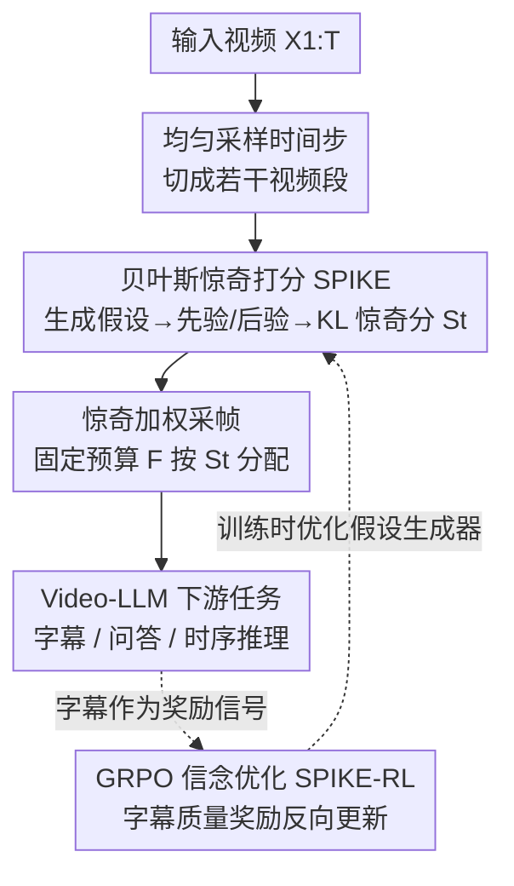

# SPIKE-RL: Video-LLMs Meet Bayesian Surprise

**会议**: ICLR 2026  
**OpenReview**: [https://openreview.net/forum?id=QLiXtWEAkq](https://openreview.net/forum?id=QLiXtWEAkq)  
**代码**: https://github.com/sahithyaravi/SPIKE-RL  
**领域**: 视频理解  
**关键词**: Video-LLM, 贝叶斯惊奇, 信念追踪, 帧采样, GRPO

## 一句话总结
本文用「贝叶斯惊奇」把视频里的意外时刻量化成一个可解释的分数——通过追踪 Video-LLM 对「接下来会发生什么」的信念分布在看到新帧前后的 KL 散度，定位惊奇片段，再用惊奇分加权采帧把固定帧预算更多分给这些关键时刻；进一步用 GRPO（SPIKE-RL）以视频字幕质量为奖励反向优化信念假设，在 5 个下游视频理解任务上一致提升。

## 研究背景与动机
**领域现状**：现在主流 Video-LLM（GPT-4o、Qwen2.5-VL、VideoLLaMA 等）处理视频时几乎都把视频当成「一袋帧」，从中**均匀采样**一个子集喂给模型，再丢掉其余帧。

**现有痛点**：真实视频大多是冗长平淡的日常被偶发的、令人难忘的意外打断（比如 Mr. Bean 突然摔倒）。均匀采样在概率上必然采到大量高频的平庸瞬间，而恰恰最可能漏掉那些稀有但定义了视频叙事的关键时刻，导致模型被冗余信息淹没。

**核心矛盾**：人类不是被动观察者，而是主动预测者——大脑持续构建并更新对世界的内部模型，用「预期与现实的偏差（惊奇）」作为分配注意力的主信号。而当前 Video-LLM 根本**没有一个随视频演进的信念**，无法判断哪里值得多看。已有的检索式选帧方法（按文本 query 回溯检索关键帧）又有另一个问题：开放世界里我们事先并不知道会被问什么问题，需要的是**查询无关、前瞻性**地识别什么是惊奇。

**本文目标**：(1) 让 Video-LLM 能像人一样随新视觉证据到来主动追踪并更新自己的信念；(2) 验证「提前、独立于下游 query 地检测语义惊奇」能否真正改善视频理解。

**切入角度**：把惊奇形式化为贝叶斯信念更新——用模型对「下一步会发生什么」的一组**人类可读的文本假设**上的概率分布表示信念，看到新帧前后这个分布变化的幅度（信息增益）就是惊奇。

**核心 idea**：用「新帧引发的先验→后验信念分布的 KL 散度」当惊奇分，再用它做惊奇加权采帧，并用 RL 让信念假设本身越训越准。

## 方法详解

### 整体框架
SPIKE 是一个**推理时**框架：给定一段视频，先均匀地选出若干时间步把视频切成若干段，每段末尾用 Video-LLM 生成一组「接下来会发生什么」的文本假设，并在**看到该段新帧之前**算出这些假设的先验概率、**看到之后**算出后验概率，两个分布的 KL 散度就是这一段的惊奇分。拿到逐段惊奇分后，把固定的帧预算 $F$ 按惊奇分（softmax）做**加权采样**——惊奇高的段多分几帧——再把这些帧喂给 Video-LLM 做字幕、问答等下游任务。SPIKE-RL 在此之上加一条训练回路：用 GRPO 以最终字幕和真值字幕的相似度为奖励，反向优化「假设生成器」，让它产出能支撑更准字幕的信念假设。

### 关键设计

**1. 贝叶斯惊奇打分：把「意外」量化为信念分布的 KL 散度**

这一步针对的痛点是「模型没有随视频演进的信念，不知道哪里是关键时刻」。在时间步 $t$，方法用三种输入构造上下文：紧邻当前段的**先验窗口** $W_t = X_{t-W:t-1}$（最近 $W$ 帧）、更早内容压成的**历史文本摘要** $H_t$、以及**新观测帧** $O_t = X_t$。先由 Video-LLM 在 $H_t, W_t$ 条件下用 nucleus sampling 生成 $N$ 个多样的文本假设 $B_t = \{b_{t,1},\dots,b_{t,N}\}$，每个假设描述「接下来可能发生什么」。

每个假设的可信度用其负对数似然 NLL 衡量（NLL 越小越合理），softmax 归一化成分布。看到新帧**之前**得到先验分布 $P_{prior}(b_{t,i}\mid H_t, W_t) \propto \exp(-\tfrac{1}{\tau}\,\mathrm{NLL}(b_{t,i}\mid H_t, W_t))$；把新帧 $O_t$ 也加进上下文后得到后验分布 $P_{post}(b_{t,i}\mid H_t, W_t, O_t)$。沿用 Itti & Baldi (2005) 的惊奇定义，新帧带来的信息增益就是后验对先验的 KL 散度：

$$S_t = D_{KL}\big(P_{post}(\cdot\mid H_t,W_t,O_t)\,\|\,P_{prior}(\cdot\mid H_t,W_t)\big) = \sum_{i=1}^{N} P_{post}(b_{t,i})\log\frac{P_{post}(b_{t,i})}{P_{prior}(b_{t,i})}.$$

这样每个时间步都得到一个标量惊奇分 $S_t$，同时保留了带先验/后验概率的假设集——后者**人类可读**，能直接看出模型「原本预期什么、新帧揭示了什么」，惊奇分因此天然可解释。这与零样本直接问模型「这帧惊奇吗」截然不同：后者没有信念追踪机制，实验里准确率只有 SPIKE 的约十分之一。

**2. 惊奇加权采帧：把固定帧预算更多投给惊奇片段**

处理全部帧不现实，Video-LLM 必须在固定帧预算 $F$ 内采样。痛点是默认的均匀采样会把预算浪费在平庸瞬间。本设计先均匀采 $K \le F$ 个时间步（每个代表一段、类似滑窗），用 SPIKE 给每段算惊奇分 $S_1,\dots,S_K$，再把采样概率设为惊奇分的 softmax：$p_i = \exp(s_i/\tau_s) / \sum_j \exp(s_j/\tau_s)$（若所有分数相等则退化为 $1/K$ 均匀）。

接着在预算 $F$ 内有放回地按 $p_i$ 反复抽段、并在段内均匀取一个时间戳映射到帧索引；因为是独立有放回抽样，**高惊奇段能贡献多帧**。温度 $\tau_s$ 控制集中程度：$\tau_s$ 小则预算高度集中到惊奇区，大则趋于均匀，论文取 $\tau_s=0.7$。整个采帧是**查询无关**的——不依赖下游会问什么，符合开放世界需求；复杂度 $O(F\cdot N)$ 关于帧预算线性，在 GPU 上把 $N$ 个假设并行后可摊到 $O(F)$，开销与近期推理时扩展方法相当且不改架构。

**3. GRPO 信念优化（SPIKE-RL）：用字幕质量当奖励，反向教模型生成更好的信念**

SPIKE 的效果取决于假设是否准确、多样、能代表当前片段，但通用 VLM 并未为「在帧窗口上做信念追踪」而训练，没有动机去精炼这些中间假设；而对每段视频收集真值假设做直接监督又不现实。本设计的洞察是：**好的最终字幕建立在准确的中间信念之上**——于是把对最终结果的监督隐式转化为对内部推理的训练反馈。

具体用 GRPO：对每段视频采 $M$ 条轨迹 $\{\tau^{(r)}\}$，每条轨迹各自跑一遍 SPIKE（采样信念、算先验/后验与惊奇分、做惊奇加权采帧），最终各生成一条字幕 $c^{(r)}$。用 LLM-Match（让 LLM 评委打分字幕与真值字幕的相似度）得到标量奖励 $R^{(r)}$，在组内做 Z-score 归一化当优势 $A^{(r)} = (R^{(r)}-\mu_R)/\sigma_R$。把整条轨迹的假设集当作序列级动作，目标为

$$\mathcal{L}(\theta) = -\frac{1}{M}\sum_{r=1}^{M} A^{(r)} \sum_t \sum_{k=1}^{K} \log p_\theta\big(b_{t,k}^{(r)}\mid H_t^{(r)}, W_t^{(r)}\big),$$

即提升高优势轨迹上假设的似然、压低低优势轨迹的。训练集精心配成 2,000 段视频、30% 惊奇（采自 Oops! 的非故意人类失误）+ 70% 平淡（ActivityNet Captions 的日常活动），让策略同时见到「信念稳定」和「信念骤变」两类情形。模型用 Qwen2.5-VL-7B-Instruct，奖励模型用 Olmo-7B。结果是假设更多样（多样性 40.3% vs SPIKE 的 33.5%），惊奇定位也比纯推理时打分更准。

### 损失函数 / 训练策略
唯一的训练目标就是上面的信念优化损失 $\mathcal{L}(\theta)$（GRPO，序列级动作 + 组内 Z-score 优势）。奖励来自 LLM-Match 对生成字幕与真值字幕的相似度评分。训练数据 2,000 段（30% 惊奇 / 70% 平淡），策略模型 Qwen2.5-VL-7B-Instruct，奖励模型 Olmo-7B-hf。所有下游评测统一用最大帧预算 $F=64$。

## 实验关键数据

### 主实验（惊奇定位）
在 Oops!（4,791 段，标注精确惊奇转折点）、FunQA（424 段，标注最惊奇片段）、自建 Mr. Bean（48 段，用笑声轨当银标准）上评测：

| 数据集 | 指标 | Qwen2.5-VL 零样本 | 最强专用基线 | SPIKE | SPIKE-RL | 人类 |
|--------|------|------|------|------|------|------|
| Oops! | Acc@0.25s | 6.6 | 39.5 (F2C2V) | 60.0 | **62.9** | 62.1 |
| Oops! | Acc@1s | 9.6 | 69.5 (F2C2V) | 67.3 | 69.1 | 88.0 |
| FunQA | IoU | 11.6 | 62.3 (LLaVA-NeXT-CR) | 65.7 | **68.2** | – |
| Mr. Bean | IoU | 13.8 | – | 54.8 | **61.1** | – |

SPIKE-RL 在 Oops! 的 Acc@0.25s 上 62.9%，逼近人类 62.1%；比同一模型的零样本版本约高出**十倍**，比专用基线 F2C2V 在精确定位上高 23.4%。FunQA 是幽默/创意类正向惊奇，对在负向惊奇上训练的 SPIKE-RL 属于分布外，仍取得 68.2 IoU 的大幅领先。

### 下游任务（采帧策略对比，固定预算 64 帧）
把 Qwen2.5-VL 的均匀采帧换成 SPIKE / SPIKE-RL，并对比多种查询无关采帧基线：

| 采帧策略 | BlackSwan | FunQA | ExFunTube | VideoMME-S | NextQA |
|------|------|------|------|------|------|
| Uniform | 67.2 | 66.8 | 68.7 | 59.8 | 68.6 |
| RGB 直方图 | 49.6 | – | – | 55.4 | – |
| Optical Flow | 58.6 | – | – | 58.1 | – |
| Katna | 54.6 | – | – | 57.4 | – |
| SPIKE | 68.8 | 70.3 | 73.2 | 60.8 | 69.8 |
| **SPIKE-RL** | **69.5** | **71.4** | **75.7** | **62.5** | **70.3** |

在惊奇类视频上 SPIKE-RL 相对均匀采样涨幅最大：BlackSwan +2.3、FunQA +4.6、ExFunTube +7.0；通用 QA（VideoMME-S +2.7、NextQA +1.7）也稳定提升。换到 Qwen2.5-VL-32B，SPIKE-RL 仍带来 2.3~3.9 的增益，说明方法对大模型同样有效。

### 关键发现
- **镜头边界检测（SBD）类采帧（RGB 直方图、ECR、Katna、光流）普遍低于均匀采样**：它们依赖原始像素变化，对相机运动和镜头切换敏感，而这些很少对应语义重要事件；语义层面的贝叶斯惊奇才是有效的归纳信号。
- **RL 不只是涨点，还提升信念多样性**：SPIKE-RL 假设多样性 40.3% vs SPIKE 33.5%，说明用字幕奖励反向优化确实让假设更具概念多样性而非词面变体。
- **惊奇分与人类判断强相关**：在 Oops! 100 段视频上让标注者按先验/后验两轮给假设打分得到人类惊奇分，与 SPIKE / SPIKE-RL 的 Spearman 相关分别达 0.84 / 0.87。
- **Mr. Bean 绝对 Acc 偏低但 IoU 增益显著（+6.3）**：该集惊奇常源于细微表情而非明显意外事件，SPIKE-RL 在多片段细粒度惊奇上的优势在此凸显。

## 亮点与洞察
- **用「文本假设上的概率分布」做信念，让惊奇分天生可解释**：不像光流/直方图那种黑箱标量，这里可以直接读出模型「预期什么 vs 看到什么」，惊奇高低有据可查。
- **把惊奇当作查询无关、前瞻的采帧先验**：绕开了「事先不知道会被问什么」的开放世界难题，固定帧预算不增加却把算力投到关键时刻，是一种轻量的推理时扩展。
- **「最终字幕好 ⇒ 中间信念准」的弱监督转化很巧**：无法标注每段真值假设时，用字幕质量当奖励、GRPO 把信用反传给假设序列，把不可监督的中间推理变成可训练目标——这个思路可迁移到任何「中间步骤难标注但终端可评」的多步推理任务。

## 局限与展望
- 方法依赖 Video-LLM 自身生成的文本假设质量；在惊奇来自极细微线索（如 Mr. Bean 的微表情）时绝对定位精度明显下降。
- 奖励信号来自 LLM-Match（GPT-4o / Olmo 评字幕相似度），可能继承评委 LLM 的偏置，且字幕质量是否完全等价于「中间信念准确」是一个未充分验证的假设。
- 惊奇加权采帧增加了若干额外前向（每段生成 $N$ 个假设 + 两次似然评估），虽是线性开销，但相对纯均匀采样仍有推理成本，实时流式场景下的延迟尚需进一步验证（论文称可在线更新但主实验用定长视频）。
- 训练数据仅 2,000 段且惊奇来源集中于「非故意失误」，跨域到正向幽默惊奇虽有泛化但训练分布偏窄。

## 相关工作与启发
- **vs 检索式/query 条件选帧（如按文本 query 回溯检索关键帧）**: 他们在已知问题后回溯选帧，本文是查询无关、前瞻地识别惊奇，区别在于无需预知下游 query，更贴合开放世界与流式场景。
- **vs 镜头边界检测/视觉变化采帧（RGB 直方图、ECR、光流、Katna）**: 他们基于原始像素变化，本文基于语义层面的信念更新，优势是不被相机运动/镜头切换误导，劣势是需要 LLM 前向、开销更高。
- **vs 信念追踪类 NLP 工作（如显式维护并重加权对智能体心理状态的假设）**: 思路同源（贝叶斯心智理论式的假设重加权），本文把它落到视频流的逐段惊奇量化并接上采帧与 RL 优化。

## 评分
- 新颖性: ⭐⭐⭐⭐⭐ 把贝叶斯惊奇/心智理论形式化进 Video-LLM 的逐帧信念追踪，并接成可解释的采帧先验，角度新颖。
- 实验充分度: ⭐⭐⭐⭐ 覆盖 3 个定位基准 + 5 个下游任务 + 多采帧基线 + 7B/32B 两尺度，人评相关性扎实；流式与更大训练分布未充分验证。
- 写作质量: ⭐⭐⭐⭐⭐ 动机—公式—实验逻辑清晰，图示与定性例子到位。
- 价值: ⭐⭐⭐⭐ 一个即插即用、查询无关的采帧改进，对监控/流式/机器人等实时场景有实用前景。

<!-- RELATED:START -->

## 相关论文

- [\[CVPR 2026\] SpikeTrack: A Spike-driven Framework for Efficient Visual Tracking](../../CVPR2026/video_understanding/spiketrack_a_spike-driven_framework_for_efficient_visual_tracking.md)
- [\[ICLR 2026\] Measure Twice, Cut Once: A Semantic-Oriented Approach to Video Temporal Localization with Video LLMs](measure_twice_cut_once_a_semantic-oriented_approach_to_video_temporal_localizati.md)
- [\[CVPR 2026\] An Empirical Study on How Video-LLMs Answer Video Questions](../../CVPR2026/video_understanding/an_empirical_study_on_how_video-llms_answer_video_questions.md)
- [\[ICLR 2026\] Steering and Rectifying Latent Representation Manifolds in Frozen Multi-Modal LLMs for Video Anomaly Detection](steering_and_rectifying_latent_representation_manifolds_in_frozen_multi-modal_ll.md)
- [\[AAAI 2026\] R-AVST: Empowering Video-LLMs with Fine-Grained Spatio-Temporal Reasoning in Complex Audio-Visual Scenarios](../../AAAI2026/video_understanding/r-avst_empowering_video-llms_with_fine-grained_spatio-temporal_reasoning_in_comp.md)

<!-- RELATED:END -->
