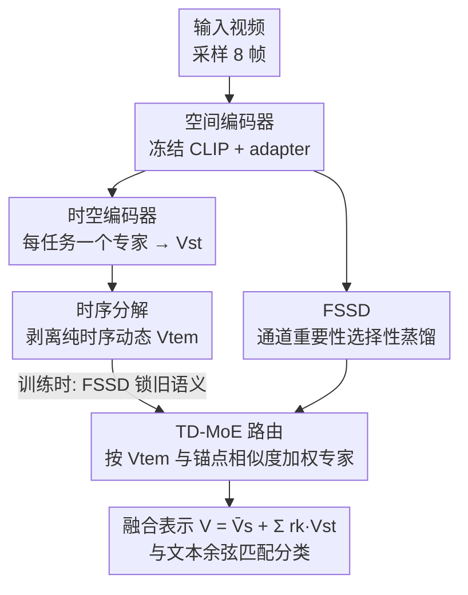

# StPR：面向无样本回放视频类增量学习的时空保持与路由

**会议**: ICLR 2026  
**OpenReview**: [https://openreview.net/forum?id=VAn2YVMuZC](https://openreview.net/forum?id=VAn2YVMuZC)  
**代码**: 无  
**领域**: 视频理解 / 类增量学习  
**关键词**: 视频类增量学习, 灾难性遗忘, 无样本回放, 时序分解, 混合专家

## 一句话总结
StPR 把视频特征显式拆成「帧间共享语义」和「时序动态」两路，用 FSSD 通道级蒸馏锁住重要的语义通道来抗遗忘、用基于时序分解的混合专家（TD-MoE）在推理时按时序动态给每个任务专家打权重，在完全不存旧样本的前提下做视频类增量学习，并在 UCF101 / HMDB51 / SSv2 / Kinetics400 上超过此前所有方法（含需要存样本的）。

## 研究背景与动机

**领域现状**：类增量学习（CIL）让模型按任务序列不断学新类、又不忘旧类。把它搬到视频上就是视频类增量学习（VCIL），用于动作识别——监控、驾驶员监测、机器人等场景都需要持续识别新动作。

**现有痛点**：现有 VCIL 方法分两类，都各有硬伤。一类是**基于样本回放**的（TCD、FrameMaker、HCE 等）：存一部分旧视频/帧/压缩特征回放来缓解遗忘，但存样本带来内存和隐私开销，而且这类方法多停在帧级学习、不显式建模时序。另一类是**搬运图像 CIL** 的方法（LwF、STSP 等）：靠正则或子空间投影避免存样本，但它们把视频拍平、几乎不利用时序结构。

**核心矛盾**：视频比静态图像多了一层时空结构——既有跨帧稳定的共享语义，又有帧间变化的时序动态。但已有方法要么用统一权重的蒸馏（把所有通道一视同仁）压制更新、牺牲可塑性，要么干脆忽略时序。问题根子在于：**缓解遗忘和利用时空信息这两件事没被同时、且分开地处理**——稳定性与可塑性之间没找到好的折中点，时序线索也被浪费了。

**本文目标**：在不存任何旧样本的前提下，既要锁住旧任务的关键语义（抗遗忘），又要让模型按时序动态灵活适配新类，并且推理时不能依赖任务 ID。

**切入角度**：作者观察到视频特征可以解耦——把每帧特征写成「共享静态分量 + 时序残差」$V^s_i = \bar{v} + \epsilon_i$。共享语义负责「记住旧知识」，时序动态负责「区分任务、路由专家」。两者职责不同，就该用不同手段分别处理。

**核心 idea**：显式拆开时空信息——用「帧共享语义蒸馏」选择性保住重要语义通道来抗遗忘，用「时序分解 + 混合专家」按时序动态做无任务 ID 的专家路由，两者协同形成统一的无样本 VCIL 框架。

## 方法详解

### 整体框架
StPR 建在冻结的 CLIP ViT-B/16 之上：视觉编码器 $F(\cdot)$ 不动，只训练两类轻量组件——每个任务一套 **adapter**（嵌在 transformer 残差里的下采样-ReLU-上采样 MLP）做空间适配，以及每个任务一个**时空编码器** $G(\cdot)$（多头自注意力）做时序聚合。整条流水线把视频拆成两路信息分别处理：

- **训练时**：空间编码器抽出逐帧特征，FSSD 模块按通道重要性对旧模型做选择性蒸馏，把「帧间共享、语义稳定」的通道锁住，其余通道放开去适配新类；
- **推理时**：每个任务的时空编码器是一个「专家」，TD-MoE 从输入视频里分解出纯时序动态 $V_{tem}$，拿它和各任务存下的时序锚点比相似度，给专家动态加权——无需任何任务 ID 或旧样本。

整体框架点名的三个贡献组件——FSSD、时序分解、TD-MoE 路由——分别对应下面三个关键设计；空间/时空编码器是脚手架。

### 关键设计

**1. FSSD：按「通道语义重要性」做选择性蒸馏，而非一刀切**

痛点很直白：经典 CIL 的统一权重蒸馏对所有通道一视同仁地约束更新，但视频里不同通道的语义重要性和时序稳定性差别很大，统一压制只会换来稳定性和可塑性都不好的折中。FSSD 的思路是先给每个通道算一个「帧共享语义重要性」$I_{c,j}$，再用它加权蒸馏损失——重要通道被强约束（保住旧知识），不重要的放开（留给新任务）。

重要性由两个量相乘得到。其一是**语义敏感度**：把第 $j$ 个通道在类 $c$ 上跨帧聚合的激活近似为高斯 $\bar{V}^s_{c,j}\sim N(\mu_{c,j},\sigma^2_{c,j})$，用 Fisher 信息衡量激活对输出的敏感程度，推导得 $I(\mu_{c,j})=1/\sigma^2_{c,j}$——方差越小、跨帧越稳定，越该保住。其二是**分类得分**：算空间特征和对应文本特征的通道级余弦贡献，近似为 $E[\gamma_{c,j}]\approx T_{c,j}\mu_{c,j}/\lambda$。两者合并得到通道重要性：

$$I_{c,j} = \frac{T_{c,j}\cdot\mu_{c,j}}{\sigma^2_{c,j}}.$$

蒸馏损失就用这个 $I$ 作为逐通道权重，约束 $b{-}1$ 任务和 $b$ 任务空间编码器输出的差异：$L_{FSSD}=\frac{1}{|D_b|d_{vt}}\sum_{c,i,j}I_{b-1,c,j}\cdot\|\bar{V}^s_{b-1,c,i,j}-\bar{V}^s_{b,c,i,j}\|^2_2$。这样旧任务里语义稳定又贡献大的通道被牢牢钉住，其余通道自由适配，稳定性-可塑性的折中点被精准地推到了「该稳的稳、该动的动」。

**2. 时序分解：从时空特征里干净地剥出纯时序动态 $V_{tem}$**

要按时序路由专家，先得拿到「只含时序、不含静态背景」的信号，否则背景一致的冗余帧会干扰路由。作者基于一个观察——相邻冗余帧背景和主体几乎不变、呈现短时平稳性（在 UCF101/HMDB51 上用 KPSS 检验验证了大量视频确实短时平稳）——把每帧特征拆成共享静态分量加时序残差 $V^s_i=\bar{v}+\epsilon_i$，于是空间均值 $\bar{V}^s=\bar{v}+\bar{\epsilon}$。

时空特征 $V_{st}$ 由注意力聚合而成，可近似为 $V_{st}\approx\sum_i a_i V^s_i=\bar{v}+\sum_i a_i\epsilon_i$（注意力权重归一化后 $\sum_i a_i=1$）。难点是 $\bar{v}$ 不好估计，作者巧妙地用 $V_{st}$ 减去 $\bar{V}^s$ 把它消掉：

$$V_{tem}=\sum_{i=1}^{N_f}\Big(a_i-\frac{1}{N_f}\Big)\cdot\epsilon_i.$$

这个量正好衡量「注意力加权的时序动态」与「均匀时序均值」之间的偏离——静态语义被减没了，留下的是纯时序变化。这一步是 TD-MoE 能按时序做路由、又不被背景干扰的前提。

**3. TD-MoE：每任务一个专家，用时序锚点相似度做无任务 ID 路由**

深层 transformer 在 VCIL 里遗忘倾向很强，所以作者干脆给每个任务配一个专属时空编码器当「专家」。但推理时没有任务 ID，怎么知道该用哪个专家？答案是用上一步分解出的 $V_{tem}$。训练完一个任务后，把该任务每个类的时序表示求均值，存进**锚点池** $\bar{V}^{tem}_c$（只存类级均值向量，不是样本，仍然无样本回放）。推理时，对输入视频算出 $V_{tem}$，每个专家 $k$ 的路由分数取它和该专家所辖类锚点的最大余弦相似度：

$$r_k=\max_{c\in C_k}\cos\big(V^{tem}_k,\bar{V}^{tem}_c\big).$$

最终视频表示是「adapter 空间特征 + 各专家输出按 $r_k$ 加权」：$V=\bar{V}^s+\sum_k r_k\cdot V^{st}_k$，再和文本嵌入余弦匹配分类。和静态/特征无关的路由（简单平均 Avg-MoE、用冻结 CLIP 特征的 CLIP-MoE、用 adapter 特征的 Adapter-MoE）相比，TD-MoE 显式按时序动态分配权重，让真正相关的专家贡献更大，既提精度又压低遗忘。

### 损失函数 / 训练策略
总损失把三项加在一起：$L=L^{St}_{Cont}+L^{S}_{Cont}+w\cdot L_{FSSD}$。其中 $L^{St}_{Cont}$ 是时空特征 $V_{st}$ 与文本的对称对比损失、$L^{S}_{Cont}$ 是 adapter 空间特征 $\bar{V}^s$ 与文本的对比损失（两者都用视频↔文本双向 InfoNCE 形式做对齐），$L_{FSSD}$ 是抗遗忘的蒸馏项，权重 $w=1\times10^4$。骨干 CLIP ViT-B/16 全程冻结，只训空间/时空编码器；SGD，学习率 0.01，batch 40，首个增量阶段 60 epoch、后续每阶段 30 epoch，每视频 TSN 采样 8 帧；时空编码器 3 层注意力、每层 2 个 head；单卡 RTX 3090。

## 实验关键数据

### 主实验
在 TCD 基准（UCF101/HMDB51/SSv2）和 vCLIMB 基准（Kinetics400）上评测，指标为平均准确率 Acc、最终准确率与后向遗忘 BWF。StPR 在**不存任何样本**的情况下全面超越所有基线（含需存样本的方法）。

| 数据集 / 设置 | 指标 | StPR | 之前最好 | 提升 |
|--------|------|------|----------|------|
| UCF101 10×5s | Acc | 94.67 | 86.05 (CoSTEO) | +8.62 |
| UCF101 2×25s | Acc | 88.52 | 86.95 (CoSTEO) | +1.57 |
| HMDB51 5×5s | Acc | 68.12 | 61.70 (CoSTEO) | +6.42 |
| HMDB51 1×25s | Acc | 67.01 | 61.84 (CoSTEO) | +5.17 |
| SSv2 5×18s | Acc | 37.30 | 36.60 (CoSTEO) | +0.70 |
| Kinetics400-10s | Acc | 57.83 | 56.09 (CSTA) | +1.74 |

值得注意：StPR 是无样本（✗）方法，却打过了一众需要存样本（✓）的方法；只在 SSv2 10×9s（40.79 vs CoSTEO 41.44）略低。Kinetics400 上 StPR 的 BWF 偏高（10s 为 14.01），作者解释为存样本的方法靠回放天然遗忘更低，但 StPR 最终精度仍更高。

### 消融实验
三组件：adapter 调优（$A_b$）、FSSD、TD-MoE。

| 配置 | UCF101 10×5s Acc | HMDB51 25×1s Acc | 说明 |
|------|------|------|------|
| baseline（冻结 CLIP） | 72.72 | 47.48 | 无适配，最弱 |
| + $A_b$ | 78.68 | 57.10 | 仅 adapter 适配 |
| + $A_b$ + FSSD | 82.06 | 60.83 | 加抗遗忘蒸馏 |
| + TD-MoE | 93.47 | 68.88 | 仅时序专家路由 |
| + $A_b$ + TD-MoE | 94.14 | 73.02 | 但 BWF 飙到 21.72 |
| Full（$A_b$+FSSD+TD-MoE） | 94.67 | 75.07 | 最稳，BWF 降回 7.02 |

### 关键发现
- **TD-MoE 是涨点主力**：单独加 TD-MoE 就把 UCF101 10×5s 从 72.72 拉到 93.47，说明时序动态路由对视频增量识别贡献最大。
- **FSSD 是稳定器**：$A_b$+TD-MoE 虽然 Acc 高，但 BWF 高达 21.72（遗忘严重）；补上 FSSD 后 BWF 降到 7.02，精度还略升——FSSD 与 TD-MoE 互补，一个保稳定、一个提可塑。
- **任务越长收益越大**：逐任务分析显示，任务数越多（如 10 任务长程场景）StPR 相对 baseline 的领先越明显。
- **路由方式很关键**：和 Avg-MoE / CLIP-MoE / Adapter-MoE 等静态或特征无关路由比，基于时序分解的 TD-MoE 在精度和稳定性上都更好，验证了显式建模时序变化的必要性。

## 亮点与洞察
- **「记忆」和「区分」用不同信号分工**：共享静态语义负责抗遗忘（FSSD 锁通道），时序动态负责任务路由（TD-MoE）。把视频天然的两路信息各司其职，比统一处理优雅得多。
- **$V_{st}-\bar{V}^s$ 消掉静态分量的小技巧**：共享静态项 $\bar{v}$ 难估，但用时空特征减空间均值就能干净地把它约掉，留下纯时序偏离量——一个很轻量却关键的解耦操作。
- **通道重要性 = Fisher 敏感度 × 分类贡献**：把「跨帧稳定」（方差倒数）和「对分类有用」（与文本余弦）两个正交标准乘起来定义蒸馏权重，物理含义清晰，可迁移到任何需要选择性正则的增量场景。
- **无任务 ID 推理靠锚点池**：只存类级时序均值向量（不是样本），就实现了任务 ID-free 的专家路由，绕开了 prompt pool 类方法对任务边界的依赖。

## 局限与展望
- **每任务一个专家，扩展性存疑**：任务数大幅增加时专家数线性增长，存储和推理开销会上升，论文未充分讨论上百任务时的可扩展性。
- **Kinetics400 遗忘偏高**：BWF 明显高于存样本方法（如 SMILE BWF 仅 6.25），说明纯无样本在大规模、长程场景下抗遗忘仍弱于回放，只是被高最终精度掩盖。
- **短时平稳假设的边界**：时序分解依赖「冗余帧短时平稳」的观察，对快速、剧烈运动或强时序依赖（如 SSv2 这类需精细时序推理的数据）增益较小——StPR 在 SSv2 上正是唯一被反超的设置。
- **依赖 CLIP 文本对齐**：整套分类基于视频-文本余弦匹配，强绑定 CLIP 的视觉-文本空间，换非 CLIP 骨干时通道重要性和分类得分的定义需重新设计。

## 相关工作与启发
- **vs 基于样本回放的 VCIL（TCD / FrameMaker / HCE）**：它们存视频/帧/压缩特征回放，有内存和隐私成本；StPR 完全不存样本，却在 UCF101/HMDB51/SSv2 上全面反超，说明显式建模时空结构能替代回放。
- **vs 图像 CIL 搬运法（LwF / STSP）**：STSP 用正交子空间投影避免存样本，但本质是图像域策略搬到视频、忽略时序；StPR 显式解耦时序动态并用它路由专家，时序信息被真正用起来。
- **vs prompt/adapter 类 PEFT-CIL（L2P / S-iPrompts / ST-Prompt）**：它们多维护任务特定 prompt、且偏静态图像；StPR 用时序分解 + MoE 做无任务 ID 的动态路由，更贴合视频的时空特性。
- **vs 其他 MoE 路由**：Avg-MoE / CLIP-MoE / Adapter-MoE 用静态或特征无关的方式分配专家权重；TD-MoE 按分解出的时序动态打分，精度和稳定性都更优。

## 评分
- 新颖性: ⭐⭐⭐⭐⭐ 「时空解耦 + 时序路由专家」的组合在无样本 VCIL 里是新颖且自洽的设计
- 实验充分度: ⭐⭐⭐⭐ 四数据集、两基准、组件消融 + 路由策略对比都有，但缺专家数随任务增长的开销分析
- 写作质量: ⭐⭐⭐⭐ 公式推导（Fisher、时序分解）清晰，框架图把训练/推理两阶段讲明白
- 价值: ⭐⭐⭐⭐⭐ 无样本即超过存样本 SOTA，对隐私敏感的持续视频识别场景有直接价值

<!-- RELATED:START -->

## 相关论文

- [\[ICLR 2026\] VideoNSA: Native Sparse Attention Scales Video Understanding](videonsa_native_sparse_attention_scales_video_understanding.md)
- [\[ICLR 2026\] Let's Split Up: Zero-Shot Classifier Edits for Fine-Grained Video Understanding](lets_split_up_zero-shot_classifier_edits_for_fine-grained_video_understanding.md)
- [\[ICLR 2026\] FOCUS: Efficient Keyframe Selection for Long Video Understanding](focus_efficient_keyframe_selection_for_long_video_understanding.md)
- [\[ICLR 2026\] Go Beyond Earth: Understanding Human Actions and Scenes in Microgravity Environments](go_beyond_earth_understanding_human_actions_and_scenes_in_microgravity_environme.md)
- [\[ICLR 2026\] VUDG: A Dataset for Video Understanding Domain Generalization](vudg_a_dataset_for_video_understanding_domain_generalization.md)

<!-- RELATED:END -->
