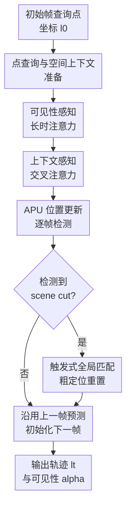

# TAPTRv3: Spatial and Temporal Context Foster Robust Tracking of Any Point in Long Video

**会议**: ICLR2026  
**OpenReview**: [https://openreview.net/forum?id=N3WAcxTX6J](https://openreview.net/forum?id=N3WAcxTX6J)  
**代码**: 待发布  
**领域**: 视频理解 / 点跟踪  
**关键词**: 长视频点跟踪、Tracking Any Point、空间上下文、长时注意力、可见性建模

## 一句话总结
TAPTRv3 面向长视频中的任意点跟踪，在 TAPTRv2 的 DETR-like 点查询框架上引入空间上下文交叉注意力、可见性感知长时注意力和 scene cut 触发式全局匹配，使模型在长序列、遮挡和镜头切换下显著减少特征漂移并刷新多项 TAP benchmark 结果。

## 研究背景与动机
**领域现状**：Tracking Any Point（TAP）任务要求给定视频中某一帧上的任意查询点，预测它在后续帧中的位置轨迹和可见性。早期强方法多沿用光流思路，把查询点与视频帧构造成 dense cost-volume，再通过 transformer 或迭代更新回归轨迹；这类方法精度高，但在点数、视频长度和分辨率上升时计算开销很重。TAPTR/TAPTRv2 走另一条路：把每个待跟踪点看成一个 DETR-like point query，用视觉 prompt detection 的方式逐帧检测这个点，从而摆脱 dense cost-volume 的负担。

**现有痛点**：TAPTRv2 在普通短视频上有效，但迁移到长视频后会暴露两个核心问题。第一，空间维度上，点级 query 和采样 key 都来自双线性插值，感受野非常局部；一旦目标点处在纹理重复、平坦区域、形变或局部噪声中，attention weight 很容易被错误的局部相似性带偏。第二，时间维度上，TAPTRv2 类似 RNN 地持续更新点特征，训练视频只有固定 24 帧，而测试视频可达 50 到 1300 帧，长时间反复更新会让点特征逐步混入周围歧义纹理和遮挡帧噪声，最终发生 feature drift。

**核心矛盾**：长视频点跟踪需要同时满足两件事：位置初始化最好利用上一帧预测，因为自然视频中的运动通常连续；但点的外观和可见性又不能只依赖上一时刻的递归状态，否则遮挡、长时间消失、镜头切换都会把历史错误持续放大。换句话说，模型既要保留初始点的可靠锚点，又要能从可见的历史帧中吸收外观变化。

**本文目标**：作者把问题拆成三个子问题：如何让点级 cross-attention 看到足够局部上下文，避免只比较一个像素级特征；如何在不递归污染初始点特征的情况下利用长时历史；以及当视频出现 scene cut 或突然大位移时，如何快速重新建立跟踪而不破坏普通连续视频中的精细定位。

**切入角度**：TAPTRv3 的观察很直接：点本身虽然是一个坐标，但判断它是否匹配某个位置时，不能只看这个坐标处的单点特征，而应看它附近的一小块空间上下文；同样，时间历史里不是所有帧都可信，遮挡帧的特征应该少参与更新，可见帧才更适合作为外观变化参考。

**核心 idea**：用空间 patch 相似性替代脆弱的点级相似性，用可见性重加权的长时 attention 替代 RNN 式特征滚动更新，并只在检测到 scene cut 时启用全局匹配来重置位置。

## 方法详解

### 整体框架
TAPTRv3 仍然保持 TAPTRv2 的在线点查询范式：用户在初始帧给定点坐标 $l_0$，模型先从初始帧提取该点的内容特征 $f$ 和周围空间上下文 $C$，随后逐帧接收新帧特征图 $X_t$，通过 transformer decoder 更新 query 的内容与位置，输出当前帧位置 $l_t$ 和可见性 $\alpha_t$。它的关键变化在于：内容特征不再被长视频递归污染，空间注意力不再只靠单点相似性，位置在 scene cut 时可以由全局匹配粗略重置。

更具体地说，点查询准备阶段从初始帧特征图 $X_0$ 中用双线性插值得到点级特征 $f \in \mathbb{R}^D$，同时围绕 $l_0$ 采样一个 $N \times N$ 网格的上下文特征 $C \in \mathbb{R}^{N^2 \times D}$，默认 $N=3$。顺序跟踪阶段中，当前帧特征图作为 keys/values，点 query 先通过可见性感知长时注意力（VLTA）聚合历史可见帧的内容变化，再通过上下文感知交叉注意力（CCA）在当前帧中查询空间特征，并结合 APU 更新位置。decoder 输出的 $l_t$ 作为当前帧位置，输出特征再经 MLP 预测可见性 $\alpha_t$。

### 关键设计
**1. 点查询与空间上下文准备：把一个点扩展成“点 + 小邻域”的可匹配描述**

TAPTRv2 的 query content 只来自坐标处的一个双线性插值特征，这在目标检测里可能够用，因为 object query 语义较强，但在点跟踪里过于脆弱：一个点可能落在车身纯色区域、鱼鳞重复纹理或物体边界附近，只比较单点特征很容易误判。TAPTRv3 在初始帧不仅采样 $f$，还在 $l_0 + G$ 的 $3 \times 3$ 网格上采样上下文 $C = Bili(X_0, l_0 + G)$，把“这个点附近长什么样”也固定下来。

这个设计的价值在于，它没有把点跟踪退回 dense cost-volume，而是只给 sparse point query 增加极小的局部上下文。后续 CCA 和全局匹配都复用这组初始上下文，所以模型在判断当前帧某个候选位置是否对应查询点时，可以比较两个小 patch 的结构关系，而不是押注一个像素级特征。

**2. 可见性感知长时注意力：保留初始锚点，同时只从可信历史帧吸收外观变化**

长视频中最危险的是递归式特征更新：如果某一帧点被遮挡或附近出现相似纹理，错误特征会被写进 hidden state，之后越滚越偏。TAPTRv3 因此不再把上一帧更新后的 content 直接作为下一帧的永久 query，而是始终以初始特征 $f$ 作为可靠输入，在当前帧 decoder 内用 long-temporal attention 去检索过去帧的 refined content features。论文先计算当前未完全精炼特征 $f'_t$ 与过去特征 $F_t=[f_0, f_1, \dots, f_{t-1}]^\top$ 的 attention，并加入 RoPE 风格的帧索引嵌入 $R_t$，使近邻帧天然更容易被关注：$d'_t = SoftMax((F_t + R_t) \otimes (f'_t + r_t))$。

仅有长时 attention 还不够，因为过去帧里有些点实际不可见，遮挡帧的 refined feature 可能主要描述遮挡物或背景。VLTA 用过去的可见性预测 $a_t=[\alpha_0, \alpha_1, \dots, \alpha_{t-1}]^\top$ 对 attention 进行软重加权：$d_t = d'_t \odot a_t / Sum(a_t)$，再得到时间残差 $\Delta f^T_t = F_t^\top \otimes d_t$ 并用 LayerNorm 更新当前 query。这样做的效果不是硬丢弃某些历史，而是让模型在不确定时仍可退化为普通 attention，在可见性可靠时优先利用真正看到目标点的帧。

**3. 上下文感知交叉注意力：用 patch-level similarity 稳住空间查询和 APU 位置更新**

TAPTRv3 的 CCA 针对的是 spatial feature querying。原本 key-aware deformable attention 会让 query 预测 $M$ 个采样偏移 $O_t$，再根据 query 与采样点特征相似性聚合 value；但在点级任务里，query 和候选 key 都太局部，attention score 会被噪声、重复纹理和轻微形变扰动。CCA 保留 query 预测 sampling offsets 的机制，但把 attention weight 的计算改成 patch-level similarity：对第 $m$ 个候选采样点，在当前帧围绕 $l'_t + o^m_t$ 采样上下文 $K^m_t = Bili(X_t, l'_t + o^m_t + G)$，再计算初始上下文 $C$ 与当前候选上下文 $K^m_t$ 的两两相似矩阵 $S^m_t = C \otimes {K^m_t}^\top$。

这里有一个细节很重要：作者没有只比较 patch 中相同相对位置的元素，而是让 $N^2$ 个初始上下文特征与 $N^2$ 个候选上下文特征两两比较，再把 flatten 后的相似矩阵送入 MLP 得到采样点权重 $w^m_t$。这使得相似性对旋转、形变和采样位置误差更宽容。之后模型用 $SoftMax(w_t / \sqrt{D})$ 聚合候选 value 得到空间残差 $\Delta f^S_t$，同时复用经 MLP 解耦后的权重来做 APU 位置增量 $\Delta l_t = O_t^\top \otimes SoftMax(MLP(w_t)/\sqrt{D})$。因此 CCA 同时改善了“当前帧该看哪里”和“query 位置该往哪里挪”这两件事。

**4. 触发式全局匹配：只在镜头切换时用粗定位救回轨迹**

普通视频里相邻帧运动通常连续，用上一帧预测位置初始化当前帧比全局搜索更精细；但长视频和公开数据集里常有剪辑切换，TAP-Vid-Kinetics 约 27% 视频包含 scene cut。若仍从上一帧位置附近追踪，点可能已经跳到画面另一区域，局部 decoder 需要很多帧才能追上，甚至直接丢轨。TAPTRv3 因此用 PySceneDetect 检测 scene cut，只在触发时启用 global matching。

这个全局匹配本身不是主要贡献，关键在“什么时候用”。触发后，模型用初始空间上下文 $C$ 与当前帧特征图 $X_t$ 构造全局相似图，形式上先得到 $H'_t = X_t \otimes C^\top$，再用 MLP 融合多个上下文相似图并经 SoftArgMax 得到位置 $l_t$。它给出的定位不如逐帧预测精细，但能在大位移后快速给出粗略全局位置，随后继续交给 CCA/APU 做局部精修。论文的消融也说明，若每帧都用 global matching 反而更差，只有 scene cut 时触发才符合这两种定位机制的分工。

### 一个完整示例
假设第一帧用户在一条金鱼侧面点了一个点，模型从该位置取出点特征 $f$，同时保存周围 $3 \times 3$ 的鳞片和边界上下文 $C$。到第 100 帧时，金鱼游到画面边缘，局部颜色和水纹产生歧义；TAPTRv3 不会只拿单点特征去和候选位置比较，而是在若干采样偏移附近各取一个小 patch，与初始 $C$ 做两两相似性，选择结构最像的候选区域来更新位置。

再到第 350 帧时，金鱼转身，原来的点可能被鱼身另一侧遮挡。此时历史里有些帧的 $\alpha_t$ 较低，VLTA 会降低这些帧对时间聚合的贡献，而更多参考早期和后续重新可见的帧。若视频中间突然剪到另一个视角，scene cut detector 触发全局匹配，模型先在整帧上找一个粗位置，避免沿着上一帧错误局部窗口慢慢漂移。

### 损失函数 / 训练策略
训练监督沿用前作的核心设定：位置预测使用 L1 loss，可见性预测使用 binary cross-entropy loss。作者特别指出，遮挡点的位置本身是 ill-posed 的，强迫模型在不可见时回归一个确定坐标会让训练不稳定，并可能学到固定运动偏置；因此在消融中加入“只监督可见点位置”后 AJ 从 49.5 提升到 51.1，成为完整模型前的关键步骤。

实现上，TAPTRv3 用 ResNet-18 作为 backbone，而不是 TAPTR/TAPTRv2 的 ResNet-50；Transformer encoder 使用 2 层 deformable attention，decoder 使用 4 层即可达到最优。主模型在 TAP-Vid-Kubric 上训练，视频 resize 到 $384 \times 512$，每个视频随机取 800 条轨迹；总 batch size 为 8，并累积 4 次梯度近似 batch size 32。优化器为 AdamW，$\beta_1=0.9$、$\beta_2=0.999$、weight decay 为 $1 \times 10^{-4}$，在 8 张 A100 上训练约 33,000 iterations。全局匹配模块在主模型冻结后进行第二阶段训练，约 5,300 iterations 收敛。

## 实验关键数据

### 主实验
主实验在长视频更明显的数据集上比较，包括 TAP-Vid-Kinetics、RGB-Stacking 和 RoboTAP。所有方法采用标准 TAP-Vid 指标：AJ 综合考虑位置和可见性，$<\delta^x_{avg}$ 衡量可见点定位精度，OA 衡量遮挡/可见分类准确率。TAPTRv3 是 online tracker，因此使用更困难的 First query 模式，并把评测输入分辨率限制在 $256 \times 256$ 以保证公平。

| 数据集 | 指标 | TAPTRv3 | TAPTRv2 | Track-On | 说明 |
|--------|------|---------|---------|----------|------|
| TAP-Vid-Kinetics | AJ / $<\delta^x_{avg}$ / OA | 54.9 / 67.5 / 88.2 | 49.7 / 64.2 / 85.7 | 53.9 / 67.3 / 87.8 | Kinetics 平均约 250 帧且含相机抖动、复杂背景和 scene cut，最能体现长视频鲁棒性 |
| RGB-Stacking | AJ / $<\delta^x_{avg}$ / OA | 72.3 / 84.1 / 90.8 | 53.4 / 70.5 / 81.2 | 71.4 / 85.2 / 91.7 | 纯色积木纹理少，CCA 的上下文比较对局部歧义有帮助 |
| RoboTAP | AJ / $<\delta^x_{avg}$ / OA | 64.5 / 77.3 / 89.7 | 60.9 / 74.6 / 87.7 | 63.5 / 76.4 / 89.4 | 机器人操作视频最长可达 1300 帧，TAPTRv3 明显强于 TAPTRv2 |

整体上，TAPTRv3 相比 TAPTRv2 平均提升 9.2 AJ，而且是在更轻量 backbone 和更少 decoder layer 下完成的。相比同为 online 的 Track-On，TAPTRv3 平均 AJ 仍高约 1.0。更值得注意的是，一些强 baseline 使用额外内部真实视频训练，例如 CoTracker3 使用额外 15K 真实视频，BootsTAPIR/BootsTAPNext-B 使用约 15M 真实视频片段；TAPTRv3 仅用 Kubric synthetic 数据训练，仍能保持竞争力。

### 消融实验
| 配置 | TAP-Vid-Kinetics AJ | 说明 |
|------|--------------------|------|
| TAPTRv2-style baseline | 44.5 | 不含 LTA、可见性重加权、移除 sliding window、只监督可见点、CCA |
| + Long-Temporal Attention | 47.8 | 用 attention 替代 RNN-like 长时建模，提升 3.3 AJ |
| + Visibility-aware reweighting | 48.8 | 遮挡帧历史被降权，进一步提升 1.0 AJ |
| + Remove sliding window | 49.5 | VLTA 已覆盖历史信息，去掉局部窗口后在线逐帧初始化更清晰 |
| + Only supervise visible positions | 51.1 | 不再强制不可见点回归位置，减少 ill-posed 监督 |
| + CCA | 52.9 | 空间上下文交叉注意力带来 1.8 AJ，完整消融模型最佳 |

作者还做了若干细粒度消融。CCA 中“every two point”的 patch-level similarity 得到 52.9 AJ，优于只比较对应位置的 element-wise 相似性 51.3 AJ，说明两两 patch 匹配更能处理形变和采样误差。空间上下文是否更新也很关键：不更新初始上下文得到 52.9 AJ，优于用 VLTA 更新上下文的 51.2 和用 MLP 更新上下文的 51.7，说明初始局部上下文作为稳定锚点比持续改写更可靠。

### 关键发现
- VLTA 是长视频收益的主要来源之一。仅把 RNN-like 更新换成长时 attention 就有 3.3 AJ 提升，加入可见性后再提升 1.0 AJ；附录里 memory size 从 12、24、48 到 All Past，Kinetics AJ 从 51.9、53.1、54.5 到 54.9，说明历史范围越长越能帮助长视频跟踪。
- CCA 的收益集中在点级空间歧义。$N^2=9$ 的上下文特征最佳，AJ 为 52.9；$N^2=1$ 退化到 vanilla key-aware deformable attention 后 AJ 为 51.3，$N^2=25$ 反而降到 52.2，说明点跟踪需要适量局部上下文，而不是越大越好。
- 触发式全局匹配在全量 Kinetics 上只带来 0.2 AJ，因为只有约 27% 视频含 scene cut；但在 scene-cut subset 上从 55.3 AJ 提升到 55.8 AJ。它不是普适替代局部追踪，而是专门修复镜头切换带来的突然大位移。
- 效率并没有因新模块变差。附录中单张 RTX3090、DAVIS、$384 \times 512$、平均 22 个点设置下，TAPTRv3 达到 57.2 FPS，高于 TAPTRv2 的 41.9 FPS 和 CoTracker 的 26.4 FPS；当 VLTA memory size 设为 512 时，同时跟踪 100 个点的流式视频显存低于 2GB。
- 在短视频 DAVIS 上，TAPTRv3 的 AJ 为 63.2，略低于 TAPTRv2 的 63.5，但 $<\delta^x_{avg}$ 更高。这说明本文设计主要针对长视频，不一定在短视频上全面压过前作。

## 亮点与洞察
- TAPTRv3 最清晰的贡献是把“点”重新放回上下文里理解。点跟踪的输出是一个坐标，但匹配证据不能只有坐标处的一个特征；用小 patch 两两相似性计算 attention weight，是在 sparse DETR-like 框架里借鉴 cost-volume 的上下文归一化思想。
- VLTA 的设计抓住了长视频漂移的本质：不是历史越多越好，而是可信历史越多越好。可见性预测本来只是输出指标的一部分，这里被反过来用于过滤 temporal memory，形成了位置、外观和遮挡判断之间的闭环。
- “初始上下文不更新”是一个反直觉但很实用的发现。外观会变，所以内容特征需要从历史可见帧中吸收变化；但空间上下文如果也跟着错误历史漂移，就会失去锚点。把可变的 content 和固定的 context 分开，是这篇方法稳定性的关键。
- 触发式全局匹配体现了很好的工程判断。全局匹配并不比局部逐帧追踪更精确，因此每帧使用会伤害性能；但在 scene cut 上，粗全局定位的价值超过其精度不足。这个思路可以迁移到视频分割、目标跟踪和机器人视觉中的“异常帧触发重定位”。
- 论文还说明 DETR-like 点跟踪并非一定依赖大 backbone。TAPTRv3 用 ResNet-18 和更少 decoder layer 仍然强于 TAPTRv2，表明瓶颈更可能在 decoder 的时空查询机制，而不是底层视觉特征容量。

## 局限与展望
- TAPTRv3 是 online tracker，decoder 一次只处理一帧，因此在真实流式场景成本低，但在离线评测中无法像 offline 方法那样充分并行处理多帧。若有足够显存，offline 方法可能通过大 batch 或窗口并行获得更高吞吐；作者建议可用更大 sliding window 改造成离线版本，但可能带来轻微性能下降。
- VLTA 的无限历史 attention 在极长视频中会带来显存压力。作者提到处理 3500 帧视频时若不限制 memory 会达到 24GB，因此实际部署需要 FIFO memory 管理；RoboTAP 上 memory size 约 512 后性能趋于收敛，但这仍是一个需要按应用调参的折中。
- Scene cut 检测依赖外部 PySceneDetect，而不是端到端训练得到。传统检测器在多数公开视频上足够有效，但跨域视频、渐变转场或复杂剪辑可能触发不准；未来若有更大更多样的数据，可把 scene cut 判断或重定位触发信号纳入整体模型联合学习。
- 全局匹配只提供粗位置，且论文强调其本身不是主要创新。如果目标在 scene cut 后发生大外观变化、尺度变化或同类物体混淆，全局相似图仍可能错误；后续可以考虑多候选重定位、置信度校准或结合语义/实例记忆。
- 训练仍主要依赖 Kubric synthetic 24 帧视频。TAPTRv3 在长视频上表现出不错泛化，但训练长度和真实测试长度之间的 gap 仍存在；更长、更真实、包含遮挡和剪辑的数据可能进一步提升长时注意力和触发机制的稳定性。

## 相关工作与启发
- **vs TAPTRv2**: TAPTRv2 已经去掉 dense cost-volume，并用 APU 做 attention-based position update，但空间上仍是点级相似性，时间上仍有 RNN-like feature drift。TAPTRv3 保留 DETR-like 框架和 APU 的简洁性，把关键改动集中在 CCA、VLTA 和触发式全局匹配，因此是一次针对长视频失败模式的结构性修补。
- **vs TAPIR / LocoTrack**: TAPIR、LocoTrack 等方法更接近光流和 cost-volume 思路，通过 dense 或 local correlation 获得强匹配能力。TAPTRv3 不构造完整 dense cost-volume，而是在 sparse query 的 attention score 里引入局部 patch 相似性，试图用更低成本获得上下文归一化的收益。
- **vs CoTracker / Track-On**: CoTracker 强调联合跟踪多个点，Track-On 用 memory module 支持 online point tracking。TAPTRv3 与它们同样关注时间信息，但它特别强调初始点特征的长期锚定和可见性重加权，实验上在只用 Kubric 数据训练时仍能在多个长视频数据集上达到或超过这些 online 方法。
- **vs BootsTAPIR / BootsTAPNext-B / CoTracker3**: 这些方法借助大量额外真实视频或更长 synthetic 数据缩小训练测试域差距。TAPTRv3 的意义在于不主要靠数据规模堆上去，而是通过针对长视频的时空查询机制获得竞争力；这对数据受限场景更有启发。
- **对后续工作的启发**: 长视频视觉任务里，模型往往需要区分“稳定锚点”和“可更新记忆”。TAPTRv3 的做法提示我们：内容可以随可见历史动态聚合，位置可以逐帧精修，空间上下文则可作为不轻易改写的局部身份描述；这种分工也可能用于视频对象分割、点云/SLAM 关联和机器人操作中的视觉记忆。

## 评分
- 新颖性: ⭐⭐⭐⭐☆ CCA、VLTA 和触发式全局匹配都不是凭空发明新范式，但它们针对 TAPTRv2 长视频失败模式组合得很准确，尤其是可见性重加权历史 attention 很实用。
- 实验充分度: ⭐⭐⭐⭐⭐ 主实验覆盖 Kinetics、RGB-Stacking、RoboTAP、DAVIS 和 PointOdyssey，消融细到 patch 相似性、上下文数量、memory size、scene cut subset 与效率分析，证据链完整。
- 写作质量: ⭐⭐⭐⭐☆ 论文动机和模块解释清楚，表格支持充分；但部分模块命名和细节较多，第一次读需要在 overview、公式和附录之间来回对齐。
- 价值: ⭐⭐⭐⭐⭐ 对长视频点跟踪、在线跟踪和下游机器人/视频编辑都很有价值，也给 sparse query 方法如何吸收 cost-volume 式上下文提供了可复用思路。

<!-- RELATED:START -->

## 相关论文

- [\[CVPR 2025\] ETAP: Event-based Tracking of Any Point](../../CVPR2025/video_understanding/etap_event-based_tracking_of_any_point.md)
- [\[CVPR 2026\] MV-TAP: Tracking Any Point in Multi-View Videos](../../CVPR2026/video_understanding/mv-tap_tracking_any_point_in_multi-view_videos.md)
- [\[ECCV 2024\] Self-Supervised Any-Point Tracking by Contrastive Random Walks](../../ECCV2024/video_understanding/self-supervised_any-point_tracking_by_contrastive_random_walks.md)
- [\[ICLR 2026\] Cambrian-S: Towards Spatial Supersensing in Video](cambrian-s_towards_spatial_supersensing_in_video.md)
- [\[CVPR 2026\] TAPFormer: Robust Arbitrary Point Tracking via Transient Asynchronous Fusion of Frames and Events](../../CVPR2026/video_understanding/ttapformer_robust_arbitrary_point_tracking_via_transient_asynchronous_fusion_of_.md)

<!-- RELATED:END -->
