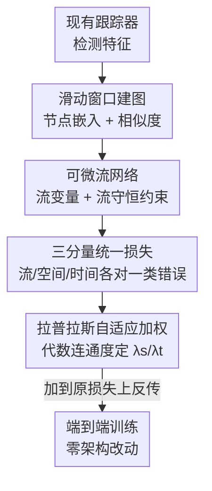

# UniTrack: Differentiable Graph Representation Learning for Multi-Object Tracking

**会议**: ICLR 2026  
**OpenReview**: [https://openreview.net/forum?id=XpddZpGck9](https://openreview.net/forum?id=XpddZpGck9)  
**代码**: https://github.com/ostadabbas/UniTrack  
**领域**: 视频理解 / 多目标跟踪  
**关键词**: 多目标跟踪, 图表示学习, 可微损失, 流守恒, 拉普拉斯自适应加权

## 一句话总结
UniTrack 把多目标跟踪建模成一个可微的"图流网络"，提出一个即插即用的图论损失函数，把检测精度、身份保持、时空一致性统一进一个端到端可训练目标，不改任何模型结构就能挂到 7 种现有跟踪器上训练，在多个 benchmark 上 ID switch 最多降 53%、IDF1 最多升 12%。

## 研究背景与动机

**领域现状**：多目标跟踪（MOT）的主流训练目标，是把"检测"和"关联"两件事分开优化的——检测用 IoU/GIoU、分类用交叉熵，而身份关联往往靠推理阶段单独的匹配策略（如 ByteTrack 的置信度匹配、MOTR/TrackFormer 的 track query 监督）。近几年也出现了基于图的 MOT（Neural Solver、SUSHI、GTR、DiffMOT），但它们都是在**重新设计跟踪网络架构**——改 forward 逻辑、改推理流程。

**现有痛点**：这些训练指标只擅长评估"框准不准"，却没法刻画"时间稳定性 × 空间感知 × 身份保持"三者之间的复杂耦合。结果就是：检测精度很高的模型，一旦碰到遮挡、密集人群、快速运动，身份就乱套。作者把现有方法搞不定的错误归成三类——**Type 1 遮挡后 ID 切换**（目标被挡住再出现时丢身份）、**Type 2 时间不一致**（目标变换姿态时 ID 跳变）、**Type 3 跨主体 ID 交换**（两人交叉后分开时身份互换）。

**核心矛盾**：检测损失和关联损失被拆成两套独立目标，训练阶段无法端到端联合优化，"框得准"和"认得对"之间的信息流被切断；同时，已有的图方法虽然把图结构引进来了，却要付出"重写架构"的代价，不能直接复用到现成系统上。

**本文目标**：设计一个**通用的训练目标**，让任意现有 MOT 系统都能在不动架构的前提下，一次性把检测、空间一致、时间一致联合优化掉，并且分别对症三类错误。

**切入角度**：把跟踪重新看成一个**流守恒问题**——物体不会凭空出现或消失，每个检测在时间上至多对应一个真实物体。这天然能用"图上的流网络"刻画，而图的拉普拉斯结构又能反映场景是"空间耦合重"还是"运动剧烈"，从而自动决定该偏重哪种一致性。

**核心 idea**：不造新架构，而是造一个**即插即用的可微图论损失**——用一个统一的图结构同时编码空间边、时间边和流分量，三者各自对症一类错误，训练时只需在原损失上加一项即可。

## 方法详解

### 整体框架

UniTrack 不是一个跟踪模型，而是一个挂在现有跟踪器训练流程上的**损失模块**。给定一段 $T$ 帧视频，它在一个滑动窗口（$W=5$ 帧）内把检测特征组织成一串带权有向图 $G=\{G_t=(V_t, E_t, W_t)\}$：节点 $v_t^i$ 是 $t$ 时刻被跟踪的物体 $i$，边编码跨帧的时空关系，权重 $w_t^{ij}$ 编码关联强度。

整个损失装配走三步：(1) 从检测特征构造节点嵌入；(2) 算两两相似度，形成边权和流变量 $f_t^{ij}$；(3) 施加流守恒约束，同时优化统一损失。这三步全程可微，无缝接进反向传播。统一损失由三个互补分量构成，再由一套基于图拉普拉斯的自适应权重把它们配比起来，最后做对数归一化以适配不同规模场景。

### 关键设计

**1. 把跟踪建模成可微流网络，用流守恒约束保证物理一致**

针对的痛点是：检测和关联被拆开优化，没有任何机制保证"一个检测在时间上只对应一个真实物体"，遮挡一来身份就漂。UniTrack 给每个物体 $i$ 在每个时刻 $t$ 引入**平衡变量** $b_t^i \in \{-1, 0, 1\}$，分别表示轨迹诞生（新物体出现）、轨迹延续、轨迹终止（物体离场）；再引入**流变量** $f_t^{ij}$ 表示 $t$ 时刻物体 $i$ 与 $t{+}1$ 时刻物体 $j$ 的关联强度。核心约束是节点上的流守恒：

$$\sum_{j\in N^+(i)} f_t^{ij} - \sum_{k\in N^-(i)} f_{t-1}^{ki} = b_t^i, \quad \forall i \in V_t$$

即每个物体"流出 − 流入 = 平衡变量"，把物体的出现/持续/消失编码成网络里合法的流。这一步的意义在于：它把"身份连续性"从一个事后匹配问题，变成了训练时就能优化的、物理自洽的约束——物体不能凭空分裂或合并，从根上压住遮挡前后的身份漂移。整套图计算可微，复杂度 $O(n^2 t)$（仅训练时，显存约增 5%），推理阶段完全不引入开销。

**2. 三分量统一损失，一个损失对症一类错误**

针对的痛点是：单一检测/分类损失评不出时空与身份的耦合，三类错误没有各自的"抓手"。UniTrack 把损失写成三项相加，每一项精准对应一类错误：

$$L = L_{\text{flow}} + \lambda_s L_{\text{spatial}} + \lambda_t L_{\text{temporal}}$$

**流损失 $L_{\text{flow}}$（治 Type 1 遮挡后 ID 切换）** 鼓励高置信关联，但用检测质量自适应地"收放"信任度：$L_{\text{flow}} = -\sum_{(i,j)} w^{ij} f_t^{ij}\cdot \exp\!\big(-\alpha\frac{|FP|}{|P|}-\alpha\frac{|FN|}{|GT|}\big)$。当检测干净（FP/FN 低）时指数项趋近 1，完全相信学到的关联；检测变差时指数项下降，自动降低对不确定关联的承诺。这里有个工程巧思：FP/FN 计数在反向传播时被当作常数（stop-gradient），只作为缩放系数，梯度只流向 $f_t^{ij}$，从而绕开"对离散计数求导"的麻烦，同时保持对流变量完全可微。

**空间损失 $L_{\text{spatial}}$（治 Type 3 跨主体 ID 交换）** 惩罚空间上距离过远的关联：$L_{\text{spatial}}=\sum_{(i,j)} w^{ij}\, d(p_t^i, p_{t+1}^j)\, f_t^{ij}$，其中 $d(\cdot,\cdot)$ 是跨帧坐标的几何距离，$w^{ij}$ 是可学习的空间注意力权重。它要求空间关系相似的物体维持一致关联，从而在两人交叉再分开时不互换身份。

**时间损失 $L_{\text{temporal}}$（治 Type 2 时间不一致）** 惩罚突变的速度：$L_{\text{temporal}}=\frac{1}{\Delta t}\sum_i \lVert v_t^i - v_{t-1}^i\rVert_2^2 \sum_{j} f_t^{ij}$，用物体"继续存在的置信度"（出边流之和）加权，鼓励平滑运动、压住姿态变化引起的 ID 跳变。最后整体损失再乘对数归一化 $L_{\text{final}}=L\cdot\log(|E|+1)$，让损失幅度随场景边数（复杂度）合理缩放。

**3. 基于图拉普拉斯的自适应加权，按场景自动配比空间与时间**

针对的痛点是：拥挤场景该重空间、快速运动该重时间，但人工调 $\lambda_s/\lambda_t$ 既费力又不能随场景变化。UniTrack 用**图拉普拉斯的代数连通度**（第二小特征值 $\sigma_2$）来度量空间图 $L_s$ 与时间图 $L_t$ 的连通强弱，连通度越低说明关系越碎、越需要加权去修复：

$$\lambda_s = \frac{\sigma_2(L_s)^{-1}}{\sigma_2(L_s)^{-1}+\sigma_2(L_t)^{-1}}, \quad \lambda_t = \frac{\sigma_2(L_t)^{-1}}{\sigma_2(L_s)^{-1}+\sigma_2(L_t)^{-1}}$$

关键是这两个权重**不是可学习参数**、不靠梯度更新，而是每个训练步从当前图结构现算一次。随着模型参数 $\theta$ 更新、嵌入变化、图结构变化，拉普拉斯矩阵随之刷新、权重重算，形成"参数→图→权重→损失→参数"的自适应回环：空间关系碎裂（$\sigma_2(L_s)$ 小）时 $\lambda_s$ 自动升高去强化空间一致，时间流被打断时 $\lambda_t$ 自动升高去强化运动平滑。消融显示这种拉普拉斯加权优于固定权重和可学习权重（见下表）。

### 损失函数 / 训练策略

核心损失即上面的 $L_{\text{final}}=(L_{\text{flow}}+\lambda_s L_{\text{spatial}}+\lambda_t L_{\text{temporal}})\cdot\log(|E|+1)$，作为**附加项**加到各 baseline 原有损失上，其余超参和训练协议全部沿用 baseline。关键超参：检测误差影响系数 $\alpha=0.9$，建图时间窗 $W=5$ 帧，自适应权重学习率起始 $\eta=0.01$ 并随 baseline 调度衰减。作者还给出收敛性定理（Thm 1），论证该损失在标准正则条件下可微、局部收敛，并经流守恒约束保证物理上合理的跟踪解（完整证明在附录 A.1）。

## 实验关键数据

### 主实验

在 MOT17 / MOT20 / SportsMOT / DanceTrack 上，把 UniTrack（UT-）挂到 6 种代表性架构上，覆盖 transformer 端到端、joint detection-tracking、tracking-by-detection、detection-embedding 等不同范式，几乎全线提升：

| 数据集 | 模型 | MOTA↑ | IDF1↑ | HOTA↑ | IDs↓ |
|--------|------|-------|-------|-------|------|
| MOT17 | GTR | 75.3 | 71.5 | 59.1 | 1445 |
| MOT17 | UT-GTR | **79.1** (+3.8) | **74.8** (+3.3) | **67.9** (+8.8) | **951** (−34%) |
| MOT17 | Trackformer | 62.3 | 57.6 | 52.8 | 643 |
| MOT17 | UT-Trackformer | **65.9** | **66.4** | **56.2** | 705 |
| SportsMOT | GTR | 74.8 | 61.3 | 54.4 | 2364 |
| SportsMOT | UT-GTR | **84.5** (+9.7) | **73.6** (+12.3) | **66.1** (+11.7) | **1092** (−53.8%) |
| DanceTrack | ByteTrack | 88.2 | 51.9 | 47.1 | 3456 |
| DanceTrack | UT-ByteTrack | **91.3** (+3.1) | **56.5** (+4.6) | **49.1** | **2134** (−38.2%) |

亮眼的几处：UT-GTR 在 SportsMOT 上 MOTA +9.7%、IDF1 +12.3%、ID switch 直降 53.8%；UniTrack 还能帮 Trackformer 把 FP 砍掉约 47%（1965→1039）、FN 砍掉约 24%（21893→16667）。MOT17 与 MOT20 结果一致，说明跨数据集稳健。

### 消融实验

在 MOT17 训练 15 epoch 后的组件消融（Trackformer）与加权策略对比（GTR）：

| 配置 | MOTA↑ | IDF1↑ | HOTA↑ | IDs↓ | 说明 |
|------|-------|-------|-------|------|------|
| Full（flow+spat+temp） | 56.2 | 64.1 | 57.7 | 288 | 完整损失 |
| w/o $L_{\text{flow}}$ | 52.9 | 61.3 | 55.3 | 314 | 去流损失，MOTA 掉最多 |
| w/o $L_{\text{spatial}}$ | 54.3 | 62.9 | 56.3 | 213 | 去空间损失 |
| w/o $L_{\text{temporal}}$ | 58.3 | 62.1 | 51.5 | 380 | 去时间损失，HOTA/IDs 明显变差 |
| Fixed (λ=0.5) | 76.8 | 72.1 | 65.4 | 1087 | 固定权重 |
| Learned (rand) | 77.5 | 73.2 | 66.2 | 1023 | 随机初始化学习权重 |
| Laplacian (ours) | **79.1** | **74.8** | **67.9** | **951** | 拉普拉斯自适应 |

### 关键发现

- **三分量各司其职**：去掉 $L_{\text{flow}}$ 对检测精度（MOTA 52.9，掉最狠）打击最大，印证它管检测质量自适应；去掉 $L_{\text{temporal}}$ 后 HOTA 暴跌到 51.5、IDs 升到 380，说明时间项对身份稳定最关键；去掉 $L_{\text{spatial}}$ 反而 IDs 最低（213）但 MOTA/IDF1 下滑，说明它在抑制误关联和保 ID 之间各有取舍。
- **拉普拉斯加权确实更优**：自适应权重（IDs 951）优于固定权重（1087）和随机学习权重（1023），证明"按场景图连通度现算权重"比静态/学习式配比更能贴合不同难度场景。
- **越难的场景收益越大**：在快速运动、频繁遮挡的 SportsMOT 上提升最猛（IDF1 +12.3%），符合"流守恒 + 时空一致专治遮挡与运动突变"的设计初衷。

## 亮点与洞察

- **即插即用、零架构改动**是最大卖点：UniTrack 不是新跟踪器，而是一个可加进任意 MOT 训练的损失项，推理代码完全不改、推理无开销，跨 7 种异构架构都涨点——把"图论"从架构创新降维成训练增强，复用成本极低。
- **stop-gradient 把不可导的检测计数变成可用系数**：FP/FN 计数本身不可微，作者让它们在反传时当常数、只做幅度缩放，梯度专走流变量，既保留了检测质量自适应的语义，又规避了对离散计数求导的工程难题——这个 trick 可迁移到任何"想用不可导统计量当损失权重"的场景。
- **用拉普拉斯代数连通度做自适应配比**很优雅：把"该重空间还是重时间"这个调参问题，转译成图的 $\sigma_2$ 度量，每步现算、随训练自演化，是把谱图理论落进损失设计的漂亮一手。
- **流守恒把身份连续性物理化**：用 $b_t^i\in\{-1,0,1\}$ 显式编码物体的生/续/灭，让"一个检测只对应一个物体"成为可优化的硬约束，从根上压遮挡漂移，思路可借鉴到任何需要"时序身份一致"的任务。

## 局限与展望

- **训练显存与计算有额外开销**：建图带来 $O(n^2 t)$ 复杂度、约 5% 显存增长，物体数 $n$ 很大的超密集场景可能放大；好在仅训练时产生。
- **依赖检测质量**：$L_{\text{flow}}$ 的检测质量项以 FP/FN 估计为系数，若 baseline 检测本身很差，自适应信任度会整体压低，提升空间受限。
- **个别配置非全面占优**：表 2 里 UT-Trackformer/UT-MOTR 等在某些序列上 IDs 反而略升（如 MOT17 UT-Trackformer IDs 643→705），说明强化某些一致性时会和别的指标产生 trade-off，并非每个指标都单调变好。
- **理论保证较粗**：收敛性定理依赖"标准正则条件"，且核心证明留在附录，实际训练是否总落入良性区间仍主要靠经验验证。
- **改进方向**：可探索把自适应权重从"代数连通度现算"扩展到更细粒度的逐物体/逐边权重；或把流守恒约束做成可学习的软约束以适配检测噪声更大的场景。

## 相关工作与启发

- **vs 图结构 MOT（Neural Solver / SUSHI / GTR / DiffMOT）**：它们把图塞进**跟踪架构本身**（改 forward、改推理），UniTrack 只把图论做成**训练损失**，零架构改动、即插即用——这是本文与所有先前图方法的根本分界。
- **vs MOTR / TrackFormer 等端到端 transformer 跟踪**：它们在训练目标里加 track query 匹配/轨迹初始化损失，但仍把空间、时间一致性当作分离组件；UniTrack 把检测、空间、时间统一进一个图损失联合优化，并分别对症三类错误。
- **vs ByteTrack / TransTrack**：ByteTrack 用检测置信度做关联但偏推理阶段、TransTrack 引入记忆做时序建模却缺统一框架；UniTrack 提供的是训练阶段就能同时优化所有跟踪分量的统一目标。

## 评分
- 新颖性: ⭐⭐⭐⭐⭐ 把 MOT 训练目标做成即插即用的可微图论损失，且用拉普拉斯连通度自适应配比，角度新颖
- 实验充分度: ⭐⭐⭐⭐ 跨 6 种架构 × 4 个 benchmark 全面验证，消融到位；但部分指标存在 trade-off、理论证明留在附录
- 写作质量: ⭐⭐⭐⭐ 三类错误 ↔ 三个损失分量的对应讲得清晰，公式与动机衔接顺畅
- 价值: ⭐⭐⭐⭐⭐ 零架构改动即可给现有 MOT 系统涨点，落地成本极低，实用价值高

<!-- RELATED:START -->

## 相关论文

- [\[ICLR 2026\] From Vicious to Virtuous Cycles: Synergistic Representation Learning for Unsupervised Video Object-Centric Learning](from_vicious_to_virtuous_cycles_synergistic_representation_learning_for_unsuperv.md)
- [\[CVPR 2026\] Hypergraph-State Collaborative Reasoning for Multi-Object Tracking](../../CVPR2026/video_understanding/hypergraph-state_collaborative_reasoning_for_multi-object_tracking.md)
- [\[AAAI 2026\] PlugTrack: Multi-Perceptive Motion Analysis for Adaptive Fusion in Multi-Object Tracking](../../AAAI2026/video_understanding/plugtrack_multi-perceptive_motion_analysis_for_adaptive_fusion_in_multi-object_t.md)
- [\[CVPR 2025\] OmniTrack: Omnidirectional Multi-Object Tracking](../../CVPR2025/video_understanding/omnidirectional_multi-object_tracking.md)
- [\[CVPR 2026\] ProgTrack: A Multi-Object Tracking Algorithm with Progressive Matching Strategy](../../CVPR2026/video_understanding/progtrack_a_multi-object_tracking_algorithm_with_progressive_matching_strategy.md)

<!-- RELATED:END -->
