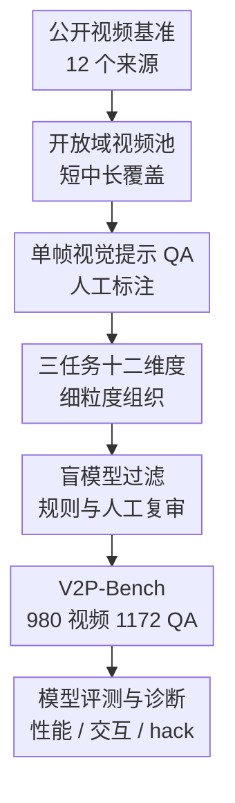

# V2P-Bench: Evaluating Video-Language Understanding with Visual Prompts for Better Human-Model Interaction

**会议**: ICLR2026  
**OpenReview**: [https://openreview.net/forum?id=l85ODqN0sc](https://openreview.net/forum?id=l85ODqN0sc)  
**代码**: https://github.com/gaotiexinqu/v2p-bench  
**领域**: 视频理解  
**关键词**: 视频语言理解, 视觉提示, 人机交互, 多模态评测, 时空理解

## 一句话总结
V2P-Bench 构建了一个面向视频视觉提示理解的人机交互评测基准，用 980 个视频和 1172 个带人工视觉提示帧的 QA 样本系统检验 LVLM 是否能围绕用户“指到的目标/时刻”做细粒度视频理解，并发现当前模型虽然能零样本理解部分视觉提示，但在时空关系、长视频和拒答诚实性上仍明显落后于人类。

## 研究背景与动机
**领域现状**：视频大视觉语言模型已经从早期的视频问答、动作识别，发展到能够处理长视频、多轮交互和复杂视频推理。Video-MME、LongVideoBench、LVBench、MVBench 等基准覆盖了不同长度、任务类型和开放域视频来源，成为衡量 LVLM 视频能力的主要工具。

**现有痛点**：这些评测大多仍把“人怎样告诉模型关注哪里”简化成文本提示。用户如果想问视频里某个人、某辆车、某个转瞬即逝的动作，就必须用复杂语言描述目标，例如“左侧第二个穿黑衣、刚从车里出来的人”。这种描述对用户不自然，对模型也不稳定，因为模型先要把文本指代解码成视觉目标，再去视频里定位和推理；多目标、相似目标、镜头切换和长视频会把这个过程放大成系统性误差。

**核心矛盾**：真实人机交互里，用户更倾向于直接圈出、点出或画出目标，但当前视频评测却主要考文本指代能力，而不是考模型是否理解用户画在视频帧上的视觉提示。已有 INST-IT、VideoRefer 等工作虽然引入了视觉提示，但多依赖视频分割数据，提示常出现在所有帧上，视频很短、来源单一，和“用户只在一个关键帧上做一次标注”的真实交互仍有距离。

**本文目标**：作者希望把评测问题重新定义为“给定视频、一个带视觉提示的帧和问题，模型能否围绕被标注目标回答”。这要求基准同时覆盖短中长视频、多种提示形状、多样视频类型、从基础感知到时空推理再到高层推理的任务维度，并且要通过过滤和人工质控排除只靠常识或文本就能猜对的样本。

**切入角度**：论文把视觉提示看作更接近人类交互习惯的输入形式，而不是单纯的数据标注格式。一个关键设计是每个 QA 只配一个视觉提示帧：这比逐帧标注更轻量，也更能模拟用户暂停视频后在某一帧圈出目标的操作。

**核心 idea**：V2P-Bench 用人工构建的单帧视觉提示 QA 基准，把视频理解评测从“读懂文本指代”推进到“读懂用户在视频中直接标出的对象和时刻”。

## 方法详解
### 整体框架
V2P-Bench 不是提出一个新模型，而是提出一套 benchmark 构建和诊断流程。输入侧来自 12 个已有公开视频数据集，作者先重组视频类型和时长分布，再为每个问题人工标注一个视觉提示帧，最后通过盲模型过滤、规则检查和人工复审得到 1172 个高质量多选 QA；评测侧则把视频采样帧、视觉提示帧和问题一起交给 LVLM，分析模型在不同任务、视频长度、提示类型和 hack 行为上的表现。

### 关键设计
**1. 单帧视觉提示评测：把用户交互约束直接放进 benchmark**

V2P-Bench 最重要的约束是每个 QA 对只允许一个视觉提示帧。这样做看似比逐帧标注少给了模型很多信息，实际却更贴近真实交互：用户通常是在视频某一刻暂停，然后用矩形、箭头、涂鸦或点选告诉模型“我问的是这个”。如果基准把目标在每一帧都标出来，模型评测会混入强监督轨迹提示，用户操作成本也不现实。

这种设计把问题难度放在两个层面。第一，模型必须在视觉提示帧上理解被圈出的目标或区域；第二，它还要把这个目标和视频前后文关联起来，例如判断这个人之前做了什么、之后发生什么、这个物体朝哪个方向移动。也就是说，V2P-Bench 不是只考“看懂框”，而是考模型能否把一个局部视觉指代接入完整视频时序。

**2. 三任务十二维度：把视频视觉提示理解拆成可诊断能力谱系**

论文把样本组织成 Basic Perception、Temporal Understanding 和 High-level Reasoning 三大任务，共十二个维度。Basic Perception 包括物体属性和人物属性，主要检查模型是否能识别被提示目标的颜色、形状、动作、衣着等局部属性；Temporal Understanding 包括前向时间、反向时间、动作序列、空间关系、目标方向、特征映射、计数等，要求模型把目标放回视频动态过程里；High-level Reasoning 则覆盖因果关系、剧情理解和反事实推理。

这个维度设计的价值在于，它能避免只给一个平均分造成的误读。比如一个模型在对象属性上得分很高，可能说明它能读懂提示帧，但如果 Object Direction、Spatial Relationship 或 Action Sequence 很低，就说明它还没有真正掌握视频中的时空演化。论文后续实验也正是利用这一点发现：当前模型在基础感知上普遍超过 50%，但对象运动方向和动态空间关系仍是短板。

**3. 数据构建与质控：用盲模型过滤和人工复审压低“猜题”空间**

V2P-Bench 从 12 个已有视频数据集出发，覆盖 20 种视频类型，并按短视频（小于 3 分钟）、中视频（3 到 30 分钟）和长视频（30 到 120 分钟）组织样本，最终平均时长达到 19 分钟。QA 和视觉提示都由英语熟练的研究人员人工标注，提示类型预定义为矩形、mask 轮廓、椭圆、三角形、涂鸦、点、箭头和 Set-of-Mark 等 8 类，每个提示必须唯一、与问题一致，并尽量避免用文字描述目标外观。

质控环节尤其关键。作者先让 GPT-4o 和 Gemini-2.5-Pro 只看纯文本 QA，不给视频，进行两轮低温推理；如果两轮都能答对，这类问题就被视为可能依赖常识或语言偏置而被过滤。随后再做规则检查和人工复审，包括去除选项长度差异过大的题目、打乱选项顺序、平衡 A/B/C/D 分布。数据从初始 1747 个 QA 经过过滤后保留 1172 个，最终四个选项比例约为 28.0%、23.9%、25.0%、23.1%，这让评测更像能力诊断，而不是选项偏置测试。

**4. Hack 行为诊断：把“答对”和“真正看懂”分开观察**

论文不仅报告准确率，还专门设计了 hack phenomena 分析。这里的 hack 指模型在视频信息不足或问题与视频不匹配时仍然按指令选一个选项，导致多选题分数被猜测行为抬高。作者随机打乱视频和问题配对，发现 Qwen2.5-VL-7B 与 MiMo-VL-7B 的拒答触发率只有 6.4% 和 3.9%，说明它们大多数时候即使看不到证据也会继续作答。

为了进一步量化这种现象，作者在提示中要求模型信息不足时输出 `Z`，再观察性能和拒答变化。结果显示 hack 比例会随着视频变长、采样帧数变少而上升，例如 Qwen2.5-VL-7B 在 4 帧采样下，短/中/长视频 hack ratio 分别达到 11.1%、23.0%、33.8%；当采样帧数从 128 降到 4，平均 hack ratio 从 8.0% 增至 18.7%。这说明长视频稀疏采样下的 benchmark 分数可能混入相当多“被迫选择”的成分，未来评测需要同时看准确率、拒答率和证据充分性。

### 一个完整示例
假设视频里有多人在厨房活动，用户关心的是某一帧中被箭头指向的人。传统文本提示可能需要写成“那个站在桌子左侧、穿深色衣服、刚拿起杯子的人之后做了什么”，模型要先从文字中解析目标，再在视频里找对应人物；如果场景里有多个穿深色衣服的人，文本指代就容易漂移。

在 V2P-Bench 的设定里，用户只需要在一个代表性帧上用箭头标出目标，然后问题可以简化为“箭头指向的人在之后做了什么”。模型接收的是视频采样帧、这个视觉提示帧和问题。若这是 Forward Temporal 维度，模型必须先定位提示帧中的人，再沿时间向后追踪他的动作；若是 Reverse Temporal 维度，则要回看他被标注之前做过什么；若是 Causal Relationship，则要结合动作和后续事件判断原因。这个例子体现了本文的核心：视觉提示减少了文本指代负担，但不会降低视频理解本身的难度。

## 实验关键数据

### 主实验
作者评测了 15 个 LVLM，包括 3 个闭源模型 o1、GPT-4o、Gemini-2.5-Pro，以及 12 个开源模型，如 LLaVA-OneVision、LLaVA-Video、InternVL3、Qwen2.5-VL、MiniCPM-V、mPLUG-Owl3、MiMo-VL 等。人类专家作为上界，纯文本盲答作为数据质量 sanity check。

| 模型 / 设置 | Avg | OA | OD | SR | AS | 主要结论 |
|--------|------|------|------|------|------|----------|
| Human Performance | 88.3 | 92.2 | 84.8 | 92.0 | 75.4 | 人类对视觉提示视频 QA 仍明显领先 |
| o1 | 71.8 | 85.2 | 23.1 | 64.1 | 50.0 | 闭源最强平均分，但目标运动方向很弱 |
| Gemini-2.5-Pro | 69.8 | 84.0 | 68.2 | 67.5 | 47.4 | 时空方向较强，但反事实推理 CI 仅 22.6 |
| GPT-4o | 65.4 | 76.6 | 41.3 | 54.0 | 50.0 | 稳定但与人类有大差距 |
| InternVL3-8B | 61.7 | 73.9 | 39.1 | 69.7 | 61.1 | 开源模型中整体较强 |
| Qwen2.5-VL-72B | 59.8 | 69.7 | 43.5 | 64.1 | 57.9 | 大模型规模带来明显收益 |
| LLaVA-NeXT-7B | 46.0 | 56.6 | 34.8 | 42.0 | 28.1 | 小模型在复杂时序维度上明显不足 |

视觉提示与文本提示的对比实验显示，只把视觉提示改写成文本描述会显著降低模型表现。用户研究也显示视觉提示对人更友好：用户用视觉提示完成任务更快、满意度更高，并且多数用户更偏好视觉方式。

| 对比对象 | 文本提示 | 视觉提示 | 变化 |
|----------|----------|----------|------|
| GPT-4o 准确率 | 53.0 | 65.4 | +12.4 |
| Gemini-2.5-Pro 准确率 | 54.7 | 69.8 | +15.1 |
| LLaVA-Video-7B 准确率 | 42.4 | 54.8 | +12.4 |
| Qwen2.5-VL-7B 准确率 | 43.1 | 52.4 | +9.3 |
| MiMo-VL-7B 准确率 | 46.7 | 55.6 | +8.9 |
| 用户答题准确率 | 57.0 | 69.5 | +12.5 |
| 用户平均耗时 | 25.2s | 18.1s | -7.1s |
| 用户满意度 | 5.3 | 7.5 | +2.2 |
| 用户偏好比例 | 28.5% | 64.5% | 视觉提示显著更受欢迎 |

### 消融实验
论文的消融和分析主要围绕提示类型、视频长度、采样帧率和 hack 行为展开，而不是模型内部模块消融。它们共同说明 V2P-Bench 不只是给总分排序，还能指出评测协议和视频输入机制的脆弱点。

| 分析设置 | 关键指标 | 说明 |
|------|---------|------|
| 纯文本盲答 GPT-4o / Gemini-2.5-Pro / Qwen2.5-VL-72B | 1.4 / 9.6 / 3.0 | 只给文本 QA 时几乎无法答对，说明问题大多确实依赖视频证据 |
| o1 短 / 中 / 长视频 | 75.2 / 83.9 / 60.4 | 长视频下降明显，说明长时程稀疏采样仍是瓶颈 |
| Gemini-2.5-Pro 短 / 中 / 长视频 | 73.8 / 86.3 / 54.5 | 长视频退化更剧烈，中视频反而最高 |
| Qwen2.5-VL-7B 随机打乱视频问题 | 6.4% trigger ratio | 多数情况下不拒答而是继续选项，体现 MCQ hack |
| MiMo-VL-7B 随机打乱视频问题 | 3.9% trigger ratio | 同样存在强烈“考试式作答”倾向 |
| Qwen2.5-VL-7B 4 帧采样 hack ratio | 短 11.1 / 中 23.0 / 长 33.8 | 视频越长、证据越稀疏，猜测行为越严重 |
| 开放式 OE 随机打乱 Qwen2.5-VL-7B | 96.7% trigger ratio | 去掉多选约束后，模型更愿意拒答，hack 大幅缓解 |

提示形状实验也揭示了模型对视觉提示结构的偏好。在 217 个样本上固定其他输入，仅改变视觉提示类型，Rectangle 通常优于 SoM，Arrow 最弱；手绘 doodle 形状比标准形状略低 0.7 到 0.8 个点。这说明模型对训练中常见、边界稳定、能完整包围目标的提示形式更敏感。

| 模型 | 标准 Rectangle | 标准 Arrow | 标准 SoM | 手绘 Rectangle | 手绘 Arrow | 手绘 SoM |
|------|----------------|------------|----------|----------------|------------|----------|
| Qwen2.5-VL-7B | 47.3 | 43.6 | 45.1 | 46.7 | 42.9 | 44.4 |
| MiMo-VL-7B | 54.2 | 51.2 | 52.7 | 53.6 | 50.3 | 51.9 |

### 关键发现
- 视觉提示同时更“模型友好”和“用户友好”：它减少了用户构造复杂指代文本的成本，也减少了模型从文本反推目标的歧义，因此在多个模型和用户研究中都提升准确率与交互效率。
- 当前 LVLM 已具备一定零样本视觉提示理解能力，但主要集中在局部属性感知；一旦问题要求目标运动方向、动态空间关系、前后事件或动作序列，性能就显著下降。
- 闭源模型和更大参数模型整体更强，但并没有解决所有细粒度问题。o1 平均分最高，却在 Object Direction 上只有 23.1；这说明单看总分会掩盖具体能力缺陷。
- 多选评测容易诱发 hack：模型经常在证据不足时也选一个答案，尤其在长视频和低采样帧率下更严重。开放式问答能降低这种行为，但也带来评测主观性和自动打分难题。
- LLaVA-NeXT-INST-IT 虽然接受过视觉提示指令微调，但在 V2P-Bench 上只比 LLaVA-NeXT 高 0.3 个点，原因可能是训练只覆盖 SoM 提示且逐帧提示格式与真实交互不一致。

## 亮点与洞察
- V2P-Bench 的定位很清楚：它不是又做一个泛化视频 QA 排行榜，而是把“用户怎样指给模型看”变成评测对象。这让 benchmark 与未来视频助理、机器人、AR/VR 等交互场景直接相连。
- 单帧视觉提示是一个巧妙而克制的约束。它既避免逐帧视觉提示把任务变成带轨迹提示的半监督问题，又能真实模拟用户暂停视频后圈选目标的交互方式。
- 论文把 benchmark 质量控制写得比较扎实：盲模型过滤、选项长度检查、选项分布平衡、人工复审等步骤共同降低了语言偏置和常识猜题空间。
- Hack phenomena 分析很有启发。它提醒我们，多选视频评测中的高分不一定代表模型真正看懂了视频，尤其当采样帧稀疏、视频很长时，模型可能只是遵循“必须选一个”的考试习惯。
- 视觉提示类型实验对未来数据构建也有实际价值：如果训练数据只覆盖某一种提示，例如 SoM，模型可能对箭头、涂鸦、手绘形状产生泛化问题；真实交互系统应该覆盖更宽的提示形态。

## 局限与展望
- V2P-Bench 只考虑视觉和文本输入，没有加入音频。很多真实视频理解问题需要声音、语音、环境音或说话内容，缺少音频会限制它对完整视频交互场景的覆盖。
- 当前评测以离线视频和单轮多选 QA 为主，而真实人机交互往往是多轮、可追问、可中断的。论文附录讨论了 MCQ 与开放式任务的一致性，但 benchmark 主体仍无法完全模拟连续对话。
- 数据规模相对克制，1172 个 QA 足以做诊断，但对于训练或细分维度上的稳定统计仍有限。作者虽然提供了自动扩展思路，如 RAM++ 目标提取、SAM3 跨帧跟踪和自动 QA 合成，但这些并不是主基准的核心数据来源。
- 视觉提示帧放在视频之后的输入协议对不同模型可能并不完全公平。模型如何融合视频帧序列和最后的提示帧，受上下文长度、帧采样、位置编码和视觉 token 压缩方式影响很大。
- Hack 行为的定义依赖“要求模型信息不足时输出 Z”的提示设计，不同模型对拒答指令的服从度不同。未来可以把证据定位、置信度校准和可解释轨迹纳入评测，减少只靠最终选项判断的局限。

## 相关工作与启发
- **vs Video-MME / LongVideoBench / LVBench**: 这些基准强调长视频、多任务和开放域覆盖，本文则进一步加入单帧视觉提示，专门考察用户通过视觉标注指定目标后的细粒度理解能力。
- **vs MVBench / NExT-QA / ActivityNet-QA**: 传统视频 QA 更关注整体动作、事件或时序推理，通常依赖文本问题描述目标；V2P-Bench 把目标指代从语言迁移到视觉提示，更贴近交互式视频理解。
- **vs INST-IT / VideoRefer**: 这些工作也研究视频中的视觉提示或实例级理解，但常依赖 VIS 数据，视频短、连续镜头多，且提示可能出现在所有帧；V2P-Bench 强调开放视频来源、长视频覆盖和单帧提示的人机交互约束。
- **vs ViP-LLaVA / Set-of-Mark / Draw-and-Understand**: 图像视觉提示工作证明了在静态图像中圈选目标的有效性，本文把这一思路扩展到视频场景，并发现视频里的时序追踪和长上下文会引入新的困难。
- **启发**: 未来的视频 LVLM 训练不应只堆视频-文本对，还应显式学习多种视觉提示形态、目标跨帧绑定、证据不足时的澄清/拒答，以及面向用户交互的低成本标注协议。

## 评分
- 新颖性: ⭐⭐⭐⭐☆ 视觉提示本身不是新概念，但把单帧视觉提示系统化引入视频理解 benchmark，并围绕人机交互做诊断，切入点很清楚。
- 实验充分度: ⭐⭐⭐⭐⭐ 覆盖 15 个模型、三大任务十二维度、提示形状、视频长度、采样帧率、用户研究和 hack 分析，作为 benchmark 论文实验很扎实。
- 写作质量: ⭐⭐⭐⭐☆ 主线清晰，数据构建和实验结论完整；少数地方如用户满意度数值叙述前后略有不一致，需要读表格时留意。
- 价值: ⭐⭐⭐⭐⭐ 对视频 LVLM 评测、人机交互输入协议、长视频采样和 benchmark 可靠性都有直接参考价值，尤其适合用作后续视觉提示视频模型的诊断基准。

<!-- RELATED:START -->

## 相关论文

- [\[ICLR 2026\] LLaVAction: Evaluating and Training Multi-modal Large Language Models for Action Understanding](llavaction_evaluating_and_training_multi-modal_large_language_models_for_action_.md)
- [\[ICCV 2025\] DynImg: Key Frames with Visual Prompts are Good Representation for Multi-Modal Video Understanding](../../ICCV2025/video_understanding/dynimg_key_frames_with_visual_prompts_are_good_representation_for_multi-modal_vi.md)
- [\[ICLR 2026\] RIVER: A Real-Time Interaction Benchmark for Video LLMs](river_a_real-time_interaction_benchmark_for_video_llms.md)
- [\[ICLR 2026\] EgoBrain: Synergizing Minds and Eyes For Human Action Understanding](egobrain_synergizing_minds_and_eyes_for_human_action_understanding.md)
- [\[AAAI 2026\] UVLM: Benchmarking Video Language Model for Underwater World Understanding](../../AAAI2026/video_understanding/uvlm_benchmarking_video_language_model_for_underwater_world_understanding.md)

<!-- RELATED:END -->
