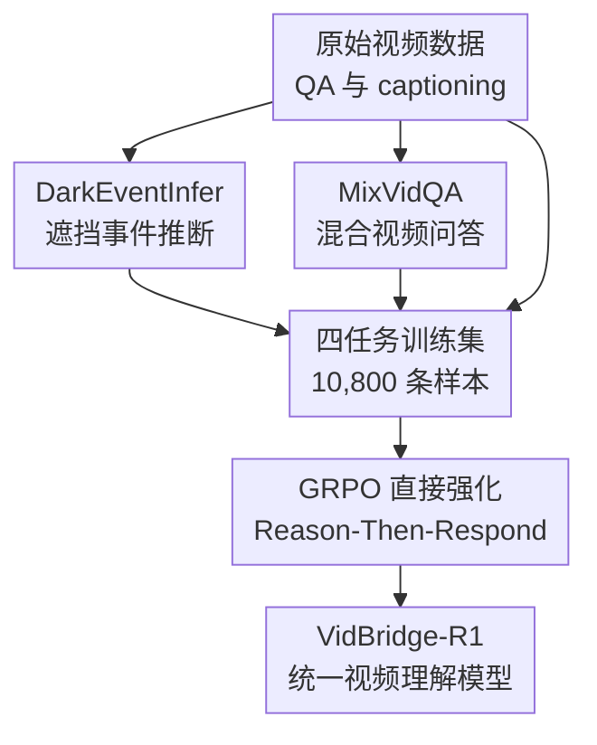

# VidBridge-R1: Bridging QA and Captioning for RL-based Video Understanding Models with Intermediate Proxy Tasks

**会议**: ICLR 2026  
**OpenReview**: [https://openreview.net/forum?id=K7SdrTobcY](https://openreview.net/forum?id=K7SdrTobcY)  
**代码**: https://github.com/VidBridge-R1/VidBridge-R1  
**领域**: 视频理解  
**关键词**: 视频理解, 强化学习, 视频问答, 视频描述, 中间代理任务  

## 一句话总结
VidBridge-R1 发现视频 QA 与视频 captioning 在 RL 训练中存在收敛式回答和发散式描述的目标冲突，并用 DarkEventInfer 与 MixVidQA 两个中间代理任务把二者桥接起来，从而在一个 Reason-Then-Respond 视频模型里同时提升问答、推理和描述能力。

## 研究背景与动机

**领域现状**：Reason-Then-Respond 范式已经从纯文本模型扩展到多模态模型，常见做法是让模型先在 `<think>` 中展开推理，再在 `<answer>` 中给出最终回答，并用 GRPO 这类强化学习算法优化回答质量。图像理解里，这类训练已经在数学、几何、检测、grounding 等任务上带来明显收益；视频方向也开始出现 Video-R1、VideoRFT、VideoChat-R1 等模型，尝试把推理式输出迁移到长时序、多事件的视频场景。

**现有痛点**：已有视频推理模型往往只盯住一种任务形态。偏 QA 的模型擅长从视频里定位一个正确选项或短答案，但不一定能生成完整、细致、覆盖面足够的视频描述；偏 captioning 的模型会强化细粒度描述能力，却可能牺牲问答时的精确定位。更麻烦的是，把 VideoQA 和 captioning 数据直接混在一起做 RL 并不会自然得到一个全能模型，论文实验显示这种朴素混合反而会让两个任务都掉点。

**核心矛盾**：作者把这个现象归因于 QA 与 captioning 在 RL 优化里的任务性质相反。QA 是收敛式任务：模型要从大量视觉线索里压缩出一个低熵、唯一且可判定的答案；captioning 是发散式任务：模型要尽量完整地覆盖视频事件、动作、场景和时序细节，输出天然更长、更高熵。RL 的 reward 通常是全局信号，如果直接把这两种目标塞进同一个优化过程，模型很容易在“短而准”和“全而细”之间互相拉扯。

**本文目标**：论文希望训练一个统一的视频理解模型，而不是为 QA 和 captioning 各做一个专用模型。这个模型需要保留 Reason-Then-Respond 的推理能力，同时在一般视频理解、复杂视频推理和细粒度视频描述上都能工作；训练上则要避免简单混合 reward 带来的目标冲突。

**切入角度**：作者没有直接调整 QA 或 captioning 的最终任务形式，而是在二者之间插入更贴近“视频综合理解”的代理任务。这些任务既不像 QA 那样只要求一个点状答案，也不像 captioning 那样完全开放，而是让模型在完整上下文理解和关键线索定位之间来回切换。

**核心 idea**：用 DarkEventInfer 训练模型根据可见上下文推断被遮挡的视频事件，用 MixVidQA 训练模型在混合视频中筛出相关片段回答问题，以两个中间代理任务缓冲 QA 的收敛推理和 captioning 的发散描述之间的 RL 冲突。

## 方法详解

### 整体框架

VidBridge-R1 的训练框架以 Qwen2.5-VL-7B-Instruct 为 backbone，不先做 SFT，而是直接用 GRPO 在多任务数据上强化 Reason-Then-Respond 输出。训练数据由四部分组成：常规 VideoQA、captioning、DarkEventInfer 和 MixVidQA；其中前两者让模型熟悉最终下游任务形式，后两者是本文真正用来桥接任务范式的中间代理任务。

整个流程可以理解为：先构造两类“介于问答与描述之间”的视频任务，再把它们与 VideoQA/captioning 一起放进 GRPO；每个样本采样多条带 `<think>` 与 `<answer>` 的响应，根据任务类型计算 reward，最后用组内相对优势更新策略模型。这样训练出来的模型既要学会回答唯一问题，也要学会维持对视频上下文的完整建模。

### 关键设计

**1. DarkEventInfer：用遮挡事件推断逼模型做整体上下文建模**

DarkEventInfer 针对的是 captioning 所需要的整体理解能力，但它不是让模型自由描述整段视频，而是把视频中的一个事件片段替换成黑屏，要求模型根据前后可见片段推断被遮挡的事件。作者从 COIN 数据集中利用事件 caption 与时间戳标注，随机选取每个视频的一个事件并黑屏遮挡，再让模型回答“黑屏里大概发生了什么”。

这个任务的巧妙之处在于，它把 captioning 的发散理解压缩成一个可评估的推断问题。模型如果只会找单个视觉物体，很难猜出被遮挡的步骤；它必须理解动作序列、上下文因果和事件流程。例如烹饪视频中前后片段分别出现处理鱼和准备下锅，黑屏中更可能是给鱼调味而不是无关动作。这样训练得到的能力更接近“看懂一段视频在讲什么”，但 reward 又比开放式 captioning 更容易定义。

数据质量上，作者没有完全依赖自动构造。遮挡后若人类也无法根据上下文推断事件，该样本会被移除；不准确或有歧义的 caption 也会被修订。这一步很重要，因为代理任务只有在“可由上下文推断”时才真正训练视频理解，否则会退化成猜测或语言先验。

**2. MixVidQA：用交错视频问答训练相关片段选择与干扰抑制**

MixVidQA 针对的是 QA 所需要的精确定位能力。作者从 Kinetics 里取约 10 秒的视频片段，随机选两段视频，并以 1.5 到 2 秒的间隔把它们交错拼接成一条混合视频；随后用 Qwen2-VL-72B 生成只指向其中一个原始视频的问答对，再由人工检查去掉指代不清或答案不可靠的样本。

这个任务比普通 VideoQA 更难，因为模型不能只在整条视频里寻找显著物体或动作，它必须先判断问题属于哪一个视频源，再忽略另一个视频源的干扰。也就是说，模型同时面对两个层面的选择：相关视频流是哪一个，相关流内部的答案线索在哪里。这个设计把 QA 的“收敛到正确答案”训练得更纯粹，也让模型学会在复杂视频输入中筛除无关信息。

与 DarkEventInfer 配合后，两个代理任务形成互补：DarkEventInfer 拉着模型不要只追求短答案，要维持跨片段的事件理解；MixVidQA 又拉着模型不要泛泛描述，要能在混杂时序中锁定问题相关内容。论文想要桥接的正是这两种能力，而不是简单把 VideoQA reward 和 caption reward 加在一起。

**3. 多任务数据过滤：让 GRPO 真正看到有区分度的样本**

GRPO 依赖同一问题下多条采样响应的 reward 差异来构造 advantage。如果一个样本太简单，采样出的回答全对；或者 reward 对几条回答完全一样，那么组内标准化后的优势信号会消失，训练几乎没有推动力。为此作者在训练前用 Qwen2.5-VL-7B 强制推理并以温度 1.0 采样 5 条回答，过滤掉“全都正确”的非 caption 样本。

captioning 的过滤方式不同，因为 caption reward 是连续质量分数。作者用 AutoDQ 计算 5 条候选 caption 的 F1 分数，如果 F1 方差小于 0.2，就认为这个样本对 GRPO 区分度不足并丢弃。最终训练集包含 1,841 条 DarkEventInfer、2,332 条 MixVidQA、2,003 条 VideoQA 和 4,624 条 captioning，共 10,800 条高质量样本。这个过滤步骤看似工程化，但它直接决定 RL 更新是否有有效梯度。

**4. 奖励设计：把格式约束作为任务奖励的前置门槛**

VidBridge-R1 为不同任务使用不同 reward。DarkEventInfer 由 Qwen2.5-72B 作为 judge，分为完全正确、部分正确且无错误、有错误三档，奖励分别是 2、1、0；MixVidQA 和常规 VideoQA 更接近判别式任务，正确给 1，错误给 0；captioning 则结合 AutoDQ 的事件级 recall/precision 与关键词奖励。

caption reward 的核心是 $R_{AutoDQ}=Recall+\alpha \cdot Precision$，其中 $\alpha=0.5$。作者这样设置是因为 captioning 中 recall 要求覆盖更多事件，precision 则要求别写错、别乱写；如果只奖励 precision，模型可能生成过短描述，如果只奖励 recall，又容易堆砌内容。关键词奖励 $R_{keywords}$ 额外鼓励时间相关词，惩罚猜测性或无关词，最终 $R_{Caption}=R_{AutoDQ}+\beta \cdot R_{keywords}$，其中 $\beta=0.2$。

格式 reward 也不是简单加到总分里。模型必须输出符合 `<think>...</think><answer>...</answer>` 的结构，才有资格获得任务 reward；总奖励写成 $R_{total}=R_{format}\cdot(R_{DarkEventInfer}+R_{MixVidQA}+R_{VideoQA}+R_{Caption})$。这样可以避免两种 reward hacking：只学会格式但答案错，或答案对但不遵守 Reason-Then-Respond 格式。

### 一个完整示例

可以把 DarkEventInfer 想成一段厨房视频：前 5 秒里，一个人把鱼放在砧板上并擦干；中间 4 秒被黑屏遮挡；后 5 秒里，鱼已经带着调料进入锅中。普通 captioning 可能只描述“有人在做饭”，普通 QA 可能只回答“锅里有什么”，但 DarkEventInfer 要求模型根据前后状态变化推断黑屏中最可能发生的是“给鱼撒香料或腌制”。这个答案既需要看懂整段流程，又要收敛到一个具体事件。

MixVidQA 的例子则是一条交错视频：奇数片段来自男孩堆叠红色杯子的 clip，偶数片段来自另一个人在户外运动的 clip。问题问“男孩在视频中主要关注什么？”模型如果把两条视频当作普通拼接，可能会混入户外运动信息；正确做法是先识别“男孩”只出现在其中一个源视频里，再基于该源视频回答“他在重新排列并堆叠红色杯子”。这正是论文希望模型学到的干扰抑制与相关片段定位。

### 损失函数 / 训练策略

训练算法使用 GRPO。对每个问题 $q$，旧策略 $\pi_{\theta_{old}}$ 采样 $G$ 条响应 $\{o_1,o_2,...,o_G\}$，得到对应 reward $\{r_1,r_2,...,r_G\}$，每条响应的优势为：

$$
A_i=\frac{r_i-mean(\{r_1,r_2,...,r_G\})}{std(\{r_1,r_2,...,r_G\})}
$$

随后用 PPO 风格的 clipped objective 更新当前策略。论文中特别强调没有使用 KL 正则项，即设置 $\lambda=0$，理由是他们发现高质量推理数据与代理任务已经能直接激活模型的推理能力，额外 SFT 反而可能把模型压到固定推理模板里，损害原有潜力。

实现细节上，backbone 是 Qwen2.5-VL-7B-Instruct；训练时每个视频均匀采样 16 帧，最大分辨率为 $196\times28\times28$；GRPO 每个问题采样 8 条响应，temperature 为 1.0，学习率 $1e^{-6}$，batch size 为 32。推理时 QA 任务按 1 fps 采样，最多 128 帧；captioning 为保留细节均匀采样 16 帧，输出长度上限 2,048，并使用 greedy decoding。

## 实验关键数据

### 主实验

| 任务类别 | 数据集 / 指标 | VidBridge-R1 | 最强基线 | 提升 |
|--------|------|------|----------|------|
| 一般视频理解 | Video-MME overall | 64.3 | 62.2 (VideoRFT) | +2.1 |
| 一般视频理解 | LongVideoBench | 59.3 | 57.4 (VideoRFT) | +1.9 |
| 一般视频理解 | MVBench | 61.9 | 60.3 (VideoRFT) | +1.6 |
| 视频描述 | DREAM-1K F1 | 35.2 | 34.4 (Qwen2.5-VL reasoning) | +0.8 |
| 视频描述 | VidCapBench Acc | 12.5 | 12.1 (Qwen2.5-VL / VideoRFT) | +0.4 |

| 任务类别 | 数据集 / 指标 | VidBridge-R1 | 最强基线 | 提升 |
|--------|------|------|----------|------|
| 视频推理 | MMVU | 54.7 | 52.4 (VideoRFT) | +2.3 |
| 视频推理 | NExT-QA | 81.6 | 80.5 (VideoRFT) | +1.1 |
| 视频推理 | IntentQA | 97.1 | 94.9 (VideoRFT) | +2.2 |
| 视频推理 | Causal-VidQA | 70.7 | 69.1 (VideoRFT) | +1.6 |
| 视频推理 | Video-Holmes | 40.0 | 38.0 (Qwen2.5-VL / VideoRFT) | +2.0 |
| 代理任务泛化 | DarkEventInfer-Test | 117.0 | 80.0 (Qwen2.5-VL-SFT) | +37.0 |
| 代理任务泛化 | MixVidQA-Test | 49.0 | 33.0 (Qwen2.5-VL-SFT) | +16.0 |

VidBridge-R1 在 Video-MME、LongVideoBench、MVBench 三个一般视频理解基准上都超过了 VideoRFT 等强基线，说明代理任务并没有把模型训练成只会特定格式的 toy model。captioning 上，DREAM-1K F1 提升到 35.2，recall 达到 32.8；VidCapBench 的 accuracy 也达到 12.5。两个 captioning 基准的偏好不同，前者更看事件级准确性，后者更依赖 caption 是否足够覆盖后续问答所需信息，VidBridge-R1 的表现说明它在准确和完整之间取得了相对稳的平衡。

### 消融实验

| 训练任务组合 | Video-MME | LongVideoBench | MVBench | MMVU | IntentQA | DarkEventInfer-Test | MixVidQA-Test | DREAM-1K F1 |
|------|---------|------|------|------|------|------|------|------|
| 仅 Caption | 58.0 | 41.9 | 53.5 | 50.6 | 92.5 | 64.0 | 16.0 | 34.8 |
| 仅 VideoQA | 63.2 | 56.4 | 58.7 | 53.8 | 96.4 | 60.0 | 24.0 | 31.7 |
| VideoQA + Caption | 54.8 | 54.7 | 57.2 | 52.5 | 96.4 | 69.0 | 13.0 | 30.6 |
| 扩量 VideoQA + Caption | 61.5 | 56.4 | 59.6 | 53.2 | 96.5 | 46.0 | 16.0 | 33.0 |
| VideoQA + DarkEventInfer + MixVidQA | 63.8 | 58.6 | 60.4 | 54.1 | 97.2 | 121.0 | 54.0 | 32.2 |
| DarkEventInfer + MixVidQA + Caption | 60.7 | 51.4 | 56.1 | 51.7 | 81.6 | 117.0 | 52.0 | 34.9 |
| 四任务完整训练 | 64.3 | 59.3 | 61.9 | 54.7 | 97.1 | 117.0 | 49.0 | 35.2 |

最关键的消融是“VideoQA + Caption”这一行：它不仅没有比单任务训练更稳，反而在 Video-MME 和 DREAM-1K 上都明显变差。即便把 VideoQA 和 Caption 的数据量按比例扩到与完整四任务相同，总体也没有恢复到 VidBridge-R1 的水平。这支持了作者关于“任务范式冲突”的判断：问题不是数据不够，而是直接混合的优化目标不兼容。

加入 DarkEventInfer 和 MixVidQA 后，VideoQA 相关任务普遍上升，两个 held-out 代理任务测试集提升尤其明显。完整四任务再把 captioning 加回来后，DREAM-1K F1 从 32.2 升到 35.2，同时一般视频理解也达到最佳。这说明代理任务确实起到了缓冲层的作用，让 captioning 不再像朴素混合时那样严重干扰 QA。

### 关键发现

- 直接强迫未训练的 Qwen2.5-VL 在 QA 任务中 Reason-Then-Respond 会降低一般理解表现，例如 Video-MME 从 59.4 降到 53.4，说明“先推理再回答”不是无条件有益，必须配合合适训练。
- SFT baseline 并不理想，Qwen2.5-VL-SFT 在 Video-MME、LongVideoBench、MVBench 和 DREAM-1K 上都没有超过最终 RL 模型，支持作者“高质量代理任务 + 直接 RL 比先 SFT 更合适”的观点。
- 输出 token entropy 分析显示，原始模型在 caption 与 QA 上存在明显熵差；只用常规 QA + Caption 训练时，关键生成阶段仍存在熵差，且 QA 初始 token entropy 被 caption 拉高；加入代理任务后，两类任务的熵差缩小，更利于联合优化。
- DREAM-1K 与 VidCapBench 对 caption 的偏好不同：前者更受准确、简洁描述影响，后者倾向于更丰富的覆盖。VidBridge-R1 的收益不是单纯变短或变长，而是在 recall、precision、coverage 和 conciseness 之间做了更稳的折中。

## 亮点与洞察

- 论文最有价值的地方是把“QA 和 captioning 同训会互相伤害”从经验现象明确解释为 RL 下的输出熵与任务目标冲突。这个解释比单纯说多任务训练难更具体，也能指导后续设计中间任务。
- DarkEventInfer 是一个很自然但有效的代理任务：遮挡事件推断既有可判定答案，又迫使模型理解事件上下文，避免 captioning reward 过于开放的问题。
- MixVidQA 把视频时序中的干扰抑制显式化。它不只是让模型回答问题，而是让模型在交错片段里先选择相关源视频，这对长视频、多事件、多主体场景很有迁移价值。
- 格式 reward 乘以任务 reward 的设计很实用。它把结构正确作为获得语义奖励的前置条件，比把格式分数简单相加更能抑制“格式对但内容错”的投机行为。
- 这篇论文提示一个更一般的多任务 RL 思路：当两个下游任务的 reward 形态冲突时，不一定要调 loss 权重，可能更应该设计中间任务，让模型先学会二者共享的认知能力。

## 局限与展望

- 两个代理任务都需要较强的数据构造与人工审核。DarkEventInfer 要保证遮挡事件可由上下文推断，MixVidQA 要保证问题指代清晰，这会带来较高的数据维护成本。
- reward judge 依赖大模型，包括 Qwen2.5-72B、GPT-3.5-Turbo 和 AutoDQ 流程。不同 judge 的偏差、稳定性和成本都会影响最终训练质量，论文虽然做了分析，但真实复现仍不轻。
- DarkEventInfer 与 MixVidQA 的测试集和训练任务形式一致，虽然数据不同，但仍可能高估模型在更开放真实场景中的代理任务泛化能力。更理想的验证是看它对未见视频任务族的迁移。
- VidBridge-R1 的 backbone 是 7B 级别 Qwen2.5-VL，训练使用 8 张 A800。论文没有充分讨论更小模型、更大模型或不同视频 encoder 下代理任务是否同样有效。
- captioning 评价仍然有局限。DREAM-1K、VidCapBench 和 AutoDQ 各自偏好不同，模型是否真正生成更符合人类需求的视频描述，还需要更细的人评或下游应用验证。

## 相关工作与启发

- **vs Video-R1 / VideoRFT**: 这些方法主要强化视频 QA 或推理任务，能提升一般问答表现，但没有系统解决 captioning 与 QA 在同一 RL 框架中的冲突。VidBridge-R1 的差异在于引入代理任务，而不是只扩大 QA 训练。
- **vs VideoChat-R1**: VideoChat-R1 同样强调视频推理式回答，但更偏任务专用模型。VidBridge-R1 更关注多任务通用性，目标是同时保住一般理解、推理和描述。
- **vs VideoCap-R1**: VideoCap-R1 专注 captioning，适合提升描述质量，但不一定适合收敛式问答。VidBridge-R1 则把 captioning 看作统一视频理解能力的一部分，用 DarkEventInfer 缓解它与 QA 的冲突。
- **vs 常规多任务 RL**: 朴素多任务训练通常会把不同 reward 加权求和，默认任务之间可以共享优化方向。本文说明，当任务输出熵和判定方式相反时，单纯加权可能失效，中间代理任务比调权重更关键。
- **启发**：类似的桥接思路可以迁移到其他多模态冲突任务，例如视觉定位与开放描述、机器人动作选择与语言解释、医学影像诊断与报告生成。核心是找到既可评估、又能保留双方共享认知结构的中间任务。

## 评分

- 新颖性: ⭐⭐⭐⭐☆ 提出两个具体代理任务来桥接视频 QA 与 captioning 的 RL 冲突，问题定义和任务设计都比较有辨识度。
- 实验充分度: ⭐⭐⭐⭐☆ 覆盖一般理解、视频推理、captioning、消融、训练动态和 entropy 分析，但对不同 backbone 与更开放真实场景的验证还可以更强。
- 写作质量: ⭐⭐⭐⭐☆ 主线清楚，冲突解释、数据构造和 reward 设计衔接自然；部分 judge 与指标细节依赖附录，正文复现信息略分散。
- 价值: ⭐⭐⭐⭐⭐ 对 RL-based 视频理解很有参考价值，尤其适合启发后续多任务多模态 RL 中“不要硬混 reward，而要设计桥接任务”的训练范式。

<!-- RELATED:START -->

## 相关论文

- [\[ICLR 2026\] Invert4TVG: A Temporal Video Grounding Framework with Inversion Tasks Preserving Action Understanding Ability](invert4tvg_a_temporal_video_grounding_framework_with_inversion_tasks_preserving_.md)
- [\[ICLR 2026\] SPIKE-RL: Video-LLMs Meet Bayesian Surprise](spike-rl_video-llms_meet_bayesian_surprise.md)
- [\[CVPR 2026\] LongVideo-R1: Smart Navigation for Low-cost Long Video Understanding](../../CVPR2026/video_understanding/longvideo-r1_smart_navigation_for_low-cost_long_video_understanding.md)
- [\[ICLR 2026\] CaReBench: A Fine-grained Benchmark for Video Captioning and Retrieval](carebench_a_fine-grained_benchmark_for_video_captioning_and_retrieval.md)
- [\[ICLR 2026\] VUDG: A Dataset for Video Understanding Domain Generalization](vudg_a_dataset_for_video_understanding_domain_generalization.md)

<!-- RELATED:END -->
