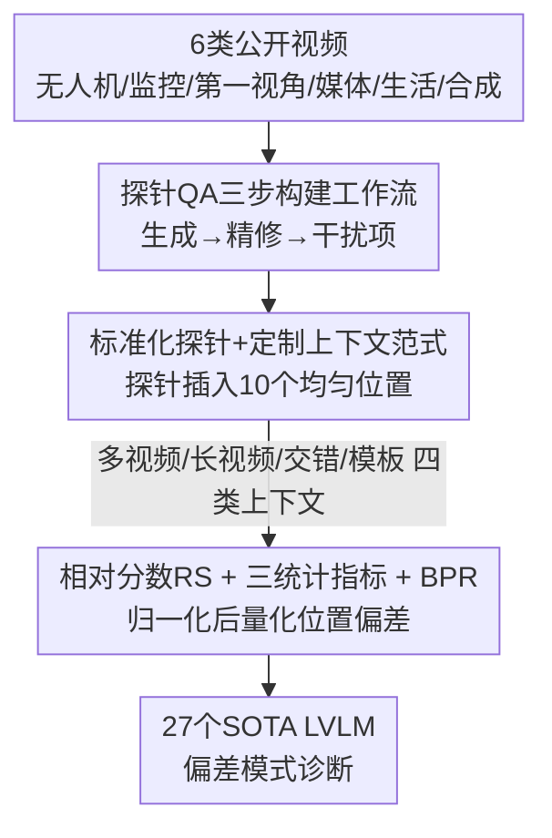

# Video-LevelGauge: Investigating Contextual Positional Bias in Video Language Models

**会议**: ICLR 2026  
**OpenReview**: [https://openreview.net/forum?id=0V0bQi24YC](https://openreview.net/forum?id=0V0bQi24YC)  
**代码**: https://github.com/Cola-any/Video-LevelGauge (有)  
**领域**: 视频理解 / 多模态VLM / 评测基准  
**关键词**: 位置偏差、视频大模型、评测基准、标准化探针、上下文长度

## 一句话总结
本文提出 Video-LevelGauge，一个专门评测视频大模型（LVLM）"上下文位置偏差"的基准——把标准化探针片段插入到上下文的不同位置，用相对分数 + 偏差模式识别来量化模型对同一内容在不同位置是否理解一致，并在 27 个 SOTA 模型上揭示了开源模型普遍存在的头部/邻近偏好。

## 研究背景与动机

**领域现状**：视频大模型（LVLM）近年进步飞快，配套的评测基准（MVBench、TempCompass、MLVU、LongVideoBench 等）也大量涌现。但这些基准几乎都在度量模型对**整段视频**的**总体性能**——比如时序推理、总结任务的平均准确率。

**现有痛点**：总体准确率掩盖了一个关键却被忽视的行为：**上下文位置偏差**（contextual positional bias）。即同一段内容、同一个问题，仅仅因为它出现在视频序列的开头、中间还是结尾，模型的理解就会不一致。如论文 Figure 1 的例子：同样问"有几头大象"，把那段大象画面放在视频开头模型答对（100 分），放中间就答"看不到大象"（10 分），放结尾又答成"约五头"（50 分）。现有基准对诊断和缓解这个问题几乎提供不了任何信息。

**核心矛盾**：心理学的"序列位置效应"（serial position effect）指出人类更容易记住序列首尾的内容；LLM 也有著名的"lost in the middle"。但在**视频理解**里，各类 LVLM（带记忆模块的、长上下文训练的、多模态推理的）到底有没有位置偏差、偏成什么样、在视频-文本交错的混合模态上下文里又如何表现——这些都还是空白。一个号称擅长长视频理解的模型，理应被验证它能否在整段序列上保持一致而有效的感知。

**本文目标**：构造一个能**精确控制变量**的诊断工具，把"位置"这一变量从"任务难度""信息泄漏"等混杂因素里干净地剥离出来，从而系统刻画位置偏差。

**切入角度**：借鉴大海捞针（needle-in-a-haystack）思路，但反过来用——不是测"能不能找到针"，而是把一根**标准化的针（探针 QA）**插到上下文不同位置，看模型回答的准确率随位置怎么波动。因为探针本身固定，准确率的波动就**只能**归因于位置。

**核心 idea**：用"标准化探针 + 定制上下文"范式把位置变量隔离出来，再配一套相对分数 + 偏差模式识别的分析方法，专门量化 LVLM 的上下文位置偏差。

## 方法详解

### 整体框架

Video-LevelGauge 的核心范式是**标准化探针（standardized probe）+ 定制上下文（customized context）**。一个"探针"是一段精心挑选的视频片段，配上一道经过严格打磨、必须真正看视频才能答对的问题（MCQA 或开放式描述）。评测时，把同一个探针插入到一段人工构造的上下文里的若干位置（论文用 10 个均匀分布的位置），分别让模型回答，再比较不同位置下的准确率差异——差异越大，位置偏差越严重。

整个基准的数据流是：从公开测试集收集 6 类视频 → 用"自动生成 + 人工精修"的三步工作流构造探针 QA → 把探针插进 4 类定制上下文的不同位置 → 用相对分数 RS、三个统计指标和偏差模式识别（BPR）刻画偏差。最终包含 438 段人工筛选的多类型视频、1,177 道 MCQA、120 道开放式描述题，覆盖 OCR、属性识别、目标识别、目标计数、关系识别、动作识别六类结构化任务。

### 关键设计

**1. 标准化探针 + 定制上下文范式：把"位置"从任务难度里干净剥离**

针对"现有基准在自然视频里密集出题、不同位置的题难度不一、还可能信息泄漏"这个痛点，本文反其道而行：探针 QA 是**固定**的一根针，上下文是**可定制**的草堆，唯一改变的是针插入的位置。这样带来三个好处：① **控制变量**——消除了不同位置 QA 难度不同、上下文信息泄漏的混杂效应，准确率的波动只能来自位置；② **灵活可控**——上下文长度和被测位置都能自由调节；③ **场景模拟**——通过换不同草堆，可以模拟多种真实场景。具体地，定制上下文有四类：多视频理解（探针插进多段视频组成的上下文）、长视频理解（探针插进一段自然长视频的特定时间点）、多模态交错输入（探针插进文本与视频交替的序列，对应 RAG、多轮对话场景）、模板视频背景（用 ImageNet 均值像素初始化的模板视频当上下文，作为最简单的对照）。评测时每个探针用 9 段同类视频拼成平均 7.2 分钟的合成上下文，每个探针固定采样 6 帧以隔离采样影响。

**2. 探针 QA 三步构建工作流：自动生成 + 人工精修，既省力又保证"非看视频不能答"**

一个好探针的硬要求是**视觉敏感**——不能靠常识或文本就猜对，否则位置偏差测不出来。为此本文设计了一条"低人力"工作流（Figure 5），分三步：① **QA 生成**——先用 GPT-4o 对视频逐帧加字幕，人工为每类任务写好任务定义和正负 QA 示例，再喂给 LLM 通过 prompt engineering 批量生成任务相关的问答对；② **QA 精修**——用 LLM 做"盲过滤"（blind filtering）剔除会泄漏答案或靠常识可答的题，再用 GPT-4o 基于原视频过滤掉幻觉和错答的题，最后全部人工精修；③ **干扰项构建**——对 MCQA，让 LLM 生成多个有迷惑性的干扰选项，再由标注者人工核验，保证选项之间没有明显差异、随机打乱，平均问题长度 30.4 词。为验证质量，作者用 Qwen2.5-VL-7B 和 InternVL3-8B 测试：在**纯文本输入**下模型准确率接近随机（25%），单帧输入也远未饱和，且准确率随帧数和模型规模单调上升——证明这些题确实高度依赖视觉感知，适合用来探测位置偏差。

**3. 相对分数 RS + 三统计指标 + 偏差模式识别 BPR：把"偏差有多严重、偏成什么样"量化出来**

不同模型本身能力有差异，直接用绝对准确率比较位置偏差不公平。为此本文先定义**相对分数**（relative score），用模型自身能力归一化：

$$RS_i = \frac{S_i}{S_{\text{meta}}}$$

其中 $S_i$ 是探针插在第 $i$ 个位置时的准确率，$S_{\text{meta}}$ 是探针**单独**输入、不带任何上下文时的准确率（即模型对这根针本身的理解上限）。在 RS 基础上，用三个**统计指标**刻画偏差：位置均值 $P_{\text{mean}} = \text{mean}(\{RS_i\}_{i=1}^N)$ 表示跨位置的平均表现；位置极差 $P_{\text{ran}} = \max(\{RS_i\}) - \min(\{RS_i\})$ 度量最坏情况的波动幅度；位置方差 $P_{\text{var}} = \text{Var}(\{RS_i\})$ 度量位置稳定性。$P_{\text{ran}}$ 和 $P_{\text{var}}$ 越小越好，$P_{\text{mean}}$ 越大越好。

光有数字还不够直观，本文进一步提出**偏差模式识别**（Bias Pattern Recognition, BPR），基于多项式拟合把模型归为五类：**稳定（—）**准确率跨位置基本一致；**头部偏好（↘）**插在视频开头时准确率更高；**邻近偏好（↗）**插在视频结尾（最靠近问题）时更高；**中间迷失（U）**首尾理解好、中间差，借自 LLM 的 lost-in-the-middle；**剧烈波动（W）**随位置反复抖动、无明确区域偏好但对位置极度敏感。统计指标给"偏差多大"，BPR 给"偏成什么形状"，两者结合才完整刻画了一个模型的位置偏差画像。

## 实验关键数据

### 主实验

在 Video-LevelGauge 上评测了 27 个 SOTA LVLM（6 个商业 + 21 个开源）。核心结论：**商业模型的位置偏差普遍比开源模型轻**，Gemini 2.5 Pro 偏差最小（$P_{\text{ran}}$ 仅 2.0、$P_{\text{var}}$ 0.9、BPR 稳定）。下表节选代表性模型（指标取六任务平均）：

| 模型 | 规模 | $P_{\text{mean}}\uparrow$ | $P_{\text{ran}}\downarrow$ | $P_{\text{var}}\downarrow$ | BPR | $S_{\text{meta}}\uparrow$ |
|------|------|------|------|------|------|------|
| Gemini 2.5 Pro† | - | 98.4 | 2.0 | 0.9 | — 稳定 | 81.7 |
| GPT-4o-latest | - | 98.1 | 2.9 | 1.4 | — 稳定 | 79.9 |
| GLM-4.5V† | 108B | 97.8 | 2.7 | 1.0 | — 稳定 | 79.9 |
| InternVL3 | 78B | 97.1 | 3.9 | 2.8 | — 稳定 | 74.2 |
| Qwen2.5-VL | 7B | 89.6 | 12.4 | 11.7 | U 中间迷失 | 68.2 |
| MiniGPT4-Video | 7B | 84.9 | 9.6 | 15.4 | ↘ 头部偏好 | 49.3 |
| LLaMA-VID | 13B | 81.1 | 12.3 | 17.3 | W 剧烈波动 | 31.2 |

关键观察：① $S_{\text{meta}}$（常规视觉理解能力）**与位置偏差不相关**——Qwen-VL-Max 作为图像导向模型 $S_{\text{meta}}$ 很高，但位置偏差依然严重，说明传统基准测不出这一维度；② 两阶段方法（把帧描述喂给 LLM）普遍呈 U 形，与 LLM 的 lost-in-the-middle 一致；③ 多模态推理模型（GLM-4.5V）位置偏差极小，推理模式（†）能进一步缓解偏差。

### 分析实验

| 分析维度 | 关键发现 |
|---------|---------|
| 上下文类型 | Finding 1：复杂多模态上下文里偏差更重。模板/短视频等简单上下文偏差最轻，长视频/多视频加剧，**引入文本后（交错视频-文本、长文本）偏差最严重**——归因于缺少长混合模态数据训练 |
| 上下文长度 | Finding 2：偏差在各长度下普遍存在，且随长度增加而加剧、模式还会迁移。Video-XL2/LongVILA/LLaVA-OV 随长度从头部偏好（↘）→ 中间迷失（U）→ 邻近偏好（↗）三段式漂移 |
| 模型规模 | Finding 3：偏差随模型增大显著缓解，符合 scaling law。同系列大模型曲线更平、$P_{\text{var}}$ 更低，对上下文干扰更鲁棒 |
| 开放式题 vs MCQA | 开放式描述题偏差略大于 MCQA——描述需要更细粒度全面感知，而选择题常只针对单个目标/动作，部分偏差在 MCQA 下会被漏检 |

### 关键发现
- **能力强 ≠ 偏差小**：$S_{\text{meta}}$ 和位置偏差脱钩，这正是本文价值——揭示了一个传统基准完全看不到的维度。商业模型偏差小，作者推测源于更长的训练上下文和更大参数量。
- **长上下文训练的有效性需重新审视**：LongVA、LongVILA 这类专门长视频训练的模型并没能在整段序列上稳定表现，说明它们在长视频任务上的总体性能提升，可能更多来自见过更多视频数据带来的视觉理解增强，而非真正理解了整段序列。
- **训练数据偏差是诱因**：MiniGPT4-Video 呈头部偏好，因其训练集 WebVid 有"静态外观偏差"——视频开头的视觉线索往往就足够理解，模型因此学偏。

## 亮点与洞察
- **"反向大海捞针"的巧思**：把固定探针插到不同位置、而非在自然视频里密集出题，一举消除了任务难度和信息泄漏两个混杂因素，让位置成为唯一自变量——这是整个基准能成立的方法论根基。
- **RS 归一化让跨模型比较公平**：用模型自身的 $S_{\text{meta}}$ 归一化，剥离了"模型本身强弱"，使得偏差度量真正反映"一致性"而非"能力"。这个思路可迁移到任何需要跨能力差异比较稳定性的评测。
- **BPR 五类模式给出可操作的诊断**：不只给一个偏差分数，而是分类出头部/邻近/中间迷失/波动/稳定，直接对应到不同的成因和缓解方向（如头部偏好→训练数据外观偏差）。
- **混合模态是偏差重灾区**：揭示了交错视频-文本上下文（RAG、多轮对话最常见的形态）偏差最严重，给出了"训练交错数据 + 跨模态上下文检索"的明确改进方向。

## 局限与展望
- **作者承认**：MCQA 会漏检部分偏差（选择题太"窄"），开放式题更能暴露问题但只有 120 道；缓解位置偏差的具体算法本文未给出，只指出了方向（长视频训练、上下文检索、视频 token 压缩、位置编码优化）。
- **自己发现的局限**：合成上下文平均 7.2 分钟，对"小时级"超长视频的覆盖有限（仅在附录 A.2 补充）；探针均匀采 6 帧、固定 10 个位置，位置粒度和帧数对结论的敏感性未充分展开；偏差归因（如归到 WebVid 外观偏差）多为推测，缺少控制变量的训练实验佐证。
- **改进思路**：可把 BPR 模式与具体训练配方做配对实验，验证"哪种训练能把 U 形掰直"；也可把该探针范式接入训练循环，作为缓解位置偏差的在线诊断信号。

## 相关工作与启发
- **vs NIAH 类基准（VNBench / LV-Haystack / V-NIAH）**：它们也插针，但目标是测"时序检索能力"（能不能找到针）；本文目标是测"位置一致性"（同一根针在不同位置理解是否一致），并配了 RS+BPR 的专门分析方法，关注点正交。
- **vs 长视频总体基准（VideoMME / MLVU / LongVideoBench）**：它们测整段视频的总体性能，本文测细粒度的位置行为，是对前者的**补充诊断**——本文反复强调 $S_{\text{meta}}$ 与偏差脱钩，正是说明这两类基准测的是不同维度。
- **vs LLM 的 lost-in-the-middle 研究**：本文确认视频 LVLM 也有类似 U 形偏差，但明确指出缓解 LLM 位置偏差的方法**不能直接迁移**到 LVLM（附录 A.1 有对比分析），因为视觉模态引入了新的偏差来源。

## 评分
- 新颖性: ⭐⭐⭐⭐⭐ 首个系统研究视频理解中上下文位置偏差的工作，标准化探针范式 + RS/BPR 分析方法都很扎实
- 实验充分度: ⭐⭐⭐⭐⭐ 27 个 SOTA 模型 + 上下文类型/长度/规模/题型四维分析，结论清晰且有可操作启示
- 写作质量: ⭐⭐⭐⭐ 动机和指标定义讲得清楚，benchmark 构建流程完整；部分偏差归因偏推测
- 价值: ⭐⭐⭐⭐⭐ 揭示了传统基准看不到的关键维度，为长视频/多模态模型的改进指明了方向

<!-- RELATED:START -->

## 相关论文

- [\[ACL 2025\] Addressing Blind Guessing: Calibration of Selection Bias in Multiple-Choice Question Answering by Video Language Models](../../ACL2025/video_understanding/addressing_blind_guessing_calibration_of_selection_bias_in_multiple-choice_quest.md)
- [\[ICLR 2026\] LLaVAction: Evaluating and Training Multi-modal Large Language Models for Action Understanding](llavaction_evaluating_and_training_multi-modal_large_language_models_for_action_.md)
- [\[ICLR 2026\] Point Prompting: Counterfactual Tracking with Video Diffusion Models](point_prompting_counterfactual_tracking_with_video_diffusion_models.md)
- [\[ICLR 2026\] FlashVID: Efficient Video Large Language Models via Training-free Tree-Based Spatiotemporal Token Merging](flashvid_efficient_video_large_language_models_via_training-free_tree-based_spat.md)
- [\[ICLR 2026\] IF-VidCap: Can Video Caption Models Follow Instructions?](if-vidcap_can_video_caption_models_follow_instructions.md)

<!-- RELATED:END -->
