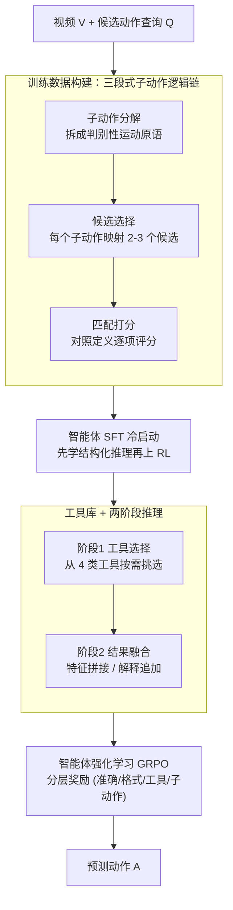

# Video-STAR: Reinforcing Open-Vocabulary Action Recognition with Tools

**会议**: ICLR 2026  
**OpenReview**: [https://openreview.net/forum?id=NBOHB6aYZh](https://openreview.net/forum?id=NBOHB6aYZh)  
**领域**: 视频理解 / 多模态VLM / 强化学习  
**关键词**: 开放词表动作识别, 子动作分解, 工具增强, 智能体强化学习, GRPO

## 一句话总结
Video-STAR 把开放词表动作识别（OVAR）重新表述成一个「先选工具、再分解子动作」的序贯决策过程：在推理时让多模态大模型按需调用姿态估计、人体检测、在线检索等领域工具补充视觉证据，并把整体动作拆成可区分的子动作原语逐一打分匹配；再配合一个同时奖励准确率、工具效率与子动作相关性的分层奖励，用 GRPO 把模型从「依赖文本先验」训练成「视觉落地推理」，在 HMDB-51、UCF-101、K-400/600、SSv2 五个基准上大幅刷新 SOTA。

## 研究背景与动机
**领域现状**：开放词表动作识别要求识别训练时没见过的动作类别。早期方法靠 CLIP 的跨模态对齐（ActionCLIP、ViFi-CLIP）或参数高效适配器（ST-Adapter、AIM）把图文知识迁移到视频，近来则尝试用多模态大模型（MLLM）的链式思维（CoT）做零样本动作理解。

**现有痛点**：作者指出 MLLM 用在 OVAR 上有两个硬伤。其一是**跨模态幻觉**——模型过度依赖文本先验做 CoT 推理，把连续的时序视觉特征硬塞进离散的文本表示里，结果「看图说话」时常凭语言常识脑补（如把举杆击打脑补成「baseball hit」甚至「throw」）。其二是**缺乏类别专属推理能力**——开放词表里动作不可预测，模型学不到判别性模式，遇到语义相近的动作（golf / hit / punch 都涉及手臂前伸挥动）就分不清。

**核心矛盾**：动作的本质是细粒度时序动态 + 层级化的身体部位协同，而把动作当成一个「整体（monolithic）实体」去匹配文本标签，天然丢掉了这种内部结构。已有的工具增强 CoT 工作（缩放、裁剪等帧级操作）只补了静态空间信息，没有建模运动的连续性与子动作的层级依赖。

**本文目标**：让模型具备两种能力——(1) 通过上下文子动作分解实现细粒度动作判别；(2) 通过多模态 CoT 自主调用领域工具增强视觉-语义表示，减少幻觉。

**切入角度**：与其把动作看成一个标签匹配问题，不如把它看成一个**序贯决策过程**：分解子动作 → 匹配候选 → 分层打分，并让强化学习去自主学会「什么时候该用哪个工具、哪些子动作更重要」，而不是靠人工监督显式指定。

**核心 idea**：用「上下文子动作分解 + 工具增强智能体强化学习」统一框架，把以文本为中心的推理迁移到视觉落地的推理。

## 方法详解

### 整体框架
Video-STAR 的输入是一段视频 $V$ 和给定候选动作的查询 $Q$，输出是预测动作 $A$（可能属于训练时未见类别）。整套系统由三个紧耦合的训练阶段串成：先用「三段式子动作逻辑链」合成带工具调用的高质量 CoT 推理数据；再把 Qwen2.5-VL 基座在这些结构化推理链上做监督微调（SFT）做冷启动；最后用 GRPO 强化学习，在一个分层奖励下让模型自主优化工具使用与子动作推理。

推理时模型走的是一个**两阶段决策**：第一阶段做工具选择，从工具集 $T=\{T_p,T_d,T_a,T_v\}$（姿态估计 / 人体检测 / 动作解释 / 视频描述）里挑出当前最相关的工具并执行，得到中间结果 $R$；第二阶段做结果融合，把视觉工具产出的特征 $F$ 与原始帧拼接、把语义工具产出的解释 $E$ 追加到查询里，最终预测为

$$A \sim \pi_\theta(\cdot \mid V \oplus F,\; Q \oplus E;\; T),$$

其中 $\oplus$ 对视觉模态是特征拼接、对文本是文本追加，$\pi_\theta$ 是 MLLM 的策略网络。

### 关键设计

**1. 上下文子动作分解：把整体动作拆成可区分的运动原语**

这一步直接针对「缺乏类别专属推理、分不清语义相近动作」的痛点。Video-STAR 不再把动作当成一个整体标签去匹配，而是用一条三段式逻辑链把它层层拆开：先做**子动作分解**，按身体部位交互识别关键运动原语（如 "shoot ball" 拆成「躯干弯曲 → 腿部伸展 → 脚-球交互」）；再做**候选选择**，把每个子动作映射到预定义动作定义、生成 2-3 个语义相关候选（如「躯干弯曲」暗示 run、「腿部伸展」暗示 hurdle、「脚-球交互」对应 shoot），既缩小搜索空间又保留语义多样性；最后做**匹配打分**，把所有子动作对照每个候选的详细定义逐项评分（如 Golf 9/10、Hit 6/10、Punch 3/10），选最高分者。这样模型被迫去看「手臂怎么动、躯干怎么转、脚和什么接触」这些视觉上真正可区分的细节，而不是凭文本常识脑补，从根上隔离了整体感知的歧义。

**2. 多工具库与两阶段动态工具调用：按需补视觉证据消歧**

这一步针对「跨模态幻觉」。作者构建了一个含四个子工具的工具库：人体检测与姿态估计都用 YOLO 11（后者用其 17 关键点 COCO 骨架捕捉细粒度关节位置），动作解释和视频描述则调用 Qwen API 做在线检索增强（RAG），把动作按转换阶段重新定义（如 "stand" → "transit from sit or lay to stand"）、并抽取时序显著帧来消解多阶段动作序列（如 "sit-stand-walk"）的歧义。关键在于它不是把所有工具都跑一遍的静态流水线，而是让模型**先判断该调哪个工具再执行**：视觉工具 $T_p,T_d$ 的特征拼回视频帧丰富时空表示，语义工具 $T_a,T_v$ 的解释追加进查询提供上下文锚定。这种智能体式的动态选择在几乎不掉精度的前提下显著省时——对照实验里相比「全工具静态流水线」总推理时间从 4.10s 降到 3.18s（约省 22%），UCF-101 精度只差 0.5%。

**3. 智能体 SFT 冷启动：先教会结构化推理再放手 RL**

这是一个看似工程、实则关键的设计。作者一开始仿照 R1-Zero 直接上 RL，却发现一个反常现象：随着策略 rollout 推进，**工具调用频率持续下降**。原因是工具增强后的视觉特征与模型预训练数据存在目标域上的分布差异，纯 RL 在没有先验引导的高维推理空间里很难稳定地学会用工具。于是他们加了一个冷启动 SFT 阶段，把每个训练样本形式化为 $T=(X,I,S,Y)$（输入模态 / 指令 / 推理步骤 / 目标输出），最小化推理过程的负对数似然：

$$\mathcal{L}_{\text{SFT}} = -\mathbb{E}_{T\sim D}\left[\sum_{t=1}^{T}\log p_\theta(s_t \mid X, I, s_{<t})\right],$$

让模型先在 5000 条经 Qwen-VL-Max 专家校验过的高保真推理链上学会「生成符合任务指令与真值的推理链」，再用同一批数据初始化 RL 策略。消融显示去掉 SFT（纯 RL）比去掉 RL（纯 SFT）掉得更狠，印证了「先有结构化推理地基、再做 RL 优化」的两阶段策略。

**4. 分层奖励：让 RL 同时奖励准确率、工具效率与子动作相关性**

普通奖励只看答案对错和格式，无法引导模型「有意义地」用工具和分解子动作。Video-STAR 用 GRPO 做策略优化（组内对每个 query 采样 $G$ 条轨迹、用组内归一化优势 $A_i=(r_i-\text{mean})/\text{std}$ 更新），并设计了四分量分层奖励：准确率 $R_{acc}$、格式 $R_{format}$、工具使用 $R_{tool}$、子动作 $R_{sub}$。其中子动作奖励用层级加权：模型按相关性排序生成 $n$ 个子动作，第 $k$ 名权重 $w_k=n-k+1$，当预测命中子集 $\{k_1,\dots,k_m\}$ 时 $R_{sub}=\sum_{i=1}^{m}w_{k_i}/\sum_{i=1}^{n}w_i$，让语义更显著的子动作占更大权重。总奖励为

$$R(\tau)=R_{acc}(\tau)+R_{format}(\tau)+\mathbb{I}_{R_{acc}(\tau)>0}\cdot\left(R_{tool}(\tau)+R_{sub}(\tau)\right),$$

指示函数 $\mathbb{I}_{R_{acc}>0}$ 是点睛之笔：只有当答案正确时，工具奖励和子动作奖励才生效。这就强制「只有答对了、工具用得对且子动作排序合理才给奖」，反过来惩罚冗余工具调用和无关子动作——工具因此只在真正贡献信息时被激活，避免了刷工具调用骗奖励。

### 一个完整示例
以一段高尔夫挥杆视频为例：第一轮模型分析视频内容判断该调用 `pose_estimation`，YOLO 11 给出 17 关键点骨架；第二轮做子动作分解——「手臂前伸后摆 / 躯干随之轻微旋转 / 双手握杆接触 / 腿部基本不动」，由此生成候选 {Golf, Hit, Punch}；再逐项打分：Golf [9/10]（手臂挥杆 + 站姿，完全符合定义）、Hit [6/10]（高尔夫语境下不太像）、Punch [3/10]（没有握拳或击打迹象），最终 `<answer> Golf </answer>`。对照纯 Qwen2.5-VL-3B：它只看到「两人在客厅里」就凭对话姿态脑补出 `<answer> Smile </answer>`，完全没看动作细节——这正是子动作分解 + 工具增强带来的差距。

### 损失函数 / 训练策略
两阶段：阶段一在 5000 条由 HMDB-51 约 7000 个视频-查询对经 Qwen2.5-VL-72B 合成、再经 Qwen-VL-Max 过滤后的高保真推理链上做 SFT（式 2）；阶段二复用同一批数据做 GRPO 强化学习（式 3-6 的裁剪目标 + KL 正则 + 分层奖励）。实现于 Qwen2.5-VL-3B/7B，8 卡 H20（90GB），batch size 8，每样本 4 个 rollout，学习率 5e-7，600 迭代（1 epoch）约 20 小时。

## 实验关键数据

### 主实验
Base-to-novel 设置下，Video-STAR 只在 HMDB-51 的 base 集微调，却对 K-400、UCF-101、SSv2 做零样本评估（比对手每个数据集都单独微调更苛刻），仍全面刷新 SOTA：

| 数据集 (HM) | 之前最佳 | Video-STAR-7B | 备注 |
|--------|----------|---------------|------|
| K-400 | 70.4 (FROSTER) | **96.7** | 绝对提升约 26.3% |
| HMDB-51 | 70.0 (VTD-CLIP) | **92.1** | 绝对提升约 27.0% |
| UCF-101 | 87.0 (FROSTER) | **99.7** | 近乎满分 |
| SSv2 | 15.4 (VTD-CLIP) | **15.5** | 细粒度时序仍难 |

值得注意：K-400 和 UCF-101 上 novel 类精度甚至超过 base 类，说明泛化能力极强；而通用 Qwen2.5-VL-7B 虽在 K-400 有竞争力（HM 86.3），却在 HMDB-51（45.6）和 SSv2（11.6）崩盘，反衬出本文专门对齐的必要性。

Cross-dataset 设置（Tab.2）下 Video-STAR-3B 就超过此前 SOTA 乃至更大的 Qwen2.5-VL-7B（UCF-101 split 96.7 vs 85.2，HMDB-51 split 86.2 vs 55.9，K-600 split 90.5 vs 75.1）。

### 消融实验
Cross-dataset split 精度（UCF-101 / HMDB-51 / K-600）：

| 配置 | UCF-101 | HMDB-51 | K-600 | 说明 |
|------|---------|---------|-------|------|
| (b) Full model | 96.7 | 86.2 | 90.5 | 完整模型 |
| (c) w/o RL（纯 SFT） | 76.8 | 63.5 | 61.3 | 去 RL 掉得多 |
| (d) w/o SFT（纯 RL） | 71.4 | 57.6 | 54.8 | 去 SFT 掉最多，印证冷启动必要 |
| (e) w/o 工具 | 87.1 | 74.9 | 78.4 | 至少掉 9.1% |
| (f) w/o 子动作 | 88.5 | 76.8 | 81.2 | 掉 8.2/9.4/9.3% |
| (g) RL 仅准确+格式奖励 | 93.8 | 81.7 | 84.7 | 缺工具/子动作奖励最低 |

效率方面（Tab.4-5）：相比全工具静态流水线，智能体动态选择仅掉 0.5% 精度却省约 22% 时间；相比基座 Qwen-2.5VL-3B，UCF-101 精度从 58.1% 飙到 96.7%（+38.6%），代价只是工具调用带来的 1.43s 额外延迟与中等 GFLOPs 增长。

### 关键发现
- **SFT 冷启动是地基**：去掉 SFT 比去掉 RL 掉得更多，直接上 RL 会出现工具调用频率衰减的退化现象。
- **工具与子动作互补且都不可少**：分别去掉各掉约 8-9%，二者联合才达最高。
- **分层奖励里工具奖励 + 子动作奖励缺一不可**：只留准确/格式奖励是 RL 配置里最差的。
- **GRPO 生成数量**：Num 从 2 增到 6 单调提升但 6 之后边际递减，最终取 Num=4 平衡精度与算力。
- **模块化稳健**：把 YOLO 11 换 OpenPose、Qwen 换 Gemini-1.5-Pro 精度仍维持高位，证明智能体逻辑本身才是核心贡献。

## 亮点与洞察
- **把动作识别重构成序贯决策**：分解→匹配→打分的三段式逻辑链，让「分不清相似动作」这个老问题变成一个可被 RL 优化的结构化推理过程，思路很有迁移性。
- **指示函数耦合的奖励设计很巧**：$\mathbb{I}_{R_{acc}>0}$ 把工具/子动作奖励「锁」在答对的前提下，天然抑制了刷工具调用骗奖励的 reward hacking，是值得复用的 reward shaping trick。
- **"先 SFT 再 RL" 的失败现象很有价值**：直接 RL 导致工具调用衰减，这个负面观察解释了为什么智能体类任务普遍需要冷启动，对做工具增强 RL 的人是实打实的经验。
- **子动作层级加权**可迁移到任何「整体难判、局部可判」的识别任务（细粒度分类、组合动作检测等）。

## 局限与展望
- **SSv2 仍是短板**（HM 仅 15.5），细粒度时序「something-something」类动作靠子动作分解 + 静态工具仍难根治，时序连续性建模有限。
- **依赖外部工具与闭源 API**：动作解释/视频描述依赖 Qwen API 在线 RAG，工具调用带来约 1.43s 延迟，且数据构建用 Qwen2.5-VL-72B + Qwen-VL-Max 校验，复现成本与对闭源模型的依赖较高。
- **训练数据规模有限**：仅 5000 条来自 HMDB-51 的推理链，子动作定义和候选映射的质量受这批合成数据约束，跨域到差异极大的动作分布时泛化边界未充分检验。
- **改进思路**：引入显式时序建模工具（如光流 / 时序定位）补 SSv2 短板；让工具库可在线扩展而非固定四件套。

## 相关工作与启发
- **vs CLIP 系 OVAR（FROSTER、Open-VCLIP、ViFi-CLIP）**：它们靠权重插值 / 残差蒸馏改善泛化，但仍受静态特征假设约束；本文用子动作分解 + 工具增强 RL 做视觉落地推理，泛化与判别力大幅领先。
- **vs 帧级工具增强 CoT（FAST、TACO、PyVision）**：这些方法做的是缩放、裁剪等帧级静态操作、用固定工具流水线；本文显式建模子动作层级并用结构化奖励动态平衡工具效率与运动相关性，捕捉运动连续性。
- **vs MLLM RL 推理（DeepSeek-R1、o1 范式延伸）**：本文把 RL 后训练扩展到 OVAR，用多模态 CoT + 工具增强显式减少长序列幻觉，而非纯文本推理。

## 评分
- 新颖性: ⭐⭐⭐⭐⭐ 把 OVAR 重构成「工具选择 + 子动作分解打分」的序贯决策并用分层奖励 RL 优化，组合新颖。
- 实验充分度: ⭐⭐⭐⭐⭐ 五数据集、两设置、训练阶段/工具/奖励/生成数多维消融 + 效率与模块化分析，相当扎实。
- 写作质量: ⭐⭐⭐⭐ 框架清晰、图示到位，个别记号（如指示函数、奖励组合）需对照公式才好懂。
- 价值: ⭐⭐⭐⭐⭐ 大幅刷新 SOTA 且揭示「工具增强 RL 需冷启动」等可复用经验，对智能体视频理解有实用价值。

<!-- RELATED:START -->

## 相关论文

- [\[ICLR 2026\] Video-KTR: Reinforcing Video Reasoning via Key Token Attribution](video-ktr_reinforcing_video_reasoning_via_key_token_attribution.md)
- [\[ICCV 2025\] Learning to Generalize Without Bias for Open-Vocabulary Action Recognition](../../ICCV2025/video_understanding/learning_to_generalize_without_bias_for_open-vocabulary_action_recognition.md)
- [\[ICLR 2026\] Invert4TVG: A Temporal Video Grounding Framework with Inversion Tasks Preserving Action Understanding Ability](invert4tvg_a_temporal_video_grounding_framework_with_inversion_tasks_preserving_.md)
- [\[ICLR 2026\] Language-guided Open-world Video Anomaly Detection under Weak Supervision](language-guided_open-world_video_anomaly_detection_under_weak_supervision.md)
- [\[CVPR 2026\] HERO: Hierarchical Embedding-Refinement for Open-Vocabulary Temporal Sentence Grounding in Videos](../../CVPR2026/video_understanding/hero_hierarchical_embedding-refinement_for_open-vocabulary_temporal_sentence_gro.md)

<!-- RELATED:END -->
