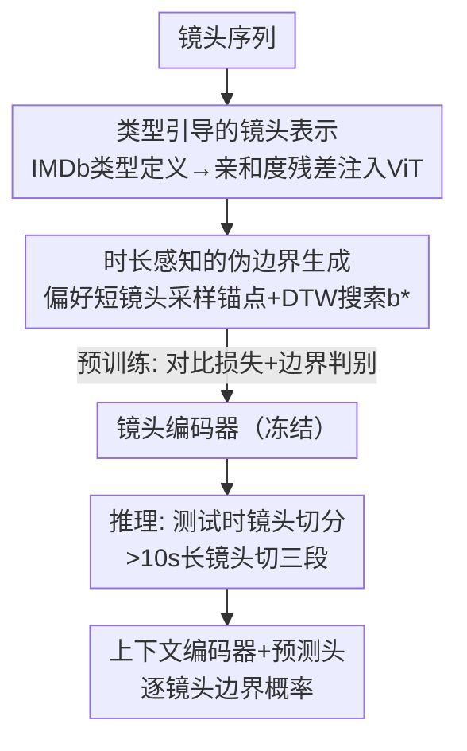

# Video Scene Segmentation with Genre and Duration Signals

**会议**: ICLR 2026  
**OpenReview**: [https://openreview.net/forum?id=c8r3lzyVTS](https://openreview.net/forum?id=c8r3lzyVTS)  
**代码**: 无  
**领域**: 视频理解  
**关键词**: 视频场景分割, 自监督学习, 类型先验, 镜头时长, 长视频理解

## 一句话总结
这篇论文把电影制作端的"题材类型约定"和"镜头时长规律"两类元数据引入视频场景分割：用 IMDb 的文字类型定义作为语义先验来增强镜头表示、用偏好短镜头的时长加权采样生成更多样的伪边界、再在推理时把长镜头切片，最终在 MovieNet-SSeg / BBC 上刷到 SOTA，并发布了带场景边界标注的 MovieChat-SSeg 基准。

## 研究背景与动机
**领域现状**：长视频（电影、剧集、纪录片）天然由一系列语义连贯的"场景（scene）"组成，每个场景又由若干"镜头（shot）"拼成。场景分割就是判断每个镜头是不是某个场景的结尾，本质上是逐镜头的二分类问题。近几年主流做法是自监督两阶段范式：先在大规模无标注视频上用"伪场景边界"做 pretext 任务预训练一个镜头编码器（BaSSL、TranS4mer、CAT 等），再在小规模有标注数据上微调上下文编码器和预测头。

**现有痛点**：这些方法几乎只依赖相邻镜头之间的**视觉相似度**来找边界。可现实里很多场景切换是"叙事层面"的——地点、时间、主题变了，但画面没有明显跳变；反过来，一个连续场景内部也可能因为打光、插入镜头而出现剧烈视觉跳变。纯视觉信号既会漏报（语义换了但画面没换）又会误报（画面跳了但叙事没断）。

**核心矛盾**：低层视觉信号和高层叙事结构之间存在系统性错位，而仅靠视觉特征无法跨越这道鸿沟。

**切入角度**：作者注意到专业影视制作里藏着大量刻意设计的上下文线索——其中"题材类型约定"和"镜头时长规律"最有价值。类型决定了一部片子的视觉与叙事惯例（科幻、惊悚各有套路），时长则在电影研究里早被视作叙事结构的指示器（短镜头密集往往意味着紧凑的叙事单元）。难点在于：类型标签通常只在**视频级**可得，无法直接落到单个镜头/场景上；时长分布又在不同类型、不同制作风格间差异巨大。

**核心 idea**：把类型当成"软语义先验"在自监督预训练阶段注入镜头表示，把时长当成"采样权重"去构造更多样的伪边界，再在推理时用时长阈值切分长镜头，三者都不改变主干架构，复用现有自监督框架。

## 方法详解

### 整体框架
方法建立在 BaSSL 式的自监督两阶段范式之上：预训练阶段用伪边界优化镜头编码器，微调阶段冻结镜头编码器、只训上下文编码器 $\theta_c$ 和预测头 $h_p$。本文的改造集中在三处——**输入侧**给镜头编码器注入类型先验、**伪标签侧**改用时长加权的锚点采样、**推理侧**对长镜头做切片，让整条流水线既能利用制作元数据又不动主干。

输入是一段镜头序列 $\{s_1,\dots,s_N\}$，每个镜头先经过融合了类型嵌入的 ViT 镜头编码器得到表示 $e_i$；预训练时在序列两侧用时长加权采样选锚点、再用 DTW 式搜索定位伪边界 $b^*$，把序列切成左右两个伪场景做对比学习与边界判别；推理时先把超过 10 秒的长镜头切成三段独立处理，再喷给上下文编码器和预测头输出逐镜头的边界概率。

### 关键设计

**1. 类型引导的镜头表示：用文字类型定义当软语义先验**

针对"纯视觉特征捕捉不到叙事连贯性"的痛点，作者把类型约定编码成文字注入镜头编码器。具体做法是从 IMDb 拿来 21 个类型（科幻、喜剧、惊悚……）的定义文字，用 CLIP/OpenCLIP 文本编码器预先编码成一组固定的类型嵌入 $G_e \in \mathbb{R}^{N_g \times D}$。在 ViT 内部，把视觉 token 特征 $V_t$ 和类型嵌入做余弦相似度算出亲和度矩阵，再以残差方式注回视觉特征：

$$A = \mathrm{softmax}\!\left(\frac{V_t G_e^{\top}}{\sqrt{D}}\right), \qquad V_t^{\mathrm{genre}} = V_t + A G_e W$$

其中 $W \in \mathbb{R}^{D \times D}$ 是唯一需要训练的投影矩阵（ViT 主干和类型嵌入都冻结）。这套"亲和度残差（AG-Residual）"的妙处在于：它不强行给每个镜头指派唯一类型（现实里一部电影常带多个类型标签），而是按当前镜头与各类型的相关度动态加权融合，让类型信息成为一种柔性引导而非硬约束。消融显示这点至关重要——把类型嵌入简单地在帧级拼接反而把性能从 61.27 拉低到 59.13 AP，而亲和度残差能升到 63.62 AP。

**2. 时长感知的伪边界生成：偏好短镜头采样出更多样的训练信号**

原始 BaSSL 固定取序列两端的镜头当锚点来生成伪边界，导致训练样本的时间模式单一。作者观察到场景往往由密集的短镜头构成连贯叙事单元，于是改成按**时长倒数归一化**的概率采样锚点，让短镜头更容易被选中：

$$P(s_i) = \frac{1/d_i}{\sum_{j=1}^{N} 1/d_j}$$

其中 $d_i$ 是第 $i$ 个镜头的时长（帧数）。选定左右锚点 $\{s_l, s_r\}$ 后，用一种改自 DTW 的相似度搜索来定位最优伪边界 $b^*$——它在候选位置上同时最大化"左侧子段与左锚点的平均相似度"和"右侧子段与右锚点的平均相似度"，从而把序列切成两段伪场景 $S_i^l$、$S_i^r$。偏好短镜头（IDW，inverse-duration-weighted）相比固定端点采样在 MovieNet 上 +0.8 AP，也优于偏好长镜头的 DW 采样（+0.18），说明短镜头能在固定长度序列里形成更多样的子序列、提供更丰富的训练样本。

**3. 测试时镜头切分：把藏着多段语义的长镜头拆开再判边界**

训练端的改进解决了表示学习，但推理时真实视频的镜头时长高度不均——一个长镜头里可能本就包含多个语义片段，作为单一单元处理会拖累边界检测。作者提出一个纯预处理级的策略：凡是时长 $d_i > \tau$（设为 10 秒）的镜头，就等分成三段，每段当作独立镜头处理。有预抽关键帧时（如 MovieNet 每镜头三帧）直接分配，否则用均匀时间采样补关键帧；判完边界后再把结果映射回原始时间坐标。这个策略不需要重训、不改架构，可以直接套到现有任何场景分割框架上。消融里阈值越小收益越稳：不切 63.62 → 60s 63.63 → 30s 63.76 → 10s 63.80 AP。

### 损失函数 / 训练策略
预训练阶段用两个目标的线性组合：一是基于 InfoNCE 的对比损失 $L_{con}$，把伪场景内镜头的平均表示当作场景级特征、与同场景锚点配成正对，把跨场景的镜头/场景当负样本，左右两段各算一次；二是伪边界判别的二元交叉熵 $L_{pb}$，让预测头能区分伪边界镜头和随机选的非边界镜头。微调阶段冻结镜头编码器，只用真实场景标签以标准二元交叉熵 $L_{sb}$ 训上下文编码器和预测头，推理时边界概率 $\ge 0.5$ 即判为场景边界。实现上镜头编码器用 ViT-B/32（OpenCLIP 初始化、主干冻结），上下文编码器用从头训的两层 BERT，8 卡 A100，结果对 5 个微调种子取平均。

## 实验关键数据

### 主实验
在 MovieNet-SSeg 上全面超过此前 SOTA，且在跨域的 BBC（纪录片）和自建的 MovieChat-SSeg 上都领先（后两者用 AP 评估）：

| 数据集 | 指标 | 本文 | 之前SOTA | 提升 |
|--------|------|------|----------|------|
| MovieNet-SSeg | AP | 63.62 | 60.78 (TranS4mer) | +2.84 |
| MovieNet-SSeg | F1 | 58.88 | 52.05 (CMS) | +6.83 |
| MovieNet-SSeg | mIoU | 59.64 | 53.67 (CAT) | +5.97 |
| BBC | AP(avg) | 37.2 | 30.3 (TranS4mer*) | +6.9 |
| MovieChat-SSeg | AP(total) | 46.7 | 37.9 (TranS4mer*) | +8.8 |

值得注意的是 F1 和 mIoU 上的提升（+6~7 点）远大于 AP，说明本文不只是把分数往上挪，而是在边界的精确定位上有质的改善。

### 消融实验
在 MovieNet-SSeg（AP）上逐项拆解三个设计：

| 配置 | AP | 说明 |
|------|------|------|
| 完整模型（AG-Residual + IDW + 10s split） | 63.80 | 三项全开 |
| w/o 类型嵌入 | 61.27 | 去掉类型先验掉 2.4 点 |
| 帧级拼接类型 | 59.13 | 错误融合方式反而比不用还差 |
| token 级拼接类型 | 62.43 | 简单拼接收益有限 |
| 固定端点采样（Side，替代 IDW） | 62.82 | 锚点采样退回 BaSSL 式 |
| 偏好长镜头采样（DW） | 63.44 | 方向选反了，不如偏好短镜头 |
| 不切长镜头（替代 10s split） | 63.62 | 推理切片贡献约 +0.18 |

### 关键发现
- 类型先验贡献最大，但**怎么融合**比"融不融"更关键：帧级拼接（59.13）甚至低于完全不用类型（61.27），只有亲和度残差的动态融合才把性能拉到 63.62，说明硬指派单一类型会引入噪声。
- 类型提示词的"信息量"也有影响：用完整 IMDb 定义（Def, 63.62）优于只用类型名（Name, 63.23），文字描述越详细，语义引导越好。
- 时长采样的方向很重要：偏好短镜头（IDW）> 偏好长镜头（DW）> 固定端点（Side），印证了"短镜头能形成更多样子序列"的假设。
- 三个设计可叠加到现有 baseline 上：把时长采样和测试时切分套到 BaSSL/TranS4mer 上分别带来 +0.8~2.1 和 +0.6~0.8 AP，证明收益来自方法本身而非架构。

## 亮点与洞察
- **把"制作元数据"当一等公民引入分割**：跳出纯视觉相似度的框架，用类型/时长这类导演刻意设计的信号补上叙事理解，思路上很有启发——很多视觉任务都能问一句"领域专家在创作时留下了哪些可用的结构性先验"。
- **亲和度残差是轻量又稳的注入方式**：只训一个投影矩阵 $W$、主干全冻，却比拼接式融合稳得多，可迁移到任何"想把一组固定文本先验软注入视觉编码器"的场景。
- **时长倒数采样这个小改动很巧**：仅把固定锚点换成 $P(s_i) \propto 1/d_i$，不增加任何参数就显著丰富了伪边界的多样性，是低成本提升自监督质量的好 trick。
- **测试时切分是免训练的即插即用增益**：纯预处理、不动模型，能直接给现成系统加分，工程价值高。

## 局限与展望
- 类型信息仍是**视频级**的弱标签，文中用全片类型去引导每个镜头，对一部多类型混合的片子可能不够精细；shot 级或 scene 级的类型归属仍是开放问题。
- 测试时切分用了固定的"超过阈值就等分三段"的硬规则，3 段和 10 秒都是经验值，对极端时长分布未必最优，可考虑自适应切分。
- MovieChat-SSeg 的视频是从长内容里截取的较短片段（平均 7.4 分钟），作者也承认这可能捕捉不到全片级的长程叙事模式，跨整部电影的评估仍缺位。
- 失败案例分析显示，插入镜头/档案画面、剧烈打光变化等仍会触发误判——这正暴露了纯视觉路线的根本短板，未来或需引入字幕、对白等更强的多模态叙事信号。

## 相关工作与启发
- **vs BaSSL**: BaSSL 用序列两端的固定锚点生成伪边界、纯视觉做对比学习；本文继承其两阶段范式，但把锚点采样改成时长加权（偏好短镜头）、并在镜头编码器里注入类型先验，在同一 ViT-B/32 + CLIP 设置下从 60.40 提到 63.62 AP。
- **vs TranS4mer / CAT**: 这两者分别引入长程镜头关系和多尺度时间上下文，仍以视觉/时间线索为主；本文的增益来自正交的"制作元数据"维度，因此能在相同主干上叠加领先。
- **vs Movies2Scenes**: 它也用元数据（共看模式、类型标签、剧情简介），但走的是**电影间相似度**构造正样本对的对比路线；本文则把类型当**镜头内**的语义先验注入表示，粒度和用法都不同。
- **vs VSS-MGP / Movie-CLIP**: VSS-MGP 需要镜头级类型预测、Movie-CLIP 原本为类型预测设计且未显式用类型做分割；本文用文字类型定义作软先验，既不需要镜头级类型标注，又显式利用了类型信息。

## 评分
- 新颖性: ⭐⭐⭐⭐ 首次系统地把类型约定与镜头时长两类制作元数据引入场景分割，三处改造都切中纯视觉路线的痛点。
- 实验充分度: ⭐⭐⭐⭐ 三个数据集（含跨域 BBC 和自建 MovieChat-SSeg）+ 细致消融，三项设计逐一验证且可叠加到 baseline。
- 写作质量: ⭐⭐⭐⭐ 动机—方法—实验逻辑清晰，公式与消融对应得上。
- 价值: ⭐⭐⭐⭐ SOTA + 免训练的即插即用组件 + 新基准数据集，对长视频理解的下游任务有实用价值。

<!-- RELATED:START -->

## 相关论文

- [\[CVPR 2026\] Scene-Centric Unsupervised Video Panoptic Segmentation](../../CVPR2026/video_understanding/scene-centric_unsupervised_video_panoptic_segmentation.md)
- [\[CVPR 2026\] SAM2Text: Towards Prompt-Free and Multi-Resolution Video Scene Text Segmentation](../../CVPR2026/video_understanding/sam2text_towards_prompt-free_and_multi-resolution_video_scene_text_segmentation.md)
- [\[CVPR 2026\] Seeing the Scene Matters: Revealing Forgetting in Video Understanding Models with a Scene-Aware Long-Video Benchmark](../../CVPR2026/video_understanding/seeing_the_scene_matters_revealing_forgetting_in_video_understanding_models_with.md)
- [\[CVPR 2025\] VISTA: Enhancing Long-Duration and High-Resolution Video Understanding by Video SpatioTemporal Augmentation](../../CVPR2025/video_understanding/vista_enhancing_long-duration_and_high-resolution_video_understanding_by_video_s.md)
- [\[CVPR 2026\] Robust Promptable Video Object Segmentation](../../CVPR2026/video_understanding/robust_promptable_video_object_segmentation.md)

<!-- RELATED:END -->
