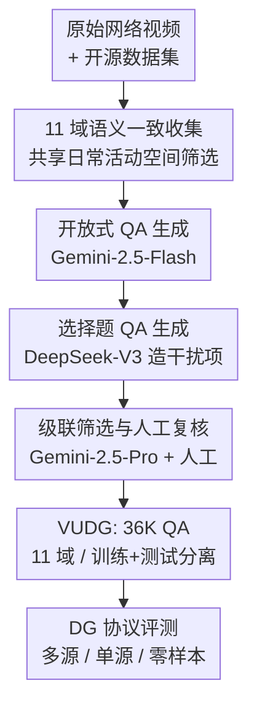

# VUDG: A Dataset for Video Understanding Domain Generalization

**会议**: ICLR 2026  
**OpenReview**: [https://openreview.net/forum?id=0mUiXz1TNq](https://openreview.net/forum?id=0mUiXz1TNq)  
**项目主页**: [https://VUDG-Video.github.io](https://VUDG-Video.github.io)  
**领域**: 视频理解  
**关键词**: 域泛化、视频问答、LVLM 评测、多专家标注、基准数据集

## 一句话总结
VUDG 构建了首个专门评测视频理解域泛化能力的数据集，用 11 个共享同一语义空间、只在视觉风格/视角/环境条件上变化的域，配合多专家级联自动标注流水线生成 36K 问答对，结果显示包括最强 LVLM 在内的几乎所有模型遇到域偏移都会明显掉点。

## 研究背景与动机

**领域现状**：视频理解（动作识别、视频问答 VideoQA）这几年靠大模型和大规模标注数据快速进步，越来越多 LVLM（大型视觉语言模型）被微调到具体的视频应用上。

**现有痛点**：现有模型几乎都默认训练分布和测试分布一致，一旦真实部署中遇到分布偏移就显著掉点。而部署阶段不可能枚举所有数据分布，模型对"没见过的域"的处理能力直接关系到安全和可靠。这本质上是一个**域泛化（Domain Generalization, DG）**问题——在源域上训练、要求在分布不同的目标域上仍然表现好。

**核心矛盾**：虽然已有一些跨域视频理解基准（TGIF-QA、MVBench、Video-MME、VideoVista 等），但它们**跨域时连语义空间都不一样**——比如 HowTo、Film、Cartoon 三个类别之间内容差异巨大。这样一来模型掉点到底是因为"域偏移"还是因为"语义内容本身变难了"无法区分，DG 能力根本测不准。

**本文目标**：提供一个能**干净隔离域偏移效应**的数据集，让"模型在不同域间的鲁棒性"成为唯一变量，从而严格、公平地评测视频理解模型的域泛化能力。

**切入角度**：作者认为公平评测 DG 的前提是**跨域语义一致**——所有域都讲同一批日常人类活动，只让拍摄风格/视角/天气变化。只要预先定义一个共享的活动场景空间并用它筛选视频，就能保证 11 个域在内容上同质、只在"域"这一维度上有别。

**核心 idea**：用"预定义共享活动语义空间 + 多专家级联标注"造出一个 11 域、语义一致的视频问答数据集，把域偏移变成可控变量来量化 LVLM 的域泛化能力。

## 方法详解

### 整体框架
VUDG 不是一个新模型，而是一套**数据集 + 标注流水线 + 评测协议**。整体目标是：先收集 11 个共享语义、只在域属性上变化的视频，再用一条多专家级联的自动标注流水线给每段视频生成结构化问答对，最后用域泛化标准协议来评测各类视频模型。标注流水线串成四个阶段——视频收集 → 开放式问答生成 → 选择题问答生成 → 问答筛选与复核，每一步换用不同的大模型来避免"同一个模型既出题又判分"的自我强化偏差，最后再加一道人工把关。

### 关键设计

**1. 语义一致的 11 域设计：让"域偏移"成为唯一变量**

这一设计直接针对前面的核心矛盾——旧基准跨域时语义空间也跟着变，导致掉点原因混淆。VUDG 预先**手工定义一份共享的日常人类活动场景清单**（如读书读文档、骑自行车、喂宠物等），然后用 Qwen2.5-VL-7B 在收集视频时只挑属于这份清单的内容。这样 11 个域——卡通、游戏、电影/电视、虚拟环境（视觉风格类），第一人称、监控、抖动（视角类），雾、夜、雨、雪（环境条件类）——讲的都是同一批活动，只在拍摄风格/视角/天气上有别。于是模型在跨域时的性能差异可以**干净地归因于域偏移本身**，而不是语义内容变化，这正是它和 Video-MME、VideoVista 等"有多域但语义不一致"基准的本质区别（见论文 Table 1，VUDG 是唯一同时满足 Dom.✓ 与 Sem.✓ 的数据集）。

为避免 LVLM 预训练造成的数据泄漏，VUDG 还**为每个域分别构建训练集和测试集，并强制二者来自不同数据源**：训练集只取自 InternVid、ShareGPT4Video、VideoInstruct100K、MMDL 等的训练划分；测试集取自 VATEX、ActivityNet、VideoVista、MMDL 的测试划分以及 YouTube/抖音/Bilibili 爬取的 UGC 视频（自采占 49.62%）。这种"训练-测试源头隔离"保证评测的是真泛化而非记忆。

**2. 多专家渐进式标注：用模型异构打破自我强化偏差**

如果用同一个大模型既生成问答又验证问答，它倾向于认可自己的输出，标注质量会被这种循环依赖污染。VUDG 的解法是让**生成与验证环节使用不同的大模型**，形成一条级联。问答类型预设四类：动作识别、属性识别、物体识别、时序理解。开放式问答由 Gemini-2.5-Flash 生成（每段视频对类型 1–3 各出 1 题、对时序理解出 2 题，因为时序信息线索不同所以用两套 prompt）；选择题则用 DeepSeek-V3 基于原问题和正确答案生成五个"貌似合理但错误"的干扰项，再随机打乱六个选项的位置以平衡分布。

最后一道是**混合筛选**：先用更强的 Gemini-2.5-Pro 结合原始视频上下文逐条复核，把每个问答对分为（a）正确、（b）有可修复瑕疵的部分错误、（c）无效问题三类；然后人工专家对被标为 (b)/(c) 的条目修正或删除。这道**强制的 human-in-the-loop** 加上多模型级联，"打断了潜在的循环依赖、降低了对单一 LLM 的依赖"，是保证 36,388 个问答对质量的关键。

**3. 三套域泛化协议 + 双重评测指标：覆盖从多源到零样本的泛化强度**

光有数据还不够，得有标准化的评测方式才能让结论可比。VUDG 支持三种 DG 协议。**多源泛化**用 Leave-One-Domain-Out：留一个域当目标域（用其测试集），其余 $N-1$ 个域的训练集合并当源域训练，最终性能按所有域取平均，$\text{Avg}_m = \frac{1}{N}\sum_{i=1}^{N} P_i$。**单源泛化**用 Leave-But-One-Domain-Out：只用一个域的训练集当源域，剩下 $N-1$ 个域全当目标域，$\text{Avg}_s = \frac{1}{N}\sum_{i=1}^{N}\left(\frac{1}{N-1}\sum_{j=1,j\neq i}^{N} P_j^i\right)$，更考验单域到多域的迁移。**零样本**则不训练直接在完整测试集上测。

指标上，选择题直接算准确率；开放式问答用 DeepSeek-V3 自动评分，从两个维度打分、每维满分 5 分、单题满分 10 分：动作/属性/物体识别按事实准确性与相关性评，时序理解按时序准确性与相关性评，最终 $\text{Score} = S_{acc} + S_{rel}$，其中 $S_{acc}, S_{rel} \in [0,5]$。这套协议让"多域微调"与"单域微调""零样本"三种泛化强度都能在同一数据集上横向衡量。

### 损失函数 / 训练策略
评测时对非 LLM 方法做全参数微调，对 LVLM 用 LoRA（rank=128、scaling=256）以保证训练效率；零样本设置下所有 LVLM 用官方默认配置。帧采样上，固定帧数的模型用各自官方设置（如 VideoLLaMA2 每视频 16 帧），固定 FPS 的模型统一设为 1 FPS。训练集视频限制最长 10 分钟以省显存，测试集刻意放更长的视频以考验长时序上下文处理能力。

## 实验关键数据

数据集规模：训练集 6,337 段视频 / 31,685 个问答对，测试集 1,532 段 / 4,703 个问答对，合计 7,899 段视频、36,388 个问答对，是表中对比数据集里视频与问答规模都领先且唯一语义一致的。

### 主实验（零样本选择题，11 域平均 D-Avg）

| 模型 | Visual Style | Viewpoint | Env. Cond. | D-Avg |
|------|------|------|------|------|
| Qwen2.5VL-7B | 70.1 | 73.7 | 72.9 | **72.1** |
| VideoLLaMA3-7B | 68.7 | 61.8 | 64.0 | 65.1 |
| GPT-4o (16 帧) | 67.6 | 65.4 | 61.0 | 64.6 |
| Tarsier2-7B | 64.1 | 64.6 | 60.5 | 62.8 |
| Video-CCAM-7B | 52.3 | 53.0 | 49.5 | 51.5 |
| Video-ChatGPT-7B | 12.7 | 12.9 | 15.1 | 13.6 |

最强的开源 Qwen2.5VL-7B 拿到 72.1% 的平均准确率，而闭源 GPT-4o 只有 64.6%，说明**大规模预训练并不能自动解决域偏移**；早期模型（Video-ChatGPT、MiniGPT4-Video）准确率徘徊在 13%–14%（接近六选一随机水平 16.7%），鲁棒性极差。

### 域泛化掉点对比

| 设置 | VideoLLaMA2-7B (D-Avg) | 说明 |
|------|------|------|
| 全域微调（上界） | 68.8 | 见过所有域 |
| 多源 DG | 66.9 | 留一域测，仍低于上界 |
| 单源 DG（环境条件） | 53.4 | 比全域微调掉 15.4 个百分点 |

单源泛化比全参数微调掉了 15.4 个百分点，说明只见过一个域时迁移极难；即便较强的 VideoLLaMA2 在多源 DG 下也低于全域微调上界，而 Qwen2.5VL-3B 的多源微调甚至不如它的全域微调版本——印证现有 LVLM 需要更鲁棒的训练策略才能适应下游域偏移。

### 关键发现
- **域偏移普遍掉点**：从 SOTA LVLM 到传统 VideoQA 方法，遇到分布偏移都明显退化，验证了 VUDG 的挑战性，也是数据集存在的意义。
- **非 LLM 方法几乎失效**：HBI、EMCL4QA 在 DG 设置下准确率只有 17%–18%，接近随机，说明无 LLM 先验的方法泛化能力极其有限；LLM-based 方法明显更强。
- **静态强、时序弱**：按问题类型拆解（论文 Table 7），多数模型在动作/属性/物体识别上优于时序理解（如 Qwen2.5VL-7B 时序 67.7% vs 物体识别 80.8%），暴露 LVLM 偏好静态外观推理、动态时序仍是短板。
- **环境噪声最致命**：Qwen2.5VL-3B 在夜（NI 55.9%）、雪（SN 55.5%）等恶劣环境条件下明显比卡通等视觉风格域更弱，对视觉退化敏感。
- **开放式问答差距收窄**：开放式设置下各模型分数（Video-CCAM 最高 6.84，Qwen2.5VL-7B、mPLUG-Owl3 紧随）拉得比选择题近，说明自由生成在域偏移下更难、把强模型的优势也拉平了。

## 亮点与洞察
- **"语义一致"是这篇最关键的方法论贡献**：通过预定义共享活动空间，把以往混在一起的"域偏移"与"语义差异"两个因素解耦，让 DG 评测第一次变得干净可信——这个思路可迁移到图像、音频等任何想测域泛化的多模态基准。
- **多模型级联破自我强化偏差很巧妙**：生成用一个模型、造干扰项用另一个、复核又换更强的模型，再叠人工把关，用"模型异构"而非"反复自评"来保质量，省人力又避免单一 LLM 的系统性偏好被固化进数据。
- **训练-测试源头物理隔离**：针对 LVLM 预训练泄漏这个评测顽疾，直接从不同数据源构建两个划分，是做 LLM 时代基准时值得照抄的防泄漏做法。

## 局限与展望
- **只是评测基准，不给解法**：VUDG 揭示了 LVLM 域泛化的缺陷，但没有提出提升泛化的训练方法，"如何让模型在 VUDG 上更鲁棒"留给后续工作。
- **标注依赖闭源/特定大模型**：生成与复核重度依赖 Gemini-2.5-Flash/Pro、DeepSeek-V3，标注质量和可复现性受这些模型版本影响，且自动评分本身也用 LLM（DeepSeek-V3），评分公允性存在循环风险。
- **域的划分偏经验**：11 个域按视觉风格/视角/环境条件三类人为定义，是否覆盖真实部署的全部分布偏移、各域难度是否可比，仍需更多验证；恶劣环境域天然更难，跨域横向比大小需谨慎。

## 相关工作与启发
- **vs VideoDG / Ani-GIFs / ARGO1M / MDVAD**：这些早期视频 DG 数据集聚焦视频分类、异常检测或动作识别；VUDG 面向**视频理解（VideoQA）**，需要更丰富的视觉推理，也更贴合 LVLM 的发展方向。
- **vs Video-MME / VideoVista / MVBench**：它们虽含多域但**跨域语义不一致**，掉点原因混淆；VUDG 是 Table 1 中唯一同时满足"多域 + 语义一致"的数据集，能真正隔离域偏移。
- **vs 传统 VideoQA（HBI / EMCL4QA）**：实验直接证明无 LLM 方法在 DG 下接近随机，凸显 LLM 先验对泛化的价值，也为"该用什么基线测 DG"提供了参照。

## 评分
- 新颖性: ⭐⭐⭐⭐⭐ 首个语义一致的视频理解域泛化数据集，问题定义和"解耦域偏移"的切入都很扎实。
- 实验充分度: ⭐⭐⭐⭐ 覆盖 9 个 SOTA LVLM + 传统方法，三套协议 + 多维分析，但缺改进方法的验证。
- 写作质量: ⭐⭐⭐⭐ 流水线和协议交代清晰，表格丰富。
- 价值: ⭐⭐⭐⭐⭐ 填补了视频理解域泛化评测的空白，是后续鲁棒视频模型研究的重要资源。

<!-- RELATED:START -->

## 相关论文

- [\[CVPR 2026\] VideoNet: A Large-Scale Dataset for Domain-Specific Action Recognition](../../CVPR2026/video_understanding/videonet_a_large-scale_dataset_for_domain-specific_action_recognition.md)
- [\[AAAI 2026\] EmoVid: A Multimodal Emotion Video Dataset for Emotion-Centric Video Understanding and Generation](../../AAAI2026/video_understanding/emovid_a_multimodal_emotion_video_dataset_for_emotion-centric_video_understandin.md)
- [\[ICML 2026\] Return of Frustratingly Easy Unsupervised Video Domain Adaptation](../../ICML2026/video_understanding/return_of_frustratingly_easy_unsupervised_video_domain_adaptation.md)
- [\[ICLR 2026\] VideoNSA: Native Sparse Attention Scales Video Understanding](videonsa_native_sparse_attention_scales_video_understanding.md)
- [\[ICLR 2026\] PPLLaVA: Varied Video Sequence Understanding With Prompt Guidance](ppllava_varied_video_sequence_understanding_with_prompt_guidance.md)

<!-- RELATED:END -->
