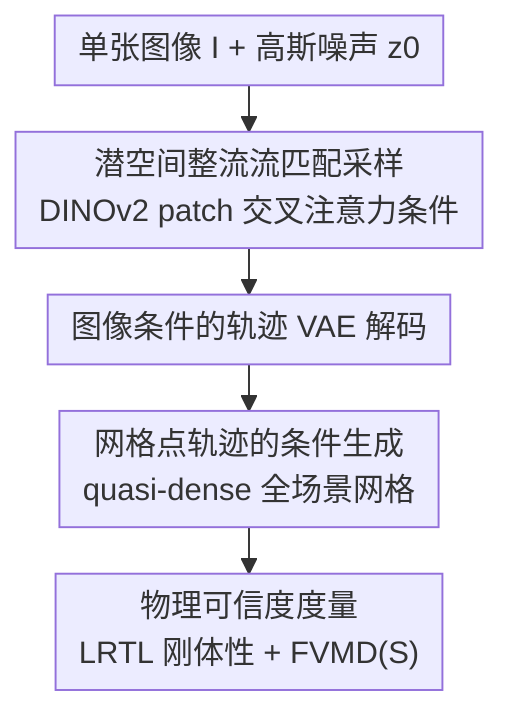

# What Happens Next? Anticipating Future Motion by Generating Point Trajectories

**会议**: ICLR 2026  
**论文**: Published as a conference paper at ICLR 2026  
**代码**: 未在正文给出  
**领域**: 视频理解 / 运动预测 / 生成模型  
**关键词**: 运动预测, 点轨迹生成, 流匹配, 轨迹VAE, 世界模型

## 一句话总结
本文把"从单张图像预测未来运动"这件天然有歧义的事，重铸成对一张**稠密网格点轨迹**的条件生成任务：用一个轨迹 VAE 把整张图的点轨迹压进潜空间，再用整流流匹配（rectified flow）在潜空间里采样多种可能未来，效果在多个仿真/真实场景上既比回归式轨迹预测器更准、又比"先生成 RGB 视频再追踪"的视频大模型更物理可信。

## 研究背景与动机
**领域现状**：给定单张图像、推断"接下来会怎么动"，是机器人控制、基于模型的规划、世界模型等一大批应用的共同前置能力。机器人领域（ATM、Tra-MoE、Track2Act）早就把这件事建模成"预测图像中点的轨迹"，但它们要么只对机械臂等少数**主动点**做确定性回归，要么虽然用扩散生成却仍只盯着 32~400 个目标点。另一条路是直接拿训练在数十亿视频上的视频生成器（WAN、SVD、LTX 等）当世界模型，先生成视频再用点追踪器反推运动。

**现有痛点**：① 回归式轨迹预测器输出单一确定结果，无法刻画"同一张图可以有很多种合理未来"这个本质歧义，而且只看少数主动点、丢掉了全场景上下文（远处此刻不相干的物体，几帧后可能撞上来）；② 视频大模型即便在简单物理场景（落块、机械碰撞）上微调，仍频繁产生畸变、物体分裂/消失/凭空出现的不合理运动——把算力都耗在了纹理、光照这类低层外观上，运动本身反而不准。

**核心矛盾**：运动预测既要**建模不确定性**（多种可能未来的分布），又要**保持物理可信**（刚体不变形、时序连贯）。回归丢了前者，像素生成丢了后者。

**本文目标**：用一个尽量贴近现代视频生成器架构、但**输出运动而非像素**的模型，同时拿下"全场景 + 不确定性 + 物理可信"。

**切入角度**：作者观察到，轨迹本身就直接编码了运动，天然带有**物体恒存性**和**时序连贯性**两个归纳偏置，而像素需要再被翻译成运动估计、且这两条性质恰是通用视频生成器最难保证的。既然如此，为何不把视频生成的整套配方（潜空间 + 流匹配）照搬过来，只是把输出从 RGB 像素换成稠密网格点的坐标序列？

**核心 idea**：把运动预测重写成"以图像为条件、对 quasi-dense 网格点轨迹做生成式建模"，用轨迹 VAE + 潜空间流匹配实现，从零训练即可超过吃了数十亿视频的视频大模型。

## 方法详解

### 整体框架
一条点轨迹就是某像素随时间的 2D 坐标序列 $((x_0,y_0),\dots,(x_T,y_T))$。给定图像 $I\in\mathbb{R}^{H\times W\times C}$，模型在一个步长为 $s$ 的网格上采点，预测它们未来 $T$ 步的运动，输出一个张量 $x\in\mathbb{R}^{\frac{H}{s}\times\frac{W}{s}\times T\times 2}$。因为这是高度欠定的问题，作者不直接回归 $x$，而是学习条件分布 $p(X\mid I)$，从中采样得到多个合理未来。

整条管线照搬现代视频生成器：先用一个**轨迹 VAE** 把网格轨迹编码进低维潜空间 $z$（编码器/解码器都额外吃图像 $I$，以利用物体边界与几何）；再在潜空间里训一个**整流流匹配去噪网络** $\hat v(z_t, I, t)$，从高斯噪声出发沿速度场积分 ODE 即可采样出潜码；最后用 VAE 解码器把潜码还原成网格轨迹。推理时换不同噪声种子就得到不同的可能未来。

### 关键设计

**1. 把运动预测重铸为「网格点轨迹的条件生成」**

这是全文的根基，针对的是回归式预测器"输出单一确定结果 + 只看少数主动点"这两个痛点。作者不再像 ATM/Tra-MoE 那样只对机械臂上的 32 个点做确定性回归，而是把图像点**均匀铺在网格上**（quasi-dense，每隔一个像素取一点），并且无论该点该静还是该动，都一视同仁地预测。这样做有两层好处：其一，网格覆盖全场景，模型可以**联合推理整张图的动力学**——此刻相距很远、看似不相干的物体，几帧后可能碰撞，只有全场景视野才能预见；其二，把任务写成对 $p(X\mid I)$ 的**生成**而非回归，使得"同一张图的多种合理未来"能被显式建模为一个分布，采样即得多样化预测。论文把这条归结为超过回归基线的根本原因：建模不确定性比 Tra-MoE 那种领域特定的 MoE 架构改动更重要。

**2. 图像条件的轨迹 VAE 潜空间**

针对"直接在原始轨迹空间上做生成不好建模"的问题，作者先用一个 β-VAE 把网格轨迹压进规整的潜空间 $z\in\mathbb{R}^{\frac{H}{rs}\times\frac{W}{rs}\times T\times D}$（空间上再降采样 $r$ 倍，但因为只处理 $T\in\{16,24,30\}$ 的短窗口，**时间维不压缩**）。关键细节是编码器 $\phi(x\mid I)$ 和解码器 $\psi(z\mid I)$ **都额外把图像 $I$ 当输入**——因为网格只是 quasi-dense、未必覆盖物体每个部位，喂进图像能帮模型补上物体边界、形状、几何信息。训练用 β-VAE 目标，重建用 Huber 损失 $L_\delta$、再加 KL 正则把后验拉向标准正态：

$$\mathcal{L}_{\beta\text{-VAE}} = \mathbb{E}_{z\sim N_\phi(x|I)}\big[L_\delta(x,\psi(z\mid I))\big] + \beta\cdot D_{KL}\big(N_\phi(x|I)\,\|\,N_0\big).$$

编解码器都用对称的时空 Transformer：把 $(x,y)$ 坐标拼上可学习 Fourier 特征后，用 $r\times r$ 的非重叠 2D 卷积 patch 化，再过时空 Transformer。相比 Walker 等人用 DCT 线性压缩，VAE 给出的是**有正则结构的潜空间**，更适合后续的生成式采样。

**3. 潜空间整流流匹配采样**

有了潜空间，就在其上学条件分布 $p(Z\mid I)$，方法是整流流 / 流匹配（rectified flow）。令目标样本 $z_1\sim p(Z\mid I)$、噪声 $z_0\sim N(0,I)$，在两者间连一条直线路径 $z_t=(1-t)z_0+tz_1$，其速度恒为 $v=z_1-z_0$。训练一个网络 $\hat v(z_t,I,t)$ 去拟合这个速度场：

$$\mathcal{L}_{RF}(\hat v)=\mathbb{E}_{z_0,(z_1,I),t}\big[\|\hat v(z_t,I,t)-(z_1-z_0)\|_2^2\big].$$

推理时从 $z_0\sim N(0,I)$ 出发，沿 $\hat v$ 积分 ODE 直到 $t=1$ 即采到一个未来。条件化方式是本文相对 Track2Act 的另一个关键差异：Track2Act 用一个小 ResNet18 把整图压成单一向量再做注意力，而本文用 **DINOv2 编码出 patch 级 token，在去噪网络每个 block 里做时空交叉注意力**。这给了模型远更丰富的物体位置与几何信息，体现为更低的刚体性误差 LRTL——尽管 Track2Act 体量是本文两倍多，仍被显著超过。

**4. LRTL 刚体性度量与 FVMD(S) 条件分布度量**

这是为"如何评判一个会输出分布的运动预测器"而专门设计的评测体系，针对回归指标假设单一真值、无法衡量分布质量与物理可信度的缺陷。① **Best-of-K MSE**：对每张图模拟 $K$ 条真值轨迹、生成 $K$ 条，取最小配对误差，衡量分布是否覆盖到正确模式；② **FVMD / FVMD(S)**：FVMD 比较生成与模拟轨迹的边缘分布 $p(X)$，但它看不出"对某张特定图 $I$ 而言运动是否合理"，于是作者补了**逐图版 FVMD(S)** 来评估条件分布 $p(X\mid I)$；③ **LRTL 刚体性**：把同一物体的 2D 轨迹堆成矩阵，物理上若来自刚性 3D 物体则该矩阵应是低秩的——LRTL 定义为轨迹矩阵与其秩 5 截断 SVD 重建之间的平均 Frobenius 范数，物体若变形或点群运动不一致，重建误差就升高，LRTL 随之增大。作者强调 FVMD 与 LRTL 互补：FVMD 抓不住时空窗内速度被打乱的情况，而 LRTL 在"完全不动"时也会最小，单看任一指标都会被骗。

### 损失函数 / 训练策略
两阶段：先用 β-VAE 损失训练轨迹自编码器，冻结后再用整流流损失 $\mathcal{L}_{RF}$ 训练潜空间去噪器。一个值得注意的训练-推理不匹配：训练时每个初始条件**只观测到一个真值未来**（真实数据就这样），但推理时要产出多个合理假设，模型必须从邻近训练样本中**推断出多种可能未来的存在**。这比文生图/文生视频难——后者一个 caption 对应成千上万样本，而这里相邻样本的朴素插值未必物理可信（两个刚体运动插值出来一般不再是刚体运动）。

## 实验关键数据

### 主实验

**vs 回归式轨迹预测器（LIBERO 机器人数据集，MSE 越低越好）**：

| 方法 | LIBERO-90 Side | LIBERO-90 Effector | LIBERO-10 Side | LIBERO-10 Effector |
|------|------|------|------|------|
| ATM (k=1) | 23.07 | 67.37 | 31.02 | 69.96 |
| Ours (MeanT, k=8) | 16.70 | 52.70 | 23.69 | 58.35 |
| Ours (Min, k=8) | **10.99** | **32.01** | **13.86** | **35.93** |

无论取均值轨迹（MeanT）还是最优样本（Min），本文都明显优于 ATM 与 Tra-MoE（Tra-MoE 上 Effector 视角 MSE 从 105.92 降到 71.41/37.41）。作者归因于建模不确定性 + 网格全场景推理，尤其在相机随机械臂运动、视角不确定的 Effector 视图下优势最大。

**vs 生成式方法与视频大模型（Kubric，FVMD/Best-of-K/LRTL 越低越好）**：

| 模型 | FVMD | FVMD (S) | Best-of-K | LRTL |
|------|------|------|------|------|
| Track2Act（轨迹扩散） | 16735 | 22509 | 250.8 | 15.8 |
| **Ours (L)** | **13745** | **17838** | **127.0** | **14.1** |
| WAN 14B（视频） | 34573 | 42987 | 184.6 | 35.1 |
| WAN 1.3B†（微调视频） | 14864 | 20010 | 162.8 | 26.6 |

即便把视频大模型在 Kubric 上微调（†），本文仍全面领先；轨迹类方法 LRTL 显著更低，印证"RGB 生成带来的开销导致非刚体、不合理运动"这一假设。用户研究中本文 52% 被排为第一，ELO 1084 高于 SVD(929)/WAN(987)。

### 消融实验

**输出模态消融（固定同一去噪架构，只换输出，Kubric 同分布）**：

| 潜空间 | 潜张量形状 | FVMD | Best-of-K | LRTL |
|------|------|------|------|------|
| SVD（RGB） | 24×16×16×4 | 20589 | 195 | 48.5 |
| SD3.5（RGB） | 24×16×16×16 | 16592 | 147 | 33.7 |
| WAN（RGB） | 7×16×16×16 | 17320 | 160 | 31.1 |
| SD3.5 + Tracks（联合） | 24×24×16×16 | 15399 | 136 | 28.2 |
| **Tracks（本文）** | 24×16×16×8 | **12221** | **127** | **15.9** |

因为各模态潜张量维度刻意调到相当，提升**不是来自降维**，而是来自"轨迹这一模态选得更对"。RGB VAE 自身重建几乎无损（PSNR 36~37、SSIM 0.97~0.99，Table 7），说明视频模型的运动误差来自生成而非追踪/编码瑕疵。

### 关键发现
- **模态比规模更重要**：从零训练的轨迹模型，全面压过吃了数十亿视频的 WAN/SVD/LTX，即便后者在目标域微调过；说明"在海量通用视频上训练"并不自动带来基本物理一致性。
- **联合生成 RGB+轨迹能反哺视频质量**：在 SD3.5 上同时扩散 RGB 和轨迹（丢弃直接生成的轨迹、只从生成 RGB 里用 CoTracker3 反推运动），各项指标尤其 LRTL 都明显改善——把轨迹作为辅助监督能让生成视频的运动更刚体、更可信。
- **DINOv2 patch 交叉注意力 vs 单向量条件**：Track2Act 用 ResNet18 压成单向量做自适应归一化，常忽略远处行人/车辆；本文每个 block 用 DINO patch token 交叉注意力，条件信息更丰富，Cityscapes 上 MeanT MSE 从 7037 降到 1475。
- **真实数据稳健**：Physics101 上整体 MSE 28.62 优于微调 WAN 的 30.08，在最复杂的 Multi 场景及 3/5 子场景领先，且离群点更少、常有 10× 更低 MSE。

## 亮点与洞察
- **"换输出模态而非加规模"的对照实验**很干净：固定去噪架构、把潜张量维度调到相当，单独消融 RGB vs 轨迹，干净地证明了运动应当被直接建模、而非从像素里二次反推。
- **LRTL 刚体性度量**很巧：把"刚体应保持形状"翻译成"轨迹矩阵应低秩"，用秩 5 截断 SVD 的重建残差量化，给运动物理可信度一个可计算、可对比的代理指标，且明确指出它与 FVMD 互补、单用会被"完全不动"骗到。
- 把视频生成的潜空间流匹配配方**整体迁移到轨迹模态**，证明了世界模型未必要走像素路线，这个"用轨迹做世界模型"的思路可迁移到策略学习、基于模型的控制。

## 局限与展望
- 主战场是 Kubric/LIBERO/Physion 等**仿真**场景，真实数据只在 Physics101、Cityscapes 上验证；更开放、纹理复杂、长时程的真实世界泛化仍待考。
- 评测依赖 CoTracker3 生成的**伪真值轨迹**作为真实数据的 ground truth，追踪器自身误差可能传导进结论（作者用 Table 23 验证了追踪可靠性以缓解，但仍是一层依赖）。
- 时间维不压缩、只处理 16~30 帧短窗口，长时程运动预测、误差累积问题未涉及。
- "从单一真值未来推断出多模态分布"这一训练-推理不匹配虽被指出，但没有给出专门机制保证多样性确实物理可信，更多靠生成式框架的隐式归纳偏置。

## 相关工作与启发
- **vs ATM / Tra-MoE**: 它们对少数主动点做确定性回归、还要文本条件，本文改为全场景网格 + 生成式建模，差异在"建模不确定性 + 全场景上下文"，因此即便 Tra-MoE 加了 MoE 也被超过——说明架构小改不如换对问题表述。
- **vs Track2Act**: 同样生成点轨迹、同样用扩散，但 Track2Act 只生成 400 个主动点、用 ResNet18 把图压成单向量条件；本文铺稠密网格、用 DINOv2 patch token 交叉注意力，体量更小却更准更刚体。
- **vs 视频大模型（WAN/SVD/LTX）**: 它们先生成像素再反推运动，把算力耗在外观上导致运动畸变；本文直接生成运动，注入物体恒存性与时序连贯两个归纳偏置，从零训练即胜微调后的视频大模型。
- **vs Walker (2016) / Li (2018)**: 前者用 DCT 线性压缩 + VAE 直接生成轨迹偏移，表达力与潜空间结构都弱；后者先预测光流再翻成 RGB，光流逐帧独立估计、遮挡下失效。本文用点轨迹（追踪器联合估计、抗遮挡）+ VAE 构造正则潜空间 + 整流流采样，并用 FVMD/LRTL 真正评测物理可信度而非只看 RMSE。

## 评分
- 新颖性: ⭐⭐⭐⭐⭐ 把视频生成配方迁到轨迹模态、并用干净对照实验论证"模态比规模重要"，视角新。
- 实验充分度: ⭐⭐⭐⭐⭐ 覆盖回归基线、轨迹生成、视频大模型、真实数据 + 模态消融 + 用户研究，并自建 LRTL/FVMD(S) 度量。
- 写作质量: ⭐⭐⭐⭐ 逻辑清晰、动机层层推导；公式与符号偏密，初读需要对照图。
- 价值: ⭐⭐⭐⭐⭐ 为"用轨迹做世界模型"提供了强证据，对策略学习/基于模型控制有直接迁移价值。

<!-- RELATED:START -->

## 相关论文

- [\[CVPR 2026\] Envisioning the Future, One Step at a Time](../../CVPR2026/video_understanding/envisioning_the_future_one_step_at_a_time.md)
- [\[CVPR 2026\] InternVideo-Next: Towards World-Understanding Video Models](../../CVPR2026/video_understanding/internvideo-next_towards_world-understanding_video_models.md)
- [\[ICLR 2026\] Point Prompting: Counterfactual Tracking with Video Diffusion Models](point_prompting_counterfactual_tracking_with_video_diffusion_models.md)
- [\[CVPR 2026\] Generative Point Tracking and Forecasting](../../CVPR2026/video_understanding/generative_point_tracking_and_forecasting.md)
- [\[ICCV 2025\] What You Have is What You Track: Adaptive and Robust Multimodal Tracking](../../ICCV2025/video_understanding/what_you_have_is_what_you_track_adaptive_and_robust_multimodal_tracking.md)

<!-- RELATED:END -->
