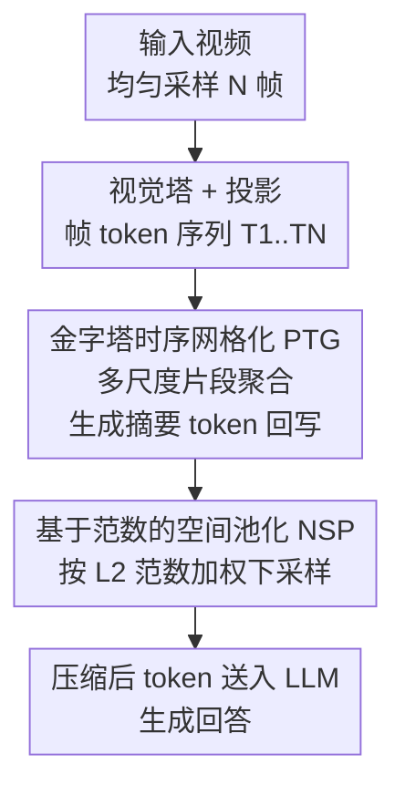

# Enhancing Visual Token Representations for Video Large Language Models via Training-free Spatial-Temporal Pooling and Gridding

**会议**: ICLR2026  
**OpenReview**: [https://openreview.net/forum?id=MZi9SYPVz5](https://openreview.net/forum?id=MZi9SYPVz5)  
**代码**: https://github.com/bingjunluo/ST-GridPool  
**领域**: 多模态VLM / 视频理解 / VLM效率  
**关键词**: 视频大模型, 视觉 token 压缩, 训练无关, 时空池化, token 范数

## 一句话总结
针对视频大语言模型把成千上万视觉 token 压缩进有限上下文时丢失时空信息的问题，提出训练无关的 ST-GridPool：用「金字塔时序网格化」在不同时间尺度上聚合帧 token 注入多粒度运动信息，再用「基于范数的空间池化」依据 token 的 L2 范数加权保留高信息量区域，在 LLaVA-Video / LLaVA-OneVision 上即插即用、不需重训就稳定涨点。

## 研究背景与动机
**领域现状**：视频大语言模型（Video LLM）要理解一段视频，需要把几十帧、每帧上百个视觉 token 喂给语言模型。但自注意力的复杂度随 token 数平方增长，上下文长度有硬上限，所以主流做法（LLaVA 系列）会先用简单的 2D 平均池化或双线性插值把每帧的视觉 token 压成一个固定且更小的形状，再送进 LLM。

**现有痛点**：这类「简单池化/插值」把所有 token 一视同仁地压缩，存在两个被忽视的问题。其一在时间维度——它默认视频里的时序动态是「尺度均匀」的，把帧 token 简单均匀采样后拼接；可现实视频既有手势这种快速微动作，也有行人行走这种缓慢位移，单一尺度的时序建模抓不全。其二在空间维度——一帧画面里语义显著的物体往往只占一小块，大片是背景，等权下采样会让真正富含信息的区域得不到优先保留，造成信息损失和 token 冗余。

**核心矛盾**：下采样函数必须同时满足「降低计算量」和「保留关键时空信息」这对相互拉扯的目标，而简单池化只顾前者、牺牲了后者。

**本文目标**：在不增加可训练参数、不改架构、不重训的前提下，把视频 LLM 现有的「压缩视觉 token」这一步做得更聪明，让压出来的 token 信息更密。

**切入角度**：过去的训练无关方法（SF-LLaVA、TS-LLaVA）大多是把图像 LLM 适配到视频上，但近一年原生 Video LLM 进步飞快，针对图像模型的优化已不够用——作者主张要做**专门面向 Video LLM 的**训练无关视觉 token 增强。同时作者在显著性检测数据集 HKU-IS 上做了一个关键观察：视觉 token 的 L2 范数与其语义丰富度正相关（显著物体区域 token 范数高、背景区域范数低），这给「该保留哪些 token」提供了一个零成本的现成指标。

**核心 idea**：把视觉 token 压缩拆成时序、空间两路分别优化——时序上用层次化网格化注入多粒度动态、空间上用 token 范数加权保留高信息区，两者都不需训练，组合成即插即用的 ST-GridPool。

## 方法详解

### 整体框架
ST-GridPool 接在视觉编码器 + 多模态投影之后、语言模型之前，输入是视觉塔抽出的帧 token 序列 $T_1, T_2, \dots, T_N \in \mathbb{R}^{H\times W\times d}$，输出是下采样后的 token $T^{\downarrow}_1, \dots, T^{\downarrow}_N$，再送进 LLM 生成回答。整条流水线由两个串行模块组成：先经**金字塔时序网格化（PTG）**在时间维度上把不同长度的片段聚合成「摘要 token」并回写更新序列，注入多尺度时序动态；更新后的序列再进**基于范数的空间池化（NSP）**，在每帧内部按 token 范数加权做空间下采样，保住高信息区域。两步都不引入任何可训练参数，对宿主模型而言只是替换掉原来那个「简单池化」函数。

### 关键设计

**1. 金字塔时序网格化（PTG）：用层次化网格在多个时间尺度上抓动态**

针对「简单拼接假设时序均匀、抓不住快慢不一的运动」这个痛点，PTG 在时间维度上搭了一座金字塔。它分 $L$ 层，第 $l$ 层对应的片段长度 $K_l = K\cdot 2^{l-1}$（$K$ 是第一层的基长度，越往上层片段越长、时间跨度越大）。把长度为 $N$ 的帧序列按 $K_l$ 切成 $N_l=\lceil N/K_l\rceil$ 段，第 $j$ 段的起始帧索引为 $t_{l,j}=(j-1)\cdot K_l$。例如 $N=32$、$K=8$、$L=3$ 时：第 1 层切成 4 段（每段 8 帧，抓短时细粒度动态）、第 2 层切成 2 段（每段 16 帧）、第 3 层 1 段（32 帧全包，抓长时上下文）。

每个片段会生成一个**摘要 token**来浓缩这段的时序动态：先从片段里均匀采 $m\times n$ 帧，把这些帧的 token grid 在空间上拼成一个大网格 $G_{l,j}$（分辨率变成 $mH\times nW$），再用双线性插值把它缩回原始分辨率 $H\times W$，得到 $\text{Interp}(G_{l,j})\in\mathbb{R}^{H\times W\times d}$。这个摘要 token 不是新增一格，而是**回写覆盖**到片段的最后一帧上：$T_{t_{l,j}+K_l-1} \xleftarrow{\text{update}} \text{Interp}(G_{l,j})$。把所有层、所有片段都处理一遍，序列里就被嵌入了从细到粗的多尺度时序信息，而 token 总数不变、也没多任何参数——这正是它能「免训练 + 不增延迟」的关键：所有时序聚合都靠采样、空间拼接、插值这些确定性操作完成。

**2. 基于范数的空间池化（NSP）：用 token 范数当显著性指标，加权保住高信息区**

针对「等权空间下采样淹没了小块显著物体」的痛点，NSP 的出发点是一个被作者用实验坐实的观察：**视觉 token 的 L2 范数和它的语义丰富度正相关**。在 HKU-IS 显著性检测集上，取 L2 范数最高的前 50% token 圈出的区域，几乎和显著物体的标注重合；范数密度分布也显示显著物体区域与背景区域的 token 范数有明显差异。于是范数就成了一个**零成本、现成**的区域显著性度量，不用额外网络去预测「哪里重要」。

基于此，NSP 把原来的均匀池化换成范数加权池化。对一个核大小 $(k_H,k_W)$、步长 $(s_H,s_W)$ 的滑动窗口，窗口内位置 $(m,n)$ 的 token 记为 $t_{m,n}=T_i(h\cdot s_H+m,\, w\cdot s_W+n)$。先算每个 token 的 $L_p$ 范数 $\|t_{m,n}\|_p$，再用 softmax 归一化成权重：

$$\alpha_{m,n}=\frac{\exp(\beta\|t_{m,n}\|_p)}{\sum_{i=0}^{k_H-1}\sum_{j=0}^{k_W-1}\exp(\beta\|t_{i,j}\|_p)}$$

其中温度 $\beta$ 控制权重分布的尖锐程度。最后输出 token 是窗口内特征的加权和 $T^{\downarrow}_i(h,w)=\sum_{m}\sum_{n}\alpha_{m,n}\cdot t_{m,n}$。这样高范数（=高信息量、多半是显著物体）的 token 在压缩里占主导，低范数背景被抑制——相比简单平均，它在同样的 token 预算下把更多语义留了下来，而代价只是几次范数和 softmax 计算，仍是即插即用、训练无关。

### 损失函数 / 训练策略
本方法**完全训练无关、零新增参数**，没有任何训练目标或微调过程，只是替换宿主 Video LLM 推理时的视觉 token 下采样函数。关键超参：空间池化核大小与步长均为 2，温度 $\beta=1$，范数阶 $p=2$（即 L2）。为保证比较公平，喂给视觉编码器的输入帧数与喂给 LLM 的 token 数都与原模型保持一致（LLaVA-OneVision 用 32 帧、LLaVA-Video 用 64 帧）。

## 实验关键数据

### 主实验
在 LLaVA-OneVision-7B 与 LLaVA-Video-7B 两个 backbone 上即插即用，覆盖长视频理解（VideoMME / LongVideoBench / EgoSchema）与通用视频理解（NexT-QA / TempCompass / MVBench）共 6 个基准，全部稳定涨点。

| 模型 | VideoMME | LongV.Bench | EgoSchema | NexT-QA | TempCompass | MVBench |
|------|----------|-------------|-----------|---------|-------------|---------|
| LLaVA-OneVision-7B | 58.2 | 56.5 | 60.1 | 79.4 | 64.2 | 56.7 |
| + Ours | 59.0 (+0.8) | 56.7 (+0.2) | 62.1 (+2.0) | 79.6 (+0.2) | 64.4 (+0.2) | 58.0 (+1.3) |
| LLaVA-Video-7B | 63.3 | 58.2 | 57.3 | 83.2 | 65.4 | 58.6 |
| + Ours | 64.2 (+0.9) | 60.1 (+1.9) | 57.8 (+0.5) | 83.8 (+0.6) | 66.1 (+0.7) | 59.8 (+1.2) |

作为视觉 token 压缩策略，与主流 token reduction 方法（FastV / PruMerge / FasterVLM / VisionZip / FrameFusion）在 LLaVA-Video-7B 上按不同 token 预算对比，越是高压缩越占优：

| 方法 | VideoMME | L.V.Bench | EgoSchema |
|------|----------|-----------|-----------|
| 上界（全 token, LLaVA-Video） | 63.3 | 58.2 | 57.3 |
| **30% 预算** FastV | 59.3 | 53.5 | 51.3 |
| 30% 预算 FrameFusion | 61.3 | 56.0 | 53.0 |
| 30% 预算 **Ours** | **62.0** | **58.1** | **56.0** |
| **50% 预算** FrameFusion | 62.6 | 57.6 | 55.8 |
| 50% 预算 **Ours** | 62.5 | **58.9** | **57.1** |

在严格的 30% 预算下，本方法在 3 个长视频基准上全面领先；50% 预算时也在 L.V.Bench 与 EgoSchema 上拿到最佳、VideoMME 与最强的 FrameFusion 持平。说明它在高压缩条件下更能识别并保留关键信息。

### 消融实验

| 配置 | VideoMME | LongV.Bench | MVBench | 说明 |
|------|----------|-------------|---------|------|
| Baseline (LLaVA-Video) | 63.3 | 58.2 | 58.6 | 原始简单池化 |
| Ours w/o NSP | 63.8 | 59.2 | 59.1 | 只留 PTG |
| Ours w/o PTG | 63.6 | 59.8 | 58.8 | 只留 NSP |
| Ours (Full) | 64.2 | 60.1 | 59.8 | 完整模型 |

### 关键发现
- **两模块互补、缺一不可**：单独加 PTG 或 NSP 都比 baseline 好，但都不如二者合用——PTG 负责多尺度时序聚合、NSP 负责空间显著性对齐，合起来才到最优。
- **超参敏感性**：温度 $\beta$ 上，性能随 $\beta$ 增大先升后降，$\beta=1$ 最优；$\beta=5/10$ 等极端值会因过度平滑或激活不稳而掉点。范数阶 $p$ 上，$p$ 超过 2 后逐渐退化，L2（$p=2$）在稀疏性与判别力间最平衡。整体趋势跨数据集一致，说明方法鲁棒。
- **计算更省**：在 30% token 预算下，相比 baseline，ST-GridPool 同时降低了推理时间和峰值显存，且输入帧数越多、推理时间的节省越明显——既涨点又省算力。
- **长视频增益更大**：在 LongVideoBench 这类长视频基准上提升尤为突出（LLaVA-Video +1.9），定性分析也显示它能把视频里相距很远的时空信息关联起来，做整体性理解。

## 亮点与洞察
- **「token 范数 ≈ 语义显著性」是个便宜又好用的洞察**：不需要再训一个显著性预测器，直接拿编码器已经算好的 token 范数当重要性指标，零成本就能给空间池化加权——这个相关性观察本身就有迁移价值，可用到图像 LLM 的 token 剪枝、关键帧挑选等场景。
- **金字塔式时序聚合用「回写覆盖最后一帧」实现，不增 token 不增参数**：摘要 token 不是新加一格而是覆盖片段末帧，巧妙地在固定预算内塞进多尺度信息，避免了「为了多尺度就得加长序列」的代价。
- **彻底训练无关、即插即用**：把宿主模型推理时的下采样函数一换即可，对 LLaVA-Video / LLaVA-OneVision 都直接生效，工程落地成本极低，特别适合已经部署好、不想重训的视频 LLM。
- **高压缩才是它真正的主场**：token 预算越紧（30%）相对优势越大，说明它「保关键、弃冗余」的取舍比纯剪枝/合并类方法更准。

## 局限与展望
- **增益普遍偏小且不均**：多数基准提升在 0.2~0.9 个点量级，部分数据集（如 NexT-QA、TempCompass）几乎持平，方法更像是稳定的「锦上添花」而非大幅跃升；在哪些视频类型上收益大、哪些上几乎无效，论文没给出细分分析。
- **范数≈显著性的相关性来自图像显著性数据集（HKU-IS）**：这个观察是否在所有视觉编码器、所有视频域（如医学/低光/卡通等显著性结构不同的内容）都成立存疑，⚠️ 以原文为准；若编码器不同，范数与语义的正相关可能减弱。
- **仅在 7B 级 LLaVA 系模型上验证**：是否能推广到更大规模或非 LLaVA 架构（如 Qwen-VL、InternVL 系）的 Video LLM 未知；PTG 的层数 $L$、基长度 $K$、采样 $m\times n$ 等设计也带来一组需要按模型/任务调的超参。
- **改进方向**：可以把范数加权与更细的语义信号（如注意力图）结合、或让金字塔层数随视频内容自适应；也值得探索把范数显著性指标用到时序维度的关键帧选择上。

## 相关工作与启发
- **vs 简单 2D 池化 / 双线性插值（LLaVA 原生）**：原生做法等权压缩、单尺度拼接，忽略时空异质性；本文在时序上做多尺度网格、空间上做范数加权，针对性地补上这两块短板，且同样训练无关。
- **vs SF-LLaVA / TS-LLaVA**：它们是把**图像 LLM** 适配到视频上的训练无关技巧；本文主张近年原生 Video LLM 已大幅进步，应做**专门面向 Video LLM** 的 token 增强，定位更聚焦。
- **vs token reduction 方法（FastV / VisionZip / PruMerge / FrameFusion）**：这类方法靠剪枝/合并冗余 token 来省算力；本文不是单纯删 token，而是「增强表示 + 加权保留」，在高压缩（30% 预算）下信息保真度更高，长视频基准上全面领先。
- **vs 需要微调的 token 压缩（如 NVILA 的 scale-then-compress）**：那类要重训或改架构；本文零参数、零训练、即插即用，落地代价最低。

## 评分
- 新颖性: ⭐⭐⭐⭐ 「token 范数即显著性」的观察 + 金字塔回写式时序聚合都较巧，但整体属现有 token 压缩范式内的组合式改进。
- 实验充分度: ⭐⭐⭐⭐ 6 基准 × 2 backbone + 与多种 token reduction 在不同预算下对比 + 超参/计算成本分析，较完整；但缺更大模型与跨架构验证。
- 写作质量: ⭐⭐⭐⭐ 动机、观察、方法链条清晰，图 2/图 3 把核心机制讲得直观。
- 价值: ⭐⭐⭐⭐ 训练无关、即插即用、高压缩下更强，对已部署的视频 LLM 有直接实用价值，虽单点增益偏小。

<!-- RELATED:START -->

## 相关论文

- [\[CVPR 2026\] GroundVTS: Visual Token Sampling in Multimodal Large Language Models for Video Temporal Grounding](../../CVPR2026/vlm_efficiency/groundvts_visual_token_sampling_in_multimodal_large_language_models_for_video_te.md)
- [\[ICLR 2026\] VisionTrim: Unified Vision Token Compression for Training-Free MLLM Acceleration](visiontrim_unified_vision_token_compression_for_training-free_mllm_acceleration.md)
- [\[CVPR 2026\] ZOO-Prune: Training-Free Token Pruning via Zeroth-Order Gradient Estimation in Vision-Language Models](../../CVPR2026/vlm_efficiency/zoo-prune_training-free_token_pruning_via_zeroth-order_gradient_estimation_in_vi.md)
- [\[CVPR 2026\] MeToM: Metadata-Guided Token Merging for Efficient Video LLMs](../../CVPR2026/vlm_efficiency/metom_metadata-guided_token_merging_for_efficient_video_llms.md)
- [\[CVPR 2026\] Accelerating Streaming Video Large Language Models via Hierarchical Token Compression](../../CVPR2026/vlm_efficiency/accelerating_streaming_video_large_language_models_via_hierarchical_token_compre.md)

<!-- RELATED:END -->
