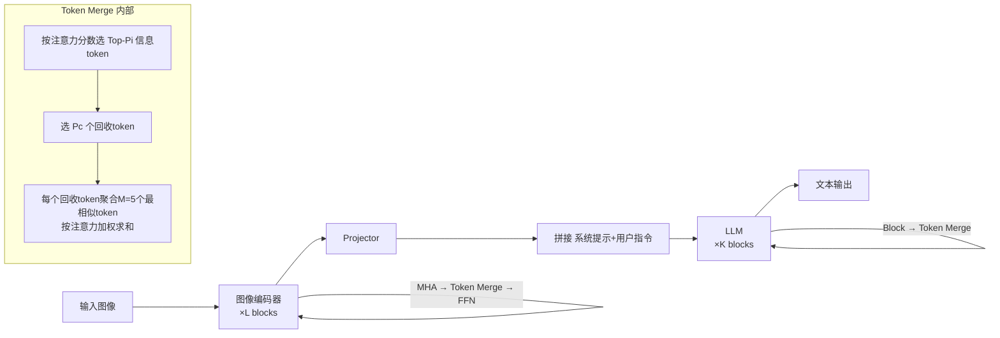

# iLLaVA: An Image is Worth Fewer Than 1/3 Input Tokens in Large Multimodal Models

**会议**: ICLR 2026  
**OpenReview**: [https://openreview.net/forum?id=svKk3PkjZn](https://openreview.net/forum?id=svKk3PkjZn)  
**代码**: [https://github.com/hulianyuyy/iLLaVA](https://github.com/hulianyuyy/iLLaVA)  
**领域**: 多模态大模型加速 / 视觉 token 压缩  
**关键词**: LVLM 加速, token merging, 图像编码器, 训练-free, 双阶段压缩  

## 一句话总结
iLLaVA 跳出"只在 LLM 阶段压缩 token"的惯性，把 token 合并同时插进**图像编码器**和 **LLM** 两个阶段，并用"信息 token + 回收 token"的合并策略把被丢弃 token 的有用信息收回来，训练-free 实现端到端 2× 吞吐、4× prefilling 加速且保持 >95% 性能。

## 研究背景与动机
- **领域现状**：FastV、SparseVLM、FasterVLM、VisionZip、PyramidDrop、DivPrune 等一批工作通过裁剪/压缩视觉冗余 token 来加速大视觉语言模型（LVLM），已经取得不错进展。
- **现有痛点**：这些方法几乎都把目光锁死在 **LLM 阶段**——在进入 LLM 之前或 LLM 内部减 token，只为了降低 LLM 的计算量。但它们忽略了另一个重计算瓶颈：**图像编码器**。论文测得在单图/多图/视频任务里，编码器和 LLM 一起占据 >99% 推理时间，而编码器单独就占到 17%~45%（视频任务最高）。
- **核心矛盾**：图像编码器既是计算大户，又是 LLM 输入 token 的**最大来源**。只在 LLM 里减 token，等于放着上游不管、下游疲于奔命，无法实现真正的端到端加速。论文还测出：减同样数量的 token，在编码器里减比在 LLM 里减能多拿 +25.3% 吞吐、少耗 21.2% 显存。
- **本文目标**：把图像编码器纳入加速版图，与 LLM 协同分配计算预算，实现"上游减负→下游连带减负"的复利式加速，同时把 token 削减带来的性能损失压到最低。
- **核心 idea**：**双阶段 token 合并 + 信息回收**——在编码器和 LLM 两处都做 token merging，并对每次要丢掉的 token 先抽出"代表 token"把有用信息聚合回来，而非粗暴丢弃。

## 方法详解

### 整体框架
iLLaVA 是一个训练-free 的即插即用方案：在图像编码器若干个 block 的注意力与 FFN 之间插入 token 合并模块，在 LLM 若干个 block 之后再插入 token 合并模块。每个模块固定削减一批 token，用注意力分数定位重要 token，并把被淘汰 token 的信息回收进少量"回收 token"里。整套流程不引入可训练参数、几乎不增加额外计算。

### 关键设计

**1. 双阶段 token 合并：把削减动作下沉到编码器**——以往方法只敢在 LLM 里减 token，因为在编码器早期激进裁剪会丢掉关键信息、掉点严重。iLLaVA 的破局点是把削减拆到两个阶段协同分配预算：编码器选 $B_v$ 个 block、每个减 $R_v$ 个 token；LLM 选 $B_t$ 个 block、每个减 $R_t$ 个 token。给定 $N$ 个输入 token，最终保留 $N - R_v \times B_v - R_t \times B_t$ 个。编码器内的前向写成 $x^v_{out} = \mathrm{FFN}(\mathrm{TokenMerge}(\mathrm{MHA}(x^v_{in})))$，LLM 内则是 $x^t_{out} = \mathrm{TokenMerge}(K_i(x^t_{in}))$。由于编码器减 token 会**连带缩短**送进 LLM 的序列，上游每减一个 token，下游算力跟着复利式下降——这正是单看 LLM 阶段拿不到的收益。默认配置把 40% 合并量分给编码器（Layer 5/9/13），60% 分给 LLM（Layer 2/8/14）。

**2. 信息 token + 回收 token 的合并策略：不丢有用信息**——保留的 $P_v = N - R_v$ 个 token 被拆成两类：$P^i_v$ 个**信息 token** 和 $P^c_v$ 个**回收 token**，满足 $P^i_v + P^c_v = P_v$。先把注意力分数 $S_h = \mathrm{Softmax}(Q_h K_h^T / \sqrt{D_h})$ 在头维度上平均得到 $S_{avg} \in \mathbb{R}^N$（衡量每个 token 对其它 token 的重要性），取 Top-$P^i_v$ 作为信息 token。剩下被判为"次要"的 token 不直接扔——再从中按 $S_{avg}$ 选 $P^c_v$ 个作回收 token，让它们充当"聚类中心"：为每个回收 token 找 $M$（通常 5）个最相似的 token 作为组员，按归一化注意力分数加权求和把组员信息并进来。最后信息 token 与回收 token 拼接作为合并模块输出。这一"回收"动作是性能不掉的关键，消融里它显著优于纯裁剪和 ToMe 等合并策略。

**3. Flash-Attention 兼容与近零额外开销**——朴素注意力能直接拿到完整 $S_h$ 算 $S_{avg}$，但 Flash-Attention 不返回完整注意力矩阵。论文给 `flash_attn_varlen_func` 传 `return_attn_probs` 拿到 cumsum 注意力权重 $S_{cumsum} \in \mathbb{R}^N$，再经一次简单变换得到 $S_{avg}$，不引入额外计算。整套方法唯一的额外开销来自 $S_{sub}$ 的计算，复杂度为 $O(R_v)\times B_v + O(R_t)\times B_t$；由于 $R_v, R_t$ 只有几十而输入动辄上千 token，这点开销可忽略，保证了"加速不反被算力拖累"。

## 实验关键数据

### 主实验（图像基准，Qwen2.5-VL 7B，相对 vanilla 的性能保持率）

| 削减比例 | 方法 | 平均保持率 |
|---|---|---|
| 66.7% | VisionZip (CVPR25) | 98.4% |
| 66.7% | **iLLaVA** | **99.2%** |
| 77.8% | VisionZip (CVPR25) | 96.4% |
| 77.8% | **iLLaVA** | **97.6%** |
| 88.9% | VisionZip (CVPR25) | 93.7% |
| 88.9% | **iLLaVA** | **95.2%** |

视频基准（VideoMME / MVBench / EgoSchema / MLVU）下：90% 削减时 iLLaVA 比次优的 VisionZip 高 1.2%，95% 削减时差距扩大到 1.7%，越激进优势越明显。

### 消融实验

| 阶段配置 | Acc(%) | 吞吐 | 显存 |
|---|---|---|---|
| Vanilla（不减） | 65.3 | 1.86 | 32.1G |
| 仅 LLM 阶段减 | 62.1 | 3.46 | 23.1G |
| 编码器 + LLM（iLLaVA） | 更高 | **2.12×** | **0.64×** |

- **两阶段设计**：把编码器纳入后吞吐相比 vanilla 提到 2.12×、显存降到 0.64×，且精度反而比"仅 LLM 减"更好。
- **合并策略**：与 token 裁剪、SparseVLM/VisionZip/PyramidDrop 的合并、以及编码器经典方案 ToMe 对比，iLLaVA 的"回收"策略平均精度最高，吞吐相当或更好。

### 关键发现
- **效率**：在 MMMU 上整体 1.59× 省显存、2.12× 提吞吐、4.46× 降 prefilling 时间；削减比例从 50% 升到 90%，优势越拉越大。
- **以大胜小**：装上 iLLaVA 后，InternVL-2.5 26B 以相近吞吐反超 InternVL-2.5 8B，MMMU/MMStar 各 +4.2%/+2.2%；Qwen2.5-VL 7B 也以更高吞吐反超 3B 版，MMMU/MMStar +5.6%/+8.1%。
- **通用性**：在 LLaVA-OneVision、InternVL-2.5、MiniCPM-V 2.6 等多种架构上一致优于此前 SOTA。

## 亮点与洞察
- **重新定位瓶颈**：用实测把"图像编码器也是重计算+token 主要来源"这件被忽视的事摆上台面，是论文最有说服力的动机——同样减 token，在编码器减比在 LLM 减多 25.3% 吞吐。
- **复利式加速**：编码器减 token 会连带缩短 LLM 输入，这种"上游减负→下游连带减负"的杠杆是单阶段方法拿不到的。
- **不丢信息的工程化**："信息 token + 回收 token"把被淘汰内容压缩成少量聚类中心，既保性能又几乎零额外开销，还专门解决了 Flash-Attention 拿不到完整注意力矩阵的落地问题。
- **训练-free 即插即用**：不动权重、不需重训，可直接挂到各主流 LVLM 上。

## 局限与展望
- token 重要性完全依赖注意力分数，对注意力不能准确反映语义重要性的场景（如细粒度 OCR、密集计数）可能误删关键 token，论文未深入讨论这类失败模式。
- 各阶段的 block 选择与合并量分配（40%/60%、固定层号）是经验设定，缺少自适应/可学习的预算分配机制。
- 标题"少于 1/3 token"主要建立在高削减比例配置上，极端削减（如 88.9%/95%）仍有 ~5% 掉点，对精度敏感的应用需权衡。
- 回收 token 的相似组员数 $M=5$、信息/回收 token 比例等超参对不同任务是否稳健，仍待更系统的鲁棒性验证。

## 相关工作与启发
- **LLM 阶段 token 压缩**：FastV（Top-K 激活）、SparseVLM（文本引导评估视觉 token）、FasterVLM（CLS-token 注意力裁剪）、PyramidDrop（分阶段按比例丢弃）、DivPrune（Max-Min 多样性）、AdaFV（跨模态注意力混合）——iLLaVA 把这条线的"只看 LLM"补成"编码器+LLM"。
- **token 合并**：VisionZip（选信息 token 并并入丢弃信息）、AIM（先合并后裁剪）、以及视觉领域经典的 ToMe——iLLaVA 的回收策略可视为把 ToMe 的合并思想升级为"注意力引导的信息回收"，并跨编码器与 LLM 统一部署。
- **启发**：在做模型加速时，先用 profiling 找出真正的瓶颈分布，往往比在习惯位置继续优化更有杠杆；"丢弃前先回收"是 token 削减类方法保性能的通用范式。

## 评分
- **新颖性**: ⭐⭐⭐⭐ — 把削减动作下沉到图像编码器并与 LLM 协同分配预算是清晰的增量创新，回收策略与 Flash-Attention 兼容方案落地扎实，但单点技术沿用了注意力打分+合并的成熟范式。
- **实验充分度**: ⭐⭐⭐⭐ — 覆盖 10+ 图像/视频基准、多种 backbone、多档削减比例，效率四指标齐全，消融能分别支撑两大设计；缺失对失败模式与超参鲁棒性的系统分析。
- **写作质量**: ⭐⭐⭐⭐ — 动机由实测数据驱动、逻辑顺畅，图示直观，方法表述清晰易复现。
- **价值**: ⭐⭐⭐⭐ — 训练-free、即插即用、端到端 2× 吞吐且"以大胜小"，对 LVLM 落地部署有直接实用价值。

<!-- RELATED:START -->

## 相关论文

- [\[ACL 2026\] ReGATE: Learning Faster and Better with Fewer Tokens in MLLMs](../../ACL2026/vlm_efficiency/regate_learning_faster_and_better_with_fewer_tokens_in_mllms.md)
- [\[ICLR 2026\] Photon: Speedup Volume Understanding with Efficient Multimodal Large Language Models](photon_speedup_volume_understanding_with_efficient_multimodal_large_language_mod.md)
- [\[CVPR 2026\] What Do Visual Tokens Really Encode? Uncovering Sparsity and Redundancy in Multimodal Large Language Models](../../CVPR2026/vlm_efficiency/what_do_visual_tokens_really_encode_uncovering_sparsity_and_redundancy_in_multim.md)
- [\[ICLR 2026\] PPE: Positional Preservation Embedding for Token Compression in Multimodal Large Language Models](ppe_positional_preservation_embedding_for_token_compression_in_multimodal_large_.md)
- [\[CVPR 2026\] MM-SeR: Multimodal Self-Refinement for Lightweight Image Captioning](../../CVPR2026/vlm_efficiency/mm-ser_multimodal_self-refinement_for_lightweight_image_captioning.md)

<!-- RELATED:END -->
