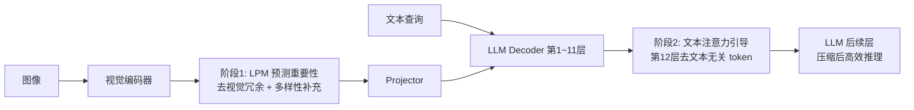

# LearnPruner: Rethinking Attention-based Token Pruning in Vision Language Models

**会议**: ICLR 2026  
**OpenReview**: [https://openreview.net/forum?id=Dxb6gBJHby](https://openreview.net/forum?id=Dxb6gBJHby)  
**代码**: 作者承诺开源（截至笔记暂未放出）  
**领域**: VLM 推理效率 / 视觉 token 剪枝  
**关键词**: Token Pruning, Vision-Language Model, Attention Sink, Learnable Pruning, Inference Acceleration  

## 一句话总结
LearnPruner 通过实证拆穿了"attention 分数 = token 重要性"这一通行假设，指出视觉编码器的 [CLS] attention 被 attention sink 污染、而 LLM 中只有"文本→视觉"的中层注意力才可靠，进而用一个可学习剪枝模块替代 [CLS] attention、再叠加 LLM 中层的文本引导剪枝，仅保留约 5.5% 视觉 token 即可维持 95% 性能并取得 3.2× 加速。

## 研究背景与动机
**领域现状**：VLM 把图像编码成长视觉 token 序列喂给 LLM，LLaVA-1.5 单图就有 576 token，LLaVA-NeXT 高分辨率切图可达 2880 token，视觉 token 数量远超文本却信息密度更低。token 剪枝因此成为主流提效手段——给每个视觉 token 打重要性分，只留 top-k。

**现有痛点**：几乎所有方法都把"注意力分数"当作重要性的代理：要么用视觉编码器里 [CLS] token 的 attention（VisPruner、VisionZip），要么用 LLM 内部 token 收到的平均 attention（FastV、SparseVLM）。但作者通过 LLaVA-1.5 的注意力热图发现两个问题——视觉编码器存在 **attention sink**：[CLS] 把过多注意力分给低信息量的背景区域（这与 ViT 会产生高范数 register/artifact token 的现象一致），导致激进剪枝时大量丢前景；而 LLM 内的视觉注意力又存在 **attention shift**：因果掩码 + 位置编码衰减让靠后 index 的视觉 token 系统性获得更高分，这种偏置会误导剪枝。

**核心矛盾**：直接信注意力会剪错 token，但完全抛弃注意力又失去了跨模态的查询相关性引导——需要分清"哪部分注意力可信、哪部分该被替换"。

**本文目标**：把视觉编码器侧不可靠的 [CLS] attention 换成可学习的重要性预测，把 LLM 侧不可靠的视觉注意力剔除、只保留可靠的文本→视觉注意力，并把剪枝拆成两个阶段以兼顾精度与加速。

**核心 idea**：作者的关键实证发现是——**文本→视觉注意力对 attention shift 有抵抗力**，且这种可靠性在 LLM 中层（第 12 层附近）最强（浅层和深层注意力都被无信息区吸走，只有中层不同文本 token 才会聚焦各自语义相关区域）。**两阶段渐进剪枝**：先在视觉编码器后用学习模块去掉视觉冗余，再在 LLM 中层用文本注意力去掉与查询无关的内容。

## 方法详解

### 整体框架
LearnPruner 是一个两阶段渐进式剪枝管线：第一阶段在视觉编码器输出后用一个轻量可学习模块（LPM）预测每个视觉 token 的重要性并保留信息量最高的子集，同时额外保留少量"多样性 token"补充背景上下文；第二阶段在 LLM 第 12 层用文本→视觉注意力做查询感知的二次剪枝，进一步丢掉与问题无关的视觉 token。基座 VLM 权重全程冻结，只训练 LPM。

### 关键设计
**1. 可学习剪枝模块（LPM）：用监督替代被污染的 [CLS] 注意力。** 既然 [CLS] attention 会被 attention sink 带偏，作者干脆不再从注意力里"读"重要性，而是"学"出来。把视觉编码器输出的 token 特征 $X_v^{(0)}$ 送进一个轻量 MLP 做二分类，输出软掩码 $M_\text{soft}=\mathrm{Softmax}(\mathrm{MLP}(X_v^{(0)}))$，再取 $M_\text{hard}=\arg\max(M_\text{soft})$ 决定保留还是剪掉。由于离散决策不可导，训练时用 Straight-Through Estimator（STE）让前向按硬掩码丢 token、反向用软掩码回传梯度；推理时直接拿 $M_\text{soft}$ 当重要性分数。这个模块只有 0.53M 参数，相比 VisionZip‡ 的 20.9M、TwigVLM 的 610M 极其轻量，却把第一阶段精度从 [CLS] attention 的 94.6% 抬到 96.1%。

**2. 多样性 token 补充：防止只盯前景而丢背景线索。** LPM 天然偏好语义丰富的前景，但某些 VQA 任务的答案恰恰在背景里。作者在推理时加一个基于相似度的贪心选择：在 LPM 选出的信息 token 之外，对每个候选 token 计算它与已选集合的最大余弦相似度，每次迭代加入"最大相似度最小"的那个 token，直到达到 token 预算。这样选出的多样性 token（占比 $\lambda=10\%$）尽可能覆盖互补的视觉上下文，避免压缩集合过度同质化。

**3. 文本引导的中层二次剪枝：只用可信的那部分注意力。** 实证显示视觉→视觉注意力被 attention shift 污染、不能用，但文本→视觉注意力可靠。第二阶段在 LLM 第 $k=12$ 层，把所有 $N_q$ 个查询 token 对视觉 token 的注意力跨头平均，得到每个视觉 token 的查询相关性分数 $\tilde{A}^{(k)}=\frac{1}{N_q}\sum_{i=1}^{N_q} A^{(k)}(X_{q,i}^{(k)}, X_v^{(k)})$，只保留 top-k。选第 12 层是因为浅层/深层注意力都被无信息区吸走、唯独中层不同文本 token 才会各自聚焦语义相关区域。值得注意的是消融显示，在第二阶段再插一个 LPM 并不带来增益——说明中层文本注意力信号已足够可靠，特征无法提供互补信息，于是作者直接用注意力剪枝、避免训练多个 LPM。

**4. 两阶段预算分配：先粗去冗余、再细去无关。** 单独用 LPM（类似 Dynamic-LLaVA）只能去视觉冗余，单独用文本注意力则要把剪枝拖到中层、前面 11 层仍在做大量冗余计算、加速有限。两阶段串联让第一阶段先把视觉序列大幅压缩（按 $R_1:R_2=3$ 分配预算，第一阶段保 $R_1$、第二阶段保 $R_2$），既减少了 LLM 前段的冗余计算（带来真实加速），又让第二阶段在更干净的集合上做查询感知精选，整体把 96.1% 进一步抬到 96.9%。

## 实验关键数据
在 LLaVA-v1.5-7B / LLaVA-NeXT-7B / Video-LLaVA-7B / Qwen2.5-VL-7B 上评测，对比 FastV、SparseVLM、DivPrune、DART、VisPruner、VisionZip、TwigVLM 等。

### 主实验表格（LLaVA-v1.5-7B，相对精度 RelAcc.，越激进越能拉开差距）

| 保留 token | 方法 | 可学参数 | RelAcc. |
|---|---|---|---|
| 128 (↓77.8%) | VisPruner | - | 97.3% |
| 128 | TwigVLM | 610M | 99.0% |
| 128 | **LearnPruner** | 0.53M | **98.5%** |
| 64 (↓88.9%) | TwigVLM | 610M | 96.0% |
| 64 | **LearnPruner** | 0.53M | **96.9%** |
| 32 (↓94.4%) | VisPruner | - | 89.7% |
| 32 | DivPrune | - | 90.5% |
| 32 | **LearnPruner** | 0.53M | **94.8%** |

在最激进的 32 token（仅 5.6%）设定下，LearnPruner 比次优方法（DivPrune 90.5%）领先 4.3 个百分点，且参数量比训练型 TwigVLM 小三个数量级。LLaVA-NeXT-7B 上保留 160 token（↓94.4%）仍达 94.0% RelAcc.（VisionZip‡ 93.3%）；Qwen2.5-VL-7B 上保留 142 token（↓88.9%）达 94.1%，而 FastV 已崩到 71.4%。

### 消融实验表格（LLaVA-v1.5-7B，固定保留 64 token）

| 阶段1 准则 | 阶段2 准则 | RelAcc. |
|---|---|---|
| [CLS] Attn | - | 94.6% |
| LPM | - | 96.1% |
| LPM | LPM | 96.9% |
| LPM | Text Attn | 96.9% |

阶段1 用 LPM 替代 [CLS] attention 直接 +1.5%；加上阶段2 再 +0.8%；阶段2 用 LPM 还是用文本注意力效果持平（都 96.9%），印证中层文本注意力本身已足够可靠、无需再训模块。

### 关键发现
- **效率（Table 5）**：LLaVA-v1.5-7B 保留 32 token 时 prefill 加速 2.3×、总时间 1.5×、KV cache 缩 6.8×、TFLOPs 降 5.4×；LLaVA-NeXT-7B 保留 160 token 时 prefill 6.0×、总时间 3.2×，序列越长加速越明显，LPM 自身开销可忽略。
- **注意力分层可靠性**：从第 8 层起文本注意力即可保 95%+ 基线性能，中层最稳，深层骤降——为"第 12 层剪枝"提供了直接依据。
- **跨架构/跨模态泛化**：在非 LLaMA 系的 Qwen2.5-VL 和视频任务（TGIF/MSVD/MSRVTT-QA）上均稳定领先 FastV。

## 亮点与洞察
- **先诊断再开方**：论文最有价值的不是模块本身，而是把"attention=重要性"这一全行业默认假设拆成两个可证伪的子命题（视觉编码器 attention sink、LLM attention shift），并用前景分割对照实验 + 分层注意力对照定量证伪——"随机前景选择"竟能媲美"[CLS] 全图选择"这一结果尤其有说服力。
- **可学习 vs 免训练的折中点拿捏得好**：只训一个 0.53M 的 MLP、冻结基座、用 10% LLaVA-665K 数据，既享受了学习型方法的精度，又把训练成本压到远低于 TwigVLM（610M）/VisionZip‡（20.9M）。
- **"哪里该学、哪里该用规则"分得清**：阶段1 注意力不可信→上可学模块；阶段2 文本注意力可信→直接用、消融证明再加模块也无益，避免了过度工程化。

## 局限与展望
- **LPM 需要训练且依赖标注前景**：分析阶段用 LangSAM/SAM-2 做前景分割来论证 [CLS] 缺陷，虽然 LPM 训练本身是端到端监督，但其"偏好前景"的归纳偏置可能在前景定义模糊或答案在背景的任务上有风险，多样性 token 是补丁而非根治。
- **剪枝层与预算比例为手工超参**：第 12 层、$R_1:R_2=3$、$\lambda=10\%$ 都是经验设定，跨模型/分辨率是否最优缺乏自适应机制。
- **视频与超长序列验证有限**：视频实验仅取每个 benchmark 前 1000 样本、且只对比 FastV，未与更强的视频专用剪枝方法横评。
- **代码与 checkpoint 尚未释出**：可复现性目前依赖正文+附录描述。

## 相关工作与启发
- **免训练注意力剪枝谱系**：FastV（LLM 浅层平均注意力剪枝）、PyramidDrop（分层递增冗余）、SparseVLM（文本感知 + 注意力矩阵秩自适应比例）、VisPruner/VisionZip（回退到 [CLS] attention + token 合并）——LearnPruner 正是针对这一谱系的注意力假设做"反向工程"。
- **多样性视角**：DivPrune、DART 从特征相似度维持多样集合，LearnPruner 的多样性 token 模块借鉴了这一思路作为前景偏置的补偿。
- **训练型剪枝**：ATP-LLaVA（预测实例级阈值）、TwigVLM（插入解码块 + 自投机解码）、Dynamic-LLaVA（学习重要性预测器）——LearnPruner 的 LPM 与 Dynamic-LLaVA 同源，但通过叠加中层文本剪枝实现更优的预算分配。
- **启发**：当某个"代理信号"被整个领域默认采用时，值得用受控对照实验去验证它在不同模块/不同层的可靠性边界，而非一刀切地信任或抛弃——"分层可靠、分模块取舍"可能比"全局加权"更有效。

## 评分
- **新颖性**: ⭐⭐⭐⭐ 模块本身（可学习 MLP + STE、文本注意力剪枝、多样性选择）多为已有技术拼装，但"attention sink + attention shift 双重诊断 → 分模块决定学/用"的洞察框架新颖且有解释力。
- **实验充分度**: ⭐⭐⭐⭐ 覆盖 4 个 VLM（含 Qwen2.5-VL、视频）、多 token 预算、效率全维度（TFLOPs/时延/KV cache/显存）、消融清晰；但视频横评对手单一、超参敏感性分析偏弱。
- **写作质量**: ⭐⭐⭐⭐ 动机—证据—方法逻辑链顺畅，图表（注意力热图、分层对照）直观支撑论点，可读性高。
- **价值**: ⭐⭐⭐⭐ 在激进剪枝区间（5% token）显著领先且参数极轻，对资源受限 VLM 部署有直接实用价值，对"注意力即重要性"的反思也有方法论启发。

<!-- RELATED:START -->

## 相关论文

- [\[CVPR 2026\] Rethinking Token Reduction for Large Vision-Language Models](../../CVPR2026/vlm_efficiency/rethinking_token_reduction_for_large_vision-language_models.md)
- [\[ACL 2026\] HiPrune: Hierarchical Attention for Efficient Token Pruning in Vision-Language Models](../../ACL2026/vlm_efficiency/hiprune_hierarchical_attention_for_efficient_token_pruning_in_vision-language_mo.md)
- [\[ICLR 2026\] IVC-Prune: Revealing the Implicit Visual Coordinates in LVLMs for Vision Token Pruning](ivc-prune_revealing_the_implicit_visual_coordinates_in_lvlms_for_vision_token_pr.md)
- [\[ICLR 2026\] HiDrop: Hierarchical Vision Token Reduction in MLLMs via Late Injection, Concave Pyramid Pruning, and Early Exit](hidrop_hierarchical_vision_token_reduction_in_mllms_via_late_injection_concave_p.md)
- [\[CVPR 2026\] Attention-aware Inference Optimizations for Large Vision-Language Models with Memory-efficient Decoding](../../CVPR2026/vlm_efficiency/attention-aware_inference_optimizations_for_large_vision-language_models_with_me.md)

<!-- RELATED:END -->
