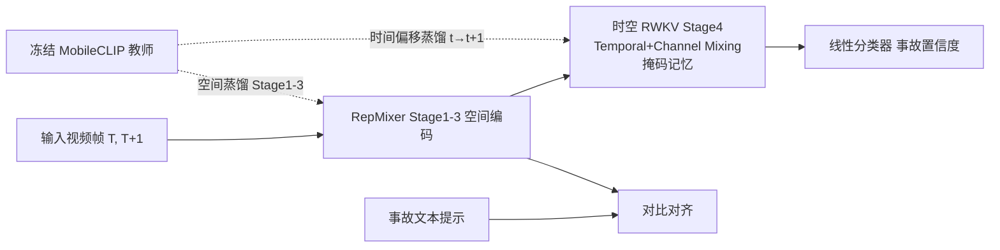

# Lightweight Spatio-Temporal Modeling via Temporally Shifted Distillation for Real-Time Accident Anticipation

**会议**: ICLR 2026  
**OpenReview**: [https://openreview.net/forum?id=8zzfTSVds2](https://openreview.net/forum?id=8zzfTSVds2)  
**代码**: 待确认  
**领域**: 高效多模态 / 视频理解 / 交通事故预测  
**关键词**: 事故预测, 知识蒸馏, RWKV, 时空建模, 边缘部署, MobileCLIP  

## 一句话总结
用一个**冻结的纯图像 CLIP 教师 + 时间偏移蒸馏**，让轻量 RepMixer+RWKV 学生在不做大规模视频预训练的前提下学到"预测未来帧"的时序能力，在 DAD/CCD 事故预测基准上达到 SOTA，且模型比对手小 3–7×、能在 Jetson Orin Nano 上 80 FPS 实时跑。

## 研究背景与动机
**领域现状**：交通事故实时预测要求给每一帧打一个"即将出事"的置信度，预测窗口极窄、场景动态剧烈。早期方法（DSA、FA、adaLEA）用 RNN+软注意力，空间推理弱；后续转向图建模、强化学习（DRIVE、GSC、DSTA），但依赖预定义图结构、稠密物体级标注或"检测+跟踪"多阶段流水线。

**现有痛点**：主流强基线（DAA-GNN、CCAF-Net、MASTTA）普遍走"Faster R-CNN 检测 + VGG16 抽特征"的物体中心多阶段路线，参数动辄 100–275M、延迟高，根本塞不进车载边缘设备；CCAF-Net 还要额外深度图。

**核心矛盾**：想要强时序建模通常得上视频预训练教师或二次方复杂度的时空 Transformer（$O(N^2T^2)$），但事故是稀有事件、视频预训练数据贵又难，而边缘设备又卡死了算力和显存——**"时序表达力"和"轻量实时"二者难以兼得**。

**本文目标**：做一个端到端、直接吃原始 RGB 帧、能在 Jetson 上实时跑的紧凑模型，同时保住早预测精度。

**核心 idea**：**【时间偏移蒸馏】** 让学生在时刻 $t$ 的输出去对齐教师在 $t{+}1$ 的特征——用一个根本没有时序概念的纯图像教师，"逼"出学生的预测性时序表征，从而彻底绕开视频预训练教师。

## 方法详解

### 整体框架
框架是一个师生结构：教师是冻结的 MobileCLIP（4 个 RepMixer stage，Stage 4 为纯空间 MHSA），学生共享前三个 stage 的 RepMixer 主干，但把 Stage 4 换成时空 RWKV 块做线性复杂度时序推理。训练分两段：先用时间偏移蒸馏 + 对比学习在 MM-AU/Nexar 视频-文本对上预训练，再在 DAD/CCD 上端到端微调。

### 关键设计

**1. 时间偏移蒸馏（Temporally Shifted Distillation）：让无时序的教师教出时序能力。** 这是全文最关键的一招。空间分支上，学生第 $\ell{\in}\{1,2,3\}$ 个 stage 的特征经投影 $P_\ell$ 后对齐教师同一时刻的特征，$L_{\text{spatial}}=\sum_{\ell=1}^{3}\lVert P_\ell(f^{(S)}_{t,\ell})-f^{(T)}_{t,\ell}\rVert_2^2$，负责把空间语义"抄"过来。真正的窍门在时序分支：学生用自己在时刻 $t$ 的输出去**预测教师在 $t{+}1$ 的空间特征**，$L_{\text{temporal}}=\lVert H_{ST}(f^{(S)}_{t})-f^{(T)}_{t+1}\rVert_2^2$，其中 $H_{ST}$ 是时空投影头。由于监督信号被"偏移"了一帧，学生被迫去学"下一帧会变成什么样"，等于把一个静态图像教师当成了未来帧的预言机——消融（表 5/6）显示仅用时序蒸馏（74.1%）就胜过仅空间蒸馏（71.2%），而把它换成真正的视频教师 V-JEPA2 反而 mAP 更低（66%），因为分辨率/tokenize 不匹配导致空间对齐困难。表 4 还说明偏移 1 帧最优（75.3%），偏移越大早预测越早但精度越掉，正契合事故预测"短视界"的特点。

**2. 时空 RWKV 块：线性复杂度的窗口化循环时序建模。** 学生 Stage 4 把特征切成 $K$ 个不重叠窗口（$p_1\times p_2$）做局部循环，避免二次方注意力。Temporal Mixing 先对当前帧 $X_t$ 与上一帧 $X_{t-1}$ 做可学习插值得到 $R_t,K_t,V_t$（如 $R_t=W_r(\mu_r X_t+(1-\mu_r)X_{t-1})$），再用带可学习时间衰减 $w,u$ 的隐状态递推累积历史：$\text{wkv}_t=\frac{s_{t-1}+m_t\odot(e^{u+k_t}\odot v_t)}{d_{t-1}+m_t\odot e^{u+k_t}}$，输出经 sigmoid 门控 $\text{rwkv}_t=W_o(\sigma(R_t)\odot \text{wkv}_t)$。Channel Mixing 用平方 ReLU（$\sigma(R'_t)\odot W'_o(\text{ReLU}(K'_t)^2)$）增强通道内非线性。整套设计保证长程依赖与并行训练并存，是实时落地的算力基础——消融（表 1）显示 6 层 RWKV 在 26.7M 参数下取得最佳 mAP 75.33%。

**3. 掩码记忆策略（Masked Memory）：用"记忆 dropout"模拟遮挡。** 上式里的二值掩码 $m_t\in\{0,1\}$ 是为部分可观测设计的：$m_t=1$ 时正常用当前 $(K_t,V_t)$ 更新隐状态，$m_t=0$ 时只传播旧记忆 $s_{t-1},d_{t-1}$（如 $s_t=m_t\odot(e^{-w}\odot s_{t-1}+e^{k_t}\odot v_t)+(1-m_t)\odot s_{t-1}$）。这相当于随机让模型"看不见当前帧、只能靠记忆"，逼它学会在行人被车挡住、运动模糊、夜间低光等情况下靠时序先验补全。该策略**只在预训练用、微调和推理都关掉**，且融进 CUDA 核里几乎零额外开销；消融（表 3）显示 30% 掩码率最优（75.3%），过高（50–75%）反而掉点。

**4. 多模态对比监督：用事故文本提示锚定语义。** 在预训练阶段加一个 CLIP 式对比损失 $L_{\text{contr}}$，把学生帧级视觉嵌入与 112 条事故相关文本提示（如"a car runs a red light"）对齐，匹配对拉近、错配对推远。它给特征注入事故类别的语义先验，提升对多样场景的泛化。最终目标是四项加权和 $L_{\text{total}}=\lambda_1 L_{\text{spatial}}^{\text{distill}}+\lambda_2 L_{\text{temporal}}^{\text{distill}}+\lambda_3 L_{\text{contr}}+\lambda_4 L_{\text{accident}}$，其中事故损失用指数加权交叉熵鼓励早预测。消融显示去掉对比损失 mAP 从 75.3% 跌到 70.1%，因为微调阶段仍依赖预训练建立的文本-视觉对齐。

## 实验关键数据

### 主实验表格（DAD / CCD，mTTA 最优对应 mAP）

| 数据集 | 方法 | 推理参数 (M) | mAP (%) | mTTA (s) |
|---|---|---|---|---|
| DAD | DAA-GNN (PR23) | 183 | 70.6 | 1.59 |
| DAD | MASTTA (TCSVT25) | 99 | 70.2 | 3.96 |
| DAD | CCAF-Net (NEURO25) | 191 | 71.8 | 4.15 |
| DAD | **Ours** | **26** | **75.3** | **4.04** |
| CCD | MASTTA | 99 | 99.9 | 4.95 |
| CCD | CCAF-Net | 191 | 93.9 | 4.94 |
| CCD | **Ours** | **26** | **99.9** | **4.95** |

DAD 上以 26M 参数（比 DAA-GNN 小 7×、比 CCAF-Net 小 8.3×、比唯一端到端对手 MASTTA 小 3.8×）拿到最高 mAP 75.3%；CCD 上 mAP/mTTA 双双追平/超越 SOTA。

### 消融实验表格（蒸馏组件 / 模块组合）

| 配置 | mAP (%) | mTTA (s) |
|---|---|---|
| 仅空间+时序蒸馏（无对比） | 70.1 | 3.54 |
| 仅空间蒸馏+对比 | 71.2 | 3.79 |
| 仅时序蒸馏+对比 | 74.1 | 3.95 |
| 全部（spatial+temporal+contr） | **75.3** | **4.04** |
| T-RWKV + 微调 | 39.4 | 3.97 |
| S-RWKV + TSD + 微调 | 55.6 | 4.00 |
| T-RWKV + TSD + 微调 | **75.3** | 4.04 |

### 关键发现
- **时序蒸馏 > 空间蒸馏**：仅时序（74.1%）显著优于仅空间（71.2%），印证"偏移监督"才是预测能力来源。
- **TSD 与时序建模缺一不可**：单独 T-RWKV 仅 39.4%，单独 TSD（S-RWKV）55.6%，二者合并才到 75.3%。
- **真视频教师反而更差**：V-JEPA2 教师只有 66% mAP，因空间表征与学生不兼容；纯图像 MobileCLIP 反而是更好教师。
- **边缘实时**：TensorRT BF16 编译后模型 <69 MB，Jetson Orin Nano 上 80 FPS、约 0.4s 延迟。

## 亮点与洞察
- **反直觉的"无时序教师教时序"**：把蒸馏目标在时间轴上平移一帧，就让一个静态图像 CLIP 变成"未来预言机"，极其简洁且数据高效，对事故这类稀有事件特别友好。
- **掩码即遮挡模拟**：用记忆 dropout 把"看不见就靠记忆"显式写进训练，巧妙地把驾驶场景的部分可观测性当成了正则化。
- **效率-精度同时赢**：不是用精度换体积，而是在 26M 参数下同时超越 191M 的重模型，trade-off 曲线（图 1）整体外移。

## 局限与展望
- 评测只在 DAD/CCD 两个 dashcam 基准，未覆盖更多极端天气/地域分布，泛化性待进一步验证。
- 时间偏移固定为 1 帧最优，但这与帧率/事故视界强相关，跨数据集是否需自适应偏移未讨论。
- 教师选择高度依赖与学生主干的空间兼容性（V-JEPA2 失败即例证），换主干时教师需重新挑选，缺乏通用准则。
- 掩码策略只在预训练用，未探索推理期主动掩码做不确定性估计的可能。

## 相关工作与启发
- **轻量主干**：RepMixer/MobileCLIP（Vasu 2024）提供高效空间编码，是学生主干来源。
- **线性注意力/循环 Transformer**：RWKV（Peng 2023）、线性注意力（Katharopoulos 2020）、AFT（Zhai 2021）、VRWKV（Duan 2024）；本文把 RWKV 改造成窗口化、掩码感知的时空块，并指出 VRWKV 的双向性不利实时。
- **事故预测谱系**：从 DSA/FA 的 RNN+注意力，到 DRIVE/GSC 的图与 RoI，再到 CCAF-Net 的 RGB-D 融合，本文走相反方向——去物体检测、去多阶段、去视频预训练。
- **启发**：时间偏移蒸馏可推广到任何"用图像基础模型给视频任务注入预测性"的场景（动作预测、视频异常检测等），是一种低成本时序自举范式。

## 评分
- **新颖性**: ⭐⭐⭐⭐ —— "时间偏移蒸馏让无时序教师教出时序"是简洁而反直觉的好点子，掩码记忆与 RWKV 改造亦有工程巧思。
- **实验充分度**: ⭐⭐⭐⭐ —— 消融翔实（偏移量/掩码率/层数/教师类型全覆盖），含真机 Jetson 部署数据；但基准仅 2 个、缺更大规模泛化验证。
- **写作质量**: ⭐⭐⭐⭐ —— 动机-方法-实验逻辑清晰，公式与图配合到位。
- **价值**: ⭐⭐⭐⭐ —— 车载实时事故预测是高价值落地场景，3–7× 体积压缩 + SOTA 精度对边缘部署很有实用意义。

<!-- RELATED:START -->

## 相关论文

- [\[CVPR 2026\] LIFT and PLACE: A Simple, Stable, and Effective Knowledge Distillation Framework for Lightweight Diffusion Models](../../CVPR2026/vlm_efficiency/lift_and_place_a_simple_stable_and_effective_knowledge_distillation_framework_fo.md)
- [\[ICML 2026\] Gated Relational Alignment via Confidence-based Distillation for Efficient VLMs](../../ICML2026/vlm_efficiency/gated_relational_alignment_via_confidence-based_distillation_for_efficient_vlms.md)
- [\[CVPR 2026\] Curvature-Aware Zeroth-Order Optimization for Memory-Efficient Test-Time Adaptation](../../CVPR2026/vlm_efficiency/curvature-aware_zeroth-order_optimization_for_memory-efficient_test-time_adaptat.md)
- [\[ICLR 2026\] Enhancing Visual Token Representations for Video Large Language Models via Training-free Spatial-Temporal Pooling and Gridding](enhancing_visual_token_representations_for_video_large_language_models_via_train.md)
- [\[CVPR 2026\] HTTM: Head-wise Temporal Token Merging for Faster VGGT](../../CVPR2026/vlm_efficiency/httm_head-wise_temporal_token_merging_for_faster_vggt.md)

<!-- RELATED:END -->
