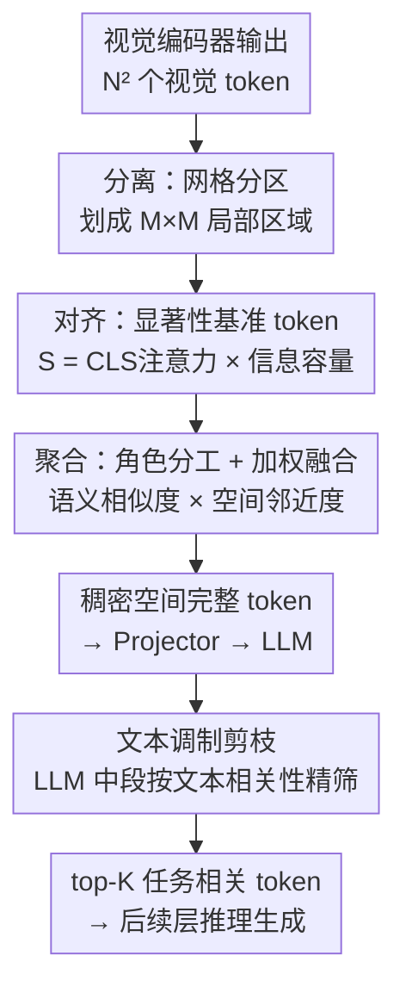

# Nüwa: Mending the Spatial Integrity Torn by VLM Token Pruning

**会议**: ICLR 2026  
**OpenReview**: [https://openreview.net/forum?id=C9yclwdquU](https://openreview.net/forum?id=C9yclwdquU)  
**代码**: https://github.com/Man-PaperRejected/Nuwa  
**领域**: 多模态VLM / LLM效率 / 视觉token剪枝  
**关键词**: 视觉token剪枝, 视觉定位, 空间完整性, 群体智能, 两阶段剪枝

## 一句话总结
本文发现现有视觉 token 剪枝方法之所以在视觉定位（visual grounding, VG）任务上崩盘，是因为它们破坏了由位置编码构建的"全局空间参考系"，于是提出 Nüwa——一个受群体智能（Boids）启发的两阶段剪枝框架，先在视觉编码器侧用"分区-对齐-聚合"保住空间锚点、再在 LLM 中段做文本引导的精筛，把 VG 任务的性能保持率从 ~7% 拉到 47%，同时 VQA 维持在 95%。

## 研究背景与动机

**领域现状**：视觉语言模型（VLM）在推理时会产生大量视觉 token（如 LLaVA-1.5 的 576 个），带来沉重的计算开销。视觉 token 剪枝因此成为主流加速手段，大致分三类——视觉编码器侧剪枝（如 VisionZip、PruMerge，靠视觉语义相似度）、LLM 单层一次性剪枝（如 FastV，靠注意力分数）、LLM 多层动态剪枝（如 SparseVLM、PyramidDrop）。

**现有痛点**：这些方法在 VQA 类任务上确实能保住性能，但作者做了一组系统对比后发现两个尴尬事实：其一，在 VQA 上，复杂剪枝方法相比"随机采样""平均池化"这种朴素 baseline 几乎没有优势（Finding 1）；其二，几乎所有方法在视觉定位任务上都会系统性崩盘——在 64 token 预算下，FastV/SparseVLM/VisionZip 在 RefCOCO 上的性能保持率只有 1.88%~7.28%，而朴素的平均池化反而是表现最好的（12% 左右）。这说明现有剪枝的"先进性"在 grounding 上不仅没用、甚至有害。

**核心矛盾**：为什么池化这种粗糙方法在 grounding 上反而赢？作者顺着这个反常现象深挖 VLM 的视觉处理管线，发现 VLM 是一个"从全局语义整合到细粒度物体聚焦"的多阶段流水线（用 Visual Attention Entropy 和 Object-Centric Cohesion 两个指标刻画，OCC 在 ViT 和 LLM 的中段都达到峰值），而 grounding 任务恰恰高度依赖中段的"全局空间参考系"——这个参考系由 token 的位置编码交互构建。现有剪枝在丢 token 时，要么压缩了位置编码范围（VisionZip 的 PERC），要么保留绝对坐标却打断了空间连续性（FastV 的 PESP），都把这个全局参考系撕碎了。池化之所以好，是因为它在粗网格上聚合特征，隐式维持了全局拓扑。

**本文目标**：在大幅压缩 token 的同时，保住"全局空间参考系"，让剪枝后的 VLM 既能做 VQA 也能做 grounding。

**切入角度**：作者用位置重建实验验证了这个假设——把 VisionZip/FastV 的位置编码策略换成 RPME（Relative Position Mapping Extension，通过线性映射把剪枝后 token 的相对距离扩展回原始全幅范围），grounding 性能立刻回升（VisionZip 提升 5.6%/13.4%），而对 VQA 几乎无影响（Finding 3）。这证明"恢复连续的空间坐标"是治本之道。

**核心 idea**：把视觉 token 压缩看成一个"保持空间均匀覆盖"的群体聚合问题——借用 Boids 群体智能算法的"分离/对齐/聚合"三操作，在视觉编码器侧保住空间锚点，再在 LLM 中段用文本语义做任务相关的精筛。

## 方法详解

### 整体框架
Nüwa 是一个两阶段剪枝框架，输入是视觉编码器输出的 $N^2$ 个视觉 token，输出是少量（如 64/128/192 个）既保留全局空间拓扑、又与文本任务相关的 token，喂给 LLM 做推理。

第一阶段在**视觉编码器侧**做"空间内聚剪枝"，借鉴 Boids 群体智能的三个串行操作——**分离**（把 token 网格划分成局部区域，保证空间均匀覆盖）→**对齐**（在每个区域里挑全局显著的基准 token 当聚合中心）→**聚合**（把邻近 token 的特征按"语义相似度 × 空间邻近度"加权融进基准 token），得到一个稠密、空间完整的 token 序列。第二阶段在**LLM 中段**（多模态对齐已初步完成的层）做"文本调制剪枝"，用文本查询向量算每个视觉 token 的相关性分数，只留 top-$K_{final}$ 个任务相关 token。这样设计的好处是：阶段一保空间、阶段二保任务相关，两者职责清晰互补。

### 关键设计

**1. 分离：网格分区保住全局坐标系**

这一步直接针对"剪枝打断空间连续性"的痛点。Nüwa 把输入 token 网格 $T=\{t_1,\dots,t_{N^2}\}$ 划分成 $M\times M$ 个互不重叠的局部区域 $R_{i,j}$，后续的选择和聚合全部在区域级别进行。这样做的关键在于：每个区域都会贡献基准 token，从而保证压缩后的 token 在整张图上**空间均匀分布**，等价于在实现一个更精确的 RPME 策略——相对空间距离被保留并均匀铺满原始坐标范围。消融实验（Table 8）显示，加上区域分区后 RefCOCO-test 从 6.83（无分区）直接跳到 43.50，对 grounding 是决定性的；而对 VQA 几乎无影响，印证了它的作用就是"修复空间完整性"。

**2. 对齐：显著性打分挑选区域基准 token**

光做空间均匀还不够，每个区域里要挑出"信息最丰富"的 token 当聚合中心。作者一开始用 [CLS] token 对各 token 的注意力分数 $\alpha_{cls,i}$ 衡量全局显著性，但发现深层视觉编码器里注意力分布过于稀疏，于是引入第二个判据——**信息容量**，定义为 token 的 key 向量的 L2 范数 $\|k_i\|_2$。最终显著性分数取二者乘积：

$$S(t_i) = \alpha_{cls,i} \cdot \|k_i\|_2$$

在每个局部区域 $R_k$ 里选 $S$ 最高的若干 token 组成基准集 $T_B$。消融显示这个 L2-norm 判据在所有任务上都正向提升基准 token 的选择质量，说明"注意力 + 信息容量"双判据比单看注意力更稳。

**3. 聚合：Pillar/Collector 角色分工 + 语义-邻近加权融合**

挑出基准 token 后，要把其余 token 的特征聚合进来，但"语义相似 ≠ 能聚合"——如果只看语义相似度，会把空间上很远的 token 强行合并，反而破坏物体级表示。Nüwa 的解法分两层。先做**角色分工**：参考 ViT 中"register token（高范数、常被解码关注、任务无关）一旦被改动会扰乱预测"的发现，把 $\|k_i\|_2$ 处于前 25% 分位的基准 token 标为 **Pillar Token**（$T_P$），其特征**保持不变**；其余为 **Collector Token**（$T_C$），负责从空间邻居聚合特征。

然后做**加权聚合**，权重矩阵 $W$ 同时融合语义相似度矩阵 $A$ 和空间邻近矩阵 $P$。语义项只取正相关：$A_{ij}=\text{ReLU}(\text{sim}(v_i,v_j))$；邻近项对长距离聚合做惩罚：$P_{ij}=1-\max(1, d(p_i,p_j)/d_{thresh})$，其中 $d$ 是欧氏距离、$d_{thresh}$ 是距离阈值。最终权重按角色赋值：

$$W_{ij} = \begin{cases} \delta_{ij} & t_i \in T_P\ (\text{Pillar}) \\ A_{ij}\cdot P_{ij} & t_i \in T_C\ (\text{Collector}) \end{cases}$$

Pillar token 只从自身聚合（$\delta_{ij}$ 是 Kronecker delta），Collector token 按语义×邻近加权融合邻居。$W$ 行归一化为 $\hat W$ 后，更新特征 $V'_B = \hat W V$。这一设计的巧妙之处是把"保护关键 register 特征"和"局部内聚聚合"统一进一个权重矩阵，既不破坏物体中心表示、又能跨区域做有限交互。

**4. 文本调制剪枝：LLM 中段按任务相关性精筛**

阶段一是纯视觉、任务无关的；但不同任务真正需要的 token 不同，所以阶段二在 LLM 中段（多模态特征已初步对齐、文本与视觉收敛到共享空间的那一层）再做一轮文本引导剪枝。先把所有文本 token 嵌入做平均池化得到整体查询向量 $\bar q = \frac{1}{K}\sum_k q_k$，再算每个视觉 token（经多模态投影 $\text{proj}(\cdot)$）与 $\bar q$ 的余弦相似度作为相关性分数：

$$R_i = \text{sim}(\text{proj}(v'_i), \bar q)$$

只保留相关性最高的 top-$K_{final}$ 个 token 进入后续层。放在中段而非一开始，是因为此时多模态对齐已完成、文本-视觉相似度才有意义；消融（Table 8）显示这一阶段相比随机剪枝增益温和，但与阶段一组合后能在保住空间的前提下进一步提任务相关性。

### 损失函数 / 训练策略
Nüwa 是**完全免训练（training-free）的推理期方法**，直接作用于已训练好的 VLM（LLaVA-1.5、LLaVA-NeXT）的推理过程，无需微调或额外参数。其设计只需在视觉编码器最后一层对 token 做一次注意力计算，因此与 FlashAttention 兼容，额外开销极小。

## 实验关键数据

### 主实验
在 LLaVA-1.5-7B 上，跨 10 个 VQA + 3 个 VG benchmark（共 13 个数据集）评测，以 Vanilla（576 token）为 100% 基准。

**VQA 性能保持率（Table 5，平均保持率 %）**：

| 平均 token | FastV | SparseVLM | VisionZip | Nüwa | 压缩率 |
|-----------|-------|-----------|-----------|------|--------|
| 192 | 89.5 | 96.1 | 98.3 | **98.8** | ↓66.7% |
| 128 | 85.0 | 93.4 | 97.6 | **97.9** | ↓77.8% |
| 64 | 79.4 | 89.9 | 94.0 | **94.9** | ↓88.9% |

**视觉定位性能保持率（Table 6，RefCOCO 系列平均 %）**：

| 平均 token | FastV | SparseVLM | VisionZip | Nüwa | 提升幅度 |
|-----------|-------|-----------|-----------|------|---------|
| 128 | 18.6 | 12.8 | 8.1 | **75.2** | +57 |
| 64 | 3.81 | 1.88 | 7.28 | **47.2** | +40 |

VG 任务上的差距是数量级的：64 token 下别的方法保持率个位数，Nüwa 达到 47.2%；128 token 下达到 75.2%。

**效率（Table 4，64 token）**：Nüwa 主干计算 0.6476 TFLOPs（vs Vanilla 5.973，↓89%），prefill 时间 46ms（↓62%）。剪枝度量本身额外开销 17.56 MFLOPs，相比 VisionZip 仅多约 0.01 TFLOPs / 1ms，可忽略。

### 消融实验
关键组件消融（Table 8，✔=启用）：

| region 分区 | pillar 选择 | stage2 文本剪枝 | RefCOCO-test | MMB |
|------------|------------|----------------|--------------|-----|
| ✘ | ✘ | ✘ | 6.83 | 58.2 |
| ✔ | ✘ | ✘ | 43.50 | 56.7 |
| ✔ | ✔ | ✘ | **45.09** | **63.4** |
| ✔ | ✔ | ✔ | 44.30 | 62.1 |

聚合距离阈值消融（Table 7）：性能在 $\tau \approx$ 最大距离的 26%（dist280/412 附近）达到峰值，太小限制聚合范围、太大引入远区噪声。

### 关键发现
- **区域分区是 grounding 的决定性组件**：单独加上分区，RefCOCO-test 从 6.83 暴涨到 43.50（×6），而对 VQA 几乎无影响——印证它的本质是"修复空间完整性"而非提语义。
- **Pillar token（L2-norm 选择）全任务正向**：加上后 RefCOCO/MMB/MME 全面提升，验证了"高范数 register token 不应被改动"的假设。
- **随机剪枝 + 区域分区会反而掉点**：因为分区会引入潜在任务无关的 token，随机选择可能恰好保留它们——说明阶段二的文本引导筛选不可或缺。
- **空间框架的重要性随 token 预算增大而上升**：RPME 重建实验中，128 token 的增益（13.4%）远大于 64 token（5.6%），说明 token 越多越需要完整空间组织。

## 亮点与洞察
- **"反常现象驱动的诊断"是全文最漂亮的地方**：从"为什么朴素池化在 grounding 上反而赢"这个反直觉观察出发，一路用 VAE/OCC 指标、注意力流分析、位置重建实验把根因锁定到"全局空间参考系被撕碎"，诊断扎实，方法是诊断的自然结论。
- **把 token 压缩类比成群体智能（Boids）很巧**：分离/对齐/聚合三操作既保证空间均匀覆盖（分离）、又选出信息中心（对齐）、还做局部内聚（聚合），这套类比让"保空间"有了可操作的算法骨架。
- **Pillar/Collector 角色分工可迁移**：借 register token 的发现，把"哪些 token 不能动、哪些可以聚合"显式区分开，这个思路可以迁移到任何需要做特征合并/token 融合的场景（如视频 token 压缩、KV cache 压缩）。
- **完全 training-free 且 FlashAttention 兼容**：落地友好，只在视觉编码器末层做一次注意力，几乎零额外开销。

## 局限与展望
- 作者主要在 LLaVA-1.5/LLaVA-NeXT 上验证，更大规模或不同架构（如原生分辨率、动态 token 的 Qwen-VL 系）上的泛化性仍待更充分验证。
- 阶段二文本剪枝相比随机剪枝"增益温和"，说明任务相关精筛这一环的设计空间还没榨干，文本查询向量用简单平均池化可能损失了细粒度文本结构信息。
- 几个超参（区域数 $M$、距离阈值 $d_{thresh}$、各阶段保留 token 数）需要按预算调，论文给了 $\tau\approx26\%$ 的经验最优，但跨数据集/模型的鲁棒性未深入讨论。
- VG 保持率虽然从个位数提到 47%，但距离 Vanilla 仍有明显差距，强空间任务下的剪枝天花板还在。

## 相关工作与启发
- **vs VisionZip（PERC）**: VisionZip 在视觉编码器侧靠视觉语义相似度剪枝，但把剪枝后 token 的位置编码压缩到极小范围，丢失全局参考系——这正是它在 VG 上崩盘（64 token 仅 7.28%）的根因；Nüwa 用网格分区强制空间均匀，等价于更精确的 RPME。
- **vs FastV（PESP）**: FastV 在 LLM 单层按注意力一次性剪枝，保留了 token 的绝对坐标但打断了空间连续性，VG 保持率仅 3.81%；Nüwa 通过区域级聚合维持连续空间拓扑。
- **vs 平均池化 baseline**: 池化之所以是朴素方法里 grounding 最强的，恰因它在粗网格上隐式保住全局拓扑——Nüwa 可看成"带显著性选择和语义聚合的智能池化"，在保空间的同时不牺牲语义。
- **vs SparseVLM / PyramidDrop（多层动态剪枝）**: 它们靠跨层注意力动态删 token，VQA 上有效但同样忽视空间结构，VG 上掉到 1~2%；Nüwa 把"保空间"上升为首要设计原则。

## 评分
- 新颖性: ⭐⭐⭐⭐⭐ 从反常现象诊断出"全局空间参考系"这一被忽视的根因，并用群体智能算法给出对症解法，视角新颖。
- 实验充分度: ⭐⭐⭐⭐ 13 数据集 + 多模型 + 位置重建/组件/阈值多组消融，扎实；更大模型与原生分辨率架构的验证可再补。
- 写作质量: ⭐⭐⭐⭐⭐ "现象→诊断→方法"逻辑链清晰，VAE/OCC 指标和位置编码 taxonomy 把论证讲得很透。
- 价值: ⭐⭐⭐⭐⭐ 直击现有剪枝在 grounding 上集体失效的痛点，training-free 且高效，落地价值高。

<!-- RELATED:START -->

## 相关论文

- [\[CVPR 2026\] VLM-Pruner: Buffering for Spatial Sparsity in an Efficient VLM Centrifugal Token Pruning Paradigm](../../CVPR2026/vlm_efficiency/vlm-pruner_buffering_for_spatial_sparsity_in_an_efficient_vlm_centrifugal_token_.md)
- [\[ICLR 2026\] IVC-Prune: Revealing the Implicit Visual Coordinates in LVLMs for Vision Token Pruning](ivc-prune_revealing_the_implicit_visual_coordinates_in_lvlms_for_vision_token_pr.md)
- [\[ICLR 2026\] LearnPruner: Rethinking Attention-based Token Pruning in Vision Language Models](learnpruner_rethinking_attention-based_token_pruning_in_vision_language_models.md)
- [\[ICLR 2026\] Enhancing Visual Token Representations for Video Large Language Models via Training-free Spatial-Temporal Pooling and Gridding](enhancing_visual_token_representations_for_video_large_language_models_via_train.md)
- [\[ICLR 2026\] HiDrop: Hierarchical Vision Token Reduction in MLLMs via Late Injection, Concave Pyramid Pruning, and Early Exit](hidrop_hierarchical_vision_token_reduction_in_mllms_via_late_injection_concave_p.md)

<!-- RELATED:END -->
