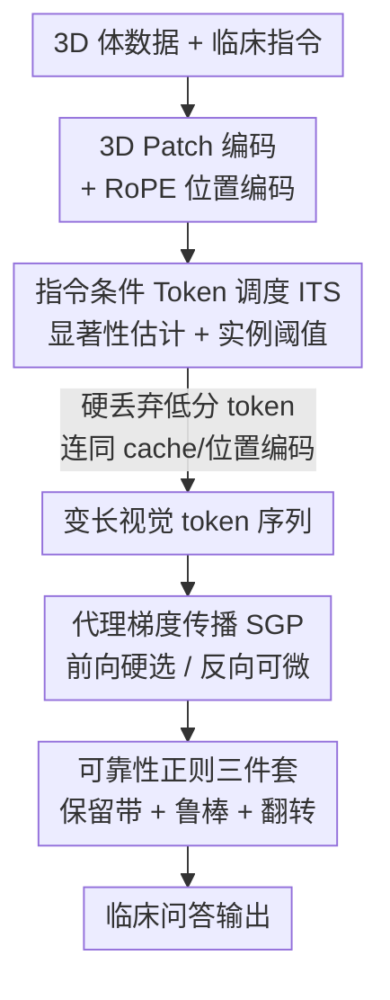

# Photon: Speedup Volume Understanding with Efficient Multimodal Large Language Models

**会议**: ICLR 2026  
**OpenReview**: [https://openreview.net/forum?id=xsSJw6jJBL](https://openreview.net/forum?id=xsSJw6jJBL)  
**代码**: 待确认  
**领域**: 多模态VLM / LLM效率 / 医学图像  
**关键词**: 3D 医学 MLLM, 视觉 token 剪枝, 变长 token, 指令感知, 代理梯度

## 一句话总结
Photon 是一个直接吃整段 3D 医学体数据（CT/MRI）的多模态大模型，用「指令条件 Token 调度（ITS）」按每个问题自适应地决定保留多少视觉 token，再用「代理梯度传播（SGP）」让离散丢 token 这件事在训练时仍然可微，从而在医学视觉问答上同时拿到 SOTA 精度、约 5 倍训练加速和约三分之二的显存节省。

## 研究背景与动机
**领域现状**：多模态大模型（MLLM）在临床视觉问答上很有前景，但把它扩展到 3D 影像（CT、MRI）非常吃算力——一段体数据切成 patch 后视觉 token 动辄上万。为了省成本，主流做法要么走 **slice-based** 路线（只挑若干 2D 切片喂进去），要么把整段体数据压成 **固定长度** 的少量视觉 token。

**现有痛点**：切片采样破坏了体数据的空间连续性、丢掉体素细节，还引入人为挑帧的偏置；固定长度压缩则无论扫描复杂度和问题焦点如何，都用同样数量的 token 表示，既限制高分辨率细节，又容易把「微小但临床关键」的病灶 token 一起压没。通用域的 token 剪枝方法（VisionZip、LLaVA-PruMerge 等）虽然能在推理时加速，但它们按注意力/相似度统一打分、**不看指令**，而且多用**固定剪枝比例**；ATP-LLaVA 引入了可学阈值，但训练时还保留软 mask，算力和显存要到推理阶段才真正降下来。

**核心矛盾**：医学里「不同问题关注不同器官/病灶、需要的 token 数量天然不同」，但现有方法要么剪枝不看指令、要么保留比例写死、要么省不到训练成本。本质矛盾是——**离散地、按指令地丢 token** 能同时省训练和推理，可一旦真把 token 硬丢掉，这一步就不可微，没法端到端训练阈值预测器。

**本文目标**：做一个原生 3D 的医学 MLLM，用**变长** token 序列表示体数据，既保住体素保真度、又能按每条指令自适应裁剪 token，并且让训练和推理用**同一套**裁剪逻辑。

**核心 idea**：用「指令条件 Token 调度」算出每个样本该保留哪些、保留多少 token 并**硬丢弃**（连同它们的 KV cache 和位置编码一起删），再用「代理梯度传播」在反向时把梯度重建回保留概率上，让离散丢 token 整体可微、可学。

## 方法详解

### 整体框架
Photon 把一个 3D 视觉编码器和一个大语言模型拼在一起，联合处理体数据扫描和临床指令。输入端，体数据被切成 $14\times14\times14$ 的不重叠 patch，每个 patch 线性嵌入成一个 token；为了平衡分辨率和序列长度，空间合并只在平面 $(H,W)$ 上以步长 $S$ 做、深度 $D$ 不动，得到视觉 token 数 $N_v = D\cdot\frac{H'}{S}\cdot\frac{W'}{S}$，并用 **RoPE 旋转位置编码**（区别于此前 3D 方法常用的绝对位置编码 APE）。视觉 token 和文本 token 拼成混合序列喂进 LLM。

整个流程的关键发生在 LLM 的某个选定层 $\ell$：在**前向**，ITS 先估计每个视觉 token 在当前指令下的显著性、再预测一个实例专属阈值，把低于阈值的 token 连同 cache 和位置编码一起硬删，序列就此变短；在**反向**，SGP 通过一条直通（straight-through）代理路径把梯度散射回原始 token 位置、并为阈值预测器构造代理梯度，保证「前向硬选 / 反向可微」用的是同一套选择逻辑。训练分两阶段：Phase 1 只微调改造过的 3D 视觉嵌入层做对齐（其余冻结），Phase 2 微调全部模块、通过上面的反传策略学会 token 裁剪阈值；并叠加三个轻量正则项稳住训练。

### 关键设计

**1. 指令条件 Token 调度 ITS：让每条指令自己决定保留多少 token**

这一步针对「固定剪枝比例不看指令」的痛点。ITS 由两块组成。第一块是**指令感知显著性估计（ISE）**：先在指令 token 内部算一个中心度 $c_t=\sum_{t'\in Q}\max(\frac{\langle q_t,k_{t'}\rangle}{\sqrt{\alpha}},0)$（排除对角线自匹配，只取正向强化），归一化成权重 $w_t=c_t/\sum_{t'}c_{t'}$，由此挑出「最核心的指令 token」；再用这些权重去算每个视觉 token 与指令的加权对齐分 $u_j=\sum_{t\in Q} w_t\frac{\langle q_t,k_j\rangle}{\sqrt{\alpha}}$，经实例内 min-max 归一化得到显著性 $\rho_j\in[0,1]$。第二块是**实例感知阈值预测器（ITP）**：光有 token 排名还不知道总共留几个，于是从 $\rho$ 和原始 logits $u$ 抽出三组互补统计量（分布形状、绝对尺度、压缩尾部）拼成描述子 $z=[\Psi(\rho),\Phi(u),\Upsilon(u)]$，再用一个轻量 MLP 映射成标量阈值 $\theta=\sigma(W_2\phi(W_1 z+b_1)+b_2)$。阈值和显著性一比就得到保留概率 $q_j=\sigma(\frac{\rho_j-\theta}{\tau_{ce}})$（$\tau_{ce}$ 很小使其逼近二值），再硬化成 mask $M_j=\mathbb{1}\{q_j>0.5\}$，$M_j=0$ 的 token 被整个删掉。这样「保留多少」是按每个扫描和每条指令动态定的，而不是全局写死一个比例。

**2. 代理梯度传播 SGP：让「硬丢 token」在训练时依然可微**

硬选 $M_j$ 一旦做下去，阈值预测器就收不到任何梯度——这是离散裁剪没法端到端训练的根源。SGP 用一条直通代理 mask 解决：$\widetilde{M}=\mathrm{sg}(M)-\mathrm{sg}(q)+q$，前向走硬选、反向让梯度顺着连续概率 $q$ 流。对保留下来的 token，上游梯度通过散射算子 $\frac{\partial L}{\partial T^\ell_{vis}}=S(\frac{\partial L}{\partial T^{\ell\prime}_{vis}};\widetilde{M})$ 散回原始位置，保持解码器激活可训。更关键的是给阈值预测器**重建梯度**：作者用一阶近似衡量每个 token 对 loss 的贡献 $\eta_j=\langle(T^\ell_{vis})_j,(\frac{\partial L}{\partial T^\ell_{vis}})_j\rangle$（激活与梯度的内积，越大越重要），标准化裁剪后经单调映射 $\psi$ 得到方向项 $d_j=0.5-\mathrm{sg}(r_j)$，再配一个由激活-梯度乘积累加得到的幅度项 $s_j$，最终合成对保留概率的代理梯度 $\frac{\partial L}{\partial q_j}\approx\beta\,d_j\,s_j\,\max\{q_j(1-q_j),\epsilon_{sat}\}$。效果是：被判定为更有信息量的 token 会被逐步推向保留，没用的逐步压制，且 $\epsilon_{sat}$ 防止 $q_j$ 贴近 0/1 时梯度消失，训练更稳。

**3. 可靠性正则三件套：防止裁剪退化和「不看图也敢答」**

只靠前后向学习，训练可能收敛到「几乎全留」或「剪过头」两个退化解，还可能让模型靠文本先验幻觉作答。Photon 加了三个轻量正则。**软保留带（Soft Retention Band）**：把平均保留比例 $r=\frac{1}{N_v}\sum_j q_j$ 软约束在 $[r_{min},r_{max}]$ 内，$L_{band}=\mathbb{E}[\max(0,r-r_{max})+\max(0,r_{min}-r)]$，避免留太多或剪太狠。**鲁棒正则（Robustness Regularizer）**：针对医学里特别危险的「language-only 幻觉」——视觉证据不足时也答得很自信。给一个被扰动（mask/shuffle）的体数据 $\tilde{x}$，要求模型输出更高不确定性 $L_{robust}=-\mathbb{E}_{\tilde{x}}[H(p_\theta(\cdot|\tilde{x}))]$，并在这些扰动样本上只优化这一项。**翻转正则（Flip Regularizer）**：以一定概率把保留 mask 整个反转（原本剪掉的留下、原本留的剪掉），如果模型在这种乱掉的 mask 下还能高置信答对，说明它在走文本捷径而非真看图，于是惩罚 $L_{flip}=-\mathbb{E}_{\widetilde{M}_{flip}}[\log(1-p_\theta(y|x,\widetilde{M}_{flip})+\epsilon)]$。总目标在 Phase 2 是 $L=(L_{CE}\,\text{或}\,L_{band}\,\text{或}\,L_{robust})+L_{flip}$。

### 损失函数 / 训练策略
两阶段训练。**Phase 1** 只对改造后的 3D 视觉 patch 嵌入层做轻量对齐（用体数据-caption 配对，ViT 主干、MLP aligner、LLM 解码器全冻结），仅用交叉熵 $L_{CE}$ 监督；**Phase 2** 解冻做任务微调，目标按样本类型在 $L_{CE}$ / $L_{band}$ / $L_{robust}$ 中切换并叠加 $L_{flip}$，让模型学会指令驱动的 token 裁剪阈值。ITS/SGP 作用在 LLM 的选定层 $\ell\in\ell_n$，消融显示放在 $\ell=\ell_n/4$ 时精度-效率折中最好。

## 实验关键数据

### 主实验
在 3D-RAD 基准的六类任务上，Photon-3B 全面拿到微调后最佳，最大增益出现在异常检测和图像观察（约 +14%），医学测量约 +7.3%，纵向时序诊断约 +3%。

| 基准 / 任务 | 指标 | Photon-3B | 最佳基线 | 说明 |
|------|------|------|------|------|
| 3D-RAD 存在性检测 | Acc | 83.07 | 82.43 (M3D-L2) | 微调设定最佳 |
| 3D-RAD 异常检测 | BLEU | 42.33 | ~ baseline | 描述类任务 +约14% |
| 3D-RAD 图像观察 | ROUGE | 56.66 | 50.52 (M3D-P3) | 描述类大幅领先 |
| DeepTumorVQA 多选总均 | Acc | 0.686 | 0.662 (RadFM) | +约3.6% |
| DeepTumorVQA 自由文本总均 | Acc | 0.619 | 0.555 (RadFM) | +约11.5% |

DeepTumorVQA 上，测量子类（MRA 评测）提升超过 35.3%，病灶计数等视觉推理子类增益超过 20.7%，说明它在定量精度和空间分析上尤其强。

### 与 token 剪枝方法对比 / 效率
在统一 Qwen2.5-VL 骨干、同样推理设定下，对比固定保留比例的剪枝方法（约 30/50/70% token，即每样本约 2.1K/3.5K/4.9K 视觉 token）：

| 方法 | E.D. Acc | S.T.D. Acc | 推理速度(Tok/s) | Token 数 |
|------|------|------|------|------|
| Qwen2.5-VL | 81.97 | 47.62 | 2.30 | 7.0K |
| VisionZip | 82.00 | 47.19 | 2.32 | 2.1K |
| HiPrune | 81.99 | 48.08 | 0.76 | 2.1K |
| **Photon** | **83.07** | **52.86** | **4.12** | 动态 |

固定比例剪枝几乎不涨点（它们不看指令、且不为训练加速设计），HiPrune 因与 FlashAttention 不兼容反而拖慢解码；Photon 既涨精度又把推理提到 4.12 Tok/s。相比微调版 Qwen2.5-VL，Photon 推理显存从 26.0GiB 降到 9.2GiB（约省三分之二）、训练速度从 0.15 提到 0.85 iter/s（>5 倍），推理约 1.9 倍。

### 消融实验

| 配置 | S.T.D. Acc | 训练速度 | 保留 token | 说明 |
|------|------|------|------|------|
| Photon (full) | 52.86 | 0.85 | 0.39K | 完整模型 |
| w/o ITS & SGP | 49.60 | 0.64 | 1.00K | 掉 >3% 且 token 翻倍、训练变慢 |
| w/o Photon Phase 1 | 52.20 | 0.84 | 0.45K | 去掉视觉对齐预热 |
| w/o Robust Reg. | 48.18 | 0.87 | 0.29K | 去鲁棒正则精度跌 |
| w/o Flip Reg. | 52.09 | 0.85 | 0.38K | 去翻转正则略降且不稳 |
| Vis. Ful. Ft. | 0.00 | — | — | 全量微调视觉栈→过拟合崩塌 |

### 关键发现
- **ITS+SGP 是性能与效率的核心**：去掉后 S.T.D. 精度掉 >3%、平均保留 token 从 0.39K 涨到 1.00K、训练变慢，证明指令条件裁剪同时省算力和保精度。
- **正则项不只是涨点**：去掉鲁棒/翻转正则不仅掉精度，还会让训练不稳、结果可靠性下降。
- **不要全量微调视觉栈**：从 Phase 1 检查点继续全量微调 ViT+aligner 会过拟合并丧失指令跟随能力（Vis. Ful. Ft. 直接崩到 0），印证两阶段「先对齐再任务微调」的必要性。
- **裁剪是临床聚焦的**：可视化显示问胸腔积液时保留胸腔区域、问肾囊肿时保留囊肿肾区，剪枝随问题焦点自适应而非均匀。

## 亮点与洞察
- **把「离散硬丢 token」做成可端到端训练**：直通代理 mask $\widetilde{M}=\mathrm{sg}(M)-\mathrm{sg}(q)+q$ 配上基于激活-梯度内积的重要性重建梯度，让前向真省算力、反向仍能学阈值——这套「前向硬选/反向可微」的解法可迁移到任何需要离散选择子集的高分辨率多模态任务。
- **变长而非定长 token**：跳出「固定比例」的窠臼，按指令复杂度动态给每个样本不同 token 预算，天然契合「不同临床问题关注不同器官」的医学特性。
- **翻转正则是个聪明的诊断式约束**：把 mask 反转后还高置信答对，恰好暴露模型在走文本捷径，用它当反例惩罚，直接逼模型「真看图」，对医学幻觉这种高危场景很对症。
- **3D 用 RoPE 替 APE**：相对位置编码让变长序列下的空间关系更稳，是支撑变长 token 的工程基础。

## 局限与展望
- 作者承认：受 KV Cache 影响，推理加速幅度比训练加速更温和（约 1.9 倍 vs >5 倍），收益稳定但有限。
- 方法依赖在选定层 $\ell$ 做一次性裁剪，层位置 $\ell=\ell_n/4$ 是经验最优，换骨干/任务可能需重新搜层。
- 自评：实验集中在两类医学 VQA 基准（3D-RAD、DeepTumorVQA），跨模态（如 MRI 之外）和真实临床分布外的鲁棒性尚待更大规模验证；鲁棒正则依赖人工设计的扰动（mask/shuffle），扰动种类对幻觉抑制效果的影响没有充分拆解。
- 改进思路：把单层一次裁剪扩展为多层渐进裁剪，或让阈值预测器对扰动类型自适应，可能进一步压低推理成本。

## 相关工作与启发
- **vs VisionZip / LLaVA-PruMerge**: 它们按注意力或相似度统一剪 token、固定比例、且只在推理省成本；Photon 指令感知打分 + 实例自适应阈值 + 训练期就硬丢 token，既不漏临床关键病灶又省训练算力。
- **vs ATP-LLaVA**: 同样追求自适应阈值，但 ATP-LLaVA 训练时仍保留软 mask，算力到推理才降；Photon 用 SGP 让训练期就能硬丢且可微。
- **vs RadFM / M3D（3D 医学 MLLM）**: 它们把每段扫描压成**固定长度**少量视觉 token，限制高分辨率细节；Photon 用变长 token 保住体素保真，并按指令动态裁剪。
- **vs OmniV-Med**: 同样支持变长序列，但其剪枝靠切片特征的 L1 相似度这种粗粒度准则，易误删微小病灶；Photon 的指令-视觉显著性更细、更对齐临床焦点。

## 评分
- 新颖性: ⭐⭐⭐⭐⭐ 把指令条件变长裁剪 + 离散丢 token 的可微训练在 3D 医学 MLLM 上打通，机制原创。
- 实验充分度: ⭐⭐⭐⭐ 两大医学 VQA 基准 + 与多种剪枝方法对比 + 细致消融与可视化，跨更多模态/分布外验证可再补。
- 写作质量: ⭐⭐⭐⭐ 公式与 pipeline 清晰，正则三件套动机讲得透。
- 价值: ⭐⭐⭐⭐⭐ 同时拿精度、训练加速和显存节省，对临床落地的 3D MLLM 很实用。

<!-- RELATED:START -->

## 相关论文

- [\[ICLR 2026\] PPE: Positional Preservation Embedding for Token Compression in Multimodal Large Language Models](ppe_positional_preservation_embedding_for_token_compression_in_multimodal_large_.md)
- [\[ICLR 2026\] iLLaVA: An Image is Worth Fewer Than 1/3 Input Tokens in Large Multimodal Models](illava_an_image_is_worth_fewer_than_13_input_tokens_in_large_multimodal_models.md)
- [\[ICLR 2026\] SURGE: Surprise-Guided Token Reduction for Efficient Video Understanding with VLMs](surge_surprise-guided_token_reduction_for_efficient_video_understanding_with_vlm.md)
- [\[ICLR 2026\] ST-SimDiff: Balancing Spatiotemporal Similarity and Difference for Efficient Video Understanding with MLLMs](st-simdiff_balancing_spatiotemporal_similarity_and_difference_for_efficient_vide.md)
- [\[CVPR 2026\] MASQuant: Modality-Aware Smoothing Quantization for Multimodal Large Language Models](../../CVPR2026/vlm_efficiency/masquant_modality-aware_smoothing_quantization_for_multimodal_large_language_mod.md)

<!-- RELATED:END -->
