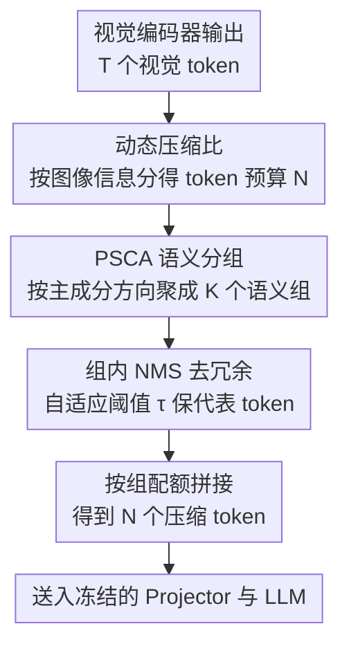

# Prune Redundancy, Preserve Essence: Vision Token Compression in VLMs via Synergistic Importance-Diversity

**会议**: ICLR 2026  
**OpenReview**: [https://openreview.net/forum?id=i36E5Ezm0H](https://openreview.net/forum?id=i36E5Ezm0H)  
**代码**: https://github.com/ZhengyaoFang/PruneSID  
**领域**: 多模态VLM / VLM效率  
**关键词**: 视觉token压缩, 训练免训, 重要性-多样性, 语义聚类, 非极大值抑制

## 一句话总结
PRUNESID 是一个训练免训（training-free）的视觉 token 压缩框架，用「语义主成分聚类（PSCA）+ 组内非极大值抑制（NMS）」两阶段流水线同时兼顾 token 的语义重要性和信息多样性，并按图像复杂度动态分配 token 预算，在 LLaVA-1.5 上只保留 11.1% token 就拿到 96.3% 的相对精度，在 LLaVA-NeXT 极端压缩（5.6%）下仍保 92.8%。

## 研究背景与动机
**领域现状**：当下的视觉语言模型（VLM）把一张图编码成大量视觉 token 喂给 LLM——LLaVA-1.5 每张图生成 576 个 token，LLaVA-NeXT 因切分高分辨率图最多到 2880 个。这些 token 数量远超表达图像语义所需，已有研究表明大约 70% 的视觉 token 可以丢弃而几乎不掉精度，因此训练免训的 token 压缩成了提升推理效率的主流方向。

**现有痛点**：现有压缩方法可归为两类，各有硬伤。一类是**注意力引导**（如 SparseVLM、FastV、VisionZip），按注意力分数保留显著区域，但会系统性地忽略背景上下文，而且多个高注意力 patch 常常落在同一个物体上，造成「冗余 token 重复保留」，把模型容量浪费在重复内容上。另一类是**去重引导**（如 DART、DivPrune），通过相似度剪枝去掉重复 token，提升了多样性，却不充分考虑 token 级的语义重要性，可能误删掉高注意力的关键 token，导致特征表示残缺或失真。

**核心矛盾**：两类方法暴露出 token 压缩里的根本张力——注意力引导保住了局部显著性却牺牲信息多样性，去重引导提升了多样性却牺牲显著性保留。重要性（importance）和多样性（diversity）这两个目标在高压缩比下难以同时满足。

**本文目标**：设计一个训练免训、任务无关的压缩框架，在高压缩比下**同时**优化重要性保留和信息多样性，并能跨不同 VLM 架构、图像与视频模态通用。

**切入角度**：作者观察到，如果先把 token 按「语义概念」分成若干连贯的组，就能保证概念覆盖的全面性（每个概念都有代表）；再在每个组**内部**做去重，就能在不丢概念的前提下压掉冗余。这样「跨组保多样、组内保重要」就把两个目标拆解到不同阶段分别解决，而不是在一个打分里强行权衡。

**核心 idea**：用「语义分组（保多样）+ 组内 NMS（保重要、去冗余）」的两阶段协同流水线代替单一打分式选择，再叠加一个按图像复杂度自适应分配 token 预算的动态压缩比机制。

## 方法详解

### 整体框架
给定输入图像，VLM 的视觉编码器先产出一串视觉 token 嵌入 $X=\{x_1,\dots,x_T\}\in\mathbb{R}^{T\times D}$，目标是压成一个紧凑子集 $\tilde{X}\in\mathbb{R}^{N\times D}$（$N\ll T$），同时既保住语义显著的视觉模式，又保持下游语言建模所需的信息完整性。PRUNESID 把这件事拆成两阶段：先用**语义主成分分析（PSCA）**把 token 聚成若干语义连贯的组，确保概念覆盖全面；再在每组内用**非极大值抑制（NMS）**剪掉冗余 token、只留最有代表性的少数 token。在此之上，再套一层**信息感知的动态压缩比**机制，根据每张图的内容复杂度调整保留预算 $N$。整套流程不需要训练，直接插在视觉编码器之后、LLM 之前（early compression），因此能显著减少送进 LLM 的序列长度。

### 关键设计

**1. PSCA 语义主成分聚类：把 token 按语义方向分组以保证概念覆盖**

这一步针对「注意力引导忽略背景、概念覆盖不全」的痛点。和常规 PCA 在特征维度上找方差主方向不同，PSCA 把 **token 维度本身**当作要分析的语义轴，通过跨 token 的变化去发现反映连贯视觉概念（物体、背景、纹理）的全局语义方向。具体做法：先对每个元素过 sigmoid 把特征缩放到有界可比的范围，再沿 token 维去中心化，得到零均值矩阵 $X_{ctr}=\sigma(X)-\mu$，其中 $\mu=\frac{1}{T}\sum_{i=1}^{T}\sigma(x_i)$。然后对其转置做低秩 PCA 分解 $X_{ctr}^{\top}\approx USV^{\top}$，其中 $V\in\mathbb{R}^{T\times K}$ 的列 $\{v_1,\dots,v_K\}$ 是 token 维上的 $K$ 个主方向，而每一行 $|V_{i,:}|$ 表示第 $i$ 个 token 对各主成分的贡献强度。最后把每个 token 分到它绝对贡献最大的那个方向：$g(i)=\arg\max_j |V_{i,j}|$，从而把 $T$ 个 token 切成 $K$ 个语义连贯的组 $\{G_1,\dots,G_K\}$。这样每个组对应一类共享语义，天然保证了不同概念都有代表 token 被选中，而不是全挤在高注意力前景上。

**2. 组内 NMS 冗余消除：在每组内去重以压掉重复 token**

这一步针对「同一物体多个相似 patch 被重复保留」的痛点。同一组内的 token 在密集纹理或显著物体区域常有大量空间/语义重叠，作者借鉴目标检测里的 NMS 来组内去重：每个 token $x_i$ 拿它对所属组主方向的贡献作为选择分数 $s_i=|V_{i,g(i)}|$，组内按 $s_i$ 从高到低排序，贪心地保留一个 token 当且仅当它与已保留 token 的最大相似度低于阈值 $\tau$。关键在于阈值不是固定的，而是随图像整体冗余度自适应：先算全图平均成对相似度作为冗余分数 $\rho=\frac{2}{T(T-1)}\sum_{i=1}^{T}\sum_{j=i+1}^{T}\mathrm{sim}(x_i,x_j)$（相似度是 $\ell_2$ 归一化后的余弦），再令 $\tau=\lambda\cdot\rho$，其中 $\lambda=\frac{N}{32}$ 由全局预算决定。冗余度高的图阈值更大、抑制更强。去重后各组得到精炼子集 $\tilde{G}_k$，再按各组规模分配配额 $n_k$（$\sum_k n_k=N$，$n_k$ 由 $\frac{|\tilde{G}_k|}{\sum_j|\tilde{G}_j|}\cdot N$ 取整得到），从每组取分数最高的 $n_k$ 个 token 拼成最终集合 $\tilde{X}=\bigcup_{k=1}^{K}\mathrm{Top}_{n_k}(\tilde{G}_k)$。「分数选重要、相似度去冗余」让它既保住关键 token 又压掉重复，正好补上去重引导方法丢重要 token 的短板。

**3. 信息感知的动态压缩比：按图像复杂度跨图分配预算**

这一步针对「固定压缩比对所有图一刀切」的痛点——复杂场景下固定 $N$ 不够导致信息损失过大，简单场景下又冗余浪费。复用上面的冗余度 $\rho$，作者定义图像信息分数 $\phi=1-\rho$，$\phi$ 越大说明语义越多样、冗余越少。然后让每张图保留的 token 数 $N'$ 正比于其信息分数（$N'\propto\phi$）：信息丰富的图多分 token，简单的图压得更狠。在保证每个 benchmark 平均保留 token 数与固定预算设置一致的前提下，这种自适应分配显著提升了图间差异大的数据集上的平均信息保留，从而带来整体性能增益（论文中记为 PRUNESID-Dyn 变体）。

> 理论上作者给了一个支撑：把 token 集合的信息量用包含-排斥原理下界化为 $\mathrm{Inform}(S')\geq\sum_{s_i\in S'}I(s_i)-\sum R(s_i,s_j)$，PSCA 通过选主方向投影最大的 token 来最大化第一项（语义信息），NMS 通过相似度约束 $R(s_i,s_j)\leq\epsilon$ 来最小化第二项（冗余），两者协同近似求解 $\max_{|S'|=N}\sum I(s_i)\ \text{s.t.}\ R(s_i,s_j)\leq\epsilon$。

## 实验关键数据

### 主实验
在 LLaVA-1.5（576 token 上界）上，保留 64/128/192 token 三档下 PRUNESID-Dyn 都拿到平均最优；下表为保留 64 token（↓88.9%）这一极端档的对比：

| 方法 | 保留 token | POPE | MME | SEED | 平均相对性能 |
|------|-----------|------|------|------|------|
| Vanilla（上界） | 576 | 85.9 | 1862 | 60.5 | 100% |
| DivPrune (CVPR25) | 64 | 85.6 | 1638 | 55.4 | 94.6% |
| VisionZip (CVPR25) | 64 | 77.0 | 1690 | 54.5 | 94.0% |
| **PRUNESID** | 64 | 83.8 | 1733 | 56.1 | 95.9% |
| **PRUNESID-Dyn** | 64 | 84.1 | 1734 | 56.2 | **96.3%** |

在高分辨率 LLaVA-NeXT（2880 token）上，越极端压缩优势越大：保留 640/320/160 token 时分别比 VisionZip 高 0.9/1.5/2.5 个点，最极端的 160 token（仅 5.6%）下仍保 92.8% 相对性能（VisionZip 90.3%）。方法还泛化到 Mini-Gemini（不同视觉骨干）和视频任务 Video-LLaVA：后者把每帧 256 token 压到 17 个（仅 6.6%，全视频 2048→136 token），平均仍达 95.5%，优于 VisionZip 的 93.2%。论文还报告相比原模型有 7.8× 的 prefilling 加速。

### 消融实验

| 配置 | 平均相对性能 | 说明 |
|------|------|------|
| random 分组 | 94.8% | token 打乱后均匀分组 |
| KMeans 分组 | 95.6% | 直接在 token 特征上聚类 |
| **PSCA 分组** | **96.8%** | 利用局部主子空间结构，语义更连贯 |

- **分组方式**：PSCA 在四个 benchmark 上一致优于随机分组和 KMeans，说明按主成分方向形成的语义连贯组确实带来更有效的冗余消除。
- **组数 $K$**：性能随 $K$ 呈钟形——组太少则冗余建模粒度不足，组太多则每组太小、剪枝不稳定；最优近似 $K=\frac{N}{4}$，验证了让 $K$ 随 $N$ 成比例增长的启发式。
- **ViT 取层**：用中后层（第 16、22 层）特征做 PSCA 分组效果最好；早期层（0、2）语义弱，最后一层（23）反而略降，因为第 22 层特征直接用于 LLM 训练、最贴合分组所需的语义。

### 关键发现
- 动态压缩比（-Dyn）的增益在不同 benchmark 上不均匀，在图间复杂度差异大的数据集上收益更明显，因为那里「按需分配预算」的空间才大。
- 压缩比越极端，PRUNESID 相对优势越大（64 token 比 192 token 时领先 VisionZip 更多），说明两阶段协同在严苛预算下更能体现「保重要 + 保多样」的价值。

## 亮点与洞察
- **把 PCA 用反了维度**：常规 PCA 在特征维找方差主方向，PSCA 改在 token 维上找语义方向，巧妙地把「无监督聚类语义概念」这件事变成一次低秩分解，无需任何额外网络或训练。
- **目标解耦到两阶段**：与其在一个打分函数里硬权衡重要性与多样性，不如「跨组保多样、组内保重要」分而治之，这个拆解思路可迁移到其他需要在覆盖度和密度间取舍的选择问题（如检索去重、关键帧选取）。
- **阈值随冗余度自适应**：NMS 阈值 $\tau=\lambda\rho$ 让去重强度跟着图像本身的冗余走，而不是全局定死，这种「用数据统计量自校准超参」的写法很实用。

## 局限与展望
- 方法依赖每张图做一次低秩 PCA 分解和全图成对相似度计算（$O(T^2)$），在 token 数极大时这部分预处理开销值得关注，论文主要强调 prefilling 加速而未细究分组本身的成本。
- $\lambda=\frac{N}{32}$、$K=\frac{N}{4}$、取第 22 层这些设置是经验调出来的启发式，跨到差异更大的新架构时是否仍最优需要重新验证。
- 动态压缩比按 $\phi=1-\rho$ 线性分配预算，分配函数较简单，是否还有更优的预算-复杂度映射可探索。

## 相关工作与启发
- **vs VisionZip / HiRED（注意力引导）**：它们靠注意力保显著区域，但忽略背景且易重复保留同一物体；PRUNESID 用语义分组保证概念覆盖、组内 NMS 去重，在 64 token 极端档比 VisionZip 高约 1.9 个点。
- **vs DART / DivPrune（去重引导）**：它们靠相似度剪枝提升多样性，却可能误删高重要性 token；PRUNESID 在组内用主方向贡献分数作为重要性度量来选代表，兼顾了重要性，因而在保多样的同时不丢关键语义。

## 评分
- 新颖性: ⭐⭐⭐⭐ 把 PCA 重定义到 token 维做语义分组、再两阶段解耦重要性与多样性，角度新颖且训练免训。
- 实验充分度: ⭐⭐⭐⭐⭐ 覆盖 LLaVA-1.5/NeXT、Mini-Gemini、Video-LLaVA 多架构与图像/视频模态，多压缩档 + 分组/组数/取层消融齐全。
- 写作质量: ⭐⭐⭐⭐ 动机-方法-理论-实验链条清晰，公式与图示到位。
- 价值: ⭐⭐⭐⭐ 训练免训、即插即用、跨模态通用，对 VLM 推理提效有直接实用价值。

<!-- RELATED:START -->

## 相关论文

- [\[ICLR 2026\] Mixing Importance with Diversity: Joint Optimization for KV Cache Compression in Large Vision-Language Models](mixing_importance_with_diversity_joint_optimization_for_kv_cache_compression_in_.md)
- [\[ICLR 2026\] IVC-Prune: Revealing the Implicit Visual Coordinates in LVLMs for Vision Token Pruning](ivc-prune_revealing_the_implicit_visual_coordinates_in_lvlms_for_vision_token_pr.md)
- [\[ICLR 2026\] SURGE: Surprise-Guided Token Reduction for Efficient Video Understanding with VLMs](surge_surprise-guided_token_reduction_for_efficient_video_understanding_with_vlm.md)
- [\[ICLR 2026\] VisionTrim: Unified Vision Token Compression for Training-Free MLLM Acceleration](visiontrim_unified_vision_token_compression_for_training-free_mllm_acceleration.md)
- [\[CVPR 2026\] ApET: Approximation-Error Guided Token Compression for Efficient VLMs](../../CVPR2026/vlm_efficiency/apet_approximation-error_guided_token_compression_for_efficient_vlms.md)

<!-- RELATED:END -->
